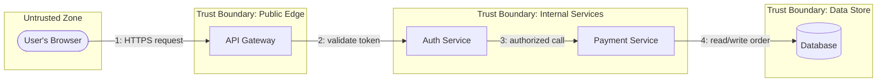

# Chapter 2 — Threat Modeling

## Learning Objectives

By the end of this chapter you will be able to:

- Define threat modeling precisely and explain why it is a proactive, not reactive, security practice
- Walk through all six STRIDE categories with a concrete example for each, using one running system
- Draw a data-flow diagram (DFD) with trust boundaries and use it to structure a STRIDE walkthrough
- Define attack surface and explain the practical discipline of minimizing it deliberately
- Prioritize threats using a simple likelihood × impact model and explain why threat modeling is about informed tradeoffs, not eliminating all risk
- Explain when and how often to threat model in an ongoing DevSecOps workflow

---

## Prerequisites for This Chapter

- **Chapter 1 (Introduction to DevSecOps)** — required. This chapter assumes you understand shift-left security and why catching problems early is dramatically cheaper than catching them late; threat modeling is the practice that operationalizes "as early as possible" at the design stage.
- **Advanced Kubernetes, Chapter 2 (RBAC)** and **Chapter 13 (Auditing)** — referenced directly in this chapter's STRIDE walkthrough.
- **Cloud Fundamentals AWS, Chapter 5 (Storage)** and **Chapter 10 (Security)** — referenced for the Information Disclosure example.
- **Monitoring & Logging, Chapter 1** — the "checkout service" example system used throughout that course is reused here as the running example, purely for continuity; no specific monitoring knowledge is required to follow along.

---

## 2.1 What Threat Modeling Is, and Why It's Proactive

**Threat modeling** is a structured process for identifying what could go wrong in a system, from an adversary's perspective, before it's built — or as part of deliberately reviewing an existing design. The emphasis on "from an adversary's perspective" is the entire point: instead of asking "does this feature work correctly under normal use," threat modeling asks "how could someone deliberately misuse this, and what would they gain?"

Contrast this directly with **reactive security** — the default mode most teams operate in without realizing it. Reactive security finds problems after they're exploited: a penetration test finds a flaw the week before launch, a bug bounty report arrives after a researcher found it independently, or worse, an actual attacker finds it first and the team learns about the flaw from an incident, not a report. Every one of those is still valuable, but all three share the same structural weakness: the vulnerable design already exists, has often already shipped, and now has to be found, understood, and fixed under pressure, on someone else's timeline.

Threat modeling flips that order. It happens *before* a line of code is written, or as a deliberate review of a design that already exists, specifically so the question "how could this be attacked?" gets asked while the answer is still cheap to change — a design decision, not a hotfix. This is the same shift-left economics from Chapter 1, applied to the very first stage of the lifecycle: planning.

It's worth being honest about what threat modeling is *not*. It is not a guarantee that a system will be secure — no process offers that. It is not a one-time certificate you earn and then forget about (section 2.6 addresses this directly). And it is not a purely academic exercise for security specialists — the most effective threat modeling happens in the same design review meeting where the engineers who will actually build the system are already gathered, asking one additional, deliberate question about their own design: "how would I attack this?"

### An analogy: the locksmith mindset

A useful mental model, borrowed from physical security, is the difference between a builder and a locksmith looking at the same door. A builder asks, "does this door open and close correctly, and does the lock turn?" — a functional question, answered by using the door normally. A locksmith asks a different question entirely: "if I wanted to get through this door without a key, how would I do it? Pick the lock? Remove the hinge pins? Kick it in?" — an adversarial question, answered by deliberately trying to defeat the thing rather than use it as intended.

Every engineer, by default, thinks like the builder when reviewing their own design — which is natural, since they built it to work, not to be attacked. Threat modeling is the discipline of deliberately, temporarily adopting the locksmith's mindset for the same design: not "does this work?" but "if I wanted to abuse this, how would I?" STRIDE is valuable precisely because it gives that adversarial mindset six specific doors to check, rather than leaving "think like an attacker" as a vague, easy-to-skip instruction.

---

## 2.2 STRIDE: The Six Categories of Things That Go Wrong

**STRIDE** is the most widely used practical threat modeling framework, originally developed at Microsoft in the late 1990s by Loren Kohnfelder and Praerit Garg as a way to make security review something an ordinary engineer could do consistently, rather than something that only made sense in the head of a specialist. It breaks "what could go wrong" into six concrete categories, each with a memorable name, which turns a vague, intimidating question ("is this secure?") into six specific, answerable ones ("could this be spoofed? Tampered with? Repudiated?" and so on). That design goal — making threat modeling something any engineer can run, not a specialist-only ritual — is exactly why it's the framework this course teaches, and exactly why it has remained the industry default more than two decades later.

To keep every category concrete rather than abstract, this section walks through all six using one running example: the **checkout API**, the same system used as a running example throughout the Monitoring & Logging course. Assume the same architecture: a user's browser talks to an API Gateway, which routes to an Auth Service, which authorizes a call to a Payment Service, which reads and writes to a Database.

| STRIDE Category | What It Means | Concrete Example on the Checkout API |
|---|---|---|
| **S**poofing | Pretending to be someone or something you're not | An attacker forges a JWT that claims to be a different, higher-privilege user, and the Payment Service accepts it without properly verifying the signature |
| **T**ampering | Unauthorized modification of data, in transit or at rest | An attacker intercepts the request between the API Gateway and the Payment Service and modifies the order's price field from $499 to $4.99 before it reaches the database |
| **R**epudiation | Performing an action and then being able to deny it, because the system has no way to prove otherwise | A user disputes a large charge, claiming they never authorized it — and the checkout system has no audit trail proving which authenticated identity actually triggered the payment |
| **I**nformation Disclosure | Exposing data to someone not authorized to see it | An engineer accidentally leaves an S3 bucket used for order-confirmation PDFs publicly readable, exposing every customer's order history and partial payment details to anyone with the URL |
| **D**enial of Service | Making the system unavailable to legitimate users | An attacker floods the checkout API's "apply discount code" endpoint with requests, exhausting the Payment Service's connection pool and making checkout fail for every real customer |
| **E**levation of Privilege | A low-privilege actor gaining higher privileges than they should have | A customer-support engineer, whose role should only allow viewing order status, discovers their Kubernetes ServiceAccount token also grants `delete` on Deployments across the whole cluster, because of an overly broad `ClusterRoleBinding` |

Each of these six categories has a direct countermeasure that should already feel familiar, because every one of them was covered — as a mechanism, not yet as a threat-modeling countermeasure — somewhere earlier in this roadmap:

- **Spoofing** is countered by strong authentication: verifying JWT signatures properly, using mutual TLS between services, and the Kubernetes ServiceAccount token verification you'll see again in Chapter 3's Vault authentication discussion.
- **Tampering** is countered by integrity controls: TLS in transit, checksums, and treating any data crossing a trust boundary as untrusted until validated.
- **Repudiation** is countered directly by **audit logging** — this is precisely why Advanced Kubernetes Chapter 13's audit logging exists: without a tamper-evident record of who did what and when, a system has no way to refute a repudiation claim, whether that claim is a customer disputing a charge or an insider denying they made a destructive `kubectl delete`.
- **Information Disclosure** is countered by access control and encryption at rest — the exact discipline AWS Chapter 5 (Storage) and Chapter 10 (Security) covered for S3 bucket policies, applied here as a threat-modeling category rather than just a configuration checklist.
- **Denial of Service** is countered by rate limiting, autoscaling, and resource limits — themes from Kubernetes Basics and Advanced Kubernetes' resource-management chapters, now reframed as deliberate defenses against an adversary rather than just good capacity planning.
- **Elevation of Privilege** is countered directly by RBAC least-privilege — this is exactly the mistake Advanced Kubernetes Chapter 15 (Common Mistakes) warned about under "granting `cluster-admin` broadly": Advanced Kubernetes Chapter 2 taught you *how* to write a narrowly-scoped `Role`; STRIDE's Elevation of Privilege category is *why* that narrow scoping matters in the first place.

Notice the pattern: STRIDE doesn't introduce six new tools. It gives you six specific lenses to point at a system you're designing, each one mapping to a mechanism you likely already know how to build — the value is in remembering to ask the question early enough to matter.

---

## 2.3 The Practical Exercise: Data-Flow Diagrams and Trust Boundaries

STRIDE is most useful when applied systematically, not as a free-floating brainstorm. The standard, practical way to do this is:

1. **Draw a data-flow diagram (DFD)** of the system — the components, and the data flowing between them.
2. **Mark trust boundaries** — every place where data crosses from one zone of trust into another (e.g., from the public internet into your infrastructure, or from an unprivileged service into one that holds sensitive data).
3. **Walk each element and each trust-boundary crossing against all six STRIDE categories**, asking, deliberately, "could this happen here?"

Here is the checkout API's DFD, with trust boundaries marked:



The value of drawing this explicitly, rather than reasoning about it in your head, is that trust boundaries — the dashed lines between zones — are exactly where most real vulnerabilities live. Data crossing boundary 1 (public internet → API Gateway) is the least trusted data in the entire system and must be treated as hostile by default. Data crossing boundary 3 (Auth Service → Payment Service) is more trusted, but *only if* the Auth Service actually did its job — which is exactly the kind of assumption STRIDE forces you to state explicitly and question, rather than leave implicit.

### Who should be in the room

A STRIDE walkthrough works best as a short, focused working session rather than a solo exercise or a document one person writes alone. In practice, the most useful sessions include the engineers who actually designed the component being modeled (they know the real data flow, not just the intended one), at least one person who wasn't involved in the design (a fresh, adversarial perspective catches assumptions the designers didn't realize they were making), and, when available, someone with security or platform expertise to sanity-check the countermeasures being proposed. Thirty to sixty minutes, with the DFD already drawn beforehand so the session is spent thinking about threats rather than drawing boxes, is usually enough for a component of the checkout API's size.

Now walk each crossing against STRIDE, asking "could this happen here?":

| Crossing | S | T | I | Notes |
|---|---|---|---|---|
| Boundary 1 (Browser → Gateway) | Could a request be spoofed as coming from a different user? | Could a request body be tampered with in transit? | Could error responses leak internal details? | Highest-risk boundary — completely untrusted input |
| Boundary 3 (Auth → Payment) | Does Payment blindly trust "Auth already checked this," or does it verify independently? | Could the authorization decision be tampered with between the two services? | — | A common real-world mistake: internal services trusting each other implicitly because they're "inside the perimeter" |
| Boundary 4 (Payment → Database) | — | Could a crafted input reach the database as a malicious query (SQL injection)? | Could a database misconfiguration expose data beyond what Payment is authorized to read? | The last line of defense before data is compromised at rest |

This table isn't exhaustive — a real threat-modeling session would also apply Repudiation, Denial of Service, and Elevation of Privilege to each crossing, and to each component individually, not just the boundaries. The point of the exercise is the discipline of walking every crossing against every category systematically, rather than relying on whichever threat happens to come to mind first.

### STRIDE vs. other frameworks: why this course teaches STRIDE

STRIDE is not the only threat modeling framework in use, and it's worth knowing the landscape briefly so you recognize the alternatives if you encounter them, even though this course only goes deep on STRIDE.

| Framework | Approach | When It's Typically Used |
|---|---|---|
| **STRIDE** | Six fixed categories applied systematically to a DFD | Design review, general-purpose, easiest to teach and apply consistently across a team |
| **PASTA** (Process for Attack Simulation and Threat Analysis) | A seven-stage, risk-centric process that ties threats to business impact and simulates attacker behavior in more depth | Larger, higher-stakes systems where a lightweight pass isn't sufficient |
| **DREAD** | A scoring model (Damage, Reproducibility, Exploitability, Affected users, Discoverability) for ranking already-identified threats | Often used *alongside* STRIDE, as a more granular alternative to the likelihood × impact grid in section 2.5 |

STRIDE is this course's choice — and the industry's most common default — because it is fast to teach, fast to apply, and produces consistent results across engineers with very different backgrounds, which matters enormously for a practice meant to be run routinely by ordinary delivery teams (section 2.6) rather than only by dedicated security specialists.

---

## 2.4 Attack Surface Analysis

The **attack surface** of a system is every point where an attacker could interact with or affect it. For the checkout API, that includes: the public API Gateway endpoints, any admin interface used to manage products or refunds, every third-party dependency the services pull in (foreshadowing Chapters 5 and 7's SCA and supply chain coverage), the CI/CD pipeline's credentials that can deploy new code to any of these services (foreshadowing Chapter 11), and any cloud storage bucket the system writes to.

Threat modeling identifies *specific* threats against a *specific* design. Attack surface analysis is the complementary, broader discipline of asking: **independent of any specific threat, how many places does this system expose to the outside world, and can that number be reduced?** Every additional exposed endpoint, every additional third-party dependency, every additional piece of infrastructure with public network access is one more thing that has to be individually secured, monitored, and kept patched — and the practical, sustainable answer is not "secure everything perfectly," it's "have less to secure in the first place."

Concretely, minimizing attack surface means:

- **Fewer exposed endpoints.** An internal admin API that only three employees ever use should not be reachable from the public internet at all — it should sit behind a VPN or an internal-only network path, removing it from the attack surface entirely rather than relying on authentication alone to protect it.
- **Least-privilege by default, applied at the whole-system level.** Advanced Kubernetes Chapter 2 taught RBAC least-privilege *within* a cluster — a Role should grant only the verbs and resources a workload actually needs. Attack surface analysis applies the identical principle one level up, to the whole system: a service should only be reachable by the services that actually need to call it, a database should only accept connections from the application tier that needs it, and a third-party dependency should only be pulled in if it's actually used, not left in as unused dead weight that still has to be patched every time a CVE is disclosed against it.
- **Removing what's unused.** An old, forgotten staging endpoint left publicly reachable after a feature launched is pure attack surface with zero business value — the discipline is treating "is this still needed?" as a recurring question, not a one-time decision made at launch and never revisited.

```
Attack surface of the checkout API, before and after deliberate reduction:

BEFORE                                    AFTER
─────────────────────────────            ─────────────────────────────
Public API Gateway  ●                    Public API Gateway  ●
Public admin UI      ●  ← removable      Public admin UI      (moved behind VPN)
Forgotten staging    ●  ← removable      Forgotten staging    (decommissioned)
endpoint (still live)                    endpoint
12 third-party deps  ● ● ● ● ● ● ● ● ●   9 third-party deps   ● ● ● ● ● ● ● ● ●
  (3 unused)            ● ● ●              (unused ones removed)
Public S3 bucket     ●  ← tightened      Public S3 bucket     (private, IAM-scoped)

Every "●" is one more thing that must be individually secured, monitored, and patched.
Fewer of them is a strictly better starting position, independent of any specific threat.
```

Attack surface reduction and STRIDE-based threat modeling are complementary, not redundant: threat modeling asks "given this exact design, what specifically could go wrong at each point?" while attack surface analysis asks the prior, broader question, "how many points are there to worry about in the first place, and can that number simply be smaller?" A smaller attack surface makes every subsequent threat-modeling session faster and more tractable, because there is less to walk through.

---

## 2.5 Risk Prioritization: Not All Threats Are Equal

A thorough STRIDE walkthrough of a nontrivial system will surface far more potential threats than any team has time or budget to fix immediately — and that is fine, because eliminating all risk is neither possible nor cost-effective. The purpose of threat modeling is not to reach zero risk; it's to make *deliberate, informed* decisions about which risks to fix now, which to accept, and which to mitigate with a compensating control instead of a full fix.

A simple, practical way to make that decision consistently is to score each identified threat on two dimensions:

- **Likelihood** — how plausible is it that this gets exploited, given the attacker's required skill, access, and motivation?
- **Impact** — if it is exploited, how bad is the outcome — data breach, financial loss, downtime, reputational damage?

A simplified qualitative grid (High/Medium/Low on each axis) is usually sufficient for most teams — it doesn't need to be a precise numeric formula to be useful:

| | Impact: Low | Impact: Medium | Impact: High |
|---|---|---|---|
| **Likelihood: High** | Fix soon | Fix now | Fix immediately |
| **Likelihood: Medium** | Accept or backlog | Fix soon | Fix now |
| **Likelihood: Low** | Accept | Accept or backlog | Mitigate with compensating control |

Applying this to the checkout API's earlier findings: a forged JWT accepted due to a signature-verification bug (Spoofing) is High likelihood (JWTs are a well-known, widely-attacked mechanism) and High impact (full account takeover) — fix immediately, before shipping. A theoretical Denial-of-Service attack requiring an attacker to control a botnet large enough to overwhelm a well-autoscaled service might be Low likelihood and Medium impact — reasonable to accept for now, or mitigate cheaply with rate limiting rather than building an elaborate DDoS-mitigation system for a threat that may never materialize.

The pragmatic mindset this framework is meant to instill: threat modeling produces a *prioritized list of engineering tradeoffs*, not a mandate to fix everything. A team that treats every finding as equally urgent will burn out chasing low-value fixes while a genuinely dangerous one sits in the same backlog, unprioritized, indistinguishable from the noise around it.

### Three legitimate responses to a threat, not just one

It's worth being explicit that "fix it" is only one of three legitimate outcomes of prioritizing a threat, and treating the other two as failures is itself a mistake:

- **Fix it.** The straightforward case for anything landing in "fix now" or "fix immediately" — change the design or code so the threat no longer applies.
- **Accept it.** For genuinely low likelihood, low impact threats, a deliberate, documented decision to accept the risk as-is is often the *correct* engineering call — spending a sprint hardening against a threat that's unlikely to matter is a real opportunity cost against other work, including other, more dangerous threats.
- **Mitigate with a compensating control.** Sometimes the "correct" fix is expensive or slow (rearchitecting an entire authentication flow, for instance), but a cheaper, partial mitigation meaningfully reduces the risk in the meantime — for example, adding aggressive rate limiting around a Denial-of-Service-prone endpoint while a proper caching layer is still being built. A compensating control is not a permanent substitute for fixing the underlying issue, but it's a legitimate way to reduce exposure now rather than waiting for the full fix.

The failure mode to avoid is treating "accept" as embarrassing and therefore never writing it down — an *undocumented*, silent acceptance of risk (nobody decided, it just never got prioritized) is very different from a *deliberate*, documented one (the team looked at it, understood the tradeoff, and consciously chose not to act yet). The second is a normal, healthy part of engineering; the first is how organizations get blindsided by a risk everyone individually half-remembered but nobody owned.

---

## 2.6 When and How Often to Threat Model

Threat modeling is not a one-time exercise performed once at a project's inception and then filed away. Revisit it whenever a system's architecture changes meaningfully:

- A new external integration is added (a new third-party API, a new webhook receiver)
- A new data store is introduced, especially one holding sensitive data
- A new trust boundary is created (a new service exposed publicly that was previously internal-only, or a new team gaining access to a shared system)

The practical, sustainable pattern is **lightweight, incremental threat modeling integrated into design review** — spending fifteen minutes on a STRIDE walkthrough of *just the new piece* being added to an already-modeled system, using the existing DFD as a starting point rather than starting from a blank page. This is far more sustainable than the alternative many organizations default to: a rare, heavyweight annual threat-modeling exercise that tries to model an entire, sprawling system in one multi-day workshop. That kind of exercise routinely gets deprioritized under deadline pressure ("we'll do it next quarter"), and even when it happens, it's frequently stale by the time it's finished, because the system kept changing underneath it. A small, incremental habit attached to every meaningfully-sized design review survives deadline pressure far better than a large, infrequent ritual — the same "small and continuous beats large and rare" principle that motivates CI/CD's frequent small deployments over infrequent large ones.

| Trigger | Scope of the Threat-Modeling Session |
|---|---|
| A new external integration (third-party API, webhook) | Just the new integration's data flow and the trust boundary it introduces |
| A new data store, especially one holding sensitive data | The new store, and every path that reads from or writes to it |
| A new trust boundary (a previously internal service becomes public, or a new team gains access) | The specific boundary that changed, re-walked against all six STRIDE categories |
| Routine, no architectural change | No dedicated session needed — the existing model still holds |

Findings from any of these sessions should land in the same place your team already tracks other engineering work — a ticket in the same backlog used for bugs and features, tagged clearly enough to be found later — rather than in a separate document that never gets revisited. A threat model that lives only in a slide deck from a meeting six months ago is barely better than no threat model at all, because nobody will remember to check it against the system's current, evolved state.

---

## 2.7 Real-World Scenario: Threat Modeling a Password Reset Feature

A team is designing a new "forgot password" feature. The initial, natural-seeming design: when a user requests a reset, the system emails them a link containing a token that looks like `https://app.example.com/reset?token=10042`, a sequential integer tied to the user's row in the database, valid for use immediately.

Before writing a single line of code, the team runs a short STRIDE walkthrough of the new flow as part of its design review, and two categories immediately raise concerns:

- **Spoofing.** The token is sequential and predictable. An attacker who requests their own password reset and receives `token=10041` can reasonably guess that incrementing or decrementing by small amounts will land on other users' valid reset tokens — effectively letting them "become" another user by guessing a number, which is precisely what Spoofing describes.
- **Elevation of Privilege.** Because the reset flow grants full account access (including, potentially, an administrator's account, if an admin's token is guessed), a flaw here doesn't just expose one low-value resource — it's a direct path from "unauthenticated attacker" to "full account owner," the definition of privilege elevation.

Having identified this during design review — not during a pentest, and certainly not after a breach — the team changes the design before implementation begins: the reset token becomes a **cryptographically random value** (unguessable, drawn from a secure random generator, not a sequential ID), it is **single-use** (invalidated the moment it's redeemed, or when a new reset is requested), and it is **time-limited** (expiring after, say, 15 minutes, sharply narrowing the window during which even a leaked token is exploitable).

The cost of this fix was a fifteen-minute conversation and a different choice of library call before any code existed. Had the sequential-token design shipped and been discovered later — by a security researcher, or by an attacker — the fix would have been the same code change, but it would have arrived after an unknown number of accounts had already been compromised, an incident response process, and a very uncomfortable conversation about how many reset tokens had already been silently guessed by someone. This is shift-left economics from Chapter 1, made completely concrete: the identical fix, at a cost difference of roughly fifteen minutes versus a breach.

| | Caught at Design Review (actual outcome) | Caught After Shipping (counterfactual) |
|---|---|---|
| Who finds it | The team itself, during a routine STRIDE walkthrough | A security researcher, or an attacker, weeks or months later |
| Cost to fix | ~15 minutes of discussion, before any code exists | The same code change, plus incident response, plus forensic investigation of how many tokens were already guessed |
| Customer impact | None — the vulnerable design never shipped | Potentially many compromised accounts before detection |
| Organizational cost | Effectively zero beyond the design review's normal time | Incident response hours, possible disclosure obligations, reputational damage |

This is precisely the STRIDE categories doing their job as intended: Spoofing and Elevation of Privilege are exactly the two lenses that would catch "an attacker can become someone else by guessing a number" — and they caught it at the cheapest possible moment to do so, which is the entire argument for running this exercise routinely rather than only after something goes wrong.

---

## Best Practices

- Run a STRIDE walkthrough as a standard part of design review for any new system or any meaningful change to an existing one — treat it as a checklist item, not an optional extra reserved for "important" projects.
- Always draw the data-flow diagram and mark trust boundaries explicitly before applying STRIDE — reasoning about crossings in your head skips exactly the boundaries where real vulnerabilities concentrate.
- Prioritize ruthlessly using likelihood × impact; resist the urge to treat every finding as equally urgent, which dilutes attention away from the few that actually matter.
- Prefer many small, incremental threat-modeling sessions tied to design reviews over rare, heavyweight annual exercises — the former survives deadline pressure, the latter usually doesn't happen or arrives stale.
- Treat attack surface reduction as a continuous discipline: periodically ask "does this endpoint, dependency, or piece of infrastructure still need to be exposed?" rather than only asking at launch time.

## Common Mistakes

- Treating threat modeling as a one-time checkbox at project kickoff rather than a habit revisited whenever the architecture changes meaningfully.
- Skipping the data-flow diagram and trying to brainstorm threats "from memory," which reliably misses trust-boundary crossings that a drawn diagram makes obvious.
- Trying to fix every identified threat immediately, without prioritizing by likelihood and impact, leading to burnout and low-value fixes crowding out dangerous ones.
- Assuming internal, "inside the perimeter" service-to-service calls are automatically trustworthy, rather than applying the same STRIDE scrutiny to internal trust boundaries as external ones.

---

## Summary

Threat modeling is a structured, proactive process for identifying what could go wrong in a system from an adversary's perspective, ideally before it's built — the deliberate alternative to reactive security, where problems are found only after they're exploited. STRIDE is the most widely used practical framework, breaking "what could go wrong" into six concrete categories — Spoofing, Tampering, Repudiation, Information Disclosure, Denial of Service, and Elevation of Privilege — each with countermeasures that map onto mechanisms covered earlier in this roadmap (authentication, integrity controls, audit logging, access control and encryption, rate limiting/autoscaling, and RBAC least-privilege, respectively). The practical exercise is to draw a data-flow diagram with trust boundaries marked, then systematically walk each element and boundary crossing against all six categories. Attack surface analysis complements this by asking, independent of any specific threat, how many exposed endpoints, dependencies, and pieces of infrastructure exist to secure in the first place — and deliberately minimizing that number. Because no system can eliminate all risk, threats should be prioritized by likelihood × impact, accepting some risks deliberately rather than chasing an impossible zero. Threat modeling should be revisited incrementally whenever architecture changes meaningfully, integrated into ordinary design review rather than performed as a rare, heavyweight annual ritual.

---

## Knowledge Check

1. Define threat modeling in your own words, and explain precisely how it differs from reactive security practices like penetration testing after a feature has already shipped.
2. Walk through all six STRIDE categories using an example system of your own choosing (not the checkout API), giving one concrete example per category.
3. Why does drawing a data-flow diagram with trust boundaries marked produce better results than brainstorming threats without one?
4. What is the difference between threat modeling and attack surface analysis, and how are they complementary?
5. Explain the likelihood × impact prioritization grid, and why threat modeling's goal is described as "informed tradeoffs" rather than "eliminating all risk."
6. In the password reset scenario, which two STRIDE categories flagged the sequential-token design as dangerous, and what three properties did the redesigned token need to have?
7. Name the three legitimate responses to an identified threat (beyond just "fix it"), and explain why silently never fixing something is different from deliberately, visibly accepting the risk.
8. Briefly compare STRIDE to PASTA and DREAD — what does each add or emphasize differently, and why does this course focus on STRIDE specifically?

---

## Hands-On Exercise

1. Pick a system you're familiar with (a personal project, a work system, or a hypothetical one — e.g., a simple blog with user comments). Draw a data-flow diagram by hand or in Mermaid, showing at least three components and at least two trust boundaries.
2. For each trust-boundary crossing in your diagram, walk through all six STRIDE categories and write down at least one plausible threat per crossing (it's fine if some categories don't apply to every crossing — say so explicitly rather than skipping the question).
3. Score each threat you identified using the likelihood × impact grid from section 2.5. Sort your list into "fix now," "fix soon," and "accept/backlog."
4. For your single highest-priority threat, write two or three sentences describing the specific design or code change that would address it — you do not need to implement it, just describe the fix the way the password-reset scenario in section 2.7 did.
5. For your lowest-priority threat, write one sentence explicitly documenting the decision to accept it for now, as if you were writing it into a ticket for your team — practice the "documented acceptance" discipline from section 2.5 rather than just silently dropping it.

---

## Further Reading

- owasp.org/www-community/Threat_Modeling — OWASP's overview of threat modeling methodologies, including STRIDE and alternatives (PASTA, DREAD)
- microsoft.com/en-us/securityengineering/sdl/threatmodeling — Microsoft's own documentation on STRIDE, from the team that originated it
- owasp.org/www-project-threat-dragon/ — OWASP Threat Dragon, a free, open-source tool for drawing DFDs and applying STRIDE systematically
- "Threat Modeling: Designing for Security" by Adam Shostack — the standard book-length treatment of this chapter's material, written by a Microsoft threat-modeling veteran
- attack.mitre.org — the MITRE ATT&CK framework, a much more exhaustive, real-world-derived catalog of adversary techniques, useful once STRIDE's six categories feel comfortable and you want more granularity
- owasp.org/www-project-application-security-verification-standard/ — the OWASP ASVS, a useful checklist to cross-reference against threats identified during a STRIDE session, particularly for Information Disclosure and Elevation of Privilege findings

---

<div style="display:flex;justify-content:space-between;align-items:center;">
  <a href="./01-introduction.md">← Previous: Introduction to DevSecOps</a>
  <a href="./00-index.md">🏠 Index</a>
  <a href="./03-secrets-management.md">Next: Secrets Management →</a>
</div>
