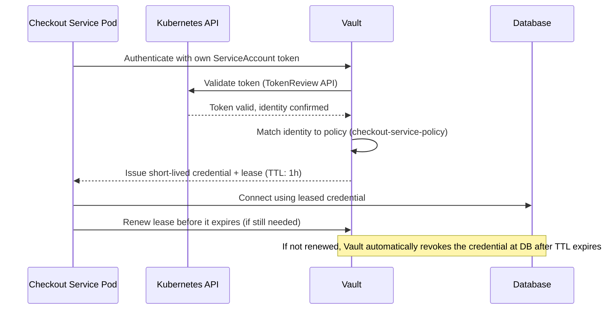

# Chapter 3 — Secrets Management

## Learning Objectives

By the end of this chapter you will be able to:

- Explain the core limitation of static, long-lived secrets and why it motivates dynamic secrets and centralized management
- Describe HashiCorp Vault's architecture: secrets engines, authentication methods, policies, leases/renewal, and sealing/unsealing
- Explain how a Kubernetes Pod authenticates to Vault using its ServiceAccount token and receives a short-lived, scoped secret
- Compare self-hosted Vault against cloud-native alternatives (AWS Secrets Manager, Parameter Store) and articulate the operational tradeoffs
- Explain the External Secrets Operator as an application of the Operator/CRD pattern to secrets synchronization
- Distinguish automatic rotation from manual rotation runbooks, and explain why an untested rotation procedure is a production risk
- Use leak-detection tooling (`gitleaks`) to catch secrets before or shortly after they're committed, and explain why a leaked secret must be rotated, not merely deleted from the latest commit

---

## Prerequisites for This Chapter

- **CI/CD Pipelines, Chapter 10 (Secrets Management)** — required. This chapter assumes you already know not to hardcode secrets and understand a CI system's built-in encrypted secrets store; this chapter goes far beyond that baseline.
- **Docker, Chapter 10 (Security)**, section on secrets — required, specifically the point that a secret baked into an image layer (e.g., via `RUN rm .env`) is not actually removed, because image history is not erased by a later layer. This chapter's leak-detection section draws a direct parallel to git history.
- **Advanced Kubernetes, Chapter 2 (RBAC)** — required, specifically ServiceAccounts and the least-privilege policy model, both referenced directly in this chapter's Vault sections.
- **Advanced Kubernetes, Chapter 5 (Custom Resources and Operators)** — required, specifically the Operator pattern (watching a Custom Resource, reconciling real infrastructure state) and CRDs, both referenced directly in the External Secrets Operator section.
- **Advanced Kubernetes, Chapter 15 (Common Mistakes)** — required, specifically the "untested backup is not a backup" principle, referenced directly in the rotation section.
- **Cloud Fundamentals AWS, Chapter 2 (IAM)** and **Chapter 10 (Security)** — recommended, for the cloud secrets manager comparison in section 3.4.

---

## 3.1 Recap: Where CI/CD Chapter 10 Left Off

CI/CD Pipelines Chapter 10 covered **basic secrets management**: never hardcode a secret directly in source code or a Dockerfile, and instead use your CI system's built-in encrypted secrets store (for example, GitHub Actions secrets or GitLab CI/CD variables), which injects the value as an environment variable at pipeline runtime without ever exposing it in logs or the repository.

That is the correct foundation, and it solves a real problem — but it solves only the first and most obvious problem. It says nothing about *how long that secret stays valid*, *how many different systems need to know it*, *what happens when it needs to be rotated*, or *what happens when someone accidentally commits it to a public repository anyway*. This chapter goes to production-grade depth on exactly those four questions: **dynamic secrets**, **centralized secret management** across many systems, **rotation**, and **leak detection** — none of which CI/CD Chapter 10 covered, and all of which become necessary the moment an organization has more than a handful of secrets scattered across more than a handful of systems.

---

## 3.2 The Core Limitation of Static Secrets

Every secret you learned to handle safely in CI/CD Chapter 10 and Docker's security chapter shares one structural property: it is **static**. A database password, an API key, a TLS private key — once created, it sits valid indefinitely, doing exactly the same job on day one and on day one thousand, until a human deliberately decides to rotate it.

This has a specific, serious consequence: **if a static secret leaks, it remains exploitable for as long as it takes someone to notice and rotate it** — which, in many real organizations, is measured in months, not minutes. A static database password copied into three different services' configuration, then accidentally logged by one of them, then indexed by an internal search tool, then forgotten, is a live vulnerability sitting quietly until someone stumbles onto it — an attacker or, if you're fortunate, a security review.

This single limitation motivates the entire rest of this chapter. If a leaked credential could instead be automatically invalidated within minutes of being issued, most of the damage from a leak simply cannot happen, because the credential is already worthless by the time anyone could act on it maliciously. That's the promise of **dynamic secrets**, and HashiCorp Vault is the tool most commonly used to deliver it.

---

## 3.3 HashiCorp Vault Architecture

Vault is a centralized system for storing, generating, and controlling access to secrets. Rather than scattering secrets across dozens of services' configuration files and CI variables, every secret request flows through Vault, which can enforce policy, generate credentials on demand, and log every access. Its architecture is built from five core concepts.

### Why centralization is the point, not just a convenience

It's worth pausing on why "centralize" matters as much as "dynamic," because the two are easy to conflate. Without centralization, even an organization that has adopted dynamic secrets in a few places ends up with secret sprawl: one team's services fetch dynamic database credentials from a homegrown script, another team still has a static API key sitting in a `.env` file, a third team's CI pipeline holds a long-lived cloud deploy key nobody remembers creating. Each of those might individually be "fine," but there is no single place to answer basic operational questions like "which systems currently hold a live credential to the production database?" or "if we suspect a breach, which credentials do we need to revoke right now?"

A centralized system like Vault (or a cloud-native equivalent, section 3.5) makes those questions answerable by construction: every credential issuance and access is logged in one place, every policy lives in one place, and revoking access — for a person who left the company, or for an entire compromised system — is one action against one system rather than a scavenger hunt across a dozen. This is the same underlying value proposition as Advanced Kubernetes Chapter 13's centralized audit logging, applied specifically to the question "who can currently read what secret."

### Secrets engines

A **secrets engine** is a pluggable backend responsible for one category of secret. The two most important categories to understand:

- The **KV (key-value) engine** stores static secrets — much like the CI secrets store you already know, but centralized in one system that every service can query, rather than duplicated across every CI pipeline and every service's own configuration.
- **Dynamic secrets engines**, such as the **database engine**, are the real upgrade. Instead of handing every service the same shared, long-lived database password, the database engine generates a **brand-new, short-lived database credential on demand, for each request**. Service A gets its own unique username and password, valid for (say) one hour; Service B gets a completely different one, also valid for one hour; neither knows or needs to know the other's credential exists.

This is a major security upgrade over a shared static password, for a simple reason: **a leaked dynamic credential expires in minutes or hours, rather than being valid forever.** If Service A's short-lived credential is accidentally logged and later discovered by an attacker, the exposure window is bounded by however long that lease has left to live — potentially minutes — rather than by how long it takes a human to notice, which is the entire problem section 3.2 described.

Beyond the database engine, Vault ships several other dynamic secrets engines worth knowing by name, since they follow the identical "generate on demand, short TTL" pattern: the **AWS engine** generates short-lived IAM credentials scoped to a specific policy, rather than handing out one long-lived access key pair; the **PKI engine** issues short-lived TLS certificates on demand, functioning as an internal certificate authority; and the **SSH engine** issues one-time SSH credentials instead of distributing a shared private key to every engineer who needs server access. The pattern is always the same regardless of which engine: static, long-lived, widely-shared credential → dynamic, short-lived, individually-issued credential.

| | Static Secret (KV engine, or a hand-managed password) | Dynamic Secret (database/AWS/PKI/SSH engine) |
|---|---|---|
| Who holds the value | Potentially every consumer, indefinitely | One consumer, for one lease period |
| Exposure window if leaked | Until someone notices and manually rotates it — often months | Bounded by the lease TTL — often minutes to hours |
| Revoking one consumer's access | Requires rotating the shared secret for *everyone* | Simply don't renew, or explicitly revoke, that one lease |
| Audit trail | "Someone used the shared password" — hard to attribute to a specific caller | Each lease is tied to a specific authenticated identity and request |
| Operational cost | Low to set up, high risk over time | Slightly more setup, dramatically lower ongoing risk |

### Authentication methods

Before Vault will hand out anything, the requester — a human or a machine — has to prove its identity. Vault supports many **authentication methods**, each suited to a different kind of identity: username/password or SSO for humans, and machine-oriented methods for services. The one most relevant to this roadmap is the **Kubernetes auth method**: a Pod authenticates to Vault by presenting its own **ServiceAccount token** — the exact same token type Advanced Kubernetes Chapter 2 introduced as the mechanism a Pod uses to authenticate to the Kubernetes API itself. Vault, in turn, validates that token against the Kubernetes API to confirm the Pod's identity before issuing anything.

### Policies

Once authenticated, **policies** determine exactly which secrets/paths that identity is allowed to read, write, or manage — Vault's own least-privilege access control model. This is directly parallel in spirit to Kubernetes RBAC from Advanced Kubernetes Chapter 2, and it's worth drawing the parallel explicitly because it will make Vault's policy syntax feel immediately familiar rather than like a new access-control model to learn from scratch:

| Kubernetes RBAC | Vault Policy |
|---|---|
| A `Role` grants specific verbs (`get`, `list`, `delete`) on specific resources (`pods`, `secrets`) in a namespace | A policy grants specific capabilities (`read`, `create`, `update`) on specific paths (`database/creds/checkout-service`) |
| A `RoleBinding` attaches a `Role` to a specific ServiceAccount | Vault's auth method configuration attaches a policy to a specific authenticated identity |
| Least privilege: grant only the verbs/resources a workload actually needs | Least privilege: grant only the paths a service actually needs to read |
| The Chapter 15 mistake: an overly broad `ClusterRoleBinding` granting `cluster-admin` | The equivalent Vault mistake: a policy granting `*` on all paths, defeating the entire point of centralizing secrets under access control |

A minimal Vault policy restricting a service to only reading its own database credentials looks like this:

```hcl
# checkout-service-policy.hcl
path "database/creds/checkout-service-role" {
  capabilities = ["read"]
}

# Explicitly no access to any other service's credentials,
# and no access to manage the database engine's configuration itself.
```

### Leases and renewal

Every dynamic secret Vault issues comes with a **lease** — a time-to-live (TTL) after which it is automatically revoked. A service holding a leased credential must **renew** the lease before it expires if it wants to keep using that credential; if it doesn't (because the service crashed, was redeployed, or simply no longer needs it), Vault revokes the credential automatically, with no human involved. This is what makes dynamic secrets self-cleaning: nothing has to remember to "turn off" old credentials, because they were never granted indefinitely in the first place.

### Sealing and unsealing

Vault encrypts all of its stored data, and — critically — it starts every single time (including after a routine restart) in a **sealed** state, meaning it cannot decrypt anything it holds, including its own configuration, until it is explicitly **unsealed**. Unsealing requires a threshold number of separate **unseal keys** (for example, 3 out of 5 distributed keys) using a cryptographic technique called **Shamir's Secret Sharing**, which splits Vault's master encryption key into multiple pieces such that no single piece is useful alone, and only a quorum of pieces reconstructs the original key.

Conceptually, the reason this matters: **even someone with full access to Vault's underlying storage — the raw disk, a database backup, a stolen snapshot — cannot read anything inside it without also possessing a threshold number of unseal keys**, which are deliberately kept separate from the storage itself (often held by different individuals, so no single compromised person or system can unseal Vault alone). This means "an attacker exfiltrated Vault's storage volume" and "an attacker can read your secrets" are two very different, non-equivalent events — a property that a simple encrypted-at-rest database, without this seal/unseal separation, does not automatically give you.

---

## 3.4 Sequence: A Pod Authenticating to Vault

The following sequence diagram ties the Kubernetes auth method, policies, dynamic secrets, and leases together into the full flow a Pod goes through to get a working database credential without ever having that credential baked into its image, its environment configuration, or a CI secrets store.



Notice that the Pod never had a database password baked into any configuration at all — it authenticated using an identity it already had (its ServiceAccount token, issued by Kubernetes itself), and received a credential that will stop working on its own if the Pod stops asking for it to be renewed. This is the dynamic-secrets model from section 3.3, made concrete end to end.

---

## 3.5 Cloud-Native Alternatives: AWS Secrets Manager and Parameter Store

Recall AWS Chapter 2 (IAM) and Chapter 10 (Security): AWS already provides identity and access primitives that a self-managed Vault installation would otherwise need to be told about separately. Two AWS-native services offer overlapping functionality to Vault, with a genuinely different operational tradeoff:

- **AWS Secrets Manager** stores secrets centrally, integrates directly with IAM policies for access control (the same least-privilege model from AWS Chapter 2, rather than a separate Vault-specific policy language), and supports **automatic rotation** for a set of supported services out of the box — most notably RDS database credentials, where Secrets Manager can rotate the actual database password on a schedule and update the stored secret value atomically, with zero human involvement.
- **AWS Systems Manager Parameter Store** is a simpler, often cheaper option for configuration values and secrets that don't need Secrets Manager's more advanced rotation orchestration — commonly used for straightforward key-value configuration where an application reads a parameter at startup.

The practical tradeoff versus a self-hosted Vault:

| | Self-Hosted Vault | AWS Secrets Manager / Parameter Store |
|---|---|---|
| Operational overhead | You run, patch, unseal, and scale Vault yourself (or use HashiCorp Cloud Platform) | Fully managed by AWS; no servers to operate |
| Cloud portability | Portable across AWS, GCP, Azure, on-prem — same tool everywhere | Tightly coupled to AWS; a multi-cloud strategy needs a second tool elsewhere |
| Dynamic secrets engine variety | Wide range: databases (many engines), cloud provider credentials, PKI/certificates, SSH, and more | Narrower: strong for AWS-native services like RDS; less flexible for arbitrary third-party systems |
| Native integration | Requires explicit auth method configuration for each identity source (Kubernetes, AWS IAM, etc.) | Deep, near-invisible integration with IAM roles already used throughout AWS |
| Best fit | Multi-cloud or hybrid environments, or a wide variety of dynamic-secret types beyond what AWS natively supports | AWS-centric environments prioritizing lower operational burden over portability |

Neither is universally "correct" — an organization fully committed to AWS with straightforward secret types often gets more value per hour of operational effort from Secrets Manager, while an organization running across multiple clouds, or needing dynamic secrets for systems AWS doesn't natively support, gets more value from Vault's flexibility despite the added operational responsibility of running it.

---

## 3.6 The External Secrets Operator: Bridging Secrets Managers into Kubernetes

Whichever secrets backend you choose — Vault or a cloud secrets manager — your Kubernetes workloads still ultimately need that secret value available to them, typically as a native Kubernetes `Secret` object mounted into a Pod. Manually copying values from Vault or Secrets Manager into `kubectl create secret` commands defeats the entire purpose of centralizing and rotating those secrets: the copy in Kubernetes would silently go stale the moment the source value rotates.

The **External Secrets Operator (ESO)** solves this, and it is worth recognizing explicitly as an application of a pattern you already know. Recall Advanced Kubernetes Chapter 5: an **Operator** watches a **Custom Resource** and continuously reconciles real infrastructure state to match it, extending Kubernetes' own reconciliation-loop philosophy to domain-specific concerns beyond what built-in objects handle. The External Secrets Operator is exactly that pattern, applied to secrets: it watches a Custom Resource Definition (CRD) called `ExternalSecret`, and continuously reconciles a real, native Kubernetes `Secret` object to mirror whatever value currently lives in Vault, AWS Secrets Manager, or another supported backend — including automatically updating it when the source value rotates.

```yaml
# externalsecret.yaml — a CRD instance, reconciled by the External
# Secrets Operator running in the cluster
apiVersion: external-secrets.io/v1beta1
kind: ExternalSecret
metadata:
  name: checkout-db-credentials
  namespace: checkout
spec:
  refreshInterval: 15m          # how often to check the source for updates
  secretStoreRef:
    name: vault-backend         # a SecretStore CRD pointing at Vault
    kind: SecretStore
  target:
    name: checkout-db-secret    # the native Kubernetes Secret this Operator creates/updates
  data:
    - secretKey: password
      remoteRef:
        key: database/creds/checkout-service-role
        property: password
```

Once this `ExternalSecret` is applied, the Operator continuously reconciles the `checkout-db-secret` native Kubernetes Secret to match whatever Vault currently returns for that path — the checkout Pods mount `checkout-db-secret` exactly as they would mount any other Kubernetes Secret (a mechanic from Kubernetes Basics), with no application code aware that the actual source of truth is Vault, and no human ever manually copying a value between systems.

---

## 3.7 Secret Rotation as an Operational Discipline

Vault's dynamic secrets and lease-based expiry (section 3.3) handle rotation automatically for the credential types they support. But plenty of real-world secrets — a third-party SaaS API key, a partner's webhook signing secret, a legacy system's static password — cannot yet be automatically rotated, either because the third party doesn't support it or because the integration predates any rotation tooling. For those, rotation is a **manual runbook**: a documented, repeatable, tested procedure for safely changing the secret's value everywhere it's used.

The distinction matters:

- **Automatic rotation** — the secrets system itself changes the credential on a schedule, with zero human involvement (AWS Secrets Manager rotating an RDS password, or Vault issuing a fresh dynamic credential on every lease renewal). This is the gold standard: no human step to forget, no runbook to go stale.
- **Manual rotation runbooks** — a documented process a human (or a scheduled automation script wrapping manual steps) executes: generate the new secret value, update every system that consumes it, verify each one picked up the new value, then invalidate the old value.

The crucial, easy-to-overlook risk sits in that manual case: **rotating a secret that some forgotten system still depends on with the old value causes an outage.** If a third-party API key is rotated and three services were updated to use the new value, but a fourth, half-forgotten internal reporting job was never told about the change, that job silently starts failing the moment the old key is invalidated — and depending on how closely that job is monitored, the failure might not be noticed for days.

This is the exact same underlying principle as Advanced Kubernetes Chapter 15's warning that **"an untested backup is not a backup"** — a backup you have never actually tried to restore from is, for practical purposes, indistinguishable from having no backup at all, because you don't find out it's broken until the moment you desperately need it to work. Apply the identical logic here: **an untested rotation procedure is not a rotation procedure.** A runbook that has never actually been executed against production, end to end, is a document expressing hope, not a reliable operational capability — the first real rotation becomes the first real test, at the worst possible time to discover a forgotten dependency.

The practical fix is the same discipline as backup testing: periodically *exercise* rotation runbooks (in staging at minimum, and ideally as scheduled, low-stakes production drills for less critical secrets) rather than writing them once and trusting them to still work a year later.

---

## 3.8 Detecting Leaked Secrets

Despite every safeguard in this chapter, humans still occasionally commit secrets directly into source code by accident — a hardcoded API key left in during local debugging, a `.env` file that wasn't actually excluded by `.gitignore`, a connection string pasted into a comment. CI/CD Chapter 10 and Docker's mistakes chapter both warned against exactly this, and the warning is necessary precisely because it keeps happening regardless.

Two widely used tools exist specifically as a safety net for this mistake:

- **`gitleaks`** scans git history, commits, or pull requests for patterns matching known secret formats (AWS access keys, private key headers, common API key shapes, high-entropy strings that look like credentials) and flags matches before or shortly after they land.
- **`truffleHog`** does the same job with a similar detection approach, and is commonly used as an alternative or a second, independent scanner alongside `gitleaks`.

A `gitleaks` pre-commit hook catches the mistake on the developer's own machine, before it ever reaches a shared repository:

```bash
# .git/hooks/pre-commit (or managed via the `pre-commit` framework)
#!/bin/sh
gitleaks protect --staged --verbose
if [ $? -ne 0 ]; then
  echo "gitleaks found a potential secret in your staged changes. Commit blocked."
  exit 1
fi
```

A CI-integrated scan acts as the second, independent safety net for anyone who bypassed or never installed the local hook:

```yaml
# .github/workflows/gitleaks.yml
name: Secret Scan
on: [pull_request]

jobs:
  gitleaks:
    runs-on: ubuntu-latest
    steps:
      - uses: actions/checkout@v4
        with:
          fetch-depth: 0        # full history, not just the latest commit
      - uses: gitleaks/gitleaks-action@v2
        env:
          GITLEAKS_LICENSE: ${{ secrets.GITLEAKS_LICENSE }}
```

### The one point that must not be missed: deleting a secret from the latest commit does not remove it

This is worth stating as plainly as possible, because it is a genuinely common and dangerous misunderstanding: **once a secret is committed to git history, a later commit that removes it does not erase it from history.** The secret is still fully readable by anyone who checks out an earlier commit, runs `git log -p`, or clones the repository before the "fix" — the file at `HEAD` looks clean, but the repository's history does not.

This is precisely the same underlying misunderstanding Docker's mistakes chapter warned about with `RUN rm .env` in a Dockerfile: adding a later instruction that deletes a file does not remove that file from the *earlier* image layer it was written into — anyone who pulls the image can still extract it from that layer directly. Git history and Docker image layers share the identical structural property: **a later change hides something from the current view, but does not erase it from the underlying history.**

The consequence is non-negotiable: once a secret has been committed and pushed anywhere it could have been cloned, fetched, or indexed — even briefly, even to a private repository — it must be treated as **compromised**, not merely "cleaned up." The correct response is to **rotate the secret immediately** (invalidating the old value so it no longer matters whether anyone has seen it), and only *then*, optionally, rewrite history (`git filter-repo` or similar) to remove it from future clones as good hygiene. Rewriting history without rotating first accomplishes nothing against anyone who already has a copy of the old commits — and rotating without rewriting history at least neutralizes the actual risk, which is the priority.

---

## 3.9 Real-World Scenario: A Stripe Key Committed to a Public Repository

An engineer, debugging a payment integration locally, temporarily hardcodes a live Stripe API key directly into a test script to save time, intending to remove it before committing. They forget. The commit, including the key, is pushed to a public GitHub repository.

**Without leak detection:** The key sits in the public commit history, visible to anyone who looks. Automated scanners — some run by security researchers doing responsible disclosure, many run by attackers doing exactly the same kind of scanning for entirely different purposes — continuously crawl public GitHub commits for exactly this pattern (Stripe keys have a recognizable prefix, making them trivial to pattern-match at scale). Within minutes of the push, an attacker's scanner finds the key and begins using it for fraudulent charges or to exfiltrate payment data, well before anyone inside the company has any idea the key was ever exposed. The first the company hears of it is a fraud alert or an unexpected Stripe support email.

**With a `gitleaks` pre-commit hook and a CI-level secondary scan:** Two independent things can happen, and both are far better than the outcome above. If the engineer's local environment has the `gitleaks` pre-commit hook installed, the commit is **blocked locally, before it is ever pushed anywhere** — the engineer sees the failure immediately, removes the hardcoded key, and re-commits, and the key never leaves their machine. If, instead, the local hook was never installed or was bypassed with `--no-verify`, the CI-level `gitleaks` scan on the resulting pull request catches it within seconds of the push, failing the CI check and blocking the merge before the code reaches the main branch (and, ideally, before the pull request branch itself has been public long enough to be crawled).

And critically, the team's actual incident response practice — regardless of which layer catches it, or even in the rare case a leak slips past both — is to treat any exposed secret as **compromised immediately**: rotate the Stripe key the moment it's discovered, not simply delete it from the offending commit and consider the matter closed. That practice, applied consistently, is what actually limits the damage from the class of mistake no amount of tooling can guarantee will never happen again.

| | No Leak Detection | Pre-commit Hook + CI Scan |
|---|---|---|
| Where the key is first caught | Never — it ships, and an external scanner (possibly an attacker's) finds it | Locally, before the commit ever leaves the engineer's machine |
| Worst case if the local hook is skipped | N/A — there was no hook to skip | Caught in CI within seconds of the push, before merge |
| Time until the company knows | Often never, until fraud or abuse is noticed independently | Immediate — the engineer sees the failure directly |
| What happens to the key regardless | Used for fraud before anyone notices | Never exposed; if a leak ever does slip through both layers, it is rotated immediately as standard practice |

The lesson generalizes well beyond Stripe keys specifically: any credential type gitleaks or truffleHog can pattern-match — AWS keys, private key headers, database connection strings, generic high-entropy tokens — benefits from exactly the same two-layer defense, and exactly the same "rotate immediately, no exceptions" response if one ever gets through.

---

## Best Practices

- Prefer dynamic, short-lived secrets over static ones wherever the target system supports it — a leaked dynamic credential has a bounded, often very short, exposure window; a leaked static one does not.
- Draw an explicit parallel between Vault policies and Kubernetes RBAC when designing access: ask "what is the minimum path this identity needs to read?" the same way you'd ask "what is the minimum verb/resource this ServiceAccount needs?"
- Use the External Secrets Operator (or an equivalent) rather than manually copying secret values into Kubernetes `Secret` objects — manual copies go stale the moment the source rotates.
- Test rotation runbooks periodically, the same way you'd test a backup restore — an untested rotation procedure is not a rotation procedure.
- Run `gitleaks` (or equivalent) both as a local pre-commit hook and as an independent CI check — the two layers catch different failure modes (a hook that was never installed, or one that was bypassed).
- Treat any leaked secret as compromised the instant it's discovered, and rotate it immediately — removing it from the latest commit or the latest deployment is necessary but never sufficient on its own.

## Common Mistakes

- Treating CI/CD Chapter 10's "use the CI secrets store" as the finish line, rather than the starting point for a production-grade secrets strategy involving dynamic secrets, centralized management, and rotation.
- Sharing one static database password across many services "for simplicity," which means a single leak compromises every consumer of that password at once.
- Writing a rotation runbook once and never actually executing it end to end, only to discover a forgotten dependent system the first time rotation is genuinely needed.
- Believing that deleting a secret from the latest commit — or the latest Docker image layer — removes it from history, rather than understanding that a compromised secret must be rotated regardless of what "cleanup" is done afterward.
- Running a leak-detection scanner only in CI and skipping the local pre-commit hook, missing the chance to stop a leak before it's ever pushed anywhere.

---

## Summary

CI/CD Chapter 10 taught the baseline: never hardcode secrets, and use your CI system's encrypted secrets store. This chapter went to production-grade depth on what that baseline leaves out. Static secrets share one structural weakness: once leaked, they remain exploitable until a human notices and manually rotates them, often months later — which motivates HashiCorp Vault's dynamic-secrets model, where a database engine issues a brand-new, short-lived credential per request rather than one shared password, and a leaked dynamic credential expires on its own within minutes or hours. Vault's architecture rests on secrets engines (KV for static, database/etc. for dynamic), authentication methods (including the Kubernetes ServiceAccount-based method), policies (a direct parallel to Kubernetes RBAC's least-privilege model), leases with automatic expiry, and a seal/unseal model built on Shamir's Secret Sharing that protects stored secrets even from someone with full access to the underlying storage. AWS Secrets Manager and Parameter Store offer a lower-operational-overhead, less portable alternative with strong native rotation support for services like RDS. The External Secrets Operator bridges any of these backends into native Kubernetes Secrets using the same Operator/CRD reconciliation pattern from Advanced Kubernetes Chapter 5. Rotation itself is an operational discipline, not just a Vault feature: automatic rotation is the gold standard, but the many secrets that still require manual rotation runbooks carry a real production risk if those runbooks are never tested — the same "untested backup is not a backup" principle from Advanced Kubernetes Chapter 15, applied to secrets. Finally, leak-detection tools like `gitleaks` and `truffleHog`, run both as pre-commit hooks and as CI checks, are the safety net for the mistake developers keep making despite every warning — and once a secret is committed to git history, deleting it in a later commit does not remove it from that history, exactly as `RUN rm .env` does not remove a secret from an earlier Docker layer; the only correct response to a leaked secret is immediate rotation.

---

## Knowledge Check

1. What is the core structural limitation of a static secret, and how does a Vault dynamic secrets engine address it?
2. Draw the explicit parallel between Vault policies and Kubernetes RBAC — name the equivalent concept on each side for "least-privilege grant" and for "the mistake of granting overly broad access."
3. Walk through, step by step, how a Kubernetes Pod authenticates to Vault and receives a database credential, including what happens if the Pod stops renewing its lease.
4. Compare self-hosted Vault to AWS Secrets Manager along at least three dimensions, and describe one scenario where each would be the better choice.
5. Explain, using the "untested backup is not a backup" analogy, why an untested manual rotation runbook is a production risk.
6. Why does deleting a secret from the latest git commit not actually remove the exposure? What is the correct first response to a leaked secret, and why does rotation have to happen regardless of whether history is rewritten?
7. Beyond the database engine, name two other Vault dynamic secrets engines and what kind of static, long-lived credential each one replaces.
8. Explain why "centralization" is treated as a distinct benefit from "dynamic" in this chapter — what operational question can a centralized secrets system answer that a collection of individually-dynamic-but-scattered systems cannot?

---

## Hands-On Exercise

**Part A — Run Vault locally and issue a dynamic secret**

1. Run Vault in dev mode locally: `vault server -dev` (development mode auto-unseals and is not for production use, but is sufficient for this exercise).
2. Enable the KV secrets engine and write a static secret: `vault kv put secret/checkout api_key=demo123`, then read it back with `vault kv get secret/checkout`.
3. If you have a local database available (or use SQLite/Postgres in a container), configure Vault's database secrets engine against it, define a role, and request a dynamic credential with `vault read database/creds/<role-name>`. Note the lease duration in the output.
4. Run `vault lease revoke <lease_id>` manually and confirm the issued credential no longer works against the database — this simulates what happens automatically when a lease expires unrenewed.

**Part B — Set up leak detection**

1. Install `gitleaks` locally and run it against a git repository you own: `gitleaks detect --source . --verbose`.
2. Configure it as a pre-commit hook (via the `pre-commit` framework or a raw git hook) so it runs automatically before every commit.
3. Deliberately stage a fake secret (e.g., a string matching an AWS access key pattern, `AKIA` followed by 16 characters) in a test file and confirm the hook blocks the commit.
4. Add a CI workflow (GitHub Actions or your CI system of choice) running `gitleaks` against every pull request, using the example in section 3.8 as a starting point.

---

## Further Reading

- developer.hashicorp.com/vault/docs/what-is-vault — official Vault architecture overview
- developer.hashicorp.com/vault/docs/auth/kubernetes — the Kubernetes auth method in full detail
- external-secrets.io/latest/ — the External Secrets Operator's official documentation, including all supported `SecretStore` backends
- docs.aws.amazon.com/secretsmanager/latest/userguide/intro.html — AWS Secrets Manager documentation, including its automatic rotation model for RDS and other supported services
- github.com/gitleaks/gitleaks — `gitleaks` documentation and configuration reference

---

<div style="display:flex;justify-content:space-between;align-items:center;">
  <a href="./02-threat-modeling.md">← Previous: Threat Modeling</a>
  <a href="./00-index.md">🏠 Index</a>
  <a href="./04-sast-and-static-analysis.md">Next: SAST and Static Code Analysis →</a>
</div>
