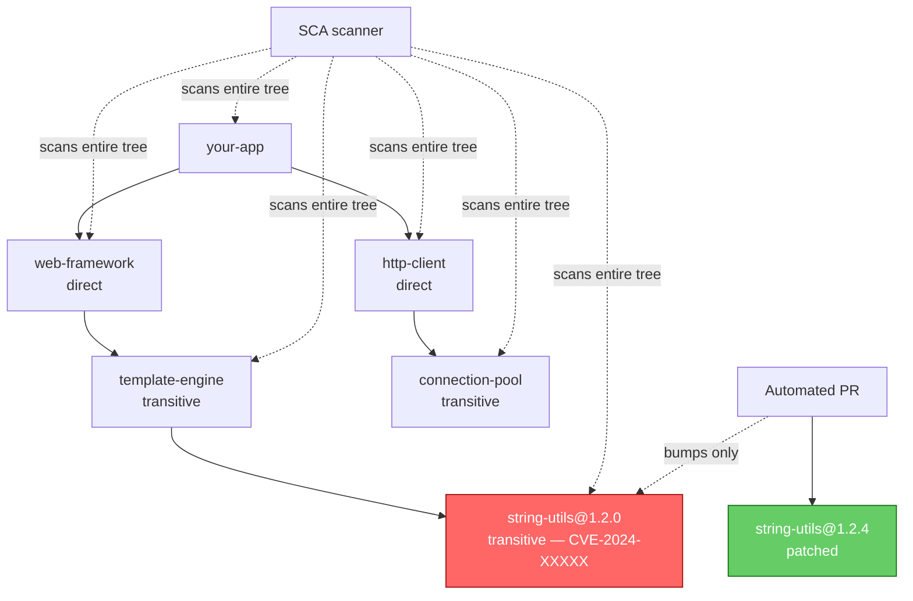

# Chapter 5 — Dependency Scanning and SCA

## Learning Objectives

By the end of this chapter, you will be able to:

- Define Software Composition Analysis (SCA) and explain why third-party dependencies are most applications' largest attack surface
- Distinguish direct from transitive dependencies and explain why transitive dependencies are the harder visibility problem
- Read and prioritize vulnerability findings using CVE identifiers, the NVD, and CVSS severity scores — and explain why score alone is insufficient prioritization
- Compare Dependabot, Renovate, and Snyk and choose appropriately for a given setup
- Explain why lockfiles are a security control, not just a build-reproducibility mechanism
- Describe license compliance as the secondary concern SCA tools also address

## Prerequisites for This Chapter

- Chapter 4 (SAST) — this chapter's "is it actually reachable" prioritization nuance directly parallels SAST's false-positive discussion
- CI/CD Pipelines Chapter 6 (Testing Strategies) — Dependabot configuration was introduced there briefly; this chapter goes deeper
- Familiarity with a package manager's dependency file (`package.json`, `requirements.txt`, `go.mod`) from any prior course

---

## 5.1 What Software Composition Analysis Is

Software Composition Analysis (SCA) means identifying every open-source and third-party dependency your application actually uses — both the ones you deliberately added and the much larger set your dependencies quietly pulled in on your behalf — and checking every single one against databases of known vulnerabilities.

Here's the fact that motivates this entire chapter: in a typical modern application, the code you and your team actually wrote is often a small minority of the total code running in production — commonly estimated at somewhere around 10-20% of total code volume, with the remaining 80-90%+ being open-source libraries, frameworks, and their own dependencies. Your real attack surface, in other words, is overwhelmingly code you didn't write, didn't review, and in many cases don't even know you're running. SAST (Chapter 4) analyzes the code you wrote. SCA analyzes everything else.

Think of it like a restaurant health inspection. SAST is inspecting the kitchen staff's technique — are they washing hands, cooking to temperature. SCA is checking every ingredient's supplier — is this batch of lettuce part of a recall, is this seafood from a vendor with a known contamination issue. You can have flawless kitchen technique and still poison someone with a bad ingredient you sourced from someone else.

---

## 5.2 Direct vs. Transitive Dependencies

A **direct dependency** is something you deliberately added — it appears by name in your `package.json`, `requirements.txt`, or `go.mod`. A **transitive dependency** is something one of your direct dependencies depends on, which you never explicitly chose and may not even know exists.

```
your-app
 └── depends on: web-framework (direct dependency — you chose this, it's in package.json)
       └── depends on: template-engine (transitive — web-framework's choice, not yours)
             └── depends on: string-utils@1.2.0 (transitive, two levels deep — has a known CVE)
```

Most engineers can rattle off their direct dependencies from memory — they picked the web framework, the ORM, the HTTP client. Almost nobody can name their transitive dependencies, and in a real application there are typically far more of them than direct ones — a single web framework can easily pull in dozens of transitive packages, each of which may have its own further dependencies. A vulnerability in `string-utils@1.2.0` three levels deep is invisible to manual code review; nobody on your team ever typed that package name anywhere. This exact gap — the tree your team can't realistically inspect by hand — is precisely where SCA tooling earns its keep. It doesn't just check the packages you know about; it walks the entire resolved dependency tree, direct and transitive, and checks every single node.



Note the key operational detail in the diagram: the fix doesn't require replacing your direct dependency or rewriting your application. A well-functioning SCA-driven remediation bumps just the one nested, vulnerable package to a patched version — the smallest possible change that closes the hole.

---

## 5.3 Vulnerability Databases and Prioritization

**CVE (Common Vulnerabilities and Exposures)** is the standard identifier format for a publicly disclosed vulnerability — you'll see them written as `CVE-2024-12345`. Think of a CVE ID as a universal case number: every tool, vendor, and report refers to the same underlying vulnerability using the same identifier, which is what makes cross-referencing possible at all.

The **NVD (National Vulnerability Database)**, maintained by the U.S. government's NIST, is the canonical enriched database of CVE records — it adds severity scoring, affected version ranges, and metadata on top of the bare CVE identifier. Most SCA tools pull from the NVD (and increasingly from supplementary sources like GitHub's own advisory database) to know what's vulnerable and how bad it is.

**CVSS (Common Vulnerability Scoring System)** assigns each vulnerability a numeric severity score from 0 to 10, bucketed into bands:

| CVSS Score | Severity |
|---|---|
| 9.0 – 10.0 | Critical |
| 7.0 – 8.9 | High |
| 4.0 – 6.9 | Medium |
| 0.1 – 3.9 | Low |

CVSS is a useful starting filter, but **score alone is not sufficient prioritization** — a lesson that should feel familiar after Chapter 4's discussion of SAST false positives. A vulnerability rated Critical in a code path your application never actually calls (say, an XML parsing feature of a library you only use for its date-formatting utilities) represents essentially zero real risk to you. A vulnerability rated only Medium in a code path that directly handles untrusted user input — the exact function your request handler calls with data straight from an HTTP request body — represents real, immediate risk regardless of its number. The question that actually matters is the same one from Chapter 4: **is this reachable and exploitable in my application's actual usage**, not just "does a scanner see this package name in my tree." Mature SCA tools increasingly try to answer this with "reachability analysis" — checking whether your code actually calls the vulnerable function — but plenty of tooling still reports at the package level only, leaving the reachability judgment to a human.

---

## 5.4 The Tools Landscape

**Dependabot** is GitHub-native and requires essentially no setup — enable it and it automatically opens pull requests bumping vulnerable dependencies to patched versions.

```yaml
# .github/dependabot.yml
version: 2
updates:
  - package-ecosystem: npm
    directory: /
    schedule:
      interval: daily
    open-pull-requests-limit: 10
    labels: ["dependencies", "security"]

  - package-ecosystem: pip
    directory: /
    schedule:
      interval: weekly
```

A Dependabot security PR looks like this in practice: title `Bump lodash from 4.17.15 to 4.17.21`, a description summarizing the CVE(s) fixed and their severity, a diff touching only the lockfile and manifest version pin, and CI running automatically against the bump just like any other PR. Merging it is often genuinely that simple — the whole point is removing friction from what would otherwise be a manual, easy-to-defer chore.

**Renovate** is a more configurable alternative that works across GitHub, GitLab, and Bitbucket, offering fine-grained control over scheduling, grouping multiple bumps into a single PR, and auto-merging low-risk patch updates.

**Snyk** is a commercial SCA platform with broader ecosystem support, deeper vulnerability intelligence (often flagging issues before they're fully published in the NVD), and developer-friendly remediation guidance that goes beyond "bump to this version" — including suggested code-level workarounds when no patched version exists yet.

| Tool | Cost | Platform | Auto-PR | Grouping/scheduling control | Notes |
|---|---|---|---|---|---|
| **Dependabot** | Free | GitHub-native only | Yes | Basic (interval, grouping by dep-type) | Zero-setup default choice on GitHub |
| **Renovate** | Free (self-hosted) / paid (hosted) | GitHub, GitLab, Bitbucket | Yes | Extensive — custom schedules, grouping rules, auto-merge policies | Best fit when you need fine control or aren't on GitHub |
| **Snyk** | Commercial (free tier available) | Broad multi-ecosystem | Yes | Good | Deepest vulnerability intel and remediation guidance; often layered on top of the above rather than replacing them |

Many teams run Dependabot or Renovate for the day-to-day "keep dependencies current" workflow and layer Snyk (or a similar commercial tool) on top for deeper scanning, license checks, and container image scanning (which you'll see again from a different angle in Chapter 6).

---

## 5.5 Running SCA Scans Directly and Gating CI on Them

Automated PR bots like Dependabot handle the "keep things patched over time" workflow, but most teams also run an SCA scan directly as a CI job — the same way linting or unit tests run on every push — so a pull request that *introduces* a new vulnerable dependency is caught immediately, rather than waiting for the next scheduled Dependabot run to notice it after the fact.

Language ecosystems ship their own built-in scanners that work well as a first line of defense:

```bash
# Node.js — built into npm, no extra tool needed
npm audit

# Python — pip-audit checks installed packages against the OSV/PyPA advisory database
pip-audit

# Go — govulncheck checks against the Go vulnerability database,
# and is reachability-aware: it only flags vulnerable functions your code actually calls
govulncheck ./...
```

Example `npm audit` output:

```
# npm audit report

semver-regex  <3.1.4
Severity: high
Regular Expression Denial of Service - GHSA-4x5v-gmq8-25ch
fix available via `npm audit fix`
node_modules/semver-regex

1 high severity vulnerability

To address issues that do not require attention, run:
  npm audit fix
```

For deeper multi-ecosystem coverage, `snyk test` is a common commercial alternative:

```bash
snyk test
```

```
Tested 84 dependencies for known issues, found 3 issues.

✗ High severity vulnerability found in lodash
  Description: Prototype Pollution
  Path: myapp > express > lodash
  Fixed in: 4.17.21
```

Wiring this into CI as a merge gate, in the same spirit as the SAST job from Chapter 4:

```yaml
name: Dependency Scan

on:
  pull_request:
    branches: [main]

jobs:
  sca:
    runs-on: ubuntu-latest
    steps:
      - uses: actions/checkout@v4
      - uses: actions/setup-node@v4
        with: { node-version: '20', cache: 'npm' }
      - run: npm ci
      - name: Audit dependencies
        run: npm audit --audit-level=high
```

`--audit-level=high` means the job only fails on High/Critical findings — the same deliberate severity-threshold tuning from Chapter 4's false-positive discussion applies here too. Failing a PR over every Low or Medium finding trains developers to ignore the check; reserving hard failures for the findings that matter keeps the gate credible.

**When no patched version exists yet** — which happens more often than you'd like, especially for freshly disclosed CVEs — remediation isn't always a simple version bump. Practical fallback options, roughly in order of preference:

1. **Pin to a known-good older version** if the vulnerability was introduced in a recent release and an older release predates it.
2. **Apply a vendor or community patch** on top of the vulnerable version, if one exists, until an official fix ships.
3. **Remove or replace the dependency** if it's a small piece of functionality you could reasonably reimplement or swap for an actively maintained alternative.
4. **Accept and document the risk** with compensating controls (e.g., the vulnerable code path is provably unreachable in your usage) and a tracked follow-up to remove the exception once a fix ships — never a silent, permanent shrug.

---

## 5.6 Lockfiles Are a Security Control

You already know lockfiles (`package-lock.json`, `poetry.lock`, `go.sum`) from a build-reproducibility angle — they pin the exact resolved version of every dependency, direct and transitive, so `npm install` on your machine and on a teammate's machine and in CI all produce the identical dependency tree.

That reproducibility property is also, directly, a security control. Without a lockfile, a routine `npm install` resolves your version ranges (`^4.17.0`) against whatever is currently published to the registry at install time — which means a newly published, compromised version of some deeply transitive package could be silently pulled into your build the moment it's published, with zero code change on your part and zero review from anyone on your team. This is exactly the mechanism behind a category of supply chain attack you'll study in depth in Chapter 7 (a malicious actor publishes a new version of a legitimate-looking package, and anything installing "the latest compatible version" picks it up automatically).

A committed, enforced lockfile closes this door: your build only ever resolves to the exact versions recorded in the lockfile, so a new malicious publish doesn't affect you until you deliberately run an update and review the diff. Treat "lockfile is committed and CI installs use `npm ci` / `pip install --require-hashes` / equivalent frozen-install commands, never a loose `npm install`" as a baseline security control, not just a build-hygiene nicety.

---

## 5.7 License Compliance — The Secondary Concern

SCA tools typically flag one more thing alongside vulnerabilities: the license each dependency is published under. This matters operationally, not just legally-in-theory — a **copyleft** license like AGPL can create a real obligation to open-source your own application's source code if you use or distribute the dependency in certain ways (for example, offering it as a network service), which is a business-significant constraint most engineering teams don't want to discover after the fact. Permissive licenses (MIT, Apache 2.0, BSD) generally carry no such obligation.

This is a real but secondary concern next to vulnerability scanning — most teams configure their SCA tool to flag disallowed license types (AGPL, GPL in some contexts) as a policy check, review any flags with legal/compliance input, and otherwise let vulnerability scanning remain the primary focus of the tool.

---

## Real-World Scenario

Consider the well-known pattern from a critical vulnerability disclosed a few years ago in an extremely widely-used open-source Java logging library — present, transitively, in a huge fraction of Java applications across the industry, often several dependency layers deep and completely invisible to teams that had never directly chosen or even heard of it.

Two companies respond very differently. Company A has SCA scanning running continuously across every repository, plus a maintained Software Bill of Materials (SBOM — you'll formalize this concept in Chapter 7) for every deployed service. Within minutes of the CVE being published, an automated query against their SBOM inventory identifies every single service anywhere in their fleet with the vulnerable library present, transitively or directly, at any depth. Patches roll out within hours, prioritized by which services actually expose the vulnerable code path to untrusted input.

Company B has no SCA tooling and no SBOM. Their response is a frantic, manual, multi-week effort: engineers across dozens of teams individually run `grep` and dependency-tree commands against their own services, many of which don't even know they're affected because the library arrived transitively through a framework nobody remembers explicitly choosing. Weeks pass with services still exposed while the audit is ongoing, and there's no confidence the inventory is even complete by the time it's done.

The difference between these two outcomes wasn't engineering talent — it was whether the tooling to answer "which of our systems contain this dependency, right now, at any depth" existed *before* the question became urgent.

---

## Best Practices

- Enable Dependabot or Renovate by default on every repository — it costs nothing and the marginal PR review effort is far cheaper than a manual audit later
- Commit and enforce lockfiles; use frozen-install commands (`npm ci`, not `npm install`) in CI
- Treat CVSS score as a starting filter, not a final prioritization — factor in whether the vulnerable code path is actually reachable from untrusted input
- Group low-risk patch-level bumps to reduce PR review fatigue, but review major-version security bumps individually
- Maintain visibility into your full transitive dependency tree, not just direct dependencies — this is the whole point of running SCA at all
- Flag license types alongside vulnerabilities, and route copyleft flags to whoever owns legal/compliance review
- Run a direct SCA scan (`npm audit`, `pip-audit`, `govulncheck`, or `snyk test`) as its own CI job on every pull request, in addition to scheduled bot-driven PRs, so newly introduced vulnerable dependencies are caught immediately
- When no patched version exists, document the remediation decision (pin, patch, replace, or accept-with-justification) rather than leaving the finding silently open

## Common Mistakes

- Reviewing only direct dependencies manually and assuming that's sufficient coverage
- Treating every Critical CVSS finding as equally urgent regardless of whether the vulnerable code path is reachable
- Running `npm install` (or equivalent) in CI instead of a frozen-install command, silently allowing dependency drift
- Letting automated dependency-bump PRs pile up unreviewed for weeks, defeating the purpose of fast patching
- Ignoring transitive dependencies entirely because they don't appear in the top-level manifest file

---

## Summary

SCA identifies every direct and transitive dependency in your application and checks each against vulnerability databases — necessary because most modern applications are overwhelmingly composed of third-party code, most of it invisible to manual review at the transitive layer. CVE identifiers, the NVD, and CVSS scores give you a common vocabulary and a starting severity signal, but real prioritization requires judging whether a vulnerable code path is actually reachable — the same "is this actually exploitable" discipline from Chapter 4's SAST discussion. Dependabot, Renovate, and Snyk automate detection and remediation with varying levels of configurability and depth. Lockfiles are a security control, not just a reproducibility mechanism, because they prevent silently pulling in a newly-published compromised package version. License compliance rides along as a secondary but real concern in the same tooling.

---

## Knowledge Check

1. Why is a typical application's transitive dependency tree a bigger security concern than its direct dependencies, even though it's less visible to manual review?
2. What do CVE, NVD, and CVSS each specifically refer to, and how do they relate to each other?
3. Explain why a CVSS "Critical" finding isn't automatically higher real-world risk than a "Medium" finding. Give an example.
4. How does a missing or unenforced lockfile expose an application to a supply-chain-style risk, even without any application code changing?
5. Compare Dependabot and Renovate — under what circumstance would you specifically choose Renovate over Dependabot?
6. Why do SCA tools often report license type alongside CVEs? What real-world obligation can a copyleft license create?
7. Why run a direct SCA scan (like `npm audit`) as its own CI job on every PR, when a bot like Dependabot is already opening scheduled remediation PRs? What gap does the CI job close that the bot doesn't?
8. List two remediation options when a dependency has a known vulnerability but no patched version is available yet.

---

## Hands-On Exercise

1. Pick any repository (yours or a small open-source project) with a `package.json`, `requirements.txt`, or `go.mod`.
2. Enable Dependabot on it by adding a `.github/dependabot.yml` file covering the relevant `package-ecosystem`, scheduled daily, with a 10-PR limit.
3. If Dependabot opens any security PRs, inspect one: read the CVE it references, look up its CVSS score and severity band, and judge — based on how your application actually uses that dependency — whether the reachability nuance from section 5.3 applies.
4. Run a manual dependency tree command (`npm ls <package>`, `pip show <package>`, or `go mod graph`) to find at least one transitive dependency you didn't know you had.
5. Run `npm audit` or `pip-audit` directly against the project and compare its findings to what Dependabot has already opened PRs for.
6. Add a CI job (using the example in section 5.5) that runs the audit command on every pull request and fails only on High/Critical findings.
7. Confirm your project's lockfile is committed to version control, and change your CI (or local build script) to use a frozen-install command (`npm ci` instead of `npm install`) if it isn't already.

---

## Further Reading

- [National Vulnerability Database (NVD)](https://nvd.nist.gov/)
- [CVSS v3.1 Specification — FIRST.org](https://www.first.org/cvss/v3-1/specification-document)
- [GitHub Dependabot documentation](https://docs.github.com/en/code-security/dependabot)
- [Renovate documentation](https://docs.renovatebot.com/)
- [OWASP Dependency-Check project](https://owasp.org/www-project-dependency-check/)

---

<div style="display:flex;justify-content:space-between;align-items:center;">
  <a href="./04-sast-and-static-analysis.md">← Previous: SAST and Static Code Analysis</a>
  <a href="./00-index.md">🏠 Index</a>
  <a href="./06-container-and-image-security.md">Next: Container and Image Security →</a>
</div>
