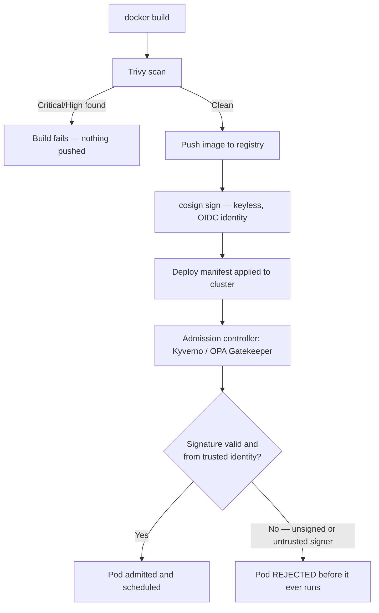

# Chapter 6 — Container and Image Security

## Learning Objectives

By the end of this chapter, you will be able to:

- Explain what an image vulnerability scanner actually does and how it relates to the SCA concepts from Chapter 5
- Use Trivy or Grype to scan a built container image and interpret the results
- Integrate image scanning into CI/CD as a release gate, with a defensible severity threshold
- Explain the problem image signing solves and use cosign to sign and verify an image
- Explain keyless signing and why it's increasingly preferred over long-lived key pairs
- Describe how a Kubernetes admission controller enforces signature verification at deploy time

## Prerequisites for This Chapter

- **Docker Chapter 10 (Security)** — required. That chapter covered non-root users, avoiding `latest`, minimal/distroless base images, and the Docker socket risk. **This chapter does not repeat that material.** It goes deeper on two things Docker Ch10 only mentioned in passing: vulnerability scanning of built images, and image signing/verification.
- **Docker Chapter 9 (Registry & Image Management)** — the registry push/pull workflow and tagging strategy this chapter's CI examples build on.
- **Chapter 5 (Dependency Scanning and SCA)** — the CVE/CVSS/NVD vocabulary this chapter applies to built images instead of source manifests.
- **Advanced Kubernetes Chapter 3 (Admission Control)** — admission webhooks and policy engines (Kyverno, OPA Gatekeeper), which this chapter uses to enforce signature verification.

---

## 6.1 Scope: What This Chapter Covers That Docker Ch10 Didn't

Docker Chapter 10 gave you the hardening fundamentals: run as non-root, drop capabilities, use a minimal or distroless base image, never mount the Docker socket into a container. Those are all about reducing what a container *can do* if compromised. This chapter is about two different, complementary questions that Docker Ch10 only touched on briefly:

1. **Vulnerability scanning of built images** — how do you know what's actually inside the image you're about to ship, and whether any of it has a known CVE?
2. **Image signing and verification** — how does anything downstream (a registry, a Kubernetes cluster) actually know the image it's about to run is the exact one your CI pipeline built and scanned, rather than something substituted along the way?

Both questions matter regardless of how well-hardened your Dockerfile is. A perfectly non-root, capability-dropped, distroless-based image can still bundle a vulnerable version of `libssl` from its base OS layer, and a perfectly clean, scanned image can still be swapped for a malicious one if nothing verifies its identity before it runs. This chapter addresses both gaps.

---

## 6.2 What an Image Scanner Actually Does

An image scanner takes a fully built container image — the tarball of layers that would actually get deployed — and:

1. **Unpacks every layer** of the image filesystem.
2. **Identifies every OS package** installed via the image's package manager (`apt`/`dpkg` on Debian-based images, `apk` on Alpine) — this is the part that has no equivalent in source-code-level SCA at all, because OS packages never appear in a `package.json` or `requirements.txt`.
3. **Identifies every application-level dependency** baked into the image — the `package.json`/`package-lock.json`, `requirements.txt`, `go.sum`, or equivalent manifests that got copied in during the build, and the actual installed versions on disk.
4. **Cross-references everything found** against vulnerability databases — the same CVE/NVD/CVSS machinery from Chapter 5.

The connection to Chapter 5 is direct: **this is SCA applied to the fully-built image artifact, instead of just your source repository's dependency manifest.** That distinction matters for a concrete reason — SCA run against your source repo in CI (Chapter 5) never sees the base OS image's own packages at all, because those aren't declared anywhere in your application's dependency files. A `curl` or `openssl` CVE living in the `debian:bookworm-slim` base layer you `FROM`'d is completely invisible to source-level SCA, but it's exactly the kind of thing an image scanner catches, because it scans what's actually sitting on disk inside the built artifact rather than what's declared in a manifest.

```
Source-level SCA (Ch. 5)              Image scanning (this chapter)
─────────────────────────             ──────────────────────────────
Reads: package.json,                  Reads: the actual built image's
requirements.txt, lockfiles           filesystem layers

Sees: your app's declared             Sees: OS packages (apt/apk) +
direct + transitive deps              app-level deps actually baked in

Misses: OS-level packages             Misses: nothing baked into the
entirely (never declared              image, but catches drift the
in an app manifest)                   source manifest never captured
```

---

## 6.3 Trivy and Grype

**Trivy** and **Grype** are the two most widely-used open-source image scanners. Both are fast, both integrate easily into CI with a single binary and no server component required, and both are commonly run as a required step before an image is allowed to reach a registry.

Trivy has one extra capability worth flagging as a preview of Chapter 9: it can also scan Infrastructure as Code (Terraform, Kubernetes manifests, Dockerfiles themselves) for misconfigurations, not just built images for CVEs — making it a single tool that covers two different scanning needs in this course.

```bash
# Scan a locally built image
trivy image myapp:1.0
```

Realistic example output:

```
myapp:1.0 (debian 12.5)
========================
Total: 14 (CRITICAL: 1, HIGH: 3, MEDIUM: 7, LOW: 3)

┌───────────────┬──────────────────┬──────────┬──────────────┬─────────────────┬────────────────────────────┐
│    Library     │ Vulnerability   │ Severity │   Status     │ Installed Version│      Fixed Version         │
├───────────────┼──────────────────┼──────────┼──────────────┼─────────────────┼────────────────────────────┤
│ openssl        │ CVE-2024-6119    │ CRITICAL │ fixed        │ 3.0.11-1         │ 3.0.14-1                   │
│ libcurl4       │ CVE-2024-2398    │ HIGH     │ fixed        │ 8.4.0-2          │ 8.5.0-1                    │
│ zlib1g         │ CVE-2023-45853   │ HIGH     │ fixed        │ 1.2.13-1         │ 1.2.13.dfsg-3              │
│ express        │ CVE-2024-29041   │ MEDIUM   │ fixed        │ 4.17.1           │ 4.19.2                     │
└───────────────┴──────────────────┴──────────┴──────────────┴─────────────────┴────────────────────────────┘
```

Note the mix: `openssl`, `libcurl4`, and `zlib1g` are OS-level packages from the base image, while `express` is an application-level dependency baked in via `package.json` — Trivy surfaces both in the same report, which is exactly the "catches what source-level SCA alone would miss" point from the previous section.

| | Trivy | Grype |
|---|---|---|
| Maintainer | Aqua Security | Anchore |
| Speed | Fast | Fast |
| Scope | Images, filesystems, git repos, IaC/Kubernetes manifests | Images and filesystems |
| CI integration | Official GitHub Action, single static binary | Official GitHub Action, single static binary |
| Extra capability | IaC misconfiguration scanning (preview of Chapter 9) | Tight integration with Syft for SBOM generation |
| Typical choice | Teams wanting one tool for both image and IaC scanning | Teams already using the Syft/Anchore ecosystem |

Both tools can also generate a Software Bill of Materials (SBOM) for an image as a side effect of scanning it — a structured, machine-readable inventory of every package and dependency the image contains:

```bash
# Generate a CycloneDX-format SBOM alongside the vulnerability scan
trivy image --format cyclonedx --output myapp-1.0.sbom.json myapp:1.0
```

You'll formalize the SBOM concept and its role in supply chain security fully in Chapter 7 — for now, the practical point is that scanning and SBOM generation are typically the same operation, so there's little reason not to archive the SBOM as a build artifact every time you scan.

Grype produces conceptually equivalent output with its own CLI conventions:

```bash
grype myapp:1.0
```

Both tools support filtering and CI-friendly exit codes:

```bash
# Only show and fail on High/Critical
trivy image --severity HIGH,CRITICAL --exit-code 1 myapp:1.0

# Grype equivalent
grype myapp:1.0 --fail-on high
```

---

## 6.4 Integrating Image Scanning as a CI/CD Release Gate

The scan belongs **after the build step, and before the push-to-registry step** — tying together Docker Chapter 9's registry workflow and CI/CD Chapter 5's Docker-in-CI patterns. The whole point of gating at this position is that a critically vulnerable image is never given the chance to reach a place other systems could pull it from.

```yaml
name: Build, scan, and publish

on:
  push:
    branches: [main]

jobs:
  build:
    runs-on: ubuntu-latest
    permissions:
      contents: read
      packages: write
    steps:
      - uses: actions/checkout@v4

      - name: Build image
        run: docker build -t ghcr.io/${{ github.repository }}:${{ github.sha }} .

      - name: Scan image with Trivy
        uses: aquasecurity/trivy-action@master
        with:
          image-ref: ghcr.io/${{ github.repository }}:${{ github.sha }}
          severity: CRITICAL,HIGH
          exit-code: 1
          format: table

      # Only reached if the scan step above passed
      - name: Log in to GHCR
        uses: docker/login-action@v3
        with:
          registry: ghcr.io
          username: ${{ github.actor }}
          password: ${{ secrets.GITHUB_TOKEN }}

      - name: Push image
        run: docker push ghcr.io/${{ github.repository }}:${{ github.sha }}
```

**Where to draw the severity line is a real tuning question, not a solved problem.** Failing the build on every Medium-severity finding sounds maximally cautious, but in practice it's often too strict — Medium findings are common, frequently in code paths you never exercise, and a policy that blocks shipping over every one of them trains developers to treat the scan as an obstacle rather than a safeguard. This is the exact same false-positive-fatigue lesson from Chapter 4 applied to a different tool: a gate that fires too often on low-value signal gets routed around, not respected. Most teams settle on failing only for Critical and High, with Medium and Low tracked and reviewed periodically rather than blocking every merge.

**There's also an operational reality worth internalizing: base images accumulate new CVEs over time even when your application code never changes.** A CVE disclosed in `openssl` next month affects every image you've already built with today's base layer, even though you haven't touched a line of your own code since. This means image scanning isn't a one-time build-time gate you can set and forget — it requires periodically rebuilding and rescanning images on a schedule (weekly, say), purely to pick up patched base image layers, independent of any application release cadence.

---

## 6.5 Image Signing and Verification with Cosign

Scanning answers "is this image clean at the moment I built it." It does not answer a different, equally important question: **when something later pulls and runs this image, how does it know it's actually the same image that was scanned — and not a tampered or substituted image from a compromised registry, or one intercepted and swapped in transit?** A registry compromise, a MITM attack, or simply a mistake in tag management could all result in a different image running under the same name and tag than the one your pipeline actually produced and scanned. Scanning alone has no way to detect this after the fact.

**Cosign**, part of the Sigstore project, solves this by letting you cryptographically sign an image immediately after it passes your pipeline's checks, and letting anything downstream verify that signature before trusting the image.

```bash
# Sign an image after it has passed scanning and been pushed
cosign sign myregistry.io/myapp:1.0

# Verify the signature before deploying
cosign verify myregistry.io/myapp:1.0
```

Traditional signing uses a long-lived private key that you generate once and must protect forever (`cosign generate-key-pair`, then `cosign sign --key cosign.key ...`) — this works, but it recreates exactly the problem Chapter 3 spent a whole chapter on: a long-lived static secret that itself becomes something you have to rotate, store securely, and worry about leaking. If the signing key leaks, an attacker can sign arbitrary malicious images and they'll pass verification indefinitely until you notice and rotate.

**Keyless signing** is Sigstore's answer, and it's the modern, increasingly preferred approach. Instead of a long-lived key pair, cosign requests a short-lived certificate tied to an OIDC identity — for example, the identity of the specific GitHub Actions workflow that's running right now. The certificate is valid for minutes, is issued by a public certificate authority (Fulcio) after verifying the OIDC token, and the signing event itself is recorded in a public, tamper-evident transparency log (Rekor) so there's an auditable record of exactly which workflow signed exactly which image, and when.

```bash
# Keyless signing in a GitHub Actions workflow — no private key to manage at all
cosign sign myregistry.io/myapp:1.0
# cosign automatically detects the GitHub Actions OIDC token and requests
# a short-lived certificate bound to this exact workflow run's identity

# Verification can then require the signature match a specific trusted identity
cosign verify \
  --certificate-identity "https://github.com/your-org/your-repo/.github/workflows/build.yml@refs/heads/main" \
  --certificate-oidc-issuer "https://token.actions.githubusercontent.com" \
  myregistry.io/myapp:1.0
```

There's simply no long-lived key to steal, rotate, or leak — the same "eliminate the static secret entirely" philosophy you saw in Chapter 3's discussion of why short-lived, dynamically-issued credentials beat long-lived static ones.

---

## 6.6 Enforcing Verification at Admission Time

Signing an image is only half the story — the enforcement half happens in Kubernetes. This directly extends Advanced Kubernetes Chapter 3's admission control material: an admission webhook, or a policy engine like **Kyverno** or **OPA Gatekeeper** (both named in that chapter), can be configured to inspect every Pod creation request and **reject any Pod whose image isn't signed by a trusted, known signer**.

A simplified Kyverno policy expressing this:

```yaml
apiVersion: kyverno.io/v1
kind: ClusterPolicy
metadata:
  name: verify-image-signatures
spec:
  validationFailureAction: Enforce
  rules:
    - name: verify-signature
      match:
        any:
          - resources:
              kinds: [Pod]
      verifyImages:
        - imageReferences:
            - "myregistry.io/myapp:*"
          attestors:
            - entries:
                - keyless:
                    subject: "https://github.com/your-org/your-repo/.github/workflows/build.yml@refs/heads/main"
                    issuer: "https://token.actions.githubusercontent.com"
```

With this policy enforced, the loop is closed: CI scans and signs images (sections 6.3–6.5), and the cluster refuses to run anything that wasn't produced by that trusted, identity-verified pipeline — regardless of how the image ended up in the registry or what tag it's wearing.



---

## Real-World Scenario

A company's container registry is compromised — perhaps through leaked credentials or a misconfigured access policy — and an attacker replaces a legitimate, previously-scanned-and-clean image tag with a malicious one containing a cryptominer, keeping the exact same tag name and repository path so nothing looks different at a glance.

**Without signature verification enforced**, Kubernetes has no way to know the image content changed. It pulls whatever is currently sitting behind that tag in the registry and runs it — the substituted cryptominer image starts up as a normal-looking Pod, and the compromise goes undetected until someone notices unusual CPU usage or a cloud bill spike days later.

**With cosign signing and admission-time verification enforced**, the outcome is completely different. The substituted image was never signed by the CI pipeline's trusted OIDC identity — the attacker doesn't have the ability to forge a keyless signature tied to that specific GitHub Actions workflow's identity, because doing so would require compromising the OIDC token issuance itself, a much higher bar than compromising registry credentials. When the deploy manifest is applied, the admission controller checks the image's signature, finds none matching the trusted signer, and **rejects the Pod before a single container starts.** The registry compromise still happened, but it never translated into a running workload — the blast radius stopped at "attacker can push bad images to the registry" instead of extending to "attacker's code executes in production."

---

## Best Practices

- Scan every image after build, before push — never let an unscanned image reach a registry other systems can pull from
- Set the CI-failing severity threshold at Critical/High; track Medium/Low separately rather than blocking every merge on them
- Rebuild and rescan images on a recurring schedule even with no application code changes, to pick up patched base image layers
- Prefer keyless (OIDC-based) signing over long-lived key pairs — there's no static secret to protect or rotate
- Enforce signature verification at the Kubernetes admission layer, not just as a manual step someone might skip
- Use Trivy's IaC/Kubernetes-manifest scanning capability as a bonus check alongside image scanning where relevant (previewed further in Chapter 9)

## Common Mistakes

- Scanning images but never actually gating the pipeline on the results — the scan runs, findings are logged, and the image ships anyway
- Setting the failure threshold too strict (e.g., failing on every Medium finding), training developers to ignore or bypass the check
- Treating image scanning as a one-time build gate and never rescanning images already sitting in the registry as new base-image CVEs are disclosed
- Signing images but never actually enforcing verification at deploy time, leaving the signature purely decorative
- Using long-lived signing keys stored as a CI secret instead of keyless signing, recreating the exact static-secret liability Chapter 3 warned about

---

## Summary

Image scanning with Trivy or Grype applies the SCA concepts from Chapter 5 to the fully-built image artifact — catching OS-level package CVEs that source-repo-only scanning would completely miss, in addition to application-level dependency CVEs. Gating a CI/CD pipeline on scan results (Critical/High severity, positioned between build and push) prevents vulnerable images from ever reaching a registry, though the severity threshold needs the same false-positive-fatigue-aware tuning discussed in Chapter 4, and images need periodic rescanning as new CVEs surface in unchanged base layers. Scanning alone can't detect a tampered or substituted image after the fact — that's what cosign's signing and verification solves, ideally via keyless signing tied to an OIDC workflow identity rather than a long-lived key. Enforcing verification at the Kubernetes admission layer (Kyverno/OPA Gatekeeper, from Advanced Kubernetes Ch. 3) closes the loop between "we scan and sign in CI" and "only those exact images can actually run in production."

---

## Knowledge Check

1. Why does image scanning catch vulnerabilities that source-level SCA (Chapter 5) alone would miss? Give a concrete example.
2. Where in a CI/CD pipeline should an image scan run, and why does that position matter?
3. Explain the practical tuning tension around choosing a severity threshold for failing a build on scan results.
4. Why does an image need to be rescanned periodically even if the application code inside it never changes?
5. What specific problem does cosign solve that image scanning alone cannot? Walk through the registry-compromise scenario as your answer.
6. What is keyless signing, and why is it preferred over a traditional long-lived key pair? Tie your answer back to a theme from Chapter 3.

---

## Hands-On Exercise

1. Build a small Docker image locally from any Dockerfile you have handy (or reuse the hardened image from Docker Chapter 10's exercise).
2. Install Trivy and run `trivy image --severity CRITICAL,HIGH <your-image>`. Note how many findings come from OS packages versus application dependencies.
3. Add a GitHub Actions workflow implementing the build → scan → push pattern from section 6.4, failing the build on Critical/High findings.
4. Install cosign and, using a GitHub Actions workflow (so OIDC identity is available), sign the image with keyless signing after it passes the scan step.
5. Run `cosign verify` locally against the pushed image using the `--certificate-identity` and `--certificate-oidc-issuer` flags matching your workflow, and confirm it succeeds.
6. As a thought exercise (or in a scratch cluster if you have one available), sketch or apply a Kyverno `ClusterPolicy` requiring image signature verification, and test that an unsigned image gets rejected on Pod creation.

---

## Further Reading

- [Trivy documentation — Aqua Security](https://trivy.dev/)
- [Grype — Anchore](https://github.com/anchore/grype)
- [Sigstore / Cosign documentation](https://docs.sigstore.dev/)
- [Kyverno image verification documentation](https://kyverno.io/docs/writing-policies/verify-images/)
- [Sigstore keyless signing overview](https://docs.sigstore.dev/cosign/signing/overview/)

---

<div style="display:flex;justify-content:space-between;align-items:center;">
  <a href="./05-dependency-scanning-and-sca.md">← Previous: Dependency Scanning and SCA</a>
  <a href="./00-index.md">🏠 Index</a>
  <a href="./07-software-supply-chain-security.md">Next: Software Supply Chain Security →</a>
</div>
