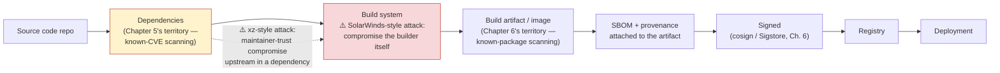
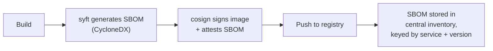

# Chapter 7 — Software Supply Chain Security

## Learning Objectives

By the end of this chapter you will be able to:

- Explain what makes supply chain security a categorically different problem from the known-vulnerability scanning covered in Chapters 5 and 6
- Describe the SolarWinds and `xz` backdoor incidents accurately, and name the class of attack each one represents
- Define SBOM precisely, name the two dominant formats, and explain what practical question an SBOM answers during an incident
- Define provenance, and explain what it tells you that an SBOM structurally cannot
- Explain the SLSA framework's purpose and its relationship to artifact signing
- Explain the dependency confusion attack technique with a worked example, and state the concrete fix
- Trace a software artifact through the full supply chain and identify where the SolarWinds- and `xz`-style attacks occurred

## Prerequisites for This Chapter

- **Chapter 5 — Dependency Scanning and SCA** — required. This chapter's central contrast ("known-vulnerable" vs. "deliberately tampered with") only makes sense against Chapter 5's SCA model of scanning dependencies for published CVEs.
- **Chapter 6 — Container and Image Security** — required, specifically the sections on image scanning and cosign/Sigstore signing, which this chapter builds on directly when discussing SLSA and provenance.
- **CI/CD Pipelines, Topic 5** — recommended background on what a build system actually does, since several attacks described here target the build system itself.

---

## 7.1 A Scarier Question Than "Is It a Known Vulnerability?"

Chapter 5 taught you to find dependencies with **known** vulnerabilities — a CVE has been published, a CVSS score assigned, and a scanner can match your `package-lock.json` or `go.sum` against a public database. Chapter 6 extended the same idea to container images — a scanner inspects the packages baked into a layer and matches them against the same kind of database. Both are enormously valuable, and both share a structural assumption worth naming out loud: **they only catch problems that are already known and cataloged.**

Software supply chain security asks a different, harder question: **can you trust that the code and artifacts you depend on and build with weren't deliberately tampered with — even when no scanner flags anything, because the tampering is brand new and nobody has cataloged it yet?**

This is not a hypothetical distinction. A scanner comparing package versions against a CVE database is powerless against an attacker who compromises the *build system itself* and injects malicious code into an otherwise legitimate, correctly-versioned release — there is no CVE for "this specific build of this specific version was tampered with," because from the scanner's point of view it looks like the exact same trusted software it always has. The two real-world incidents below are the canonical examples of exactly this gap, and they are worth understanding at the level of "what happened and what class of attack it represents," not as war stories — because the class of attack, not the specific incident, is what this chapter's tools defend against.

### The SolarWinds attack: a build-system compromise

In late 2020, it was publicly disclosed that attackers had compromised SolarWinds' own internal build system for its Orion network-monitoring software. Rather than exploiting a bug in the shipped product, the attackers inserted malicious code *during the build process itself*, so that the resulting update — compiled, signed, and distributed through SolarWinds' entirely legitimate, official update mechanism — silently included a backdoor. Thousands of organizations, including government agencies and large enterprises, installed what appeared to be a normal, trusted, digitally-signed software update, because it *was* signed by SolarWinds' real certificate — the code inside it just wasn't what SolarWinds' engineers had actually written.

The critical detail for this chapter: **this was a build-system compromise, not a code review failure.** No amount of source code review by SolarWinds' own engineers would have caught it, because the malicious code was injected downstream of that review, inside the build pipeline. This is exactly why Chapter 11 (CI/CD Pipeline Security) exists as its own chapter later in this course — the build system is not a neutral, trusted appliance; it is itself a high-value target that needs to be secured as carefully as production infrastructure.

### The `xz` backdoor: a maintainer-trust attack

In early 2024, a sophisticated backdoor was discovered in `xz-utils`, a compression library so widely used it's a dependency of `openssh` on most major Linux distributions (indirectly, through `liblzma`). Unlike SolarWinds, this wasn't a system compromise — it was a **social-engineering attack on the human trust relationships that hold open-source maintenance together.** Over roughly two years, an account using the identity "Jia Tan" built up a track record of legitimate contributions to the project, gradually gained the trust of the overworked, sole existing maintainer, and was eventually granted co-maintainer status with real commit and release authority. From that trusted position, an extremely well-obfuscated backdoor was inserted into the project's build scripts (not the readable source code most contributors would review, but the autotools build machinery few people scrutinize closely) — timed to activate only in built release tarballs, not in the git repository itself, which would have made casual source review even less likely to catch it. It was discovered only by chance, when a engineer investigating unrelated performance anomalies noticed unusually high CPU usage from `sshd` and traced it back — before the backdoored version had propagated into any major stable Linux distribution release.

The critical detail here: **this was an attack on trust, not on technology.** The `xz` project had no corporate build system to compromise — the attack vector was patiently earning the authority to make changes that nobody else was positioned to review carefully. This is the uncomfortable truth about open-source supply chains: your dependency tree isn't just code, it's a network of human maintainers, and you are implicitly trusting every one of them, transitively, all the way down.

### The pattern

Both incidents targeted the **build and distribution process**, and the **human trust relationships** underneath it — neither is a "someone found a known CVE" story. That is precisely the gap this chapter's tools are designed to close: not finding more known vulnerabilities, but making the build-and-distribution process itself verifiable, so that tampering — known or not — becomes detectable rather than invisible.

---

## 7.2 The Software Supply Chain as a Pipeline of Trust and Attack Points

Before introducing the specific tools, it helps to see the whole pipeline at once, with the two incidents above marked at the points where they actually occurred.



Notice where the two incidents sit: SolarWinds attacked the **build system** node directly — a system your organization may not even own (a SaaS CI provider, in many cases) but that has enormous, implicit trust because everything downstream of it treats its output as authoritative. The `xz` backdoor attacked **upstream in the dependency tree**, one hop before the build system, exploiting the fact that a "dependency" is really a proxy for "a maintainer or team you've never met, whose commits you're trusting by default." Chapters 5 and 6 cover the two artifact-content nodes (dependencies and the built image); this chapter covers the connective tissue around and after the build — provenance, SBOMs, signing, and the policies that make tampering visible.

It's worth being explicit about why every organization needs to care about this pipeline, not just companies that build software products for sale. SolarWinds' actual victims weren't SolarWinds itself — they were the thousands of ordinary organizations who simply ran an update from a vendor they'd trusted for years. If your organization consumes open-source dependencies, base container images, Terraform providers, or third-party build tools — which is to say, if your organization does anything covered by this entire roadmap — you are a potential downstream victim of exactly this class of attack, regardless of whether anyone specifically targets you. Supply chain security isn't a concern reserved for large, high-profile targets; it's a concern for anyone standing downstream of a build pipeline they don't fully control, which in practice means nearly everyone.

---

## 7.3 SBOM: A Software Bill of Materials

### What it is, precisely

A **Software Bill of Materials (SBOM)** is a complete, machine-readable inventory of every component that makes up a software artifact — every direct dependency, every transitive dependency pulled in underneath those, down to the exact version of each, ideally alongside a cryptographic hash identifying the exact bytes of that component. The analogy is literal: just as a food product's ingredient list tells you exactly what's inside it (including ingredients of ingredients, if you look at a compound ingredient), an SBOM tells you exactly what's inside a piece of software, all the way down.

### The concrete problem it solves

Recall Chapter 5's scenario: a critical vulnerability is disclosed in a widely-used logging library, and a company spends **weeks** manually grep-ing through every repository, asking every team "are we using this?", trying to build an inventory that should have existed already. An SBOM is precisely the artifact that makes that exercise unnecessary. If every service's build pipeline already generates and stores an SBOM, answering "are we affected by the vulnerability disclosed for library X, version Y?" becomes a query against existing inventory data — a matter of **minutes**, not weeks, run once per organization rather than once per team scrambling independently.

### The two dominant formats

You do not need to become an expert in either format's full specification, but you should recognize the names, since they appear throughout supply chain tooling and compliance requirements (some government and enterprise procurement processes now require an SBOM in one of these formats as a condition of purchase):

- **SPDX** (Software Package Data Exchange) — originated at the Linux Foundation, now an ISO/IEC standard.
- **CycloneDX** — originated within the OWASP ecosystem, designed with a stronger security-tooling focus from the outset.

Both are JSON- or XML-based, both are supported by essentially every modern SBOM-generation tool, and choosing between them is usually dictated by what your downstream consumers (customers, compliance frameworks, internal tooling) expect rather than a strong technical preference.

### An illustrative snippet

This is not a fully valid SPDX or CycloneDX document — it is a simplified illustration of the *idea*: a component name, its exact version, and a hash that pins down precisely which bytes are being referred to.

```json
{
  "artifact": "checkout-service:v2.4.1",
  "components": [
    { "name": "express", "version": "4.18.2", "sha256": "a1b2c3...e4f5" },
    { "name": "log4j-core", "version": "2.17.1", "sha256": "9f8e7d...1a2b" },
    { "name": "openssl", "version": "3.0.11", "sha256": "77c1a4...cd3e" }
  ]
}
```

If a new CVE is disclosed tomorrow for `log4j-core` version `2.17.0` and earlier, this exact SBOM snippet already tells you definitively: this artifact is on `2.17.1`, unaffected — no manual investigation required.

### Generating SBOMs automatically

Generating an SBOM by hand does not scale and is not the intended workflow — SBOM generation is designed to be a fully automated build step. **`syft`** (from the same ecosystem as the `grype` scanner referenced in Chapter 6) is the most common standalone tool:

```bash
# Generate a CycloneDX-format SBOM for a container image, straight from the registry
syft packages docker:myregistry.io/checkout-service:v2.4.1 \
  -o cyclonedx-json=checkout-service-sbom.json

# Or against a local filesystem/build directory
syft packages dir:. -o spdx-json=sbom.spdx.json
```

Several tools you already use elsewhere in this course can also emit an SBOM as a side effect of something they were already doing — Docker's own BuildKit can attach one to an image, and Trivy (Chapter 6) can generate one in addition to its scanning function:

```bash
# Trivy can generate an SBOM in the same command family used for scanning
trivy image --format cyclonedx --output sbom.json myregistry.io/checkout-service:v2.4.1
```

The practical takeaway: SBOM generation is a one-line addition to a CI pipeline you already have, not a separate project.

---

## 7.4 Provenance: How, Where, and By What Process

An SBOM answers **what** is inside an artifact. It does not answer a different, equally important question: **how was this artifact actually built — from what exact source commit, by what build process, running on what system, triggered by whom?** That second question is what **provenance** answers.

Concretely, provenance metadata attached to an artifact typically states things like: this image was built from commit `a1b2c3d` of repository `github.com/mycompany/checkout-service`, using build definition `.github/workflows/build.yml`, executed by GitHub Actions runner infrastructure, triggered by a push to `main` — all cryptographically attestable, not just claimed in a README.

### Why this matters beyond the SBOM

Go back to the SolarWinds incident. An SBOM for the tampered Orion update would likely have looked completely unremarkable — the malicious code was injected in a way that didn't necessarily add a new, obviously-suspicious dependency; it altered what the legitimate build process produced. An SBOM inventories *components*; it doesn't inherently prove the build that assembled them was the expected, trusted one. **Provenance is exactly the piece that would let a customer verify:** "was this specific update actually produced by SolarWinds' real, expected build pipeline, from the source code it claims to be from — or did it come from somewhere else?" If verifiable provenance had been a hard requirement and the compromised build had somehow been detectable as deviating from the expected build process/environment, that would have been a structural defense against exactly this kind of attack — which is precisely the gap the framework in the next section formalizes.

---

## 7.5 SLSA: A Framework for Supply Chain Integrity

**SLSA (Supply-chain Levels for Software Artifacts)**, originated at Google and now maintained under the OpenSSF (Open Source Security Foundation), is a framework that defines progressive levels of supply chain integrity assurance. You do not need to memorize the exact requirements of each level — what matters is understanding the problem the framework frames and the direction it points in.

Conceptually, the levels escalate from basic documentation toward strong, verifiable guarantees:

| SLSA Level (conceptual) | Roughly What It Requires |
|---|---|
| **SLSA 1** | The build process is documented and produces provenance — a basic paper trail exists |
| **SLSA 2** | The build runs on a managed build service, and provenance is generated automatically and is tamper-resistant |
| **SLSA 3** | Stronger isolation of the build process (e.g., builds can't be influenced by other, unrelated builds on the same infrastructure), and provenance is verifiable, not just present |
| **SLSA 4** | Hermetic, fully reproducible/verified builds — the build has no unreviewed external inputs, and provenance guarantees are strong enough to detect a SolarWinds-style tampering scenario |

The direction of travel matters more than any single level's checklist: each level makes it progressively harder for a build to be silently tampered with without leaving detectable evidence.

### The connection to Chapter 6's signing

SLSA doesn't exist in isolation from tooling you've already learned. Chapter 6 introduced **cosign** and **Sigstore** for signing container images so that a consumer can cryptographically verify an image came from the expected publisher and hasn't been altered since. Signing and provenance are complementary building blocks that organizations combine to climb the SLSA ladder in practice: cosign/Sigstore can be used not just to sign the final artifact, but to sign and attach the *provenance attestation itself*, so that "here is proof of how this was built" is itself tamper-evident, not just a plain-text claim sitting next to the artifact. In other words, Chapter 6's signing infrastructure is one of the concrete mechanisms SLSA's higher levels rely on — this chapter isn't introducing a competing toolset, it's placing the tool you already know inside a larger framework.

---

## 7.6 Dependency Confusion: A Concrete, Nameable Attack

Where SBOMs, provenance, and SLSA are broad defensive frameworks, **dependency confusion** is a specific, concrete attack technique worth understanding step by step, because it's exploitable through nothing more exotic than how package managers resolve names.

### The setup

Imagine your organization publishes an internal, private package — say `@mycompany/internal-utils` — to a private, internal package registry (common with npm, PyPI, and other ecosystems that support internal/private registries alongside the public one). This package is never published to the public npm registry, because there is no reason to — it's internal-only code.

### The attack

An attacker researches (or simply guesses, from job postings, public GitHub repos, or leaked config files) that your organization has an internal package with that exact name. The attacker then publishes a **public** package under the **exact same name** — `@mycompany/internal-utils` — to the public npm registry, deliberately set to a **higher version number** than whatever your organization is actually using internally (e.g., if your real internal package is at `1.2.0`, the attacker publishes `9.9.9`).

### Why it works

Here is the crux of the vulnerability: many package manager configurations, if not explicitly told otherwise, will check multiple configured registries when resolving a package name and prefer whichever one has the highest available version — with no inherent understanding of "this namespace should only ever come from our private registry, never the public one." If your CI/CD system's package manager configuration has this ambiguity, a `npm install` or equivalent run during a build can silently pull the attacker's higher-versioned **public** package instead of your intended internal one — and since package installation routinely executes arbitrary install-time scripts, the attacker's code runs inside your build environment, with whatever access that build environment has (credentials, source code, the ability to poison the very artifact your pipeline is about to ship).

```
Your organization's internal registry:  @mycompany/internal-utils @ 1.2.0
Attacker's public registry package:     @mycompany/internal-utils @ 9.9.9   (malicious)

Misconfigured package manager resolution:
  "check both registries, prefer the highest version" → picks 9.9.9 (attacker's) ❌
```

### The concrete fix

The fix is not a scanner or a signature — it's **configuration discipline**: explicitly scope your organization's private namespace so the package manager never even considers the public registry as a candidate source for anything under that namespace, regardless of version numbers.

```
# npm: .npmrc — explicitly scope the organization's namespace to the private registry only
@mycompany:registry=https://npm.internal.mycompany.com/

# The public npm registry is never consulted for @mycompany/* packages,
# no matter what version an attacker publishes there.
```

The same principle applies across ecosystems — Python's `pip` supports `--index-url`/`--extra-index-url` scoping, and most enterprise artifact managers (Artifactory, Nexus) support namespace-level routing rules that enforce this at the registry proxy level, so the rule is enforced centrally rather than depending on every individual engineer's local `.npmrc` being correct.

---

## 7.7 Closing the Loop: Verifying Signatures and Provenance Before Deployment

Generating an SBOM, attaching provenance, and signing an artifact only produces value if something downstream actually **checks** those things before trusting the artifact. Otherwise you've built an excellent paper trail that nobody reads — the software supply chain equivalent of Advanced Kubernetes Chapter 3's observation that a policy nobody enforces is just a wiki page.

Recall from Advanced Kubernetes Chapter 3 that admission control is the mechanism that inspects and can reject a Kubernetes object before it's persisted. The same admission-webhook mechanism can be pointed at supply chain verification specifically: a policy (for example, via Sigstore's `policy-controller`, or an equivalent admission webhook) can reject any Pod whose image is not signed by a recognized, trusted key, or whose provenance attestation doesn't show it was built by your organization's expected CI pipeline from an expected repository.

```yaml
# Simplified illustration of a cosign-based admission policy —
# the same webhook pattern from Advanced Kubernetes Chapter 3,
# applied specifically to supply chain verification
apiVersion: policy.sigstore.dev/v1beta1
kind: ClusterImagePolicy
metadata:
  name: require-signed-images
spec:
  images:
    - glob: "myregistry.io/**"
  authorities:
    - keyless:
        identities:
          - issuer: "https://token.actions.githubusercontent.com"
            subject: "https://github.com/mycompany/checkout-service/.github/workflows/build.yml@refs/heads/main"
```

This policy does something concrete and powerful: it rejects any image deployed to the cluster unless it was signed by a workflow run that can prove it came from exactly the expected repository and exactly the expected build definition — which is precisely the check that, generalized to the SolarWinds scenario, would have let a customer's own infrastructure refuse to run an update that didn't provably come from SolarWinds' real, expected build pipeline. The SBOM tells you what's inside; the signature and provenance attestation together let you enforce, automatically, that only artifacts built the way you expect are ever allowed to run at all.

### Detecting dependency confusion attempts, not just preventing them

Beyond registry scoping (section 7.6), some organizations proactively defend the dependency-confusion attack surface by registering placeholder packages under their own namespace on the public registries too — an empty, harmless package published by the organization itself at a very high version number, purely so that if an attacker later tries to claim that name, the namespace is already taken. This is a defense-in-depth measure on top of, not a replacement for, correct registry scoping in your build configuration — configuration discipline remains the primary fix, since a placeholder package only protects the specific name you thought to register.

---

## 7.8 Real-World Scenario: The Cumulative Payoff of Chapters 5–7

A mid-size SaaS company has, over the last two quarters, adopted the practices from the last three chapters in sequence: Chapter 5's SCA scanning catches known-vulnerable dependencies on every PR; Chapter 6's Trivy scanning and cosign signing are wired into the image build pipeline; and now, following this chapter, they add **`syft`-based SBOM generation** as a final build step for every service, storing each SBOM in a central inventory system keyed by service name and version, alongside the cosign signature already being generated.



A few months later, a supply-chain-style incident is publicly disclosed affecting a popular build tool used widely across the industry — the kind of disclosure that, in Chapter 5's earlier scenario, would have triggered a weeks-long fire drill of engineers manually checking every repository. This time, the security team instead runs a single query against the central SBOM inventory: "which of our services' SBOMs list this build tool, at an affected version?" The answer comes back in minutes, scoped to exactly the handful of services actually exposed — the rest of the organization can be told with confidence, immediately, that they are unaffected, rather than everyone dropping what they're doing to check manually.

This is the cumulative point of Chapters 5 through 7 taken together: Chapter 5 taught you to find known-vulnerable dependencies; Chapter 6 taught you to scan and sign the images you build from them; this chapter closes the loop by making the *entire inventory* queryable and the *build process itself* verifiable — turning "are we affected?" from a weeks-long manual audit into a minutes-long lookup.

### The chapter's tools, mapped to what each one actually defends against

| Tool / Practice | Defends Against | Answers |
|---|---|---|
| SBOM (`syft`, SPDX/CycloneDX) | Not knowing what's inside your own artifacts | "What components, at what versions, are in this artifact?" |
| Provenance attestation | A build producing something other than what it claims to (SolarWinds-style) | "How, where, and from what source was this actually built?" |
| SLSA levels | Weak or unverifiable build integrity generally | "How strong are our build integrity guarantees, and what's the next improvement?" |
| cosign / Sigstore signing (Ch. 6) + admission policy | Running an artifact that didn't come from the expected pipeline | "Was this specific artifact produced by our trusted build process?" |
| Registry namespace scoping | Dependency confusion | "Could a package manager ever resolve our internal name to a public, attacker-controlled package?" |

No single row in this table would have stopped both SolarWinds and the `xz` backdoor on its own — that's the point of defense in depth. Provenance and signed attestations address a SolarWinds-style build compromise; there is no equally clean technical fix for an `xz`-style maintainer-trust attack, which is fundamentally a human and process problem (more maintainers, more scrutiny of build scripts specifically, more caution before granting release authority) rather than one a scanner or signature alone resolves — a sober reminder that supply chain security is a combination of tooling and organizational practice, not tooling alone.

---

## Best Practices

- Generate an SBOM automatically as part of every build — treat it as a build artifact, not an optional extra step someone remembers to run occasionally.
- Store SBOMs centrally and make them queryable across every service, not just attached to individual artifacts where nobody will find them during an incident.
- Sign both the artifact and its provenance attestation (cosign/Sigstore, Chapter 6) so the "how was this built" claim is itself tamper-evident.
- Explicitly scope internal package namespaces to your private registry in every package manager configuration your CI system uses — never rely on default resolution behavior.
- Treat SLSA as a roadmap, not a certification to chase for its own sake — prioritize the specific practices (provenance, build isolation, signing) that address your organization's actual risk, in order.

## Common Mistakes

- Treating SBOM generation as a compliance checkbox that's generated once and never queried again during an actual incident.
- Assuming a clean SCA/image scan (Chapters 5–6) means the artifact is trustworthy, when neither tool is designed to detect deliberate, novel tampering.
- Leaving package manager registry configuration ambiguous ("check multiple registries, take the highest version"), which is precisely the condition dependency confusion exploits.
- Confusing an SBOM (what's inside) with provenance (how and where it was built) as though they answer the same question.

## Summary

Supply chain security addresses a harder problem than the known-vulnerability scanning in Chapters 5 and 6: whether an artifact was deliberately tampered with, even when nothing matches a known CVE. SolarWinds demonstrated a build-system compromise; the `xz` backdoor demonstrated a maintainer-trust/social-engineering compromise — both targeted the build/distribution process and human trust, not a catalogued vulnerability. An **SBOM** (SPDX or CycloneDX format, generated automatically by tools like `syft`) inventories exactly what's inside an artifact, turning "are we affected?" into a minutes-long query instead of a weeks-long audit. **Provenance** answers the complementary question of how and where an artifact was actually built, and **SLSA** frames progressive levels of build integrity assurance, built in practice on tools like Chapter 6's cosign/Sigstore signing. **Dependency confusion** is a concrete attack exploiting ambiguous package manager registry resolution, fixed by explicitly scoping your organization's namespace to your private registry.

## Knowledge Check

1. Why couldn't a CVE-based scanner (Chapter 5 or 6) have caught the SolarWinds attack, even in principle?
2. What class of attack does the `xz` backdoor represent, and how is it fundamentally different from the SolarWinds attack?
3. What specific question does an SBOM let you answer quickly during an incident, and which chapter's scenario illustrated the cost of not having one?
4. What does provenance tell you that an SBOM does not?
5. Walk through the dependency confusion attack step by step, and state the concrete configuration fix.
6. How does SLSA relate to the cosign/Sigstore signing you learned in Chapter 6?
7. How does a signature-verification admission policy generalize the same admission-webhook pattern you learned in Advanced Kubernetes Chapter 3, and what specifically does it check that an SBOM alone does not?

## Hands-On Exercise

1. Install `syft` and generate a CycloneDX-format SBOM for any public container image (e.g., `syft packages docker:nginx:latest -o cyclonedx-json=nginx-sbom.json`).
2. Open the generated SBOM and identify at least five distinct components with their exact versions.
3. Pick one component from the SBOM and manually check whether any known CVEs are published against that exact version (you can cross-reference with Trivy from Chapter 6 for this).
4. Write a one-page (informal) provenance statement for a build you control: what source commit, what build system, what trigger. Note which of these facts you could currently prove cryptographically versus which you're simply asserting.
5. Configure an `.npmrc` (or equivalent for your ecosystem) that explicitly scopes your organization's namespace to a private registry, and explain in one sentence why this prevents dependency confusion.

## Further Reading

- slsa.dev — the official SLSA framework documentation and level definitions
- cisa.gov/sbom — CISA's SBOM resources, including the case for SBOM adoption
- spdx.dev and cyclonedx.org — the two SBOM format specifications
- anchore.com/syft — `syft` documentation
- The public incident write-ups and post-mortems for SolarWinds (2020) and the `xz-utils` backdoor (CVE-2024-3094) for further historical detail

---

<div style="display:flex;justify-content:space-between;align-items:center;">
  <a href="./06-container-and-image-security.md">← Previous: Container and Image Security</a>
  <a href="./00-index.md">🏠 Index</a>
  <a href="./08-dast-and-runtime-security-testing.md">Next: DAST and Runtime Security Testing →</a>
</div>
