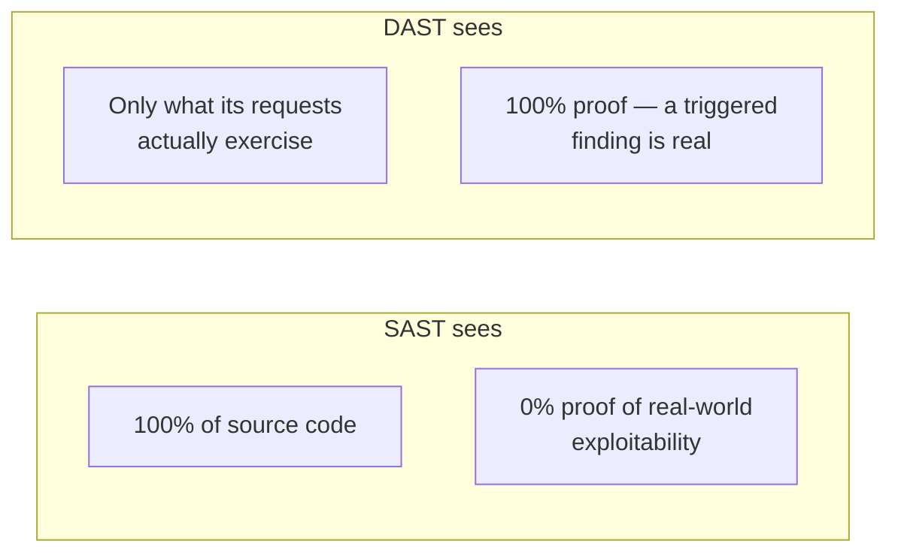
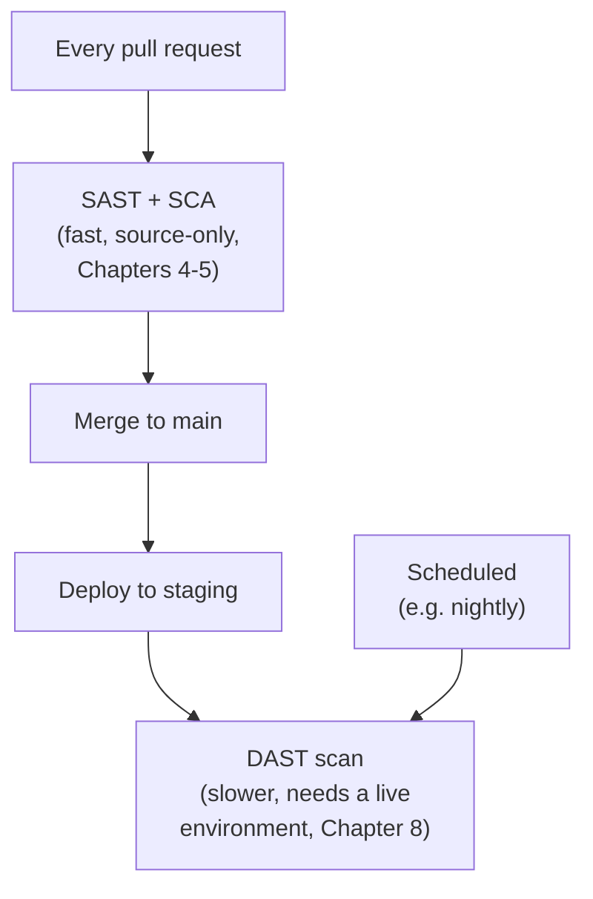
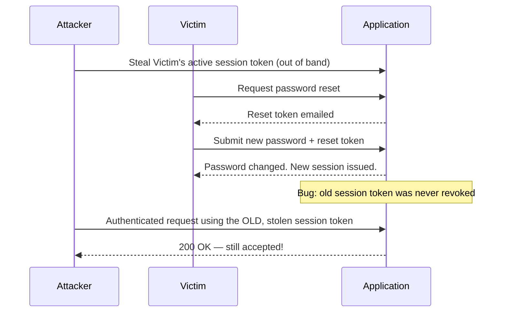

# Chapter 8 — DAST and Runtime Security Testing

## Learning Objectives

By the end of this chapter you will be able to:

- Explain what DAST tests and how, and why it's called "black-box" testing in contrast to SAST's "white-box" approach
- Reason precisely about what DAST catches that SAST structurally cannot, and vice versa
- Run an OWASP ZAP baseline or full scan against a target application from CI
- Explain why REST/GraphQL APIs need dedicated security testing beyond traditional web-page DAST, and name the OWASP API Security Top 10 at an awareness level
- Explain fuzzing conceptually and describe what kind of bug it discovers that pattern-based scanning does not
- Place DAST correctly in the pipeline relative to SAST/SCA, and justify why that placement is a legitimate tradeoff, not a shift-left failure
- Describe RASP at a conceptual level and where it sits relative to DAST

## Prerequisites for This Chapter

- **Chapter 4 — SAST and Static Code Analysis** — required. This chapter assumes you already have Chapter 4's SAST-vs-DAST table and picks up exactly where it left off, going to DAST's full depth.
- **Chapter 2 — Threat Modeling** — recommended; referenced when discussing how to prioritize what a DAST scan should target.
- **Chapter 5 — Dependency Scanning and SCA** and **Chapter 6 — Container and Image Security** — helpful, since the Real-World Scenario in this chapter assumes both are already green and asks what's left to find.
- **Kubernetes Basics and Advanced Kubernetes, Topics 8–9** — recommended background on microservice architectures, referenced in the API security section.
- **Chapter 1 — Introduction to DevSecOps**, specifically the shift-left timeline — this chapter's pipeline-placement discussion builds directly on it.

---

## 8.1 Recap: SAST vs. DAST, and Where This Chapter Picks Up

Chapter 4 introduced the SAST-vs-DAST distinction briefly, as a table, in order to explain what SAST does *not* do. It's worth restating the core line precisely before going further: **SAST reads source code without running it; DAST runs the application and attacks it from the outside, without reading its source code at all.**

This is why DAST is called **black-box testing** and SAST is called **white-box testing** — a SAST tool has the whole "box" open in front of it (every line of source, every function, every branch), while a DAST tool sees only what any external attacker would see: a running application it can send requests to and observe responses from, with zero visibility into what code produced those responses. A DAST tool testing your checkout service doesn't know it's written in Python, doesn't know which framework routes which URL, and doesn't know that a particular endpoint calls a particular database query internally — it only knows "I sent this HTTP request, and this is what came back."

---

## 8.2 What Each Approach Catches, and Why Neither Replaces the Other

It's tempting to think of DAST as "SAST, but later" — the same idea run at a different pipeline stage. That's wrong, and understanding precisely why is the most important conceptual point in this chapter.

### What DAST catches that SAST structurally cannot

SAST analyzes code in isolation. It's very good at spotting a dangerous pattern in a single function (string concatenation flowing into a SQL query, an unescaped variable rendered into HTML) but it cannot easily reason about behavior that only emerges from the **live interaction of multiple components at runtime**:

- A **misconfigured server header** — e.g., a web server leaking its exact version number in every response, which no source file "contains" as a bug; it's a runtime configuration fact.
- A **broken authentication flow across multiple requests** — e.g., a session token issued during login that remains valid even after the corresponding password-reset flow should have invalidated it. This bug doesn't live in any single function; it lives in the *sequence* of requests and the state the server maintains between them, which SAST — reading one file at a time — has no natural way to model.
- A **confirmed, exploitable reflected XSS** — SAST can flag "this variable looks unescaped when rendered," which is a plausible pattern match. DAST can go further and actually **prove** exploitability by sending a real payload and observing it executed in a real response — turning "this might be a problem" into "this definitely is, and here's the proof."

### What SAST catches that DAST structurally cannot

The relationship runs both ways. DAST only ever "sees" whatever the requests it sends manage to exercise — if a particular rarely-used admin endpoint, error-handling branch, or feature-flagged code path never gets hit by the scanner's crawl, DAST has no way to know that path even exists, let alone whether it's vulnerable. This is DAST's **coverage problem**: it sees 100% of what it actually exercises and 0% of everything else, whereas SAST sees 100% of the source code that exists, exercised or not — at the cost of never being fully sure a flagged pattern is actually reachable and exploitable in practice.

| | SAST | DAST |
|---|---|---|
| **Visibility** | Full source code ("white-box") | None — external requests/responses only ("black-box") |
| **Coverage** | Every line of code that exists | Only what the scan's crawl/requests actually exercise |
| **Confidence in findings** | Lower — pattern matches that may not be reachable/exploitable | Higher — a triggered vulnerability is proven exploitable |
| **Finds runtime-only issues (headers, session/auth flow bugs)** | No | Yes |
| **Needs a running instance** | No — needs only source code | Yes — needs a live, deployed target |
| **Typical pipeline stage** | Every PR (fast, source-only) | Staging/scheduled (slower, needs an environment) |

This is precisely why mature security programs run **both**, not one instead of the other — each one's blind spot is roughly the other one's strength.

### Letting your threat model decide what DAST actually looks for

DAST's coverage problem — it only finds what its requests actually exercise — means a generic, out-of-the-box ZAP scan is a reasonable baseline but not the whole story. Recall Chapter 2's threat modeling exercise: STRIDE analysis of a system identifies its highest-value attack surfaces (which endpoints handle authentication, which handle payment data, which cross a trust boundary between services). That analysis is exactly the input that should shape *where you point DAST's active-scanning effort*, rather than treating every endpoint as equally worth an attacker's — or a scanner's — time. A generic crawl might spend equal automated effort on a static marketing page and the authentication flow; a threat-model-informed scan configuration deliberately weights ZAP's active scan toward the endpoints the threat model already flagged as high-value, and adds custom authenticated contexts (section 8.3) specifically for those flows. DAST without a threat model still finds real bugs; DAST informed by one finds the bugs that matter most, faster.



---

## 8.3 OWASP ZAP: The Standard Open-Source DAST Tool

**OWASP ZAP (Zed Attack Proxy)** is the standard open-source DAST tool, and it's worth understanding conceptually before looking at how it's invoked, because it can operate in two quite different modes.

### Mode 1: Intercepting proxy, for exploratory manual testing

ZAP can run as a local proxy that sits between your browser (or `curl`, or any HTTP client) and the target application. You configure your browser to route traffic through ZAP, then use the application normally — logging in, clicking through workflows, submitting forms. ZAP passively records every request and response it observes, flags anything suspicious it notices along the way, and lets a security engineer manually replay and modify captured requests to probe specific behavior by hand. This mode is exploratory and human-driven — good for a security engineer doing focused, deliberate testing of a specific feature or flow.

### Mode 2: Automated baseline/full scan, for CI

For pipeline integration, ZAP offers automated scan modes that need no human in the loop:

- **Baseline scan** — a fast, passive scan: ZAP spiders (crawls) the target application to discover its structure, and observes traffic for obviously risky patterns, without actively trying to break anything. Low risk of side effects, fast enough to run frequently.
- **Full scan** — an active scan: after crawling, ZAP actively sends attack payloads — SQL injection attempts, XSS payloads, and more — against every discovered parameter and endpoint, genuinely trying to trigger vulnerabilities. Slower, and because it's actively attacking the target, it should only ever be pointed at a staging/test environment, never production.

```bash
# Baseline scan (passive, fast) against a staging URL — Docker-based, as ZAP ships officially
docker run --rm -t zaproxy/zap-stable zap-baseline.py \
  -t https://staging.mycompany.com \
  -r zap-baseline-report.html

# Full scan (active, slower, more thorough) — only ever against staging, never production
docker run --rm -t zaproxy/zap-stable zap-full-scan.py \
  -t https://staging.mycompany.com \
  -r zap-full-scan-report.html \
  -m 10   # crawl for a maximum of 10 minutes before starting active attacks
```

A realistic CI job wiring this into a pipeline, running after a deploy to staging:

```yaml
# .github/workflows/dast.yml — runs after deployment to staging, not on every PR
name: DAST Scan
on:
  workflow_run:
    workflows: ["Deploy to Staging"]
    types: [completed]

jobs:
  zap-baseline:
    runs-on: ubuntu-latest
    steps:
      - name: Run OWASP ZAP baseline scan
        run: |
          docker run --rm -v $(pwd):/zap/wrk/:rw -t zaproxy/zap-stable zap-baseline.py \
            -t https://staging.mycompany.com \
            -r zap-report.html \
            -x zap-report.xml || true   # ZAP exits non-zero on findings; don't hard-fail the build outright

      - name: Upload ZAP report
        uses: actions/upload-artifact@v4
        with:
          name: zap-baseline-report
          path: zap-report.html
```

The `|| true` above is a deliberate, common pattern in early ZAP adoption — treat findings as visibility first (a report to review), and only graduate to hard-failing the build on specific finding severities once your team has triaged a baseline of expected findings, in the same spirit as Chapter 4's advice on avoiding an avalanche of unreviewed SAST findings blocking every PR on day one.

---

## 8.4 API Security Testing: A DAST Specialization for Microservice Architectures

Traditional DAST tooling grew up testing server-rendered web pages — crawl the HTML, find forms and links, attack the parameters. Advanced Kubernetes (Topic 9) was built entirely around a different shape of system: many independent services communicating over the network via REST or GraphQL APIs, often with no HTML page at all in the request path. This shape needs dedicated attention, because API-specific vulnerability classes don't map neatly onto "find a form and attack its fields."

Two of the most common, concrete API-specific issues:

- **Broken Object-Level Authorization (BOLA)** — a user is authenticated and legitimately allowed to call `GET /api/orders/{id}`, but the API fails to check that the specific `{id}` they requested actually belongs to *them*. Simply changing the ID in the URL — `GET /api/orders/1042` to `GET /api/orders/1043` — lets one user read (or sometimes modify) another user's data, purely because the authorization check happened at the "can you call this endpoint at all?" level rather than the "do you own this specific resource?" level. This is subtle precisely because the endpoint works correctly for the attacker's own data every time it's tested casually — the bug only shows up when someone deliberately tries someone else's ID.
- **Excessive data exposure** — an API endpoint's response includes far more fields than the calling UI actually displays or uses (e.g., an internal `is_admin` flag, a password hash, an internal cost field), on the reasoning that "the frontend just ignores fields it doesn't need." The problem is that anyone can bypass the frontend entirely and call the API directly, seeing every field the response actually contains, whether or not any UI was ever built to display it.

Both issues are largely invisible to traditional page-crawling DAST, because both require testing the API's *authorization logic and response shape* directly, with an understanding of what "belongs to another user" or "was never meant to be exposed" actually means for that specific API — which is why dedicated API security testing tools and techniques (many built as ZAP extensions or standalone API-scanning tools that can import an OpenAPI/Swagger or GraphQL schema and generate authorization-focused test cases from it) have become their own specialization.

The **OWASP API Security Top 10** is the API-specific analog to the classic OWASP Top 10 (which Chapter 4 likely referenced for SAST-relevant patterns) — it exists precisely because API vulnerability classes (broken object-level authorization, excessive data exposure, lack of rate limiting, and others) are different enough from classic web-page vulnerabilities to warrant their own prioritized list. Know that this list exists and broadly what it covers; a deep, item-by-item treatment is outside this chapter's scope.

### Tuning ZAP for authenticated scanning

Most real applications hide their most interesting attack surface behind a login — an unauthenticated crawl of a typical SaaS product mostly finds the marketing site and the login page, not the checkout flow or the account settings page where the actual business logic lives. Production ZAP scans are almost always configured with authentication context so the scanner can log in and crawl the application the way a real logged-in user (or attacker with stolen credentials) would:

```yaml
# A simplified ZAP automation framework config (zap-automation.yaml),
# used with `zap-baseline.py`/`zap-full-scan.py`'s -c flag to define
# how ZAP should authenticate before crawling
env:
  contexts:
    - name: "staging-authenticated"
      urls: ["https://staging.mycompany.com"]
      authentication:
        method: "form"
        parameters:
          loginUrl: "https://staging.mycompany.com/login"
          loginRequestData: "username=&password="
      users:
        - name: "test-user"
          credentials:
            username: "zap-scan-user@mycompany.com"
            password: "$ZAP_SCAN_PASSWORD"   # injected from CI secrets, never hardcoded
```

Note the dedicated `zap-scan-user` account — production security scanning should use a purpose-built, low-privilege test account provisioned specifically for automated scanning, never a real engineer's or real customer's credentials, and never an administrator account (an active scan attacking every field it can find is not something you want running with admin-level access).

---

## 8.5 Fuzzing: Finding the Unknown Unknowns

SAST looks for known dangerous *patterns* in code. DAST (in its ZAP form) actively probes for known *classes* of vulnerability by sending crafted attack payloads. **Fuzzing** is a third, genuinely different technique: automatically generating large volumes of random, malformed, or boundary-case input and feeding it to an application or API, purely to see what breaks.

The mental model: rather than a scanner reasoning "this looks like a SQL injection pattern," a fuzzer reasons nothing at all about vulnerability classes — it just throws enormous quantities of weird input at the target (empty strings, absurdly long strings, negative numbers where positive ones are expected, deeply nested structures, malformed encodings, unexpected data types) and watches for crashes, hangs, memory errors, or any other unexpected behavior. A crash or hang discovered this way might indicate a security-relevant bug (a buffer overflow in a lower-level language like C/C++, or a denial-of-service condition in any language) — but the fuzzer found it by brute-force exploration of the input space, not by matching a known bad pattern.

A simple, concrete example: an API endpoint that accepts a JSON request body works correctly for every normal input a developer tested — but a fuzzer feeding it a JSON payload nested 10,000 levels deep, or a single string field containing several megabytes of data, causes the server's JSON parser to hang or crash, exhausting memory or CPU. No developer wrote a test for "what if someone sends absurdly deep nesting," and no SAST pattern flags "this JSON parsing call is dangerous" — the bug only surfaces when something actually throws that specific edge case at the running system.

Fuzzing is complementary to, not a replacement for, SAST and DAST: it's less about confirming known vulnerability classes and more about discovering entirely unknown edge-case failures that nobody thought to write a specific test or rule for.

### A minimal fuzzing example

Tools like **`ffuf`** (content/parameter discovery), **`wfuzz`**, and language-specific fuzzers (**AFL**, **libFuzzer** for C/C++; **Atheris** for Python; Go's built-in `go test -fuzz`) automate this generation-and-observation loop. A simple illustration using Go's built-in fuzzing support against a JSON-parsing function:

```go
func FuzzParseOrder(f *testing.F) {
    f.Add([]byte(`{"id": 1, "item": "widget"}`))  // a seed corpus example
    f.Fuzz(func(t *testing.T, data []byte) {
        // The fuzzer will now generate thousands of mutated variants of this
        // input automatically — truncated JSON, deeply nested objects, huge
        // strings, invalid UTF-8 — and report any input that causes a panic.
        ParseOrder(data)
    })
}
```

```bash
go test -fuzz=FuzzParseOrder -fuzztime=60s
```

Running this for even a minute against a real parsing function often surfaces at least one crash on a codebase that's never been fuzzed before — a concrete, low-effort way to see the technique work rather than just reading about it.

Fuzzing complements SAST, DAST, and known-pattern scanning along a distinct axis:

| Technique | Finds | Needs |
|---|---|---|
| SAST (Ch. 4) | Known dangerous *code patterns* | Source code only |
| SCA (Ch. 5) / image scanning (Ch. 6) | Known-*vulnerable dependency/package versions* | A manifest or built image |
| DAST (ZAP) | Known vulnerability *classes*, confirmed exploitable at runtime | A running application |
| Fuzzing | *Unknown* edge-case crashes/hangs, no prior pattern needed | A running function, API, or binary to feed input to |

---

## 8.6 Where DAST Fits in the Pipeline — an Honest Constraint

SAST and SCA (Chapters 4–5) need nothing but source code and a dependency manifest — they can run in seconds on every single pull request, before anything is even built. DAST has a hard structural requirement neither of those has: **it needs a running instance of the application to attack.** You cannot DAST-scan source code; there is nothing running to send requests to. This isn't a shortcoming of the tooling — it's inherent to what black-box testing means.

In most real pipelines, spinning up a full, realistic environment (with a database, dependent services, realistic data) for every single pull request is too slow and too expensive to do dozens of times a day. The practical consequence: DAST typically runs **later** than SAST/SCA — against a shared staging/pre-production environment, either on merge to a main branch or on a recurring schedule (nightly, or a few times a week) — not on every PR.



Tie this back explicitly to Chapter 1's shift-left theme: this placement is **not** a failure to fully shift left. Shift-left means "run each check as early as it can meaningfully run," not "run every check on every PR regardless of what it needs." DAST's requirement for a live environment is a genuine, structural constraint, not a team being lazy about pipeline design — running DAST on staging or on a schedule, while still automated and still far earlier than the old "manual pentest three days before release" model, is a legitimate point on the shift-left spectrum, just further right than SAST/SCA for a real reason.

---

## 8.7 RASP: A Brief, Further-Right Complement

One more approach worth knowing the name of, even further right on the timeline than DAST: **RASP (Runtime Application Self-Protection)**. RASP is application-embedded protection — instrumentation built into the running production application itself — that can detect and actively block attacks in real time, as they happen against real production traffic, rather than during a dedicated pre-production test.

RASP is a less universally-adopted, more specialized approach than DAST — it typically requires language- or framework-specific agents woven into the application runtime, and organizations adopt it selectively for particularly high-value applications rather than as a default practice everywhere. Treat this as an awareness-level concept: know that "protection embedded in the live running application" is a distinct category from "testing performed against a staging environment before release," and that it exists as an option for teams with a strong enough risk profile to justify the added complexity.

---

## 8.8 Real-World Scenario: The Gap Only DAST Could Have Caught

A payments team ships a password-reset feature. Chapter 4's SAST scan runs clean on every PR — no dangerous patterns flagged. Chapter 5's SCA scan is clean — no vulnerable dependencies. The feature is merged and deployed to staging.

That night, a **scheduled** ZAP full scan against staging exercises the actual multi-request password-reset flow: request a reset token, submit a new password using that token, then attempt to reuse the **original, pre-reset session token** on an authenticated endpoint. The session token still works — the reset flow changed the password but never invalidated the session that was active before the reset. An attacker who had already stolen a victim's session token (through any of several common means) could keep using it indefinitely, completely unaffected by the victim's own attempt to secure their account by resetting their password.



This is precisely the class of bug SAST is structurally unable to catch: it isn't a dangerous pattern inside any single function, it's an emergent property of a *sequence* of requests and the server-side session state connecting them — invisible to a tool reading one file at a time, and only observable by an approach that actually drives the real multi-request flow against a real running system. The DAST scan catches it exactly because it does what SAST cannot: exercise the live application the way a real attacker sequence would.

The fix, once found, is simple and well-understood — invalidate every existing session for an account the moment its password is reset — but the point of this scenario isn't the fix, it's that **nothing short of actually driving the live multi-request flow would have surfaced the bug in the first place.** The team adds a regression test for this specific sequence going forward, but it took a DAST scan finding it once for anyone to know the test needed to exist.

---

## Best Practices

- Run both SAST/SCA and DAST — they cover different, non-overlapping classes of bug, and neither substitutes for the other.
- Start ZAP in baseline (passive) mode in CI before graduating to full (active) scans, and only ever point active scans at staging, never production.
- Treat early DAST findings as a report to triage, not an automatic hard build failure, until your team has established a baseline of expected/accepted findings.
- Give API endpoints dedicated authorization-focused testing (BOLA in particular) — traditional page-crawling DAST will not naturally discover it.
- Schedule DAST scans regularly (nightly or on merge to staging) rather than treating a one-time scan as sufficient forever.

## Common Mistakes

- Running an active ("full") ZAP scan against a production environment, causing real side effects on real data.
- Assuming a clean SAST/SCA result means the application is secure, when neither can see runtime-only, multi-request, or configuration-level issues.
- Testing only the happy-path UI and never testing the API layer directly with someone else's resource IDs (the BOLA gap).
- Treating DAST's later pipeline placement as a shift-left failure rather than a legitimate, structural constraint of needing a live target.

## Summary

DAST tests a running application from the outside, the way a real attacker would, with no visibility into source code — "black-box," contrasted with SAST's "white-box" approach. DAST catches runtime-only issues (misconfigured headers, broken multi-request auth flows, proven-exploitable XSS) that SAST structurally cannot see, while SAST sees 100% of source code but can't confirm real-world exploitability — which is why mature programs run both. **OWASP ZAP** is the standard open-source DAST tool, runnable as an interactive proxy or as automated baseline/full scans in CI. Modern microservice architectures need dedicated **API security testing** for issues like broken object-level authorization and excessive data exposure, cataloged in the OWASP API Security Top 10. **Fuzzing** is a complementary technique, feeding random/malformed input to discover unknown edge-case failures rather than known vulnerability patterns. Because DAST needs a live running target, it naturally runs later in the pipeline than SAST/SCA — a legitimate tradeoff, not a shift-left failure — and **RASP** is a further-right, more specialized complement that protects the live production application in real time.

## Knowledge Check

1. Why is SAST called "white-box" and DAST called "black-box"?
2. Give a concrete example of a bug DAST can find that SAST structurally cannot, and explain why SAST can't see it.
3. What is the difference between ZAP's baseline scan and full scan, and why should the full scan only target staging, never production?
4. What is Broken Object-Level Authorization, and why do traditional page-crawling DAST scans often miss it?
5. How does fuzzing differ from both SAST's pattern-matching and DAST's active-attack-payload approach?
6. Why does DAST typically run later in the pipeline than SAST/SCA, and why is this not a shift-left failure?

## Hands-On Exercise

1. Deploy any small intentionally-vulnerable web app locally (e.g., OWASP Juice Shop via Docker) to act as your target.
2. Run `zap-baseline.py` against it using the Docker command shown in section 8.3, and review the generated HTML report.
3. Run `zap-full-scan.py` against the same target and compare the findings — note which additional, actively-triggered vulnerabilities appear that the baseline scan didn't find.
4. Manually test for a BOLA issue: authenticate as one test user, note a resource ID belonging to another test user, and attempt to access it directly via the API.
5. Write a one-paragraph justification for where in your own team's pipeline a DAST scan should run, given the constraint that it needs a live environment.

## Further Reading

- zaproxy.org — official OWASP ZAP documentation, including baseline/full scan automation
- owasp.org/www-project-api-security — the OWASP API Security Top 10
- owasp.org/www-project-web-security-testing-guide — the broader OWASP Web Security Testing Guide
- google.github.io/oss-fuzz — Google's continuous fuzzing infrastructure for open-source projects
- owasp.org/www-community/Zed_Attack_Proxy_Project — background on ZAP's proxy and automated scan modes

---

<div style="display:flex;justify-content:space-between;align-items:center;">
  <a href="./07-software-supply-chain-security.md">← Previous: Software Supply Chain Security</a>
  <a href="./00-index.md">🏠 Index</a>
  <a href="./09-infrastructure-as-code-security.md">Next: Infrastructure as Code Security →</a>
</div>
