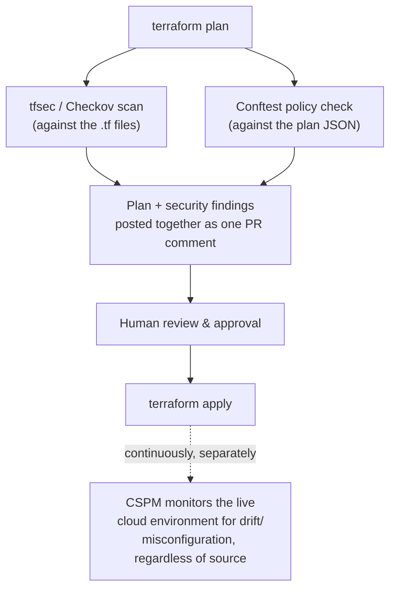

# Chapter 9 — Infrastructure as Code Security

## Learning Objectives

By the end of this chapter you will be able to:

- Explain why IaC security scanning is the earliest and cheapest possible shift-left checkpoint in this entire course
- Identify common Terraform misconfigurations that IaC scanners catch, and explain why each one is dangerous
- Run `tfsec` and Checkov against a Terraform configuration and interpret their findings
- Generalize the policy-as-code pattern from Advanced Kubernetes' admission control to IaC generally, using OPA/Conftest against Terraform plan output
- Integrate an IaC security scan into a real Terraform CI/CD pipeline, at the correct point relative to plan and apply
- Explain what Cloud Security Posture Management (CSPM) adds beyond point-in-time IaC scanning, and why both are needed

## Prerequisites for This Chapter

- **Infrastructure as Code (Terraform), Topic 7** — required, specifically Chapter 10 (AWS Networking), Chapter 14 (CI/CD Integration), and Chapter 15 (Best Practices), which briefly mentioned `tfsec`/Checkov. This chapter goes to full depth on exactly that mention.
- **Advanced Kubernetes, Chapter 3 (Admission Control and Pod Security)** — required. This chapter applies the same OPA/policy-as-code pattern you already learned there to Terraform/IaC generally, and assumes you don't need OPA re-explained from scratch.
- **Advanced Kubernetes, Chapter 15 (Common Mistakes)**, specifically the `cluster-admin` over-permissioning example — referenced directly as the same anti-pattern in a different system.
- **Cloud Fundamentals AWS, Chapter 10 (Security)** — recommended background on the AWS security services (GuardDuty, Config) that this chapter's CSPM section builds on.

---

## 9.1 The Earliest, Cheapest Shift-Left Checkpoint in This Entire Course

Terraform Chapter 15 mentioned, briefly, that a code review checklist should ask "are security groups minimally permissive?" and "is data encrypted at rest?" — good instincts, but dependent entirely on a human reviewer remembering to look, and looking carefully, at every single PR, forever. This chapter is about automating that check away from human memory entirely: **scanning Infrastructure as Code for security misconfigurations before it is ever applied** — before `terraform apply` creates a single real resource.

Think back to Chapter 1's shift-left cost curve: a bug caught in a PR costs minutes; a bug caught in production can cost weeks and real financial/regulatory damage. IaC security scanning sits at the absolute leftmost point that curve can reach in this entire course, earlier even than Chapter 4's SAST scanning of application code. SAST finds a bug in code that, once deployed, becomes a vulnerability in a running application. IaC scanning finds a bug in a **plan** for infrastructure that doesn't exist yet at all — if it's caught here, the insecure resource is never created, not even for a single second. There's no "the vulnerable version was live for six hours before we patched it" story possible, because nothing was ever live in the first place. This is shift-left taken to its logical extreme: catching the mistake at the earliest point the entire lifecycle offers.

---

## 9.2 Concrete Misconfigurations IaC Scanners Catch

These are not abstract examples — they're exactly the kind of Terraform you wrote in Topic 7, with one line changed to make them dangerous. Recognizing the *pattern*, not just the specific resource type, is the actual skill.

### A public S3 bucket

```hcl
# DANGEROUS — flagged immediately by any IaC scanner
resource "aws_s3_bucket" "logs" {
  bucket = "mycompany-app-logs"
  acl    = "public-read"     # anyone on the internet can list and read every object
}

# ALSO DANGEROUS — missing the explicit public-access block entirely,
# which Terraform Chapter 10's networking chapter covered as the correct default
resource "aws_s3_bucket" "logs" {
  bucket = "mycompany-app-logs"
  # no aws_s3_bucket_public_access_block resource at all —
  # relies on account-level defaults that may not be set
}
```

The fix — the same "don't expose things publicly by default" theme that ran through the Docker and AWS courses — is to attach an explicit public-access block resource:

```hcl
resource "aws_s3_bucket_public_access_block" "logs" {
  bucket                  = aws_s3_bucket.logs.id
  block_public_acls       = true
  block_public_policy     = true
  ignore_public_acls      = true
  restrict_public_buckets = true
}
```

### An overly permissive security group

```hcl
# DANGEROUS — SSH open to the entire internet
resource "aws_security_group_rule" "ssh_ingress" {
  type              = "ingress"
  from_port         = 22
  to_port           = 22
  protocol          = "tcp"
  cidr_blocks       = ["0.0.0.0/0"]   # anyone, anywhere, can attempt to connect
  security_group_id = aws_security_group.app.id
}
```

### An unencrypted database or volume

```hcl
# DANGEROUS — no encryption at rest
resource "aws_db_instance" "main" {
  engine            = "postgres"
  instance_class    = "db.t3.medium"
  allocated_storage = 100
  # storage_encrypted not set — defaults to false
}

resource "aws_ebs_volume" "data" {
  availability_zone = "us-east-1a"
  size              = 100
  # encrypted not set — defaults to false
}
```

The fix in both cases is one line — `storage_encrypted = true` / `encrypted = true` — which is exactly why an automated scanner catching this before apply is so much more effective than hoping a reviewer notices a single missing argument in a 40-line resource block.

### An overly permissive IAM policy

```hcl
# DANGEROUS — grants every action on every resource
resource "aws_iam_policy" "app" {
  name = "app-policy"
  policy = jsonencode({
    Version = "2012-10-17"
    Statement = [{
      Effect   = "Allow"
      Action   = "*"
      Resource = "*"
    }]
  })
}
```

Recognize this pattern: it's the exact same over-permissioning anti-pattern as Advanced Kubernetes Chapter 15's `cluster-admin` mistake — granting a broad, unscoped "can do anything, to anything" permission under time pressure, in a different system (IAM instead of RBAC). The impact is structurally identical too: a compromised credential or CI job holding this policy has unrestricted blast radius across the entire AWS account, not just the access the application actually needs.

---

## 9.3 `tfsec` and Checkov: The Two Common Open-Source IaC Scanners

Two open-source scanners dominate the Terraform ecosystem, and they solve overlapping but distinctly-scoped problems.

**`tfsec`** is Terraform-native and fast — it understands HCL directly, has a large library of built-in rules matching exactly the misconfigurations above, and is often the first tool teams adopt because it requires essentially zero setup.

```bash
$ tfsec .

Result #1 HIGH Bucket does not have encryption enabled
──────────────────────────────────────────────────────
  main.tf:12
     12    resource "aws_s3_bucket" "logs" {
     13      bucket = "mycompany-app-logs"
     14      acl    = "public-read"

  Impact          Data can be read from the bucket by anyone with access to the bucket URL
  Resolution      Configure bucket encryption and block public access

  More info:
  - https://aquasecurity.github.io/tfsec/latest/checks/aws/s3/enable-bucket-encryption/
  - https://registry.terraform.io/providers/hashicorp/aws/latest/docs/resources/s3_bucket_server_side_encryption_configuration

  1 potential problem detected.
```

**Checkov** supports a much broader range of IaC formats beyond Terraform alone — CloudFormation, Kubernetes manifests, Dockerfiles, Helm charts, Serverless Framework, and more — making it the more general-purpose choice for an organization that has more than one kind of IaC in its estate (which, after Topics 7 and 8-9 of this roadmap, most organizations following this course actually do).

```bash
$ checkov -d .

Check: CKV_AWS_20: "S3 Bucket has an ACL defined which allows public READ access"
        FAILED for resource: aws_s3_bucket.logs
        File: /main.tf:12-15
        Guide: https://docs.bridgecrew.io/docs/s3_16-acl-permission-check

Check: CKV_AWS_21: "Ensure the S3 bucket has versioning enabled"
        FAILED for resource: aws_s3_bucket.logs
        File: /main.tf:12-15

Passed checks: 42, Failed checks: 2, Skipped checks: 0
```

### Comparison

| | `tfsec` | Checkov |
|---|---|---|
| **Scope** | Terraform only | Terraform, CloudFormation, Kubernetes manifests, Dockerfiles, Helm, Serverless, and more |
| **Speed** | Very fast — purpose-built for Terraform | Slightly slower, broader analysis surface |
| **Best fit** | Terraform-only shops wanting the fastest, most focused feedback | Multi-IaC-format organizations wanting one scanner across everything |
| **Rule coverage for Terraform specifically** | Deep, Terraform-idiomatic | Broad and deep, comparable coverage |

Many organizations run both, or standardize on Checkov specifically because it lets one tool and one CI step cover Terraform, the Kubernetes manifests from Topics 8–9, and the Dockerfiles from Topic 4, rather than maintaining a different scanner per IaC format.

---

## 9.4 Policy as Code, Generalized Beyond Kubernetes

Recall Advanced Kubernetes Chapter 3 exactly: a `ConstraintTemplate`/`Constraint` pair (OPA/Gatekeeper) or a `ClusterPolicy` (Kyverno), written declaratively, evaluated automatically at admission time, enforcing organization-specific rules that go beyond whatever a scanner's built-in rule library already knows about. That entire pattern — policy as code, evaluated automatically rather than living on a wiki page nobody reads — generalizes far beyond Kubernetes admission control.

The **same underlying engine**, **OPA (Open Policy Agent)**, generalizes to Terraform (and any structured JSON/YAML config at all) via **Conftest** — a tool that runs OPA's **Rego** policy language against arbitrary structured input, including `terraform show -json` plan output, in CI, **before `terraform apply` ever runs.**

### A Rego policy against Terraform plan output

```rego
# policy/s3_encryption.rego
package main

deny[msg] {
  resource := input.resource_changes[_]
  resource.type == "aws_s3_bucket"
  not resource.change.after.server_side_encryption_configuration
  msg := sprintf(
    "S3 bucket '%v' does not have encryption enabled",
    [resource.address],
  )
}

deny[msg] {
  resource := input.resource_changes[_]
  resource.type == "aws_security_group_rule"
  resource.change.after.type == "ingress"
  resource.change.after.from_port <= 22
  resource.change.after.to_port >= 22
  cidr := resource.change.after.cidr_blocks[_]
  cidr == "0.0.0.0/0"
  msg := sprintf(
    "Security group rule '%v' allows SSH ingress from 0.0.0.0/0",
    [resource.address],
  )
}
```

### Running it in CI against the plan

```bash
# Generate a machine-readable JSON representation of the plan (Terraform Chapter 14's -out=tfplan, extended)
terraform plan -out=tfplan
terraform show -json tfplan > tfplan.json

# Run Conftest against the plan JSON, using the Rego policy above
conftest test --policy policy/ tfplan.json
```

```
FAIL - tfplan.json - main - S3 bucket 'aws_s3_bucket.logs' does not have encryption enabled
FAIL - tfplan.json - main - Security group rule 'aws_security_group_rule.ssh_ingress' allows SSH ingress from 0.0.0.0/0

2 tests, 0 passed, 2 failed, 0 warnings
```

This is the exact same value proposition as Advanced Kubernetes Chapter 3's `ConstraintTemplate`: organization-specific rules ("no S3 bucket may be created without encryption enabled," "no security group may allow ingress from 0.0.0.0/0 on port 22") expressed **as code**, version-controlled alongside the infrastructure it governs, evaluated automatically on every single plan — not documented in a wiki page that a reviewer has to remember exists and manually cross-check.

---

## 9.5 Integrating IaC Scanning into the Real Terraform CI/CD Workflow

Terraform Chapter 14 established the standard workflow: `terraform plan` runs on every PR, its output is posted as a PR comment for human review, and `terraform apply` runs only after approval and merge to `main`. The security scan step fits into that workflow at one specific, deliberate point: **after `terraform plan`, before the plan is posted for human review** — so that reviewers see security findings side-by-side with the infrastructure diff itself, in the same PR comment, rather than as a disconnected report in a separate system that nobody correlates with the change under review.



```yaml
# .github/workflows/terraform.yml — extending Terraform Chapter 14's plan-on-PR workflow
name: Terraform Plan
on:
  pull_request:
    paths: ["infra/**"]

jobs:
  plan-and-scan:
    runs-on: ubuntu-latest
    steps:
      - uses: actions/checkout@v4

      - name: Terraform Plan
        run: |
          terraform init
          terraform plan -out=tfplan
          terraform show -json tfplan > tfplan.json

      - name: Run tfsec
        id: tfsec
        run: tfsec . --format json --out tfsec-results.json || true

      - name: Run Conftest policy check
        id: conftest
        run: conftest test --policy policy/ tfplan.json --output json > conftest-results.json || true

      - name: Post plan + security findings to PR
        uses: actions/github-script@v7
        with:
          script: |
            // Combine terraform plan output, tfsec-results.json, and
            // conftest-results.json into a single PR comment here,
            // so reviewers see the diff and the security findings together.
```

The critical design decision is that last step: security findings are **attached to the same PR comment as the infrastructure diff**, not emailed to a separate security dashboard. A reviewer approving a plan that adds a new S3 bucket sees, in the same place, "this bucket has no encryption configured" — there's no separate system to check, no correlation step a busy reviewer might skip.

---

## 9.6 CSPM: The Continuous Counterpart to Point-in-Time Scanning

Everything so far in this chapter catches misconfigurations **introduced through your IaC pipeline** — but that leaves a real gap. Recall **configuration drift** from Terraform Chapter 1 (infrastructure's actual state diverging from what's declared in code) and Advanced Kubernetes Chapter 8's GitOps drift-detection concept (a cluster's live state diverging from what Git says it should be, corrected automatically by tools like Argo CD with `selfHeal`). The identical phenomenon happens to cloud security posture specifically: someone makes a manual change directly in the AWS console — perhaps during an incident, perhaps just carelessly — that never goes through Terraform at all. `tfsec`, Checkov, and Conftest scan **plans**; none of them can see a change that never produced a plan in the first place.

**Cloud Security Posture Management (CSPM)** tools close exactly this gap by continuously scanning the **live cloud environment itself**, regardless of how any given resource got there — through Terraform, through a console click, through an emergency `aws` CLI command during an incident, or otherwise. AWS's own **Security Hub** (which aggregates findings from GuardDuty and Config, both covered in Cloud Fundamentals AWS Chapter 10) provides this natively within AWS; third-party tools like **Wiz** and **Prisma Cloud** provide the same continuous-monitoring capability, often across multiple cloud providers at once, at an awareness level worth knowing the names of even without deep tool-specific study here.

The relationship between IaC scanning and CSPM is complementary, not redundant, in the exact same way SAST and DAST are complementary (Chapter 8): IaC scanning is early, cheap, and prevents a misconfiguration from ever being created through your pipeline; CSPM is continuous and catches misconfigurations regardless of source, including the ones that bypassed your pipeline entirely. An organization relying on IaC scanning alone has a blind spot exactly the size of "anything anyone changed by hand" — which, in any real organization with more than a handful of engineers holding console access, is not a theoretical risk.

---

## 9.7 Real-World Scenario: The Bucket That Was Never Insecure, Even for a Moment

An engineer opens a pull request adding a new S3 bucket to support a logging feature. The Terraform is straightforward — nothing malicious, nothing careless, just a developer moving quickly and forgetting two things a busy human reviewer might well have missed too.

```hcl
resource "aws_s3_bucket" "feature_logs" {
  bucket = "mycompany-feature-logs"
}

resource "aws_s3_bucket_policy" "feature_logs" {
  bucket = aws_s3_bucket.feature_logs.id
  policy = jsonencode({
    Version = "2012-10-17"
    Statement = [{
      Effect    = "Allow"
      Principal = "*"
      Action    = "s3:GetObject"
      Resource  = "${aws_s3_bucket.feature_logs.arn}/*"
    }]
  })
}
```

The CI pipeline runs `terraform plan`, then `tfsec` and Conftest against it, automatically, before any human ever opens the PR to review it. Two findings appear directly in the PR:

```
HIGH  Bucket does not have encryption enabled — aws_s3_bucket.feature_logs
HIGH  Bucket policy grants access to Principal "*" — aws_s3_bucket_policy.feature_logs
      (effectively public read access to every object in the bucket)
```

The engineer reads the remediation guidance linked in the findings, adds `server_side_encryption_configuration` to the bucket and scopes the policy's `Principal` down to the specific IAM role that actually needs to write logs, and pushes a fix — all within the same PR, before a single human reviewer has even looked at the diff, and long before `terraform apply` would ever have run against it.

This is the clearest possible illustration of shift-left security paying off at the cheapest, earliest point this entire course covers: the insecure bucket was never created, not even for a moment. There's no incident, no exposure window, no "we noticed and fixed it within the hour" story to tell — because there was never anything to notice in production at all. The mistake was caught and corrected while it was still just text in a pull request.

---

## Best Practices

- Run `tfsec` and/or Checkov on every `terraform plan`, and post findings alongside the plan diff in the same PR comment — never as a disconnected report.
- Use Conftest/OPA to encode organization-specific rules that go beyond a scanner's built-in library — the exact same policy-as-code discipline you already applied to Kubernetes admission control.
- Treat any IAM policy with `"Action": "*"` / `"Resource": "*"`, or any security group with `0.0.0.0/0` on a sensitive port, as an automatic, non-negotiable finding — these are the IaC equivalents of a `cluster-admin` grant.
- Deploy a CSPM tool (AWS Security Hub at minimum) to catch drift and manual changes that bypass your IaC pipeline entirely — IaC scanning alone cannot see those.
- Fail the build on high-severity findings once your team has triaged a baseline, in the same audit-then-enforce spirit as Advanced Kubernetes Chapter 3's policy rollout pattern.

## Common Mistakes

- Running IaC scanners only as a manual, occasional exercise instead of wiring them into every `terraform plan` in CI.
- Treating IaC scanning and CSPM as redundant, when they cover different failure modes (pipeline-introduced misconfiguration vs. drift/manual changes).
- Posting security findings to a separate dashboard nobody checks, disconnected from the PR the reviewer is actually looking at.
- Copying the "grant everything to unblock the team" anti-pattern from RBAC into IAM policies, under the same kind of time pressure.
- Adopting a scanner in blocking/enforce mode on day one against an existing, large Terraform codebase, generating an avalanche of findings on unrelated PRs and eroding trust in the tool.

## Summary

IaC security scanning catches misconfigurations before any real infrastructure is created — the earliest and cheapest possible shift-left checkpoint in this entire course. Common findings include public S3 buckets, overly permissive security groups, unencrypted databases/volumes, and IAM policies granting `"Action": "*"` on `"Resource": "*"` — the exact same over-permissioning anti-pattern as Advanced Kubernetes' `cluster-admin` mistake. **`tfsec`** is fast and Terraform-native; **Checkov** covers a broader range of IaC formats, making it the better fit for multi-format organizations. **Policy as code**, via **OPA and Conftest**, generalizes the exact pattern from Advanced Kubernetes' admission control (Rego, `ConstraintTemplate`) to Terraform plan output, enforcing organization-specific rules in CI before `terraform apply` ever runs. The scan step belongs right after `terraform plan` and before human review, so findings and the infrastructure diff are seen together. **CSPM** tools (AWS Security Hub, Wiz, Prisma Cloud) complement point-in-time IaC scanning by continuously monitoring the live cloud environment for drift and misconfiguration regardless of how it got there.

## Knowledge Check

1. Why is IaC scanning described as the earliest possible shift-left checkpoint in this course, even earlier than SAST?
2. Name three concrete Terraform misconfigurations an IaC scanner would flag, and the one-line fix for each.
3. What is the key difference in scope between `tfsec` and Checkov, and when would you choose one over the other?
4. How does Conftest generalize the OPA policy-as-code pattern you learned in Advanced Kubernetes Chapter 3 to Terraform?
5. At exactly what point in the Terraform CI/CD workflow should the security scan step run, and why does that placement matter?
6. What gap does CSPM close that IaC scanning alone cannot, and why?

## Hands-On Exercise

1. Write a small Terraform configuration that creates an S3 bucket with `acl = "public-read"` and no encryption configuration.
2. Run `tfsec .` and `checkov -d .` against it separately, and compare the findings each tool reports.
3. Fix the configuration to add an `aws_s3_bucket_public_access_block` resource and enable server-side encryption. Re-run both scanners and confirm the findings clear.
4. Write a Rego policy (using the example in section 9.4 as a template) that denies any `aws_db_instance` resource without `storage_encrypted = true`, and run it with `conftest test` against a `terraform show -json` plan that violates it.
5. Add a step to a GitHub Actions workflow that runs `tfsec` after `terraform plan` and fails the job if any `HIGH` or `CRITICAL` severity finding is present.

## Further Reading

- aquasecurity.github.io/tfsec — `tfsec` documentation and full rule reference
- checkov.io — Checkov documentation, including its multi-IaC-format rule library
- openpolicyagent.org/docs/latest — OPA and Rego language documentation
- conftest.dev — Conftest documentation, including Terraform plan JSON examples
- aws.amazon.com/security-hub — AWS Security Hub documentation

---

<div style="display:flex;justify-content:space-between;align-items:center;">
  <a href="./08-dast-and-runtime-security-testing.md">← Previous: DAST and Runtime Security Testing</a>
  <a href="./00-index.md">🏠 Index</a>
  <a href="./10-kubernetes-security-deep-dive.md">Next: Kubernetes Security Deep Dive →</a>
</div>
