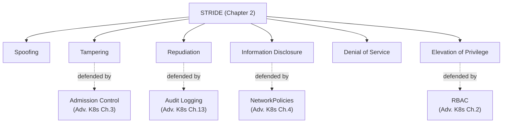
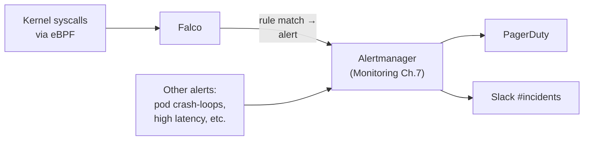
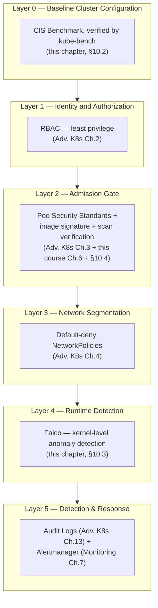

# Chapter 10 — Kubernetes Security Deep Dive

## Learning Objectives

By the end of this chapter you will be able to:

- Map each major Advanced Kubernetes security mechanism (RBAC, NetworkPolicies, Admission Control/Pod Security Standards, Audit Logging) onto the STRIDE threat category it primarily defends against
- Explain what the CIS Kubernetes Benchmark is, what it checks, and how to run `kube-bench` against a live cluster
- Explain the gap between preventive controls and detective controls, and why runtime security tooling like Falco fills that gap
- Read and write a simple Falco rule, and interpret a Falco alert
- Route Falco alerts through the same alerting pipeline (Alertmanager) built in Monitoring & Logging, rather than treating security signals as a silo
- Design an admission policy that requires both a passing vulnerability scan and a valid image signature before a Pod is allowed to run
- Explain why native Kubernetes Secrets are not encrypted by default, and why the External Secrets Operator pattern is preferred in production
- Describe, end-to-end, a layered "defense in depth" Kubernetes security architecture combining every mechanism from this section

---

## Prerequisites for This Chapter

- **Advanced Kubernetes, Chapter 2 (RBAC and Authentication)** — required. This chapter does not re-teach `Role`/`RoleBinding`/`ClusterRole`/`ClusterRoleBinding` — it assumes you can already write them.
- **Advanced Kubernetes, Chapter 3 (Admission Control and Pod Security)** — required. This chapter assumes you understand admission webhooks, Pod Security Standards, and policy engines like Kyverno/Gatekeeper.
- **Advanced Kubernetes, Chapter 4 (Network Policies)** — required. This chapter assumes you can already write default-deny and allow-list NetworkPolicies.
- **Advanced Kubernetes, Chapter 13 (Auditing)** — required. This chapter assumes you understand Kubernetes audit logs and what they record.
- **This course, Chapter 2 (Threat Modeling)** — required, specifically the STRIDE framework and its six categories, which this chapter reuses directly as an organizing lens.
- **This course, Chapter 3 (Secrets Management)** — required, specifically the External Secrets Operator pattern, referenced in section 10.5.
- **This course, Chapter 6 (Container and Image Security)** — required, specifically image scanning and `cosign` signing, referenced in section 10.4.
- **Monitoring & Logging, Chapter 7 (Alerting)** — recommended, specifically Alertmanager, referenced in section 10.3.
- A running local `kind` cluster with Calico installed (from Advanced Kubernetes, Chapter 4's Hands-On Exercise).

---

## 10.1 A Security Lens Recap: What You Already Know, Reorganized

Here is something worth saying plainly at the start of this chapter: **you already know almost everything in this chapter.** Advanced Kubernetes taught you RBAC, NetworkPolicies, admission control, Pod Security Standards, and audit logging as *mechanisms* — how to write the YAML, how each API object behaves, which flags to set. What that course did not do — deliberately, because it hadn't taught STRIDE yet — is organize those mechanisms into a coherent security framework and show you how they compose into one system.

This chapter does that. It revisits nothing about *how* those mechanisms work; it reframes *why* each one exists, using the STRIDE framework from Chapter 2 of this course, and then adds the small number of genuinely new pieces a security-focused Kubernetes deployment needs beyond what Advanced Kubernetes covered: the CIS Kubernetes Benchmark, `kube-bench`, and runtime security with Falco.

| Advanced Kubernetes Chapter | Mechanism | Primary STRIDE Category Defended | Why |
|---|---|---|---|
| Ch. 2 — RBAC and Authentication | Least-privilege `Role`/`ClusterRole`, narrowly-scoped ServiceAccounts | **Elevation of Privilege** | RBAC's entire purpose is preventing an identity — human or ServiceAccount — from doing more than it's explicitly permitted to. A compromised low-privilege identity that can't escalate is a contained incident; one that can is a cluster-wide breach. |
| Ch. 4 — NetworkPolicies | Default-deny + allow-list network segmentation | **Lateral Movement / Information Disclosure** | NetworkPolicies stop a compromised Pod from reaching Pods it has no legitimate reason to talk to — directly limiting how far an attacker who already has a foothold can spread, and what internal data they can reach en route. |
| Ch. 3 — Admission Control / Pod Security Standards | Rejecting privileged Pods, enforcing non-root, blocking `hostPath` mounts, image policy | **Tampering** (running untrusted or modified workloads) | Admission control is the gate that decides whether a workload is even allowed to start running in the first place — it stops tampered, misconfigured, or policy-violating workloads before they ever get a chance to execute. |
| Ch. 13 — Audit Logging | Immutable record of every API request: who, what, when | **Repudiation** | Exactly as Chapter 2 of this course explained: without an audit trail, there is no way to prove — to an incident responder, to an auditor, or to a customer — what actually happened, or to refute a false claim about who did what. |

This table is the spine of this chapter. Sections 10.2–10.5 add the pieces this table doesn't yet cover — a way to *verify* your cluster's baseline configuration is actually sound (CIS Benchmark / `kube-bench`), a way to *detect* an attacker who gets past every preventive layer (Falco), a way to *combine* two separate admission mechanisms into one stronger gate (image scanning + signing), and a correction to a common misconception about Kubernetes Secrets.



---

## 10.2 The CIS Kubernetes Benchmark and `kube-bench`

Everything in section 10.1 assumes your RBAC rules, NetworkPolicies, and admission policies are well-designed. But there's a layer beneath all of that which Advanced Kubernetes never directly addressed: **is the cluster itself — the control plane, the kubelet, etcd — configured securely in the first place?** A perfectly-designed `Role` doesn't help you if the API server is listening with `--anonymous-auth=true`, letting unauthenticated requests bypass your carefully-designed authorization rules entirely.

### What the CIS Benchmark Is

The **Center for Internet Security (CIS)** publishes the **CIS Kubernetes Benchmark** — a free, industry-standard, checklist-based configuration baseline for Kubernetes clusters. It is not a vague "be secure" document; it is a long list of specific, checkable, pass/fail controls, organized into sections covering:

- **Control plane configuration** — API server, controller manager, and scheduler flags (e.g., "ensure the `--anonymous-auth` argument is set to `false`," "ensure the `--authorization-mode` argument includes `Node` and `RBAC`")
- **etcd configuration** — encryption and access control for the cluster's backing datastore
- **Node/kubelet configuration** — kubelet authentication, authorization, and TLS settings
- **RBAC and Service Account configuration** — e.g., "minimize wildcard use in Roles and ClusterRoles," "minimize access to the `create` verb on `pods`"
- **Pod Security Standards** — baseline expectations that echo Advanced Kubernetes Chapter 3 directly

Each control reads like this real example from the benchmark:

> **1.2.1 Ensure that the `--anonymous-auth` argument is set to `false`**
> *Rationale:* Disabling anonymous authentication prevents requests that aren't authenticated by any mechanism from being processed by the API server, closing off an entire class of unauthenticated access.
> *Audit:* Check the running API server process for `--anonymous-auth=false`.
> *Remediation:* Edit the API server manifest to set `--anonymous-auth=false`.

This granularity — a specific flag, a specific expected value, a specific way to check it — is exactly what turns "our cluster is secure" from an opinion into something you can verify mechanically.

### `kube-bench`: Automating the Check

Manually verifying dozens of controls across every control-plane component and every node does not scale. **`kube-bench`** is the open-source tool (from Aqua Security) that automates checking a running cluster against the CIS Kubernetes Benchmark. It runs as a Job (or directly on a node), inspects the actual running configuration, and reports PASS, FAIL, or WARN for each control.

```bash
# Run kube-bench as a Job against the control plane, using the official manifest
kubectl apply -f https://raw.githubusercontent.com/aquasecurity/kube-bench/main/job.yaml

# Wait for it to complete, then read the results
kubectl logs -l app=kube-bench
```

Example (representative) output:

```text
[INFO] 1 Control Plane Security Configuration
[INFO] 1.2 API Server
[PASS] 1.2.1 Ensure that the --anonymous-auth argument is set to false (Automated)
[FAIL] 1.2.5 Ensure that the --kubelet-certificate-authority argument is set as appropriate (Automated)
[PASS] 1.2.6 Ensure that the --authorization-mode argument is not set to AlwaysAllow (Automated)
[WARN] 1.2.7 Ensure that the --authorization-mode argument includes Node (Manual)
[PASS] 1.2.8 Ensure that the --authorization-mode argument includes RBAC (Automated)

== Summary total ==
34 checks PASS
2 checks FAIL
5 checks WARN
0 checks INFO

== Remediations for failed checks ==
1.2.5 Follow the Kubernetes documentation and set up the TLS connection between
the apiserver and kubelets. Then edit the API server pod specification file
in the master node and set the --kubelet-certificate-authority parameter to
the location of the file containing the CA certificate.
```

Note that `kube-bench` distinguishes **Automated** checks (it can determine pass/fail on its own by inspecting configuration) from **Manual** checks (it flags them as needing a human to verify — often organizational or contextual controls, like "ensure a minimal audit policy is created," which requires judgment about what "minimal" means for your organization).

**Where `kube-bench` fits relative to everything else in this chapter:** it is the *foundation-level* check. It answers "is the ground I'm building RBAC, admission control, and NetworkPolicies on top of actually solid?" — before you even ask whether those higher layers are well-designed. Run it as a recurring, scheduled job (not a one-time check at cluster setup), since configuration drifts over time as nodes are added, upgraded, or manually tweaked.

---

## 10.3 Runtime Security: The Detective Layer Falco Adds

Every mechanism in section 10.1's table is a **preventive control** — it stops something bad from happening in the first place. RBAC prevents unauthorized API calls. Admission control prevents non-compliant Pods from starting. NetworkPolicies prevent unauthorized network connections. This is the right first line of defense, but it rests on an assumption that deserves to be stated explicitly: **preventive controls only work against threats they were designed to anticipate.**

Consider a scenario Chapters 4 and 8 of this course already implied is realistic: an application has a vulnerability that your SAST scan (Chapter 4) didn't catch — a logic flaw, a new zero-day in a dependency, something DAST (Chapter 8) also missed because it wasn't exercised by the test traffic. An attacker exploits it and gets remote code execution inside a running container. At that moment, **every preventive control in section 10.1's table has already done its job and is now irrelevant to what happens next** — RBAC didn't stop the initial exploit (it wasn't an API call), admission control already let this Pod start weeks ago, and NetworkPolicies only limit *where* the attacker can go from here, not whether they got in.

This is the gap **runtime security** fills: you need something watching for suspicious *behavior* actually happening inside a running container, in real time, so that even a successful initial compromise gets detected quickly rather than sitting undiscovered for months (the pattern behind almost every serious real-world breach).

### How Falco Works

**Falco** (a CNCF graduated project) is the standard open-source tool for Kubernetes runtime security. It works by monitoring **kernel-level system calls** — using eBPF (or, on older setups, a kernel module) to observe every `open()`, `execve()`, `connect()`, and similar low-level operation happening on the host, correlated back to the specific container and Pod that triggered it. It then evaluates each system call against a set of **rules** describing suspicious patterns, and fires an alert when a rule matches.

Falco is watching for things like:

- A shell (`bash`, `sh`) spawned inside a container whose image should never spawn an interactive shell (a strong signal of an attacker who just got code execution and is starting to explore)
- A process inside a container attempting to read a sensitive file like `/etc/shadow` or a cloud credentials file it has no legitimate reason to touch
- An unexpected outbound network connection from a container to an IP address or port it's never connected to before
- A write to a sensitive system directory, or an attempt to load a kernel module from inside a container

### A Simple Falco Rule

```yaml
# A Falco rule detecting a shell spawned inside a container
- rule: Shell Spawned in Container
  desc: >
    Detects an interactive shell process being spawned inside a container.
    Most application containers never legitimately spawn a shell — this is
    a strong signal of post-exploitation activity.
  condition: >
    spawned_process and
    container and
    proc.name in (bash, sh, zsh) and
    not proc.pname in (allowed_parent_processes)
  output: >
    Shell spawned inside container (user=%user.name container=%container.name
    image=%container.image.repository command=%proc.cmdline parent=%proc.pname)
  priority: WARNING
  tags: [container, shell, mitre_execution]
```

An example alert this rule would generate, matching the "attacker gains shell access" scenario in section 10.6:

```text
23:14:02.118472765: Warning Shell spawned inside container
(user=root container=order-service-7d9f8b6c-xk2pl
image=registry.example.com/order-service:v2.3.1
command=bash parent=order-service-app)
```

Notice exactly what this alert tells a responder in one line: which container, which image, what command ran, and what its parent process was — everything needed to start an investigation immediately, without having to reconstruct it after the fact from scattered logs.

### Falco Alerts Belong in Alertmanager, Not a Security Silo

Here is a mistake worth naming directly: many organizations deploy Falco, wire its alerts into a dedicated "security dashboard" that only the security team ever looks at, and never connect it to the alerting infrastructure the rest of engineering already relies on. This recreates exactly the kind of siloed, bolted-on security this course's Chapter 1 argued against — a security-specific signal that nobody on the on-call rotation ever sees until it's too late.

The better pattern, building directly on **Monitoring & Logging Chapter 7's Alertmanager**: Falco alerts should be routed through the *same* alerting pipeline as every other production alert — the same Alertmanager instance, the same PagerDuty/Slack routing rules, the same on-call rotation. A "shell spawned in a production Pod" alert is every bit as actionable and urgent as a "pod crash-looping" alert, and it should reach the same humans, through the same channel, with the same urgency.



Practically, this is done with Falco's **Falcosidekick** add-on, which forwards Falco alerts to dozens of destinations including a generic webhook that Alertmanager (or a Prometheus Alertmanager-compatible receiver) can ingest directly, unifying security alerts and operational alerts into one queue that one on-call engineer monitors.

---

## 10.4 Combining Two Gates: Scan Results + Signatures at Admission

Chapter 6 of this course taught you image scanning (finding known CVEs in an image) and `cosign` signing (cryptographically proving an image came from a trusted build and hasn't been tampered with since). Advanced Kubernetes Chapter 3 taught you admission control — the mechanism that can reject a Pod before it's ever scheduled. Neither chapter, on its own, told you to combine them. This section does.

A single admission policy can require **both** conditions before allowing a Pod to run:

1. The image has a passing scan result (no unremediated Critical/High CVEs, per Chapter 6's severity policy)
2. The image carries a valid `cosign` signature from a trusted signing identity

Using Kyverno (introduced in Advanced Kubernetes Chapter 3) as the policy engine:

```yaml
apiVersion: kyverno.io/v1
kind: ClusterPolicy
metadata:
  name: require-signed-and-scanned-images
spec:
  validationFailureAction: Enforce
  background: false
  rules:
    - name: verify-image-signature
      match:
        any:
          - resources:
              kinds: ["Pod"]
      verifyImages:
        - imageReferences:
            - "registry.example.com/*"
          attestors:
            - entries:
                - keys:
                    publicKeys: |-
                      -----BEGIN PUBLIC KEY-----
                      MFkwEwYHKoZIzj0CAQYIKoZIzj0DAQcDQgAE...
                      -----END PUBLIC KEY-----
          # Also require an attached, verified vulnerability-scan attestation,
          # not merely a signature on the image itself
          attestations:
            - predicateType: https://cosign.sigstore.dev/attestation/vuln/v1
              attestors:
                - entries:
                    - keys:
                        publicKeys: |-
                          -----BEGIN PUBLIC KEY-----
                          MFkwEwYHKoZIzj0CAQYIKoZIzj0DAQcDQgAE...
                          -----END PUBLIC KEY-----
              conditions:
                - all:
                    - key: "{{ metadata.scanner }}"
                      operator: Equals
                      value: trivy
                    - key: "{{ length(vulnerabilities[?severity=='Critical']) }}"
                      operator: Equals
                      value: 0
```

The effect: a Pod referencing `registry.example.com/order-service:v2.3.1` is rejected at admission time unless it presents a signature from a known, trusted key (proving provenance — Chapter 7's SLSA concept made concrete via Kyverno) *and* an attached scan attestation showing zero Critical vulnerabilities (Chapter 6's scan gate, now enforced at the cluster boundary rather than only in CI). This synthesizes two chapters' mechanisms into a single enforced gate: a scan that passed in CI three weeks ago and an unsigned image that was tampered with since are both caught, for different reasons, by the same policy.

---

## 10.5 Secrets in Kubernetes: A Necessary Correction

This section is short but important, because the misconception it corrects is common and dangerous. Recall from Kubernetes Basics that a native `Secret` object stores its data **base64-encoded**. It is essential to be precise about what that means: **base64 is an encoding, not encryption.** Anyone with `get` access to that Secret (or with etcd access, or a backup of etcd) can trivially decode it — `base64 -d` is not a security boundary of any kind.

By default, Kubernetes Secrets are also stored **unencrypted in etcd** — the same base64 string sits in etcd's data files exactly as it does in the API response. This is only fixed if the cluster operator explicitly configures **encryption at rest for etcd** (an `EncryptionConfiguration` resource specifying a provider like `aescbc` or, ideally, integration with a cloud KMS). Many clusters — including some production ones — never turn this on, leaving Secrets effectively unprotected at the storage layer even though `kubectl get secret` output looks appropriately obscured.

This is precisely why this course's **Chapter 3 (Secrets Management)** recommended the **External Secrets Operator** pattern as the production default, rather than relying on native Kubernetes Secrets alone: instead of storing sensitive values directly as Kubernetes Secret objects, the actual secret material lives in a dedicated secrets manager (Vault, AWS Secrets Manager, etc.) with real encryption, access logging, and rotation, and the External Secrets Operator syncs a reference into the cluster as a Secret object only at the point where a Pod needs to consume it — narrowing both the exposure window and the number of places a real credential's plaintext ever has to sit.

| | Native Kubernetes Secret alone | External Secrets Operator + real secrets manager |
|---|---|---|
| Encrypted at rest by default? | No — base64 only, unless etcd encryption is explicitly configured | Yes — encrypted in Vault/cloud secrets manager, always |
| Rotation | Manual, or custom tooling | Native to the secrets manager; ESO re-syncs automatically |
| Access audit trail | Only via Kubernetes audit logs (who read the Secret object) | Full audit trail in the secrets manager itself, plus Kubernetes audit logs |
| Source of truth | The cluster itself | The secrets manager — the cluster holds only a synced copy |

---

## 10.6 Kubernetes Defense in Depth: All the Layers, Together

Put every mechanism discussed so far — the four from Advanced Kubernetes plus the three genuinely new or extended pieces from this chapter — into a single layered picture. Each ring in this diagram is everything you already learned, now shown as *one system* rather than four separate chapters.



The point of drawing it this way: no single layer is sufficient on its own, and none of them are new to you except `kube-bench` and Falco. A misconfigured API server flag (Layer 0) undermines everything above it. An overly-broad `ClusterRoleBinding` (Layer 1) hands an attacker more than they should have even after a clean admission check. A missing NetworkPolicy (Layer 3) lets a contained compromise spread. And without Layer 4 and 5, an attacker who defeats every preventive layer simply operates undetected. Defense in depth means each layer assumes the ones above it might fail, and is designed to limit the damage anyway.

---

## Real-World Scenario: A Layered Response to a Live Compromise

An attacker finds and exploits an application-layer vulnerability in the `order-service` — something Chapter 4's SAST and Chapter 8's DAST scans both missed, because it was a novel logic flaw in how the service deserialized a specific request field. The exploit gives the attacker remote code execution inside the `order-service` Pod.

Walk through what happens next, layer by layer:

1. **NetworkPolicy (Adv. K8s Ch. 4) contains the blast radius immediately.** The `order-service` namespace has a default-deny egress policy with narrow allow rules permitting only traffic to the `payments-api` Service and DNS. The attacker's shell tries to scan the cluster's internal IP ranges looking for a database or a secrets endpoint to pivot to — every one of those connection attempts is dropped at the network layer before it completes. The initial compromise succeeded, but lateral movement did not.
2. **Falco (this chapter, §10.3) detects the compromise in real time.** The attacker's remote code execution spawns a shell to explore the filesystem — exactly the pattern the "Shell Spawned in Container" rule from section 10.3 watches for. Falco fires an alert within seconds of the shell being spawned, long before the attacker has had time to do meaningful damage.
3. **The alert reaches a human immediately, not eventually.** Because Falco's alerts are routed through Alertmanager (Monitoring Ch. 7) alongside every other production alert, the on-call engineer is paged the same way they would be for a service outage — not days later when someone happens to check a separate security dashboard.
4. **Audit logs (Adv. K8s Ch. 13) reconstruct exactly what happened next.** The security team pulls the Kubernetes audit log for the time window around the alert and finds every API request the `order-service` Pod's ServiceAccount attempted to make during the incident — `list secrets`, `list pods` in other namespaces, an attempt to `create` a privileged Pod for further escalation.
5. **RBAC (Adv. K8s Ch. 2) had already limited the damage those attempts could do.** Because `order-service`'s ServiceAccount was scoped, per Chapter 2's least-privilege pattern, to only what it needed (reading its own ConfigMaps, nothing else), every one of the attacker's `list secrets` and cross-namespace attempts returned `403 Forbidden` — visible in the audit log as a trail of failed attempts, not successful exfiltration.

No single layer in this story handled the incident completely on its own. NetworkPolicies didn't stop the initial exploit; Falco didn't stop lateral movement; RBAC didn't detect the shell being spawned. Each layer did exactly its job, and together they turned what could have been a full cluster compromise into a contained, detected, and quickly-investigated incident — the practical payoff of defense in depth.

---

## Best Practices

- Run `kube-bench` on a recurring schedule (not just at cluster bring-up) — configuration drifts as nodes are added, upgraded, or manually patched.
- Treat CIS Benchmark "WARN"/manual-check items as seriously as automated failures — they often cover organizationally-important controls that automation can't verify on its own.
- Deploy Falco with Falcosidekick wired into the same Alertmanager/PagerDuty pipeline used for operational alerts — never build a separate, siloed security-only alerting path.
- Start Falco with the default community rule set, then tune it: too many default rules produce noisy false positives (e.g., legitimate debug shells during an incident response), which trains responders to ignore alerts.
- Require both image signature verification and scan-result verification at admission for any namespace running production workloads — one without the other leaves a real gap (a signed-but-vulnerable image, or a scanned-but-tampered one).
- Never assume native Kubernetes Secrets are "encrypted" — explicitly configure etcd encryption at rest, and prefer the External Secrets Operator pattern from Chapter 3 for anything sensitive.

## Common Mistakes

- Assuming a well-designed RBAC policy is sufficient on its own and skipping `kube-bench` entirely — a misconfigured API server flag can undermine RBAC's guarantees regardless of how carefully the Roles were written.
- Deploying Falco but routing its alerts to a dashboard nobody on the on-call rotation actually watches, defeating the entire purpose of real-time detection.
- Treating native Kubernetes Secrets as sufficiently secure without ever checking whether etcd encryption at rest is actually enabled.
- Enforcing image signature verification without also enforcing scan results (or vice versa) — a policy that only checks one of the two leaves the other supply-chain risk completely open.
- Running `kube-bench` once at initial cluster setup and never again, missing drift introduced by later manual changes or version upgrades.

*(The full catalog of DevSecOps pitfalls is covered in Chapter 15 — Common Mistakes and Pitfalls.)*

---

## Summary

This chapter did not teach new Kubernetes fundamentals — it organized RBAC (Elevation of Privilege), NetworkPolicies (lateral movement / Information Disclosure), Admission Control and Pod Security Standards (Tampering), and Audit Logging (Repudiation) into a STRIDE-based security framework, and added the pieces Advanced Kubernetes didn't cover. The **CIS Kubernetes Benchmark** provides a specific, checkable configuration baseline for the cluster itself, and **`kube-bench`** automates checking a live cluster against it, reporting PASS/FAIL/WARN per control. **Falco** fills the gap every preventive control leaves open: it monitors kernel-level system calls in real time and alerts on suspicious in-container behavior (an unexpected shell, sensitive file access, anomalous network connections), and its alerts should flow through the same Alertmanager pipeline as every other production alert rather than into a security-only silo. Admission policies can combine Chapter 6's image scanning and signing into a single enforced gate requiring both a passing scan and a valid signature. Native Kubernetes Secrets are only base64-encoded and unencrypted at rest by default — the External Secrets Operator pattern from Chapter 3 is the production-recommended alternative. Together, these layers — CIS-benchmarked configuration, RBAC, admission control, NetworkPolicies, Falco, and audit logs feeding Alertmanager — form a defense-in-depth architecture where no single layer's failure is catastrophic on its own.

---

## Knowledge Check

1. Map each of RBAC, NetworkPolicies, Admission Control, and Audit Logging to the STRIDE category it primarily defends against, and explain why in one sentence each.
2. What is the practical difference between a preventive control and a detective control? Give one example of each from this chapter.
3. What specific gap does Falco fill that RBAC, NetworkPolicies, and admission control together do not address?
4. Why is it a mistake to route Falco's alerts to a dedicated security-only dashboard instead of the same Alertmanager pipeline used for operational alerts?
5. Why is base64 encoding not a security control, and what two things does a production cluster need (one at the storage layer, one at the operational-pattern layer) to actually protect Secret data?
6. Describe, in your own words, how an admission policy could require both a valid `cosign` signature and a passing vulnerability scan before allowing a Pod to run — which two earlier chapters' mechanisms does this combine?

---

## Hands-On Exercise

Using your local `kind` cluster with Calico installed (from Advanced Kubernetes Chapter 4):

1. Run `kube-bench` against your cluster using the official manifest (`kubectl apply -f https://raw.githubusercontent.com/aquasecurity/kube-bench/main/job.yaml`), then read the pod logs and identify at least three FAIL or WARN results. For each, look up the corresponding remediation in the CIS Kubernetes Benchmark documentation.
2. Install Falco on your `kind` cluster using the official Helm chart (`helm install falco falcosecurity/falco`). Exec into a running Pod and run `bash` inside it — confirm Falco generates an alert (`kubectl logs -l app.kubernetes.io/name=falco | grep -i shell`).
3. Write a custom Falco rule that alerts specifically when a process inside any container attempts to read `/etc/shadow`. Trigger it and confirm the alert fires.
4. Using Kyverno (installed per Advanced Kubernetes Chapter 3's exercise), write a `ClusterPolicy` that rejects any Pod whose image is not signed by a specific `cosign` public key. Deploy one signed and one unsigned test image and confirm the policy allows one and blocks the other.
5. Reflection: write two or three sentences describing which layer in section 10.6's diagram would have caught the compromise in the Real-World Scenario first, if you removed every layer except one at a time.

---

## Further Reading

- [CIS Kubernetes Benchmark — Center for Internet Security](https://www.cisecurity.org/benchmark/kubernetes)
- [kube-bench — GitHub (Aqua Security)](https://github.com/aquasecurity/kube-bench)
- [Falco — Official Documentation](https://falco.org/docs/)
- [Falcosidekick — Routing Falco Alerts to 50+ Outputs](https://github.com/falcosecurity/falcosidekick)
- [Kyverno — Verifying Images](https://kyverno.io/docs/writing-policies/verify-images/)

---

<div style="display:flex;justify-content:space-between;align-items:center;">
  <a href="./09-infrastructure-as-code-security.md">← Previous: Infrastructure as Code Security</a>
  <a href="./00-index.md">🏠 Index</a>
  <a href="./11-cicd-pipeline-security.md">Next: CI/CD Pipeline Security →</a>
</div>
