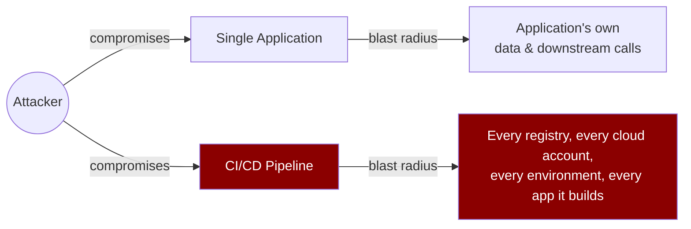
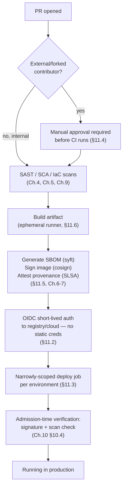

# Chapter 11 — CI/CD Pipeline Security

## Learning Objectives

By the end of this chapter you will be able to:

- Explain why the CI/CD pipeline is itself a high-value attack target — often more valuable to an attacker than any single application it deploys
- Generalize Terraform Chapter 14's OIDC-based CI authentication pattern to every CI-to-cloud, CI-to-registry, and CI-to-deployment-target credential
- Apply RBAC's least-privilege principle to CI credentials themselves, scoping each job to exactly what it needs
- Identify and mitigate the risk of malicious changes to pipeline configuration files, including from external/forked pull requests
- Place SBOM generation, image signing, and provenance attestation at the correct concrete step in a real CI workflow
- Explain the extra risk self-hosted CI runners introduce, and the ephemeral-runner mitigation
- Walk through, counterfactually, which of this chapter's controls would have made a SolarWinds-style attack harder to execute or easier to detect

---

## Prerequisites for This Chapter

- **Infrastructure as Code (Terraform), Chapter 14 (CI/CD Integration & Atlantis)** — required, specifically the OIDC-based AWS authentication pattern in section 14.3, which this chapter generalizes.
- **Cloud Fundamentals AWS, Chapter 2 (IAM)** — required, specifically IAM roles, STS, and the principle that roles issue short-lived credentials rather than long-lived access keys.
- **Advanced Kubernetes, Chapter 2 (RBAC and Authentication)** — required, specifically the least-privilege CI ServiceAccount example in section 2.5, which this chapter applies to CI/CD credentials generally, beyond just Kubernetes.
- **This course, Chapter 7 (Software Supply Chain Security)** — required, specifically the SolarWinds discussion and the SBOM/SLSA/provenance concepts, which this chapter places concretely into pipeline steps.
- **This course, Chapter 6 (Container and Image Security)** — required, specifically `cosign` image signing.
- **CI/CD Pipelines, Chapters 3-4** — required, general familiarity with pipeline stages and `.github/workflows/*.yml`-style pipeline-as-code.
- **This course, Chapters 4, 5, and 9** — recommended, specifically SAST, SCA, and IaC scanning, referenced as pipeline stages in the hardened pipeline diagram.

---

## 11.1 Your Pipeline Is a More Valuable Target Than Any Single App

Start with the core insight this entire chapter builds on, because it reframes everything that follows: **your CI/CD pipeline is not just infrastructure that happens to need securing like anything else — it is arguably the single highest-value target in your entire organization.**

Think about what a CI/CD pipeline actually holds. A typical application has access to its own database, maybe a few internal services, and whatever the application itself is authorized to touch. A CI/CD pipeline, by contrast, routinely holds: credentials to push to every container registry the organization uses, credentials to deploy to every environment (staging *and* production), often credentials to modify cloud infrastructure directly (Terraform Chapter 14's exact use case), and the ability to inject arbitrary code into the build of *any* application it builds — because it controls the build process itself, not just the running artifact.

Compromise a single application, and an attacker gets what that application can reach. **Compromise the CI/CD pipeline, and an attacker gets what every system the pipeline touches can reach** — which, in most organizations, is "everything downstream of the pipeline," full stop.

This is precisely the structure of the **SolarWinds** attack discussed in Chapter 7: attackers didn't need to individually compromise eighteen thousand SolarWinds customers. They compromised SolarWinds' *build system* once, inserted malicious code into the build process itself, and that one compromise propagated automatically into every customer who received a signed, seemingly-legitimate software update. The build pipeline was the single point of leverage that turned one compromise into eighteen thousand. This chapter is about not being the next build pipeline that gets used that way.



---

## 11.2 Generalizing OIDC: No Static Long-Lived Credentials, Anywhere

Terraform Chapter 14, section 14.3 taught you a specific pattern: instead of storing a long-lived AWS access key as a GitHub Actions secret, the GitHub Actions runner authenticates to AWS using **OIDC** — GitHub issues a short-lived, cryptographically signed JWT scoped to that specific workflow run's identity (which repo, which branch, which workflow), and AWS's STS exchanges that JWT for temporary credentials via an IAM role's trust policy, with **no long-lived secret stored anywhere in CI.**

That pattern was taught in a Terraform-specific context, but the underlying principle is not Terraform-specific at all — it's a core DevSecOps principle that applies to **every** credential a CI system needs to use:

- Pushing a Docker image to a registry? Use the registry's OIDC-based federation (e.g., pushing to Amazon ECR via the same GitHub OIDC → AWS IAM role pattern, or GitHub Container Registry's built-in `GITHUB_TOKEN` short-lived permissions) instead of a long-lived registry password stored as a secret.
- Deploying to a Kubernetes cluster? Use short-lived, workflow-scoped tokens (e.g., an EKS IAM role assumed via OIDC, mapped to a narrowly-scoped Kubernetes RBAC identity per Advanced Kubernetes Chapter 2) instead of a long-lived kubeconfig with a static client certificate baked into a CI secret.
- Calling a third-party API from CI? Prefer that provider's short-lived token exchange mechanism if one exists, over a static API key that, once leaked, is valid until someone remembers to rotate it.

**Why this matters as a security principle, stated precisely:** a long-lived credential stored as a CI secret is a static, high-value target that exists continuously, whether or not it's being used at this exact moment. If the CI system itself is ever compromised — through a vulnerable CI plugin, a misconfigured workflow, or a malicious dependency in the build (again, the SolarWinds pattern) — every static secret sitting in that CI system's secret store is exposed in one shot, and remains dangerous until someone manually rotates it (and there is no automatic signal that it needs rotating unless the compromise is detected). A short-lived OIDC-issued token, by contrast, is minted fresh for one specific workflow run, is tied to that run's verifiable identity (repo, branch, workflow file), and expires automatically — usually within an hour — regardless of whether anyone notices a compromise happened at all.

```yaml
# Generalized OIDC pattern — same shape as Terraform Ch.14, applied to a
# container build-and-push job with no Terraform involved at all
name: Build and Push Container Image

on:
  push:
    branches: [main]

permissions:
  id-token: write     # required for OIDC — this is the whole trick
  contents: read

jobs:
  build-push:
    runs-on: ubuntu-latest
    steps:
      - uses: actions/checkout@v4

      - name: Configure AWS credentials via OIDC (no static keys, no secrets)
        uses: aws-actions/configure-aws-credentials@v4
        with:
          role-to-assume: arn:aws:iam::123456789:role/github-ecr-push-role
          aws-region: us-east-1

      - name: Login to Amazon ECR
        id: ecr-login
        uses: aws-actions/amazon-ecr-login@v2

      - name: Build and push
        run: |
          docker build -t ${{ steps.ecr-login.outputs.registry }}/order-service:${{ github.sha }} .
          docker push ${{ steps.ecr-login.outputs.registry }}/order-service:${{ github.sha }}
```

There is no `AWS_ACCESS_KEY_ID` or `AWS_SECRET_ACCESS_KEY` anywhere in this workflow, in a repo secret, or in an environment variable — the entire credential lifecycle is: request a token from GitHub's OIDC provider, exchange it for temporary AWS credentials scoped to exactly this repo and workflow, use it, let it expire.

---

## 11.3 Scoping CI Credentials Per Job, Not Per Pipeline

Advanced Kubernetes Chapter 2, section 2.5 built a specific worked example: a `ci-deployer` ServiceAccount granted *only* `get`/`list`/`create`/`update`/`patch` on Deployments and Services in the `prod` namespace — deliberately excluding `delete`, excluding Secrets, excluding any other namespace. Chapter 15 of that course (Common Mistakes) named the opposite failure mode directly: granting `cluster-admin` broadly to a CI ServiceAccount "just to get something working," and never tightening it.

Apply that exact same principle to CI/CD credentials generally, not just Kubernetes RBAC: **a workflow that only needs to push a Docker image should not hold credentials that can also modify IAM policies, delete infrastructure, or deploy to production.** In practice this means maintaining **separate, narrowly-scoped credentials per distinct job type**, not one broad "CI credential" reused everywhere because it's convenient:

| Job Type | What It Actually Needs | What It Must NOT Have |
|---|---|---|
| Run unit tests / SAST / SCA scans (Ch. 4-5) | Read-only checkout of the repo; no cloud credentials at all | Any deploy, push, or cloud-modify permission |
| Build and push a container image | Push access to one specific registry/repository path | Access to any other registry, any cloud account, any Kubernetes cluster |
| Deploy to staging | Deploy permissions scoped to the staging environment/namespace only | Any production credential |
| Deploy to production | Deploy permissions scoped to the production environment/namespace only, ideally requiring manual approval | IAM-modification rights, infrastructure-deletion rights, staging credentials |
| Terraform apply (Terraform Ch. 14) | The specific IAM role scoped to resources Terraform manages | `AdministratorAccess` "for convenience" — the exact anti-pattern Terraform Ch.14 flagged in its own OIDC role example |

This is a direct extension of the least-privilege discipline this entire course has repeated in every chapter that touches identity — RBAC (Ch. 2, Advanced Kubernetes), IAM (Cloud Fundamentals Ch. 2), and now CI credentials. The blast radius of a leaked or misused credential should always be "exactly what this one job type needs," never "everything the organization's CI system is capable of."

---

## 11.4 Securing the Pipeline Configuration Itself

There is a subtlety here that's easy to miss: **the pipeline's own configuration is usually just another file in the same repository as the application code it builds** — `.github/workflows/deploy.yml`, sitting right next to `src/`. That means a pull request modifying application code and a pull request modifying the deployment pipeline itself look, at a glance, like the same kind of change, reviewed by the same process, by the same reviewers, with the same level of scrutiny.

This is a real risk, not a theoretical one: a malicious or compromised pull request could modify the workflow file itself to add a step that exfiltrates the job's environment variables (which, per section 11.2, should be short-lived tokens — but any long-lived secrets that do exist are exactly what an attacker would target this way) to an external server, or quietly change *which* environment a "deploy to staging" step actually deploys to.

**Two concrete mitigations:**

1. **Mandatory code review specifically on pipeline configuration file changes.** Many CI/version-control systems support a distinct, stricter required-review rule for specific paths (e.g., GitHub's `CODEOWNERS` file combined with branch protection rules requiring an approval from a specific team for changes under `.github/workflows/`). This ensures a change to *what the pipeline does* gets scrutiny from someone who understands pipeline security specifically, not just whoever happened to review the accompanying application code change.
2. **Deliberate handling of pull requests from external or forked contributors.** This is a well-known, real risk class, especially for open-source projects: a malicious PR from an outside contributor could be crafted so that the CI workflow it triggers runs with access to the repository's secrets — for example, a workflow triggered by `pull_request_target` (which runs with the *base* repository's permissions and secrets, not the fork's) combined with checking out and executing code from the untrusted fork. The correct default is to **require manual approval before running CI on PRs from first-time or external contributors**, and to be explicit and conservative about which workflow triggers (`pull_request` vs. `pull_request_target`) have access to secrets at all.

```yaml
# .github/workflows/ci.yml — require manual approval for external contributors
name: CI

on:
  pull_request:
    branches: [main]

jobs:
  build-and-test:
    runs-on: ubuntu-latest
    # "external" here is a GitHub Environment configured with required reviewers —
    # first-time/external contributor PRs pause here until a maintainer approves the run
    environment: ${{ github.event.pull_request.author_association == 'FIRST_TIME_CONTRIBUTOR' && 'external-review-required' || 'internal' }}
    steps:
      - uses: actions/checkout@v4
      - run: make test
```

---

## 11.5 Artifact Signing and Provenance, Wired Into Real Pipeline Steps

Chapter 6 taught `cosign` signing and Chapter 7 taught SBOMs, SLSA, and provenance attestation — as concepts. This section places them at the exact, concrete step in a real CI workflow where they belong: **immediately after build, before the artifact is pushed to a registry anyone else can pull from.**

```yaml
name: Build, Sign, and Push (with SBOM and Provenance)

on:
  push:
    branches: [main]

permissions:
  id-token: write      # for OIDC → registry auth AND for cosign's keyless signing
  contents: read
  packages: write

jobs:
  build:
    runs-on: ubuntu-latest
    steps:
      - uses: actions/checkout@v4

      # --- 1. Build the image ---
      - name: Build image
        run: |
          docker build -t ghcr.io/example/order-service:${{ github.sha }} .

      # --- 2. Generate the SBOM (Chapter 7) — right after build, describing exactly
      #        what went into this specific artifact ---
      - name: Generate SBOM with syft
        uses: anchore/sbom-action@v0
        with:
          image: ghcr.io/example/order-service:${{ github.sha }}
          format: cyclonedx-json
          output-file: sbom.cdx.json

      # --- 3. Push the image (still before signing — cosign signs by digest, not tag) ---
      - name: Push image
        run: docker push ghcr.io/example/order-service:${{ github.sha }}

      # --- 4. Sign the pushed image with cosign (Chapter 6) ---
      - name: Sign image with cosign (keyless, OIDC-backed identity)
        run: |
          cosign sign --yes ghcr.io/example/order-service:${{ github.sha }}

      # --- 5. Attach the SBOM and a SLSA provenance attestation (Chapter 7) to the
      #        signed image, so both travel with it wherever it's pulled ---
      - name: Attach SBOM attestation
        run: |
          cosign attest --yes --predicate sbom.cdx.json --type cyclonedx \
            ghcr.io/example/order-service:${{ github.sha }}

      - name: Generate SLSA provenance
        uses: slsa-framework/slsa-github-generator/.github/workflows/generator_container_slsa3.yml@v2.0.0
        with:
          image: ghcr.io/example/order-service
          digest: ${{ github.sha }}
```

The point of showing this as one continuous workflow rather than describing SBOM/signing/provenance as three separate, standalone activities: **they are specific, ordered steps wired directly into the same pipeline you already know from CI/CD Chapters 3-4.** SBOM generation happens right after build (describing exactly what's in *this* artifact); signing and attestation happen right after push (so what gets verified later — by the admission policy from this course's Chapter 10, section 10.4 — is the exact artifact that left this pipeline, not something that could have been swapped in transit).

---

## 11.6 Self-Hosted Runners: An Extra, Specific Risk

CI systems typically offer two kinds of execution environment for jobs: fully-managed, ephemeral cloud-hosted runners (a fresh virtual machine or container, provisioned for exactly one job and destroyed immediately after), and **self-hosted runners** — a machine you provision and register with the CI system yourself, which then stays available to pick up job after job.

Self-hosted runners are common for legitimate reasons (access to internal networks CI needs to reach, specialized hardware, cost at scale), but they introduce a specific extra risk that's easy to overlook: **a self-hosted runner is a persistent machine.** If one malicious or compromised job manages to leave something behind on it — a malicious binary, a modified PATH, a background process, a stolen credential cached on disk — that compromise can **persist and affect every subsequent, completely unrelated job** that happens to land on the same runner. Contrast this with an ephemeral, cloud-hosted runner: even if a job on it is fully compromised, the runner is destroyed the moment the job finishes, and the next job starts on a completely fresh machine with nothing carried over.

**Mitigations:**

- **Use ephemeral self-hosted runners** — configure the runner to deregister and be destroyed after every single job, then have your infrastructure automatically provision a fresh one for the next job (most CI systems and orchestration tools, including Kubernetes-based runner controllers like `actions-runner-controller`, support this mode directly). This gets self-hosted runners back to the same "fresh per job" guarantee cloud-hosted ephemeral runners provide by default.
- **Network-isolate runners from sensitive internal systems they don't need to reach.** A self-hosted runner used only for building and testing application code has no legitimate reason to have network access to, say, the internal HR system or the production database — apply the same default-deny-then-allow discipline from Advanced Kubernetes Chapter 4's NetworkPolicies to the runner's own network placement.

---

## 11.7 A Hardened Pipeline, End to End



---

## Real-World Scenario: Revisiting SolarWinds Through This Chapter's Controls

Chapter 7 introduced the SolarWinds attack as the canonical software supply chain incident: attackers compromised SolarWinds' internal build environment and inserted malicious code (later shipped as the "Sunburst" backdoor) directly into the build process for the Orion software update, which was then digitally signed with SolarWinds' legitimate certificate and distributed to roughly eighteen thousand customers as a routine, trusted update.

Walk through, counterfactually, which of *this chapter's* specific controls would have made that attack meaningfully harder to execute, or easier to detect after the fact:

- **Mandatory review on pipeline configuration changes (§11.4).** Reporting on the incident indicated the build environment itself was manipulated over an extended period. A required, specific review gate on changes to build/pipeline configuration — distinct from ordinary application code review — raises the bar for exactly this kind of build-process tampering going unnoticed for months.
- **Narrowly-scoped, short-lived credentials via OIDC instead of broad, static ones (§11.2-11.3).** A build system with broad, long-lived internal access is a much richer target once compromised than one where every credential is scoped to a specific, narrow purpose and expires quickly. Scoping build credentials tightly limits what an attacker who does get into the build environment can actually reach and do while there.
- **Ephemeral build environments (§11.6).** If build agents are destroyed and recreated fresh for every build rather than persisting indefinitely, a foothold planted once has to be re-planted on every single build — dramatically raising the cost and increasing the chance of detection of maintaining a long-running, silent compromise across months of builds.
- **Signed artifacts with verified, independently-reproducible provenance (§11.5, Ch. 6-7).** The Orion update *was* signed — but with a certificate the build system itself controlled, meaning a compromised build system could sign malicious output with total legitimacy. A SLSA provenance attestation that independently records *which specific source commit, which specific build steps, and which specific build environment* produced an artifact — verified by something outside the compromised system itself — gives defenders and customers a way to detect "this artifact's actual build history doesn't match what we expect," even when the signature itself checks out.

None of these controls would have been a single silver bullet — that is exactly the defense-in-depth theme running through this entire course. But together, they attack the specific structural weakness SolarWinds exploited: a build pipeline trusted implicitly, with broad and durable access, whose own integrity nobody was independently verifying.

---

## Best Practices

- Eliminate long-lived static credentials from CI wherever an OIDC-based short-lived alternative exists — apply this to every cloud, registry, and deployment-target credential, not only Terraform's.
- Maintain separate, narrowly-scoped credentials per job type (test, build/push, deploy-staging, deploy-prod) rather than one broad credential reused everywhere for convenience.
- Require a distinct, stricter review rule on changes to pipeline/workflow configuration files, separate from ordinary application code review.
- Require manual approval before running CI with access to secrets on pull requests from external or first-time contributors.
- Generate SBOMs and sign/attest artifacts as concrete, ordered pipeline steps immediately after build and push — not as a separate, occasional activity.
- Prefer ephemeral runners — cloud-hosted by default, or ephemeral self-hosted when self-hosting is required — and network-isolate any runner from systems it has no job-related reason to reach.

## Common Mistakes

- Storing a long-lived cloud or registry credential as a CI secret when an OIDC-based short-lived alternative is available and well-supported.
- Reusing one broad "CI service account" credential across every job type instead of scoping credentials per job — the exact `cluster-admin`-for-CI mistake generalized beyond Kubernetes.
- Treating pipeline configuration file changes with the same review scrutiny as any other code change, missing that a compromised workflow file can exfiltrate secrets or alter deployment behavior directly.
- Running CI automatically, with full secret access, on pull requests from external or forked contributors.
- Leaving self-hosted runners long-lived and non-ephemeral, letting a single compromised job's effects persist into unrelated future jobs.

*(The full catalog of DevSecOps pitfalls is covered in Chapter 15 — Common Mistakes and Pitfalls.)*

---

## Summary

The CI/CD pipeline is a higher-value attack target than any single application it builds or deploys, because compromising it compromises everything downstream — the exact structural pattern behind the SolarWinds attack. Terraform Chapter 14's OIDC pattern generalizes as a core DevSecOps principle: eliminate long-lived static credentials from CI entirely, in favor of short-lived, workflow-identity-scoped tokens, for every cloud, registry, and deployment target — not just Terraform. Apply RBAC's least-privilege principle to CI credentials themselves: separate, narrowly-scoped credentials per job type, never one broad credential reused everywhere. Pipeline configuration files deserve their own, stricter review gate, and CI runs on external/forked pull requests need deliberate handling — usually requiring manual approval before secrets are exposed to untrusted code. SBOM generation, image signing, and provenance attestation are concrete, ordered steps that belong right after build and push, wired into the same pipeline you already know. Self-hosted runners introduce a persistence risk cloud-hosted ephemeral runners don't have, mitigated by making self-hosted runners ephemeral too, and by network-isolating them. Applied together, these controls directly target the structural weaknesses SolarWinds-style attacks exploit.

---

## Knowledge Check

1. Why is a CI/CD pipeline often a more valuable target for an attacker than any single application it builds?
2. Explain, in your own words, how OIDC-based CI authentication (Terraform Ch.14) generalizes to a registry-push job that has nothing to do with Terraform.
3. A CI workflow needs only to push a Docker image. What specific permissions should its credential exclude, and why?
4. What is the specific risk of running CI automatically, with secret access, on a pull request from an external contributor? What is the standard mitigation?
5. In a hardened pipeline, where exactly (relative to build and push) should SBOM generation and image signing happen, and why does the order matter?
6. What extra risk does a self-hosted CI runner introduce compared to an ephemeral cloud-hosted runner, and what is the mitigation?

---

## Hands-On Exercise

Using a GitHub repository (a fork or a new test repo is fine) and, where relevant, your local `kind` cluster:

1. Write a GitHub Actions workflow that builds a small container image and pushes it to GitHub Container Registry (`ghcr.io`) using only the built-in short-lived `GITHUB_TOKEN` — no static registry password stored as a secret.
2. Extend the workflow to generate an SBOM with `syft` immediately after build, then sign the pushed image with `cosign sign --yes` using keyless (OIDC-backed) signing, and verify the signature afterward with `cosign verify`.
3. Add a `CODEOWNERS` entry requiring a specific reviewer (or team) for any change under `.github/workflows/`, and confirm (via a test PR) that a workflow-file change now requires that reviewer's approval separately from other files.
4. Design (in YAML, doesn't need to run against real infrastructure) two separate, narrowly-scoped IAM roles for two different job types in a pipeline — one that can only push to one ECR repository, one that can only deploy to one specific ECS service — and write out the trust policy `sub` condition for each, scoped to a specific workflow file path (not just the repo).
5. Reflection: pick one control from section 11.7's hardened pipeline diagram and write two or three sentences on what would go wrong, concretely, if that one control were removed.

---

## Further Reading

- [GitHub Docs — About Security Hardening with OpenID Connect](https://docs.github.com/en/actions/deployment/security-hardening-your-deployments/about-security-hardening-with-openid-connect)
- [GitHub Docs — Security Hardening for GitHub Actions (untrusted input, `pull_request_target`)](https://docs.github.com/en/actions/security-guides/security-hardening-for-github-actions)
- [Sigstore / cosign — Keyless Signing](https://docs.sigstore.dev/cosign/keyless/)
- [CISA — SolarWinds and Related Software Supply Chain Compromises](https://www.cisa.gov/news-events/cybersecurity-advisories)
- [SLSA Framework — Build Requirements](https://slsa.dev/spec/v1.0/requirements)

---

<div style="display:flex;justify-content:space-between;align-items:center;">
  <a href="./10-kubernetes-security-deep-dive.md">← Previous: Kubernetes Security Deep Dive</a>
  <a href="./00-index.md">🏠 Index</a>
  <a href="./12-compliance-and-governance.md">Next: Compliance and Governance →</a>
</div>
