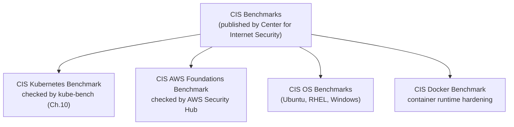
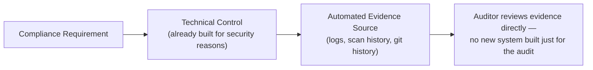
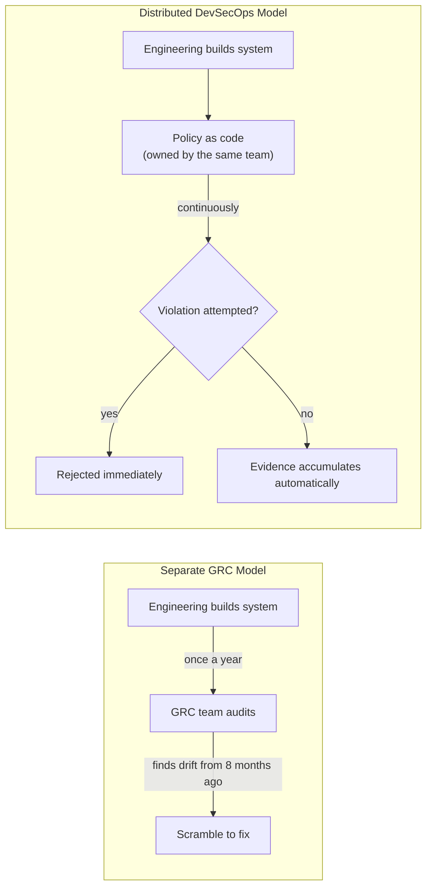

# Chapter 12 — Compliance and Governance

## Learning Objectives

By the end of this chapter you will be able to:

- Explain why mature compliance frameworks are largely codifications of practices this course already teaches, rather than a separate, bolted-on burden
- Describe SOC 2, PCI-DSS, HIPAA, and GDPR at a practical level: what each is for, who needs it, and concrete example requirements tied to earlier chapters
- Explain how CIS Benchmarks generalize beyond Kubernetes to cloud accounts, operating systems, and container runtimes
- Explain why policy as code is the single mechanism that turns compliance from a periodic manual audit into a continuously-enforced property of the system
- Explain how audit logs and centralized logging, already built in Topics 9-10, serve as compliance evidence largely for free
- Give an honest, balanced assessment of what compliance automation can and cannot fully replace

---

## Prerequisites for This Chapter

- **This course, Chapter 9 (Infrastructure as Code Security)** — required, specifically OPA/Conftest policy-as-code coverage, which this chapter extends to compliance use cases.
- **Advanced Kubernetes, Chapter 3 (Admission Control and Pod Security)** — required, specifically Kyverno/Gatekeeper policy enforcement, referenced directly in section 12.4.
- **Advanced Kubernetes, Chapter 2 (RBAC and Authentication)** and **Chapter 13 (Auditing)** — required, referenced in the SOC 2 and audit-trail discussions.
- **This course, Chapters 5-6 (Dependency Scanning/SCA and Container/Image Security)** — required, referenced directly in the PCI-DSS discussion.
- **Cloud Fundamentals AWS, Chapter 2 (IAM)** and Terraform-related encryption practices — recommended, referenced in the PCI-DSS encryption discussion.
- **Monitoring & Logging (Topic 10)** — recommended, specifically centralized logging, referenced in section 12.5.

---

## 12.1 Reframing Compliance for a DevSecOps Audience

It's worth naming the cynical view directly, because most engineers have encountered it and it isn't entirely wrong: compliance is often experienced as a bureaucratic checkbox exercise — a stack of policy documents nobody reads, a once-a-year fire drill where engineering scrambles to produce screenshots for an auditor, disconnected from anything that actually makes the system more secure. If your only exposure to "compliance" has been that experience, treating it as a hollow ritual is a reasonable conclusion.

But that experience is usually a symptom of compliance being treated as a **separate, bolted-on activity** rather than a natural output of good engineering practice — and that's a choice, not an inherent property of compliance itself. Here is the more accurate framing this chapter argues for: **mature compliance frameworks are, to a large extent, codifications of the exact same practices this course has already taught** — least privilege (Advanced Kubernetes Ch. 2, this course's CI/CD credential scoping in Ch. 11), encryption of sensitive data (this course's secrets management in Ch. 3, Terraform/AWS encryption practices), audit trails (Advanced Kubernetes Ch. 13), and systematic vulnerability management (this course's Ch. 4-6) — turned into an externally-verifiable, standardized checklist that a customer, regulator, or partner can trust *without personally auditing your entire engineering practice themselves*.

Put differently: a customer evaluating whether to trust your SaaS platform with their data has no practical way to inspect your RBAC configuration, read your Kubernetes audit logs, or verify your vulnerability scanning process directly. A SOC 2 report (or a PCI-DSS attestation, for organizations handling card data) is a standardized, independently-verified proxy for exactly that — "trust me" replaced with "an independent auditor checked, using a well-known standard, and here's the result." Good DevSecOps, done for its own sake, naturally produces most of what compliance requires as a side effect. This chapter's job is to make that connection concrete, and also to be honest about where the connection breaks down (section 12.7).

---

## 12.2 The Frameworks You're Most Likely to Actually Encounter

A platform or DevOps engineer rarely needs to become a compliance expert, but recognizing these frameworks by name — what they're for, roughly what they require, and which earlier chapters already cover the underlying practice — is genuinely useful, because these acronyms show up constantly in security questionnaires, sales cycles, and audits.

| Framework | Who Needs It | Example Requirements | Underlying Practice (Already Covered) |
|---|---|---|---|
| **SOC 2** | SaaS / cloud service companies — the most common trust-focused audit for B2B software vendors, organized around "Trust Service Criteria" (Security, Availability, Confidentiality, Processing Integrity, Privacy) | Documented access control policies; a formal change management process for production changes; documented and tested incident response procedures | Access control → RBAC (Adv. K8s Ch. 2); change management → PR review + CI/CD pipeline discipline (CI/CD Topic 5, this course's Ch. 11); incident response → this course's Chapter 13 |
| **PCI-DSS** | Any organization that stores, processes, or transmits credit card data | Network segmentation isolating systems that handle cardholder data; encryption of cardholder data at rest and in transit; regular vulnerability scanning of systems in scope | Network segmentation → NetworkPolicies (Adv. K8s Ch. 4); encryption → Terraform/AWS encryption-at-rest and TLS practices; vulnerability scanning → this course's Chapters 5-6 |
| **HIPAA** | Organizations handling protected health information (PHI) in the US | Access controls restricting PHI to authorized personnel only; audit trails of who accessed PHI and when; encryption of PHI at rest and in transit | Same themes as PCI-DSS and SOC 2 — access control, audit trails, encryption — applied specifically to health information |
| **GDPR** | Any organization processing personal data of EU residents (a privacy *regulation*, not a security framework per se, but closely related) | Data minimization (collect only what's necessary); breach notification within 72 hours; the right to erasure | Overlaps with, but is distinct from, the security frameworks above — worth being aware of even though this course's focus is security, not privacy law |

A useful pattern to notice across the table: **the same underlying technical practices satisfy multiple frameworks simultaneously.** A well-designed RBAC policy is not "the SOC 2 RBAC policy" and a separate "the HIPAA RBAC policy" — it's one RBAC policy that happens to satisfy an access-control requirement present, in some form, in nearly every framework in this table. This is exactly why building genuinely good security practice, rather than chasing individual frameworks' checklists one at a time, is the more efficient strategy in the long run.

A little more detail on each, since the acronyms alone don't convey much:

**SOC 2** is not a pass/fail certification issued by SOC 2 itself — it's an *audit report*, produced by an independent CPA firm, attesting that your controls actually operate the way you say they do, evaluated against whichever of the five Trust Service Criteria you scope the audit to (almost every company scopes in Security; Availability and Confidentiality are common add-ons for infrastructure-heavy platforms). A **Type I** report attests your controls are designed appropriately at a single point in time; a **Type II** report — the one customers actually care about — attests those controls operated effectively over an observation period, typically 3-12 months. This distinction matters practically: Type II is why "we have a policy" isn't enough — the auditor is checking that the policy was followed continuously, which is exactly what section 12.5's audit-trail discussion addresses.

**PCI-DSS** is unusual among this table in that it isn't voluntary in the way SOC 2 is — if you touch cardholder data at all, your payment processor contractually requires it, and the requirement level scales with transaction volume (a small merchant self-attests with a simpler questionnaire; a large one requires a full independent assessment by a Qualified Security Assessor). The standard's very specific technical requirements — twelve numbered requirement categories in total — are exactly why this framework maps so cleanly onto this course's scanning and segmentation chapters: PCI-DSS was written by payment-industry security practitioners, for infrastructure that looks a lot like what this course teaches you to build.

**HIPAA** differs structurally from SOC 2 and PCI-DSS in that it's a US federal law, not an industry-run audit standard, and it doesn't prescribe a single certifying report the way SOC 2 does — compliance is typically demonstrated through a documented risk analysis and a "Business Associate Agreement" between a healthcare provider and any vendor (like a SaaS company) that handles protected health information on their behalf. The technical substance — access control, audit trails, encryption — is close enough to SOC 2 and PCI-DSS that an organization already compliant with one is usually most of the way to the others technically, even though the legal and documentation mechanics differ.

**GDPR** is included deliberately even though it's a privacy regulation rather than a security framework, because the line between the two blurs constantly in practice: a security *breach* under GDPR triggers a *privacy* obligation (notifying affected individuals and regulators within 72 hours), and the "right to erasure" (a user's right to have their data deleted) is a feature request that has real infrastructure implications — can your data stores actually locate and delete one specific user's data across every system that holds a copy? That's an architecture question, not just a legal one, and it's worth knowing this regulation exists even in a security-focused course.

---

## 12.3 CIS Benchmarks, Generalized Beyond Kubernetes

Chapter 10 of this course introduced the **CIS Kubernetes Benchmark** and `kube-bench` as a specific, checkable configuration baseline for Kubernetes clusters. The same underlying idea — "here is a long list of specific, pass/fail configuration checks, published by an independent standards body, that define what 'securely configured' concretely means for this system" — is not unique to Kubernetes. The **Center for Internet Security** publishes CIS Benchmarks for a wide range of systems:

- **Cloud provider accounts** — the **CIS AWS Foundations Benchmark** (and equivalents for Azure and GCP), covering account-level configuration like "ensure CloudTrail is enabled in all regions," "ensure the root account has hardware MFA enabled," "ensure no security groups allow ingress from `0.0.0.0/0` on port 22."
- **Operating systems** — CIS Benchmarks exist for Ubuntu, RHEL, Windows Server, and others, covering OS-level hardening (disabling unused services, file permission baselines, password policies).
- **Container runtimes** — a CIS Docker Benchmark covers daemon configuration, image build practices, and container runtime settings, distinct from (but complementary to) the Kubernetes-specific benchmark.

Just as `kube-bench` automates checking a cluster against the Kubernetes benchmark, **AWS Security Hub's CIS AWS Foundations Benchmark standard** is the direct cloud-account-level analog: enable it, and Security Hub continuously evaluates your AWS account's actual configuration against the benchmark's specific controls, surfacing findings in the same way `kube-bench` surfaces PASS/FAIL/WARN results for a cluster.



The pattern repeats identically everywhere: an independent body defines a specific, checkable baseline; an automated tool checks a live system against it continuously; the result is both a security improvement and, as section 12.4 makes concrete, compliance evidence.

Concretely, enabling the CIS AWS Foundations Benchmark standard in Security Hub produces the exact same kind of PASS/FAIL/WARN checklist `kube-bench` produced for Kubernetes in Chapter 10 — just aimed at the account level instead of the cluster level:

```text
[FAILED] CIS 1.4  Ensure access keys are rotated every 90 days or less
[PASSED] CIS 1.5  Ensure IAM password policy requires at least one uppercase letter
[PASSED] CIS 1.14 Ensure hardware MFA is enabled for the root user
[FAILED] CIS 2.1  Ensure CloudTrail is enabled in all regions
[PASSED] CIS 2.9  Ensure VPC flow logging is enabled in all VPCs
[FAILED] CIS 5.2  Ensure no security groups allow ingress from 0.0.0.0/0 to port 22
```

Just like a `kube-bench` FAIL, each of these lines is both a concrete security gap to close *and*, once fixed and re-checked continuously, evidence you can point an auditor to directly — a live, dated, automatically-refreshed compliance artifact rather than a document someone has to remember to update by hand.

---

## 12.4 Policy as Code: The Single Most Important Idea in This Chapter

This section contains the idea this entire chapter is really building toward, so read it carefully: **the same policy-as-code mechanisms this course already taught for security enforcement can encode compliance requirements directly, as automatically-enforced, continuously-checked rules — and this is what actually turns compliance from a periodic manual audit into a continuous, automated, always-true property of the system.**

Recall two mechanisms from earlier in this course and Advanced Kubernetes:

- Chapter 9 taught **OPA/Conftest** for scanning Terraform/IaC before it's ever applied.
- Advanced Kubernetes Chapter 3 taught **Kyverno/Gatekeeper** for enforcing policy on live Kubernetes resources at admission time.

Neither of those chapters framed their examples as "compliance" — they framed them as security best practice. But look at a concrete example, side by side:

```rego
# Conftest/OPA policy (Chapter 9's mechanism), enforced against every Terraform plan
package terraform.security

deny[msg] {
  resource := input.resource_changes[_]
  resource.type == "aws_s3_bucket"
  not resource.change.after.server_side_encryption_configuration
  msg := sprintf("S3 bucket '%s' must have encryption enabled", [resource.address])
}
```

This one rule is simultaneously:

- A **security best practice** — unencrypted data at rest is a real risk, full stop, regardless of any compliance framework.
- A **direct satisfaction of a specific PCI-DSS requirement** (encryption of cardholder data at rest, from section 12.2's table) *if* this bucket happens to store anything in scope for PCI-DSS.
- A **direct satisfaction of a specific SOC 2 control** (data protection, under the Security Trust Service Criterion) regardless of what the bucket stores.

The same is true of a Kyverno policy requiring non-root containers (satisfies a SOC 2 access-control expectation and a general security best practice simultaneously), or an admission policy requiring image signature verification (Chapter 10, section 10.4 — satisfies both a security goal and, for many frameworks, a software integrity/change-management control). **You are not writing separate "compliance policies" and "security policies."** You write one policy-as-code rule set, enforced continuously by the same OPA/Conftest and Kyverno/Gatekeeper mechanisms you already deployed for security reasons, and it produces compliance as a byproduct — not a coincidence, but the direct, designed consequence of encoding the same underlying requirement once, mechanically, instead of documenting it in a policy PDF and hoping it's followed.

This is the concrete mechanism that answers the cynical framing from section 12.1: compliance stops being "a document describing what we're supposed to do" and becomes "a continuously-enforced, machine-checked property of what the system actually does" — the difference between a policy and a guarantee.

---

## 12.5 Audit Trails: The Evidence Compliance Actually Asks For

A detail that surprises many engineers encountering their first SOC 2 or PCI-DSS audit: **auditors don't ask for a policy document alone — they ask for evidence that the policy was actually followed**, specific and dated. "We have an access control policy" is a claim; "here is the log showing every access-control-relevant change made in the audit period, who made it, and when" is evidence.

This is exactly where the infrastructure built across **Advanced Kubernetes Chapter 13 (audit logging)** and **Monitoring & Logging's centralized logging (Topic 10)** pays off a second time, largely for free. The Kubernetes audit log already records every RBAC-relevant API request — every `RoleBinding` created, every `Secret` accessed, every privileged Pod attempted. Centralized logging already aggregates and retains logs across the whole stack. If retained for a sufficient period (SOC 2 auditors commonly expect at least the audit period itself, often 6-12 months, depending on the specific control), **this is the audit trail** — not a separate system built specifically for compliance, but the same operational logging infrastructure the reader already built for entirely different, purely operational reasons (debugging, monitoring, incident response).

The practical implication: when preparing for an audit, the question is rarely "do we have this evidence at all?" — it's "do we retain it long enough, and can we export it in a form an auditor can review?" Both are configuration questions about infrastructure that already exists, not new systems to build from scratch.

A growing category of vendor tooling — **Vanta, Drata, Secureframe**, and similar "continuous compliance" platforms — exists specifically to automate the *last mile* of this: connecting directly to your cloud accounts, Kubernetes clusters, CI/CD system, and identity provider via API, and continuously pulling exactly this kind of evidence (IAM configuration, RBAC bindings, scan results, access-review completion) into a dashboard mapped against whichever framework's specific control numbers you're pursuing. It's worth understanding what these tools actually do and don't do: they are evidence-collection and mapping automation, sitting on top of the same underlying controls this chapter has described — they do not create good security practice on their own, and a company with weak RBAC and no scanning will just get a dashboard full of red findings, faster. They're a genuine accelerant once the underlying practice exists, not a substitute for it.

---

## 12.6 From Requirement to Evidence: A Concrete Map

Pulling the chapter's thesis into one table — for a handful of concrete example requirements, here is the compliance requirement, the technical control this course already built to satisfy it, and the automated evidence source an auditor could be pointed to directly:

| Compliance Requirement | Technical Control (Already Built) | Automated Evidence Source |
|---|---|---|
| Access to production systems is restricted to authorized personnel and reviewed periodically | Least-privilege RBAC per team/ServiceAccount (Adv. K8s Ch. 2) | `kubectl` RBAC manifests in version control + Kubernetes audit log of every binding change (Adv. K8s Ch. 13) |
| Cardholder/sensitive data is encrypted at rest and in transit | Terraform/AWS encryption defaults + TLS everywhere | OPA/Conftest policy denying unencrypted resources (§12.4) — a failing plan is itself a blocked-and-logged CI run |
| Changes to production are reviewed and tested before deployment | Mandatory PR review + CI/CD pipeline gates (CI/CD Topic 5, this course's Ch. 11) | Git history + CI pipeline logs showing every deployment's associated PR, reviewer, and passing checks |
| Known vulnerabilities are identified and remediated within a defined timeframe | SAST/SCA/container scanning in CI (Ch. 4-6) | Dated scan reports and remediation tickets, exportable directly from the scanning tool's history |
| The system's actual configuration matches its documented security baseline | CIS Benchmark checks (`kube-bench`, AWS Security Hub — §12.3) | Scheduled scan results showing PASS/FAIL history over time, demonstrating continuous conformance, not a one-time snapshot |



---

## 12.7 The Honest Limits: Compliance Theater vs. Real Compliance

It would be dishonest to end this chapter implying policy as code and audit logging fully automate compliance — they don't, and claiming otherwise is itself a form of what practitioners call **"compliance theater"**: technical checks that look rigorous but don't actually address the full scope of what a framework requires.

Automating the technical checks — encryption enabled, RBAC configured correctly, vulnerability scans passing, CIS benchmarks green — is **necessary but not sufficient**. Real compliance programs, for every framework in section 12.2's table, still require genuine **organizational** practices that technology alone cannot fully automate:

- **Documented incident response procedures that are actually followed** — not just a runbook that exists, but evidence that the team ran a real (or realistic tabletop) incident and followed it, which Chapter 13 of this course covers directly.
- **Actual employee security training** — a policy-as-code rule cannot verify that a new hire understood their responsibilities around handling sensitive data; this requires genuine training programs and records of completion.
- **Genuine access reviews** — periodically confirming that the *humans* who have access to sensitive systems still need it (someone who changed teams eighteen months ago and never had their old permissions revoked is a real, common finding, and no policy-as-code rule catches "this specific person no longer needs this specific access" without a human actually reviewing the list).

The honest framing: automation handles the parts of compliance that are genuinely mechanical and continuous — exactly the parts this chapter has focused on, because they're the parts a DevSecOps engineer directly builds and owns. But a compliance *program*, in full, is broader than infrastructure configuration, and pretending otherwise sets an organization up for an unpleasant surprise when an auditor asks for evidence of something no pipeline was ever going to produce.

---

## 12.8 Governance in a DevSecOps Model: Distributed, Not Delegated

The word "governance" often conjures a specific, outdated picture: a separate compliance or GRC (Governance, Risk, and Compliance) department, disconnected from engineering, that shows up once a year with a spreadsheet of questions, collects screenshots, and produces a report nobody on the engineering team ever reads. That model is exactly the "bolted-on security" pattern Chapter 1 of this course argued against for security generally — and it fails for the same reasons here: a team that only interacts with compliance once a year has no way to catch a control that quietly broke in month three.

A DevSecOps-aligned governance model looks structurally different, and it follows directly from everything else this course has taught:

- **Ownership of controls sits with the teams who build the systems those controls govern**, not with a separate department that has to go ask engineering for evidence after the fact. The platform team that wrote the Kyverno policies in Advanced Kubernetes Chapter 3 is also the team that can speak authoritatively to an auditor about what those policies enforce and why — because they own the mechanism, not just a paper description of it.
- **A compliance/security function, where one exists, plays a coordinating and reviewing role** — mapping the organization's actual technical controls to the specific clause numbers a given framework requires, flagging gaps, and owning the genuinely organizational pieces from section 12.7 (training programs, access review cadence, incident response drills) that don't belong to any single engineering team. This is a legitimate, valuable, non-bureaucratic role — it's just not the *sole* owner of "being compliant" the way the outdated model implies.
- **Governance decisions themselves become auditable artifacts**, because they're expressed the same way every other engineering decision in this course has been: as code, reviewed via pull request, with history. A policy-as-code rule change (§12.4) requiring PR approval *is* a governance decision, made visibly and durably, rather than a verbal agreement in a meeting that nobody wrote down.

This distributed model is also simply more resilient: a compliance requirement enforced as a Kyverno policy fails loudly and immediately (a violating Pod gets rejected) the moment someone tries to violate it, rather than silently drifting for eleven months until the next audit discovers it. Governance, done this way, is a continuously-running property of the system rather than an annual event — the same shift from "periodic manual check" to "continuous automated property" that section 12.4 described for compliance requirements specifically, now applied to the governance function as a whole.

| | Separate GRC Department Model | Distributed DevSecOps Governance Model |
|---|---|---|
| Who owns a control | A compliance team, once removed from the system | The engineering team that built and operates the system |
| How a violation is caught | An annual (or semi-annual) audit cycle | Immediately — a failing policy-as-code check or a rejected admission request |
| Where the "policy" lives | A Word document or wiki page | Version-controlled code (Rego, Kyverno YAML), reviewed via PR |
| Evidence production | A scramble to gather artifacts right before the audit | A continuous byproduct of normal operations, exported when needed |
| Failure mode | Drift goes unnoticed for up to a year | Drift is rejected at the moment it's attempted |



---

## Real-World Scenario: A SaaS Company's First SOC 2 Audit

A mid-sized SaaS company's leadership announces the company is pursuing its first SOC 2 Type II report, driven by a large prospective customer's procurement requirement. The engineering team's initial reaction is dread — everyone assumes this means months of disruptive, new process, new tooling, and pulled-together documentation, on top of their regular roadmap.

What they find, once they start, is different from what they feared — because of decisions made for entirely unrelated reasons over the previous two years:

- **Access control evidence** is a straightforward export: their Kubernetes RBAC configuration (Advanced Kubernetes Ch. 2) was already narrowly scoped per team and per ServiceAccount, and their audit logs (Advanced Kubernetes Ch. 13) already show every RBAC-relevant change, dated and attributed.
- **Change management evidence** is their existing CI/CD pipeline history — every production deployment already went through mandatory PR review and passed through the OIDC-authenticated, narrowly-scoped pipeline built following this course's Chapter 11. The evidence isn't something to construct; it's the git history and pipeline logs that already exist.
- **Vulnerability management evidence** is a report pulled straight from the SAST/SCA/container-scanning tools (this course's Ch. 4-6) they'd been running in CI for over a year — dated scan results, remediation timelines, and severity policies already documented as part of normal engineering practice.
- **Infrastructure security evidence** comes directly from their Conftest/OPA and Kyverno policies (Ch. 9, Adv. K8s Ch. 3, and this chapter's §12.4) — because those policies are code, living in version control, they are themselves auditable evidence of exactly what's enforced and since when, with git blame showing who approved each policy change.

The pieces genuinely missing — and the pieces that actually took real effort — were the organizational ones section 12.7 named honestly: a formally written and reviewed incident response plan (building on Chapter 13's frameworks), documented evidence of security awareness training for all employees, and a first formal quarterly access review. What the team had originally budgeted as a dreaded, disruptive, quarter-long scramble compressed into a few focused weeks of documenting and exporting evidence from systems that were already running — because the actual security work, done well and for its own sake over the prior two years, had already produced most of what the audit needed.

---

## Best Practices

- Treat every new security control as a potential compliance-evidence source from the start — retain logs, dates, and approvals in a form an auditor could review later, not just a form that works operationally today.
- Write policy-as-code rules (OPA/Conftest, Kyverno/Gatekeeper) framed around the underlying security property ("encryption enabled," "least privilege enforced"), not around a specific framework's clause number — the same rule then naturally satisfies multiple frameworks at once.
- Set log retention periods deliberately, based on the longest audit period any framework you care about requires, rather than defaulting to whatever a logging tool ships with.
- Map each compliance framework's requirements to the specific earlier-course chapter and tool that already satisfies it before building anything new — most of the work is usually already done.
- Budget real time and ownership for the organizational controls (incident response drills, training, access reviews) that automation genuinely cannot replace — don't let compliance automation create false confidence that the full program is covered.

## Common Mistakes

- Treating compliance as a separate, bolted-on project disconnected from existing security engineering, instead of recognizing it as a natural byproduct of practices already in place.
- Automating only the technical checks and assuming that alone constitutes full compliance — "compliance theater" that fails the first time an auditor asks for evidence of a genuinely organizational control.
- Not retaining audit/centralized logs long enough to cover a full audit period, discovering the gap only when an auditor asks for evidence from before retention began.
- Writing policy-as-code rules narrowly scoped to a single framework's specific clause, missing the opportunity to satisfy several frameworks' overlapping requirements with one rule.
- Assuming CIS Benchmarks only apply to Kubernetes, and neglecting the cloud-account-level (CIS AWS Foundations Benchmark) or OS-level equivalents.

*(The full catalog of DevSecOps pitfalls is covered in Chapter 15 — Common Mistakes and Pitfalls.)*

---

## Summary

Compliance frameworks, viewed accurately, are largely standardized, externally-verifiable codifications of the same practices this course already teaches — least privilege, encryption, audit trails, vulnerability management — rather than a separate bureaucratic burden. SOC 2 (trust-focused, common for SaaS), PCI-DSS (cardholder data), HIPAA (health data), and GDPR (data privacy, not strictly a security framework) each have concrete requirements that map directly onto RBAC, NetworkPolicies, encryption practices, and scanning tools already covered in this course and Advanced Kubernetes. CIS Benchmarks generalize beyond Chapter 10's Kubernetes-specific coverage to cloud accounts (via AWS Security Hub's CIS AWS Foundations Benchmark), operating systems, and container runtimes — the same "specific, checkable baseline" idea applied broadly. The single most important idea in this chapter is that **policy as code** (OPA/Conftest, Kyverno/Gatekeeper) turns compliance requirements into continuously-enforced, automatically-checked rules that are simultaneously security best practice and compliance evidence — one rule, not two separate efforts. Audit logging and centralized logging, already built in Topics 9-10, serve as the evidence trail auditors actually ask for, largely for free, if retained appropriately. Finally, automation is necessary but not sufficient: genuine organizational practices — real incident response, real training, real access reviews — remain essential and cannot be fully automated away.

---

## Knowledge Check

1. Explain, in your own words, why mature compliance frameworks can be described as "codifications of good DevSecOps practice" rather than a separate burden.
2. For SOC 2, PCI-DSS, and HIPAA, name one example requirement each and the earlier-course chapter/mechanism that already satisfies it.
3. How does the CIS AWS Foundations Benchmark, checked via AWS Security Hub, relate to Chapter 10's `kube-bench`?
4. Give a concrete example of a single policy-as-code rule that simultaneously satisfies a security best practice and a specific compliance requirement.
5. Why do auditors ask for "evidence," not just a policy document — and what infrastructure from Topics 9-10 already produces that evidence?
6. Name two organizational compliance requirements that policy-as-code and audit logging alone cannot satisfy, and contrast the "separate GRC department" governance model with the distributed-ownership model from section 12.8 — why is the distributed model more likely to catch a control that silently broke months before the next audit?

---

## Hands-On Exercise

1. Write an OPA/Conftest policy (extending Chapter 9's coverage) that denies any Terraform plan creating an `aws_db_instance` without `storage_encrypted = true`. Test it against a Terraform plan that violates the rule and confirm it fails the check.
2. Write a Kyverno `ClusterPolicy` (extending Advanced Kubernetes Chapter 3 and this course's Chapter 10) that requires every Pod in a `pci-scope` namespace to run as non-root. Deploy a violating Pod spec against your local `kind` cluster and confirm it's rejected.
3. Using the two policies above, write a short table (framework | requirement | which policy above satisfies it) mapping each policy to at least one row of section 12.2's framework table.
4. Check your local `kind` cluster's audit log configuration (from Advanced Kubernetes Chapter 13). Write down what retention period is currently configured, and what you would need to change to retain 12 months of audit logs — the retention period commonly expected for a SOC 2 Type II audit period.
5. Reflection: pick one of the three organizational controls named in section 12.7 (incident response, training, access review) and write two or three sentences describing what evidence you would need to produce to satisfy an auditor asking about it, and why no policy-as-code rule could generate that evidence on its own.

---

## Further Reading

- [AICPA — SOC 2 Trust Services Criteria](https://www.aicpa-cima.com/topic/audit-assurance/audit-and-assurance-greater-than-soc-2)
- [PCI Security Standards Council — PCI-DSS Requirements and Documents](https://www.pcisecuritystandards.org/document_library/)
- [Center for Internet Security — CIS Benchmarks](https://www.cisecurity.org/cis-benchmarks)
- [Open Policy Agent — Policy as Code Documentation](https://www.openpolicyagent.org/docs/latest/)
- [AWS Security Hub — CIS AWS Foundations Benchmark](https://docs.aws.amazon.com/securityhub/latest/userguide/cis-aws-foundations-benchmark.html)

---

<div style="display:flex;justify-content:space-between;align-items:center;">
  <a href="./11-cicd-pipeline-security.md">← Previous: CI/CD Pipeline Security</a>
  <a href="./00-index.md">🏠 Index</a>
  <a href="./13-security-monitoring-and-incident-response.md">Next: Security Monitoring and Incident Response →</a>
</div>
