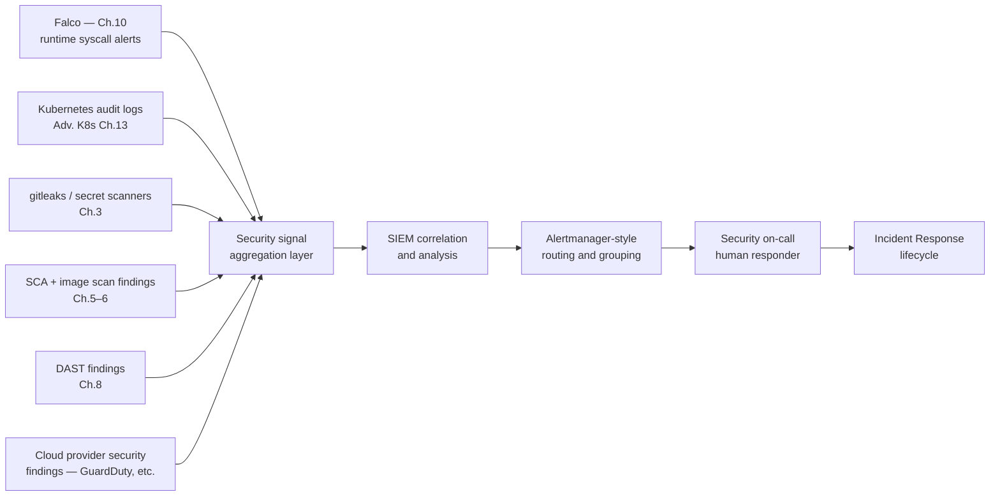
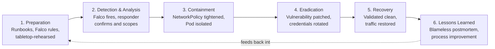

# Chapter 13 — Security Monitoring and Incident Response

## Learning Objectives

By the end of this chapter, you will be able to:

- Explain what a SIEM is conceptually, how it relates to the centralized logging stack from Monitoring & Logging Chapter 9, and the real tradeoffs between a dedicated SIEM product and an extended observability stack
- Apply Monitoring & Logging Chapter 7's Alertmanager grouping/routing/inhibition framework specifically to security alerts, and explain why security on-call should be a distinct rotation from general engineering on-call
- Walk through all six stages of the Incident Response lifecycle — Preparation, Detection & Analysis, Containment, Eradication, Recovery, and Lessons Learned — with a concrete action at each stage
- Explain why blameless postmortems are a genuine security control, not merely a cultural nicety
- Define a tabletop exercise and explain how it functions as a "game day" drill for security incidents specifically
- Trace a single incident, start to finish, through the full IR lifecycle and identify the concrete process improvement it produces

---

## Prerequisites

- **This course, Chapter 3 (Secrets Management)** — specifically the "treat any exposed secret as compromised, rotate immediately" principle
- **This course, Chapter 10 (Kubernetes Security Deep Dive)** — specifically Falco runtime detection and its shell-spawn-in-a-container alert
- **This course, Chapters 5–6 and 8** — SCA, container scanning, and DAST as sources of vulnerability findings
- **Advanced Kubernetes, Chapter 4 (NetworkPolicies) and Chapter 9 (Cluster Administration)** — cordoning nodes and isolating workloads
- **Advanced Kubernetes, Chapter 10 (Backup and Disaster Recovery)** — the "untested backup is not a backup" principle and DR game days
- **Advanced Kubernetes, Chapter 13 (Auditing and Troubleshooting at Scale)** — Kubernetes audit logs as a forensic record
- **Monitoring & Logging, Chapter 7 (Alerting and Alertmanager)** — grouping, routing, inhibition, and alert fatigue; this chapter assumes you've read it and builds directly on it
- **Monitoring & Logging, Chapter 9 (The ELK Stack)** — centralized logging architecture, which a SIEM extends with a security lens

---

## 13.1 Where Every Signal in This Course Finally Converges

Every earlier chapter in this course has been about *generating* a security-relevant signal. Chapter 10's Falco watches syscalls inside running containers and fires the moment a shell spawns unexpectedly inside a Pod that should never spawn one. Advanced Kubernetes Chapter 13's audit logs record every request that ever touched the API server. Chapter 3's `gitleaks` and equivalent tooling scan every commit for an accidentally-committed credential. Chapters 5 and 6's SCA and image scanners produce a steady stream of "this dependency/image has a known CVE" findings. Chapter 8's DAST scanner reports an exploitable endpoint it found by actually attacking a running application.

None of that, by itself, protects anything. A Falco alert that fires into a log file nobody tails is indistinguishable, in its actual effect on the organization, from no runtime detection at all. A CVE finding that sits in a dashboard nobody opens is exactly as useful as not having scanned in the first place. **Detection without a response process is theater** — it creates the comfortable feeling of security coverage while doing nothing to shorten the time between "something bad happened" and "a human did something about it."

This chapter is about that last, essential mile: getting the right signal to the right human, fast, and having a real, rehearsed process for what happens once they're paged. Two things have to be built for this to work: a place where security signals are aggregated and correlated (a SIEM, conceptually), and a discipline for turning a fired alert into a resolved incident (the IR lifecycle). Both are covered in this chapter, and both lean directly on infrastructure and discipline you already have from Monitoring & Logging.



---

## 13.2 SIEM: The Same Centralized Logging Discipline, Wearing a Security Lens

A **Security Information and Event Management (SIEM)** system is, at its conceptual core, a centralized system that aggregates and correlates security-relevant events from many sources — application logs, Kubernetes audit logs, Falco alerts, cloud provider security findings (AWS GuardDuty, Azure Defender), network flow logs, and authentication events — specifically for the purpose of security detection and analysis.

If that description sounds familiar, it should: it is, structurally, the same centralized logging discipline Monitoring & Logging Chapter 9 taught with the ELK stack (or Chapter 10's Loki) — collect logs from every source into one searchable place instead of forcing an engineer to SSH into forty machines during an incident. A SIEM is that same discipline, aimed at a different question and a different primary audience. Where a general observability stack asks "is the system healthy, and why is it slow," a SIEM asks "is someone doing something they shouldn't be, and what did they touch." The queries look different (a SIEM analyst searches for a specific IP address across every log source in the last 90 days; an SRE searches for elevated latency on one service in the last hour), the correlation rules look different (a SIEM correlates a failed-login spike on one system with a successful login from an unusual location minutes later; an SRE correlates a deploy event with a latency regression), and the primary audience is usually a dedicated security or detection-engineering team rather than the on-call engineer for a specific service.

### A real architectural choice, not a single right answer

Organizations make one of two legitimate choices here, and — exactly as with Monitoring & Logging Chapter 9's ELK-vs-Loki decision — the right one depends on actual needs, not on which option sounds more mature:

**Option 1 — a dedicated, separate SIEM product.** Splunk, Elastic Security (built on the same underlying ELK stack from Monitoring Chapter 9, but configured and licensed specifically for security use cases with built-in detection content), Microsoft Sentinel, or a similar purpose-built product. This gets you security-specific features out of the box: pre-built detection rules mapped to attacker techniques (MITRE ATT&CK), case management for tracking an investigation from alert to resolution, and a query language and UI built around a security analyst's workflow rather than an SRE's.

**Option 2 — extend the existing observability stack.** Ship the same security-relevant sources (Falco, audit logs, secret-scan findings) into the Loki/ELK stack you already operate, and build security-specific dashboards, saved searches, and Alertmanager routing rules on top of the infrastructure you already run and already know how to operate.

| | Dedicated SIEM product | Extended observability stack |
|---|---|---|
| Time to useful detection content | Faster — ships with pre-built rules and threat intelligence feeds | Slower — you write your own correlation logic from scratch |
| Operational overhead | A new system to run, license, and operate (or a SaaS bill) | None beyond what you already run |
| Audience fit | Purpose-built for a dedicated security/SOC team's workflow | Good if the same engineers already own observability and security |
| Cost at scale | Often licensed per GB ingested — can get expensive fast | Scales with your existing infrastructure cost model |
| Right for... | A dedicated security team, compliance requirements demanding SIEM-specific capabilities, high event volume needing mature correlation | A smaller organization without a dedicated SOC, a platform team already disciplined about centralized logging, cost-sensitive environments |

Neither choice is universally correct. A well-funded security team investigating sophisticated threats across a large, complex estate benefits enormously from a dedicated SIEM's case management and pre-built detection content. A smaller platform team that already runs a disciplined ELK/Loki stack and doesn't have (or need) a dedicated SOC often gets more value from extending what they already operate — Falco alerts and audit logs flowing into the same Loki instance that already holds application logs, with a handful of security-specific saved searches and Alertmanager routes layered on top — than from standing up and licensing an entirely separate product they'd only partially use. What matters is making the choice deliberately, the same way Monitoring Chapter 14 insisted on choosing ELK vs. Loki based on actual query patterns rather than hype.

---

## 13.3 Security Alerting: Alertmanager's Framework, Applied to Security Signals

Monitoring & Logging Chapter 7 built a complete framework for turning a fired condition into "the right person got notified, exactly once, without drowning in noise": grouping, routing, silencing, and inhibition, plus the core discipline against alert fatigue — is this alert actionable, and does it represent genuine, current impact? Every one of those mechanisms applies to security alerts unchanged. What changes is the specific decisions you make within that framework.

### Route to a dedicated security on-call, not general engineering on-call

A Falco alert reporting a shell spawned inside a production Pod, or a critical CVE finding on an internet-facing image, needs a fundamentally different response playbook than "the checkout API's error rate is elevated." The first requires someone who knows how to scope a compromise, preserve forensic evidence, and decide whether to isolate a workload; the second requires someone who knows the checkout service's deploy history and dependency graph. Routing both to the same general engineering on-call rotation means whoever is paged is, roughly half the time, the wrong kind of responder for the alert they just received.

```yaml
route:
  receiver: default-slack
  group_by: ['alertname', 'namespace']
  routes:
    - match:
        source: falco
        priority: critical
      receiver: security-oncall-pagerduty
      continue: false

    - match:
        source: vulnerability-scanner
        severity: critical
        exposure: internet-facing
      receiver: security-oncall-pagerduty

    - match:
        team: checkout
        severity: critical
      receiver: pagerduty-checkout-team   # unrelated operational alert — stays with the app team
```

This is the exact same routing-tree mechanism from Monitoring Chapter 7 (match on labels, most specific route first, `continue: false` to stop evaluation) — the only thing new is the decision to stand up a `security-oncall-pagerduty` receiver, staffed by people trained on the incident response playbook in Section 13.4, as a distinct destination from the general engineering rotation.

### Group aggressively — a compromised Pod scanning endpoints is one incident, not two hundred

If a compromised Pod starts port-scanning or probing dozens of internal service endpoints, a naive per-connection or per-request Falco/network-policy-violation rule can fire hundreds of near-duplicate alerts within seconds. Exactly as Monitoring Chapter 7 grouped fifty crashlooping-Pod alerts into one notification, group these by the identity that actually defines "the same incident" — the source Pod or the compromised ServiceAccount, not each individual destination it probed:

```yaml
route:
  group_by: ['alertname', 'source_pod', 'namespace']
  group_wait: 15s
  group_interval: 2m
  repeat_interval: 30m
```

A responder who receives one notification reading "Pod `checkout-api-7d9f8-x4k2p` attempted connections to 47 distinct internal endpoints in the last 15 seconds" can act immediately. A responder who receives 47 separate pages, one per destination, spends the first several minutes of the incident just realizing they're all the same event — time that, in an active-compromise scenario, is exactly the time an attacker is using to move further.

### The same actionability discipline — arguably more important here

Monitoring Chapter 7's core question — "if this fires, does the person receiving it have a clear next step, and does it represent genuine, current impact?" — applies to security alerts with, if anything, higher stakes. A security team that tunes out noisy, low-value alerts because a badly-scoped SAST or dependency-scanner rule (Chapter 4's rule-curation lesson, revisited) pages them constantly is exactly as dangerous as an SRE team that ignores operational alerts — arguably more so, because the cost of missing the one real signal in a security context is an active, ongoing compromise rather than a slow service. A `severity: informational` finding from a nightly SCA scan belongs in a ticket queue or a dashboard, not a page; a Falco rule detecting a reverse shell inside a production Pod belongs on the pager, every time, with zero tolerance for "it's probably nothing."

---

## 13.4 The Incident Response Lifecycle

Security incident response is typically described as a six-stage lifecycle. It is drawn as a cycle rather than a line for a specific reason: the last stage feeds directly back into the first, so each incident makes the organization measurably better prepared for the next one, rather than each incident being handled in isolation.



We'll walk through each stage using a single running example: **Chapter 10's Falco-detected shell-spawn scenario** — an attacker exploits a vulnerability in a web application, and the resulting reverse shell inside the container triggers Falco's default `Terminal shell in container` rule.

### 1. Preparation

Preparation is everything that happens *before* an alert ever fires: a written, specific runbook for "Falco detected a shell spawn in a production Pod" that names the exact steps a responder takes, the Falco rule itself already deployed and tuned (Chapter 10), the security on-call rotation staffed and trained, and the NetworkPolicy and ServiceAccount conventions already in place so that containment actions in Section 3 are things a responder can execute in minutes, not architecture decisions they have to invent under pressure.

Advanced Kubernetes Chapter 10 taught that an **untested backup is not a backup** — a green checkmark on a nightly job tells you the job ran, not that a restore will actually work. The identical principle applies here: **an untested incident response runbook is not a runbook.** A document describing what to do during a security incident, that has never been rehearsed against a simulated scenario, is an unverified assumption that will be tested for the first time, under the worst possible conditions, during a real compromise — the exact same failure mode Chapter 10's untested-backup principle warns against, one domain over.

### 2. Detection & Analysis

The Falco rule fires: a shell process was spawned inside a container in the `production` namespace, a behavior that container should never exhibit under normal operation. Routed through the security-alerting design in Section 13.3, the alert reaches security on-call, not general engineering on-call, within seconds.

The responder's first job is not to panic-react but to **confirm the alert is real and scope what's affected** — precisely the discipline any alerting system depends on to stay trustworthy (Monitoring Chapter 7's actionability test, applied here). They pull the specific Pod, namespace, and triggering process from the Falco alert's annotations, then turn to Advanced Kubernetes Chapter 13's audit logs to reconstruct what actually happened: which ServiceAccount the Pod was running as, what that ServiceAccount had permission to do, whether any unusual API calls followed the shell spawn (a `get secrets` call from that ServiceAccount immediately after the shell appeared would be a serious escalation signal), and which other Pods or nodes the compromised Pod could reach.

```bash
# Correlate the Falco alert's Pod identity against the Kubernetes audit log
# to reconstruct exactly what happened after the shell spawned
kubectl logs -n falco daemonset/falco --since=10m | grep "checkout-api-7d9f8-x4k2p"

# Cross-reference against the audit log for any API activity from the
# Pod's ServiceAccount in the same window (Advanced Kubernetes, Ch.13)
jq 'select(.user.username == "system:serviceaccount:production:checkout-api"
    and (.requestReceivedTimestamp > "2026-07-01T09:10:00Z"))' audit.log
```

This step takes minutes, not seconds — but it is minutes well spent, because containment decisions in the next stage depend on knowing the actual blast radius, not a guess.

### 3. Containment

Containment is **stopping the bleeding**, and it's explicitly split into short-term and longer-term action, because conflating the two either delays an urgently-needed response or throws away forensic evidence prematurely.

**Short-term containment** happens immediately and is designed to stop further damage without necessarily fixing anything permanently: apply a restrictive NetworkPolicy isolating the specific compromised Pod (Advanced Kubernetes Chapter 4) so it can no longer reach anything else on the network, while deliberately leaving the Pod itself running rather than deleting it immediately — a live, isolated Pod preserves process memory and forensic state that a deleted Pod destroys forever.

```yaml
# Emergency isolation — deny all ingress and egress for this one Pod
# specifically, leaving it running (not deleted) to preserve forensic state
apiVersion: networking.k8s.io/v1
kind: NetworkPolicy
metadata:
  name: isolate-compromised-checkout-pod
  namespace: production
spec:
  podSelector:
    matchLabels:
      security.company.com/quarantine: "true"
  policyTypes:
    - Ingress
    - Egress
```

```bash
# Label the specific Pod to bring it under the quarantine NetworkPolicy
kubectl label pod checkout-api-7d9f8-x4k2p security.company.com/quarantine=true -n production

# If the compromise appears to extend to the node itself, cordon it
# (Advanced Kubernetes, Ch.9) to stop new work from scheduling there
kubectl cordon worker-07
```

**Longer-term containment** is the deliberate, less rushed follow-up: rotating any credentials the compromised Pod's ServiceAccount could reach (covered fully under Eradication below), reviewing whether other Pods running the same image are equally exposed, and deciding whether a broader NetworkPolicy change is warranted across the namespace rather than just the one Pod.

### 4. Eradication

Eradication removes the actual root cause, not just its symptoms. Containment stopped the bleeding; eradication is the surgery. In this scenario, two things happen:

First, the underlying application vulnerability that let the attacker get a shell in the first place gets patched — whatever it was (an unvalidated file upload, a deserialization flaw, an injection point), it's fixed in the application code, not just walled off with a NetworkPolicy that could be misconfigured or reverted later.

Second, and just as important: **any credential the compromised Pod's ServiceAccount could reach is rotated**, following Chapter 3's core principle directly — *treat any exposed secret as compromised, and rotate it immediately, without waiting for proof it was actually used.* The responder doesn't need to prove the attacker actually read the database password mounted into that Pod; the ServiceAccount had access to it, the Pod was compromised, and that is sufficient grounds to rotate it. This includes Vault dynamic secrets and static credentials alike (Chapter 3), and any cloud IAM role the Pod's identity could assume (Chapter 11).

```bash
# Rotate every secret the compromised ServiceAccount's Pod could reach —
# treat "could reach" as "compromised," per Chapter 3's core principle
vault write database/rotate-root/production-db
kubectl delete secret checkout-api-db-credentials -n production
# External Secrets Operator (Chapter 3) re-syncs a freshly rotated
# credential from Vault automatically on the next reconcile
```

### 5. Recovery

Recovery is **safely restoring normal operation** — and the operative word is *safely*. The quarantine NetworkPolicy isn't removed and the Pod isn't returned to the load balancer's rotation until the responder has validated the system is actually clean: the vulnerable code path is patched and deployed, rotated credentials are confirmed working, and (if the compromise reached persistent data) any data recovery follows Advanced Kubernetes Chapter 10's restore-from-backup discipline — restoring from a known-good backup taken before the compromise window, not simply trusting that live data wasn't tampered with.

```bash
# Deploy the patched image, confirm it's healthy, THEN remove quarantine
kubectl set image deployment/checkout-api checkout-api=myorg/checkout-api:2.4.1 -n production
kubectl rollout status deployment/checkout-api -n production
kubectl label pod checkout-api-7d9f8-x4k2p security.company.com/quarantine- -n production
kubectl uncordon worker-07
```

Only once the patched Deployment is healthy, credentials are confirmed rotated, and the compromised Pod's replacement is running clean does traffic get restored to full normal operation.

### 6. Lessons Learned / Post-Incident Review

The final stage is a **blameless postmortem** — covered in full in Section 13.5 — and it closes the loop back into Preparation: whatever gap the incident revealed (a runbook step that was unclear, a scan that should have caught this earlier, an alert that took too long to route correctly) becomes a concrete action item that improves Preparation for the next incident, which is exactly why the lifecycle is drawn as a cycle rather than a line.

---

## 13.5 Blameless Postmortems: A Security Control, Not Just a Cultural Nicety

A **blameless postmortem** is a structured review, held after an incident, whose explicit goal is understanding the systemic and process failures that allowed the incident to happen — a missing control, an alert that was too noisy and got muted, a runbook that didn't exist or was wrong — rather than identifying which individual person to blame.

This matters for security incidents specifically, for a concrete, mechanical reason that goes beyond team morale. Consider the alternative: a blame-focused culture, where an engineer who makes a mistake can expect to be personally called out, disciplined, or embarrassed in front of their organization for it. Now consider Chapter 3's central secrets-management principle: *the instant a secret is exposed, it needs to be rotated immediately* — the damage a leaked credential can do scales directly with how long it stays valid after exposure. An engineer working in a blame-focused culture who accidentally commits a secret to a repository has a strong, entirely rational incentive to quietly try to fix it themselves first (force-push over the commit, hope nobody notices) rather than immediately and loudly reporting it to whoever can rotate the credential fastest — because reporting it means admitting the mistake happened, and in a blame-focused culture, admitting mistakes has a personal cost.

That delay — minutes or hours spent hoping quiet self-correction is enough, instead of immediately triggering Chapter 3's "rotate now" response — is exactly the window during which real damage happens. **Blameless culture is not a soft HR preference bolted onto incident response; it is a genuine security control**, because its entire function is to remove the incentive to delay reporting, which is the single biggest lever on how much damage a mistake-driven incident actually causes. The same logic extends past secrets: an engineer who disabled a noisy alert during an unrelated firefight, or skipped a security check under deadline pressure, needs to be able to say so immediately and without fear, precisely because that information is exactly what the postmortem needs to fix the systemic gap for good.

A blameless postmortem asks "what about our system, our process, or our tooling made this mistake easy to make, and how do we make it harder next time" — never "whose fault was this." The output is a set of concrete action items (a new admission-control rule, a runbook update, a scan added to CI) attributed to the organization's process, not a performance note attributed to a person.

---

## 13.6 Tabletop Exercises: Rehearsing Before You Need It

A **tabletop exercise** is a structured, scheduled practice session where a team walks through a simulated incident scenario together — verbally, on a whiteboard or in a shared doc, without touching any real production system — to rehearse the incident response process, test whether the written runbooks are actually usable by the people who'd have to use them, and find gaps before a real incident does.

A typical tabletop session presents a scenario ("Falco just fired a shell-spawn alert on a production Pod handling payment data — go") and has the team talk through each IR lifecycle stage in real time: who gets paged, what they check first, what the actual `kubectl` commands are for the containment step, who has the authority to approve rotating a production database credential at 2 AM, and who talks to legal or customers if the incident turns out to involve a data breach. Gaps surface immediately and cheaply: a runbook that says "isolate the Pod" without the actual NetworkPolicy YAML to do it, an on-call contact list with a phone number for someone who left the company eight months ago, or nobody in the room actually knowing who has the authority to make a customer-notification decision.

This is exactly the same underlying discipline as Advanced Kubernetes Chapter 10's DR **game days** — deliberately rehearsing a disaster scenario in a low-stakes setting specifically so the real version, if it ever happens, is executed by people who've done a version of it before. A DR game day tests "can we actually restore from backup"; a tabletop exercise tests "can we actually execute our incident response runbook" — the same rehearsal principle, applied to a different kind of disaster. Neither substitutes for the other, and a mature security program runs both on a recurring schedule (quarterly is a common cadence), not as a one-time exercise completed and forgotten.

---

## 13.7 Real-World Scenario: The Shell-Spawn Incident, Start to Finish

**Preparation.** Six months before this incident, the platform team ran a tabletop exercise on exactly this scenario — a Falco shell-spawn alert on a production Pod. The exercise revealed the runbook was missing the actual NetworkPolicy YAML for Pod-level quarantine (the runbook said "isolate the Pod" with no concrete mechanism), so the team fixed the runbook, added the quarantine NetworkPolicy template shown in Section 13.4 to their platform GitOps repo ready to apply, and confirmed the Falco rule and the security on-call routing (Section 13.3) were both live.

**Detection & Analysis.** Falco's default `Terminal shell in container` rule fires on `checkout-api-7d9f8-x4k2p` at 09:14 UTC. Alertmanager, configured per Section 13.3, routes it — labeled `source: falco`, `priority: critical` — directly to the security on-call PagerDuty rotation, bypassing general engineering on-call entirely. The responder confirms the alert is genuine within two minutes and pulls Kubernetes audit logs (Advanced Kubernetes Chapter 13) for the Pod's ServiceAccount, finding no anomalous API activity yet beyond the shell spawn itself — the attacker appears to be in the very early stages of exploring the compromised container.

**Containment.** The responder applies the pre-built quarantine NetworkPolicy from the platform GitOps repo, labeling the compromised Pod and cutting off all further network access within four minutes of the alert firing — fast, because the mechanism already existed rather than being improvised. The Pod is left running, not deleted, to preserve forensic state for the postmortem.

**Eradication.** Investigation traces the shell spawn to a deserialization vulnerability in an internal API endpoint that accepted user-controlled input. Engineering ships a patch within the day. Per Chapter 3's principle, the responder treats every credential the compromised Pod's ServiceAccount could reach as compromised and rotates all of it — the database credential, and the Vault dynamic secret backing an internal service call — without waiting for proof the attacker actually accessed either.

**Recovery.** The patched image is deployed, validated healthy, credentials are confirmed rotated and working, and only then is the quarantine NetworkPolicy removed and traffic restored to normal. Total time from detection to full recovery: just under three hours.

**Lessons Learned.** The blameless postmortem asks the systemic question: how did this vulnerability reach production at all? The answer is uncomfortable but useful — Chapter 8's DAST scan *did* run against this application, but its scope was configured narrowly, covering only the primary customer-facing endpoints and missing the internal API endpoint where the vulnerability actually lived. Nobody is blamed for the original scoping decision; instead, it becomes a concrete action item: expand the DAST scan's scope to cover internal-only endpoints reachable from within the cluster, not just the public-facing surface. That fix becomes a new line item in Preparation for next time — the exact loop the lifecycle diagram in Section 13.4 draws as a cycle, not a line.

---

## Best Practices

- Route security alerts (Falco, critical vulnerability findings) to a dedicated security on-call rotation, distinct from general engineering on-call, because the response playbook genuinely differs
- Apply Monitoring Chapter 7's grouping discipline to security alerts specifically — group by the compromised identity (Pod, ServiceAccount) so one incident produces one notification, not two hundred
- Hold security alerts to the same actionability standard as any operational alert — a noisy, low-confidence security tool that gets ignored is more dangerous than no detection at all
- Write incident response runbooks with concrete, copy-pasteable commands (the actual NetworkPolicy YAML, the actual `kubectl` invocation) — a runbook that only describes intent in prose wastes precious minutes during a real incident
- Rehearse runbooks with tabletop exercises on a recurring schedule, before an incident forces you to discover the gaps live
- Treat any credential a compromised workload's identity could reach as compromised, and rotate it without waiting for proof of actual access
- Run blameless postmortems as standard practice — the goal is a systemic fix, never an individual to blame
- Feed every postmortem's findings back into Preparation explicitly, as a tracked action item, not a conversation that ends when the meeting does

## Common Mistakes (Preview)

Writing a runbook that's never been rehearsed and discovering a key step is outdated during a real incident, and running blame-focused postmortems that discourage engineers from reporting their own mistakes quickly — both covered in full, with concrete examples, in Chapter 15.

---

## Summary

A SIEM is the centralized-logging discipline from Monitoring & Logging Chapter 9, aimed through a security-specific lens — some organizations run a dedicated product (Splunk, Elastic Security), others extend their existing observability stack, and the right choice depends on team structure and actual need, not hype. Security alerting reuses Monitoring Chapter 7's Alertmanager framework wholesale: route critical security signals to a dedicated security on-call rotation, group aggressively to avoid duplicate pages from one compromised identity, and hold every security alert to the same actionability bar as any operational alert. The Incident Response lifecycle — Preparation, Detection & Analysis, Containment, Eradication, Recovery, Lessons Learned — is drawn as a cycle because the last stage feeds directly back into the first. Preparation must be rehearsed via tabletop exercises (the security equivalent of Advanced Kubernetes' DR game days) to actually count as preparation. Containment splits into fast short-term isolation and deliberate longer-term action; Eradication always includes rotating any credential the compromised identity could reach, per Chapter 3's "treat exposure as compromise" principle. Blameless postmortems are a genuine security control, not a cultural nicety — they remove the incentive to delay reporting a mistake, and that delay is exactly what turns a small incident into a large one.

---

## Knowledge Check

1. Explain, precisely, how a SIEM relates to the centralized logging stack from Monitoring & Logging Chapter 9. What's the same, and what's genuinely different?
2. Why should security alerts route to a dedicated security on-call rotation rather than the same rotation that handles operational alerts?
3. A compromised Pod attempts connections to 60 internal services in 10 seconds. Using Alertmanager's grouping mechanism from Monitoring Chapter 7, how would you ensure this produces one notification instead of 60?
4. Walk through all six stages of the IR lifecycle for a hypothetical scenario of your choosing, naming a concrete action at each stage.
5. Why is "an untested incident response runbook is not a runbook" a direct application of Advanced Kubernetes Chapter 10's backup principle?
6. Explain the specific mechanism by which a blame-focused postmortem culture increases the actual damage caused by a leaked secret.
7. What is the difference between a tabletop exercise and a DR game day, and what do they have in common?
8. In the chapter's running scenario, what systemic gap did the postmortem uncover, and how did it change Preparation for next time?

---

## Hands-On Exercise

**Design and Rehearse a Security Incident Response Path**

1. Write a runbook for a Falco alert of your choosing from Chapter 10's rule set (a shell spawn, an unexpected outbound connection, a write to a sensitive file path). Include the exact `kubectl`/NetworkPolicy commands a responder would run at the Containment stage — not just a prose description.
2. Design an Alertmanager routing configuration that sends this alert to a distinct `security-oncall` receiver, with a `group_by` that would correctly collapse a burst of related alerts from the same compromised Pod into one notification.
3. Run a 30-minute tabletop exercise with a colleague (or solo, talking through it out loud) using your runbook: one person plays the responder, the other narrates what the simulated system is doing at each step. Note every place the runbook was unclear or missing a step.
4. Update the runbook based on what the tabletop revealed, and write one blameless-postmortem-style paragraph describing the systemic gap the exercise found (not who was "wrong" to have written an incomplete runbook the first time).
5. Identify one credential your hypothetical compromised Pod's ServiceAccount could reach, and write the exact rotation command(s) you'd run at the Eradication stage, using Chapter 3's Vault/External Secrets Operator patterns.

---

## Further Reading

- [NIST SP 800-61 Rev. 2 — Computer Security Incident Handling Guide](https://csrc.nist.gov/pubs/sp/800/61/r2/final)
- [Google SRE Workbook — Postmortem Culture](https://sre.google/sre-book/postmortem-culture/)
- [Falco Documentation — Default Rules](https://falco.org/docs/rules/)
- [PagerDuty — Incident Response Documentation](https://response.pagerduty.com/)
- [MITRE ATT&CK Framework](https://attack.mitre.org/)
- [Atlassian — Blameless Postmortem Culture](https://www.atlassian.com/incident-management/postmortem/blameless)

---

<div style="display:flex;justify-content:space-between;align-items:center;">
  <a href="./12-compliance-and-governance.md">← Previous: Compliance and Governance</a>
  <a href="./00-index.md">🏠 Index</a>
  <a href="./14-best-practices.md">Next: Best Practices →</a>
</div>
