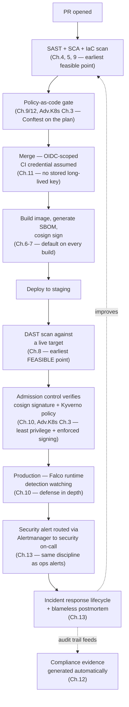

# Chapter 14 — Best Practices

## Learning Objectives

By the end of this chapter, you will be able to:

- Apply a synthesis DevSecOps best-practices checklist spanning Chapters 1–13 of this course
- Decide, for any given control, the earliest point at which it's actually feasible to run it — rather than assuming "leftmost possible" is always correct
- Recognize least privilege, dynamic credentials, and policy-as-code as one recurring principle applied consistently across every tool in this course, not a series of unrelated tool-specific rules
- Build compliance evidence and security culture as automatic byproducts of good technical practice, not separate scrambles bolted on afterward

---

## Prerequisites for This Chapter

- Introduction to DevSecOps and shift-left security — Chapter 1
- Threat modeling — Chapter 2
- Secrets management — Chapter 3
- SAST and static analysis — Chapter 4
- Dependency scanning and SCA — Chapter 5
- Container and image security — Chapter 6
- Software supply chain security — Chapter 7
- DAST and runtime security testing — Chapter 8
- Infrastructure as Code security — Chapter 9
- Kubernetes security deep dive — Chapter 10
- CI/CD pipeline security — Chapter 11
- Compliance and governance — Chapter 12
- Security monitoring and incident response — Chapter 13
- Advanced Kubernetes, Chapters 2, 3, and 10 (RBAC, admission control, backup/DR)
- Monitoring & Logging, Chapter 7 (Alerting and Alertmanager)

This chapter assumes you've read all of the above — it doesn't reteach any of them, it tells you what to actually *do* with them across a real production DevSecOps program.

---

## Shift Left, But Match Each Control to the Earliest *Feasible* Point — Not the Earliest Possible One

Chapter 1 introduced shift-left security as this course's central thesis, and it's tempting to over-apply it as a blanket rule: "the earlier a check runs, the better, full stop." That's not quite right, and treating it as universally true has a real cost.

Some controls genuinely belong as early as physically possible: SAST (Chapter 4), SCA (Chapter 5), and IaC scanning (Chapter 9) can all run on every single pull request, before a single line of the change has been merged, because all three analyze source code or configuration statically — they need nothing running, nothing deployed, nothing live. Running them at PR time is strictly better than running them later, because a developer fixing a flagged issue in their own branch, minutes after writing it, is dramatically cheaper than the same fix after merge, after deploy, or after a security team flags it weeks later.

DAST (Chapter 8) is structurally different: it needs a running application to attack. It cannot execute meaningfully "on every PR" the way SAST can, because there's nothing live yet to point it at. The earliest *feasible* point for DAST is against a deployed, running environment — a staging or ephemeral preview environment, ideally as automated as your PR-time SAST checks, but necessarily later in the pipeline than static analysis by simple physical necessity, not by choice or laziness.

```yaml
# A single CI pipeline, each check placed at the earliest point it's
# actually capable of running — not all crammed as early as possible
# regardless of whether that's physically meaningful
stages:
  - name: pr-checks              # runs on every PR, no deployment needed
    jobs: [sast, sca, iac-scan]
  - name: build-and-sign          # Ch.6, Ch.7 — image build, SBOM, cosign sign
    jobs: [build, sbom-generate, image-scan, cosign-sign]
  - name: deploy-to-staging
    jobs: [deploy]
  - name: dast                    # only feasible now — a live target exists
    jobs: [zap-baseline-scan]
```

The lesson: shift each control as far left as *that specific control's own requirements* allow, and stop congratulating yourself for shifting everything to the absolute leftmost point regardless of whether doing so is even mechanically meaningful. A DAST scan forced artificially early against a non-running application isn't "more shift-left," it's a scan that can't find anything, providing zero real coverage while creating the appearance of thoroughness.

---

## Threat Model Incrementally, Not as an Annual Ritual

Chapter 2 taught STRIDE and attack-surface analysis as tools for thinking systematically about what could go wrong. The best-practice discipline for *using* those tools in a real organization is frequency, not depth of any one session: threat model a system's specific new attack surface every time the architecture meaningfully changes — a new external-facing endpoint, a new trust boundary crossed (a new third-party integration, a new data store holding sensitive data), a new authentication mechanism — rather than scheduling one exhaustive annual threat-modeling day that nobody has time to properly prepare for and that's stale again within weeks of being completed.

A 30-minute, narrowly-scoped threat-modeling conversation the week a team adds a new webhook receiver, focused only on that new surface, catches far more real risk than a comprehensive annual review of the entire system that's too broad for anyone to engage with deeply and too infrequent to reflect what's actually been built since the last one. Treat threat modeling as a recurring step triggered by architectural change — the same way a code review is triggered by a pull request — not a calendar event.

---

## Prefer Dynamic, Short-Lived Credentials Everywhere — The Single Thread Through Chapters 3 and 11

If this course has one idea worth remembering above all others about credentials, it's this: **a credential that doesn't exist for long can't be stolen and used for long.** Chapter 3 built this principle for application and infrastructure secrets — Vault dynamic secrets that are generated on demand and expire automatically, rather than a static database password that's valid, unchanged, for years. Chapter 11 built the identical principle for CI/CD pipeline credentials — OIDC federation that issues a cloud credential valid for the duration of a single pipeline run, rather than a long-lived cloud access key sitting in a CI secret store indefinitely.

```yaml
# CI credential via OIDC — short-lived, scoped to this one job run,
# never stored anywhere (Chapter 11)
- name: Assume deploy role via OIDC
  uses: aws-actions/configure-aws-credentials@v4
  with:
    role-to-assume: arn:aws:iam::123456789012:role/ci-deploy-role
    aws-region: us-east-1
    # no access key or secret stored anywhere — a token is minted
    # for this run only and expires when the job ends
```

```hcl
# Application database credential via Vault dynamic secrets —
# generated on demand, expires automatically (Chapter 3)
resource "vault_database_secret_backend_role" "app_role" {
  backend             = "database"
  name                = "checkout-api"
  db_name             = "production-postgres"
  creation_statements = ["CREATE ROLE \"{{name}}\" ... VALID UNTIL '{{expiration}}';"]
  default_ttl         = 3600   # a new, unique credential every hour
}
```

Whether it's a database password, a cloud IAM credential, or a registry push token, the question to ask is the same one, every time: does this credential need to exist for longer than the single operation it's used for? If the answer is no — and it almost always is — prefer the dynamic, short-lived pattern by default, and treat any remaining static, long-lived credential as a deliberate, justified exception rather than the normal case.

---

## Curate Security Tool Rule Sets Deliberately — Start Narrow, Expand Over Time

Chapter 4 taught this for SAST specifically, and Monitoring & Logging Chapter 7 taught the identical lesson for operational alerting: a tool that fires constantly on low-confidence findings trains its intended audience to ignore it, and once that trust is gone, the one genuine finding buried in the noise gets ignored right along with everything else.

The fix, in both domains, is the same: enable a small, high-confidence rule set first — the checks with a very low false-positive rate and a clear, unambiguous fix — and expand deliberately over time as the team builds trust in the tool's output, rather than turning on every available rule on day one because more coverage sounds strictly better.

```yaml
# Semgrep — start with a narrow, high-confidence, security-focused
# rule set; resist enabling the full community ruleset immediately
rules:
  - p/security-audit      # curated, high-signal
  - p/secrets              # curated, high-signal
# NOT: p/default (thousands of rules, many stylistic, high noise
# for a team's first weeks with the tool)
```

The parallel to Monitoring Chapter 7's alert-fatigue discipline is exact enough to state as one shared rule across both domains: **new detection surface — whether an alerting rule or a SAST ruleset — earns broader scope only after it has demonstrated it doesn't waste the humans downstream of it.**

---

## Maintain an SBOM and Sign Artifacts as a Default Build Step, Not a Special Initiative

Chapters 6 and 7 covered SBOM generation and artifact signing with cosign. The best-practice posture: every build produces an SBOM and a signature automatically, as an unremarkable, invisible part of the pipeline — not a special "supply chain security initiative" project that a subset of critical services opts into someday.

```yaml
build-and-sign:
  steps:
    - run: docker build -t $IMAGE:$TAG .
    - run: syft $IMAGE:$TAG -o spdx-json > sbom.spdx.json    # every build, no exceptions
    - run: cosign sign --key cosign.key $IMAGE:$TAG            # every build, no exceptions
    - run: cosign attach sbom --sbom sbom.spdx.json $IMAGE:$TAG
```

An SBOM generated for three "important" services and skipped for the other forty is worse than useless the day a new critical CVE is disclosed and someone needs to answer "which of our services are affected" across the whole fleet — the answer is only trustworthy if every service actually has one. Make it a pipeline template default that every service inherits, not an opt-in checkbox.

---

## Enforce Policy as Code at Every Layer It Applies

Chapters 3, 9, and 12 (plus Advanced Kubernetes Chapter 3) each introduced OPA/Kyverno/Conftest enforcing rules at a specific layer — Kubernetes admission, Terraform plans, generalized compliance rules. The unifying best practice is recognizing these as one discipline, applied consistently at every layer where a rule matters, rather than three separate tool integrations that happen to share a similar-sounding name.

```rego
# Conftest / OPA policy applied to a Terraform plan (Chapter 9) —
# structurally identical in spirit to a Kyverno admission rule (Adv. K8s Ch.3)
package terraform.security

deny[msg] {
  resource := input.resource_changes[_]
  resource.type == "aws_s3_bucket"
  resource.change.after.acl == "public-read"
  msg := sprintf("S3 bucket %s must not be publicly readable", [resource.address])
}
```

```yaml
# Kyverno ClusterPolicy — the same "reject if a bad pattern exists"
# logic, at the Kubernetes admission layer instead of the Terraform plan layer
apiVersion: kyverno.io/v1
kind: ClusterPolicy
metadata:
  name: disallow-privileged
spec:
  validationFailureAction: Enforce
  rules:
    - name: no-privileged-containers
      match:
        any:
          - resources: { kinds: ["Pod"] }
      validate:
        message: "Privileged containers are not permitted"
        pattern:
          spec:
            containers:
              - securityContext: { privileged: "false" }
```

The point isn't that Rego and a Kyverno pattern look alike syntactically — it's that both replace a wiki checklist item a reviewer might forget with an automated gate that can't be skipped. Wherever a rule genuinely matters, ask "can this be enforced as code at the layer it applies" before falling back to a manual review step or a documentation page nobody re-reads under deadline pressure.

---

## Least Privilege Is One Principle, Not a Pile of Tool-Specific Rules

RBAC scoping (Advanced Kubernetes Chapter 2), Vault policy scoping (Chapter 3), CI/CD credential scoping (Chapter 11), and cloud IAM scoping (Chapter 10, Cloud Fundamentals Chapter 2) are, underneath their different syntaxes, the exact same idea applied four times: **grant the minimum access required to do the specific job, for the minimum time necessary, and nothing more "to avoid future permission headaches."**

```yaml
# Kubernetes RBAC — least privilege at the cluster layer
rules:
  - apiGroups: ["apps"]
    resources: ["deployments"]
    verbs: ["get", "list", "watch", "update"]   # not "*"
```

```hcl
# Vault policy — the same principle at the secrets layer
path "database/creds/checkout-api-readonly" {
  capabilities = ["read"]    # not "database/creds/*"
}
```

Treat "least privilege" as a single design review question you ask of every access grant, in every system, rather than four separately-remembered tool checklists: *what is the smallest set of permissions, for the shortest time, that lets this identity do exactly its job — and nothing else?* An engineer fluent in that one question applies it correctly whether they're writing a Kubernetes Role, a Vault policy, a GitHub Actions OIDC trust policy, or an IAM policy document, without needing four separate mental models.

---

## Route Security Signals Through the Same Alerting Discipline as Operational Signals

Chapter 13 built this explicitly on Monitoring & Logging Chapter 7's Alertmanager framework: grouped, routed to the right on-call, and held to the same actionability standard as any operational alert. The best-practice restatement here is organizational as much as technical — a security tool that produces findings nobody sees promptly, sitting in a separate dashboard a separate team checks on its own schedule, is functionally a siloed, ignored tool, no matter how sophisticated its detection logic is.

Wire Falco, critical SCA/image-scan findings, and DAST results into the *same* alerting infrastructure that pages engineering teams for operational incidents — a dedicated security on-call receiver within the same Alertmanager routing tree, not a parallel universe of security notifications nobody outside a security team ever sees.

---

## Rehearse Incident Response and Disaster Recovery Before You Need Them

Chapter 13's tabletop exercises and Advanced Kubernetes Chapter 10's DR game days are the same underlying discipline, applied to two different flavors of disaster: rehearse the response *before* the real event, in a low-stakes setting, so gaps in the runbook are found by a scheduled drill rather than by a live incident. Put both on the same recurring operational calendar — quarterly is a reasonable minimum for either — rather than treating one or both as a one-time setup task that's considered "done" after the first run.

---

## Build Compliance Evidence as an Automatic Byproduct of Good Technical Controls

Chapter 12 covered mapping technical controls to compliance frameworks (SOC 2, PCI-DSS, CIS Benchmarks). The best-practice posture: if your RBAC is genuinely least-privilege, your audit logging is genuinely running and reviewed, and your policy-as-code gates are genuinely enforcing (not just documented), the *evidence* an auditor asks for — access review records, audit log samples, policy enforcement logs — already exists as a natural side effect of those controls actually working, rather than needing a separate, dedicated evidence-gathering scramble in the weeks before an audit.

An organization that scrambles to manually assemble screenshots and spreadsheets before every audit cycle is, in effect, admitting its technical controls don't generate their own proof of existing — which is a strong signal the controls themselves may be weaker or less consistently applied than the compliance narrative claims. Automate evidence collection (exporting `kubectl auth can-i` results, Vault access logs, CI policy-gate pass/fail history) on the same schedule the controls themselves run, so "producing an audit trail" and "operating the control" are the same action, not two separate ones.

---

## Security Is a Shared, Cultural Responsibility — The Capstone Principle

Every practice in this chapter, and every chapter in this course, ultimately serves one thesis, stated plainly back in Chapter 1: **security works best as something built into everyone's normal workflow, not as a separate team's gate applied at the end.** A developer who sees a SAST finding directly inline in their own pull request, with a clear explanation and a suggested fix, engages with it as a normal part of writing code. The same finding, discovered weeks later in a separate security team's report delivered as a list of ticket numbers with no context, is received as an external imposition — slower to fix, more likely to be deprioritized, and more likely to breed resentment toward "the security team" as an obstacle rather than a colleague.

Blameless postmortems (Chapter 13) are this same thesis applied to incidents: security improves fastest when engineers feel safe reporting their own mistakes immediately, not when a separate team polices errors after the fact. A platform where policy-as-code (this chapter, above) makes the secure path the *easy* path, rather than a compliance obstacle bolted onto the workflow, is this same thesis applied to tooling. If you remember exactly one idea from this entire course, make it this one: DevSecOps succeeds when security is everyone's normal job, in the tools they already use, not a separate department's final checkpoint.

---

## Continuously Reassess — Nothing in This Chapter Is a One-Time Setup Task

The threat landscape changes (new CVE classes, new attack techniques). Your dependency tree changes on every single build. Compliance requirements change as regulations evolve and as your business enters new markets or handles new categories of data. Every practice in this chapter — threat modeling, dependency scanning, IaC policy rules, RBAC scoping, SBOM currency, compliance mappings — is a standing, recurring practice, not a project with a defined end date.

- Re-scan dependencies continuously, not just at release time (Chapter 5, Chapter 7) — a dependency that was clean yesterday can have a new CVE disclosed against it today, with zero code change on your side.
- Re-threat-model incrementally as architecture evolves (this chapter, above), not on a fixed annual calendar disconnected from what's actually changed.
- Review policy-as-code rules and compliance mappings periodically, because both a stale rule that no longer matches a changed architecture and a stale compliance mapping that no longer matches an updated control are silent gaps until something forces a look.

The organizations that stay genuinely secure over years are not the ones that completed a thorough security setup once — they're the ones that built the habit of continuously checking whether yesterday's setup still matches today's reality.

---

## Tie It Together: One Pipeline Where Every Practice in This Course Appears at Once

It's worth seeing, in one place, what a pipeline looks like when every practice above is actually applied together, rather than as a list of disconnected ideas. This is not a new concept — it's the same pipeline sketched in this chapter's first section, now annotated with which course chapter and which best practice each stage embodies:



Every arrow in this diagram is a decision this chapter argued for explicitly: static checks as early as they can meaningfully run, policy enforced as code rather than left to review, credentials that are short-lived by default, signing paired with enforced verification rather than signing alone, DAST placed at the point it actually becomes feasible rather than forced earlier than it can work, runtime detection as a backstop for everything upstream that might still fail, and security alerts and incidents handled with the same rigor as operational ones — with the whole loop feeding back into itself as the organization learns from what it finds. No single practice in this diagram is sufficient on its own; the whole point of a capstone chapter is that the combination, applied consistently, is what actually produces a resilient posture.

---

## Summary

Match each shift-left control to the earliest point it's actually feasible to run, not the earliest conceivable point regardless of mechanics (Ch. 1, 4, 8, 9). Threat model incrementally as architecture changes, not annually (Ch. 2). Prefer dynamic, short-lived credentials everywhere — Vault dynamic secrets and CI OIDC are the same idea (Ch. 3, 11). Curate security tool rule sets narrowly and expand deliberately, exactly like Monitoring's alert-fatigue discipline (Ch. 4, 13). Generate SBOMs and sign artifacts as an invisible default on every build (Ch. 6–7). Enforce policy as code at every layer — Kubernetes admission, Terraform plans, compliance rules (Ch. 3, 9, 12; Adv. K8s Ch. 3). Treat least privilege as one principle applied consistently across RBAC, Vault, CI credentials, and IAM (Ch. 2, 3, 10, 11; Adv. K8s Ch. 2). Route security alerts through the same grouped, routed, actionable discipline as operational alerts (Ch. 13; Monitoring Ch. 7). Rehearse incident response and DR before you need them (Ch. 13; Adv. K8s Ch. 10). Build compliance evidence as an automatic byproduct of controls that actually work, not a pre-audit scramble (Ch. 12). Treat security as everyone's shared, cultural responsibility — the DevSecOps thesis, restated as this course's capstone principle. Reassess continuously: the threat landscape, dependency tree, and compliance requirements all change, and every practice above is ongoing, never a one-time setup task.

---

## Knowledge Check

1. Explain why forcing a DAST scan to run on every pull request, before any deployment exists, would not actually be "more shift-left" in any meaningful sense.
2. What single underlying property do Vault dynamic secrets (Chapter 3) and CI/CD OIDC federation (Chapter 11) share, and why does that property matter for limiting damage from a leaked credential?
3. Explain the parallel between curating a SAST tool's initial ruleset (Chapter 4) and Monitoring & Logging Chapter 7's alert-fatigue discipline. Why is the same underlying lesson true in both domains?
4. Give three different tools or layers where "least privilege" applies, and explain why they're really one design principle rather than three separate rules to memorize.
5. Why does an organization that scrambles to manually assemble compliance evidence before every audit reveal something concerning about its actual technical controls?
6. Restate this course's capstone thesis about security and culture in your own words, and give one concrete example (from this chapter or the course generally) of a practice that embodies it.

---

## Hands-On Exercise

1. Pick one service in a project you control (or a sample application). Classify every security check you'd want on it — SAST, SCA, IaC scan, DAST, image scan — by the earliest pipeline stage each one is actually capable of running at, and sketch the resulting pipeline stage order.
2. Find one static, long-lived credential in a pipeline or application you control (a stored cloud access key, a hardcoded database password, a long-lived API token) and design its replacement using either OIDC federation (Chapter 11) or a Vault/cloud-secrets-manager dynamic credential (Chapter 3).
3. Write a narrow, high-confidence starter ruleset for a SAST or IaC scanning tool of your choice (aim for under 10 rules), and justify why each one earns a place in the "starter" set rather than being deferred to a later expansion.
4. Write one OPA/Conftest policy and one Kyverno policy that enforce conceptually the same underlying rule (for example, "no public storage buckets" at the Terraform-plan layer and "no hostNetwork Pods" at the Kubernetes admission layer) and explain in your own words why they represent the same design discipline despite the different syntax.
5. Design a compliance-evidence-collection step that runs automatically alongside an existing control you already have (e.g., exporting Vault audit logs, or `kubectl auth can-i --list` output) on a recurring schedule, rather than manually gathered before an audit.

---

## Further Reading

- [OWASP DevSecOps Guideline](https://owasp.org/www-project-devsecops-guideline/)
- [NIST SP 800-218 — Secure Software Development Framework (SSDF)](https://csrc.nist.gov/pubs/sp/800/218/final)
- [HashiCorp — Dynamic Secrets Documentation](https://developer.hashicorp.com/vault/docs/secrets)
- [OpenSSF — Supply Chain Levels for Software Artifacts (SLSA)](https://slsa.dev/)
- [Open Policy Agent Documentation](https://www.openpolicyagent.org/docs/latest/)
- [Google SRE Workbook — Postmortem Culture](https://sre.google/sre-book/postmortem-culture/)

---

<div style="display:flex;justify-content:space-between;align-items:center;">
  <a href="./13-security-monitoring-and-incident-response.md">← Previous: Security Monitoring and Incident Response</a>
  <a href="./00-index.md">🏠 Index</a>
  <a href="./15-common-mistakes.md">Next: Common Mistakes and Pitfalls →</a>
</div>
