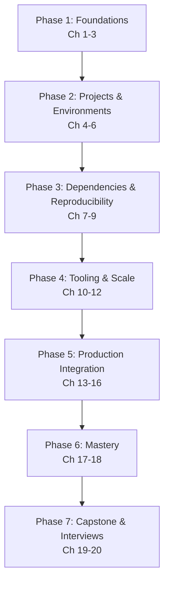

# uv — The Complete Python Package & Project Manager Course

> From "what problem does uv actually solve?" to managing Python versions, dependencies, lock files, workspaces, Docker builds, and CI/CD with a single, fast, standards-based tool — a structured, professional learning path.

---

## Course Overview

**uv** is a Python package and project manager built in Rust by Astral (the makers of Ruff). It is designed to be a single, fast replacement for a whole cluster of tools Python developers have historically had to stitch together by hand: `pip` for installing packages, `virtualenv` for isolating environments, `pip-tools` for locking dependencies, `pyenv` for managing Python versions, and `pipx` for running CLI tools in isolation — plus much of what `Poetry` does for project and build management. For any modern Python stack — FastAPI, SQLAlchemy 2.0, Alembic, Docker, and AI frameworks like LangChain/LangGraph — uv is rapidly becoming the default choice, because it collapses that entire toolchain into one binary with a proper dependency resolver and a shared, content-addressable cache that makes repeated installs across projects nearly instant.

This course takes you from absolute beginner to professional, covering:

- What problem uv actually solves, and exactly which older tools it replaces and why
- uv's internal architecture: its PubGrub-based resolver, its global cache, and how it manages Python interpreters without `pyenv`
- The full day-to-day workflow: creating projects, managing virtual environments, adding/removing dependencies, and running code with `uv run`
- Lock files and reproducibility — the difference between resolving, locking, and syncing, and why that distinction is the difference between "works on my machine" and a reliable team workflow
- Development dependencies vs. global tools (`uv tool`/`uvx`), and workspaces for monorepos with multiple internal packages
- **Production integration**: Dockerizing a uv-managed project correctly, wiring uv into CI/CD, and publishing packages
- Best practices, common failure modes, capstone projects, and interview preparation

Every chapter builds on the last, and every chapter is grounded in one running example: **ExpenseFlow**, the same FastAPI + SQLAlchemy 2.0 + Alembic + PostgreSQL expense-tracking API used in this repo's [Alembic course](../../Databases/alembic-course/00-index.md) — except here, the lens is the tooling underneath it: how the project is initialized, how its dependencies are declared and locked, how it's containerized, and how it ships through CI, rather than its database schema. If you've taken the Alembic course, you'll recognize the project (and its engineers, Priya and Marcus) immediately; if you haven't, nothing here depends on it — this course is self-contained.

This course deliberately spends real time on *why* uv is architected the way it is (Chapters 2–3) before touching day-to-day commands, because the commands are easy to copy from a cheatsheet and easy to misuse without the underlying model — you cannot reason about a broken Docker build or a CI-only dependency conflict by pattern-matching a command you copied once.

---

## Who This Course Is For

You should be comfortable with:

- **Command line basics** — running a shell, navigating directories, editing text files
- **Basic Python literacy** — what a package/module/import is, having run a Python script before
- **General familiarity with the idea of a "virtual environment"** — even a vague sense of "Python projects need isolated dependencies" is enough; this course explains the rest from scratch

You do **not** need prior experience with `pip`, `virtualenv`, `pyenv`, `pipx`, or `Poetry`. If you've used any of them before, this course calls out the direct parallel every time uv replaces something they did — that experience will make several chapters land faster, but it is never required. If you've taken this repo's [Alembic course](../../Databases/alembic-course/00-index.md), you already know the ExpenseFlow project this course uses throughout; if not, everything you need is introduced here.

---

## Learning Roadmap

| Phase | Milestone | Chapters |
|---|---|---|
| 1. Foundations | Explain what uv replaces and why it's architected the way it is, from memory | 1–3 |
| 2. Projects & Environments | Manage Python versions and create/structure projects and virtual environments confidently | 4–6 |
| 3. Dependencies & Reproducibility | Add/remove dependencies correctly, and explain the lock/sync/run distinction precisely | 7–9 |
| 4. Tooling & Scale | Distinguish project dependencies from global tools, and structure a multi-package workspace | 10–12 |
| 5. Production Integration | Wire uv into a real FastAPI+SQLAlchemy+Alembic project, Docker, CI/CD, and package publishing | 13–16 |
| 6. Mastery | Apply best practices and recognize known failure modes fluently | 17–18 |
| 7. Capstone & Interviews | Ship a production-grade capstone and pass a tooling-focused interview | 19–20 |

---

## Estimated Learning Timeline (1–2 Weeks)

**Days 1–3 — Foundations & Projects** (Ch 1–6): understand what uv replaces and why, install it, manage Python versions, create ExpenseFlow with `uv init`, and understand its virtual environment model.
*Project: ExpenseFlow scaffolded from scratch with a pinned Python version.*

**Days 4–6 — Dependencies & Reproducibility** (Ch 7–9): add ExpenseFlow's real dependencies, understand `uv.lock` and why `--locked`/`--frozen` matter, and run code (including a standalone PEP 723 script) with `uv run`.
*Project: ExpenseFlow's full dependency set, locked and reproducible across machines.*

**Days 7–9 — Tooling & Scale** (Ch 10–12): manage dev dependencies and global tools correctly, and split ExpenseFlow into a `packages/api` + `packages/shared` workspace.
*Project: a two-member uv workspace sharing one lockfile.*

**Days 10–14 — Production Integration & Mastery** (Ch 13–18): wire together FastAPI/SQLAlchemy/Alembic through uv, Dockerize ExpenseFlow correctly, wire up CI/CD, publish a package, then consolidate best practices and pitfalls.
*Project: a Dockerized, CI/CD-gated ExpenseFlow with a published internal shared package.*

**Ongoing — Capstone & Interviews** (Ch 19–20): capstone projects across all levels, and interview preparation.

If you can commit ~1 hour/day, 1–2 weeks is realistic for professional proficiency — uv's day-to-day surface area is smaller than a database migration tool's, but the production-integration chapters (13–16) reward slowing down.

---

## Prerequisites

See [Chapter 1](./01-introduction-and-prerequisites.md) for a full self-assessment, covering:

- **Command line comfort**: running a shell, editing files, basic navigation
- **Basic Python literacy**: packages, modules, imports, running a script
- **Optional but helpful**: prior experience with `pip`, `virtualenv`, `pyenv`, `pipx`, or `Poetry`

---

## Complete Chapter Index

| # | Chapter | What You'll Learn |
|---|---|---|
| 01 | [Introduction & Prerequisites](./01-introduction-and-prerequisites.md) | What uv replaces and why, self-assessment, installing uv |
| 02 | [Core Concepts](./02-core-concepts.md) | Packaging terminology, the standards uv builds on (PEP 621/508/723), the general workflow |
| 03 | [Architecture & Internals](./03-architecture-and-internals.md) | The resolver, the global cache, Python interpreter management, uv vs. pip+virtualenv |
| 04 | [Python Version Management](./04-python-version-management.md) | `uv python install/list/pin/find`, `.python-version`, replacing pyenv |
| 05 | [Project Creation & Structure](./05-project-creation-and-structure.md) | `uv init`, `pyproject.toml` anatomy, `src/` layout, project types |
| 06 | [Virtual Environments](./06-virtual-environments.md) | `uv venv`, `.venv`, automatic environment discovery, `uv run` vs. activation |
| 07 | [Dependency Management](./07-dependency-management.md) | `uv add`/`uv remove`, version specifiers, dependency groups, extras |
| 08 | [Lock Files & Reproducibility](./08-lock-files-and-reproducibility.md) | `uv.lock`, `uv lock` vs. `uv sync`, `--frozen`/`--locked` |
| 09 | [Running Code with `uv run`](./09-running-code-with-uv-run.md) | `uv run` mechanics, PEP 723 inline scripts, `uv run --with` |
| 10 | [Development Dependencies & Tooling](./10-development-dependencies-and-tooling.md) | Dev dependency groups, pytest/ruff/mypy/pre-commit |
| 11 | [Tool Management & `uvx`](./11-tool-management-uvx.md) | `uv tool install`, `uvx`, project dependency vs. global tool |
| 12 | [Workspaces & Monorepos](./12-workspaces-and-monorepos.md) | `[tool.uv.workspace]`, path dependencies, splitting ExpenseFlow into packages |
| 13 | [Integrating FastAPI, SQLAlchemy & Alembic](./13-fastapi-sqlalchemy-alembic-integration.md) | The full day-to-day dev loop through `uv run` |
| 14 | [Docker Integration](./14-docker-integration.md) | Multi-stage Dockerfiles, layer caching, `uv sync --frozen --no-dev` |
| 15 | [CI/CD Integration](./15-cicd-integration.md) | `astral-sh/setup-uv`, caching, matrix testing, migration-drift checks |
| 16 | [Publishing Packages](./16-publishing-packages.md) | `uv build`, `uv publish`, trusted publishing, semantic versioning |
| 17 | [Best Practices](./17-best-practices.md) | Consolidated professional checklist across the whole stack |
| 18 | [Common Mistakes & Pitfalls](./18-common-mistakes-and-pitfalls.md) | Failure modes and how to avoid them |
| 19 | [Capstone Projects](./19-capstone-projects.md) | Beginner → production-grade project specs and architecture |
| 20 | [Interview Preparation](./20-interview-preparation.md) | Q&A, scenario-based questions, system design, troubleshooting |

---

## Milestones Checklist

- [ ] Explain what uv replaces and why its resolver/cache architecture makes it faster and more correct than pip+virtualenv
- [ ] Install and pin a specific Python version for a project without pyenv
- [ ] Create a new project with `uv init`, and explain every section of the generated `pyproject.toml`
- [ ] Explain why `uv run` removes the "did you activate your venv" class of bug
- [ ] Add, remove, and correctly scope dependencies (runtime, dev, optional/extras) for a real project
- [ ] Explain the precise difference between `uv lock`, `uv sync`, and `uv run`, and when to use `--frozen` vs. `--locked`
- [ ] Run a standalone PEP 723 script with its own dependencies, isolated from any project
- [ ] Correctly decide whether a tool belongs in a project's dev dependencies or as a global `uv tool` install
- [ ] Structure a multi-package workspace with a shared internal library
- [ ] Write a production-correct, layer-cached multi-stage Dockerfile for a uv-managed project
- [ ] Wire uv into a CI/CD pipeline with proper caching and lockfile enforcement
- [ ] Publish a package with `uv build`/`uv publish`
- [ ] Complete a production-grade capstone project
- [ ] Answer all interview questions in Chapter 20 confidently

---

## Recommended Resources

**Official docs**: [uv Documentation](https://docs.astral.sh/uv/) (the Concepts and Guides sections are the pages you'll return to most), [uv CLI Reference](https://docs.astral.sh/uv/reference/).

**Tools**: the `uv` CLI itself, `uvx` (`uv tool run`), `astral-sh/setup-uv` for GitHub Actions.

**Standards**: [PEP 621](https://peps.python.org/pep-0621/) (`pyproject.toml` metadata), [PEP 723](https://peps.python.org/pep-0723/) (inline script metadata), the [Python Packaging User Guide](https://packaging.python.org/).

**Interactive practice**: every chapter's exercises are designed to run against a local ExpenseFlow checkout — no cloud account required until Chapter 16's publishing exercise.

**Related courses**: [Alembic & Database Schema Migrations](../../Databases/alembic-course/00-index.md), for the ExpenseFlow schema/migration side this course's dependency chapters build on top of.

Good luck. Start with **01-introduction-and-prerequisites.md**.

---

  
  <a href="./00-index.md">🏠 Index</a>
  <a href="./01-introduction-and-prerequisites.md">Next: Introduction & Prerequisites →</a>

