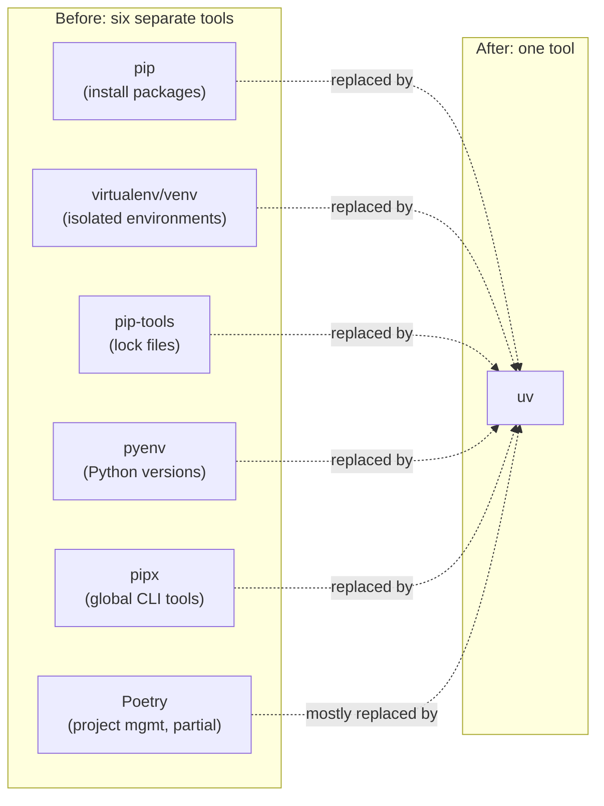
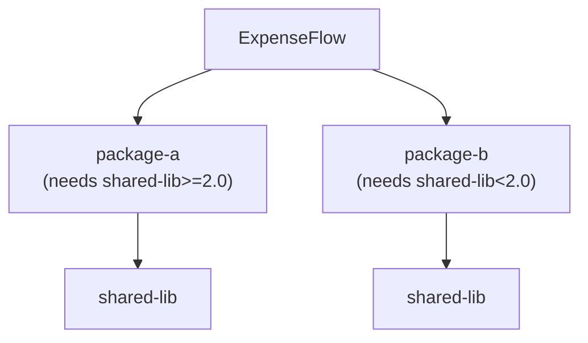
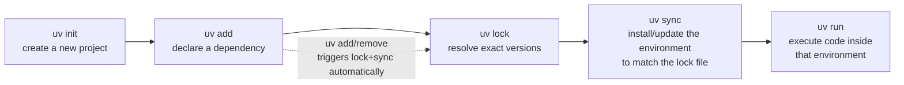

# Introduction & Prerequisites

The [course index](./00-index.md) framed uv as a single, fast, Rust-based tool that collapses a whole cluster of Python tooling — `pip`, `virtualenv`, `pip-tools`, `pyenv`, `pipx`, and much of `Poetry` — into one binary. This chapter makes that claim concrete before you install anything. We'll meet Priya and Marcus, two engineers about to start a new FastAPI service called ExpenseFlow, and follow the exact decision they face on day one: which tools do they reach for to manage Python versions, dependencies, and environments? Understanding *why* their answer is "just uv" — rather than the five-tool stack their previous project used — is the goal of this chapter. By the end, you'll have uv installed, verified, and a mental map of the ground it covers, ready for [Chapter 2: Core Concepts](./02-core-concepts.md) to build the vocabulary you'll use for the rest of the course.

---

## Learning Objectives

By the end of this chapter, you will be able to:

- Explain what uv is, who builds it, and what category of tool it belongs to.
- Name the older tools uv replaces (`pip`, `virtualenv`, `pip-tools`, `pyenv`, `pipx`, and largely `Poetry`) and state what each one did on its own.
- Articulate uv's two core design motivations — performance (a Rust resolver plus a shared global cache) and correctness (a real dependency-resolution algorithm) — with a concrete example of each.
- Assess your own readiness for this course using the self-assessment checklist, and identify any gaps worth closing first.
- Install uv using the official standalone installer, and explain why this differs from installing it with `pip install uv`.
- Verify a uv installation and locate uv's version, install location, and shell completion setup.
- Describe, at a preview level, the create → add → lock → sync → run workflow you'll practice for the rest of the course.

---

## Prerequisites for This Chapter

This is the first chapter, so there is no prior course material to reference. What this chapter does assume, and checks explicitly in Section 4:

- Basic comfort operating a command-line shell (running commands, reading output, navigating directories).
- A rough sense of what a Python "package" is (something you `import`) and that Python code often depends on other packages.
- No prior experience with `pip`, `virtualenv`, `pyenv`, `pipx`, or `Poetry` is required — if you have it, this chapter will repeatedly connect uv's behavior back to whichever of those tools you already know.

If any of that feels shaky, Section 4 points you to lightweight ways to shore it up before continuing.

---

## 1. What Is uv?

**uv** is a Python package and project manager, built in Rust, developed and maintained by [Astral](https://astral.sh) — the same company behind [Ruff](https://docs.astral.sh/ruff/), the fast Python linter/formatter that has itself displaced `flake8`, `isort`, and much of `black` in a large share of Python projects over the last few years. uv is Astral's second act at the same strategy: take a slow, fragmented part of the Python tooling ecosystem, and replace it with one fast, correct, single binary.

Concretely, uv is a command-line tool (`uv`) that handles, under one roof:

- **Installing and managing Python interpreters themselves** — you can ask uv for Python 3.13 and it will fetch and manage a prebuilt interpreter for you, without touching whatever Python your operating system shipped with.
- **Creating and managing virtual environments** — the isolated, per-project directories that keep one project's installed packages from colliding with another's.
- **Resolving and installing dependencies** — reading a project's declared dependencies, figuring out an exact, consistent set of versions that satisfy them all (including *their* dependencies, and *their* dependencies' dependencies), and installing that set.
- **Locking dependency resolutions** — writing that exact resolved version set to a file (`uv.lock`) so every machine that installs the project gets identical versions, not just "versions matching the same constraints."
- **Running code inside the right environment** — `uv run` executes a command after first making sure the environment matches what's locked, so you never have to remember to activate anything.
- **Installing and running standalone CLI tools** — the `pipx`-style use case of "I want `httpie` or `cookiecutter` available everywhere on my machine, not tied to one project."
- **Building and publishing packages** — producing distributable wheels/sdists and pushing them to a package index, a `Poetry`-style capability.

That is a wide surface area for one tool, and that width is the point: it used to take five or six separate tools, each with its own configuration format, its own mental model, and its own edge cases, to cover the same ground. Chapter 3 goes under the hood of *how* uv does all of this so quickly and correctly; this chapter stays at the "what and why" level.

### 1.1 A first, tiny end-to-end example

Before any theory, here's what using uv actually looks like, end to end, for a brand-new project — not ExpenseFlow yet, just a minimal example to see the shape of the workflow:

```bash
$ uv init hello-uv
Initialized project `hello-uv` at `/home/priya/hello-uv`

$ cd hello-uv
$ uv add requests
Resolved 5 packages in 340ms
Prepared 5 packages in 1.2s
Installed 5 packages in 28ms
 + certifi==2024.8.30
 + charset-normalizer==3.4.0
 + idna==3.10
 + requests==2.32.3
 + urllib3==2.2.3

$ uv run python -c "import requests; print(requests.get('https://example.com').status_code)"
200
```

Four commands, no manually created virtual environment, no separately invoked `pip install`, no activation step — and yet the project ends up with a real `.venv`, a `pyproject.toml` describing its dependency on `requests`, and a `uv.lock` pinning the exact resolved versions of `requests` and everything it transitively needs. Every later chapter is, in one sense, just unpacking what happened in those four lines in far more depth. Section 7 previews the full workflow this example is a miniature of.

---

## 2. The Tool Landscape uv Replaces

To appreciate what uv collapses into one tool, it helps to name the tools a Python team commonly stitched together *before* uv existed — which is exactly the stack Priya and Marcus's previous project used, and the stack ExpenseFlow will deliberately avoid.

### 2.1 The pre-uv toolchain

| Tool | Job | Typical pain point | Replaced by which uv feature |
|---|---|---|---|
| `pip` | Install packages into whatever Python environment is currently active | No real lock file by default; its dependency resolver, while improved since 2020, is still comparatively slow and can produce different results run to run depending on install order | `uv pip install` (drop-in compatible interface) and, for projects, `uv add`/`uv sync` |
| `virtualenv` / `venv` | Create an isolated per-project Python environment | A separate manual step every project setup script has to remember to run, and a separate "did you forget to activate it?" class of bug | `uv venv`, and automatic environment discovery/creation via `uv run`/`uv sync` (Chapter 6) |
| `pip-tools` (`pip-compile`, `pip-sync`) | Bolt a real lock file (`requirements.txt` pinned with hashes) onto `pip`'s otherwise lock-free workflow | An extra tool, an extra command to remember to re-run, and still ultimately shells out to `pip` for the actual install | `uv lock` / `uv sync`, built in and automatic (Chapter 8) |
| `pyenv` | Install and switch between multiple Python *interpreter* versions on one machine | Works by compiling Python from source (slow) or downloading community-maintained builds, and manages *interpreters*, not dependencies — a completely separate tool from everything above | `uv python install`/`uv python pin`, using prebuilt `python-build-standalone` interpreters (Chapter 4) |
| `pipx` | Install a CLI tool (like `black`, `httpie`, `cookiecutter`) into its own isolated environment, runnable from anywhere | A fine tool on its own, but yet another separate mental model bolted onto the pile | `uv tool install` / `uvx` (Chapter 11) |
| `Poetry` | A more integrated attempt: project scaffolding, dependency resolution, lock files, and publishing in one tool | Popularized a lot of what uv now does, but predates and does not fully adopt several packaging standards (Section 2.2 of [Chapter 2](./02-core-concepts.md)), uses its own non-standard `[tool.poetry]` metadata section instead of the now-standard `[project]` table, and its resolver, while much better than plain `pip`, is noticeably slower than uv's on large dependency trees | `uv init`, `uv add`, `uv lock`, `uv build`, `uv publish` (Chapters 5, 7, 8, 16) |

A team running this full stack has, in practice, six tools' worth of installation instructions, six tools' worth of version upgrades to track, and six tools' worth of "which one do I run again?" for a new hire to learn — before writing a single line of application code.

### 2.2 What uv actually replaces, tool by tool



uv does not claim to replace *every* feature every one of these tools ever had (Poetry's plugin ecosystem, for instance, is broader than uv's), but for the day-to-day workflow of an application team — pick a Python version, create an environment, declare dependencies, lock them, install them, run code, occasionally publish a package — uv covers the same ground as all six, from one binary, with one configuration file format, and one command-line surface.

### 2.3 What uv is *not*

Two scoping clarifications worth making explicit up front, because they'll come up again in later chapters:

- **uv does not manage application runtime configuration.** Things like a `DATABASE_URL` environment variable, a `.env` file, or feature flags are entirely outside uv's job — that's `pydantic-settings`'s territory in ExpenseFlow's case (Chapter 13 makes this boundary explicit).
- **uv does not replace your database migration tool.** ExpenseFlow uses Alembic for schema migrations (see the sibling [Alembic course](../../Databases/alembic-course/00-index.md)) — uv's job is making sure `alembic` itself, and every other dependency ExpenseFlow needs, is installed correctly and consistently; it has no opinion about database schemas at all.

### 2.4 Is uv mature enough to bet a real project on?

A fair question for any team about to standardize on a comparatively young tool. A few concrete data points worth knowing, rather than taking on faith:

- **uv reached a stable 1.0 release** after roughly two years of rapid public development, with backward-compatibility guarantees for its stable CLI surface from that point forward — the same maturity bar Astral applied to Ruff before large organizations adopted it widely.
- **It is developed by the same team and company (Astral) behind Ruff**, which by this point is already relied on by a large share of the Python ecosystem's most active open-source projects and by companies running Python at significant scale — uv inherits both that engineering track record and a similar open-source, permissively licensed model.
- **It is used to build and test CPython-adjacent tooling itself** in parts of the packaging ecosystem, and `astral-sh/setup-uv` (Chapter 15) is an official, actively maintained GitHub Action, which is a reasonable proxy for how seriously CI/CD-focused teams have already adopted it.
- **Its file formats are standards-based, not proprietary** (Section 2 of [Chapter 2](./02-core-concepts.md)) — a `pyproject.toml` written by uv is still a valid, standard `pyproject.toml` any other PEP 621-aware tool can read, which materially lowers the risk of adopting uv: even in the worst case of needing to move away from it later, you are not migrating out of a proprietary format.

None of this guarantees uv is the right choice for every team forever, but it's enough that a professional team — like Priya and Marcus's — can reasonably choose it for a new project today without treating it as a risky experiment.

---

## 3. Why uv Was Created

uv wasn't built because the older tools were *broken* — millions of production Python applications ran, and still run, on `pip` + `virtualenv` + `pyenv` without catastrophic failure. It was built because that stack is slow and, in specific ways, not fully correct — and both of those problems have concrete, well-understood technical causes that a from-scratch Rust rewrite could address directly.

### 3.1 Performance: a Rust resolver plus a shared cache

Two design decisions account for the overwhelming majority of uv's speed advantage over the pip-based stack:

**A dependency resolver written in Rust, using an efficient algorithm.** Resolving dependencies — figuring out which exact version of every package (and every package those packages need) satisfies all the constraints in play — is computationally nontrivial for any real project with dozens of transitive dependencies. `pip`'s resolver, while much improved since its 2020 rewrite, is still a pure-Python implementation. uv's resolver is native Rust code using the PubGrub algorithm (previewed here, detailed in [Chapter 3](./03-architecture-and-internals.md)), which is both faster to execute per step and structurally better at avoiding wasted backtracking work.

**A global, content-addressable cache shared across every project on the machine.** This is, in practice, the larger everyday speed win. When `pip` installs `fastapi` into one project's virtual environment, and you later create a second, unrelated project that also needs `fastapi` at the same version, plain `pip` + `virtualenv` downloads and copies those files again — the two virtual environments know nothing about each other. uv instead keeps one shared cache of every package version it has ever installed on your machine, addressed by content hash, and *links* (via hardlinks or copy-on-write reflinks, filesystem permitting) that cached content into each new virtual environment instead of copying it. The second project's `uv add fastapi` becomes a near-instant filesystem operation instead of a network download and a full copy. Chapter 3 covers this cache's structure in depth; for now, the concrete payoff is what matters: repeated installs of already-seen packages, across any number of unrelated projects, are dramatically faster.

| | pip + virtualenv | uv |
|---|---|---|
| Resolver implementation | Pure Python | Native Rust |
| Package storage across projects | Copied independently into each venv | Global content-addressable cache, linked (not copied) into each venv |
| Typical "already cached" install of a mid-size dependency tree | Seconds to tens of seconds | Well under a second, often |
| Cold install (nothing cached yet) | Network + resolver bound | Network bound, but resolver overhead is much lower |

### 3.2 Correctness: a real resolution algorithm, not backtracking-and-hope

The second motivation is subtler and, for a professional team, arguably more important than raw speed: **getting the *same*, provably valid set of versions every time**, and getting a *useful* error message when no valid set exists.

Historically, `pip`'s resolver behavior (especially prior to its 2020 overhaul) worked by installing packages roughly in the order they were listed, backtracking only when it hit an outright conflict, which could mean that the *order* dependencies were listed in your requirements file could silently affect which final versions got installed — the same input, processed in a different order, could land on different results. uv's resolver instead uses a versioned constraint-satisfaction algorithm (PubGrub, the same family used by Dart's `pub` and conceptually similar to what Rust's own Cargo uses) that treats resolution as a proper constraint-satisfaction problem: gather every constraint from every package in the dependency graph, and find one assignment of versions that satisfies all of them simultaneously — deterministically, regardless of listing order — or determine, with a clear explanation of *which* constraints conflict, that no such assignment exists.

Concretely: if ExpenseFlow's dependencies required `package-a>=2.0` in one place and (transitively, through some other dependency) `package-a<2.0` somewhere else, a weaker resolver might install *some* version of `package-a` that happens to satisfy whichever constraint it checked last, silently leaving the other constraint violated — an inconsistency you might not discover until that specific code path runs in production. uv's resolver instead detects the conflict up front, before anything is installed, and reports it in a structured, readable way. [Chapter 3](./03-architecture-and-internals.md) walks through exactly how PubGrub does this; the point to internalize here is *why* it matters: correctness in dependency resolution is a reliability property, not just a convenience.

### 3.3 A concrete conflict, made visible

To make Section 3.2 less abstract, imagine ExpenseFlow (hypothetically, ahead of Chapter 7) depends on two packages that each pin a shared, common dependency incompatibly:



There is no single version of `shared-lib` that satisfies both `>=2.0` and `<2.0` at once — this is a genuine, unresolvable conflict, not a bug in either package. A resolver built on backtracking-and-hope might pick whichever constraint it evaluates first, install a `shared-lib` version that satisfies only that one, and leave the other dependency silently running against a version it was never tested with. uv's PubGrub-based resolver instead detects that the constraint set as a whole is unsatisfiable *before* installing anything, and reports the conflicting requirements directly — telling you `package-a` and `package-b` disagree about `shared-lib`, rather than leaving you to discover it later as a mysterious `AttributeError` deep in a request handler. Fixing it becomes a deliberate decision (upgrade/downgrade one of the two packages, or find versions of both that agree) rather than an accident of installation order.

---

## 4. Self-Assessment: Are You Ready?

Work through this list honestly before continuing. None of these gaps are disqualifying — they just tell you where to invest a few extra minutes before Chapter 2.

| Skill | Why it matters here | If you're shaky |
|---|---|---|
| Comfortable running commands in a terminal (bash/zsh/PowerShell) | Every chapter in this course is command-line driven | Spend 20–30 minutes on any basic shell tutorial — navigating directories, running a command, reading its output |
| Understand what a Python "package" and an `import` statement are | uv's entire job is managing packages; you need to know what's being managed | Skim the [Python Packaging User Guide's introduction](https://packaging.python.org/en/latest/tutorials/installing-packages/) |
| Vague sense of what a "virtual environment" is for | Chapter 6 goes deep on this, but you should arrive with at least "isolates one project's packages from another's" | Read the first section of the [Python venv documentation](https://docs.python.org/3/library/venv.html) |
| Prior `pip`/`virtualenv` experience | *Helpful*, not required — this course explains uv from scratch, but this experience makes several "and this is what replaces X" moments land instantly | Not required — skip if you have none |
| Prior `pyenv`/`pipx`/Poetry experience | Same as above — helpful context, never required | Not required — skip if you have none |
| A Python interpreter is *not* required to be pre-installed | Section 5 explains this is deliberate | N/A — this is a relief, not a requirement |

If you can honestly check the first three rows, you are ready to continue. The last three are entirely optional context, called out throughout the course whenever they're relevant.

---

## 5. Installing uv

### 5.1 The standalone installer — and why not `pip install uv`

uv is a self-contained, statically linked Rust binary. Astral publishes an install script per platform that downloads exactly that binary and places it on your `PATH` — no Python interpreter, no `pip`, no virtual environment required to run it.

```bash
# macOS / Linux
curl -LsSf https://astral.sh/uv/install.sh | sh
```

```powershell
# Windows (PowerShell)
powershell -ExecutionPolicy ByPass -c "irm https://astral.sh/uv/install.ps1 | iex"
```

This is deliberately *not* the same as `pip install uv` (which does also exist, as a convenience, and does work) — and the distinction matters more than it might first appear:

- **uv has to be able to bootstrap a machine that has no Python at all yet.** One of uv's jobs (Chapter 4) is *installing Python itself*. If uv could only be installed via `pip`, you'd face a chicken-and-egg problem: you'd need a working Python + `pip` already present just to install the tool whose job is partly to manage your Python installations. The standalone installer sidesteps this entirely — it is a plain binary download, with zero Python dependency.
- **A standalone binary is not tied to any particular Python environment's `site-packages`.** Installing uv via `pip install uv` puts it inside whatever environment was active at the time — meaning it's easy to end up with a `uv` that only exists inside one virtual environment, invisible outside it, or shadowed by a different `uv` version in a different environment. The standalone installer instead places one `uv` binary on your system `PATH`, available identically in every shell session and every project, independent of any Python environment's state.
- **It's also simply faster and more reliable to bootstrap.** No dependency resolution, no Python startup overhead — just an OS-appropriate binary landing on disk.

`pip install uv` and `pipx install uv` remain reasonable *fallbacks* for constrained environments where you genuinely cannot run an arbitrary install script (a locked-down CI image, for instance) — but for a normal developer machine, and for this course, use the standalone installer.

### 5.2 Alternative install methods

| Method | Command | When to use it |
|---|---|---|
| Standalone installer (recommended) | `curl -LsSf https://astral.sh/uv/install.sh \| sh` | Default choice for any developer machine |
| Homebrew (macOS/Linux) | `brew install uv` | If you already manage your tool versions through Homebrew and prefer that update path |
| `pipx` | `pipx install uv` | If you already have `pipx` set up and want uv managed the same way as your other global CLI tools |
| `pip install uv` | `pip install uv` | Constrained environments only (Section 5.1) — not recommended as your primary install path |
| Cargo (from source) | `cargo install --locked uv` | Only if you specifically need to build from source, e.g. on an unsupported platform |

Whichever method you choose, upgrading later is just as simple: `uv self update` (when installed via the standalone installer) fetches and installs the latest release in place.

### 5.3 What the installer actually does

The install script downloads a prebuilt `uv` binary matching your OS/architecture, places it (by default) at `~/.local/bin/uv` on Linux/macOS, and appends that directory to your shell's `PATH` if it isn't already there (you may need to restart your shell or `source` your shell's rc file once, the first time). No system-wide installation, no admin/root privileges required, and no interaction with any existing Python installation on the machine — which is precisely the "works before Python exists" property Section 5.1 described.

---

## 6. Verifying Your Installation

Once installed, confirm uv is on your `PATH` and check its version:

```bash
$ uv --version
uv 0.5.11 (a1b2c3d4e 2024-12-10)

$ which uv
/home/priya/.local/bin/uv
```

uv also ships rich `--help` output for every subcommand, worth knowing about from day one since you'll lean on it constantly instead of memorizing every flag:

```bash
$ uv --help
$ uv add --help
$ uv python --help
```

If you want shell tab-completion (recommended — uv has a *lot* of subcommands and flags), generate and install it once:

```bash
# bash
echo 'eval "$(uv generate-shell-completion bash)"' >> ~/.bashrc

# zsh
echo 'eval "$(uv generate-shell-completion zsh)"' >> ~/.zshrc
```

If `uv --version` fails with "command not found" after installing, the most common cause is a shell that hasn't picked up the updated `PATH` yet — open a new terminal tab/window, or manually `source` your shell's rc file, before troubleshooting anything more exotic.

### 6.1 Common install hiccups

| Symptom | Likely cause | Fix |
|---|---|---|
| `uv: command not found` right after install | Shell hasn't reloaded `PATH` | Open a new terminal, or `source ~/.bashrc` / `source ~/.zshrc` |
| `curl: command not found` | `curl` not installed on a minimal Linux image | Use `wget -qO- https://astral.sh/uv/install.sh \| sh`, or install `curl` first |
| Corporate proxy blocks the install script | Network policy blocking `astral.sh` | Use `pip install uv` or `pipx install uv` as a fallback (Section 5.2), or download the release binary directly from the [GitHub releases page](https://github.com/astral-sh/uv/releases) |
| `uv --version` shows an old version after upgrading | A second `uv` binary from a different install method earlier on `PATH` | Run `which -a uv` (or `where uv` on Windows) to find every installed copy, and remove the stale one |
| Permission denied writing to `~/.local/bin` | Unusual home-directory permissions | Check `~/.local/bin` ownership, or set `UV_INSTALL_DIR` to a writable location before re-running the installer |

---

## 7. A First-Look Workflow Preview

You now have uv installed; you don't yet have the vocabulary (Chapter 2) or the internals (Chapter 3) to fully understand everything happening under the hood — but it's worth previewing the shape of the workflow you'll practice for the rest of this course, so every later chapter has a map to slot into.



In practice, `uv add` and `uv remove` trigger locking and syncing automatically behind the scenes — you rarely type `uv lock` and `uv sync` by hand during everyday development. They become explicit, deliberate commands mainly in CI and Docker contexts (Chapters 8, 14, and 15), where you want precise control over exactly when resolution happens versus when the environment merely needs to catch up to an already-decided lock file. For now, the sequence to hold in your head is simply: **describe what you need (`add`), pin exactly what you got (`lock`), make the environment match that (`sync`), then run code inside it (`run`)** — Chapter 2 gives each of these words a precise definition, and Chapters 5 through 9 each take one stage of this diagram and go deep.

### 7.1 Where each stage is covered

| Workflow stage | Command(s) | Covered in depth |
|---|---|---|
| Pick and pin a Python version | `uv python install`, `uv python pin` | [Chapter 4](./04-python-version-management.md) |
| Create a project | `uv init` | [Chapter 5](./05-project-creation-and-structure.md) |
| Create/inspect the virtual environment | `uv venv`, `uv pip list` | [Chapter 6](./06-virtual-environments.md) |
| Declare dependencies | `uv add`, `uv remove` | [Chapter 7](./07-dependency-management.md) |
| Pin exact resolved versions | `uv lock` | [Chapter 8](./08-lock-files-and-reproducibility.md) |
| Install/update the environment to match the lock file | `uv sync` | [Chapter 8](./08-lock-files-and-reproducibility.md) |
| Run code inside the right environment | `uv run` | [Chapter 9](./09-running-code-with-uv-run.md) |

This table is a map, not a checklist to memorize — refer back to it whenever you're unsure which later chapter covers a command you've seen mentioned.

---

## Real-World Scenario

Priya and Marcus are kicking off ExpenseFlow — a FastAPI + SQLAlchemy 2.0 + Alembic + PostgreSQL expense-tracking API — as a small two-person team. Their previous project, a legacy internal tool, used the "classic" stack: `pyenv` to pin Python 3.11, `virtualenv` to create `.venv`, `pip-compile` (from `pip-tools`) to generate a locked `requirements.txt` from a hand-written `requirements.in`, `pip-sync` to install it, and `pipx` separately for each of their globally installed CLI tools like `httpie`. Onboarding a new teammate onto that project took the better part of a morning: install `pyenv`, learn its shim mechanism, remember to run `pyenv local`, create and activate a virtualenv, remember whether `requirements.in` or `requirements.txt` was the one to edit, run `pip-compile`, run `pip-sync`, and separately set up `pipx` for tooling — six distinct tools, six distinct things to get right in order, before writing a single line of ExpenseFlow code.

Marcus, skeptical of adopting yet another tool, asks the obvious question: "Why not just keep using what we know?" Priya's answer becomes this chapter's thesis in miniature: it isn't that the old stack was broken — it mostly worked, eventually, for both of them individually. It's that every piece of that six-tool chain was a place a new teammate, or a CI runner, or a future version of Priya six months from now, could get one small detail wrong (wrong Python version pinned, forgot to activate, edited the wrong requirements file, `pip-sync` never re-run after a merge) and end up with an environment that quietly didn't match anyone else's. They agree to try uv for ExpenseFlow specifically because it collapses all six of those failure points into one tool, one lock file, and one command (`uv sync`) that either produces an environment that exactly matches everyone else's or fails loudly — which is precisely the property Chapter 8 formalizes when ExpenseFlow later hits a real "it works on my machine" incident that `uv sync --locked` would have caught immediately.

By the end of this first session, Priya has installed uv via the standalone installer on both of their machines, run `uv --version` on each to confirm they're on the same release, and the next thing on their list — covered starting in Chapter 4 — is pinning ExpenseFlow to Python 3.13 so neither of them, nor CI, ever wonders "wait, which Python version is this supposed to run on?" again.

---

## Best Practices

- **Install uv via the standalone installer**, not `pip install uv`, on any machine that's a normal developer workstation or a general-purpose CI runner — reserve `pip install`/`pipx install` for genuinely constrained environments that can't run an install script.
- **Confirm your whole team is on the same uv release** (or close to it) early on — `uv --version` is a one-second check worth making part of onboarding, the same way you'd check everyone's Python version.
- **Set up shell completion immediately.** uv's CLI surface is large; tab-completion pays for itself within the first day.
- **Don't skip the self-assessment in Section 4** even if you're experienced — the "what uv is not" boundaries in Section 2.3 catch experienced engineers just as often as beginners, because they arrive with assumptions from other tools.
- **Read Chapters 2 and 3 before reaching for cheatsheets.** The commands are easy to copy; using them well under a broken build or a CI-only failure requires the concepts those chapters build.

---

## Common Mistakes

- **Installing uv with `pip install uv` inside a project's virtual environment**, then being confused when `uv` isn't available in a fresh shell or a different project — the standalone installer avoids this entirely by placing one binary on the system `PATH` (Section 5.1).
- **Assuming uv requires a pre-existing Python installation.** It doesn't — that's precisely the point of the standalone installer, and precisely why uv can be the tool that installs your Python versions in the first place (Chapter 4).
- **Treating uv as "just a faster pip"** and skipping the conceptual chapters. uv's speed is real, but its correctness properties (Section 3.2) and its unified project model (Chapter 2) are the bigger long-term payoff for a team, not just faster installs.
- **Forgetting to restart the shell (or source the rc file) after installation**, then troubleshooting a phantom "command not found" as if it were a deeper installation failure.
- **Mixing install methods over time** (e.g., installing via Homebrew once, then later via the standalone installer, ending up with two different `uv` binaries on `PATH` at different versions) — pick one install method per machine and stick with it; `uv self update` handles upgrades cleanly if you used the standalone installer.

---

## Summary

- uv is a Rust-based Python package and project manager from Astral, covering Python version management, virtual environments, dependency resolution/locking, running code, global tool installs, and package publishing in one binary (Section 1).
- It replaces a six-tool stack — `pip`, `virtualenv`, `pip-tools`, `pyenv`, `pipx`, and largely `Poetry` — each of which handled one slice of this problem on its own (Section 2).
- uv was built for two reasons: **performance**, via a Rust-based resolver and a shared global content-addressable cache, and **correctness**, via a proper PubGrub-based resolution algorithm instead of weaker backtracking (Section 3).
- A short self-assessment (Section 4) confirms you have the command-line and basic-packaging comfort this course assumes — prior `pip`/`pyenv`/Poetry experience helps but is never required.
- Install uv using the official standalone installer script, not `pip install uv`, because uv must be able to bootstrap a machine with no Python present at all (Section 5).
- Verify your install with `uv --version`, and set up shell completion early (Section 6).
- The core workflow — `uv init` → `uv add` → `uv lock` → `uv sync` → `uv run` — is previewed here and unpacked in full starting in Chapter 5 (Section 7).

---

## Knowledge Check

1. Name at least four tools uv is commonly described as replacing, and state what each one did on its own.
2. Explain, in your own words, why a Rust-based resolver plus a shared global cache together account for most of uv's speed advantage over `pip` + `virtualenv`.
3. What concrete problem does a PubGrub-style resolver solve that a weaker, order-dependent backtracking resolver does not?
4. Why does the official documentation recommend installing uv via a standalone install script rather than `pip install uv`, even though the latter works?
5. Name two things that are explicitly *outside* uv's scope, even though they're closely related to a Python web application's overall setup.
6. What command would you run immediately after installing uv to confirm the installation succeeded and check its version?

---

## Hands-On Exercise

**Goal:** Install uv, verify it, and run the tiny end-to-end example from Section 1.1 yourself.

1. **Install uv** using the standalone installer for your platform (Section 5.1).
2. **Open a new terminal window** (to pick up the updated `PATH`), and confirm the install with `uv --version` and `which uv` (or `where uv` on Windows).
3. **Set up shell completion** for your shell (Section 6), then restart your shell once more and confirm tab-completion works by typing `uv ad` and pressing Tab.
4. **Create a scratch project**: `uv init hello-uv && cd hello-uv`. Open the generated files in an editor and just look at them — don't modify anything yet; Chapter 5 explains every line.
5. **Add a dependency**: `uv add requests`, and read the output carefully — note the resolved package list and versions.
6. **Run a one-line script through uv**: `uv run python -c "import requests; print(requests.get('https://example.com').status_code)"`.
7. **Inspect what was created**: list the project directory (`ls -la`) and note the presence of `.venv/`, `pyproject.toml`, and `uv.lock` — you haven't been taught what's inside any of them yet (Chapter 5), but confirm they exist.
8. **Clean up** (optional): `rm -rf hello-uv` — this was a throwaway scratch project, not ExpenseFlow, which starts properly in Chapter 5.

---

## Further Reading

- [uv Official Documentation](https://docs.astral.sh/uv/) — the canonical reference for everything this course covers.
- [uv Getting Started Guide](https://docs.astral.sh/uv/getting-started/) — Astral's own installation and first-steps walkthrough.
- [uv GitHub Repository](https://github.com/astral-sh/uv) — source code, release notes, and issue tracker.
- [Python Packaging User Guide](https://packaging.python.org/) — background on packages, virtual environments, and the broader packaging ecosystem uv operates within.
- This repo's sibling [Alembic course](../../Databases/alembic-course/00-index.md) — for the ExpenseFlow database/migration side referenced throughout this course.

---

<div style="display:flex;justify-content:space-between;align-items:center;">
  <a href="./00-index.md">← Previous: Index</a>
  <a href="./00-index.md">🏠 Index</a>
  <a href="./02-core-concepts.md">Next: Core Concepts →</a>
</div>
