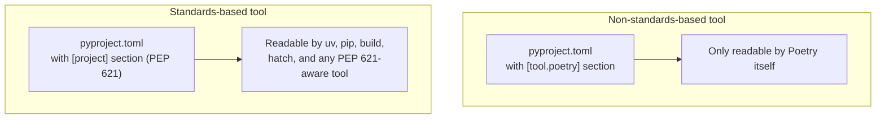
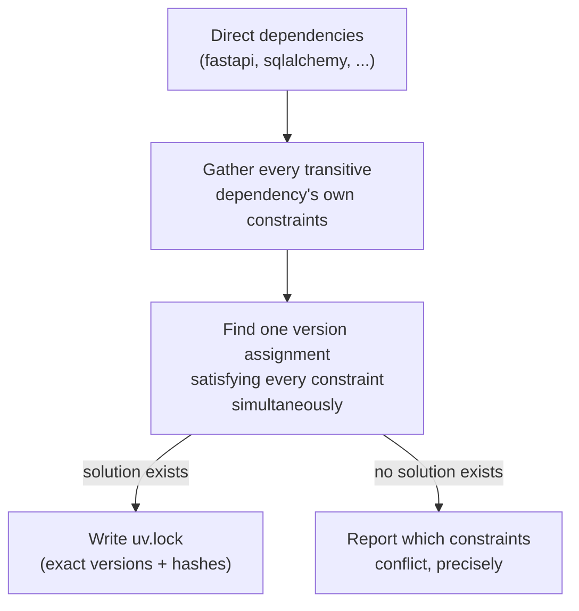

# Core Concepts

[Chapter 1](./01-introduction-and-prerequisites.md) established *why* uv exists and got it installed on Priya and Marcus's machines. Before they run a single `uv` command against ExpenseFlow, though, they need a shared, precise vocabulary — the same word ("dependency," "environment," "resolution") gets used loosely in casual conversation but means something exact in uv's model, and mixing those up is where a lot of confusion starts for teams new to modern Python tooling. This chapter builds that vocabulary from the ground up, introduces the packaging standards uv deliberately builds on rather than inventing its own, and walks through the general project workflow conceptually — one level of abstraction below Chapter 1's preview, one level above Chapter 3's internals. By the end, you'll have the exact terms and mental model [Chapter 3: Architecture & Internals](./03-architecture-and-internals.md) needs to explain *how* uv actually does all of this.

---

## Learning Objectives

By the end of this chapter, you will be able to:

- Define, precisely, the core terms: package, dependency, virtual environment, resolution, lock file, project, workspace, and tool.
- Identify the three packaging standards uv builds on (PEP 621, PEP 508, PEP 723) and state what each one governs.
- Explain why standards-based configuration matters for a team, using Poetry's historically non-standard `[tool.poetry]` section as a contrasting example.
- Walk through the general create → add → lock → sync → run workflow and explain what each stage produces.
- Explain, conceptually, why dependency resolution is a nontrivial problem — why "just install what's listed" fails once transitive dependencies enter the picture.
- Read a minimal `pyproject.toml` and identify which packaging standard each section corresponds to.

---

## Prerequisites for This Chapter

This chapter builds directly on [Chapter 1: Introduction & Prerequisites](./01-introduction-and-prerequisites.md). You should already have:

- uv installed and verified (`uv --version` working) — Chapter 1, Sections 5–6.
- A rough sense of the tools uv replaces (`pip`, `virtualenv`, `pip-tools`, `pyenv`, `pipx`, Poetry) — Chapter 1, Section 2.
- The one-paragraph mental model of the create → add → lock → sync → run workflow — Chapter 1, Section 7 — which this chapter expands into full definitions.

---

## 1. Core Terminology

Precise definitions first, in the order you'll actually encounter them when starting a project. Keep this section bookmarked — every later chapter assumes these exact meanings.

### 1.1 Package

A **package** is a unit of distributable, installable Python code — something you can `pip install` or `uv add`, and then `import` in your code. `fastapi`, `sqlalchemy`, and `alembic` are all packages. A package is published as a **distribution** (concretely, a `.whl` wheel file or a `.tar.gz` source distribution) to a package index like [PyPI](https://pypi.org), and a specific published version of it (`fastapi==0.115.0`) is what gets installed into an environment.

### 1.2 Dependency

A **dependency** is a package that another package or project declares it needs in order to function. When ExpenseFlow's `pyproject.toml` (Section 3) lists `fastapi`, `fastapi` is a *direct* dependency of ExpenseFlow. `fastapi` itself depends on `starlette` and `pydantic` — those are ExpenseFlow's *transitive* dependencies: packages it needs, not because it asked for them directly, but because something it depends on does. A real application's transitive dependency graph is often ten to fifty times larger than its direct dependency list — Section 4 explains why that gap is exactly what makes resolution a real engineering problem, not a formality.

### 1.3 Virtual environment

A **virtual environment** is an isolated directory containing its own Python interpreter (or a link to one) and its own installed packages, kept separate from any other project's environment and from the operating system's own Python installation. Without one, installing package `X` version `2.0` for one project and package `X` version `1.0` for another, on the same machine, would conflict — there's only one global `site-packages` directory otherwise. uv's default virtual environment lives at `.venv/` inside a project (Chapter 6 covers this in full, including how uv discovers and creates it automatically).

### 1.4 Resolution

**Resolution** is the process of taking a project's declared dependencies (with their version constraints) and computing one exact, consistent set of package versions — including every transitive dependency — that satisfies every constraint simultaneously. The output of resolution is not "a list of packages," it's "a list of packages *at specific versions*, proven to be mutually compatible." Section 4 and Chapter 3 both go deeper on why this is harder than it sounds.

### 1.5 Lock file

A **lock file** (`uv.lock`) is the durable, committed-to-version-control record of exactly one resolution's outcome: every package, its exact version, a cryptographic hash of its distribution file, and which platforms/Python versions it applies to. A lock file turns "resolve dependencies" (an operation that could, in principle, produce a different answer as new package versions get published upstream) into a one-time decision that every machine — every developer's laptop, every CI run, every Docker build — can reproduce identically, forever, without re-resolving. [Chapter 8](./08-lock-files-and-reproducibility.md) is dedicated entirely to this file.

### 1.6 Project

A **project** is a directory containing a `pyproject.toml` (Section 3) that declares a Python application or library — its metadata, its dependencies, and (once resolved) its lock file. `uv init` (Chapter 5) scaffolds a new project. ExpenseFlow, from Chapter 5 onward, is a project in exactly this sense.

### 1.7 Workspace

A **workspace** is a uv concept for a repository containing *multiple* related projects (called **members**) that share one resolution and one `uv.lock`, while each member still has its own `pyproject.toml`. ExpenseFlow adopts this structure in [Chapter 12](./12-workspaces-and-monorepos.md), splitting into `packages/api` and `packages/shared` — two members, one workspace, one lock file governing both. Not every multi-directory repository is a workspace in this technical sense — Chapter 12 draws that line precisely.

### 1.8 Tool

A **tool** (in uv's specific vocabulary) is a Python package that provides a command-line program, installed once in its own isolated environment and made available to run from anywhere on your machine — independent of any particular project. `cookiecutter`, `httpie`, and (arguably) `ruff` run outside of any one project's dependency graph are all tools in this sense. `uv tool install` and `uvx` (Chapter 11) manage these. The crucial distinction Chapter 11 drills into: a **project dependency** is versioned per-project and used by everyone on the team identically (via `uv run`); a **tool** is a personal, machine-wide convenience, not something your team's CI or your teammates' `uv sync` will ever install on your behalf.

### 1.9 Terms at a glance

| Term | One-line definition | Where it's used/created | ExpenseFlow example |
|---|---|---|---|
| Package | Installable, importable unit of Python code | Published to PyPI or another index | `fastapi`, `sqlalchemy`, `alembic` |
| Dependency | A package another package/project needs | Declared in `pyproject.toml`; direct or transitive | ExpenseFlow declares `fastapi` directly; `starlette` comes along transitively |
| Virtual environment | Isolated per-project interpreter + installed packages | `.venv/`, created/managed by uv (Chapter 6) | ExpenseFlow's own `.venv/`, separate from any other project on the same laptop |
| Resolution | Computing one consistent, exact version set | Performed by `uv lock` / implicitly by `uv add`/`uv sync` | Deciding exactly which `pydantic` version satisfies both `fastapi` and `pydantic-settings` |
| Lock file | Committed record of one resolution's exact outcome | `uv.lock` (Chapter 8) | ExpenseFlow's `uv.lock`, committed to git so CI and every laptop match |
| Project | A directory with a `pyproject.toml` describing an app/library | `uv init` (Chapter 5) | The `expenseflow/` directory itself |
| Workspace | Multiple projects sharing one lock file/resolution | `[tool.uv.workspace]` (Chapter 12) | `packages/api` + `packages/shared`, one shared `uv.lock` |
| Tool | A globally installed CLI program, outside any project | `uv tool install` / `uvx` (Chapter 11) | `cookiecutter`, installed once, used across many unrelated projects |

### 1.10 A word on "environment" vs. "interpreter" vs. "project"

These three terms get used almost interchangeably in casual conversation, but they name different things, and Chapter 3 and Chapter 6 both depend on you keeping them apart:

- A **Python interpreter** is the actual `python` binary — a specific build of CPython 3.13, for instance — that executes your code. Chapter 4 covers how uv installs and manages these directly.
- A **virtual environment** *wraps* an interpreter with an isolated package directory. It doesn't contain a full copy of the interpreter (uv links to a managed interpreter rather than copying it) — it's a thin, project-scoped shell around one.
- A **project** is the directory and its `pyproject.toml`/`uv.lock` — the *declaration* of what should be true. The virtual environment is the *realization* of that declaration on disk. `uv sync` is precisely the operation that makes the environment (realization) match the project (declaration).

---

## 2. The Standards uv Builds On

A defining design choice of uv — and a real point of contrast with Poetry, historically — is that uv does not invent its own proprietary configuration format for the things Python packaging already has open standards for. It implements those standards. This matters enough to a professional team that it's worth understanding each standard individually, not just as a checkbox.

### 2.1 PEP 621 — project metadata in `pyproject.toml`

[PEP 621](https://peps.python.org/pep-0621/) defines a standard `[project]` table inside `pyproject.toml` for a package's core metadata: its name, version, description, authors, Python version requirement, and dependency list. Before PEP 621 (finalized for the ecosystem around 2021–2022), tools disagreed on where this metadata lived — `setup.py`, `setup.cfg`, and each build tool's own bespoke section of `pyproject.toml` all coexisted, and a file written for one tool often wasn't readable by another.

A minimal PEP 621-compliant `[project]` table looks like this:

```toml
[project]
name = "expenseflow"
version = "0.1.0"
description = "Expense tracking API"
requires-python = ">=3.13"
dependencies = [
    "fastapi",
    "sqlalchemy",
]
```

uv reads and writes exactly this table. `uv add fastapi` appends to `dependencies = [...]` under `[project]`, in this standard location — not a `[tool.uv.dependencies]` section uv invented for itself.

### 2.2 PEP 508 — dependency specifiers

[PEP 508](https://peps.python.org/pep-0508/) defines the *syntax* used to specify a dependency and its version constraints, extras, and environment markers — the strings that go inside that `dependencies` list. `"fastapi>=0.110,<1.0"`, `"uvicorn[standard]>=0.30"`, and `"asyncpg; python_version >= '3.9'"` are all PEP 508 specifiers. Chapter 7 covers the version-operator vocabulary (`==`, `>=`, `~=`, and the tradeoffs of over- and under-constraining) in full; the point here is narrower: this syntax is a language-wide standard, not something uv (or Poetry, or pip) each reinvented differently. A dependency string that means one thing to `uv add` means the exact same thing to `pip install` or to Poetry, because all three parse the same PEP 508 grammar.

### 2.3 PEP 723 — inline script metadata

[PEP 723](https://peps.python.org/pep-0723/) is the newest of the three, and solves a different problem than the other two: what about a single, standalone Python *script* — not a whole project — that needs a couple of third-party dependencies? Before PEP 723, your only real options were "make it a whole project with its own `pyproject.toml` and virtual environment" (heavyweight for a 30-line script) or "hope the right packages happen to already be installed globally" (fragile and unreproducible). PEP 723 defines a special comment block, embedded directly at the top of a `.py` file, that a tool can parse to learn the script's own dependencies:

```python
# /// script
# requires-python = ">=3.13"
# dependencies = [
#     "httpx",
# ]
# ///

import httpx

response = httpx.get("https://api.example.com/rates")
print(response.json())
```

`uv run backfill_currency.py` reads that comment block, resolves and installs `httpx` into a throwaway, cached environment specific to this script (not ExpenseFlow's main project environment), and runs the script — all from one command, with no separate project scaffold required. [Chapter 9](./09-running-code-with-uv-run.md) builds exactly this example (a `backfill_currency.py` maintenance script, deliberately echoing the sibling Alembic course's data-migration chapter) in full.

### 2.4 Why standards-based tooling matters



Poetry, historically, stored project metadata under its own `[tool.poetry]` table rather than the (at-the-time not-yet-standardized) `[project]` table — a completely reasonable choice when Poetry was created, since PEP 621 didn't exist yet, but one with a real cost in hindsight: a `pyproject.toml` written for Poetry was not, for a long time, a `pyproject.toml` that a different tool (like `pip`, or a build backend, or a static-analysis tool that just wants to know a project's declared dependencies) could parse without Poetry-specific knowledge. Poetry has since added support for the standard `[project]` table as well, but the historical divergence is exactly the failure mode standards exist to prevent.

uv, being newer, had the benefit of building on PEP 621, PEP 508, and PEP 723 from day one, rather than needing to retrofit standards support onto an established proprietary format. The practical payoff for a team like ExpenseFlow's:

- **Portability.** ExpenseFlow's `pyproject.toml` is readable and meaningful to any standards-aware tool — an IDE's dependency inspector, a security-scanning tool, a different package manager entirely — without that tool needing uv-specific code.
- **No lock-in.** If ExpenseFlow's team ever needed to stop using uv, its `pyproject.toml` remains a valid, standard file; only the lock file and the specific resolution/sync mechanics would need replacing, not the entire project's metadata format.
- **Less to relearn.** A PEP 508 dependency specifier means the same thing everywhere; a `[project]` table means the same thing everywhere. Engineers moving between projects, or between uv and any other standards-aware tool, aren't relearning a proprietary dialect each time.

---

## 3. The General Workflow

Chapter 1 previewed this diagram; here it is again with each stage's *output* made explicit, since that's the piece that matters for understanding what each command actually accomplishes.


Walking through each stage's responsibility:

1. **`uv init`** creates the project skeleton — a `pyproject.toml` with a standard `[project]` table, a source layout, and a `.gitignore` (Chapter 5 covers every generated file).
2. **`uv add <package>`** appends a PEP 508 dependency specifier to `dependencies` in `pyproject.toml` — this is a *declaration* of intent ("this project needs `fastapi`"), not yet an installed package.
3. **`uv lock`** performs resolution (Section 4): reads every declared dependency (direct and transitive), computes one consistent, exact version set, and writes it to `uv.lock`. In everyday use, `uv add`/`uv remove` trigger this automatically — you rarely invoke `uv lock` by hand except in specific CI/Docker contexts (Chapter 8).
4. **`uv sync`** reads `uv.lock` and makes the `.venv/` environment match it exactly — installing anything missing, removing anything that shouldn't be there, and never re-resolving (that already happened in step 3).
5. **`uv run <command>`** ensures the environment is in sync (repeating step 4 if needed) and then executes your command inside it — no manual activation step required (Chapter 6 and Chapter 9 cover this in depth).

The key relationship to internalize: **`uv lock` decides; `uv sync` obeys.** Resolution (deciding *which* versions) and installation (making the environment *match* that decision) are two distinct operations, performed by two distinct commands, even though day-to-day usage often triggers both from one `uv add` call. Chapter 8 leans heavily on this distinction — it's exactly what makes `--frozen` and `--locked` (two different ways of saying "don't you dare re-resolve") meaningful, precise flags rather than vague safety options.

### 3.1 Watching the workflow run, narrated

It's worth seeing this sequence of stages against real (if still minimal) terminal output, so the diagram above isn't purely abstract. This is a generic walkthrough — ExpenseFlow's actual dependency set arrives in Chapter 7 — but the shape is identical:

```bash
$ uv init demo && cd demo
Initialized project `demo` at `/home/priya/demo`
# Stage 1 complete: pyproject.toml exists with a [project] table, no dependencies yet.

$ uv add fastapi
Resolved 12 packages in 210ms
Prepared 12 packages in 640ms
Installed 12 packages in 45ms
 + annotated-types==0.7.0
 + anyio==4.6.0
 + fastapi==0.115.0
 + ...
# Stage 2 (declare) + Stage 3 (resolve) + Stage 4 (sync) all happened here —
# uv add triggers all three automatically, in that order.

$ cat uv.lock | head -5
version = 1
requires-python = ">=3.13"

[[package]]
name = "annotated-types"
# Stage 3's durable output: exact versions now committed to a file.

$ uv run python -c "import fastapi; print(fastapi.__version__)"
0.115.0
# Stage 5: uv confirms the environment already matches uv.lock (nothing to
# do), then runs the command inside it.
```

Notice that no step here required activating anything, and no step required manually invoking `uv lock` or `uv sync` — `uv add` and `uv run` handled both implicitly. That implicit behavior is a deliberate convenience for day-to-day development; Chapter 8 and Chapter 15 both cover *when* you want to make these steps explicit and separately controlled instead (chiefly: CI and Docker builds, where you want a guarantee that no silent re-resolution happens).

### 3.2 What triggers each stage automatically

A quick reference for which everyday actions implicitly perform which workflow stage — useful to have in mind before Chapter 6 and Chapter 9 cover the mechanics in full:

| Action you take | Stages triggered automatically |
|---|---|
| `uv add <package>` / `uv remove <package>` | Declare → Resolve → Sync (all three) |
| `uv run <command>` | Sync (only if the environment is out of date relative to `uv.lock`), then execute |
| `uv sync` (explicit) | Sync only — assumes `uv.lock` already reflects what you want |
| `uv lock` (explicit) | Resolve only — updates `uv.lock`, does **not** touch `.venv/` |
| Editing `pyproject.toml` by hand, then `uv run` | Sync notices the declared dependencies no longer match `uv.lock` and re-resolves before syncing |

That last row is worth sitting with: uv does not blindly trust `uv.lock` if you've hand-edited `pyproject.toml` since it was generated — it detects the mismatch and re-resolves. This is a safety net for casual hand-editing, but Section 1 of this chapter's guidance still stands: prefer `uv add`/`uv remove` so you never rely on that safety net in the first place.

---

## 4. Dependency Resolution, Conceptually

### 4.1 Why "just install what's listed" isn't enough

Imagine ExpenseFlow's `pyproject.toml` declares exactly two direct dependencies: `fastapi` and `sqlalchemy`. A naive tool might read that list and simply install the latest version of each. Why doesn't that work in practice?

- **Transitive dependencies aren't listed anywhere in ExpenseFlow's own file.** `fastapi` depends on `starlette` and `pydantic`; `sqlalchemy` depends on `greenlet` (for its async support) and others. None of these appear in ExpenseFlow's `dependencies` list — they're `fastapi`'s and `sqlalchemy`'s problem to declare, not ExpenseFlow's. A real install has to walk this entire graph, often dozens of packages deep, not just the handful a project directly names.
- **Two direct dependencies can require incompatible versions of the same transitive dependency.** If `fastapi` needs `pydantic>=2.0` and some other direct dependency ExpenseFlow adds later needs `pydantic<2.0`, "just install the latest of everything" produces a genuinely broken environment — some code will import a `pydantic` version it was never designed against. Section 3.3 of Chapter 1 walked through exactly this shape of conflict.
- **"Latest version of everything" isn't reproducible.** If two developers run "just install the latest" a week apart, and a new version of some transitive dependency was published in between, they can end up with two different, silently divergent environments — precisely the "works on my machine" scenario Chapter 8 examines as a real ExpenseFlow incident.

### 4.2 What the resolver's job actually is

Given a project's direct dependencies (each with PEP 508 constraints), the resolver's job is to find **one assignment of exactly one version to every package in the entire dependency graph** — direct and transitive — such that every constraint, from every package, is satisfied simultaneously. Concretely, the resolver must answer questions like:

- Does any version of `pydantic` satisfy both `fastapi`'s constraint *and* every other package's constraint on it?
- If `package-a` requires `shared-lib>=2.0` and `package-b` requires `shared-lib<2.0`, is there *any* valid resolution at all — or is this a genuine, unsatisfiable conflict that needs a human decision (upgrade one of them, find compatible versions, or drop one)?
- Among multiple technically valid resolutions (there is often more than one version set that satisfies all constraints), which one should be preferred — generally, the newest versions consistent with every constraint, though exact tie-breaking policy is an implementation detail?



This is, formally, a constraint-satisfaction problem — the same category of problem as scheduling or graph-coloring — and it is genuinely computationally nontrivial for a large enough dependency graph (real-world Python projects can easily have 100+ packages in their fully resolved dependency tree). This is exactly why "which algorithm does the resolver use, and how fast/correct is it" is a real engineering question, not a footnote — and exactly the question [Chapter 3](./03-architecture-and-internals.md) answers for uv specifically, by naming and explaining the PubGrub algorithm it's built on.

### 4.4 A worked numeric example

To make Section 4.2's questions less abstract, walk through a tiny, illustrative (simplified, not byte-exact) case with three packages and one shared transitive dependency:

| Package | Requires |
|---|---|
| `fastapi` (direct) | `pydantic>=2.0,<3.0` |
| `pydantic-settings` (direct) | `pydantic>=2.0` |
| `some-legacy-lib` (direct, hypothetical) | `pydantic<2.0` |

Here, `fastapi` and `pydantic-settings` agree — any `pydantic` version in `[2.0, 3.0)` satisfies both. But `some-legacy-lib`'s constraint (`<2.0`) is entirely disjoint from that range. There is no single version of `pydantic` that satisfies all three simultaneously — this is a genuine conflict, not a resolver bug. A correct resolver reports exactly this: `fastapi` and `pydantic-settings` want `pydantic>=2.0`, but `some-legacy-lib` wants `pydantic<2.0`, and no version satisfies both groups. The fix is a human decision — drop `some-legacy-lib`, find a newer version of it that's been updated for `pydantic` 2.x, or (rarely, correctly) pin everything to `pydantic` 1.x if every other constraint could tolerate that instead. Now compare that to a *satisfiable* case, changing only `some-legacy-lib`'s constraint to `pydantic>=2.0,<2.5`: the resolver can now find a valid answer — any `pydantic` version in `[2.0, 2.5)`, the overlap of all three ranges — and, among the valid candidates, uv's resolver prefers the newest one satisfying every constraint, landing on (say) `pydantic==2.4.2` if that's the newest published version still under `2.5`.

This is the entire conceptual crux of dependency resolution: **collect every constraint from every package in the graph, and find the overlap — or prove there isn't one.** Everything about resolver *implementation* (how efficiently that overlap is found, how conflicts are explained, how ties are broken) is Chapter 3's subject; Section 4's job was making sure you understand exactly what problem is being solved before looking at how.

### 4.3 Resolution happens once; syncing happens often

A subtlety worth flagging before Chapter 8 makes it load-bearing: resolution is comparatively expensive (walking a whole graph, checking constraints) but happens comparatively rarely — only when dependencies actually change (`uv add`, `uv remove`, or an explicit `uv lock --upgrade`). Syncing — making an environment match an *already-resolved* lock file — is comparatively cheap and happens often (every `uv run`, every fresh clone, every CI run, every Docker build). uv's design keeps these two operations cleanly separated for exactly this reason: you want to pay resolution's cost rarely and deliberately, and pay syncing's (much smaller) cost as often as needed without ever silently triggering a full re-resolution by accident.

---

## Real-World Scenario

Priya starts ExpenseFlow's `pyproject.toml` by hand-editing it before realizing `uv add` exists, and accidentally writes:

```toml
[project]
name = "expenseflow"
version = "0.1.0"
requires-python = ">=3.13"
dependencies = [
    "fastapi",
    "sqlalchemy",
    "asyncpg",
]

[tool.expenseflow]
some-custom-setting = true
```

Marcus, who used Poetry extensively at his previous job, asks whether they need a `[tool.poetry]` section instead, and whether their dependency list needs to move under it. This is the exact moment Section 2.4's contrast becomes concrete rather than academic: Priya explains that uv reads the standard `[project]` table directly — the one PEP 621 defines — so there's no Poetry-specific (or uv-specific) section required for basic metadata at all. `[tool.expenseflow]`, in their file, is just an arbitrary, project-specific table they added themselves for a setting neither uv nor any packaging standard cares about — perfectly legal TOML, ignored by uv entirely, and not to be confused with the standard `[project]` table above it.

To prove the point, Priya opens the file with a completely unrelated tool — a static-analysis script a security team uses that reads `pyproject.toml` metadata to build a software bill of materials — and it correctly identifies `fastapi`, `sqlalchemy`, and `asyncpg` as ExpenseFlow's dependencies, without knowing anything about uv at all. That's PEP 621 doing exactly what it's for: the same file means the same thing to every standards-aware consumer, not just the one tool that happened to write it. Marcus's Poetry instinct wasn't wrong — Poetry projects generally work fine too — but it's a reminder that uv's file isn't "a Poetry-like format," it's the standard format Poetry itself has since added support for.

They finish by running `uv add fastapi sqlalchemy asyncpg` from a fresh `uv init`, and diff the result against Priya's hand-written attempt — confirming, line by line, that uv produces exactly the same standard structure, just without the risk of a typo in a hand-edited version specifier.

---

## Best Practices

- **Let `uv add`/`uv remove` manage `pyproject.toml`'s `dependencies` list** rather than hand-editing it — this avoids PEP 508 syntax typos and keeps the lock file automatically in sync with what's declared.
- **Know which standard governs which part of your config file.** When something looks unfamiliar in `pyproject.toml`, first ask "is this `[project]` (PEP 621), a dependency specifier (PEP 508), or a uv-specific `[tool.uv]` section?" — Chapter 5 covers `[tool.uv]` in full.
- **Prefer PEP 723 inline scripts over ad-hoc global installs** for genuinely standalone one-off scripts (Chapter 9) — it keeps a script's dependencies declared and reproducible without requiring a whole project.
- **Treat resolution and syncing as conceptually distinct operations**, even when one command triggers both — this distinction is what makes `--frozen`/`--locked` (Chapter 8) meaningful rather than confusing.
- **Don't assume "latest version of everything" is a valid substitute for resolution** — Section 4.1's reasoning applies just as much to informal, ad-hoc dependency management as it does to any specific tool.

---

## Common Mistakes

- **Assuming uv needs a Poetry-style `[tool.uv.dependencies]`-type section for basic metadata.** It doesn't — dependencies live in the standard `[project]` table (Section 2.1); `[tool.uv]` exists for uv-*specific* settings layered on top (Chapter 5), not for metadata standards already cover.
- **Confusing a lock file with a resolution.** `uv.lock` is the *output* of a resolution, not the process itself — "resolving" and "the lock file" are related but distinct concepts, and Chapter 8 depends on keeping them separate.
- **Believing "no errors during `uv add`" guarantees no conflicts exist anywhere in the project.** A conflict only surfaces at the point resolution actually has to reconcile the conflicting constraints — adding packages one at a time, without ever fully re-resolving, can occasionally mask a conflict that a clean `uv lock` from scratch would catch.
- **Treating a PEP 723 script's dependencies as somehow different from a normal project's dependencies.** They use the exact same PEP 508 specifier syntax — the only difference is *where* they're declared (inline in the script vs. in `pyproject.toml`), not what they mean.
- **Ignoring the difference between direct and transitive dependencies** when debugging a version conflict — the package actually causing a conflict is very often not one of the handful you added yourself, but something several levels deep in the transitive graph, which is precisely why a systematic resolver (rather than manual reasoning) is necessary at all.

---

## Summary

- Eight core terms — package, dependency, virtual environment, resolution, lock file, project, workspace, tool — have precise, distinct meanings in uv's model (Section 1).
- uv builds on three open packaging standards rather than inventing its own format: PEP 621 (`[project]` metadata), PEP 508 (dependency specifier syntax), and PEP 723 (inline script metadata) (Section 2).
- Standards-based tooling means portability and no lock-in — a contrast made concrete by Poetry's historical non-standard `[tool.poetry]` section (Section 2.4).
- The general workflow — `uv init` → `uv add` → `uv lock` → `uv sync` → `uv run` — has a specific, produced artifact at every stage: a `pyproject.toml`, an updated dependency list, a `uv.lock`, a populated `.venv/`, and finally, executed code (Section 3).
- Dependency resolution exists because "just install what's listed" breaks down once transitive dependencies and potential version conflicts enter the picture — the resolver's job is finding one consistent version assignment across the entire graph, or reporting precisely why none exists (Section 4).
- Resolution (`uv lock`) is comparatively expensive and rare; syncing (`uv sync`) is comparatively cheap and frequent — keeping them conceptually and operationally distinct is foundational to Chapter 8.

---

## Knowledge Check

1. Define, in one sentence each, the difference between a "dependency" and a "transitive dependency."
2. What is the difference between a "resolution" and a "lock file"? Which one is a process and which one is a file?
3. Which packaging standard defines the `[project]` table in `pyproject.toml`, and which defines the syntax of a string like `"uvicorn[standard]>=0.30"`?
4. Why does PEP 723 exist — what problem does it solve that a full project with its own `pyproject.toml` would be a poor fit for?
5. Explain, using Poetry's historical `[tool.poetry]` section as an example, why standards-based configuration files matter for tool portability.
6. Why can't a dependency-installing tool simply "install the latest version of every listed package" and skip resolution entirely? Give a concrete failure mode.
7. Is a directory containing multiple unrelated Python projects automatically a uv "workspace"? Why or why not?

---

## Hands-On Exercise

**Goal:** Inspect the standards-based structure of a `pyproject.toml` firsthand, and observe resolution and lock-file creation happening as distinct, visible steps.

1. **Create a fresh scratch project**: `uv init concepts-lab && cd concepts-lab`.
2. **Open `pyproject.toml`** and identify the `[project]` table. Confirm it matches the PEP 621 shape from Section 2.1 (`name`, `version`, `requires-python`, and — once you add something — `dependencies`).
3. **Add two dependencies with different PEP 508 constraint styles**: `uv add "httpx>=0.27"` and `uv add "rich~=13.0"`. Reopen `pyproject.toml` and confirm both specifier strings appear exactly as you typed them under `dependencies`.
4. **Open `uv.lock`** (it's plain text, safe to read though not meant to be hand-edited) and find the entries for `httpx` and `rich`. Note the exact resolved version and the presence of hash information — this is resolution's *output*, made durable.
5. **Force a fresh resolution** with `uv lock --upgrade` and diff `uv.lock` before/after (`git diff uv.lock` if you've initialized git, or just re-read it) — even without adding anything new, note whether any transitive dependency version changed, illustrating that resolution can produce a different valid answer over time as new versions get published upstream.
6. **Write a tiny PEP 723 script** named `check_status.py`:
   ```python
   # /// script
   # requires-python = ">=3.13"
   # dependencies = [
   #     "httpx",
   # ]
   # ///

   import httpx

   print(httpx.get("https://example.com").status_code)
   ```
   Run it with `uv run check_status.py` — notice it works even though this script was never added to `concepts-lab`'s own `pyproject.toml`/`uv.lock` at all.
7. **Clean up**: `rm -rf concepts-lab` — this was a scratch exercise; ExpenseFlow itself starts fresh in Chapter 5.

---

## Further Reading

- [uv Concepts documentation](https://docs.astral.sh/uv/concepts/) — Astral's own reference for projects, dependencies, resolution, workspaces, tools, and the cache.
- [PEP 621 – Storing project metadata in pyproject.toml](https://peps.python.org/pep-0621/) — the full specification behind Section 2.1.
- [PEP 508 – Dependency specification for Python Software Packages](https://peps.python.org/pep-0508/) — the full specification behind Section 2.2.
- [PEP 723 – Inline script metadata](https://peps.python.org/pep-0723/) — the full specification behind Section 2.3.
- [Python Packaging User Guide](https://packaging.python.org/) — broader context on packages, distributions, and the standards ecosystem uv participates in.

---

<div style="display:flex;justify-content:space-between;align-items:center;">
  <a href="./01-introduction-and-prerequisites.md">← Previous: Introduction & Prerequisites</a>
  <a href="./00-index.md">🏠 Index</a>
  <a href="./03-architecture-and-internals.md">Next: Architecture & Internals →</a>
</div>
