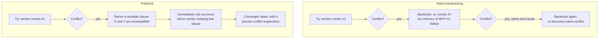
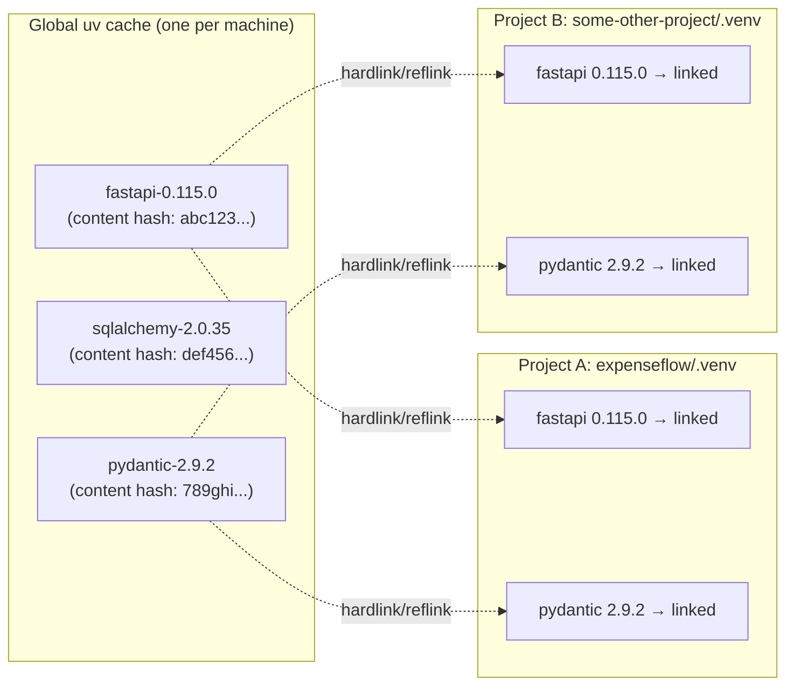
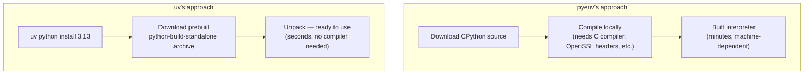
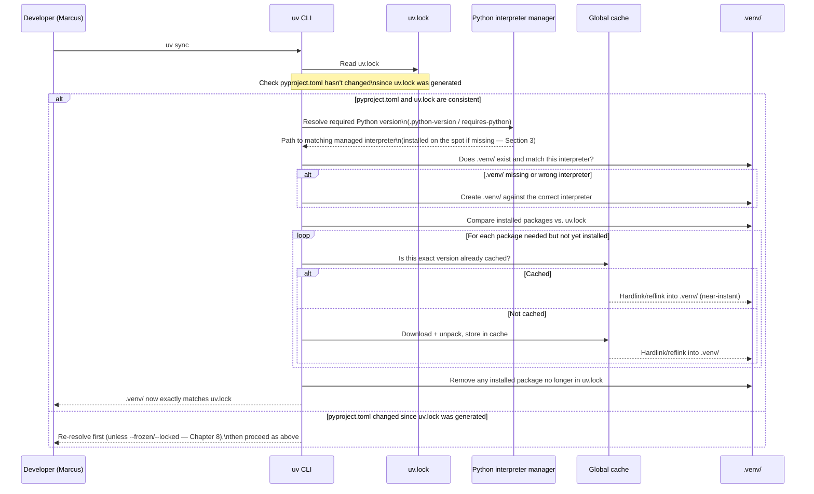

# Architecture & Internals

[Chapter 2](./02-core-concepts.md) gave you the vocabulary — package, dependency, resolution, lock file, project, workspace, tool — and walked through the general create → add → lock → sync → run workflow at a conceptual level, deliberately treating `uv lock` and `uv sync` as black boxes that "just resolve" and "just install." This chapter opens those boxes. We're going under the hood into exactly how uv's resolver decides on a version set, how its global cache makes repeated installs across projects nearly instant, how it manages Python interpreters without compiling anything from source, and what actually happens, mechanically, when Priya types `uv sync` in ExpenseFlow's project directory. This is the last purely conceptual chapter before the course turns hands-on in [Chapter 4: Python Version Management](./04-python-version-management.md) — everything here is architecture-level intuition, not a line-by-line source code tour, but it's the intuition every later "why is this slow" or "why did this behave unexpectedly" question in the course will trace back to.

---

## Learning Objectives

By the end of this chapter, you will be able to:

- Explain what the PubGrub algorithm is, at a conceptual level, and why uv's resolver is built on it rather than simpler backtracking.
- Describe the structure and purpose of uv's global, content-addressable cache, and explain the difference between hardlinks, copy-on-write reflinks, and full copies in this context.
- Explain how uv manages Python interpreters using `python-build-standalone`, and why this differs from `pyenv`'s source-compilation approach.
- Describe how `uv run` decides which interpreter and which virtual environment to use for a given command.
- Compare uv's overall model — shared cache, managed interpreters, integrated resolver — against the pip + virtualenv model, point by point.
- Trace, step by step, everything that happens internally during a `uv sync` call, from reading `uv.lock` to a fully populated `.venv/`.

---

## Prerequisites for This Chapter

This chapter builds directly on [Chapter 2: Core Concepts](./02-core-concepts.md). We assume you're comfortable with:

- The precise meanings of *resolution*, *lock file*, *virtual environment*, and *project* (Chapter 2, Section 1).
- The general create → add → lock → sync → run workflow, and the fact that resolution (`uv lock`) and installation (`uv sync`) are distinct operations (Chapter 2, Section 3).
- Why dependency resolution is a nontrivial constraint-satisfaction problem, not a formality (Chapter 2, Section 4) — this chapter names and explains the specific algorithm uv uses to solve it.

If any of that feels shaky, revisit Chapter 2 before continuing — this chapter builds directly on top of it without re-explaining those basics.

---

## 1. The Resolver: PubGrub

### 1.1 Why not just backtrack?

Chapter 2, Section 4 established the resolver's job: given a graph of packages and their version constraints, find one version assignment that satisfies every constraint, or prove none exists. The most naive approach — try a version for each package, and if something conflicts, backtrack and try a different version — technically works, but can be extremely slow in the worst case, because a naive backtracking search can end up re-exploring large swaths of the same search space repeatedly, without learning anything from *why* a previous attempt failed. Worse, as [Chapter 1](./01-introduction-and-prerequisites.md) noted, a resolver that just walks constraints in whatever order it encounters them can land on different results depending purely on that order — a correctness problem, not just a speed one.

### 1.2 What PubGrub actually is

**PubGrub** is a dependency resolution algorithm originally developed for Dart's `pub` package manager (hence the name — "pub" plus "grub," from the broader family of graph/constraint solvers), and conceptually related to the version-solving approach used by Rust's Cargo. uv's resolver is a Rust implementation of this same algorithmic family, adapted to Python's packaging metadata (PEP 508 specifiers, PEP 621 project files) rather than Dart's or Rust's own package formats.

The core idea that distinguishes PubGrub from naive backtracking: **when the solver hits a conflict, it doesn't just backtrack — it learns a reusable fact about *why* that conflict happened**, and uses that fact (formally, a *derived clause* — a compact statement like "these two constraints are jointly unsatisfiable") to immediately rule out every future combination that would repeat the same mistake, rather than re-discovering the same conflict independently, from scratch, every time a similar combination comes up elsewhere in the search. This is conceptually similar to how a modern SAT solver (used in fields from hardware verification to scheduling) avoids exhaustively re-testing dead-end branches: each failure teaches the solver something durable about the whole problem, not just about the one specific branch it was on.



Two practical properties fall directly out of this design, both of which matter to a real engineering team, not just to algorithm enthusiasts:

- **Speed.** Learning from conflicts instead of blindly retrying means the solver explores dramatically less of the search space on real-world dependency graphs with lots of shared transitive dependencies — exactly ExpenseFlow's situation, where `fastapi`, `sqlalchemy`, and `pydantic-settings` all transitively touch `pydantic`.
- **Explainability.** Because PubGrub tracks *why* each conflict happened as a first-class piece of data, an unsatisfiable dependency graph produces a genuinely useful error — naming the specific packages and constraints in conflict — rather than a generic "could not find a version that satisfies all requirements" message with no indication of which requirements are actually fighting each other.

### 1.3 Determinism as a first-class property

Because PubGrub reasons about the *entire* constraint set as a whole, rather than processing packages sequentially in whatever order they're listed, the outcome of a resolution depends only on the actual dependency graph and version constraints in play — not on the order packages happen to appear in `pyproject.toml`, and not on which package uv happens to consider first internally. Two developers, resolving the exact same `pyproject.toml` on the exact same day (same package index state), get the exact same resolution, every time. This determinism is precisely what makes `uv.lock` a meaningful, trustworthy artifact — Chapter 8 relies on this property directly when it argues that `uv.lock` is the single source of truth for "what does ExpenseFlow's dependency set actually look like," not merely a cache of one particular run's outcome.

### 1.4 Why this matters more for AI-framework dependency trees than it might first appear

ExpenseFlow's own dependency graph (FastAPI, SQLAlchemy, Alembic, `asyncpg`, `pydantic-settings`) is moderate in size — tens of transitive dependencies, not hundreds. It's worth noting explicitly, since this course's audience includes teams building on AI frameworks like LangChain and LangGraph, that resolver quality matters considerably more once a project's dependency graph grows into that territory. Frameworks in that space frequently pull in large, fast-moving transitive dependency trees — numerous provider integrations, vector-store clients, tokenizers, and numerical libraries, each with their own version constraints, often updated on an aggressive release cadence. A resolver that's slow or order-sensitive turns "add one new LangChain integration package" into a multi-minute wait or an unpredictable outcome; a fast, deterministic PubGrub-based resolver keeps that operation fast and repeatable even as the graph's size grows well past what a small FastAPI service alone would ever reach. This is a large part of why AI-application teams specifically have been early, enthusiastic adopters of uv — the pain a weak resolver causes scales directly with dependency-graph size, and that size grows quickly in this domain.

### 1.5 Version selection: among valid answers, which one wins?

Section 4.4 of Chapter 2 noted that a satisfiable constraint set often has more than one technically valid resolution — several different versions of some package might each individually satisfy every constraint in play. PubGrub's search needs a tie-breaking policy to pick one, and uv's default is the intuitive one: **prefer the newest version that satisfies every constraint**, for every package in the graph. This mirrors what a careful engineer would want by default — the most current, presumably most bug-fixed release consistent with everything else — while still respecting every explicit upper-bound constraint a package author has declared. This default is overridable (uv supports resolving against a specific historical point in time, or preferring lowest-compatible versions for compatibility testing — a later-chapter/reference-documentation detail), but "newest compatible version, for everything" is what a bare `uv lock` or `uv add` does without any special flags, and it's what produces the version numbers you'll see in every `uv.lock` excerpt throughout this course.

---

## 2. The Global Cache

### 2.1 The problem it solves

Recall from Chapter 1 that plain `pip` + `virtualenv` installs packages independently into every virtual environment — if ExpenseFlow's API service and its background-worker project both need `fastapi==0.115.0`, plain `pip` downloads and writes those files to disk twice, once per environment, with no awareness that the other copy exists. uv's global cache exists specifically to eliminate that duplicated work.

### 2.2 Content-addressable storage

uv maintains one shared cache directory on your machine (its exact location is platform-dependent — typically under a user cache directory, and configurable via the `UV_CACHE_DIR` environment variable), organized as a **content-addressable store**: every downloaded and unpacked package version is stored once, keyed by a hash of its actual content, rather than by project name or by which project first requested it.



When ExpenseFlow's project needs `fastapi==0.115.0` for the first time on a given machine, uv downloads it, unpacks it, and stores it once in this cache. When a second, entirely unrelated project on the same machine later needs the exact same version, uv recognizes the content is already cached (by its hash) and skips the download and unpack step entirely — it just needs to make that already-unpacked content appear inside the second project's `.venv/`.

A rough sketch of the cache directory's layout (simplified — exact internal structure is a uv implementation detail, not a public API to depend on):

```
~/.cache/uv/                          # UV_CACHE_DIR, platform-dependent default
├── wheels-v1/
│   ├── fastapi/
│   │   └── fastapi-0.115.0-py3-none-any.whl
│   ├── sqlalchemy/
│   │   └── sqlalchemy-2.0.35-cp313-cp313-linux_x86_64.whl
│   └── ...
├── sdists-v1/
│   └── ...                           # source distributions, when no prebuilt wheel exists
└── archive-v0/
    └── ...                           # unpacked package contents, linked into .venv/ directories
```

You are not meant to browse or edit this directory by hand — much like MinIO's on-disk shard layout or Alembic's internal bookkeeping tables in this repo's other courses, it's an internal implementation detail uv manages exclusively through its own commands (`uv cache dir`, `uv cache prune`, `uv cache clean`). The sketch above exists purely to make "content-addressable cache" concrete, not as a reference to script against.

### 2.3 Hardlinks and reflinks: linking instead of copying

That "make it appear" step is where uv's second major performance trick comes in: instead of *copying* the cached files into each project's virtual environment (which costs real disk I/O and real additional disk space, proportional to file size, every single time), uv links to them wherever the underlying filesystem supports it:

- **Hardlinks** make a new directory entry point at the exact same underlying data on disk as the cached file — no data is duplicated at all, and the operation is close to instantaneous regardless of the file's size, because no bytes are actually copied.
- **Copy-on-write reflinks** (supported on filesystems like Btrfs, XFS with reflink support, and APFS on macOS) behave similarly — a near-instant, no-extra-space link — but with an extra safety property: if either the cached copy or the linked copy is ever modified in place, the filesystem transparently splits them into two independent copies at that point, so one project's environment can never accidentally corrupt another's or the shared cache, even though they started out sharing the same physical bytes.
- **Full copies** are the fallback when neither is available (e.g., linking across two different physical drives/filesystems, or on a filesystem without reflink support) — uv still uses its cache to skip the *download*, but this step costs real I/O and disk space, same as a naive tool would pay every time.

uv picks the best available strategy for your filesystem automatically, and this is directly configurable via the `UV_LINK_MODE` environment variable (`hardlink`, `copy`, or `symlink`) for situations that need to force a specific behavior — a detail that becomes directly relevant in [Chapter 14: Docker Integration](./14-docker-integration.md), because a Docker build's `COPY` instruction breaks hardlinks across the layer boundary in a way that trips up nearly every team the first time they containerize a uv project.

### 2.4 Cache growth and pruning

Because the cache is additive by design — every new package version any project on the machine has ever needed accumulates there, and old, no-longer-referenced versions aren't automatically deleted just because a project stopped using them — it will grow over time, particularly on a developer machine that works across many projects with different, evolving dependency sets. This is a deliberate tradeoff: a larger cache means a higher chance any given package version is already present, which is exactly what makes the "second project, same dependency" scenario in this chapter's Real-World Scenario nearly instant. `uv cache dir` reports where the cache lives, and `uv cache prune`/`uv cache clean` are the supported ways to reclaim disk space deliberately — removing unreferenced or all cached entries, respectively — rather than manually deleting files inside the cache directory by hand, which risks leaving the cache's own internal bookkeeping inconsistent.

### 2.5 The net effect

| | First install of a package version, ever, on this machine | Every subsequent install of that same version, any project |
|---|---|---|
| Plain pip + virtualenv | Download + unpack + copy into venv | Download + unpack + copy into venv, again, from scratch |
| uv (hardlink/reflink filesystem) | Download + unpack once, into the shared cache | Near-instant link into the new venv — no download, no unpack, no copy |

For a team running many small services, CI jobs that spin up fresh environments repeatedly, or engineers juggling several projects with overlapping dependencies (ExpenseFlow's API and its later `packages/shared` workspace member, for instance — Chapter 12), this cache is often the single biggest visible speed difference between uv and a pip-based workflow in daily use, larger in practice than the resolver's own speed advantage from Section 1.

---

## 3. Python Interpreter Management: `python-build-standalone`

### 3.1 The problem with compiling Python from source

`pyenv`, the tool Chapter 1 named as uv's Python-version-management predecessor, works by downloading Python's source code and **compiling it locally**, for the specific version you ask for. This works, but it's slow (a full CPython build can take several minutes, depending on your machine) and depends on having the right system-level build toolchain and headers already present (a C compiler, OpenSSL development headers, `zlib`, and a handful of other system libraries) — missing any of these produces cryptic build failures that have very little to do with Python itself.

### 3.2 uv's approach: prebuilt, portable interpreters

uv sidesteps this entirely by using [`python-build-standalone`](https://github.com/indygreg/python-build-standalone), a project that produces **prebuilt, self-contained CPython distributions** for every major platform/architecture combination, built once (by that project's CI) and published as ready-to-use archives. When you run `uv python install 3.13` (Chapter 4 covers this command in full), uv downloads the matching prebuilt archive for your OS/architecture, unpacks it into its own managed interpreter directory, and that's it — no compilation, no system build toolchain required, no risk of a missing header file derailing the process.



This is directly analogous to the global cache idea from Section 2, just applied one layer down the stack: instead of every machine independently paying the cost of building an interpreter, that cost is paid once, upstream, by the `python-build-standalone` project's own build pipeline, and every uv user downloads the result.

### 3.3 Multiple versions, side by side

Because each managed interpreter lives in its own directory under uv's control, installing multiple Python versions is simply installing multiple independent archives — there's no shim mechanism to configure, no shell-integration hook required to make version-switching work (a real source of subtlety and occasional breakage in `pyenv`'s design). ExpenseFlow's team, for instance, might have Python 3.11, 3.12, and 3.13 all installed via uv simultaneously (useful for the CI matrix testing in Chapter 15), with zero interaction between them:

```bash
$ uv python install 3.11 3.12 3.13
$ uv python list
cpython-3.13.0-linux-x86_64-gnu    /home/priya/.local/share/uv/python/cpython-3.13.0-linux-x86_64-gnu/bin/python3.13
cpython-3.12.7-linux-x86_64-gnu    /home/priya/.local/share/uv/python/cpython-3.12.7-linux-x86_64-gnu/bin/python3.12
cpython-3.11.10-linux-x86_64-gnu   /home/priya/.local/share/uv/python/cpython-3.11.10-linux-x86_64-gnu/bin/python3.11
```

Chapter 4 covers `uv python pin`, `.python-version`, and how a specific project (ExpenseFlow, pinned to 3.13) selects exactly one of these installed interpreters deterministically — this section's job was only to explain *how* those interpreters got onto your machine so cheaply and reliably in the first place.

### 3.4 A reasonable trust question: are these "real" CPython builds?

A fair question to ask before relying on any prebuilt binary: is a `python-build-standalone` interpreter genuinely equivalent to a Python.org (or Linux-distribution-packaged) CPython build, or some divergent fork? It is, in the sense that matters: `python-build-standalone` builds the same, unmodified CPython source release that the Python Software Foundation publishes, just configured and packaged to be self-contained and portable (statically linking or bundling what a system-provided build would normally dynamically link against system libraries for) — the language semantics, standard library, and version numbering are identical to any other genuine CPython 3.13 build. What differs is purely packaging and portability: a `python-build-standalone` archive runs correctly on a target system without depending on that system already having the right shared libraries and headers installed, which is exactly the property that lets uv download and use it directly, rather than needing a matching system image to build against (Section 3.1). This distinction is worth knowing so "prebuilt" doesn't get misread as "different" or "less official" — it's the same interpreter, packaged for portability.

---

## 4. Virtual Environment Discovery and Creation

### 4.1 Where uv looks

When you run `uv run` or `uv sync` inside a project directory, uv doesn't ask you which environment to use — it discovers (or creates) one automatically, following a predictable, deterministic search:

1. Look for a `.venv/` directory in the current project root (the directory containing `pyproject.toml`).
2. If it doesn't exist yet, create one — using the Python interpreter version specified by the project (via `.python-version` or `requires-python` in `pyproject.toml`, resolved through the interpreter-discovery logic Section 3 described), sourced either from an already-installed managed interpreter or, if needed, downloaded on the spot.
3. If it exists but doesn't match what the project currently needs (wrong Python version, or simply out of date relative to `uv.lock`), reconcile it — which for `uv sync` means installing/removing packages to match `uv.lock`, and for a Python version mismatch may mean recreating the environment against the correct interpreter.

### 4.2 Why this ends "did you forget to activate your venv?"

The single biggest everyday-workflow consequence of this automatic discovery: **there is no longer a separate "activate the environment" step for you to forget.** With plain `virtualenv`, running `python script.py` without first running `source .venv/bin/activate` silently executes against your system Python (or whatever environment happened to be active), producing a `ModuleNotFoundError` for a package you know you installed — a genuinely common, genuinely time-wasting class of bug. `uv run script.py` instead resolves the correct environment itself, every single time, regardless of what shell state happens to be active when you type the command. Chapter 6 covers this contrast — and the `uv venv`/manual-activation escape hatch that still exists for cases that need it — in full operational detail; this chapter's job is explaining *why* it's reliable: the discovery logic in Section 4.1 is deterministic and based on the project's own files, not on ambient shell state.

### 4.3 What if a virtual environment is already active?

A reasonable question: what does `uv run` do if you *have* manually activated some virtual environment already — say, out of old habit — before invoking it? uv's discovery logic still prioritizes the project-local `.venv/` it finds relative to `pyproject.toml`, rather than blindly trusting whatever `VIRTUAL_ENV` environment variable an already-activated shell happens to have set, specifically to avoid a subtle failure mode: accidentally running one project's code against a *different* project's leftover activated environment because you `cd`'d into a new directory without deactivating the old one first. This project-relative discovery is precisely what makes `uv run` safe to use from any shell state — activated, not activated, or activated to the wrong environment entirely — which is a meaningfully stronger guarantee than plain `python`/`pip` ever gave you, since those always defer silently to whatever `PATH`/`VIRTUAL_ENV` state happens to be current. Chapter 6 covers the small number of environment variables (`UV_PROJECT_ENVIRONMENT`, for relocating where a project's environment lives) that can deliberately override this default, for the rare cases that need to.

---

## 5. uv vs. pip + virtualenv: A Direct Comparison

Putting Sections 1 through 4 side by side against the pre-uv model directly:

| Dimension | pip + virtualenv | uv |
|---|---|---|
| Dependency resolver | Pure Python; historically weaker backtracking, improved but still comparatively slow on large graphs | Native Rust; PubGrub-based, fast and deterministic (Section 1) |
| Package storage across projects | Copied independently into every virtual environment | One global content-addressable cache, linked (not copied) into each venv (Section 2) |
| Python interpreter management | Not handled at all — relies on the OS's Python, or a separate tool (`pyenv`) that compiles from source | Built in; downloads prebuilt `python-build-standalone` interpreters, no compilation (Section 3) |
| Virtual environment activation | Manual — `source .venv/bin/activate`, easy to forget | Automatic discovery/creation via `uv run`/`uv sync` — no activation step required (Section 4) |
| Lock file | Not built in — requires a separate tool (`pip-tools`) bolted on | Built in — `uv.lock`, produced by the same tool that installs packages (Chapter 2, Section 1.5) |
| Conflict error messages | Often a generic "no matching distribution" or version-conflict message with limited detail | Structured explanations naming the specific conflicting constraints (Section 1.2) |
| Determinism of a given resolution | Historically order-sensitive in some cases | Deterministic given the same inputs (Section 1.3) |
| Global CLI tool installs | A separate tool (`pipx`) required | Built in — `uv tool install` / `uvx` (Chapter 11) |
| Standards compliance of config files | `pip` itself has no project config format opinion; ecosystem historically fragmented | Built on PEP 621/508/723 from the start (Chapter 2, Section 2) |
| Disk usage across many projects with overlapping dependencies | Grows roughly linearly with project count, since each venv duplicates shared packages | Grows roughly with the number of *distinct* package versions ever needed, not the number of projects (Section 2) |

The pattern across every row: uv isn't doing something conceptually impossible for the older stack — a sufficiently disciplined team *can* bolt `pip-tools` onto `pip` + `virtualenv` + `pyenv` and get most of these properties piecemeal. uv's contribution is doing all of it, consistently, inside one tool, with a shared cache and a genuinely fast, correct resolver as the foundation underneath every other feature.

### 5.1 Where this comparison matters most in practice

Every row in Section 5's table is a real, everyday difference, but three contexts make the gap especially visible, and each gets a dedicated later chapter: **CI pipelines** (Chapter 15), which repeatedly create fresh environments from scratch and therefore feel every bit of the cache's absence under plain pip, or its presence under uv, on every single run; **Docker builds** (Chapter 14), where layer caching and uv's own cache interact in ways that need to be understood together, not separately; and **onboarding a new teammate** (implicitly, throughout this course), where "clone the repo, run one command, get an identical environment to everyone else's" either holds reliably (uv, with a committed `uv.lock`) or depends on a chain of manual steps executed correctly in order (the pre-uv stack). None of these are edge cases for a professional team — they're exactly the situations a tool's architecture gets exercised hardest, which is why this chapter's internals matter beyond satisfying curiosity.

---

## 6. End to End: What Happens During `uv sync`

With every piece from Sections 1 through 4 now in place, here's the full sequence uv actually performs when ExpenseFlow's team runs `uv sync` — the operation Chapter 2 deliberately left as a black box.



Walking through the key decisions in words:

1. **uv checks that `pyproject.toml` and `uv.lock` agree** before doing anything else — this is the safety net Chapter 2, Section 3.2 mentioned, and exactly what `--frozen`/`--locked` (Chapter 8) let you control precisely instead of leaving to this default behavior.
2. **The correct Python interpreter is resolved**, using the interpreter-discovery logic from Section 3 — installing it on the spot from `python-build-standalone` if it isn't already present locally, with no compilation step.
3. **`.venv/` is created or reused**, per Section 4's discovery rules — created fresh against the correct interpreter if it doesn't exist yet or doesn't match.
4. **Every package `uv.lock` declares is checked against what's actually installed.** Anything missing is fetched — from the global cache if already present there (a near-instant hardlink/reflink, Section 2), or downloaded and cached if this is the first time this exact version has been needed on this machine.
5. **Anything installed that `uv.lock` no longer declares is removed** — `uv sync` doesn't just add what's missing, it makes the environment match the lock file exactly, in both directions.

The result: a `.venv/` that is bit-for-bit consistent with `uv.lock`, produced through a sequence of steps that are each individually fast (a cache check, a link operation) rather than individually slow (a fresh download and full copy), which is the concrete, mechanical reason `uv sync` on a project with mostly-cached dependencies finishes in well under a second.

### 6.1 Every prior section, in one sequence

It's worth explicitly noting how much of this chapter's earlier material converges inside a single `uv sync` call: Section 1's resolver only re-runs if `pyproject.toml` and `uv.lock` have diverged (step 1 of the walkthrough); Section 2's cache is what makes step 4's package installs fast; Section 3's managed interpreters are what step 2 resolves against; and Section 4's automatic discovery is what determines whether step 3 creates a new `.venv/` or reuses an existing one. `uv sync` isn't a separate piece of architecture layered on top of everything else in this chapter — it's the one command where the resolver, the cache, the interpreter manager, and environment discovery all cooperate in a single, ordered pass. That's precisely why a single command can feel instantaneous on a warm cache and correctly slower (network-bound, not resolver-bound) the first time a project is set up on a brand-new machine: the steps are the same either way, only how much of Sections 2 and 3's cached/prebuilt shortcuts are available differs.

---

## Real-World Scenario

ExpenseFlow's team is evaluating whether to also stand up a second, related project — a small internal CLI tool Marcus wants for generating test fixtures — and Priya is worried it'll slow down their laptops or take a while to set up, based on how long standing up a second `pip`+`virtualenv`+`pyenv` project used to take at her last job (a fresh `pyenv install`, a fresh `virtualenv`, and re-downloading every dependency `pip` had already downloaded once for ExpenseFlow itself, since the two projects share dependencies like `pydantic` and `httpx`).

She runs `uv init fixture-gen`, adds `pydantic` and `httpx` as dependencies, and times it: under two seconds, cache to environment, both packages already present from ExpenseFlow's own `uv sync` runs. She checks `uv cache dir` and finds one shared cache directory on disk, not two — confirming Section 2's model directly: `pydantic` and `httpx` were downloaded and unpacked exactly once, the first time either project needed them, and `fixture-gen`'s `.venv/` links to that same cached content rather than re-downloading or re-copying it. She also confirms, via `uv python list`, that both `expenseflow` and `fixture-gen` are using the identical managed Python 3.13 interpreter — installed once, by uv, and shared by every project on her machine that asks for that version, exactly as Section 3 described.

The pitch back to Marcus, made concrete rather than theoretical: standing up a second, related project isn't "pay the whole setup cost again" the way it was with the old toolchain — it's "pay for whatever's genuinely new," because the cache and the interpreter manager both already did the expensive work once, for ExpenseFlow, and every subsequent project on the same machine gets to reuse it for free.

A few weeks later, this same architecture pays off in a second, less obvious way. Marcus's laptop is running low on disk space, and his first instinct is to delete `fixture-gen`'s `.venv/` directory, assuming that reclaims the space its packages used. It doesn't — barely at all, in fact — because `.venv/`'s files were hardlinks into the shared cache the whole time (Section 2.3), not independent copies; deleting the directory just removes the links, and the actual cached content, still referenced by ExpenseFlow's own `.venv/`, stays exactly where it was. It's only once he runs `uv cache prune` — the supported, cache-aware way to reclaim space, per Section 2.4 — that uv identifies which cached package versions are no longer referenced by *any* project's environment and removes only those, safely. The lesson generalizes: with uv's architecture, disk-space intuition trained on "each project's `.venv/` owns its own copies of everything" doesn't transfer directly — the shared cache is the thing actually holding the bytes, and `uv cache prune` is the tool built to reason about it correctly.

---

## Best Practices

- **Don't manually manage or "clean up" uv's cache directory** unless you have a specific, understood reason to (disk space recovery via `uv cache prune`, covered operationally in later chapters) — its whole value proposition depends on staying populated and shared across projects.
- **Let uv manage your Python interpreters** rather than mixing uv-managed and system/pyenv-managed interpreters for the same project — Chapter 4 covers exactly how to pin a project to a specific, uv-managed version unambiguously.
- **Understand `UV_LINK_MODE` before you need it**, particularly before containerizing a uv project (Chapter 14) — hardlinks and reflinks are filesystem-local, and a `COPY` instruction in a Dockerfile crosses a boundary they don't survive by default.
- **Trust `uv run`'s automatic environment discovery instead of manually activating environments** for day-to-day work — it's not just a convenience, it's the mechanism that makes "which environment is this actually running in" a solved, deterministic question instead of a matter of current shell state.
- **When debugging a resolution conflict, read the reported conflicting constraints carefully** rather than guessing — Section 1.2's explainability property means the actual answer is usually right there in the error output.

---

## Common Mistakes

- **Assuming the cache is per-project**, and being surprised that deleting one project's `.venv/` doesn't reclaim as much disk space as expected — the actual package content lives in the shared global cache, not duplicated inside each `.venv/` (Section 2).
- **Manually compiling or installing a system Python for a uv project** instead of letting `uv python install` manage it — this reintroduces exactly the "which Python am I actually running" ambiguity uv's managed-interpreter model was built to eliminate (Section 3).
- **Expecting hardlink-speed installs inside a Docker build** without accounting for the `COPY` layer boundary — a container image built naively can end up slower or larger than expected, precisely because links don't cross that boundary the way they do on a single local filesystem (a mistake examined in full in Chapter 18, once Chapter 14 has covered the correct Docker pattern).
- **Treating a resolver conflict as a bug in uv** rather than a genuine, correctly detected incompatibility between two of your own dependencies' constraints — Section 1's entire point is that this detection is a correctness feature, not a malfunction.
- **Believing environment activation is still required** because that's the muscle memory from years of `virtualenv`, and manually `source`-ing `.venv/bin/activate` out of habit before running `uv run` commands — harmless, but unnecessary, and a sign the automatic-discovery model from Section 4 hasn't fully sunk in yet.

---

## Summary

- uv's resolver is built on **PubGrub**, an algorithm that learns reusable facts from each conflict it encounters instead of blindly backtracking, yielding both speed and precise, explainable conflict errors, deterministically regardless of listing order (Section 1).
- uv maintains one **global, content-addressable cache** per machine, and links (via hardlinks or copy-on-write reflinks, falling back to copies only when necessary) cached package content into each project's `.venv/` instead of re-downloading or re-copying it (Section 2).
- uv manages Python interpreters via **`python-build-standalone`** prebuilt distributions, avoiding `pyenv`'s slower, toolchain-dependent source compilation entirely (Section 3).
- uv **automatically discovers or creates** the correct `.venv/` for a project, and `uv run` resolves the right interpreter/environment without a manual activation step, eliminating a whole historical class of "forgot to activate" bugs (Section 4).
- Compared point by point, uv's model consistently trades pip + virtualenv's per-project duplication and manual steps for shared, cached, automatic equivalents (Section 5).
- A `uv sync` call, end to end, checks `pyproject.toml`/`uv.lock` consistency, resolves the right interpreter, reconciles `.venv/` against the lock file using the cache, and removes anything no longer declared — all traced in the Section 6 sequence diagram.

---

## Knowledge Check

1. What does it mean, concretely, for PubGrub to "learn from a conflict" rather than simply backtracking? Why does this matter for both speed and error message quality?
2. Explain the difference between a hardlink, a copy-on-write reflink, and a full copy in the context of uv's global cache — which of these actually duplicates the underlying file's bytes on disk?
3. Why does uv use `python-build-standalone` instead of compiling CPython from source the way `pyenv` does? Name one concrete downside of source compilation this avoids.
4. Describe, step by step, how `uv run some_script.py` decides which Python interpreter and which virtual environment to use, without you specifying either explicitly.
5. Name three concrete differences between uv's model and the pip + virtualenv model, beyond "uv is faster."
6. During a `uv sync` call, at what point does uv decide whether it needs to re-resolve dependencies versus simply installing what `uv.lock` already specifies?
7. Why might a Docker image built with uv fail to see the cache-linking speed benefits described in Section 2, even though the same project builds very quickly on a developer's laptop?
8. A teammate deletes a project's `.venv/` directory to "free up disk space" and is surprised the freed space is much smaller than the total size of the packages that were "installed" there. Explain why, referencing the cache's role.

---

## Hands-On Exercise

**Goal:** Observe uv's global cache and managed Python interpreters directly, and confirm two independent projects share both.

1. **Locate your uv cache directory**: run `uv cache dir` and note the path it prints.
2. **Create a first scratch project** and add a dependency: `uv init proj-a && cd proj-a && uv add httpx`. Time this with your shell's `time` command if you'd like a concrete number.
3. **Create a second, unrelated scratch project** in a different directory: `cd .. && uv init proj-b && cd proj-b && uv add httpx`. Time it the same way, and compare — it should be noticeably faster than the first project's `uv add httpx`, since `httpx` (and its own dependencies) are now already in the shared cache.
4. **Confirm the link, not a copy, happened** (Linux/macOS): find the installed `httpx` package file inside `proj-a/.venv/lib/python3.13/site-packages/httpx/__init__.py` and its counterpart inside `proj-b/.venv/.../httpx/__init__.py`, and compare their inode numbers with `ls -i` on both — matching inode numbers confirm they're hardlinked to the same underlying data, not independently copied.
5. **List your managed Python interpreters**: `uv python list`, and confirm both `proj-a` and `proj-b` are using the same managed interpreter path if they both defaulted to the same Python version.
6. **Trigger a deliberate resolver conflict** to see Section 1.2's explainability in action: in `proj-a`, run `uv add "httpx<0.20" "httpx>=0.27"` (two contradictory constraints for the same package in one command) and read uv's error output carefully — confirm it names the specific conflicting constraints rather than giving a generic failure.
7. **Observe cache growth and pruning**: check the total size of your uv cache directory (e.g. `du -sh $(uv cache dir)`), then run `uv cache prune` and check again — note whether it shrinks, and reason about why it might not shrink much yet if `proj-a`/`proj-b` (and any other project on the machine) still reference everything currently cached.
8. **Clean up**: `rm -rf ../proj-a ../proj-b` (from inside `proj-b`, adjust paths as needed), then run `uv cache prune` one more time and confirm the cache does shrink now that nothing references those packages — both projects were scratch exercises.

---

## Further Reading

- [uv Concepts: Resolution](https://docs.astral.sh/uv/concepts/) — Astral's own documentation on resolution behavior, extending Section 1.
- [uv Concepts: Cache](https://docs.astral.sh/uv/concepts/) — the official reference on cache structure, `UV_CACHE_DIR`, and `UV_LINK_MODE`, extending Section 2.
- [uv Concepts: Python versions](https://docs.astral.sh/uv/concepts/) — the official reference on managed Python interpreters, extending Section 3, and previewing Chapter 4.
- [python-build-standalone GitHub Repository](https://github.com/indygreg/python-build-standalone) — the upstream project providing the prebuilt CPython distributions uv uses.
- [uv Reference: CLI, settings, and environment variables](https://docs.astral.sh/uv/reference/) — full command and configuration reference, including `UV_LINK_MODE` and cache-related settings mentioned in this chapter.

---

<div style="display:flex;justify-content:space-between;align-items:center;">
  <a href="./02-core-concepts.md">← Previous: Core Concepts</a>
  <a href="./00-index.md">🏠 Index</a>
  <a href="./04-python-version-management.md">Next: Python Version Management →</a>
</div>
