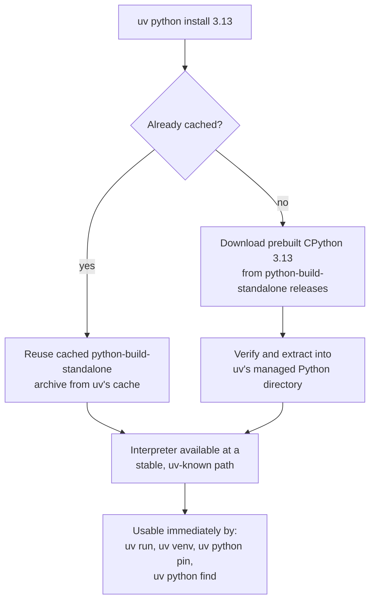
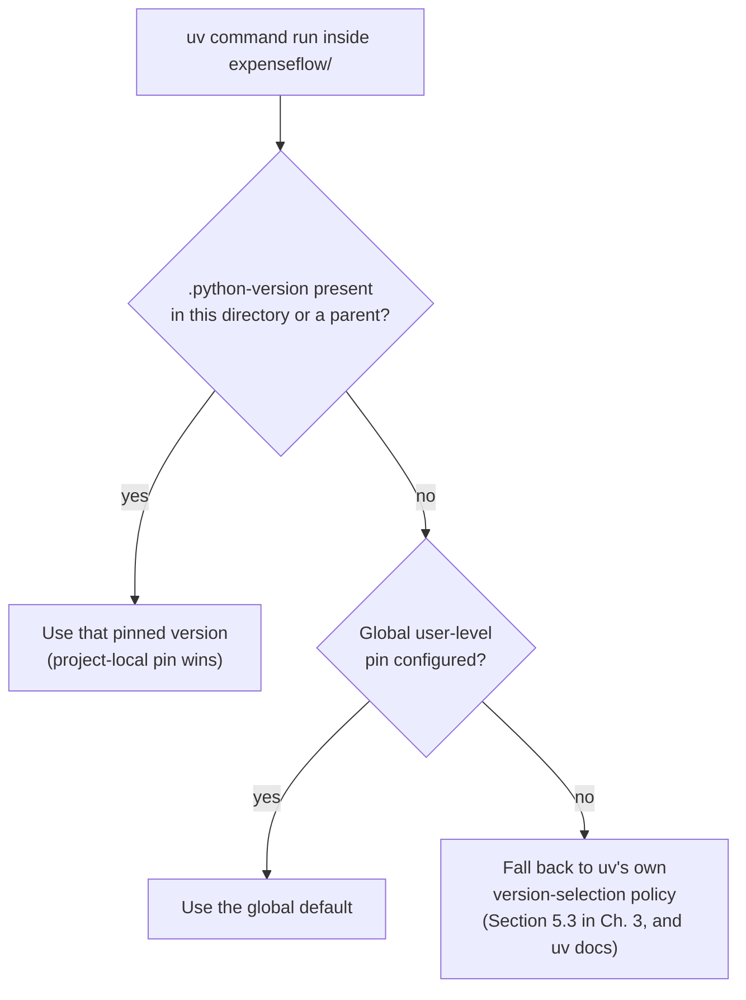

# Python Version Management

[Chapter 3](./03-architecture-and-internals.md) opened with a claim worth restating plainly now: uv manages Python interpreters itself, using prebuilt `python-build-standalone` distributions, rather than shelling out to whatever `python3` happens to be first on your `PATH`. That was described at the architecture level — *how* uv fetches and stores interpreters. This chapter is where you actually use that machinery: installing specific Python versions, listing what's available, pinning a project to an exact version so every teammate and every CI runner resolves to the same interpreter, and understanding precisely how uv decides which Python to use when several are installed at once. By the end, ExpenseFlow will have a `.python-version` file pinning it to Python 3.13, and Priya and Marcus will never again wonder "wait, which Python is this project actually running on?" — a question that, before tools like this existed, caused more wasted debugging hours across the Python ecosystem than almost any other single source of confusion.

---

## Learning Objectives

By the end of this chapter, you will be able to:

- Install one or more specific Python versions with `uv python install`, without touching the operating system's Python or any system package manager.
- List installed and installable Python versions with `uv python list`, and explain what distinguishes an "installed" entry from a merely "available" one.
- Pin a project to an exact Python version with `uv python pin`, and explain what the resulting `.python-version` file does and does not affect.
- Distinguish a project-local pin from a user-level global pin, and explain which one wins when both exist.
- Use `uv python find` to answer "which interpreter would uv actually use here?" without running any other command.
- Explain, concretely, how uv's Python management model replaces `pyenv` — what problem `pyenv` solved, and how uv solves the same problem with a fundamentally different mechanism.
- Install and run multiple Python versions side by side on one machine without version conflicts.
- Justify, for ExpenseFlow specifically, the choice of Python 3.13 and the decision to pin it explicitly rather than relying on "whatever's installed."

---

## Prerequisites for This Chapter

This chapter builds directly on [Chapter 3: Architecture & Internals](./03-architecture-and-internals.md). We assume you already know:

- That uv installs Python interpreters from `python-build-standalone` — prebuilt, self-contained interpreter distributions — rather than compiling Python from source or depending on whatever the operating system ships.
- That uv's global cache is content-addressable and shared across projects, which is the same underlying mechanism (Chapter 3, Section 2) that makes installing a *second* Python version, or reusing one across many projects, cheap rather than a from-scratch build every time.
- Basic familiarity with the command line and with the general idea that "a Python project needs a specific Python version" from [Chapter 2: Core Concepts](./02-core-concepts.md).

You do not need any prior experience with `pyenv` to follow this chapter, though if you have used it, Section 5's comparison will feel especially concrete.

---

## 1. Why Python Version Management Is Its Own Problem

It is tempting to assume "Python version management" just means "have Python installed." In practice, professional Python development runs into version management friction constantly, for reasons that have nothing to do with negligence:

- **Different projects genuinely need different Python versions.** ExpenseFlow targets Python 3.13 today, but a legacy internal tool the same team maintains might still be pinned to 3.10 because one of its dependencies hasn't been updated for newer versions yet. A single machine — a developer's laptop, a CI runner — needs to satisfy both simultaneously.
- **Operating systems ship a Python you should not touch.** Many Linux distributions use their system Python for OS-level tooling (package managers, system scripts). Installing packages into it, or upgrading it out from under the OS, can break the operating system itself. Relying on "whatever `python3` resolves to on this machine" is fragile even when it happens to work today.
- **"Works on my machine" often reduces to "different Python version on my machine."** A subtle standard-library behavior change, a C-extension wheel that's only prebuilt for certain Python versions, or a syntax feature introduced in a specific minor version can all produce behavior that varies purely based on interpreter version — independent of any dependency version at all.
- **New team members and CI runners need to reproduce the exact same interpreter**, not just "a reasonably modern Python 3." Without an explicit, tooling-enforced pin, this is left to a README instruction that's easy to skip and impossible to verify automatically.

### 1.1 "Why not just use Docker for this?"

A reasonable objection, worth addressing directly since it comes up in nearly every team discussion about Python version management: doesn't containerizing ExpenseFlow (Chapter 14) already pin the Python version, making local version management redundant? The answer is no, for a practical reason — Docker solves this for *runtime* and *CI*, but a developer editing code, running a linter, or running the test suite locally almost always wants a fast, native feedback loop, not a container rebuild on every change. `mypy`, `pytest`, and an editor's language server all want to run directly against a real, local interpreter with the project's dependencies installed, not shelled out into a container. Docker and local Python version pinning solve overlapping but distinct problems, and ExpenseFlow's team uses both: `.python-version` for the fast local loop this chapter covers, and a pinned base image in the Dockerfile (Chapter 14) for the deployed artifact — the two are kept in sync deliberately, not treated as substitutes for each other.

The traditional solution to "I need multiple Python versions on one machine, and I need to pin specific projects to specific versions" was `pyenv`: a shell-based tool that intercepts `python`/`python3` invocations, compiles requested Python versions from source, and switches between them based on shell state or a `.python-version` file it also popularized. `pyenv` worked, and is still in wide use, but it solves the problem with a fairly heavy mechanism — full from-source compilation of CPython, shell shims that intercept every Python invocation, and a fair amount of platform-specific build-dependency fuss (needing OpenSSL headers, `zlib`, `libffi`, and other C build dependencies present before a Python version will even compile). uv solves the exact same underlying problem — multiple pinned Python versions, one machine, no conflicts — with a fundamentally different, dramatically lighter-weight mechanism, detailed next.

---

## 2. Installing Python Versions: `uv python install`

### 2.1 The basic command

```bash
uv python install 3.13
```

This downloads a prebuilt `python-build-standalone` distribution for Python 3.13 (the latest patch release uv knows about, unless you pin further) and stores it in uv's managed Python directory — entirely separate from any system Python, any previously installed uv-managed Python, or any other tool's Python installations. No compilation happens. No system build dependencies (compilers, OpenSSL headers, `zlib`) are required, because you are downloading a finished binary, not building one — this is the same `python-build-standalone` project Chapter 3 introduced, maintained by Astral specifically to give tools like uv a fast, reliable, prebuilt source of interpreters across platforms.

You can be more specific:

```bash
uv python install 3.13.1        # an exact patch version
uv python install 3.12 3.13     # multiple versions in one command
uv python install cpython@3.13  # explicit implementation, same effect as "3.13" today
```

uv defaults to CPython (the reference Python implementation almost everyone means by "Python"), but the `python-build-standalone` project — and therefore uv — also distributes PyPy builds for some versions, addressable the same way (`uv python install pypy@3.10`). ExpenseFlow has no reason to use anything but CPython, so this course does not dwell on alternate implementations further, but it's worth knowing the door is open.

### 2.2 Where installed interpreters live

Installed interpreters are stored under a uv-managed directory — by default something like `~/.local/share/uv/python/` on Linux (the exact path is a `UV_PYTHON_INSTALL_DIR`-configurable detail, and differs slightly by platform) — organized by implementation, version, and platform. This directory is uv's own space: nothing in it is registered with the operating system's package manager, nothing in it modifies `/usr/bin/python3` or any system `PATH` entry by default, and removing a uv-managed Python is as simple as `uv python uninstall <version>` — there's no OS-level package to clean up alongside it.



### 2.3 Installing "the latest 3.13" versus pinning a patch version

By default, `uv python install 3.13` tracks the latest known 3.13.x patch release at the time you run it. If you re-run `uv python install 3.13` months later, after new patch releases exist, uv installs the newer patch alongside (not instead of) the older one, unless you explicitly ask it to upgrade in place. For most day-to-day work this nuance doesn't matter — patch releases are meant to be safe, backward-compatible bugfix updates — but Section 6 explains exactly how ExpenseFlow's pin interacts with this, so the whole team stays on one *specific* interpreter rather than silently drifting across patch releases at different times.

---

## 3. Discovering What's Installed and What's Available

```bash
uv python list
```

Sample output (illustrative — exact formatting and available versions change over time as new releases ship):

```
cpython-3.13.1-linux-x86_64-gnu     <download available>
cpython-3.13.0-linux-x86_64-gnu     ~/.local/share/uv/python/cpython-3.13.0-linux-x86_64-gnu/bin/python3.13
cpython-3.12.7-linux-x86_64-gnu     ~/.local/share/uv/python/cpython-3.12.7-linux-x86_64-gnu/bin/python3.12
cpython-3.11.10-linux-x86_64-gnu    ~/.local/share/uv/python/cpython-3.11.10-linux-x86_64-gnu/bin/python3.11
cpython-3.10.15-linux-x86_64-gnu    /usr/bin/python3.10
```

Reading this table is a genuinely useful skill:

| Entry | What it means |
|---|---|
| `cpython-3.13.1-...  <download available>` | A version uv *knows how to install* but hasn't installed yet on this machine — running `uv python install 3.13.1` would fetch it. |
| `cpython-3.13.0-... ~/.local/share/uv/python/...` | A version uv has already installed and manages itself, at a path under its own managed directory. |
| `cpython-3.10.15-... /usr/bin/python3.10` | A Python interpreter uv *discovered* on the system (installed by the OS, not by uv), which uv can use if asked to, but does not manage — uv can't upgrade or remove this one the way it can its own managed installs. |

This distinction — uv-managed versus system-discovered — matters because it explains a question every new uv user eventually asks: "why does `uv python list` show a Python I never installed with uv?" The answer is that uv is happy to *use* a pre-existing system Python if you point a project at it, but it will never silently modify or uninstall one, because it didn't install it and doesn't consider it its own.

Add `--all-versions` to see every patch release uv knows about for each minor version, or `--only-installed` to filter the list down to just what's actually present on this machine — useful in scripts or CI diagnostics where you want a clean, unambiguous "what do we actually have" answer.

---

## 4. Pinning a Version: `uv python pin`

### 4.1 What the command does

```bash
cd expenseflow
uv python pin 3.13
```

This writes a single-line file, `.python-version`, into the current directory:

```
3.13
```

That's the entire mechanism. `.python-version` is a plain text file — no TOML, no special syntax — containing a version constraint. When you run any `uv` command from within (or below) this directory, uv reads `.python-version` and uses it to select the interpreter for this project, without you needing to specify `--python 3.13` on every command.

### 4.2 Project-local versus global (user-level) pins

There are two places a pin can live, and the distinction genuinely matters for a team:

| Pin location | Scope | Command | Typical use |
|---|---|---|---|
| `<project>/.python-version` | This one project directory (and anything below it) | `uv python pin 3.13` (run inside the project) | The normal case — ExpenseFlow pins 3.13 for itself, committed to version control so every teammate/CI gets the same pin automatically. |
| `~/.config/uv/... ` (user-level default) | Every uv command run outside any pinned project | `uv python pin --global 3.13` | A personal default for ad-hoc scripts and projects that have no pin of their own — not something you'd expect a teammate to inherit, since it lives outside version control entirely. |

Precedence is exactly what you'd hope: **a project-local `.python-version` always wins over a global default**, and an explicit `--python` flag on a specific command wins over both. This means ExpenseFlow's committed `.python-version` is authoritative for anyone who clones the repository, regardless of whatever personal global default they've set for their own unrelated scripts.



### 4.3 Why commit `.python-version` to version control

`.python-version` is a plain text file, trivially diffable, and — unlike a `pyenv`-managed shell state or an environment variable someone forgot to document — it travels with the repository. Committing it means:

- A new engineer cloning ExpenseFlow, with only uv installed and no Python of any specific version, can run `uv sync` (Chapter 6 previews this, Chapter 8 covers it fully) and uv will notice the pin, install 3.13 automatically if it isn't already present, and set up the environment against exactly that version.
- CI reads the same file and pins the same version — no separate CI-only configuration needed to keep the CI Python version in sync with what developers use locally.
- A version bump (say, moving the whole team to 3.14 once it's released and validated) is a one-line diff to `.python-version`, reviewable in a pull request like any other change, rather than a verbal "hey everyone update your local Python" instruction that inevitably some people miss.

---

## 5. Resolving the Question Directly: `uv python find`

Sometimes you don't want to run a whole command — you just want to know, right now, which interpreter uv *would* use if you did. That's exactly what `uv python find` answers:

```bash
$ cd expenseflow
$ uv python find
/home/priya/.local/share/uv/python/cpython-3.13.1-linux-x86_64-gnu/bin/python3.13
```

This respects the exact same resolution order described in Section 4.2 — project pin, then global pin, then uv's fallback policy — and prints the absolute path to the interpreter that would be selected. It's a genuinely useful diagnostic command: if a build is behaving unexpectedly and you suspect the wrong Python is in play, `uv python find` gives you a definitive, no-side-effects answer in under a second, without needing to start a REPL or inspect a virtual environment's internals.

You can also ask it about a hypothetical constraint you haven't pinned yet — `uv python find ">=3.11,<3.13"` reports which installed interpreter (if any) satisfies that range, which is useful when you're deciding what a library's supported-version floor should be (a concern that becomes directly relevant once `expenseflow-shared` exists as a library in Chapter 12).

---

## 6. How This Replaces `pyenv`, Concretely

The comparison is worth making point by point, because "uv replaces pyenv" is a real, specific claim, not a vague marketing line:

| Concern | `pyenv` | `uv python` |
|---|---|---|
| How a new Python version is obtained | Compiled from source on your machine (needs a C compiler, OpenSSL/`zlib`/`libffi` headers, and takes real wall-clock time — often minutes) | Downloaded as a prebuilt `python-build-standalone` binary (seconds, no build toolchain required) |
| How version switching works | Shell shims (`~/.pyenv/shims/python`) that intercept every invocation and dispatch based on shell state or a `.python-version` file `pyenv` itself introduced | uv reads `.python-version` (or an explicit `--python` flag) directly and launches the correct interpreter — no shell shim layer, no `PATH` rewriting |
| Per-project pinning | `.python-version` file (the same filename and format uv adopted, deliberately, for compatibility) | `.python-version` file — same file, same format |
| Global default | `pyenv global <version>` | `uv python pin --global <version>` |
| Managing multiple installed versions | `pyenv versions`, `pyenv install <version>`, `pyenv uninstall <version>` | `uv python list`, `uv python install <version>`, `uv python uninstall <version>` |
| Extra tools needed | A separate tool entirely, installed and configured independently of your package manager | Built into the same `uv` binary you already use for dependencies, venvs, and locking |
| Shell integration required | Yes — `pyenv init` wires shell hooks into your `.bashrc`/`.zshrc` | No shell hooks required — `uv` is a plain executable; environment/version selection happens per-invocation |

The practical upshot: if you already know `pyenv`, `.python-version` is a concept you can carry over unchanged — uv deliberately kept the same filename so existing muscle memory and even existing repositories with a `pyenv`-authored `.python-version` file continue to work without modification. What changes is *how* the version gets onto your machine (a fast download instead of a source compile) and *how* it gets selected (no shell shim layer to reason about, debug, or accidentally misconfigure).

---

## 7. `requires-python`: The Other Half of Version Pinning

`.python-version` is not the only place a Python version constraint lives once a project has a `pyproject.toml` (Chapter 5 covers the file in full). The `[project]` table carries its own `requires-python` field:

```toml
[project]
name = "expenseflow"
requires-python = ">=3.13"
```

It is worth being precise about how these two mechanisms differ, because they answer genuinely different questions and both matter:

| Mechanism | Question it answers | Format | Enforced by |
|---|---|---|---|
| `.python-version` | "Which *exact* interpreter should uv use when I run a command in this directory, right now?" | A single version or range, e.g. `3.13` | `uv run`, `uv sync`, `uv venv` — uv's own tooling |
| `pyproject.toml`'s `requires-python` | "Which Python versions is this *package* declared to support, as metadata?" | A PEP 621 version specifier, e.g. `>=3.13` | The resolver (Chapter 7) — it refuses to select dependency versions incompatible with this range, and refuses to build/install the project itself on an interpreter outside the range |

For an *application* like ExpenseFlow, the two are set up to agree with each other by convention: `.python-version` pins the one interpreter the team actually develops and deploys against (`3.13`), while `requires-python = ">=3.13"` tells the resolver "don't consider dependency versions that dropped support for 3.13 or older, and refuse to install this project on anything older than 3.13." They are not, however, the same mechanism wearing two hats — `requires-python` is standards-based project metadata (part of PEP 621, portable to any PEP 621-aware tool, not uv-specific), while `.python-version` is a uv/`pyenv`-style convenience file with no meaning to, say, a plain `pip install` run elsewhere. A *library* like the future `expenseflow-shared` (Chapter 12) cares much more about `requires-python` being a wide, honest range (`>=3.11`, say) than about pinning one exact development interpreter, since a library needs to work correctly for consumers on whatever Python version *they've* chosen — a distinction Chapter 16 returns to when `expenseflow-shared` is published as its own package.

---

## 8. Version Preference and Environment Variables

Two environment variables are worth knowing about even though most day-to-day work never needs them, because they explain behavior you might otherwise find surprising:

- **`UV_PYTHON`** — forces uv to use a specific interpreter for every command, overriding `.python-version`, global pins, and uv's own discovery entirely, for the lifetime of that environment variable. Useful for a one-off CI job or debugging session where you deliberately want to override a project's pin ("does this bug still reproduce on 3.12?") without editing any file.
- **`UV_PYTHON_INSTALL_DIR`** — overrides where `uv python install` stores interpreters, useful in CI environments or containers where you want managed Pythons cached at a specific, predictable path (Chapter 15 revisits this for CI cache configuration).
- **`UV_PYTHON_PREFERENCE`** — controls whether uv prefers its own managed installations or system-discovered interpreters when both could satisfy a constraint and neither is pinned explicitly. The default (`managed`, preferring uv's own installs) is what almost every project wants, since it keeps behavior consistent regardless of what happens to be installed on the underlying OS.

```bash
# Temporarily check ExpenseFlow's test suite against 3.12, without touching .python-version:
UV_PYTHON=3.12 uv run pytest
```

This pattern — an environment variable override for a single invocation — is a good habit to reach for instead of editing `.python-version` back and forth for a quick experiment; it leaves zero trace in the working directory and can't accidentally end up committed.

---

## 9. Multiple Versions, Side by Side, No Conflicts

Because each `uv python install` puts a version in its own directory under uv's managed Python directory, having several versions installed simultaneously is the normal, unremarkable case — not a special configuration:

```bash
uv python install 3.11 3.12 3.13
uv python list --only-installed
```

```
cpython-3.13.1-linux-x86_64-gnu     ~/.local/share/uv/python/cpython-3.13.1-linux-x86_64-gnu/bin/python3.13
cpython-3.12.7-linux-x86_64-gnu     ~/.local/share/uv/python/cpython-3.12.7-linux-x86_64-gnu/bin/python3.12
cpython-3.11.10-linux-x86_64-gnu    ~/.local/share/uv/python/cpython-3.11.10-linux-x86_64-gnu/bin/python3.11
```

Three fully independent interpreters, none of them overwriting or shadowing another, none of them requiring any `PATH` juggling on your part. This is directly useful for ExpenseFlow's team: Chapter 15 has CI matrix-test the project across Python 3.11, 3.12, and 3.13 to catch version-specific regressions before they reach production, and that entire matrix works by having each CI job's `uv python install <version>` step pull down just the one version that job needs — no conflict with whatever other jobs or projects are doing on the same runner image.

This also means a developer's laptop can simultaneously have ExpenseFlow pinned to 3.13, a legacy internal tool pinned to 3.10, and a completely unrelated personal project pinned to 3.12 — each project's `.python-version` selects its own interpreter automatically the moment you `cd` into it and run any `uv` command, with zero manual switching step and zero risk of one project's dependency installation polluting another's interpreter.

---

## 10. Pinning Python 3.13 for ExpenseFlow

Bringing this together for the running example: ExpenseFlow's team has decided on Python 3.13 — a deliberate choice, not an arbitrary one. It's the version they've validated their target dependencies against (Chapter 7 adds FastAPI, SQLAlchemy 2.0, and `asyncpg`, all of which support 3.13 cleanly at the time this decision was made), and it gives them a reasonably long support runway before needing to revisit the decision.

```bash
cd expenseflow
uv python install 3.13
uv python pin 3.13
cat .python-version
```

```
3.13
```

Marcus commits `.python-version` alongside the rest of the project scaffold in the same commit that introduces `pyproject.toml` (Chapter 5). From this point forward, every `uv run`, `uv sync`, and `uv venv` invoked from inside the `expenseflow/` directory resolves to Python 3.13 automatically — no flag, no README instruction, no "make sure you're using the right Python" step in onboarding docs that someone will inevitably forget to follow.

### 10.1 Bumping the pin later

Pinning a version is not a one-time, permanent decision — at some point, likely well after this course's later chapters, ExpenseFlow's team will want to move to Python 3.14 (or whatever the current release is by then). The process is deliberately unglamorous:

1. `uv python install 3.14` on a development machine, to get the new interpreter available locally without touching anything else yet.
2. Run ExpenseFlow's full test suite against it manually (`UV_PYTHON=3.14 uv run pytest`, per Section 8's environment-variable override) to catch any version-specific breakage before committing to anything.
3. If (and only if) that's clean, open a pull request that changes exactly two things: `.python-version` (`3.13` → `3.14`) and `requires-python` in `pyproject.toml` if the floor is moving too — both reviewable as an ordinary, small diff.
4. Let CI's version matrix (Chapter 15) confirm the change across every supported version before merging.

Because the pin is a single line in a committed file, "upgrade the team's Python version" is a normal, reviewable, revertible pull request — not a synchronized, out-of-band, "everyone update your machine by Friday" event.

---

## Real-World Scenario

Priya is onboarding a new contractor, Diego, onto ExpenseFlow. Diego's laptop is fresh — he's never worked in Python before this contract, and the only Python present is whatever ships with his OS (an old 3.9, as it turns out). Under the team's *previous* workflow — before they adopted uv's Python management — the onboarding doc said: "Install `pyenv`, then run `pyenv install 3.13.1` (this will take a few minutes and needs build tools installed first — see the troubleshooting appendix if it fails), then `pyenv local 3.13.1` inside the project directory, then create a virtualenv." Diego hits exactly the friction that appendix exists for: his machine is missing `libssl-dev`, the `pyenv install` fails partway through compilation with an OpenSSL-related error, and he spends forty minutes chasing down the right system package before the build even starts.

With uv, the same onboarding step is: "Install uv (Chapter 1's standalone installer), then `cd expenseflow && uv sync`." Because `.python-version` is already committed to the repository pinning 3.13, and because uv installs Python from a prebuilt binary rather than compiling it, `uv sync` (previewed here, detailed in Chapter 8) notices the project needs Python 3.13, notices it isn't present on Diego's machine, silently downloads the prebuilt interpreter in a few seconds, creates the virtual environment against it, and installs every dependency from the lockfile — all from one command, with no build toolchain required on Diego's laptop at all.

Priya's point to the rest of the team afterward is simple: the pin isn't just a nice-to-have for consistency — it's what makes onboarding "one command" instead of "forty minutes in a troubleshooting appendix," and it does so specifically *because* uv sidesteps source compilation entirely.

---

## Best Practices

- **Always pin a project's Python version explicitly** with `uv python pin`, and commit the resulting `.python-version` file — never rely on "whatever Python happens to be first on `PATH`" for anything beyond a disposable, five-minute experiment.
- **Prefer a minor version pin (`3.13`) over an exact patch pin (`3.13.1`)** for most projects, unless you have a specific reason to lock to one patch release — this lets uv pick up safe bugfix patch releases automatically while still guaranteeing the same minor version everywhere.
- **Install Python versions with `uv python install` rather than relying on system-provided interpreters** for anything a project depends on — system Pythons are outside uv's management and can be upgraded or removed by OS updates in ways that break a pinned project underneath you.
- **Use `uv python find` as your first diagnostic step** whenever you suspect "the wrong Python" is involved in a bug — it answers the question directly, in under a second, with no side effects.
- **Keep global pins for personal convenience only** (`uv python pin --global`) — never expect a teammate or CI runner to inherit your global default; every project that matters should carry its own committed pin.
- **Matrix-test across the versions you actually claim to support** (Chapter 15) — a pin guarantees consistency, not correctness across other versions; if ExpenseFlow claims 3.11+ compatibility for `expenseflow-shared` later (Chapter 16), that claim needs CI verification, not just a pin on the main pinned version.
- **Keep `.python-version` and `requires-python` in `pyproject.toml` (Chapter 5) deliberately in agreement for an application** — a pin that contradicts the project's own declared support range is a sign one of the two was updated without the other.

---

## Common Mistakes

- **Never pinning a version at all**, and assuming "it worked on my machine" generalizes — different developers' machines silently use whatever Python each happened to have installed, and version-specific bugs surface only on some machines or only in CI.
- **Confusing a global pin with a project pin**, expecting `uv python pin --global 3.13` on your own machine to somehow propagate to teammates — it does not; it's a personal, uncommitted, local-only default.
- **Manually editing `PATH` or shell profile files to "point at" a specific Python**, re-introducing exactly the shell-shim fragility uv's model is designed to avoid — let `.python-version` and uv's resolution order do this instead of hand-rolled shell logic.
- **Assuming a system-discovered Python (shown in `uv python list` without a uv-managed path) can be uninstalled or upgraded through uv** — uv only manages versions it installed itself; a system Python needs the OS's own package manager.
- **Pinning an exact patch version (`3.13.0`) without a reason**, then being confused when `uv python install 3.13` later doesn't seem to "update" the project — an exact patch pin is intentionally sticky, and needs to be bumped deliberately if you want a newer patch release.
- **Skipping `.python-version` in `.gitignore` by mistake** — this file is meant to be committed; treat it as project configuration, not a local machine artifact.

---

## Summary

- Python version management is a real, recurring source of friction — different projects need different versions, system Pythons shouldn't be touched, and unpinned projects drift silently across machines (Section 1).
- `uv python install <version>` downloads a prebuilt `python-build-standalone` interpreter into uv's own managed directory — no source compilation, no system build dependencies (Section 2).
- `uv python list` distinguishes uv-managed installed versions, downloadable-but-not-yet-installed versions, and system-discovered interpreters uv can use but doesn't own (Section 3).
- `uv python pin <version>` writes a `.python-version` file that scopes a version to a project; a project-local pin always wins over a global (`--global`) default (Section 4).
- `uv python find` answers "which interpreter would be used here?" directly, respecting the same resolution order, with no side effects — a genuinely useful diagnostic (Section 5).
- uv replaces `pyenv`'s from-source compilation and shell-shim interception with prebuilt binaries and direct, per-invocation interpreter selection, while keeping the same `.python-version` filename for continuity (Section 6).
- `requires-python` in `pyproject.toml` and `.python-version` answer different questions — package-metadata version support versus the one exact interpreter uv uses right now — and should agree for an application like ExpenseFlow (Section 7).
- `UV_PYTHON`, `UV_PYTHON_INSTALL_DIR`, and `UV_PYTHON_PREFERENCE` let you override version selection and storage location per-invocation or per-environment without editing any file (Section 8).
- Multiple Python versions coexist on one machine without conflict, each in its own directory — the foundation for CI version matrices (Chapter 15) and multi-project machines alike (Section 9).
- ExpenseFlow pins Python 3.13 via a committed `.python-version`, so every teammate and CI runner resolves to the exact same interpreter automatically (Section 10).

---

## Knowledge Check

1. What does `uv python install 3.13` actually download, and why does this make the command fast even on a machine with no C compiler installed?
2. Explain the difference between an entry in `uv python list` shown with a uv-managed path versus one shown with a path like `/usr/bin/python3.10`.
3. If a project has a `.python-version` file containing `3.12`, and your personal global pin is `3.13`, which version does `uv run` inside that project actually use? Why?
4. Name two concrete mechanical differences between how `pyenv` switches between installed Python versions and how uv does it.
5. Why would a team generally prefer pinning `3.13` (a minor version) over `3.13.1` (an exact patch version) for most projects?
6. A new contractor's laptop has no Python installed of any kind beyond an ancient OS-provided one. Walk through what happens, mechanically, when they run `uv sync` inside a freshly cloned ExpenseFlow repository that already has a committed `.python-version`.
7. What does `uv python find ">=3.11,<3.13"` tell you, and when would this specific form of the command be more useful than the plain `uv python find`?
8. Explain the difference in purpose between `.python-version` and `requires-python` in `pyproject.toml` — why does ExpenseFlow need both rather than just one?

---

## Hands-On Exercise

**Goal:** Install multiple Python versions side by side, pin ExpenseFlow to Python 3.13, and verify uv's resolution behavior directly.

1. **Check what uv already knows about**: run `uv python list` and note which versions (if any) are shown as already installed versus merely downloadable.

2. **Install three versions side by side**: `uv python install 3.11 3.12 3.13`. Confirm all three now show as installed via `uv python list --only-installed`, each with its own distinct path.

3. **Create a project directory** (or reuse an `expenseflow/` directory if you've already run `uv init` from an earlier chapter): `mkdir -p ~/expenseflow && cd ~/expenseflow`.

4. **Pin it to 3.13**: `uv python pin 3.13`, then `cat .python-version` to confirm it contains exactly `3.13`.

5. **Verify resolution with `uv python find`**: run `uv python find` from inside the directory and confirm the printed path points at the 3.13 interpreter you installed in step 2, not 3.11 or 3.12.

6. **Test project-local override**: from a *different*, unrelated directory (one with no `.python-version`), run `uv python pin --global 3.12`, then run `uv python find` both inside and outside the ExpenseFlow directory. Confirm the ExpenseFlow directory still resolves to 3.13 (project pin wins) while the other directory now resolves to 3.12 (falls back to your new global default).

7. **Clean up one version** to see uninstall behavior: `uv python uninstall 3.11`, then re-run `uv python list` and confirm 3.11 is no longer shown as installed (though it should still be shown as downloadable).

8. **Commit the pin**: if this is a real git repository, `git add .python-version && git commit -m "Pin ExpenseFlow to Python 3.13"` — this is the exact commit Marcus makes in Section 10's narrative.

9. **Try a one-off override**: still inside the ExpenseFlow directory, run `UV_PYTHON=3.12 uv run python --version` and confirm it reports 3.12 despite the committed pin — then run plain `uv run python --version` again immediately afterward and confirm it's back to reporting 3.13, proving the override was scoped to that single invocation and left `.python-version` untouched.

---

## Further Reading

- [uv Python Versions (Concepts)](https://docs.astral.sh/uv/concepts/python-versions/) — the official conceptual reference for everything covered in this chapter.
- [uv Guides: Installing Python](https://docs.astral.sh/uv/getting-started/) — getting-started material covering `uv python install` in context.
- [uv CLI Reference: `uv python`](https://docs.astral.sh/uv/reference/cli/#uv-python) — the full command reference for `install`, `list`, `pin`, `find`, and `uninstall`.
- [python-build-standalone (GitHub)](https://github.com/astral-sh/uv) — uv's own repository, linking through to the prebuilt-interpreter project it depends on for Section 2's downloads.
- [Python Packaging User Guide](https://packaging.python.org/) — background on Python versioning and packaging concepts referenced throughout this chapter.

---

<div style="display:flex;justify-content:space-between;align-items:center;">
  <a href="./03-architecture-and-internals.md">← Previous: Architecture & Internals</a>
  <a href="./00-index.md">🏠 Index</a>
  <a href="./05-project-creation-and-structure.md">Next: Project Creation & Structure →</a>
</div>
