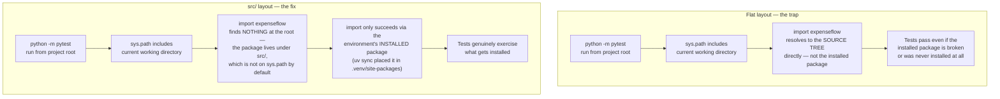
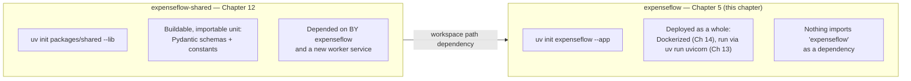

# Project Creation & Structure

[Chapter 4](./04-python-version-management.md) got ExpenseFlow's team to the point where every machine — Priya's laptop, Marcus's laptop, every CI runner — resolves to the exact same Python 3.13 interpreter, pinned via a committed `.python-version`. That solved "which Python," but there is still no project to speak of: no `pyproject.toml`, no source directory, no package named `expenseflow` that anything can `import`. This chapter is where that changes. We'll run `uv init`, read every file it generates line by line, understand why uv defaults to a `src/` layout instead of the flat layout many older tutorials still show, and work through the full anatomy of the `pyproject.toml` that results — the single file that will describe ExpenseFlow's metadata, dependencies, and build configuration for the rest of this course. We'll also settle a question uv asks you to answer explicitly, and that most tools before it left implicit: is this project an *application* or a *library*? Getting that answer right for ExpenseFlow now sets up a clean contrast with `expenseflow-shared`, the library this same team spins out of a workspace in [Chapter 12](./12-workspaces-and-monorepos.md).

---

## Learning Objectives

By the end of this chapter, you will be able to:

- Run `uv init` and explain exactly what files and directories it generates, and why.
- Explain the difference between the `src/` layout and the flat layout, and articulate the concrete import-shadowing bug the `src/` layout structurally prevents.
- Read a generated `pyproject.toml` section by section — `[project]`, `[build-system]`, `[tool.uv]` — and explain the purpose of every field in it.
- Distinguish uv's project *types* (application vs. library) and the `--app`/`--lib`/`--package` flags that select them.
- Explain why ExpenseFlow is scaffolded as an application, and what would be different if it were scaffolded as a library instead.
- Identify what `uv init` scaffolds around the project (`README.md`, `.gitignore`, `.python-version`) and why each exists.
- Initialize ExpenseFlow from scratch with `uv init expenseflow`, ending at a project ready for Chapter 6's virtual environment.

---

## Prerequisites for This Chapter

This chapter builds on:

- [Chapter 2: Core Concepts](./02-core-concepts.md) — the vocabulary of "project," and the standards uv builds on: PEP 621 (`pyproject.toml` metadata) and PEP 508 (dependency specifiers). This chapter is where those standards stop being abstract and become a real file you read and edit.
- [Chapter 4: Python Version Management](./04-python-version-management.md) — ExpenseFlow's `.python-version` file, pinning Python 3.13, already exists and will sit alongside the files this chapter generates.

You'll need `uv` installed (Chapter 1) and Python 3.13 available (Chapter 4) to follow along.

---

## 1. `uv init`: What It Actually Does

`uv init` scaffolds a new Python project: a `pyproject.toml` describing it, a minimal starting source layout, and a few supporting files. It is the uv equivalent of `cargo new` for Rust or `npm init` for Node — a single command that produces a project structure experienced developers in that ecosystem would recognize as "the normal shape," rather than each project inventing its own layout from scratch.

Run without arguments, inside an already-existing empty directory, `uv init` scaffolds the current directory in place:

```bash
mkdir hello-uv && cd hello-uv
uv init
```

```
Initialized project `hello-uv`
```

```
hello-uv/
├── .python-version
├── README.md
├── pyproject.toml
└── src/
    └── hello_uv/
        ├── __init__.py
        └── py.typed
```

(The exact contents of the generated `__init__.py` are minimal — often just a single placeholder function or nothing at all beyond a docstring — and vary slightly across uv versions; what matters is the shape, not the exact boilerplate line count.)

Notice a small but important detail already: the directory was named `hello-uv` (with a hyphen, a fine choice for a directory name and for the PyPI-facing project name), but the Python package underneath `src/` is named `hello_uv` (with an underscore). Hyphens are valid in `pyproject.toml`'s `name` field and in directory names, but they are **not** valid in a Python identifier — you cannot `import hello-uv`. `uv init` handles this translation for you automatically, normalizing the hyphenated project name into a valid underscored package name, which is exactly the same convention PyPI itself uses when normalizing distribution names.

### 1.1 `uv init <name>`: creating a new directory

More commonly, you give `uv init` a name and let it create the directory for you:

```bash
uv init expenseflow
cd expenseflow
```

This is functionally identical to the two-step version above — it creates `expenseflow/`, then scaffolds inside it — but it's the form you'll use almost every time you're starting something genuinely new, and it's the form ExpenseFlow's team actually uses (Section 3).

---

## 2. `src/` Layout vs. Flat Layout

### 2.1 What each one looks like

uv defaults every application project to a **`src/` layout** — the package lives under `src/<package_name>/`, not directly at the project root:

```
expenseflow/                     # src/ layout (uv's default)
├── pyproject.toml
├── src/
│   └── expenseflow/
│       ├── __init__.py
│       └── py.typed
└── tests/
```

versus the older, still-common **flat layout**, where the package sits directly at the project root, a sibling of `pyproject.toml` itself:

```
expenseflow/                     # flat layout (not uv's default)
├── pyproject.toml
├── expenseflow/
│   ├── __init__.py
│   └── py.typed
└── tests/
```

At a glance these look nearly interchangeable — same files, one extra directory level. The actual difference is about what Python's import system sees when you run code from the project root, and that difference has caused a genuinely common, genuinely confusing class of bug for as long as Python packaging tutorials have existed.

### 2.2 The bug the `src/` layout prevents

Python's default import behavior includes the current working directory (or the invoking script's directory) at the front of `sys.path`. In a **flat layout**, that means if you run a command from the project root — `python -m pytest`, or just `python`, started from `expenseflow/` — the `expenseflow/` package directory sitting right there at the root is importable *directly from the working directory*, without the package needing to be installed into the environment at all.

That sounds convenient, and for a five-minute script it is. For a real project, it's a trap: it means your tests, your linter, and your own manual experimentation can all silently import the package **from the source tree directly**, completely bypassing whatever was actually `pip install`-ed or `uv sync`-ed into the virtual environment. If there's a mismatch — a stale installed version, a missing dependency that only matters for the installed package's metadata, an entry point that only gets registered on proper install — a flat-layout project can pass all its local tests while being fundamentally broken for anyone who installs it normally, because "installed" and "importable from the working directory" were never actually tested as the same thing.



The `src/` layout closes this gap structurally, not by convention or discipline. Because the package lives one directory level below the project root, under `src/`, it is simply not present at the root where Python's implicit path insertion looks. The *only* way `import expenseflow` succeeds is if the package has actually been installed into the active environment — exactly what `uv sync` does (Chapter 6 previews this, Chapter 8 details it) — which means your tests, your `uv run` invocations, and a fresh teammate's environment are all, structurally, testing the same thing: the installed package, not an accidental source-tree shortcut.

### 2.3 Why this matters more as a project grows

For a single-file script, this distinction is invisible — there's nothing to accidentally shadow. It starts mattering the moment a project has:

- **A `tests/` directory** that imports the package under test — flat layout risks tests silently importing the working tree instead of the installed artifact, especially once the project has entry points, compiled extensions, or generated files that only exist post-install.
- **Multiple similarly-named things** in the same repository — a workspace member and a same-named directory, a script also called `expenseflow.py` at the root — where flat layout's implicit root-relative imports can resolve to the wrong thing entirely, silently.
- **A packaging/publishing goal** (Chapter 16) — a project that's only ever been run from its own source tree, never truly installed, tends to accumulate hidden assumptions ("oh, that file needs to be a sibling of the package root") that only surface once you try to actually build and install a wheel elsewhere.

This is precisely why the Python Packaging Authority's own packaging guidance, and uv following it, treats `src/` layout as the sane default for anything meant to be genuinely installed and distributed — which, per Section 4, an *application* like ExpenseFlow still is, even though it's never published to PyPI.

### 2.4 When flat layout is still fine

uv does not forbid the flat layout — `uv init --no-src-layout` (or simply moving the package directory up a level yourself) still works, and some teams prefer it for the shortest possible path from clone to "poke around in a REPL." It's a reasonable choice for a genuinely tiny, throwaway script collection that will never be packaged, installed elsewhere, or tested against an installed artifact. ExpenseFlow is none of those things — it's a real application with tests, a real deployment target (Chapter 14's Docker image), and a real team — so this course keeps uv's `src/` default throughout.

---

## 3. Scaffolding ExpenseFlow

With `.python-version` already in place from Chapter 4, Marcus runs:

```bash
uv init expenseflow --app
cd expenseflow
```

(`--app` is shown explicitly here for clarity — it's also uv's default project type for `uv init <name>`, so `uv init expenseflow` alone produces the identical result. Section 4 explains exactly what `--app` means and why it's the right choice here.)

The result:

```
expenseflow/
├── .git/                       # uv init also runs `git init` if not already a repo
├── .gitignore
├── .python-version              # carried over — Chapter 4's pin, untouched
├── README.md
├── pyproject.toml
└── src/
    └── expenseflow/
        ├── __init__.py
        └── py.typed
```

A detail worth flagging immediately: `uv init` also initializes a git repository in the current directory if one doesn't already exist, and generates a `.gitignore` populated with the standard Python ignores (`__pycache__/`, `*.pyc`, `.venv/`, build artifacts, and so on) plus a uv-specific entry or two. This is a small convenience, but it means Marcus doesn't start ExpenseFlow with an empty or missing `.gitignore` and accidentally commit a `.venv/` directory in the project's very first commit — a genuinely common first-commit mistake in projects scaffolded by hand.

### 3.1 `__init__.py` and `py.typed`

`src/expenseflow/__init__.py` starts out nearly empty — typically just a docstring or a trivial placeholder. `py.typed` is an empty marker file, defined by [PEP 561](https://peps.python.org/pep-0561/), that tells type checkers (`mypy`, Chapter 10) "this package ships its own inline type annotations — trust them, rather than treating this as an untyped third-party package." For an application like ExpenseFlow, this file matters less today (nothing outside the project imports `expenseflow` as a library), but it becomes directly relevant once `expenseflow-shared` (Chapter 12) exists as a genuine library other code imports — a consuming project's `mypy` run respects `py.typed` to decide whether to type-check against `expenseflow-shared`'s real annotations or treat it as opaque.

---

## 4. `pyproject.toml`, Section by Section

Here is the full file `uv init expenseflow --app` produces, annotated:

```toml
[project]
name = "expenseflow"
version = "0.1.0"
description = "Add your description here"
readme = "README.md"
requires-python = ">=3.13"
dependencies = []

[build-system]
requires = ["hatchling"]
build-backend = "hatchling.build"
```

That's genuinely the entire file at this stage — no dependencies yet (Chapter 7 adds the first ones), no dev tooling configuration yet (Chapter 10). Short as it is, every line here is standards-based, meaningful, and worth understanding precisely.

### 4.1 `[project]` — PEP 621 metadata

| Field | Value here | What it means |
|---|---|---|
| `name` | `"expenseflow"` | The project's distribution name — what it would be called if published (Chapter 16). Normalized from whatever you passed to `uv init`. |
| `version` | `"0.1.0"` | The project's current version, following semantic-versioning convention (`MAJOR.MINOR.PATCH`) — bumped manually here, though Chapter 16 discusses dynamic versioning alternatives for published packages. |
| `description` | placeholder text | A one-line human-readable summary — worth replacing immediately with something real, since it's the first thing anyone skimming the file (or a future PyPI page) reads. |
| `readme` | `"README.md"` | Points at the long-form description file, included in a built distribution's metadata (Chapter 16) so tools like PyPI can render it. |
| `requires-python` | `">=3.13"` | The PEP 621 field discussed in [Chapter 4, Section 7](./04-python-version-management.md) — the version floor the resolver (Chapter 7) enforces, distinct from `.python-version`'s single pinned development interpreter. |
| `dependencies` | `[]` | An empty list, exactly matching this course's timeline — Chapter 7 is where `fastapi`, `sqlalchemy`, and the rest get added here via `uv add`, not by hand-editing this list directly (though hand-editing works too; `uv add` additionally updates the lockfile in the same step, which is the real reason to prefer it). |

This entire table is [PEP 621](https://peps.python.org/pep-0621/) — the standard that defines how Python project metadata is expressed in `pyproject.toml`, independent of any specific build tool or package manager. That standards basis is exactly what Chapter 2 flagged as one of uv's core design principles: this `[project]` table means the same thing to uv, to `pip`, to `build`, and to any other PEP 621-aware tool — a deliberate contrast with Poetry's historical `[tool.poetry]` section, which predated PEP 621 and encoded the same kind of metadata in a Poetry-specific, non-portable shape.

### 4.2 `[build-system]` — how this project gets built into a distributable artifact

```toml
[build-system]
requires = ["hatchling"]
build-backend = "hatchling.build"
```

This table — defined by [PEP 517](https://peps.python.org/pep-0517/)/[PEP 518](https://peps.python.org/pep-0518/) — tells any tool that needs to *build* this project (produce a wheel or sdist, Chapter 16) which backend to use and what that backend needs installed first. `uv init` defaults to [Hatchling](https://hatch.pypa.io/latest/), a modern, standards-compliant build backend maintained by the same broader Python packaging community effort behind `pip` and `build` — a sensible, unopinionated default rather than a bespoke uv-specific build system. For ExpenseFlow specifically, an application that's never published as an installable package, this table is nearly inert today — nobody runs `uv build` (Chapter 16) against it. It still needs to exist, though, because `uv sync` (Chapter 6, Chapter 8) itself installs the project into its own virtual environment as an editable install, and *that* step goes through the same PEP 517 build-backend interface, even for a project with no intention of ever being published.

### 4.3 `[tool.uv]` — uv-specific configuration

The freshly generated `pyproject.toml` doesn't yet have a `[tool.uv]` section — there's nothing to configure until later chapters introduce dependency groups, workspace members, or sources overrides. It's worth knowing the section exists and what it's for now, though, since it appears steadily from Chapter 7 onward:

```toml
# Not present yet in ExpenseFlow's pyproject.toml — previewed for context.
# Chapter 7 introduces [dependency-groups]; Chapter 12 introduces
# [tool.uv.workspace] and [tool.uv.sources].
[tool.uv]
# uv-specific settings that have no PEP 621 standard home go here —
# e.g. workspace member declarations, index configuration, or
# source overrides for a dependency pulled from git/a local path
# instead of PyPI.
```

The design principle behind splitting configuration this way is the same standards-first philosophy from Section 4.1: anything that's genuinely portable, standard Python packaging metadata lives in `[project]`/`[build-system]`, governed by PEPs that any tool can read; anything that's specifically about *how uv itself* manages this project — and has no equivalent meaning to `pip` or another tool — lives under the clearly-namespaced `[tool.uv]` table, following the same `[tool.*]` convention every PEP 518-aware tool (Black's `[tool.black]`, Ruff's `[tool.ruff]`, pytest's `[tool.pytest.ini_options]`) already uses to avoid stepping on each other's configuration.

---

## 5. Project Types: Application vs. Library

`uv init` supports three flags that change what gets scaffolded, and — more importantly — what gets built when the project is installed:

| Flag | Project type | `pyproject.toml` difference | Typical use |
|---|---|---|---|
| `--app` (default for `uv init <name>`) | Application | No `[project.scripts]` entry point required; the project is installed for local development but isn't necessarily meant to be built/published as a reusable, importable library elsewhere. | A deployable service — a FastAPI app, a CLI tool run in place, ExpenseFlow itself. |
| `--lib` | Library | Adds packaging metadata oriented around being imported by *other* projects — a real, versioned, buildable/publishable unit meant to sit in another project's `dependencies` list. | An internal shared package like `expenseflow-shared` (Chapter 12), or anything meant to be published to an index (Chapter 16). |
| `--package` | Packaged application | Combines application behavior with being properly buildable into a distributable, installable package — e.g. a CLI tool you want to `pip install`/`uvx` from elsewhere, not just run from its own source tree. | A CLI utility distributed to other machines/users as an installable command, rather than a service deployed as a whole checked-out project. |

The practical distinction that matters most day to day: **`--app` still gets you a fully functional, `uv run`-able, `uv sync`-able project** — the flag is about *packaging intent*, not about whether the project works locally. An `--app` project is not "worse" or "less complete" than a `--lib` project; it's scaffolded for a different destiny. ExpenseFlow is deployed as a whole application (via the Docker image built in Chapter 14) — nobody `pip install`s ExpenseFlow itself into another project's dependency list — so `--app` is the correct, deliberate choice, not a default accepted out of inattention.

### 5.1 The contrast that matters: ExpenseFlow now vs. `expenseflow-shared` later

This distinction is worth holding onto concretely, because Chapter 12 makes it real: when ExpenseFlow's team splits out `packages/shared` as `expenseflow-shared` — a small internal library of Pydantic schemas and constants used by *both* the FastAPI API and a new background-worker service — that new package is scaffolded with `--lib`, not `--app`. The API and the worker each list `expenseflow-shared` as a genuine dependency (a workspace path dependency, specifically), the same way they'd list `pydantic` itself. `expenseflow-shared` needs to be buildable and cleanly importable elsewhere by design; ExpenseFlow the application never does, because nothing ever imports `expenseflow` as a dependency — it is the thing that gets deployed, not the thing that gets depended on.



### 5.2 What actually differs mechanically

It's worth being precise that `--app` vs. `--lib` is not a hard architectural wall — both produce a `src/`-layout, PEP 621-compliant `pyproject.toml`; both can have dependencies, both can be `uv run`, both can technically be built with `uv build` if you wanted to. The difference is in scaffolding defaults and intent signaling: `--lib` projects are scaffolded assuming another project will `import` them, which nudges toward disciplined public API surface (what's exported from `__init__.py`), a meaningful `py.typed` presence for downstream type-checking, and a version number that matters to consumers tracking compatibility. `--app` projects are scaffolded assuming the project itself is the end product a user or a deployment runs, so none of that consumer-facing discipline is emphasized by the tooling — though nothing stops a team from being disciplined about it anyway if they choose to.

---

## 6. README and `.gitignore` Scaffolding

Two more files `uv init` produces are worth a quick, honest look rather than skipping past as "just boilerplate":

`README.md`:

```markdown
# expenseflow
```

That's genuinely it — a one-line placeholder. `uv init` deliberately does not try to guess your project's real description, usage instructions, or badges; it gives you the smallest possible valid file and expects you to write the real one. ExpenseFlow's team replaces this immediately with a real description, setup instructions (`uv sync`, referencing Chapter 6), and a link to the Alembic course for the schema/migration side of the system.

`.gitignore` (abbreviated — the generated file is longer, covering standard Python build artifacts):

```gitignore
# Python-generated files
__pycache__/
*.py[oc]
build/
dist/
*.egg-info/

# Virtual environments
.venv/
```

The single most consequential line for this course's purposes is `.venv/` — Chapter 6 creates ExpenseFlow's virtual environment at exactly that path, and this line ensures nobody accidentally commits a multi-hundred-megabyte environment directory (full of every installed package's files) into version control on their very first commit, a mistake that's genuinely common in hand-rolled project setups that forget this line entirely.

---

## Real-World Scenario

A few weeks after ExpenseFlow is scaffolded, Marcus is reviewing a pull request from a new team member who's adding a small internal `expenseflow-notify` service — a separate email-notification microservice, related to ExpenseFlow but deployed independently. The new team member, having read an older tutorial, scaffolds it with a flat layout by hand: an `expenseflow_notify/` package directory sitting directly at the project root, no `src/` in sight, because "it's simpler and one less directory to type."

Two weeks later, the team member reports a confusing bug: their `pytest` suite passes locally, every single time, but the same commit fails in CI with an `ImportError` for a dependency they're certain is installed. Marcus walks through it with them and finds the root cause in about five minutes: their local `pytest` invocation, run from the project root, was picking up the `expenseflow_notify` package directly from the working directory — via Python's implicit `sys.path` inclusion of the current directory (Section 2.2) — without ever going through the actual installed, `uv sync`-managed environment. Locally, this happened to work because a dependency was present in their **global** site-packages from an unrelated project, shadowing the fact that it was never actually declared in `expenseflow-notify`'s own `pyproject.toml`. CI, running in a clean environment with nothing but what `uv sync` installs, had no such accidental global fallback — and correctly failed, exposing a missing dependency declaration that local testing had been silently hiding for two weeks.

The fix is the one this chapter spent Section 2 justifying at length: re-scaffold `expenseflow-notify` with `uv init --app` (the `src/` default), move the package under `src/expenseflow_notify/`, and re-run the test suite. It now fails locally too — for the *right* reason, immediately — because with the package no longer importable from the bare working directory, `pytest` is forced to import the genuinely `uv sync`-installed version, which correctly lacks the undeclared dependency. Marcus's summary to the team, added to ExpenseFlow's internal engineering wiki afterward: "a project passing its tests locally and failing in CI is often not a CI problem — check whether your local layout is letting you accidentally import from the source tree instead of the installed package first."

---

## Best Practices

- **Let `uv init` scaffold new projects rather than hand-rolling a layout** — you get the `src/` default, a standards-compliant `pyproject.toml`, a sane `.gitignore`, and git initialization for free, consistently, every time.
- **Keep the `src/` layout for anything with tests, a deployment target, or packaging ambitions** — which, per Section 2, is nearly every real project, including applications that are never themselves published.
- **Choose `--app`, `--lib`, or `--package` deliberately, based on whether other code will ever `import` this project** — not out of habit or by accepting whatever the default happens to be without thinking about it.
- **Write a real `description` and `README.md` immediately** rather than leaving `uv init`'s placeholders in place — they're the first things a new teammate (or your future self) reads.
- **Treat `pyproject.toml` as the project's single source of metadata truth** — resist the urge to duplicate project name/version information in other config files when `pyproject.toml` already has a standard, PEP 621 place for it.
- **Verify `.gitignore` includes `.venv/` before your first commit** — even though `uv init` already handles this, it's worth a habitual glance, especially in projects assembled by copying files between repositories rather than via `uv init` itself.

---

## Common Mistakes

- **Hand-rolling a flat-layout package** out of habit from older tutorials, then hitting the exact "tests pass locally, fail in CI" bug walked through in this chapter's Real-World Scenario.
- **Choosing `--lib` for something that will only ever be deployed as a whole application**, adding packaging ceremony (public API discipline, versioning-for-consumers concerns) that has no actual consumer and provides no benefit.
- **Choosing `--app` for something meant to be imported elsewhere**, then being surprised later when integrating it as a dependency into another project is awkward — this is exactly the mismatch Chapter 12 is careful to avoid by scaffolding `expenseflow-shared` as `--lib` from the start.
- **Editing `dependencies = []` by hand instead of using `uv add`** once dependencies exist (Chapter 7) — hand-editing works for the metadata but doesn't update `uv.lock`, leaving the project in a state where `pyproject.toml` and the lockfile disagree.
- **Deleting `py.typed` or forgetting it exists** on a library project, then wondering why consuming projects' type checkers treat a fully-annotated internal package as untyped.
- **Assuming `[build-system]` is irrelevant for an application project that's "never published"** — it's still exercised every time `uv sync` performs an editable install of the project itself, so a broken or missing `[build-system]` table breaks local development, not just publishing.
- **Leaving `uv init`'s placeholder `description` field (`"Add your description here"`) in place indefinitely** — a small thing, but a telling sign a project's metadata was scaffolded and never revisited, which tends to correlate with other neglected housekeeping (stale `README.md`, an unbumped `version`).

---

## Summary

- `uv init` (optionally `uv init <name>`) scaffolds a `pyproject.toml`, a `src/`-layout package, `README.md`, `.gitignore`, and (if needed) a git repository, in one command (Section 1).
- uv defaults to a `src/` layout because it structurally prevents a package from being accidentally importable straight from the project root, forcing tests and tooling to exercise the actually-installed package instead (Section 2).
- ExpenseFlow is scaffolded with `uv init expenseflow --app`, alongside the `.python-version` pin from Chapter 4 (Section 3).
- `pyproject.toml`'s `[project]` table is PEP 621-standard, portable metadata; `[build-system]` (PEP 517/518) declares the build backend (Hatchling, by default) used even for editable installs during `uv sync`; `[tool.uv]` holds uv-specific configuration with no PEP-standard home, introduced starting in Chapter 7 (Section 4).
- `--app`, `--lib`, and `--package` select a project's packaging intent — whether the project is meant to be deployed as a whole (`--app`), imported by other projects (`--lib`), or distributed as an installable CLI tool (`--package`) (Section 5).
- ExpenseFlow is `--app` because nothing ever imports it as a dependency; the future `expenseflow-shared` (Chapter 12) is `--lib` because both the API and a worker service depend on it directly (Section 5.1).
- `README.md` and `.gitignore` are scaffolded minimally but meaningfully — `.gitignore`'s `.venv/` entry in particular prevents a common first-commit mistake (Section 6).

---

## Knowledge Check

1. What exactly does `uv init expenseflow` create, and which of those files already existed from a previous chapter?
2. Explain, precisely, why a flat-layout package can be imported successfully even without being installed into any virtual environment, while a `src/`-layout package cannot.
3. Walk through the `[project]` table of a freshly generated `pyproject.toml` and explain what each field means and which standard defines it.
4. Why does `[build-system]` matter for ExpenseFlow even though the team never plans to `uv build`/publish ExpenseFlow itself?
5. What is the practical difference between scaffolding a project with `--app` versus `--lib`, and which one does `expenseflow-shared` use in Chapter 12? Why?
6. A teammate's tests pass locally but fail in CI with an import error for a dependency they insist is installed. Based on this chapter, what's the first thing you'd check?
7. Why does `uv init` normalize a hyphenated project name like `hello-uv` into an underscored package name like `hello_uv`?

---

## Hands-On Exercise

**Goal:** Scaffold ExpenseFlow from scratch as an application project, and deliberately reproduce (then fix) the flat-layout import-shadowing bug from this chapter's Real-World Scenario.

1. **Ensure Chapter 4's pin is available.** If you don't already have a `.python-version`-pinned directory from Chapter 4, run `uv python install 3.13` first.

2. **Scaffold ExpenseFlow**: `uv init expenseflow --app`, then `cd expenseflow`. Inspect the generated tree with `find . -not -path './.git/*'` (or `tree -a -I .git`) and confirm it matches Section 3's layout.

3. **Read the generated `pyproject.toml` in full** and, for each field under `[project]`, write a one-sentence note in your own words explaining what it does — compare your notes against Section 4.1's table afterward.

4. **Reproduce the import-shadowing bug deliberately.** In a separate scratch directory, create a flat-layout package by hand: `mkdir -p flat-demo/demo_pkg && cd flat-demo`, add a trivial `demo_pkg/__init__.py` containing `import nonexistent_dependency`, and a minimal `pyproject.toml` (`dependencies = []`, no `nonexistent_dependency` listed anywhere). From the `flat-demo/` root, run `python -c "import demo_pkg"` — it will fail, correctly, because `nonexistent_dependency` genuinely isn't installed anywhere on your system either. Now `pip install <any small real package>` globally under a name you alias as `nonexistent_dependency` is impractical to fake cleanly — instead, simply confirm the opposite direction: verify that `python -c "import demo_pkg"` succeeds *without any install step at all*, purely because you're running Python from a directory where `demo_pkg/` sits at the root. That success-with-nothing-installed is exactly the trap Section 2.2 describes.

5. **Contrast with the `src/` layout.** Move `demo_pkg` under `flat-demo/src/demo_pkg`, and re-run `python -c "import demo_pkg"` from `flat-demo/` root. Confirm it now fails with `ModuleNotFoundError`, because `src/` is not on `sys.path` by default — the only way to make the import succeed again is a real `uv sync`/editable install, which is precisely the point.

6. **Back in `expenseflow/`, replace the placeholder `README.md`** with a short real description of ExpenseFlow (two or three sentences, referencing the Alembic course for the schema side), and commit your scaffold: `git add -A && git commit -m "Scaffold ExpenseFlow with uv init --app"`.

---

## Further Reading

- [uv Concepts: Projects](https://docs.astral.sh/uv/concepts/projects/) — the official reference for `uv init`, project structure, and project types.
- [uv Getting Started Guide](https://docs.astral.sh/uv/getting-started/) — a walkthrough covering `uv init` in the context of a first project.
- [PEP 621 – Storing project metadata in pyproject.toml](https://peps.python.org/pep-0621/) — the standard behind the `[project]` table dissected in Section 4.1.
- [Python Packaging User Guide: src layout vs. flat layout](https://packaging.python.org/en/latest/discussions/src-layout-vs-flat-layout/) — the authoritative, tool-agnostic discussion of the layout tradeoff covered in Section 2.
- [Hatchling Documentation](https://hatch.pypa.io/latest/) — the build backend uv selects by default in `[build-system]`.

---

<div style="display:flex;justify-content:space-between;align-items:center;">
  <a href="./04-python-version-management.md">← Previous: Python Version Management</a>
  <a href="./00-index.md">🏠 Index</a>
  <a href="./06-virtual-environments.md">Next: Virtual Environments →</a>
</div>
