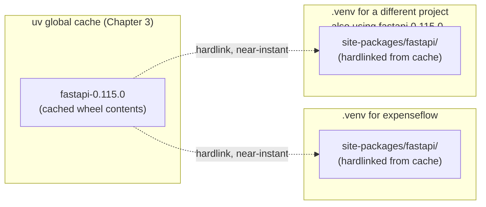
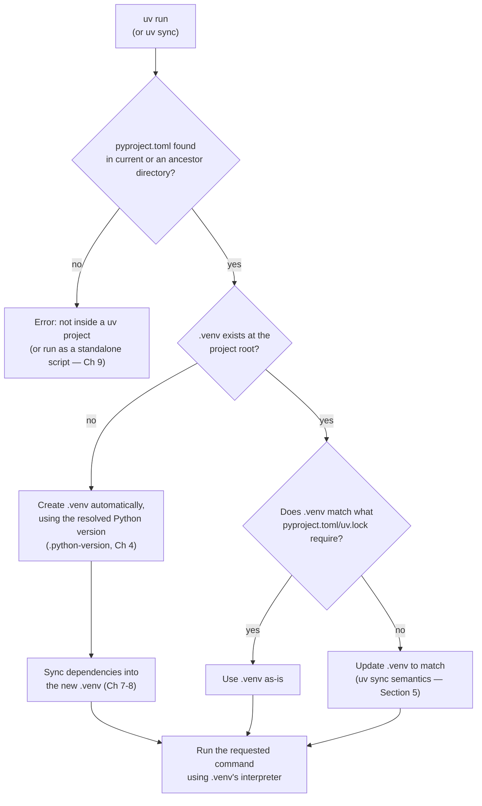
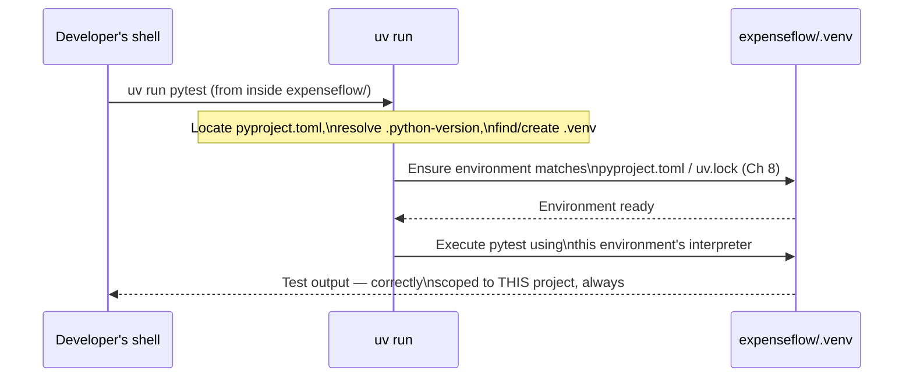
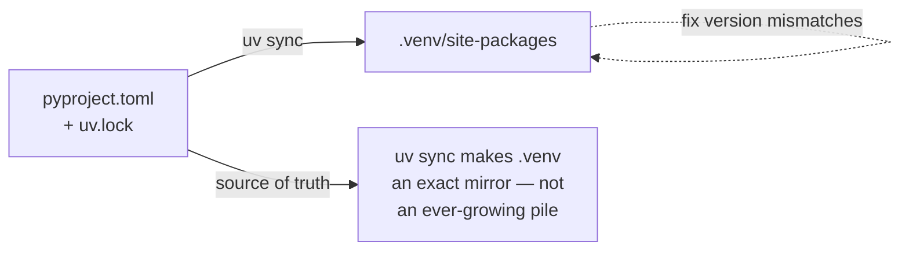

# Virtual Environments

[Chapter 5](./05-project-creation-and-structure.md) left ExpenseFlow as a scaffolded project — a `pyproject.toml`, a `src/expenseflow/` package, a pinned `.python-version` — with no dependencies declared and, notably, no virtual environment created yet. That last gap is this chapter's subject. We're going to create ExpenseFlow's environment, understand exactly what `.venv/` is and how uv finds it automatically without you ever running `source .venv/bin/activate`, and see precisely how `uv run` and `uv sync` cooperate to guarantee that whatever command you run always executes against an environment that actually matches the project's declared dependencies. This chapter is deliberately narrow — no real dependencies exist yet (Chapter 7 adds the first ones) — but the environment model established here is exactly what every later chapter's `uv run`/`uv sync` invocations rely on without further explanation.

---

## Learning Objectives

By the end of this chapter, you will be able to:

- Explain what a virtual environment is and why Python projects need one, in your own words.
- Create a virtual environment explicitly with `uv venv`, and explain what ends up inside `.venv/`.
- Explain uv's automatic environment discovery — how `uv run` and `uv sync` locate or create `.venv` without any activation step.
- Contrast `uv run` with manual `source .venv/bin/activate`, and explain precisely why "forgot to activate the venv" stops being a class of bug once `uv run` is your default entry point.
- Explain what `uv sync` does to an environment (previewed here; detailed fully in Chapter 8) and why it's a distinct operation from creating a bare `.venv`.
- Inspect an existing environment's installed packages using `uv pip list` and `uv pip show`.
- Diagnose a "wrong environment" or "stale environment" problem using the tools from this chapter alone.

---

## Prerequisites for This Chapter

This chapter assumes you've completed:

- [Chapter 4: Python Version Management](./04-python-version-management.md) — ExpenseFlow's `.python-version` pin (3.13) already exists and determines which interpreter any environment created in this chapter is built against.
- [Chapter 5: Project Creation & Structure](./05-project-creation-and-structure.md) — ExpenseFlow's `pyproject.toml` and `src/expenseflow/` package already exist; this chapter creates the environment those files will eventually be installed into.
- [Chapter 3: Architecture & Internals](./03-architecture-and-internals.md)'s description of uv's global, content-addressable cache — this chapter explains how that cache interacts with a specific project's `.venv/` to make environment creation and package installation fast.

---

## 1. What a Virtual Environment Actually Is

Before uv-specific mechanics, it's worth being precise about the underlying concept, since the rest of this chapter builds directly on it. A **virtual environment** is an isolated directory containing its own Python interpreter (or, in most modern implementations, a lightweight reference to one) and its own `site-packages` directory — the location where installed third-party packages live. Installing a package "into" a virtual environment means it becomes importable only when that specific environment's interpreter is the one running your code; it does not affect any other environment, and it does not affect whatever Python packages might be installed system-wide.

This isolation solves a problem that is easy to underestimate until you've been bitten by it: without it, every Python project on a machine would share one global pool of installed packages, and two projects needing different versions of the same dependency — SQLAlchemy 1.4 for a legacy tool, SQLAlchemy 2.0 for ExpenseFlow — would be structurally unable to coexist on the same machine at all. A virtual environment gives each project its own private, disposable dependency install location, so ExpenseFlow's SQLAlchemy 2.0 and a legacy tool's SQLAlchemy 1.4 can both exist, on the same machine, simultaneously, without either project ever seeing the other's packages.

Historically, creating and managing this isolation was the job of the standard library's `venv` module (or the older third-party `virtualenv`), used together with `pip` for installing packages inside it, and typically a shell command (`source .venv/bin/activate`) to tell your current shell session "use this environment's interpreter and packages by default from now on." uv folds all three of those responsibilities — creating the environment, installing packages into it, and deciding which environment a given command should use — into itself, with a meaningfully different day-to-day interaction model, which the rest of this chapter walks through.

---

## 2. Creating an Environment Explicitly: `uv venv`

```bash
cd expenseflow
uv venv
```

```
Using CPython 3.13.1
Creating virtual environment at: .venv
Activate with: source .venv/bin/activate
```

This creates a `.venv/` directory at the project root, built against whichever Python interpreter Chapter 4's resolution order selects — here, the `.python-version`-pinned 3.13. uv defaults to the name `.venv` (matching the near-universal convention across the Python ecosystem, including what `venv`/`virtualenv` themselves default to), and defaults to placing it at the project root, though both are configurable (`uv venv --python 3.12 .venv-py312` for an alternate environment, useful for manually testing against a second version).

### 2.1 What's actually inside `.venv/`

```
.venv/
├── bin/                     # (Scripts/ on Windows)
│   ├── python -> python3.13     # symlink to the real interpreter
│   ├── python3 -> python3.13
│   ├── python3.13 -> ~/.local/share/uv/python/cpython-3.13.1-.../bin/python3.13
│   └── activate                 # the shell script Section 4 discusses
├── lib/
│   └── python3.13/
│       └── site-packages/       # installed packages land here
├── pyvenv.cfg                   # metadata: which base interpreter, uv version, etc.
└── CACHEDIR.TAG                  # marks this directory as safely excludable from backups/search tools
```

`pyvenv.cfg` is a small but important file — it's the standard marker (defined by [PEP 405](https://peps.python.org/pep-0405/)) that identifies a directory as a virtual environment and records which base interpreter it was created from:

```ini
home = /home/priya/.local/share/uv/python/cpython-3.13.1-linux-x86_64-gnu/bin
implementation = CPython
version_info = 3.13.1
uv = 0.5.11
include-system-site-packages = false
```

Notice `bin/python3.13` is a symlink (on Linux/macOS; a copy on Windows, which lacks the same symlink semantics) pointing back at the actual interpreter binary living in uv's managed Python install directory (Chapter 4, Section 2.2) — not a private, duplicated copy of the entire CPython installation. This is exactly the hardlink/shared-cache philosophy Chapter 3 described applied one level up: the interpreter itself isn't duplicated per environment, only referenced. What *is* specific to this `.venv/` is `site-packages/` — the directory where this project's specific installed dependencies live, isolated from every other environment on the machine.

### 2.2 Where installed packages actually come from

When a package later gets installed into `.venv/lib/python3.13/site-packages/` (Chapter 7's `uv add` triggers this), uv doesn't necessarily copy the package's files from scratch — per Chapter 3, Section 2, it links them from uv's global, content-addressable cache using hardlinks (or copy-on-write reflinks, filesystem permitting). This is why creating a fresh `.venv` and installing a dependency that's already cached from an unrelated project on the same machine is close to instantaneous: the bytes are already sitting in the cache, and linking them into a new environment's `site-packages` is a cheap filesystem operation, not a network download or a full copy.



---

## 3. Automatic Environment Discovery

Here is the detail that changes day-to-day habits the most: **you almost never need to run `uv venv` yourself.** `uv run` and `uv sync` both perform automatic environment discovery — if `.venv/` doesn't exist yet in the project, they create it, built against the correct pinned Python version, without being asked to explicitly.

```bash
cd expenseflow
# No .venv exists yet at all
uv run python --version
```

```
Using CPython 3.13.1
Creating virtual environment at: .venv
Python 3.13.1
```

One command, and an environment matching `.python-version` now exists — no separate "first create the venv, then activate it, then run your command" sequence. If `.venv/` already exists and already matches what the project needs, `uv run` simply uses it, silently, with no extra output at all.

### 3.1 How discovery actually works

uv looks for `.venv/` starting at the current directory and, if not found there, does **not** search upward through parent directories the way it searches for `.python-version` and `pyproject.toml` — a virtual environment is treated as belonging specifically to the project whose root you're standing in, found via the presence of `pyproject.toml` (or an explicit `--project` flag), not inherited implicitly from some unrelated parent directory's environment. This is a deliberate, important distinction from `.python-version`'s upward-searching behavior (Chapter 4, Section 4.2): a *Python version pin* is meant to apply to everything nested below it, but a *virtual environment*, full of one specific project's installed dependencies, should never be silently reused by an unrelated nested project that happens to share a parent directory.



---

## 4. `uv run` vs. Manual Activation

### 4.1 The traditional workflow

Before tools like uv, the standard workflow for running anything inside a project's virtual environment was:

```bash
source .venv/bin/activate     # modifies the CURRENT SHELL's PATH and prompt
python app/main.py
# ... work for a while ...
deactivate                     # when you're done, restore the shell
```

`source .venv/bin/activate` works by mutating your current shell session: it prepends `.venv/bin` to `$PATH` (so bare `python` resolves to this environment's interpreter instead of whatever was there before) and typically changes your shell prompt to show the active environment's name, as a visual reminder. Every command you type in that shell session, for as long as it stays activated, runs against this environment.

### 4.2 The problem this creates

This is a *stateful, session-scoped* mechanism, and that statefulness is exactly where the friction comes from:

- **It's easy to forget entirely.** Open a new terminal tab, `cd` into a project, and run a command without remembering to activate first — the command silently runs against whatever Python was already first on `PATH` (a different project's environment, or a system Python), often producing a confusing `ModuleNotFoundError` for a package you're certain is installed — because it is installed, just in a different environment than the one that actually ran.
- **It's easy to forget you're still activated.** Finish work in one project, `cd` into a second project, forget to `deactivate` first, and run a command that silently executes against the *first* project's environment — potentially with a completely different set of installed dependency versions, producing behavior that has nothing to do with the second project's actual declared dependencies.
- **It doesn't compose well with scripts, editors, or CI.** A CI job, a cron script, or an editor's "run" button doesn't have an interactive shell session to `source activate` into in the first place — each of those contexts needs its own separate mechanism for locating the right interpreter, layered on top of (or instead of) shell activation.

None of this is a flaw specific to any one person's discipline — it's a structural property of a mechanism that stores "which environment is active" as invisible state in a shell session, disconnected from the actual command being run or the actual directory it's run from.

### 4.3 `uv run`: environment selection scoped to the command, not the shell

```bash
uv run python app/main.py
uv run pytest
uv run alembic upgrade head
```

`uv run` takes a fundamentally different approach: instead of asking you to first mutate your shell's state and then trust that state stays correct, it resolves the correct environment **fresh, for this one invocation**, based purely on the directory you're standing in (Section 3.1's discovery logic) — no shell state involved at all. Every `uv run` command independently answers "what project am I in, and what environment does that project need?" and then executes accordingly.



The practical consequence: **there is no shell state to forget, misremember, or leave stale.** Whether you just opened a fresh terminal, switched from a different project thirty seconds ago, or are running from inside a script that has no interactive shell at all, `uv run <command>` from inside `expenseflow/` always resolves to ExpenseFlow's `.venv`, correctly, every time — because the resolution happens fresh, per invocation, from the filesystem, not from accumulated shell state. This is precisely why Chapter 9 uses `uv run` as the uniform way to launch the FastAPI dev server, run `alembic upgrade head`, and execute the test suite — the same command form works identically whether it's typed by a developer, invoked from a `Makefile`, or run inside a CI job with no interactive shell at all.

### 4.4 Manual activation still works — it's just no longer required

None of this means `source .venv/bin/activate` stops working under uv — it's a perfectly ordinary virtual environment, and activating it manually behaves exactly as it always has, which is occasionally useful for an extended interactive session (a long REPL exploration, for instance) where re-typing `uv run` before every command would be tedious. The difference is that activation is now a **convenience for interactive sessions**, not a **prerequisite for correctness** — every script, every CI job, every teammate's one-off command is correct by default via `uv run`, with manual activation available as an option rather than a trap waiting for whoever forgets it.

---

## 5. `uv sync`: Making the Environment Match the Lockfile

`uv venv` (Section 2) creates an empty environment — an interpreter and an empty `site-packages`, nothing installed. `uv sync` is a different, more powerful operation: it makes `.venv/`'s installed packages **match exactly** what `pyproject.toml` and `uv.lock` declare — installing anything missing, removing anything that shouldn't be there, and upgrading or downgrading anything that's the wrong version. Chapter 8 covers `uv sync` and `uv.lock` in full depth; what matters here, before ExpenseFlow has any dependencies at all, is the model:

```bash
uv sync
```

```
Using CPython 3.13.1
Creating virtual environment at: .venv
Resolved 0 packages in 4ms
Audited 0 packages in 1ms
```

Right now, with `dependencies = []` in ExpenseFlow's `pyproject.toml` (Chapter 5), there's nothing to install — `uv sync` still creates `.venv` if it doesn't exist (the same automatic-discovery behavior from Section 3), confirms there's nothing to resolve, and exits. The moment Chapter 7 adds real dependencies, running `uv sync` again will install exactly those packages (and their resolved transitive dependencies) into `.venv`, and — critically, a distinction Chapter 8 dwells on — running it *again* later, after a dependency is removed from `pyproject.toml`, will actually **uninstall** the now-unlisted package from `.venv`, keeping the environment's contents an exact mirror of what's declared, not an ever-growing accumulation of whatever was ever installed.

This is a meaningful contrast with the traditional `pip install -r requirements.txt` workflow, which only ever *adds* packages — it has no concept of "this package used to be listed and isn't anymore, so remove it." An environment managed by repeated `pip install` calls over a project's lifetime tends to accumulate packages nobody intended to keep; an environment managed by `uv sync` is always an exact, reproducible reflection of the current `pyproject.toml`/`uv.lock` pair, no more and no less.



---

## 6. Inspecting an Environment

Two commands let you look inside `.venv/` without poking at its filesystem layout directly — both deliberately mirror familiar `pip` subcommands, so the transition from `pip list`/`pip show` requires almost no relearning.

### 6.1 `uv pip list`

```bash
uv pip list
```

```
Package    Version
---------- -------
pip        24.0
```

Right now, this shows almost nothing — an essentially empty environment, exactly matching ExpenseFlow's currently-empty `dependencies` list. Once Chapter 7 adds real dependencies, the same command will list every installed package (direct and transitive) along with its resolved version — a quick sanity check for "is what I expect actually installed, right now, in this exact environment."

### 6.2 `uv pip show`

```bash
uv pip show fastapi
```

```
Name: fastapi
Version: 0.115.0
Location: /home/priya/expenseflow/.venv/lib/python3.13/site-packages
Requires: pydantic, starlette, typing-extensions
Required-by: 
```

(Illustrative — this only produces real output once `fastapi` is actually installed, starting in Chapter 7.) `uv pip show` answers a more targeted question than `uv pip list`: exactly which version of one specific package is installed, where its files physically live inside `.venv`, and — genuinely useful when debugging a version-conflict question — what it in turn requires and what else in this environment depends on it.

### 6.3 Why "`uv pip`" and not a top-level `uv list`

The `uv pip` namespace is deliberate: these are the commands uv provides for **pip-compatible, lower-level environment inspection and manipulation**, distinct from uv's higher-level, project-oriented commands (`uv add`, `uv sync`, `uv run`) that operate through `pyproject.toml`/`uv.lock`. `uv pip list`/`uv pip show` read the current state of whatever environment is active or discovered — they're diagnostic tools, not part of the declarative dependency-management workflow. The Common Mistakes section below returns to a real trap this split enables: `uv pip install <package>` (installing directly, bypassing `pyproject.toml` entirely) is also available under this same namespace, and using it out of habit from plain `pip` muscle memory silently desynchronizes the environment from the project's declared dependencies — exactly the kind of drift `uv sync`'s exact-mirror guarantee (Section 5) is designed to prevent.

---

## 7. Overriding Discovery: `VIRTUAL_ENV` and `UV_PROJECT_ENVIRONMENT`

Automatic discovery (Section 3) covers the overwhelming majority of day-to-day use, but two mechanisms are worth knowing about for the less common cases where you need to point uv at a specific environment explicitly rather than letting it infer one:

- **`VIRTUAL_ENV`** — the same environment variable that manual `source .venv/bin/activate` sets in your shell. If uv finds this variable already set when it runs, and it points at a valid virtual environment, uv uses it directly rather than performing its own discovery — which is exactly what makes manual activation (Section 4.4) and `uv run` compatible with each other rather than fighting over which environment is authoritative. If `VIRTUAL_ENV` points somewhere that doesn't match what the project actually needs, uv will warn rather than silently using the mismatched environment.
- **`UV_PROJECT_ENVIRONMENT`** — lets you tell uv to use a specific directory name or path instead of the default `.venv`, for a given project. This is occasionally useful for a project that needs to maintain two or more parallel environments side by side (say, one for Python 3.12 and one for 3.13, for manually verifying compatibility before Chapter 15's CI matrix runs), without one `uv sync` invocation clobbering the other.

```bash
# Point uv at an alternate environment directory for one command,
# without touching the project's default .venv at all:
UV_PROJECT_ENVIRONMENT=.venv-py312 uv run --python 3.12 pytest
```

For ExpenseFlow specifically, neither override is needed in normal operation — one project, one pinned Python version, one `.venv`, discovered automatically every time. They're worth knowing exist for the day a genuinely unusual situation (a manual side-by-side version comparison, an unusual CI caching layout) calls for it.

---

## Real-World Scenario

Priya is debugging a bug report that only reproduces on Marcus's machine: a script that imports `expenseflow.services.currency` throws `ModuleNotFoundError: No module named 'httpx'`, but Marcus insists `httpx` is installed — he can see it in his editor's autocomplete. Priya asks him to run two commands.

First, `uv pip show httpx` — which succeeds, showing `httpx 0.27.0` installed at a path under `.venv/lib/python3.13/site-packages`. That confirms `httpx` genuinely is installed, in *some* environment. Second, Priya asks him to run `which python` versus `uv run which python` — and here's the mismatch: Marcus had, weeks earlier, activated a *different* project's virtual environment in the terminal tab he still had open, and never deactivated it (exactly the failure mode from Section 4.2). His editor's integrated terminal, and his muscle-memory `python script.py` invocation, were both running against that stale, activated environment — one that happened to have `httpx` installed for unrelated reasons — not against ExpenseFlow's actual `.venv`, which, at that point in the project's history, didn't have `httpx` listed as a dependency at all (Chapter 9's own running example, in fact — `httpx` doesn't become a real ExpenseFlow dependency until a one-off script needs it there).

The fix, and the actual point of this scenario, isn't "remember to deactivate carefully" — Priya's advice is simpler: "stop running `python script.py` directly, and start running `uv run python script.py` instead — always, out of habit, everywhere, whether or not you think you're activated." From that point on, Marcus's shell state stops mattering at all. Whatever's active or not active in a given terminal tab, `uv run` resolves ExpenseFlow's environment fresh from the directory he's standing in, every single time — the exact structural fix Section 4.3 described, now applied to a real bug instead of a hypothetical one.

---

## Best Practices

- **Default to `uv run <command>` for everything**, rather than manually activating first — it removes the entire class of "wrong/stale environment" bugs described in Section 4 and this chapter's Real-World Scenario.
- **Let `uv run`/`uv sync` create `.venv` automatically** rather than always running `uv venv` first out of old habit — the explicit command still has its uses (Section 2's `--python`-flagged alternate environments), but it's not a required first step.
- **Use `uv sync` — not ad-hoc `uv pip install`/`pip install` — to change what's in an environment**, once a project has real dependencies (Chapter 7 onward); `uv sync` is what keeps `.venv` an exact mirror of `pyproject.toml`/`uv.lock`.
- **Reach for `uv pip list`/`uv pip show` as your first diagnostic step** whenever "is X actually installed, and where, and what version" is the question — they're faster and more precise than guessing from an editor's autocomplete or a stale memory of what you last ran.
- **Never commit `.venv/` to version control** — Chapter 5's generated `.gitignore` already excludes it; it's a disposable, machine-specific, regeneratable artifact, not project state worth versioning.
- **Treat a `.venv` you're unsure about as disposable** — deleting it and re-running `uv sync` is fast (per Section 2.2's hardlink-from-cache behavior) and is a legitimate, low-cost way to rule out environment corruption as a cause of a confusing bug.

---

## Common Mistakes

- **Running bare `python`/`pip install` out of habit**, relying on manual activation state that may be stale, missing, or pointing at the wrong project entirely — exactly this chapter's Real-World Scenario.
- **Using `uv pip install <package>` directly** to add a dependency instead of `uv add` (Chapter 7) — it installs into `.venv` but does not update `pyproject.toml` or `uv.lock`, so the next `uv sync` run (by a teammate, or in CI) has no idea that package should be there, and may even remove it as "not declared" per Section 5's exact-mirror behavior.
- **Assuming `.venv` must be manually created before anything else works** — leading to unnecessary extra steps or confusion when `uv run`/`uv sync` would have created it automatically, correctly, without being asked.
- **Committing `.venv/` to git**, bloating the repository with a large, entirely machine-specific, regeneratable directory that should never be shared this way.
- **Expecting a `.venv` to be found by searching upward through parent directories**, the same way `.python-version` is (Chapter 4) — it isn't; a virtual environment belongs to exactly the project rooted where `pyproject.toml` lives, not inherited from an unrelated ancestor directory.
- **Debugging "module not found" purely by checking an editor's autocomplete or IDE-reported environment**, rather than running `uv run python -c "import sys; print(sys.executable)"` or `uv pip show <package>` to get an authoritative, tool-verified answer.
- **Leaving a stale `VIRTUAL_ENV` variable set in a long-lived shell session** after switching projects, then being confused when a plain `python` command resolves somewhere unexpected — the exact mechanism behind Section 7's override and this chapter's Real-World Scenario.

---

## Summary

- A virtual environment isolates a project's installed packages from every other environment and from the system Python, solving the "two projects need different versions of the same dependency" problem (Section 1).
- `uv venv` creates `.venv/` explicitly, built against the pinned Python version, with installed packages later hardlinked from uv's shared global cache rather than duplicated per environment (Section 2).
- `uv run` and `uv sync` perform automatic environment discovery — locating or creating `.venv` based on the project root (found via `pyproject.toml`), without upward directory search the way `.python-version` uses (Section 3).
- `uv run <command>` resolves the correct environment fresh, per invocation, from the filesystem — eliminating the shell-state-dependent bugs that manual `source .venv/bin/activate` is prone to (Section 4).
- `uv sync` makes `.venv`'s installed packages an exact mirror of `pyproject.toml`/`uv.lock` — installing what's missing and removing what's no longer declared, unlike additive-only `pip install` workflows (Section 5).
- `uv pip list` and `uv pip show <package>` inspect an environment's actual installed state directly, useful for diagnosing "is X really installed, where, and what version" questions (Section 6).
- `VIRTUAL_ENV` and `UV_PROJECT_ENVIRONMENT` let you override or coexist with uv's automatic discovery for the less common cases where a specific environment path needs to be forced explicitly (Section 7).

---

## Knowledge Check

1. Why can two different projects on the same machine each depend on a different version of the same package without conflict?
2. What is actually stored inside `.venv/lib/python3.13/site-packages/`, and why does installing a package there tend to be extremely fast if the package is already cached elsewhere on the machine?
3. Explain why `.venv` discovery does not search upward through parent directories the way `.python-version` resolution does.
4. A developer runs `python app/main.py` directly (no `uv run` prefix) from inside `expenseflow/`, without having activated anything. What determines which Python actually runs, and why might that not be ExpenseFlow's environment at all?
5. What specifically does `uv sync` do that a bare `uv venv` followed by nothing else does not?
6. Why does `uv pip install <package>` desynchronize a project from its own `pyproject.toml`/`uv.lock`, even though the package genuinely gets installed successfully?
7. If you're unsure whether `.venv` is in a correct, uncorrupted state, what is the fast, low-risk way to find out?
8. How does `VIRTUAL_ENV` interact with `uv run`'s automatic discovery, and why does that interaction matter for someone who prefers to activate their environment manually for a long interactive session?

---

## Hands-On Exercise

**Goal:** Create ExpenseFlow's virtual environment both explicitly and automatically, observe `uv run`'s environment resolution directly, and practice the inspection commands from Section 6.

1. **Start from ExpenseFlow's Chapter 5 scaffold.** If `.venv` doesn't already exist, confirm that: `ls -la expenseflow/` should show no `.venv/` directory yet.

2. **Create the environment explicitly**: `cd expenseflow && uv venv`. Inspect the output — note the Python version it reports and confirm it matches Chapter 4's `.python-version` pin (3.13).

3. **Inspect `.venv/pyvenv.cfg`** directly (`cat .venv/pyvenv.cfg`) and identify the `home` field — confirm it points at a path under uv's managed Python install directory from Chapter 4, not a system Python path.

4. **Delete `.venv` and let automatic discovery recreate it**: `rm -rf .venv`, then `uv run python --version`. Confirm uv recreates `.venv` automatically, with no separate `uv venv` step required.

5. **Reproduce the "stale activation" bug from this chapter's Real-World Scenario deliberately.** In a second, unrelated scratch directory, run `uv venv` to create a throwaway environment, then `source .venv/bin/activate` inside it. Without deactivating, `cd` back into `expenseflow/` and run bare `python --version` (no `uv run` prefix) — compare its reported executable path (`which python`) against `uv run python -c "import sys; print(sys.executable)"` run from the same directory. Confirm they differ, and that only the `uv run` form correctly points inside `expenseflow/.venv`.

6. **Run `deactivate`** to restore your shell, then confirm bare `python --version` in `expenseflow/` no longer resolves to the stale scratch environment either (it now falls back to whatever was originally on `PATH` before either environment was activated — itself still a good argument for always using `uv run`).

7. **Practice the inspection commands**: run `uv pip list` (expect a near-empty list, matching ExpenseFlow's currently empty `dependencies`) and `uv pip show pip` (pip itself is present in every fresh virtual environment) to confirm both commands work and understand their output format before Chapter 7 gives them something more interesting to show.

8. **Confirm `.gitignore` protects you**: run `git status` inside `expenseflow/` and confirm `.venv/` does not appear as an untracked file eligible for `git add` — Chapter 5's generated `.gitignore` should already exclude it.

9. **Try `UV_PROJECT_ENVIRONMENT`**: from `expenseflow/`, run `UV_PROJECT_ENVIRONMENT=.venv-alt uv venv`, then `ls -d .venv .venv-alt` and confirm both directories now exist side by side, independently — this is the mechanism Section 7 describes for maintaining more than one environment for the same project without one overwriting the other.

---

## Further Reading

- [uv Concepts: Python Environments](https://docs.astral.sh/uv/concepts/python-environments/) — the official reference for `uv venv`, environment discovery, and how uv locates `.venv`.
- [uv Concepts: Projects — Running commands](https://docs.astral.sh/uv/concepts/projects/run/) — the official reference for `uv run`'s environment-resolution behavior.
- [uv CLI Reference: `uv venv`, `uv pip`](https://docs.astral.sh/uv/reference/cli/) — full command reference for `uv venv`, `uv pip list`, and `uv pip show`.
- [PEP 405 – Python Virtual Environments](https://peps.python.org/pep-0405/) — the standard defining `pyvenv.cfg` and the general virtual environment mechanism uv builds on.
- [Python Packaging User Guide: Installing packages using pip and virtual environments](https://packaging.python.org/en/latest/guides/installing-using-pip-and-virtual-environments/) — the traditional workflow this chapter contrasts uv's model against.

---

<div style="display:flex;justify-content:space-between;align-items:center;">
  <a href="./05-project-creation-and-structure.md">← Previous: Project Creation & Structure</a>
  <a href="./00-index.md">🏠 Index</a>
  <a href="./07-dependency-management.md">Next: Dependency Management →</a>
</div>
