# Dependency Management

[Chapter 6](./06-virtual-environments.md) left ExpenseFlow in a curious but entirely normal state: a real project with a `pyproject.toml`, a `src/expenseflow/` package, a pinned Python 3.13 interpreter, and a `.venv` that `uv run` finds automatically — but with zero actual dependencies. Priya and Marcus can run `uv run python -c "print('hello')"` all day, but they can't yet import FastAPI, because nothing has told uv that FastAPI is part of this project. This chapter is where that changes. We add ExpenseFlow's real dependency set — `fastapi`, `uvicorn[standard]`, `sqlalchemy`, `alembic`, `asyncpg`, `pydantic-settings` — the same stack the sibling Alembic course assumes was already in place, and along the way we cover the two commands that manage dependencies (`uv add`, `uv remove`), the version-specifier syntax that controls how tightly a dependency is pinned, and the grouping mechanisms (dev dependencies, custom dependency groups, optional extras) that let a `pyproject.toml` describe more than one flat list of packages.

---

## Learning Objectives

By the end of this chapter, you will be able to:

- Add and remove dependencies from a uv project with `uv add` and `uv remove`, and explain exactly what each command edits.
- Read and write PEP 508-style version specifiers (`==`, `>=`, `~=`, `!=`, and compound specifiers) and explain the tradeoffs of under-constraining versus over-constraining a dependency.
- Distinguish the default dependency group from custom groups declared under `[dependency-groups]`, and explain why `--dev` is shorthand for one specific, conventional group.
- Declare optional dependencies (extras) under `[project.optional-dependencies]` and install them selectively with `uv sync --extra`.
- Explain what `uv add` does end-to-end: editing `pyproject.toml`, re-resolving, updating `uv.lock`, and syncing `.venv` — all in one command.
- Add ExpenseFlow's full runtime dependency set and correctly remove/replace an experimental dependency without leaving the project in an inconsistent state.

---

## Prerequisites for This Chapter

This chapter builds directly on [Chapter 6: Virtual Environments](./06-virtual-environments.md) and, before that, [Chapter 5: Project Creation & Structure](./05-project-creation-and-structure.md). You'll need:

- A scaffolded ExpenseFlow project created with `uv init expenseflow --app`, with the `src/expenseflow/` layout, a `pyproject.toml` containing `[project]` metadata, and a `.python-version` pinned to `3.13` (Chapter 4).
- An understanding that `uv run` and `uv sync` automatically discover and manage `.venv` without manual activation (Chapter 6) — this chapter assumes that model rather than re-explaining it.
- The vocabulary from [Chapter 2: Core Concepts](./02-core-concepts.md) — dependency, resolution, lock file — since this chapter is the first to actually exercise resolution against a real, non-trivial dependency graph.

---

## 1. `uv add`: Declaring a Dependency

### 1.1 The command, and what it actually touches

Adding a dependency to a uv project is one command:

```bash
uv add fastapi
```

This single command does four distinct things, in order, every time:

1. **Resolves** `fastapi` (and everything it depends on, transitively) against the project's existing constraints, using uv's PubGrub-based resolver (Chapter 3).
2. **Writes an entry into `pyproject.toml`**, under `[project.dependencies]`, recording the package name and a version specifier uv chooses on your behalf (more on this in Section 2).
3. **Updates `uv.lock`** with the full resolved dependency graph — not just `fastapi`, but every transitive package it pulled in, each pinned to an exact version (Chapter 8 covers the lockfile's contents in full).
4. **Syncs `.venv`** so the environment on disk actually matches the newly updated lock file — the package is installed and importable immediately, with no separate `pip install` step.

That last point is worth sitting with, because it's a real behavioral difference from `pip install package-name`, which only ever does step 4 (and does it against whatever's already resolved in your head, not a real resolver run against your full dependency set). `uv add` treats "declare this dependency" and "make my environment reflect it" as one atomic operation, not two commands you have to remember to run in sequence.

### 1.2 A first look at the edited `pyproject.toml`

Before this chapter, ExpenseFlow's `pyproject.toml` looked like this (from Chapter 5's scaffold):

```toml
[project]
name = "expenseflow"
version = "0.1.0"
description = "ExpenseFlow — an expense-tracking API"
readme = "README.md"
requires-python = ">=3.13"
dependencies = []

[build-system]
requires = ["hatchling"]
build-backend = "hatchling.build"
```

After `uv add fastapi`:

```toml
[project]
name = "expenseflow"
version = "0.1.0"
description = "ExpenseFlow — an expense-tracking API"
readme = "README.md"
requires-python = ">=3.13"
dependencies = [
    "fastapi>=0.115.0",
]

[build-system]
requires = ["hatchling"]
build-backend = "hatchling.build"
```

Nothing about `uv.lock` or `.venv` is shown here in the diff — but both changed too. `pyproject.toml` is the human-authored, human-readable *intent* ("this project depends on FastAPI, at least version 0.115"); `uv.lock` is the machine-generated, exact *resolution* of that intent, and `.venv` is the *materialized environment* reflecting the lock file. Chapter 8 is entirely about the second of those three; this chapter is about the first.

### 1.3 `uv remove`: the inverse operation

`uv remove` is the mirror image, and does the same four-step dance in reverse — edit `pyproject.toml` to drop the entry, re-resolve (which may drop now-unused transitive dependencies too), update `uv.lock`, and sync `.venv` to actually uninstall what's no longer needed:

```bash
uv remove fastapi
```

Critically, `uv remove` does not just delete the line from `pyproject.toml` and leave everything else stale — it re-resolves and re-syncs, so a package that was only ever a transitive dependency of `fastapi` (and nothing else you depend on) is genuinely uninstalled from `.venv`, not left behind as an orphan. This is the same category of correctness `pip uninstall` has always struggled with: `pip uninstall fastapi` removes exactly `fastapi` and nothing else, leaving every transitive dependency it pulled in (`starlette`, `pydantic`, and so on) installed and orphaned, because plain `pip` has no concept of "why is this package here" — it doesn't track a dependency graph, just a flat list of installed packages. `uv remove` traces the graph and cleans up properly.

---

## 2. Version Specifiers: How Tightly Should You Pin?

### 2.1 The specifier syntax

When uv writes a dependency entry, it chooses a version specifier — a constraint on which versions of that package satisfy the dependency. The specifiers themselves come from PEP 508 (the standard uv builds on, per Chapter 2), and the ones you'll actually use are few:

| Specifier | Meaning | Example | Matches |
|---|---|---|---|
| `==` | Exactly this version, nothing else | `fastapi==0.115.0` | Only `0.115.0` |
| `>=` | This version or newer, no upper bound | `fastapi>=0.115.0` | `0.115.0`, `0.116.2`, `1.0.0`, forever |
| `~=` | Compatible release — allows patch/minor bumps within the last specified digit | `fastapi~=0.115.0` | `>=0.115.0, <0.116.0` (patch-level bumps only) |
| `!=` | Explicitly excludes one version | `fastapi!=0.114.1` | Everything except that exact version |
| Compound | Combine constraints with a comma | `fastapi>=0.115.0,<1.0.0` | `0.115.0` through anything below `1.0.0` |

By default, when you run `uv add fastapi` with no version specified, uv resolves the latest compatible version at that moment and writes a **lower-bound** constraint (`>=`) using that resolved version — not an exact pin. This is a deliberate default, and it's worth understanding why, because it sits at the center of a real tradeoff.

### 2.2 Why under-constraining is a real problem

A dependency with no upper bound at all — or worse, no version specifier whatsoever (just `fastapi` in `dependencies`) — tells the resolver "any version, ever, satisfies this." That sounds flexible, but it means:

- **A future `uv lock --upgrade` run (Chapter 8) could pull in a major version bump you never tested against**, silently, the next time anyone re-resolves — including a breaking change to FastAPI's API surface that only shows up as a runtime error in production.
- **Two developers running `uv add` on different days can get genuinely different resolved versions**, if the package published a new release between their two `uv add` invocations — a seed for exactly the "it worked on my machine" class of bug Chapter 8's incident walks through in detail.
- **Transitive dependencies compound the problem.** If ExpenseFlow's direct dependencies are all under-constrained, the transitive graph has enormous freedom to resolve differently across machines and across time, even though `pyproject.toml` never visibly changed.

### 2.3 Why over-constraining is just as real a problem

The opposite failure is just as common, and just as costly, in the other direction:

- **Pinning every dependency with `==` freezes you out of security patches.** If `sqlalchemy==2.0.25` is pinned exactly and version `2.0.36` ships a fix for a real SQL-injection-adjacent bug, `uv add` and `uv sync` won't pick it up until someone manually edits the pin — a step that's easy to forget, especially for transitive dependencies nobody's watching directly.
- **Over-constraining direct dependencies makes the resolver's job harder, not easier**, particularly when two packages you depend on both depend on a third package with incompatible exact pins — a scenario the resolver may not be able to satisfy at all, producing a resolution failure that only exists because of unnecessarily tight constraints, not because compatible versions don't exist.
- **It defeats the purpose of having a lock file.** `uv.lock` already records the exact version that was actually resolved and tested (Chapter 8) — that's the artifact that gives you byte-for-byte reproducibility. Pinning `==` in `pyproject.toml` *in addition* to that is redundant at best, and actively harmful when it prevents `uv lock --upgrade` from doing useful, deliberate upgrade work later.

### 2.4 The practical middle ground

```mermaid
graph LR
    A["No specifier\n(fastapi)"] -->|too loose| B["Lower bound only\n(fastapi>=0.115.0)"]
    B -->|uv's default, usually right| C["Lower + upper bound\n(fastapi>=0.115.0,<1.0.0)"]
    C -->|tighter, for volatile deps| D["Exact pin\n(fastapi==0.115.0)"]
    D -->|too rigid for most direct deps| E["Security patches blocked\nuntil manual edit"]

    style B fill:#e8f5e9,stroke:#4caf50
    style C fill:#e8f5e9,stroke:#4caf50
    style A fill:#ffebee,stroke:#e57373
    style E fill:#ffebee,stroke:#e57373
```



uv's default of a lower-bound specifier (`>=`), combined with the lock file pinning the exact resolved version for reproducible installs, is the right default for the overwhelming majority of direct dependencies in an application like ExpenseFlow: it lets `uv lock --upgrade` pull in patch and minor releases deliberately when you ask for it, while `uv sync` (without `--upgrade`) never silently drifts, because it's reading exact versions from `uv.lock`, not re-resolving `pyproject.toml`'s loose specifier every time. The two-file split — loose intent in `pyproject.toml`, exact resolution in `uv.lock` — is precisely what lets you have both flexibility and reproducibility at once, rather than being forced to choose one.

The cases where a tighter specifier earns its keep: a dependency with a known history of breaking changes on minor version bumps (some packages don't follow semantic versioning strictly), or a library where ExpenseFlow's code depends on behavior that changed across a specific version boundary. `~=` (compatible release) is the right tool there — it says "patch-level updates are safe, don't let a minor version bump surprise me."

---

## 3. Dependency Groups: More Than One List

### 3.1 The problem a single flat list can't solve

`[project.dependencies]` is a single flat list, and it means exactly one thing: "install these to *run* this project." But real projects need more than one category of "things to install." ExpenseFlow needs `pytest` and `ruff` to develop it (Chapter 10), but shipping `pytest` inside a production Docker image (Chapter 14) is pure waste — extra image size, extra attack surface, and a category error, since a test framework has no business running in production.

uv solves this with **dependency groups** — named collections of dependencies, separate from the main `[project.dependencies]` list, declared under a `[dependency-groups]` table.

### 3.2 The conventional `dev` group

By far the most common group is `dev`, and it's common enough that `uv add` has a dedicated flag for it:

```bash
uv add --dev pytest ruff mypy
```

This writes into a new `[dependency-groups]` table:

```toml
[dependency-groups]
dev = [
    "pytest>=8.3.0",
    "ruff>=0.7.0",
    "mypy>=1.13.0",
]
```

`dev` is not a magic keyword uv special-cases at the syntax level — it's simply the group name the `--dev` flag targets, and the name every uv-based project in practice uses for exactly this purpose, matching the `[dependency-groups]` standard's own convention. Chapter 10 covers this group, and the tools inside it, in full depth; this chapter just establishes the mechanism.

### 3.3 Custom groups beyond `dev`

`[dependency-groups]` isn't limited to one group. A project can define as many named groups as make sense:

```toml
[dependency-groups]
dev = [
    "pytest>=8.3.0",
    "ruff>=0.7.0",
]
lint = [
    "ruff>=0.7.0",
    "mypy>=1.13.0",
]
docs = [
    "mkdocs>=1.6.0",
]
```

Add a package to a specific custom group with `--group`:

```bash
uv add --group docs mkdocs
```

And sync a specific combination of groups:

```bash
uv sync --group docs
```

By default, `uv sync` installs the `dev` group alongside the main dependencies (since it's the conventional default group for local development), but not other custom groups unless you ask for them explicitly — and `uv sync --no-dev` installs *only* the main dependencies, skipping `dev` entirely, which is exactly the flag Chapter 14's production Docker image relies on.

For ExpenseFlow, one `dev` group is sufficient for now — Chapter 10 builds it out with `pytest`, `ruff`, `mypy`, and `pre-commit`. Custom groups beyond `dev` are a tool you reach for once a project's tooling needs get more elaborate than "runtime" and "development" (a `docs` group for a documentation build pipeline, a `bench` group for performance benchmarking harnesses that shouldn't ship or run in normal CI).

### 3.4 Groups vs. extras: two different questions

It's easy to conflate dependency groups with optional dependencies (extras, Section 4), so it's worth stating the distinction plainly before moving on:

| Question being answered | Mechanism | Who installs it, and when |
|---|---|---|
| "What do *I*, the developer/CI runner, need to work on this project?" | Dependency groups (`[dependency-groups]`, `uv add --dev`) | Never shipped to end users; never part of the published package |
| "What does *this project*, when installed by someone else, optionally support?" | Optional dependencies / extras (`[project.optional-dependencies]`) | Shipped as part of the package; an end user opts in with `pip install expenseflow[postgres]` |

Dependency groups are about *your* development workflow. Extras are about *your published package's* optional feature surface. ExpenseFlow, as an application (not a published library — that distinction from Chapter 5 matters again here), has limited use for extras on itself, but understands them because two dependencies it's about to add — `uvicorn[standard]`, in the next section — are themselves published packages that use extras, and because `expenseflow-shared` (Chapter 12) will eventually be a real published library that benefits from them (Chapter 16).

---

## 4. Optional Dependencies (Extras)

### 4.1 What an extra actually is

An **extra** is a named, optional bundle of additional dependencies that a package declares for itself, installed only when a consumer explicitly asks for it by name in square brackets. You've almost certainly seen this syntax before, even if you haven't named it: `uvicorn[standard]`.

Uvicorn's base install is a minimal ASGI server. Its `standard` extra pulls in a bundle of optional-but-commonly-wanted packages — `uvloop` (a faster event loop implementation), `httptools` (a faster HTTP parser), `websockets`, `watchfiles` (for `--reload` support), and a couple of others — that most real deployments want, but that Uvicorn doesn't force on everyone, because some deployment targets (certain restricted or Windows environments, minimal containers) can't use `uvloop` at all, or simply don't need `--reload` in production.

### 4.2 Declaring your own extras

A project declares its own extras under `[project.optional-dependencies]`:

```toml
[project.optional-dependencies]
postgres = [
    "asyncpg>=0.30.0",
]
otel = [
    "opentelemetry-sdk>=1.27.0",
    "opentelemetry-instrumentation-fastapi>=0.48b0",
]
```

A consumer installing this package chooses which extras they want, if any: `pip install expenseflow` gets the base dependency set; `pip install expenseflow[postgres]` gets the base set plus everything under `postgres`; `pip install expenseflow[postgres,otel]` gets both bundles.

### 4.3 Installing extras with `uv sync --extra`

Inside a uv-managed project (as opposed to installing a published package from an index), you select extras with `uv sync`:

```bash
uv sync --extra postgres
```

or, to install every declared extra at once:

```bash
uv sync --all-extras
```

This mirrors `--group` for dependency groups (Section 3.3), but answers a different question — `--extra` toggles optional *feature* bundles the package declares for its own consumers, while `--group` toggles *development-workflow* bundles that never ship. ExpenseFlow's own `pyproject.toml` doesn't need `[project.optional-dependencies]` yet — `asyncpg` is simply a required runtime dependency for an application that only ever talks to PostgreSQL, not an optional extra for a library supporting multiple database backends. Extras become directly relevant to ExpenseFlow's own package in Chapter 16, when `expenseflow-shared` is published as an installable library and needs to offer, say, an optional `[dev]` extra of its own for downstream consumers who want to run its test suite.

---

## 5. Worked Example: Building ExpenseFlow's Real Dependency Set

### 5.1 Adding the runtime stack

With the mechanics in place, here is the actual sequence Priya runs to give ExpenseFlow its real dependency set. Rather than one `uv add` per package, `uv add` accepts multiple package names in a single invocation, which resolves all of them together as one coherent set — worth doing here, since a joint resolution catches any cross-dependency conflicts up front, in one pass, rather than potentially re-resolving awkwardly package by package:

```bash
uv add fastapi "uvicorn[standard]" sqlalchemy alembic asyncpg pydantic-settings
```

uv resolves all six packages (plus every transitive dependency each one pulls in — `starlette` and `pydantic` from `fastapi`; `greenlet` from `sqlalchemy`'s async support; `mako` from `alembic`'s templating; and so on) as a single graph, writes the result into `uv.lock`, and syncs `.venv`. The terminal output looks roughly like this:

```
Resolved 47 packages in 612ms
Prepared 47 packages in 3.84s
Installed 47 packages in 187ms
 + alembic==1.14.0
 + annotated-types==0.7.0
 + anyio==4.6.2
 + asyncpg==0.30.0
 + fastapi==0.115.5
 + greenlet==3.1.1
 + mako==1.3.6
 + pydantic==2.9.2
 + pydantic-core==2.23.4
 + pydantic-settings==2.6.1
 + sqlalchemy==2.0.36
 + starlette==0.41.2
 + uvicorn==0.32.0
 + uvloop==0.21.0
 + watchfiles==1.0.0
 + websockets==14.1
 ... (32 more transitive dependencies)
```

The 6 packages Priya asked for are marked explicitly in the summary above; the remaining ~41 are transitive dependencies the resolver pulled in automatically to satisfy those 6 — exactly the "just install what's listed isn't enough" problem Chapter 2 introduced conceptually, now visible as real package names and real version numbers.

### 5.2 The resulting `pyproject.toml`

```toml
[project]
name = "expenseflow"
version = "0.1.0"
description = "ExpenseFlow — an expense-tracking API"
readme = "README.md"
requires-python = ">=3.13"
dependencies = [
    "alembic>=1.14.0",
    "asyncpg>=0.30.0",
    "fastapi>=0.115.5",
    "pydantic-settings>=2.6.1",
    "sqlalchemy>=2.0.36",
    "uvicorn[standard]>=0.32.0",
]

[build-system]
requires = ["hatchling"]
build-backend = "hatchling.build"
```

Notice uv alphabetizes the dependency list on write, and preserves the `[standard]` extra marker on `uvicorn` exactly as specified — that extra is part of *this project's* dependency declaration (ExpenseFlow wants Uvicorn's standard extras), which is a distinct concept from ExpenseFlow declaring its *own* extras for its own consumers (Section 4.2).

### 5.3 Removing and replacing a dependency

A few days later, Marcus had experimented with `httpx` as a possible client for calling an external currency-conversion API directly from the FastAPI app, added via `uv add httpx`. The team ultimately decided that call belonged in a separate, occasional maintenance script rather than the main application (a decision Chapter 9's `backfill_currency.py` example follows through on with PEP 723, keeping `httpx` out of ExpenseFlow's main dependency set entirely). Removing the experiment cleanly is one command:

```bash
uv remove httpx
```

```
Resolved 46 packages in 298ms
Uninstalled 2 packages in 41ms
 - httpx==0.27.2
 - httpcore==1.0.7
```

Both `httpx` and its own transitive dependency `httpcore` are removed — `httpcore` was never a direct dependency of ExpenseFlow, only something `httpx` needed, and once `httpx` is gone, nothing else in the resolved graph needs `httpcore` either, so uv drops it too. `pyproject.toml`'s `dependencies` list drops the `httpx` line, `uv.lock` is rewritten to the new 46-package resolution, and `.venv` has both packages physically removed. There is no leftover trace of the experiment anywhere in the project's declared or materialized dependency state — exactly the clean rollback a flat `pip uninstall httpx` would not have given them.

---

## 6. Command Reference

| Command | Effect |
|---|---|
| `uv add <package>` | Add a runtime dependency; resolve, lock, sync |
| `uv add <package> --dev` | Add to the `dev` dependency group instead of main dependencies |
| `uv add <package> --group <name>` | Add to a named custom dependency group |
| `uv add <package> --optional <extra>` | Add to a named extra under `[project.optional-dependencies]` |
| `uv remove <package>` | Remove a dependency; re-resolve, lock, sync (drops now-unused transitives too) |
| `uv sync` | Sync `.venv` to match `uv.lock`, including the `dev` group by default |
| `uv sync --no-dev` | Sync main dependencies only, skipping the `dev` group |
| `uv sync --group <name>` | Sync a specific custom dependency group |
| `uv sync --extra <name>` | Sync with a specific optional extra installed |
| `uv sync --all-extras` | Sync with every declared extra installed |

---

## Real-World Scenario

Two sprints after ExpenseFlow's initial dependency set lands, Priya is reviewing a pull request from a new contributor who added a currency-formatting library directly to `[project.dependencies]` with no version specifier at all — just `"babel"` in the list, no `>=`, no anything. It works fine in the PR's CI run. Priya requests a change before merging, and explains why in the review comment: with no lower bound, `uv add babel` on her machine six months from now (say, while investigating an unrelated bug and running `uv lock --upgrade` to refresh other dependencies) could resolve a `babel` release with a documented behavior change in date formatting — the exact kind of quiet, unannounced drift Section 2.2 warns about. She asks the contributor to run `uv add babel` properly instead of hand-editing the TOML, which produces a normal lower-bound specifier (`babel>=2.16.0`) and, just as importantly, forces an actual resolver run against the rest of ExpenseFlow's dependency graph rather than trusting that a hand-typed line is even resolvable at all.

The contributor pushes back, gently: why not just pin it exactly, `babel==2.16.0`, to be extra safe? Priya's answer doubles as the chapter's core lesson in miniature: an exact pin in `pyproject.toml` is redundant with what `uv.lock` already guarantees — the lock file already records `babel==2.16.0` as the exact version currently resolved and tested, with a hash to prove it (Chapter 8) — while *also* blocking any future patch release (say, a bug fix to a date-parsing edge case) from ever being picked up without someone noticing the stale pin and manually bumping it. The lower-bound-in-`pyproject.toml`, exact-pin-in-lock-file split isn't a compromise between two extremes; it's the design that gives ExpenseFlow both intentional flexibility and enforced reproducibility, each in the file that's actually responsible for it.

---

## Best Practices

- **Let `uv add`/`uv remove` be the only way dependencies enter or leave `pyproject.toml`.** Hand-editing the `dependencies` list works syntactically but skips the resolver step, risking an unresolvable or untested addition landing in version control.
- **Default to uv's lower-bound (`>=`) specifiers for direct dependencies**, and reserve tighter constraints (`~=`, explicit upper bounds) for dependencies with a track record of breaking changes on minor releases.
- **Never hand-pin exact versions (`==`) in `pyproject.toml` "for safety."** That job already belongs to `uv.lock` — an exact pin in `pyproject.toml` on top of it only blocks legitimate future upgrades.
- **Use the `dev` dependency group for anything that must never ship to production** — test frameworks, linters, formatters — and reach for custom groups (`--group`) only once you have a genuinely distinct category beyond runtime and development.
- **Reserve `[project.optional-dependencies]` (extras) for optional *feature* bundles your own published package offers**, not for organizing your own development tooling — that's what dependency groups are for (Section 3.4).
- **Add related dependencies together in one `uv add` invocation** when they're logically one change (ExpenseFlow's six-package runtime stack, Section 5.1), so the resolver sees the full picture in one pass rather than resolving them incrementally.

---

## Common Mistakes

- **Hand-editing `pyproject.toml`'s dependency list instead of using `uv add`/`uv remove`**, which can leave `uv.lock` out of sync with what's actually declared until the next `uv lock` or `uv sync` run catches the mismatch.
- **Leaving a dependency completely unconstrained** (no version specifier at all), inviting an unannounced major-version resolution the next time anyone re-resolves — Section 2.2's core warning.
- **Over-pinning every direct dependency with `==`**, blocking security patches and bug fixes until someone notices and manually bumps a version — Section 2.3.
- **Confusing dependency groups with extras** — putting `pytest` under `[project.optional-dependencies]` (where an end user could accidentally pull it in) instead of `[dependency-groups]`, or vice versa (Section 3.4).
- **Assuming `uv remove` only deletes the line from `pyproject.toml`.** It also re-resolves and re-syncs `.venv`, genuinely uninstalling now-orphaned transitive dependencies — behavior worth confirming with `uv pip list` (Chapter 6) if you're ever unsure what's actually still installed.
- **Adding an experimental or exploratory dependency directly to the main dependency set** instead of testing it in isolation first (with `uv run --with`, Chapter 9) — making `uv remove` cleanup necessary later for something that never should have touched `pyproject.toml` in the first place.

---

## Summary

- `uv add` resolves, edits `pyproject.toml`, updates `uv.lock`, and syncs `.venv` in one atomic step; `uv remove` does the same in reverse, including cleaning up now-orphaned transitive dependencies (Section 1).
- Version specifiers (`==`, `>=`, `~=`, compound ranges) trade off flexibility against reproducibility; uv's default lower-bound specifier paired with an exact pin in `uv.lock` is the right default for most direct dependencies (Section 2).
- Dependency groups (`[dependency-groups]`, `uv add --dev`, custom groups via `--group`) separate development-only tooling from what a project actually ships (Section 3).
- Optional dependencies (extras, `[project.optional-dependencies]`, `uv sync --extra`) let a package offer optional feature bundles to its own consumers — a distinct concept from dependency groups (Section 4).
- ExpenseFlow's real runtime stack — `fastapi`, `uvicorn[standard]`, `sqlalchemy`, `alembic`, `asyncpg`, `pydantic-settings` — was added in one joint `uv add` invocation, and an experimental `httpx` dependency was cleanly removed with `uv remove` (Section 5).

---

## Knowledge Check

1. What four distinct things does `uv add <package>` do, in order, and why does treating them as one atomic operation matter for reproducibility?
2. Explain, in your own words, why an unconstrained dependency (no version specifier at all) and an exactly-pinned dependency (`==`) are both problems, even though they look like opposite ends of a spectrum.
3. What's the practical difference between a dependency group and an optional dependency (extra), and which one would you use for `pytest`?
4. Why does `uv remove httpx` also uninstall `httpcore` even though `httpcore` was never listed directly in ExpenseFlow's `pyproject.toml`?
5. If ExpenseFlow's `pyproject.toml` lists `fastapi>=0.115.5` and `uv.lock` pins `fastapi==0.115.5` exactly, which file is responsible for reproducibility, and which is responsible for expressing intent?
6. When would you reach for `--group docs` instead of just adding documentation tooling to the `dev` group?
7. Why does `uvicorn[standard]` use the extras syntax at all, instead of Uvicorn simply requiring `uvloop`/`httptools`/`watchfiles` unconditionally for every install?

---

## Hands-On Exercise

**Goal:** Add ExpenseFlow's real dependency set, inspect the results, and practice a clean removal.

1. **Starting from Chapter 6's scaffolded ExpenseFlow project**, confirm your current dependency state is empty: open `pyproject.toml` and confirm `dependencies = []`.

2. **Add the full runtime stack in one command**:
   ```bash
   uv add fastapi "uvicorn[standard]" sqlalchemy alembic asyncpg pydantic-settings
   ```
   Read the terminal output carefully — count how many packages were resolved versus how many you named directly.

3. **Open `pyproject.toml`** and confirm all six top-level dependencies appear, alphabetized, each with a `>=` lower-bound specifier uv chose automatically.

4. **Run `uv pip list`** (Chapter 6) and compare the full installed package count against the six you added — everything extra is a transitive dependency.

5. **Add a `dev` dependency group** with a single package as a preview of Chapter 10:
   ```bash
   uv add --dev pytest
   ```
   Confirm a new `[dependency-groups]` table appears in `pyproject.toml`, separate from `[project.dependencies]`.

6. **Simulate Marcus's experiment**: run `uv add httpx`, confirm it appears in `pyproject.toml` and is installed, then remove it cleanly with `uv remove httpx`. Confirm both `httpx` and any dependency unique to it are gone from `uv pip list`.

7. **Try adding a dependency with an explicit exact pin** (`uv add "requests==2.32.3"`) and compare the resulting `pyproject.toml` entry against what `uv add requests` (no version specified) would have produced — notice the difference in specifier style, and discuss with a teammate (or write a short note to yourself) about which is more appropriate for a direct application dependency like this one.

8. **Remove the `requests` experiment** (`uv remove requests`) to leave your project in the same state Chapter 8 assumes it starts in.

---

## Further Reading

- [uv Concepts — Dependencies](https://docs.astral.sh/uv/concepts/) — the official reference for `uv add`/`uv remove`, dependency groups, and optional dependencies.
- [uv Guides](https://docs.astral.sh/uv/guides/) — practical walkthroughs including managing dependencies in real projects.
- [PEP 621 — Storing project metadata in pyproject.toml](https://peps.python.org/pep-0621/) — the standard defining `[project.dependencies]` and `[project.optional-dependencies]`.
- [Python Packaging User Guide — Dependency Specifiers](https://packaging.python.org/) — the full version-specifier syntax (PEP 508) this chapter's Section 2 summarizes.
- [uv CLI Reference](https://docs.astral.sh/uv/reference/) — the complete flag reference for `uv add`, `uv remove`, and `uv sync`.

---

<div style="display:flex;justify-content:space-between;align-items:center;">
  <a href="./06-virtual-environments.md">← Previous: Virtual Environments</a>
  <a href="./00-index.md">🏠 Index</a>
  <a href="./08-lock-files-and-reproducibility.md">Next: Lock Files & Reproducibility →</a>
</div>
