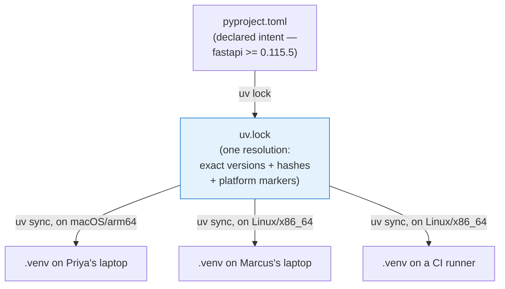
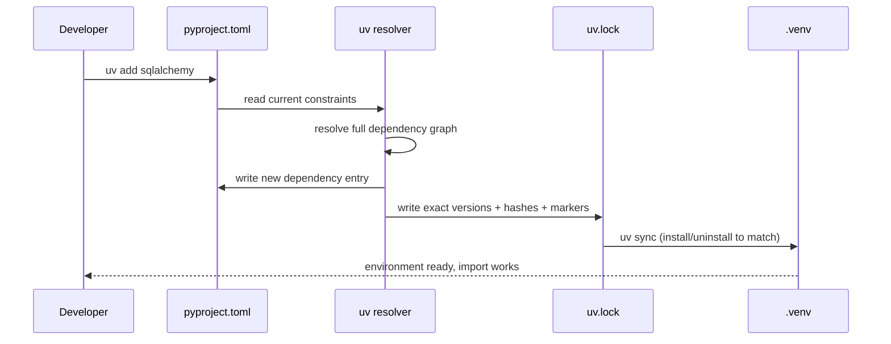
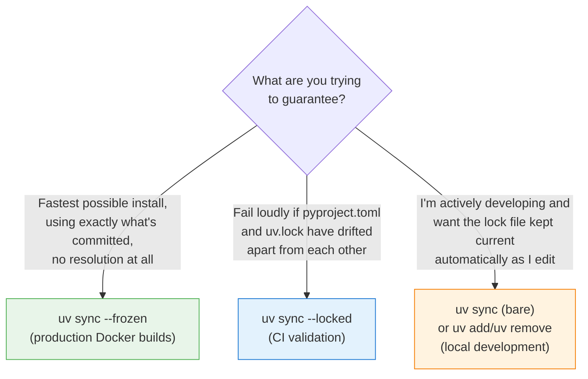
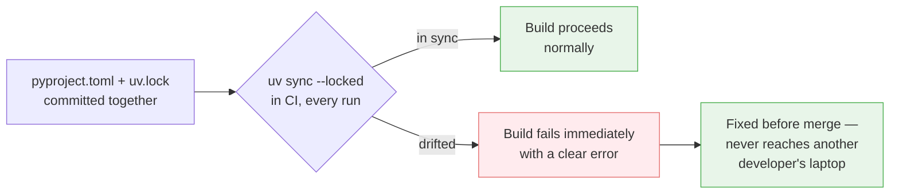

# Lock Files & Reproducibility

[Chapter 7](./07-dependency-management.md) added ExpenseFlow's real dependency set and mentioned, in passing, that every `uv add`/`uv remove` invocation updates `uv.lock` alongside `pyproject.toml`. Up to now that file has been background machinery — something uv maintains automatically that you didn't have to think about. This chapter brings it into the foreground. We open `uv.lock` and read it properly, draw a sharp line between **resolving** (`uv lock`) and **applying** (`uv sync`) as two genuinely distinct operations, learn exactly what `--frozen` and `--locked` each guarantee and when to reach for which, and walk through a realistic incident where skipping this discipline cost ExpenseFlow's team a full afternoon chasing a bug that only reproduced on one laptop. By the end, "commit your lock file, and never run a bare `uv sync` in CI" stops being a rule you follow because you were told to, and becomes a rule you follow because you've seen exactly what happens without it.

---

## Learning Objectives

By the end of this chapter, you will be able to:

- Explain what `uv.lock` actually contains — exact resolved versions, cryptographic hashes, and platform/Python-version markers — and why each of those three pieces exists.
- Articulate the precise difference between `uv lock` (resolve) and `uv sync` (apply), including which one touches `.venv` and which one touches only the lock file.
- Choose correctly between `--frozen` and `--locked` for a given situation, and explain what each one refuses to do.
- State, from memory, why `uv.lock` must be committed to version control, and what specifically breaks if it isn't.
- Diagnose an "it worked on my machine" bug caused by divergent dependency resolutions across two developers' environments.
- Configure a CI pipeline step that would have caught that exact bug before it ever reached a shared branch.

---

## Prerequisites for This Chapter

This chapter builds directly on [Chapter 7: Dependency Management](./07-dependency-management.md). You'll need:

- ExpenseFlow's full runtime dependency set already added (`fastapi`, `uvicorn[standard]`, `sqlalchemy`, `alembic`, `asyncpg`, `pydantic-settings`), exactly as Chapter 7 left it, since this chapter reads and reasons about the real `uv.lock` that resulted from those additions.
- The distinction between `pyproject.toml` (declared intent) and `uv.lock` (resolved reality) introduced in Chapter 7, Section 1.2 — this chapter is a full expansion of that one paragraph.
- Familiarity with `uv add`/`uv remove` as the commands that trigger resolution (Chapter 7, Section 1.1).

---

## 1. What `uv.lock` Actually Contains

### 1.1 Three things a lock file must record

A lock file's entire job is to answer one question the exact same way, forever, on every machine that reads it: **given this `pyproject.toml`, what precisely gets installed?** To answer that reliably, `uv.lock` has to record three distinct kinds of information, and it's worth naming all three, because each one closes off a different source of non-determinism:

1. **Exact resolved versions** — not "fastapi, at least 0.115.5" (that's `pyproject.toml`'s job), but "fastapi, exactly 0.115.5, no other version, ever, until this file changes." Every package in the resolved graph — direct and transitive — gets an exact version.
2. **Cryptographic hashes** — a hash of the exact file(s) that get downloaded and installed for each package, so that "version 0.115.5" doesn't quietly mean two different sets of bytes depending on where you downloaded it from or when. If a package index ever served corrupted, tampered, or simply different bytes under the same version number, the hash check fails loudly instead of silently installing something unexpected.
3. **Platform and Python-version markers** — because a single lock file has to work correctly across every combination of operating system, CPU architecture, and Python version the team actually uses (Priya on macOS/arm64, Marcus on Linux/x86_64, CI runners on Linux/x86_64, all pinned to Python 3.13 per Chapter 4) — and some packages resolve to genuinely different wheels, or even different transitive dependencies, per platform (`uvloop`, part of `uvicorn[standard]`'s extra, has no meaningful Windows wheel at all, for instance).

### 1.2 Reading a real excerpt

Here is an illustrative excerpt of ExpenseFlow's `uv.lock` after Chapter 7's `uv add` run — trimmed and simplified for readability, but structurally faithful to what uv actually writes (real `uv.lock` files are TOML, machine-generated, and not meant to be hand-edited, but they are meant to be read):

```toml
version = 1
requires-python = ">=3.13"

[[package]]
name = "fastapi"
version = "0.115.5"
source = { registry = "https://pypi.org/simple" }
dependencies = [
    { name = "pydantic" },
    { name = "starlette" },
    { name = "typing-extensions" },
]
sdist = { url = "https://files.pythonhosted.org/packages/.../fastapi-0.115.5.tar.gz", hash = "sha256:0a...e2" }
wheels = [
    { url = "https://files.pythonhosted.org/packages/.../fastapi-0.115.5-py3-none-any.whl", hash = "sha256:9f...c1" },
]

[[package]]
name = "uvicorn"
version = "0.32.0"
source = { registry = "https://pypi.org/simple" }
dependencies = [
    { name = "click" },
    { name = "h11" },
]
optional-dependencies = { standard = [
    { name = "httptools" },
    { name = "python-dotenv" },
    { name = "pyyaml" },
    { name = "uvloop", marker = "sys_platform != 'win32'" },
    { name = "watchfiles" },
    { name = "websockets" },
] }
sdist = { url = "https://files.pythonhosted.org/packages/.../uvicorn-0.32.0.tar.gz", hash = "sha256:2a...7b" }
wheels = [
    { url = "https://files.pythonhosted.org/packages/.../uvicorn-0.32.0-py3-none-any.whl", hash = "sha256:60...4d" },
]

[[package]]
name = "uvloop"
version = "0.21.0"
source = { registry = "https://pypi.org/simple" }
sdist = { url = "https://files.pythonhosted.org/packages/.../uvloop-0.21.0.tar.gz", hash = "sha256:3f...aa" }
wheels = [
    { url = "https://files.pythonhosted.org/packages/.../uvloop-0.21.0-cp313-cp313-manylinux_2_17_x86_64.whl", hash = "sha256:11...bc" },
    { url = "https://files.pythonhosted.org/packages/.../uvloop-0.21.0-cp313-cp313-macosx_10_9_universal2.whl", hash = "sha256:22...cd" },
]
```

Three things worth pointing at directly in this excerpt:

- **`version = "0.115.5"` on `fastapi`** is exact — not a range, not a floor, one specific version. Compare this against Chapter 7's `pyproject.toml` entry, `fastapi>=0.115.5`, which is a floor. This is the resolved-versus-declared split from Chapter 7 made completely concrete.
- **`marker = "sys_platform != 'win32'"` on `uvloop`** is exactly the platform-marker mechanism from Section 1.1's third point: on Windows, this dependency edge simply doesn't apply, and `uvloop` won't even be considered part of the resolved graph for a Windows-targeted sync. This is also why `uvloop` appears with two separate wheel entries in its own package block — one per platform/architecture combination it ships prebuilt binaries for.
- **`hash = "sha256:..."` on every sdist and wheel entry** is the integrity check from Section 1.1's second point — when `uv sync` downloads a package, it verifies the downloaded bytes hash to exactly this value before installing anything, refusing to proceed on a mismatch.

### 1.3 One resolution, many possible environments



This is the picture worth internalizing: there is exactly **one** `uv.lock`, but it can materialize into environments that differ in which specific wheel got installed (platform-appropriate binaries for `uvloop`, for instance) while guaranteeing every environment resolved the *same logical dependency graph at the same versions*. That combination — one shared resolution, safely materializing into platform-appropriate installs — is precisely what makes a single lock file usable across a real team's mixed hardware and a CI fleet, without anyone sacrificing reproducibility to get there.

---

## 2. `uv lock` and `uv sync`: Two Different Operations

### 2.1 Why the distinction matters

Chapter 7 established that `uv add`/`uv remove` each perform resolve-lock-sync as one bundled operation. It's tempting, from that, to think of "locking" and "syncing" as basically the same thing happening automatically together — but they are two genuinely separate commands, each independently invocable, and conflating them is the single most common source of confusion this chapter exists to prevent.

| Command | What it does | Touches `.venv`? | Touches `uv.lock`? | Touches `pyproject.toml`? |
|---|---|---|---|---|
| `uv lock` | Re-resolves the dependency graph from `pyproject.toml`, writes the result to `uv.lock` | No | Yes — writes/updates it | No — read only |
| `uv sync` | Reads `uv.lock` (re-resolving first, unless told not to — see Section 3) and installs/uninstalls packages so `.venv` matches | Yes — installs/uninstalls | Possibly — will re-resolve and update it if `pyproject.toml` has changed since the lock file was last written | No — read only |

`uv lock` is a pure **resolution** step: given the constraints in `pyproject.toml`, compute the one exact set of versions/hashes that satisfies them, and write that computation to disk. It never installs a single package. You could run `uv lock` on a machine with no `.venv` at all, and it would happily produce or update `uv.lock`.

`uv sync` is a pure **application** step: given whatever `uv.lock` currently says, make the actual `.venv` on disk match it — installing what's missing, removing what shouldn't be there, leaving everything else untouched. Its default behavior, if `pyproject.toml` has changed since the lock file was last generated, is to transparently re-run the resolution first (effectively an implicit `uv lock`) before syncing — which is convenient for solo, everyday development, but is exactly the behavior Section 3 explains why CI should never rely on.

### 2.2 A sequence view of `uv add`



`uv add` is convenient precisely because it chains all of this for you in the common case. But once you separate the concept into its two real component operations — resolve, then apply — the rest of this chapter's guidance about CI (Section 3) stops being an arbitrary rule and becomes an obvious consequence of understanding what each command is actually allowed to do.

### 2.3 Running them independently

You will, in practice, run these two commands independently and deliberately, not just as a byproduct of `uv add`:

```bash
# Re-resolve everything, pulling in newer compatible versions where available
uv lock --upgrade

# Re-resolve just one package to its latest compatible version
uv lock --upgrade-package fastapi

# Apply whatever uv.lock currently says, without touching pyproject.toml at all
uv sync
```

`uv lock --upgrade` is how a team deliberately, intentionally moves dependencies forward — the mechanism that answers "we should pick up recent patches" without anyone hand-editing version numbers. It's a conscious act, run when someone decides it's time, not something that happens as a side effect of an unrelated `uv sync`.

---

## 3. `--frozen` vs. `--locked`: Two Different Guarantees

### 3.1 The problem a bare `uv sync` has

A bare `uv sync`, run with no flags, will — as Section 2.1 noted — silently re-resolve if it detects `pyproject.toml` has drifted from what `uv.lock` currently reflects. On a developer's own laptop, mid-feature-development, that's often exactly the behavior you want: you edited `pyproject.toml` by hand (or, more likely, ran `uv add`) and you want the lock file kept current automatically.

But that same "quietly re-resolve if needed" behavior is precisely the wrong default for two very different, very important situations: a CI pipeline validating that nothing has drifted, and a production build that must never spend time or risk re-resolving anything at all. uv gives you a distinct flag for each situation.

### 3.2 `--frozen`: use the lock file exactly as-is, never re-resolve

```bash
uv sync --frozen
```

`--frozen` tells uv: don't even look at whether `pyproject.toml` and `uv.lock` are in sync — just take `uv.lock` exactly as it is on disk right now, and install precisely that, as fast as possible. It will not attempt to resolve anything, will not contact a package index to check for anything beyond what's needed to actually download the pinned packages, and will not update `uv.lock` under any circumstance.

This is the correct flag for a **production Docker build** (Chapter 14): you want the fastest possible, most deterministic install, using exactly the artifact that was already tested and committed, with zero chance of the build behaving differently because someone forgot to commit a `pyproject.toml` edit, or because a network blip changed what the resolver would have picked that particular second.

### 3.3 `--locked`: fail loudly if the lock file would need to change

```bash
uv sync --locked
```

`--locked` takes the opposite philosophy: it checks whether `uv.lock` is still a valid, up-to-date resolution of the current `pyproject.toml`, and if it isn't — if applying the current constraints would produce a different lock file than what's committed — **it refuses to proceed and exits with an error**, rather than silently re-resolving (the bare `uv sync` default) or silently ignoring the drift (`--frozen`).

This is the correct flag for **CI validation** (Chapter 15) and for any developer command where you want a hard guarantee that what's committed is genuinely current. It answers a specific, important question — "is `uv.lock` still correct for what `pyproject.toml` currently declares?" — and it answers that question by failing the build the moment the answer is no, which is exactly the behavior that turns a silent problem into a loud, immediate, fixable one.

### 3.4 Choosing between them



| Flag | Re-resolves if drifted? | Fails if drifted? | Installs anyway? | Where it belongs |
|---|---|---|---|---|
| `uv sync` (bare) | Yes, silently | No | Yes, after re-resolving | Local development only |
| `uv sync --frozen` | No — never | No — proceeds regardless | Yes, using the lock file exactly as-is | Production Docker builds (Chapter 14) |
| `uv sync --locked` | No | Yes, immediately | No — exits with an error first | CI pipelines (Chapter 15), pre-merge checks |

The rule this chapter wants you to walk away with, stated as plainly as possible: **CI should run `uv sync --locked`, and only `uv sync --locked` — never a bare `uv sync`.** A bare `uv sync` in CI can mask exactly the kind of drift Section 4's incident is built around, because CI would silently re-resolve and "fix" the mismatch on the runner, reporting green, while the developer who actually needs to know about the drift never finds out.

---

## 4. Why `uv.lock` Must Be Committed to Version Control

Given everything above, this section's conclusion should already feel obvious, but it's worth stating directly, because it's the single highest-leverage habit in this entire chapter: **`uv.lock` is not a build artifact, and it is not something to `.gitignore`. It is source-controlled, checked-in, reviewed-in-PRs, exactly the same as `pyproject.toml`.**

The reasoning follows directly from Sections 1–3:

- **Without a committed `uv.lock`, there is no shared resolution to apply `--frozen` or `--locked` against at all.** Every teammate, and every CI run, would have to independently resolve `pyproject.toml` from scratch, at whatever moment they happen to run it — reintroducing exactly the non-determinism a lock file exists to eliminate.
- **A committed `uv.lock` is what makes a pull request reviewable at the dependency level.** When a PR bumps `sqlalchemy`, the diff to `uv.lock` shows the reviewer exactly what changed — not just the direct version, but every transitive dependency that shifted as a consequence, which is often the more important information (a transitive major-version bump nobody explicitly asked for is a legitimate thing to want to notice in review).
- **A committed `uv.lock` is what a production incident review can check against.** Exactly like `alembic_version` records which schema revision was live at a point in time (this repo's [Alembic course](../../Databases/alembic-course/00-index.md), Chapter 5), `git blame`/`git log` on a committed `uv.lock` records which exact dependency versions were live in a given deployed commit — invaluable when a production bug is later suspected to be a dependency-version issue.

---

## 5. How `uv.lock` Compares to Other Ecosystems' Lock Files

If you've worked with other package managers, `uv.lock`'s role will feel familiar, but the specifics differ enough to be worth a direct comparison — especially since ExpenseFlow's team includes engineers who've previously worked with `pip-tools` and Poetry on other projects, and the differences shaped some of their expectations.

| Tool | Lock file | Resolver | Hashes recorded? | Platform markers in one file? |
|---|---|---|---|---|
| Plain `pip` + `requirements.txt` | None (`requirements.txt` is not a lock file) | None — installs whatever satisfies loose specifiers, in whatever order it happens to process them | No, unless manually added with `pip freeze --require-hashes`-style tooling | No — one file per platform is the common workaround |
| `pip-tools` (`pip-compile`) | `requirements.txt` (compiled) | A real resolver, but slower and historically less complete than PubGrub-style resolvers | Optional, via `--generate-hashes` | No — typically one compiled file per platform/Python version, maintained separately |
| Poetry | `poetry.lock` | Poetry's own resolver | Yes | Yes — a single `poetry.lock` handles multiple platforms via markers, similarly to uv |
| uv | `uv.lock` | PubGrub-based resolver (Chapter 3) | Yes, always, for every recorded package | Yes — a single `uv.lock` handles every platform/Python version the project supports |

The practical upshot for ExpenseFlow: engineers arriving from a `pip` + `requirements.txt`-only background need to unlearn the idea that `requirements.txt` was ever a real lock file at all — it's just a flat list, usually with loose or entirely absent version pins, offering none of the three guarantees from Section 1.1. Engineers arriving from Poetry will find `uv.lock` conceptually the closest match to what they already know, since both tools record exact versions, hashes, and platform markers in one committed file — the main practical difference for day-to-day work being uv's `--frozen`/`--locked` split (Section 3), which Poetry's `poetry install` does not distinguish in quite the same explicit, two-flag way.

### 5.1 A note on why hashes matter beyond "extra safety"

It's worth being concrete about what the hash-verification step (Section 1.1, Section 1.2) actually defends against, since "cryptographic hash" can sound like abstract security theater until you name the real scenario: a compromised or misconfigured package index serving different bytes under a version number that's already been published and reviewed. Without hash verification, "version 2.0.36 of `sqlalchemy`" is only as trustworthy as whatever bytes happen to be served the moment you install it — which, for most packages on the official Python Package Index, is not a realistic day-to-day threat, but becomes a much more real concern the moment a private or internal package index (Chapter 16) enters the picture, or in any environment where supply-chain integrity is a stated requirement. `uv.lock`'s hash column means "version 2.0.36" and "these exact bytes" become the same guarantee, permanently, rather than two things you're implicitly trusting stay in sync forever.

---

## Real-World Scenario

This is the incident this chapter has been building toward — a realistic, complete walkthrough of exactly what goes wrong without the discipline above, and exactly how it gets caught with it.

### Setup

It's a Tuesday. ExpenseFlow's `uv.lock` was last regenerated three weeks ago and has been sitting untouched — no one has run `uv lock --upgrade`, and no dependency has been added or removed since. Priya is heads-down on a new endpoint; Marcus picks up a bug report about expense totals occasionally being off by a fraction of a cent for certain currencies.

Marcus's laptop had a botched Python reinstall two weeks ago, and — without really thinking about it — he ran a bare `uv sync` afterward to "make sure everything's set up," rather than checking out the exact state of the repo first. Because his local `uv` happened to be a slightly older release than the one Priya and the CI runners use — one that predates a bugfix release for one of `pydantic`'s dependency-resolution edge cases — his bare `uv sync` silently re-resolved a portion of the graph slightly differently than what was actually committed in `uv.lock`: a transitive dependency of `pydantic` resolved to a patch version one release older than what `uv.lock` records, because that older uv's resolver made a marginally different (but "valid," from its point of view) choice when it detected — incorrectly, as it turned out, due to a stale local cache — that the committed lock file needed re-resolving.

### The bug

That one-patch-version-older transitive dependency happens to contain a rounding-behavior difference in a decimal-formatting code path ExpenseFlow's currency conversion touches indirectly. Marcus's local environment now silently exhibits the exact rounding discrepancy the bug report described — while Priya's laptop, and the CI pipeline that had already run and passed on this exact commit, do not, because both of them are running the dependency versions `uv.lock` actually specifies.

Marcus spends most of the afternoon convinced the bug is in ExpenseFlow's own currency-conversion code — reading it line by line, adding print statements, unable to find anything wrong, because there genuinely is nothing wrong with ExpenseFlow's own code. The bug is one directory level down, in a dependency version that exists on his machine and nowhere else — not in his repo's history, not in Priya's `.venv`, not in CI.

### The catch

The turning point comes when Marcus, frustrated, runs `uv sync --locked` on his own machine as a sanity check, mostly out of habit from Chapter 3's CI configuration — and it fails immediately:

```
error: The lockfile at `uv.lock` needs to be updated, but `--locked` was
provided. To update the lockfile, run `uv lock`.
```

That single error is the entire diagnosis. `uv.lock` didn't need updating from ExpenseFlow's actual, committed `pyproject.toml` — what had actually happened was that Marcus's local environment had drifted *away* from the committed lock file, and `--locked` caught the mismatch instantly by comparing what's on disk against what's committed. Running `uv sync --locked` again after discarding his local drift (`uv venv` to rebuild `.venv` from scratch, then `uv sync --locked` clean) restores his environment to exactly what `uv.lock` specifies — and the rounding bug disappears immediately, confirming it was never in ExpenseFlow's code at all.

### How CI would have caught this before it ever mattered

The genuinely frustrating part of this story, for Marcus, is that this specific class of drift is **exactly** what CI is supposed to guarantee never survives past a developer's own laptop — and it does, reliably, provided CI is configured correctly. If ExpenseFlow's pipeline runs `uv sync --locked` (Chapter 15 covers the full workflow) as its very first step, before any test runs, any commit where `pyproject.toml` and `uv.lock` have drifted apart fails immediately, with the same clear error Marcus eventually saw locally — long before a bug report ever gets filed, and without anyone needing to spend an afternoon suspecting their own application code.

The lesson generalizes past this one incident: `uv sync --locked` isn't just a CI nicety — it's the mechanism that converts "an entire class of silent, environment-dependent bugs" into "a loud, immediate, five-second CI failure with an obvious fix." The cost of adopting it is one flag. The cost of not adopting it is exactly the afternoon Marcus just lost.



---

## Best Practices

- **Always commit `uv.lock` to version control**, in the same commits that touch `pyproject.toml` — never `.gitignore` it, and never treat it as a generated artifact safe to regenerate freely on every machine.
- **Run `uv sync --locked` in every CI job**, as the very first dependency-related step, before tests, linting, or anything else — never a bare `uv sync` in an automated pipeline (Chapter 15 builds the full workflow around this).
- **Use `uv sync --frozen` for production Docker builds** (Chapter 14), where you want the fastest, most deterministic install of exactly what's committed, with zero resolution overhead or risk.
- **Treat `uv lock --upgrade` as a deliberate, reviewed action**, not something that happens as a side effect of routine `uv sync` calls — run it on purpose, review the resulting `uv.lock` diff, and commit it as its own change.
- **If your local environment ever behaves unexpectedly and you can't explain why, run `uv sync --locked` as a first diagnostic step** — exactly as Marcus eventually did — to rule out local drift before assuming the bug is in your own code.
- **Review `uv.lock` diffs in pull requests, not just `pyproject.toml` diffs** — a transitive dependency shift is real, relevant information a reviewer should see, especially for major-version bumps in packages nobody explicitly touched.

---

## Common Mistakes

- **Adding `uv.lock` to `.gitignore`**, treating it like a build cache — this throws away the entire reproducibility guarantee this chapter is built around, forcing every machine to resolve independently.
- **Running a bare `uv sync` in a CI pipeline**, which silently re-resolves on drift instead of failing — masking exactly the kind of divergence the Real-World Scenario walks through, and reporting a false "green" build.
- **Conflating `uv lock` and `uv sync`** — assuming that resolving (`uv lock`) is the same operation as applying (`uv sync`), and being surprised when one changes `.venv` and the other doesn't.
- **Using `--frozen` where `--locked` was needed, or vice versa** — using `--frozen` in CI (which would silently proceed on drift instead of failing the build) instead of `--locked`, or using `--locked` in a production build (where you want the fastest possible deterministic install, not a validation step that could theoretically still trigger extra resolution work).
- **Running a bare `uv sync` after a local environment problem** (a botched reinstall, a corrupted cache) instead of validating against the committed lock file first with `uv sync --locked` — exactly the mistake that caused Marcus's afternoon-long detour in the Real-World Scenario.
- **Assuming a passing CI run and a developer's "it works for me" are equally trustworthy signals of dependency correctness** — they are only equally trustworthy if both are actually enforcing `--locked` (or building from the same `--frozen` artifact); otherwise they can silently diverge, as the Real-World Scenario demonstrated in detail.

---

## Summary

- `uv.lock` records exact resolved versions, cryptographic hashes, and platform/Python-version markers — three distinct pieces of information, each closing off a different source of non-determinism (Section 1).
- `uv lock` (resolve) and `uv sync` (apply) are two genuinely separate operations; `uv add`/`uv remove` bundle both together, but you can and should run them independently when the situation calls for it (Section 2).
- `--frozen` uses the committed lock file exactly as-is with no re-resolution, ideal for production Docker builds; `--locked` fails loudly if the lock file would need to change, ideal for CI validation; a bare `uv sync` silently re-resolves and belongs only in local development (Section 3).
- `uv.lock` must be committed to version control — without it, there is no shared resolution for `--frozen`/`--locked` to validate against, and every machine resolves independently (Section 4).
- `uv.lock` plays the same reproducibility role as Poetry's `poetry.lock`, but goes further than a `pip-tools`-compiled `requirements.txt` by always recording hashes and handling multiple platforms in one file (Section 5).
- An un-pinned local environment drift caused a rounding bug that reproduced only on Marcus's laptop; `uv sync --locked` diagnosed it in seconds once run, and would have caught the underlying drift automatically in CI before it ever became a bug report (Real-World Scenario).

---

## Knowledge Check

1. Name the three distinct kinds of information stored in `uv.lock`, and explain what specific problem each one prevents.
2. What is the precise difference between what `uv lock` does and what `uv sync` does? Which one ever touches `.venv`?
3. You need the fastest possible, fully deterministic dependency install for a production Docker image build, with no network-dependent resolution step at all. Which flag do you use, and why not the other one?
4. You want a CI job to fail immediately if a developer forgot to commit an updated `uv.lock` after changing `pyproject.toml`. Which flag do you use, and what specifically does it check?
5. Why is committing `uv.lock` to version control non-negotiable, given everything else this chapter covers about `--frozen` and `--locked`?
6. In the Real-World Scenario, what specifically caused Marcus's laptop to diverge from the committed `uv.lock`, and what command revealed the divergence?
7. If ExpenseFlow's CI pipeline had been running `uv sync --locked` from day one, at what point would Marcus's bug have been caught, relative to when it was actually caught?

---

## Hands-On Exercise

**Goal:** Read a real `uv.lock`, exercise `uv lock` and `uv sync` independently, and reproduce the drift-detection behavior of `--locked`.

1. **Starting from Chapter 7's ExpenseFlow project** (with the full runtime dependency set added), open `uv.lock` directly in an editor and find the entry for `sqlalchemy`. Note its exact `version` field and compare it against the `sqlalchemy>=...` entry in `pyproject.toml`.

2. **Run `uv lock --upgrade-package fastapi`** and observe the diff to `uv.lock` (`git diff uv.lock`) — confirm only `fastapi` and any dependency uniquely required by the newer version changed, while everything else stayed pinned exactly as it was.

3. **Revert that change** (`git checkout -- uv.lock`) to return to a clean baseline before continuing.

4. **Manually edit `pyproject.toml`** to bump `requires-python` from `>=3.13` to `>=3.14` (a deliberately drifting, uncommitted-to-lock-file change — do not run `uv add`/`uv remove`/`uv lock` after this edit).

5. **Run `uv sync --locked`** and confirm it fails with an error explaining the lock file is out of date relative to `pyproject.toml`.

6. **Run a bare `uv sync`** instead, and confirm it succeeds, silently re-resolving and rewriting `uv.lock` to match your edited `pyproject.toml` — this is the exact "silent re-resolution" behavior the Real-World Scenario's incident hinged on.

7. **Revert both files** (`git checkout -- pyproject.toml uv.lock`) to restore the clean, committed baseline.

8. **Run `uv sync --frozen`** on the clean baseline and confirm it succeeds quickly with no resolution step, then run `uv sync --locked` on the same clean baseline and confirm it also succeeds — both should pass when `pyproject.toml` and `uv.lock` are genuinely in sync, differing only in what they'd do if they weren't.

---

## Further Reading

- [uv Concepts — Locking and Syncing](https://docs.astral.sh/uv/concepts/) — the official reference for `uv lock`, `uv sync`, and the exact semantics of `--frozen`/`--locked`.
- [uv Reference — CLI](https://docs.astral.sh/uv/reference/) — full flag reference for `uv lock` and `uv sync`.
- [uv Guides](https://docs.astral.sh/uv/guides/) — practical guides that touch on CI usage patterns for locking and syncing.
- [Python Packaging User Guide](https://packaging.python.org/) — background on dependency resolution and reproducibility as general packaging concerns, not just uv-specific mechanics.
- [uv GitHub Repository](https://github.com/astral-sh/uv) — for reading the actual lock file format and resolver implementation notes in the source.

---

<div style="display:flex;justify-content:space-between;align-items:center;">
  <a href="./07-dependency-management.md">← Previous: Dependency Management</a>
  <a href="./00-index.md">🏠 Index</a>
  <a href="./09-running-code-with-uv-run.md">Next: Running Code with `uv run` →</a>
</div>
