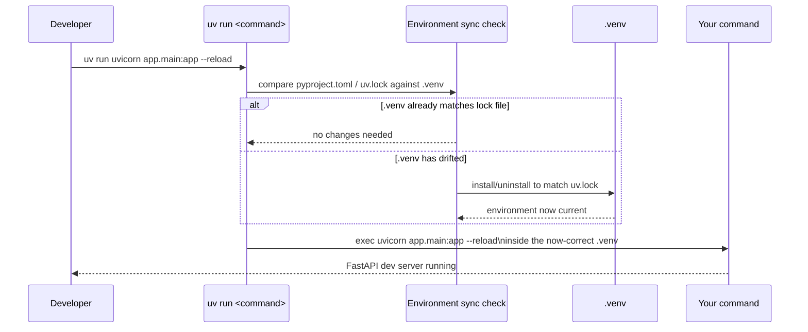
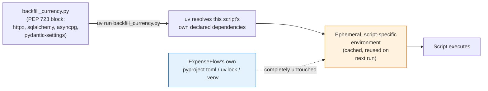

# Running Code with `uv run`

[Chapter 8](./08-lock-files-and-reproducibility.md) established that `uv.lock` is the single source of truth for exactly what should be installed, and that `--frozen`/`--locked` control how strictly a given command respects it. This chapter is about the command that actually *uses* that lock file every single day: `uv run`. So far it's appeared only in passing — a way to invoke Python without manually activating `.venv` (Chapter 6). Here we treat it properly: what it actually checks before running anything, how it runs scripts, modules, and arbitrary commands, how it drives ExpenseFlow's FastAPI dev server and bridges directly into `alembic upgrade head` from the sibling Alembic course, and — the chapter's centerpiece — how PEP 723 inline script metadata lets a completely standalone script declare its own dependencies and run in total isolation from ExpenseFlow's main project, using a real `backfill_currency.py` maintenance script as the worked example.

---

## Learning Objectives

By the end of this chapter, you will be able to:

- Explain precisely what `uv run` does before it executes anything — the environment-synchronization step that makes it more than a thin wrapper around `python`.
- Run scripts, modules (`-m`), and arbitrary commands through `uv run`, and explain why this matters for consistency across a team.
- Run ExpenseFlow's FastAPI dev server and `alembic upgrade head` through `uv run`, and explain what each command is actually invoking underneath.
- Write and run a standalone script using PEP 723 inline script metadata, with its own isolated dependency set.
- Use `uv run --with` to pull in an ad-hoc, one-off dependency without editing `pyproject.toml` at all.
- Decide, for a given piece of one-off code, whether it belongs in ExpenseFlow's main project, as a PEP 723 script, or behind a `--with` flag.

---

## Prerequisites for This Chapter

This chapter builds directly on [Chapter 8: Lock Files & Reproducibility](./08-lock-files-and-reproducibility.md) and [Chapter 7: Dependency Management](./07-dependency-management.md). You'll need:

- ExpenseFlow's full runtime dependency set already in place (`fastapi`, `uvicorn[standard]`, `sqlalchemy`, `alembic`, `asyncpg`, `pydantic-settings`), with a clean, committed `uv.lock` (Chapter 7, Chapter 8).
- The `uv lock`/`uv sync` distinction and the meaning of `--frozen`/`--locked` (Chapter 8) — `uv run`'s environment-sync step, covered in Section 1, builds directly on that vocabulary.
- Familiarity with automatic `.venv` discovery from [Chapter 6: Virtual Environments](./06-virtual-environments.md).
- Awareness of this repo's sibling [Alembic course](../../Databases/alembic-course/00-index.md), since Section 3 runs `alembic upgrade head` against ExpenseFlow's migration history from that course without re-explaining what a migration is.

---

## 1. What `uv run` Actually Does

### 1.1 More than "activate then run"

It's tempting to think of `uv run some-command` as shorthand for "activate `.venv`, then run `some-command`, then deactivate" — and that mental model isn't wrong exactly, but it undersells what actually happens, and misses the part of `uv run` that matters most for a team working on a shared project like ExpenseFlow.

Every time you invoke `uv run`, before your command executes at all, uv performs a **environment-sync check**: it compares the project's `pyproject.toml` and `uv.lock` against the current state of `.venv`, and — by default, exactly like a bare `uv sync` (Chapter 8, Section 2.1) — brings `.venv` into agreement with the lock file if anything has drifted, *before* handing control to the command you actually asked for.



This is the single most important fact in this chapter: **`uv run` doesn't just run your code inside whatever `.venv` happens to already exist — it first makes sure `.venv` is correct, then runs your code.** That ordering is what makes an entire category of bug structurally impossible for a team using `uv run` consistently: "I pulled the latest changes, which added a new dependency, and now the app crashes with `ModuleNotFoundError`" simply doesn't happen, because `uv run` would have installed that new dependency automatically, the moment anyone ran anything through it, before the `ModuleNotFoundError` had any chance to occur.

### 1.2 Respecting `--frozen` and `--locked` too

`uv run` accepts the same `--frozen` and `--locked` flags Chapter 8 introduced for `uv sync`, because the environment-sync step underneath `uv run` is, mechanically, the same operation:

```bash
uv run --frozen pytest        # never re-resolve; use uv.lock exactly as committed
uv run --locked pytest        # fail immediately if pyproject.toml/uv.lock have drifted
uv run pytest                 # default: silently sync if needed, then run
```

The same guidance from Chapter 8 carries over directly: local, everyday development is fine with the bare default; CI should prefer `--locked` (Chapter 15) so a drifted lock file fails loudly rather than being silently patched over on a runner.

### 1.3 Why this replaces "did you activate your venv?"

Chapter 6 first raised this point in the context of environment discovery; it's worth restating here with the fuller picture from Section 1.1 in view. A team without `uv run` — using plain `python` and manual `source .venv/bin/activate` — has an entire recurring failure mode: someone forgets to activate, runs `python app.py` against system Python or a stale environment, gets a confusing error, and burns ten minutes before realizing the actual problem was never in the code at all. `uv run` removes the "activate" step from the workflow entirely — there is no `.venv` to remember to activate, because `uv run` finds it, verifies it, repairs it if needed, and runs your command inside it, every single time, with zero manual steps in between.

---

## 2. Running Scripts, Modules, and Commands

`uv run` accepts three broad categories of "the thing you want to run," and it's worth being explicit about all three, since ExpenseFlow's day-to-day workflow uses every one of them.

### 2.1 Running a script directly

```bash
uv run src/expenseflow/scripts/seed_dev_data.py
```

This runs a Python file directly, exactly as `python src/expenseflow/scripts/seed_dev_data.py` would, but inside the project's synced `.venv` rather than whatever Python happens to be first on `PATH`.

### 2.2 Running a module with `-m`

```bash
uv run -m pytest
uv run python -m pytest
```

Both forms work; `uv run -m pytest` and `uv run python -m pytest` are equivalent, since `uv run` treats bare `-m <module>` as shorthand for invoking Python's own `-m` flag. Running a module rather than a script matters whenever the tool in question is designed to be invoked as a module (many CLI tools support both an installed console-script entry point and a `-m` invocation, and they're not always perfectly interchangeable across environments — `-m` guarantees you're running the module from the exact interpreter `uv run` resolved, with no ambiguity about which installed executable on `PATH` might otherwise get picked up).

### 2.3 Running an arbitrary command

```bash
uv run ruff check
uv run mypy src/
uv run pytest -v
```

This is the form you'll use constantly — any console-script entry point a dependency installs (`ruff`, `mypy`, `pytest`, `uvicorn`, `alembic`) becomes directly runnable through `uv run` without needing to know or care where exactly it landed on disk. `uv run` resolves `ruff` to the specific executable inside the project's `.venv`, not some other `ruff` that might happen to be installed globally or in a different project's environment — which matters enormously the moment you have more than one Python project on the same machine with different pinned tool versions (a concern Chapter 11 returns to when contrasting project dependencies against global `uv tool` installs).

### 2.4 A quick command reference

| Form | Example | When to use it |
|---|---|---|
| Direct script | `uv run script.py` | A standalone `.py` file, run as `python script.py` would |
| Module | `uv run -m pytest` | Invoking something explicitly as a module, matching `python -m` semantics |
| Console-script command | `uv run ruff check` | Any installed CLI tool with its own entry point — the most common day-to-day form |
| Command with arguments | `uv run pytest -v --tb=short` | Any of the above, with arguments passed straight through after the command name |

---

## 3. Running ExpenseFlow: the Dev Server and Alembic

### 3.1 The FastAPI dev server

With ExpenseFlow's dependencies in place (Chapter 7) and its FastAPI app object living at `src/expenseflow/main.py` as `app`, starting the dev server is:

```bash
uv run uvicorn expenseflow.main:app --reload
```

```
INFO:     Will watch for changes in these directories: ['/home/priya/expenseflow']
INFO:     Uvicorn running on http://127.0.0.1:8000 (Press CTRL+C to quit)
INFO:     Started reloader process [41022] using WatchFiles
INFO:     Started server process [41024]
INFO:     Waiting for application startup.
INFO:     Application startup complete.
```

Walking through exactly what happened before that first `INFO:` line printed: `uv run` synced `.venv` against `uv.lock` (Section 1.1), resolved `uvicorn` to the specific executable installed inside ExpenseFlow's own `.venv` — the one pinned in `uv.lock` at `0.32.0` with the `standard` extra (Chapter 7, Chapter 8) — and only then executed it with the arguments `expenseflow.main:app --reload`. Notice `--reload`'s file-watching mechanism (`WatchFiles`) is itself one of the packages `uvicorn[standard]`'s extra pulled in (Chapter 7, Section 4.1) — without that extra, `--reload` wouldn't have a file watcher available at all, and Uvicorn would need to fall back to a slower, less capable one, or fail outright depending on version.

### 3.2 `alembic upgrade head` — bridging to the Alembic course

ExpenseFlow's schema and migration history — the `users` and `expenses` tables, and every revision built on top of them — is exactly what this repo's sibling [Alembic course](../../Databases/alembic-course/00-index.md) covers in full depth (see especially that course's [Chapter 5: Revisions & Version History](../../Databases/alembic-course/05-revisions-and-version-history.md) and [Chapter 6: Upgrade & Downgrade](../../Databases/alembic-course/06-upgrade-and-downgrade.md)). This course does not re-teach what a migration is or how Alembic's revision graph works — that's the Alembic course's job. What this chapter adds is purely the tooling layer underneath it: how you actually *invoke* Alembic inside a uv-managed project.

```bash
uv run alembic upgrade head
```

```
INFO  [alembic.runtime.migration] Context impl PostgresqlImpl.
INFO  [alembic.runtime.migration] Will assume transactional DDL.
INFO  [alembic.runtime.migration] Running upgrade  -> 1a2b3c4d5e6f, create users table
INFO  [alembic.runtime.migration] Running upgrade 1a2b3c4d5e6f -> 9f8e7d6c5b4a, create expenses table
```

The pattern is identical to Section 3.1: `uv run` ensures `.venv` matches `uv.lock` — which matters here specifically because `alembic` is one of the six packages Chapter 7 added, pinned in `uv.lock` at an exact version — and then invokes the `alembic` console script exactly as if you'd activated `.venv` and typed `alembic upgrade head` yourself, with zero difference in behavior. The same holds for every other Alembic command from that course: `uv run alembic revision -m "..."`, `uv run alembic current`, `uv run alembic history`, `uv run alembic downgrade -1` — every single one of them is simply `alembic <subcommand>`, prefixed with `uv run`, running against exactly the pinned Alembic version ExpenseFlow's team committed to.

### 3.3 Why `uv run` doesn't manage `DATABASE_URL`

It's worth being explicit about a boundary here, because it's a common point of confusion: `alembic upgrade head` needs a database connection string to know *which* PostgreSQL instance to run migrations against, and ExpenseFlow reads that from a `.env` file via `pydantic-settings` (one of Chapter 7's six dependencies) inside `env.py` (Alembic course, Chapter 4). `uv run` has nothing to do with that — it doesn't read `.env` files, doesn't manage `DATABASE_URL`, and doesn't know or care what your application's runtime configuration looks like. `uv`'s entire scope, end to end, is Python versions, dependencies, and environments (Chapter 2) — never application runtime configuration. `uv run alembic upgrade head` guarantees you're running the *correct pinned version of Alembic*, inside the *correct synced environment*; it says nothing whatsoever about which database that Alembic invocation will actually talk to. That's `pydantic-settings` and your `.env` file's job, entirely downstream of uv, once `uv run` has already handed control to Alembic's own process.

---

## 4. PEP 723: Inline Script Metadata for Standalone Scripts

### 4.1 The problem: a one-off script that doesn't belong in the project

A few weeks into ExpenseFlow's life, Marcus needs to run a one-off maintenance task: a currency-conversion vendor ExpenseFlow calls out to changed their exchange-rate data format, and a batch of older expense records need their stored `currency` field backfilled from an external rates API to correct some now-stale converted totals. This is a script he'll run once (maybe twice, if the first run reveals an edge case), directly against production data, from his own machine, under supervision — not a piece of ExpenseFlow's actual application code, not something that needs a route, not something `uv run uvicorn` will ever serve.

The script needs `httpx` to call the rates API. Chapter 7, Section 5.3, already told part of this story: Marcus had briefly considered adding `httpx` to ExpenseFlow's main dependency set for a related experiment, and the team decided against it — a one-off maintenance script has no business inflating the dependency footprint (and therefore the resolution surface, the Docker image size in Chapter 14, and the attack surface) of the entire production application, forever, for a task that runs a handful of times total.

This is exactly the situation **PEP 723 inline script metadata** was designed for.

### 4.2 What PEP 723 actually is

PEP 723 defines a standard, machine-readable way for a single `.py` file to declare its *own* dependencies, directly inside a specially formatted comment block at the top of the file — with no `pyproject.toml`, no `uv.lock`, no project structure of any kind required. The file is entirely self-describing: anyone (or any tool) can read that one file and know exactly what it needs to run, with zero other context.

The block looks like this:

```python
# /// script
# requires-python = ">=3.13"
# dependencies = [
#     "httpx>=0.27.0",
# ]
# ///
```

That's the entire mechanism. It's a TOML block, embedded as a Python comment (so a plain `python backfill_currency.py`, run without uv, still executes just fine as ordinary Python — the comment is inert to the interpreter itself), delimited by `# /// script` and `# ///`. Any tool that understands PEP 723 — uv chief among them — can read this block without executing the file, and knows precisely what environment to construct before running it.

### 4.3 The worked example: `backfill_currency.py`

Here is the actual script Marcus writes, in full — deliberately similar in spirit to the Alembic course's own one-off data-migration scenario (that course's Chapter 11 covers backfilling data as part of a real Alembic revision; this script is the same category of task, but explicitly *outside* Alembic's revision history, since it calls an external API rather than performing pure SQL transformation, and is a genuinely one-off operational task rather than a permanent, replayable part of the schema's migration history):

```python
# /// script
# requires-python = ">=3.13"
# dependencies = [
#     "httpx>=0.27.0",
#     "sqlalchemy>=2.0.36",
#     "asyncpg>=0.30.0",
#     "pydantic-settings>=2.6.1",
# ]
# ///
"""One-off maintenance script: backfill stale currency conversions.

Run manually, once, against production data, after the exchange-rate
vendor changed their response format on 2026-07-15. Not part of
ExpenseFlow's application code and not registered as an Alembic
revision — this performs an external API call per row, which has no
place in a replayable SQL migration.
"""

import asyncio

import httpx
from pydantic_settings import BaseSettings
from sqlalchemy import select
from sqlalchemy.ext.asyncio import create_async_engine, AsyncSession
from sqlalchemy.orm import sessionmaker

from expenseflow.models import Expense  # reused from the main project


class BackfillSettings(BaseSettings):
    database_url: str
    rates_api_url: str = "https://api.example-rates.com/v1/historical"


async def backfill() -> None:
    settings = BackfillSettings()
    engine = create_async_engine(settings.database_url)
    session_factory = sessionmaker(engine, class_=AsyncSession, expire_on_commit=False)

    async with httpx.AsyncClient(base_url=settings.rates_api_url) as client:
        async with session_factory() as session:
            result = await session.execute(
                select(Expense).where(Expense.currency == "UNK")
            )
            stale_expenses = result.scalars().all()
            print(f"Found {len(stale_expenses)} expenses needing backfill.")

            for expense in stale_expenses:
                response = await client.get(f"/{expense.expense_date.isoformat()}")
                response.raise_for_status()
                correct_currency = response.json()["currency_code"]
                expense.currency = correct_currency

            await session.commit()
            print(f"Backfilled {len(stale_expenses)} expenses.")


if __name__ == "__main__":
    asyncio.run(backfill())
```

Notice the script even imports `expenseflow.models.Expense` from the main project — PEP 723's dependency block only governs *third-party* dependencies the script needs installed; it can still be run from within a checkout of the ExpenseFlow repository and import the project's own modules directly, since `uv run` places you in the project's directory context. What it deliberately does *not* do is add `httpx` (or re-add any of the other three packages, all of which happen to already be ExpenseFlow dependencies) to ExpenseFlow's own `pyproject.toml` — this script carries its own dependency declaration, entirely independent of the main project's.

### 4.4 Running it

```bash
uv run backfill_currency.py
```

The first time this runs, uv reads the PEP 723 block, resolves `httpx>=0.27.0` (plus the other three declared dependencies) into a **separate, ephemeral environment** — not ExpenseFlow's own `.venv`, and not polluting `uv.lock` in any way — caching that resolution so a second run of the same script, with the same declared dependencies, is close to instant, reusing uv's global content-addressable cache (Chapter 3) exactly the same way any other uv-managed install does.



This is the entire point, made visible: ExpenseFlow's own `pyproject.toml`, `uv.lock`, and `.venv` are completely untouched by running this script. `httpx` never appears in ExpenseFlow's dependency list, never affects its production Docker image (Chapter 14), never shows up in a `uv.lock` diff a reviewer has to reason about for the main application — it exists only inside this one file's own, self-contained declaration.

### 4.5 `uv add --script` for editing PEP 723 blocks

You don't have to hand-write the metadata block yourself. Given an existing script (even one with no block yet), uv can manage it the same way it manages a project's `pyproject.toml`:

```bash
uv init --script backfill_currency.py --python 3.13
uv add --script backfill_currency.py httpx sqlalchemy asyncpg pydantic-settings
```

`uv init --script` creates the initial `# /// script ... ///` block on a bare file; `uv add --script` edits an existing script's block the same way `uv add` edits a project's `pyproject.toml` — resolving, and rewriting the dependency list in place — without ever touching the main project's own files.

---

## 5. `uv run --with`: Ad-Hoc Dependencies Without Any File Edits

### 5.1 When even a PEP 723 block is more ceremony than you need

PEP 723 is the right tool for a script you'll run more than once, or one you want to keep around, commit to the repo, and hand to a teammate with its dependencies fully self-described. But sometimes you want something even more transient — a single, immediate command, run once, that needs one extra package, with no file to create or edit at all.

```bash
uv run --with httpx python -c "import httpx; print(httpx.get('https://httpbin.org/get').status_code)"
```

`--with` tells uv: "for this one invocation only, make sure `httpx` is available in the environment, in addition to whatever the current project already provides — but don't write this anywhere." No `pyproject.toml` edit, no PEP 723 block, no lasting trace at all beyond uv's own cache (which, as always, makes a second `--with httpx` invocation elsewhere on the same machine fast, since the package is already cached).

### 5.2 `--with` inside a project context

`--with` also works when you're inside ExpenseFlow's own project directory, layering an extra package on top of the project's normal synced environment for one command:

```bash
uv run --with rich python scripts/pretty_print_report.py
```

This runs `pretty_print_report.py` with full access to ExpenseFlow's own dependencies (`sqlalchemy`, `pydantic-settings`, and so on, all still available exactly as `uv.lock` specifies) *plus* `rich`, layered in just for this one run, without `rich` ever being added to ExpenseFlow's `pyproject.toml` or `uv.lock`.

### 5.3 Choosing between the three approaches

| Situation | Right tool | Why |
|---|---|---|
| A dependency ExpenseFlow's application genuinely needs, permanently | `uv add` (Chapter 7) | It's a real, ongoing project dependency — belongs in `pyproject.toml`/`uv.lock` |
| A standalone script you'll run repeatedly, want to commit, and should be fully self-describing | PEP 723 (`uv init --script` / `uv add --script`) | Keeps its own dependency declaration with the file itself, isolated from the main project forever |
| A single, immediate, throwaway command that needs one extra package right now | `uv run --with <package>` | Zero files created or edited; nothing to clean up afterward |

`backfill_currency.py` (Section 4) is squarely in the middle category: Marcus expects to run it at least twice (once for real, once more if the first pass reveals an edge case in the rates API's response format), wants it committed to the repo so Priya can review exactly what it does before it touches production data, and wants the file to be fully self-contained so anyone reading it later understands its dependencies without needing to reconstruct tribal knowledge about "oh, that one used to need `httpx` for some reason." A `--with` invocation would have been the wrong choice here — nothing about the command would have been reviewable in a pull request, since there'd be no persistent file recording what dependency was used for what.

---

## Real-World Scenario

Three months after ExpenseFlow ships, a routine dependency audit (prompted by a security advisory affecting an unrelated package elsewhere in the company) prompts Priya to grep the entire repository for every `pyproject.toml` and every PEP 723 script block, to produce a full inventory of exactly what external packages ExpenseFlow's various pieces depend on, and why. She finds ExpenseFlow's main `pyproject.toml` — six direct runtime dependencies, all accounted for and all actively used by the running application (Chapter 7). She finds `backfill_currency.py`, sitting in a `scripts/` directory, its PEP 723 block declaring exactly four dependencies, three of which overlap with the main project's own (`sqlalchemy`, `asyncpg`, `pydantic-settings` — reused because the script needs to talk to the same database) and one of which (`httpx`) appears nowhere else in the entire codebase.

Because that `httpx` dependency is scoped entirely to one self-describing file, the audit takes thirty seconds to answer definitively: `httpx` exists in exactly one place, for exactly one documented reason (the docstring says so directly), used by a script that's run rarely and under supervision, never touching production traffic paths. Compare this against the counterfactual Chapter 7's Real-World Scenario already hinted at — if the team had gone the other way and added `httpx` to ExpenseFlow's main dependencies back when Marcus was first experimenting with it, this same audit would have found `httpx` sitting inside every production request path, in the main dependency graph, in the Docker image (Chapter 14), in every `uv sync --frozen` production install — for a capability the running application never actually uses in its normal, day-to-day operation. The PEP 723 boundary isn't just a style preference; it's the mechanism that made this audit fast, precise, and reassuring instead of a multi-hour archaeology project.

---

## Best Practices

- **Reach for `uv run` for everything** — the dev server, Alembic commands, tests, linting — never fall back to manually activating `.venv` and running a bare `python`/`uvicorn`/`alembic` command, so the environment-sync guarantee from Section 1.1 always applies.
- **Prefer `--locked` for `uv run` in CI**, mirroring Chapter 8's guidance for `uv sync` — never let a CI job silently re-resolve a drifted lock file mid-run.
- **Use PEP 723 for any standalone script that has its own dependency needs unrelated to the main project**, especially anything you'll commit, run more than once, or hand to a teammate to review.
- **Never add a one-off maintenance script's dependencies to the main project's `pyproject.toml`** just because it's convenient in the moment — Section 4.1's reasoning (dependency footprint, Docker image size, resolution surface) applies just as much to a script as to a permanent feature.
- **Use `uv run --with` for genuinely throwaway, one-off commands** that don't warrant a committed file at all — but promote them to a real PEP 723 script the moment you find yourself running the same `--with` command more than a couple of times.
- **Keep application runtime configuration (`.env`, `DATABASE_URL`) entirely separate in your mental model from what uv manages** — `uv run` guarantees the right pinned tools in the right synced environment; it says nothing about which database, API, or environment your application code will actually talk to at runtime.

---

## Common Mistakes

- **Manually activating `.venv` out of habit and running `alembic`/`uvicorn`/`pytest` directly**, bypassing `uv run`'s environment-sync check entirely and risking a stale environment nobody noticed had drifted.
- **Adding a one-off script's dependency (like `httpx` for `backfill_currency.py`) to the main project's dependency set**, permanently inflating the production dependency graph for a capability the running application never uses.
- **Forgetting the PEP 723 block's exact delimiter syntax** (`# /// script` ... `# ///`), which causes uv to treat the file as an ordinary script with no declared dependencies, silently missing the isolated-environment behavior entirely.
- **Using `uv run --with` for a script that's run repeatedly and reviewed by teammates**, instead of promoting it to a proper PEP 723 script — losing the self-documenting dependency declaration that makes the file reviewable on its own.
- **Assuming `uv run alembic upgrade head` manages which database gets migrated.** That's entirely `pydantic-settings`/`.env`'s responsibility (Section 3.3) — `uv run` only guarantees the correct pinned Alembic version runs inside the correct synced environment.
- **Confusing a PEP 723 script's ephemeral environment with the main project's `.venv`.** They are deliberately separate — installing something via a script's inline metadata does not make it available to `uv run` commands executed against the main ExpenseFlow project, and vice versa.

---

## Summary

- `uv run` always performs an environment-sync check against `uv.lock` before executing your command, which is what structurally eliminates "forgot to activate/update my venv" as a class of bug (Section 1).
- `uv run` can execute a direct script, a module (`-m`), or any installed console-script command, and accepts the same `--frozen`/`--locked` flags as `uv sync` (Section 1, Section 2).
- ExpenseFlow's FastAPI dev server and every Alembic command from the sibling course run through `uv run`, which guarantees the correct pinned tool version in the correct synced environment — but has no involvement in application runtime configuration like `DATABASE_URL` (Section 3).
- PEP 723 inline script metadata lets a standalone `.py` file declare its own dependencies in a structured comment block, resolved into a separate ephemeral environment that never touches the main project's `pyproject.toml`/`uv.lock`/`.venv` — demonstrated with `backfill_currency.py`, which needs `httpx` without polluting ExpenseFlow's main dependency set (Section 4).
- `uv run --with <package>` adds an ad-hoc dependency for a single invocation with zero persistent files, appropriate for genuinely throwaway commands rather than anything worth reviewing or rerunning (Section 5).

---

## Knowledge Check

1. What does `uv run` do, in order, before it actually executes the command you asked it to run?
2. Why does `uv run --locked pytest` belong in CI, while a bare `uv run pytest` is fine for local development?
3. What problem does PEP 723's inline metadata block solve that adding a dependency to `pyproject.toml` would not solve as well?
4. In `backfill_currency.py`, why does the PEP 723 block declare `sqlalchemy`, `asyncpg`, and `pydantic-settings` even though all three are already dependencies of the main ExpenseFlow project?
5. What is the difference between `uv run --with httpx script.py` and a script with its own PEP 723 block declaring `httpx`? When would you choose one over the other?
6. Why doesn't `uv run alembic upgrade head` need to know anything about `DATABASE_URL`, and what component actually is responsible for that?
7. If a teammate ran `uv run uvicorn expenseflow.main:app --reload` right after pulling a commit that added a new dependency, what would happen, and why wouldn't they see a `ModuleNotFoundError`?

---

## Hands-On Exercise

**Goal:** Run ExpenseFlow through `uv run` in its three main day-to-day forms, then write and run a real PEP 723 script, then use `--with` for a one-off command.

1. **Start ExpenseFlow's dev server** with `uv run uvicorn expenseflow.main:app --reload`, confirm it starts, and hit `http://127.0.0.1:8000/docs` in a browser to see FastAPI's automatic interactive docs. Stop it with `Ctrl+C`.

2. **Run `uv run alembic current`** against your local database (following the sibling Alembic course's setup) and confirm it reports the expected revision.

3. **Deliberately edit `pyproject.toml`** to bump a version specifier by hand (without running `uv add`), then run `uv run pytest` and observe that it silently re-syncs `.venv` before running tests — reverting the edit afterward.

4. **Write your own PEP 723 script**, `scratch_report.py`, that uses `rich` (or any small package you like) to print a formatted table — include the `# /// script ... ///` block declaring that one dependency, then run it with `uv run scratch_report.py` and confirm it works without ever touching ExpenseFlow's own `pyproject.toml`.

5. **Confirm isolation**: run `uv pip list` (Chapter 6) inside ExpenseFlow's project directory and confirm the package your PEP 723 script depends on does *not* appear in the main project's environment.

6. **Use `uv add --script`** to add a second dependency to `scratch_report.py` (e.g., `uv add --script scratch_report.py httpx`), and confirm the file's inline metadata block updates accordingly.

7. **Run a genuinely throwaway one-off command** with `uv run --with requests python -c "import requests; print(requests.__version__)"`, and confirm no file in your project changed as a result — `git status` should show nothing touched.

8. **Delete `scratch_report.py`** once you're done, since it was a scratch exercise file, not a permanent part of ExpenseFlow.

---

## Further Reading

- [uv Guides — Scripts](https://docs.astral.sh/uv/guides/) — the official guide to running scripts with `uv run`, including PEP 723 inline metadata.
- [PEP 723 — Inline script metadata](https://peps.python.org/pep-0723/) — the full standard this chapter's Section 4 is built around.
- [uv Concepts — Running Commands](https://docs.astral.sh/uv/concepts/) — the conceptual reference for `uv run`'s environment-sync behavior.
- [uv CLI Reference](https://docs.astral.sh/uv/reference/) — the complete flag reference for `uv run`, including `--with`, `--frozen`, and `--locked`.
- [This repo's Alembic course — Chapter 6: Upgrade & Downgrade](../../Databases/alembic-course/06-upgrade-and-downgrade.md) — full mechanics of `alembic upgrade`/`downgrade`, referenced but not re-taught in Section 3.

---

<div style="display:flex;justify-content:space-between;align-items:center;">
  <a href="./08-lock-files-and-reproducibility.md">← Previous: Lock Files & Reproducibility</a>
  <a href="./00-index.md">🏠 Index</a>
  <a href="./10-development-dependencies-and-tooling.md">Next: Development Dependencies & Tooling →</a>
</div>
