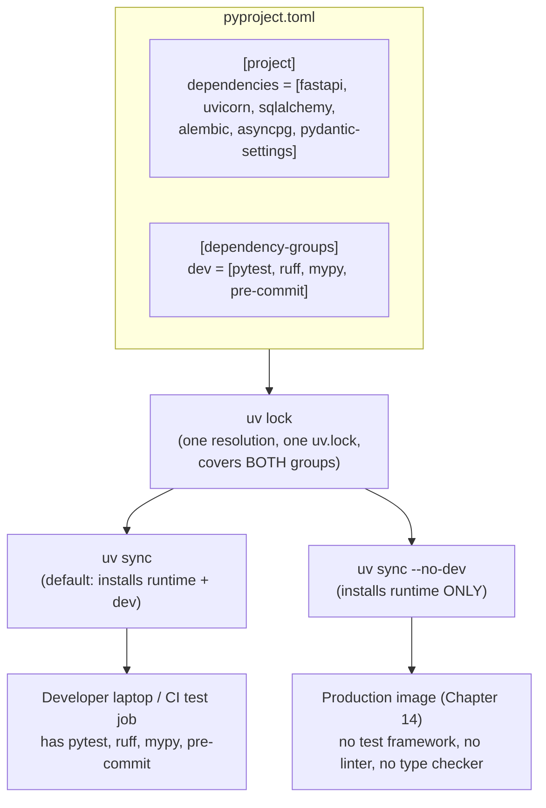
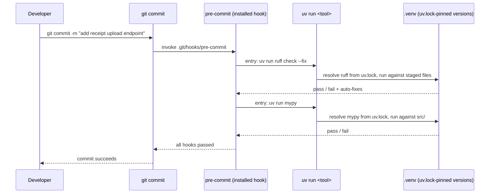

# Development Dependencies & Tooling

[Chapter 9](./09-running-code-with-uv-run.md) established `uv run` as ExpenseFlow's single entry point for executing anything — the FastAPI dev server, `alembic upgrade head`, and a standalone PEP 723 script that needed `httpx` without touching the project's real dependency set. That chapter was about *running* code. This chapter is about a category of dependency that exists purely to support the people writing and reviewing that code: test runners, linters, type checkers, and commit hooks. Priya and Marcus need `pytest`, `ruff`, `mypy`, and `pre-commit` on every machine that touches ExpenseFlow's source — their laptops and CI — but the running FastAPI application in production has absolutely no use for any of them. Getting this distinction right, and wiring it into a fast, repeatable local workflow, is the subject of this chapter.

---

## Learning Objectives

By the end of this chapter, you will be able to:

- Explain why development tooling must be tracked as a distinct dependency category from runtime dependencies, and what goes wrong when it isn't.
- Add `pytest`, `ruff`, `mypy`, and `pre-commit` to ExpenseFlow as dev dependencies using `uv add --dev`, and read the resulting `pyproject.toml`/`uv.lock` changes.
- Configure `ruff`, `mypy`, and `pytest` inside `pyproject.toml` and run each of them through `uv run`.
- Wire `pre-commit` hooks so they invoke `uv run` internally, guaranteeing the exact same tool versions run locally, in the git hook, and in CI.
- Build a one-command "check everything" dev loop for ExpenseFlow, and explain why a `Makefile`/`justfile` wrapping it is a convenience, not a requirement.
- State precisely why dev dependencies must never ship inside a production container image, and point to where Chapter 14 enforces that.

---

## Prerequisites for This Chapter

This chapter builds on:

- [Chapter 7: Dependency Management](./07-dependency-management.md) — `uv add`/`uv remove`, version specifiers, and the general shape of dependency groups, which this chapter specializes into the `dev` group specifically.
- [Chapter 8: Lock Files & Reproducibility](./08-lock-files-and-reproducibility.md) — `uv.lock` as the single source of truth for exact resolved versions; dev dependencies are locked exactly the same way runtime ones are.
- [Chapter 9: Running Code with `uv run`](./09-running-code-with-uv-run.md) — `uv run` as the mechanism that guarantees the environment matches the lockfile before anything executes. Every command in this chapter is a `uv run` invocation.

You should have ExpenseFlow's runtime dependencies (`fastapi`, `uvicorn[standard]`, `sqlalchemy`, `alembic`, `asyncpg`, `pydantic-settings`) already added and locked, per Chapters 7–8.

---

## 1. Why Development Tooling Needs Its Own Category

### 1.1 Two very different audiences for the same repository

ExpenseFlow's source tree serves two audiences that need almost entirely different sets of installed software to do their jobs:

- **The running application** — whatever process actually serves HTTP requests in production — needs `fastapi`, `uvicorn`, `sqlalchemy`, `alembic`, `asyncpg`, and `pydantic-settings`. It will never call `pytest.main()`, never import `ruff`, never invoke `mypy`. Those packages could be deleted from a production machine entirely and the application would not notice.
- **The people (and CI jobs) working on the source** — Priya, Marcus, and every GitHub Actions run — need `pytest` to execute the test suite, `ruff` to lint and format, `mypy` to type-check, and `pre-commit` to enforce all of the above automatically before a commit lands. None of *these* tools are imported by ExpenseFlow's application code at runtime; they are imported by the *process of developing* ExpenseFlow.

If you declare all of this as one undifferentiated pile of dependencies, you lose the ability to ask a question that matters enormously in Chapter 14: "install everything this application needs to run, and nothing else." That question only has a clean answer if the dependency list was split into the right categories to begin with.

### 1.2 What goes wrong without the split

Picture ExpenseFlow's `pyproject.toml` with `pytest`, `ruff`, `mypy`, and `pre-commit` simply added to `project.dependencies` alongside `fastapi` and `sqlalchemy`, because "the project needs all of these to work" felt true enough at the time. Every `uv sync` — on a laptop, in CI, and eventually in a production Docker build — now installs all nine packages indiscriminately. Concretely, this costs you:

- **A larger, slower-to-build production image**, carrying an entire test framework, a type checker, and a linter that will never execute a single line of code in production (Chapter 14 quantifies this with a real before/after image-size comparison).
- **A larger attack surface.** Every package shipped into a production image is something a security scanner has to evaluate and something that could, in principle, carry a vulnerability — for zero corresponding runtime benefit.
- **A blurrier mental model for the whole team.** "Is this a dependency the *application* needs, or a dependency *we* need to work on the application?" stops having a crisp answer, and that ambiguity compounds every time someone adds a tenth package without thinking about which category it belongs to.

None of this is hypothetical — it is precisely the failure mode Chapter 18 documents as one of the most common real-world uv mistakes: "forgetting `--no-dev` when building a production Docker image and shipping `pytest`/`ruff` into production." The fix starts here, in how the dependency is declared in the first place, not later at build time.

### 1.3 The fix: a distinct `dev` dependency group

uv's answer is a first-class, named **dependency group** — conventionally called `dev` — that lives in `pyproject.toml` right alongside `project.dependencies` but is tracked, resolved, and installed as its own separate concern. A package added to the `dev` group is:

- Locked in the same `uv.lock` as everything else (one resolution, one lockfile — Chapter 8's guarantee doesn't fragment just because you have more than one dependency group).
- Installed by a plain `uv sync` by default, because on a developer's own machine you almost always want your dev tooling available.
- **Excludable** with a single flag — `uv sync --no-dev` — which is exactly the lever Chapter 14 pulls when building a production image that must contain the runtime dependencies only.



The important idea to hold onto: **one `pyproject.toml`, one `uv.lock`, two audiences** — served by a single flag at sync time, not by maintaining two separate dependency files or two separate lockfiles by hand the way pre-uv Python projects often did with a `requirements.txt` plus a hand-maintained `requirements-dev.txt` that quietly drifted out of sync with each other.

---

## 2. Adding ExpenseFlow's Dev Toolchain

### 2.1 `uv add --dev`

Adding a dependency to the `dev` group uses the same `uv add` command from Chapter 7, with one additional flag:

```bash
$ cd expenseflow
$ uv add --dev pytest ruff mypy pre-commit
Resolved 47 packages in 812ms
Prepared 12 packages in 1.4s
Installed 12 packages in 96ms
 + mypy==1.13.0
 + pre-commit==4.0.1
 + pytest==8.3.3
 + ruff==0.7.4
 + ... (transitive dependencies of the above)
```

Notice this is a completely ordinary `uv add` invocation from the developer's point of view — same resolver, same lockfile update, same near-instant install driven by uv's global cache (Chapter 3). The only difference `--dev` makes is *where in `pyproject.toml` the entry is recorded.*

### 2.2 What lands in `pyproject.toml`

```toml
[project]
name = "expenseflow"
version = "0.1.0"
requires-python = ">=3.13"
dependencies = [
    "fastapi>=0.115",
    "uvicorn[standard]>=0.32",
    "sqlalchemy>=2.0",
    "alembic>=1.13",
    "asyncpg>=0.29",
    "pydantic-settings>=2.5",
]

[dependency-groups]
dev = [
    "mypy>=1.13",
    "pre-commit>=4.0",
    "pytest>=8.3",
    "ruff>=0.7",
]
```

The `[dependency-groups]` table is not a uv invention — it implements **PEP 735**, a standardized way of expressing named groups of dependencies in `pyproject.toml` that any PEP-735-aware tool can read, the same standards-first philosophy Chapter 2 introduced for `pyproject.toml` itself (PEP 621) and inline scripts (PEP 723). This matters for the same reason those did: your dev-dependency declarations are portable data, not a proprietary section only uv understands — a direct contrast with Poetry's historically non-standard `[tool.poetry.dev-dependencies]` section, which only Poetry itself could read. If you encounter an older uv-managed project using `[tool.uv] dev-dependencies = [...]` instead, that is uv's earlier, uv-specific mechanism that predates PEP 735 support; new projects should use `[dependency-groups]`.

### 2.3 What lands in `uv.lock`

`uv.lock` grows entries for `mypy`, `pre-commit`, `pytest`, `ruff`, and every one of *their* transitive dependencies too (`pytest` alone pulls in `iniconfig`, `pluggy`, and `packaging`; `pre-commit` pulls in `cfgv`, `identify`, `nodeenv`, `pyyaml`, and `virtualenv`). Illustrative excerpt:

```toml
[[package]]
name = "ruff"
version = "0.7.4"
source = { registry = "https://pypi.org/simple" }
sdist = { url = "https://files.pythonhosted.org/.../ruff-0.7.4.tar.gz", hash = "sha256:..." }
wheels = [
    { url = "https://files.pythonhosted.org/.../ruff-0.7.4-py3-none-manylinux_2_17_x86_64.whl", hash = "sha256:..." },
]

[[package]]
name = "expenseflow"
version = "0.1.0"
source = { editable = "." }
dependencies = [
    { name = "fastapi" },
    { name = "uvicorn", extra = ["standard"] },
    { name = "sqlalchemy" },
    { name = "alembic" },
    { name = "asyncpg" },
    { name = "pydantic-settings" },
]

[package.dev-dependencies]
dev = [
    { name = "mypy" },
    { name = "pre-commit" },
    { name = "pytest" },
    { name = "ruff" },
]
```

The dev group's packages are resolved *together* with the runtime dependencies, as one graph — this is precisely why Chapter 8's guarantee ("everyone gets the exact same resolved versions") extends to your tooling too. Priya and Marcus don't just run the same `fastapi` version; they run the exact same `ruff` version, which turns out to matter a great deal once pre-commit and CI both start invoking it (Section 4).

---

## 3. Configuring the Tools

Each tool reads its configuration from `pyproject.toml`, keeping every piece of project configuration in one file rather than scattered across `.flake8`, `mypy.ini`, `pytest.ini`, and a `setup.cfg`.

```toml
[tool.ruff]
line-length = 100
target-version = "py313"
src = ["src"]

[tool.ruff.lint]
select = ["E", "F", "I", "UP", "B", "SIM"]
ignore = ["E501"]  # line length is handled by the formatter, not the linter

[tool.ruff.format]
quote-style = "double"

[tool.mypy]
python_version = "3.13"
strict = true
files = ["src"]
plugins = ["pydantic.mypy"]

[tool.pytest.ini_options]
testpaths = ["tests"]
addopts = "-ra --strict-markers"
```

A few notes worth calling out for ExpenseFlow specifically:

- `ruff` replaces what used to be two or three separate tools (`flake8` for linting, `isort` for import sorting, `black` for formatting) with one Rust binary doing both linting (`ruff check`) and formatting (`ruff format`) — the same "one fast tool replaces a cluster of slower ones" story as uv itself.
- `mypy`'s `strict = true` is a reasonable default for a greenfield project like ExpenseFlow; a codebase migrating from untyped Python would normally phase strictness in module by module instead.
- `pytest`'s `testpaths` keeps test discovery scoped to ExpenseFlow's `tests/` directory rather than accidentally walking into `.venv` or `src/`.

---

## 4. Running the Toolchain Through `uv run`

Every one of these tools is invoked exactly the way Chapter 9 taught you to invoke anything else — through `uv run`, never through a manually activated shell or a bare `pytest`/`ruff`/`mypy` that happens to be first on `PATH`:

| Command | What it does |
|---|---|
| `uv run pytest` | Runs ExpenseFlow's test suite using the exact `pytest` version pinned in `uv.lock` |
| `uv run pytest -k test_expense_create` | Runs a filtered subset of tests, same as plain `pytest` usage |
| `uv run ruff check .` | Lints the project; reports violations without changing files |
| `uv run ruff check --fix .` | Lints and auto-fixes everything ruff can safely fix |
| `uv run ruff format .` | Reformats the codebase in place |
| `uv run ruff format --check .` | Reports what *would* be reformatted, without changing anything — the correct mode for CI (Chapter 15) |
| `uv run mypy` | Type-checks `src/` per the `[tool.mypy]` configuration |
| `uv run pre-commit run --all-files` | Runs every configured pre-commit hook against the whole tree, not just staged files |

The mechanism is identical every time: `uv run` first confirms `.venv` matches `uv.lock` (syncing it if not — Chapter 9), then executes the given command *inside* that environment. There is no world in which `uv run ruff check` silently runs a different `ruff` than the one recorded in `uv.lock`, which is the entire point of routing every single one of these tools through `uv run` instead of relying on whatever happens to resolve first on your shell's `PATH`.

---

## 5. Wiring `pre-commit` to Invoke `uv run`

### 5.1 The subtlety `pre-commit` introduces on its own

`pre-commit` is a hook-management framework with its own default behavior: for most hook repositories (like the widely used `astral-sh/ruff-pre-commit` mirror), `pre-commit` clones the hook's repository at a pinned `rev`, builds its **own** isolated virtual environment for that hook, and installs whatever tool version that `rev` specifies — completely independent of whatever `ruff` version ExpenseFlow's own `uv.lock` pins as a dev dependency.

That independence is exactly the problem. If `pre-commit`'s `ruff` hook happens to be pinned to a different `ruff` release than the one Priya and Marcus run via `uv run ruff check`, the two can disagree about what counts as a violation — a commit that passes the pre-commit hook could still fail an identical check in CI, or vice versa, purely from a version mismatch that has nothing to do with the actual code.

### 5.2 The fix: local hooks that shell out to `uv run`

The fix is to stop letting `pre-commit` manage its own copies of these tools at all, and instead define **local hooks** whose entry point is simply `uv run <tool>` — pointing every hook at the exact same dev-dependency-pinned tool that `uv run` would use anywhere else:

```yaml
# .pre-commit-config.yaml
repos:
  - repo: local
    hooks:
      - id: ruff-check
        name: ruff check
        entry: uv run ruff check --fix
        language: system
        types: [python]

      - id: ruff-format
        name: ruff format
        entry: uv run ruff format
        language: system
        types: [python]

      - id: mypy
        name: mypy
        entry: uv run mypy
        language: system
        types: [python]
        pass_filenames: false
```

`language: system` tells `pre-commit` "do not build an isolated environment for this hook — just run the `entry` command using whatever is already on the system," which in this case is `uv run`, resolving into ExpenseFlow's own `.venv` and its own `uv.lock`-pinned tool versions. There is now exactly one `ruff` in this entire picture: the one in `uv.lock`, used identically by a developer's terminal, by the pre-commit hook, and by CI (Chapter 15).

### 5.3 Installing the git hook itself

`pre-commit` the tool is itself a dev dependency (Section 2), so it too runs through `uv run`:

```bash
$ uv run pre-commit install
pre-commit installed at .git/hooks/pre-commit
```

This writes a small script into `.git/hooks/pre-commit` that git invokes automatically on every `git commit`. From that point forward, every commit Priya or Marcus makes runs `ruff check --fix`, `ruff format`, and `mypy` — via `uv run` — against the files being committed, before the commit is allowed to complete.



A teammate who clones ExpenseFlow fresh gets the entire toolchain from one command, `uv sync`, and then wires the git hook with one more, `uv run pre-commit install` — no separate `pip install -r requirements-dev.txt`, no manually installing a global `pre-commit`, no version drift to reason about.

---

## 6. The One-Command Dev Loop

Priya and Marcus's actual day-to-day check, run before pushing any branch, is three commands:

```bash
$ uv run ruff check . && uv run mypy && uv run pytest
```

That's the whole loop — no build step, no separate environment activation, nothing beyond what Chapter 9 already taught. Wrapping it in a `Makefile` or a `justfile` is a genuinely reasonable convenience once a team wants a shorter, memorable name for it, but it is worth being explicit that this is a **convenience layer on top of `uv run`, not a replacement for it or a requirement of using uv at all.**

```makefile
# Makefile
.PHONY: check fix test

check:
	uv run ruff check .
	uv run ruff format --check .
	uv run mypy

fix:
	uv run ruff check --fix .
	uv run ruff format .

test:
	uv run pytest
```

Or, using [`just`](https://github.com/casey/just), a task runner some teams prefer over `make` for its simpler, non-POSIX-Makefile syntax:

```just
# justfile
default:
    just --list

check:
    uv run ruff check .
    uv run ruff format --check .
    uv run mypy

fix:
    uv run ruff check --fix .
    uv run ruff format .

test:
    uv run pytest
```

Either way, `make check` or `just check` becomes shorthand for exactly the same three `uv run` invocations a new teammate could type by hand on day one without either file existing at all. Nothing about ExpenseFlow's dev workflow *depends* on the `Makefile`/`justfile` being present — it is there purely to save keystrokes for people who already know what the underlying commands are.

---

## 7. Dev Dependencies Must Never Ship in Production

This chapter closes on the point Section 1 opened with, stated as a hard rule: **a production ExpenseFlow container has no legitimate reason to contain `pytest`, `ruff`, `mypy`, or `pre-commit`.** The lever that enforces this is `uv sync --no-dev`, which installs only `project.dependencies`, skipping the entire `dev` group:

```bash
# What Chapter 14's production Dockerfile actually runs:
$ uv sync --frozen --no-dev
```

`--frozen` (Chapter 8) ensures this uses the committed `uv.lock` exactly as-is, with no re-resolution; `--no-dev` ensures the dev group is excluded entirely. Chapter 14 builds this into a complete, layer-cached multi-stage Dockerfile and shows a concrete before/after image-size comparison for what happens when a team forgets the `--no-dev` flag — for now, the takeaway is simply that the flag exists *because* Section 1's category split exists. Get the category split right here, in `pyproject.toml`, and the production-image concern in Chapter 14 becomes a one-flag fix instead of a restructuring exercise.

---

## Real-World Scenario

Two weeks after wiring up `pre-commit` and the dev-dependency group, ExpenseFlow's CI starts failing on a PR of Marcus's with a `ruff format --check` failure — a formatting difference in a file he hadn't even touched in this PR. Marcus is confused: pre-commit didn't flag anything locally when he committed.

Priya digs in and finds the root cause quickly: Marcus cloned his ExpenseFlow checkout fresh onto a new laptop two days earlier. He ran `uv sync` (which correctly installed `ruff` as a dev dependency) but never ran `uv run pre-commit install` — so his local git hook was never actually wired up at all. Every commit he'd made since then had skipped the pre-commit checks entirely, silently, because there was no hook installed to run them. The formatting drift had been accumulating commit by commit, invisible locally, until CI (which always runs `uv run ruff format --check` regardless of what hooks are or aren't installed on anyone's laptop) finally caught it.

The fix for Marcus's immediate PR is a single command: `uv run ruff format .`, followed by a commit of the reformatted files. The team's actual follow-up is more durable: they add a line to ExpenseFlow's `README.md` onboarding section making the two-command setup explicit and impossible to half-do —

```bash
uv sync
uv run pre-commit install
```

— and they additionally note that CI (Chapter 15) is the real backstop regardless of what any individual laptop's git hooks are doing: pre-commit hooks are a fast, local convenience that catches problems in seconds, but they are not the enforcement mechanism. CI, which cannot be skipped or forgotten, is.

---

## Best Practices

- Track `pytest`, `ruff`, `mypy`, and `pre-commit` as a `dev` dependency group via `uv add --dev`, never as plain `project.dependencies` — Section 1 explains exactly what breaks if you don't.
- Keep every tool's configuration inside `pyproject.toml` (`[tool.ruff]`, `[tool.mypy]`, `[tool.pytest.ini_options]`) rather than scattering it across `.flake8`, `mypy.ini`, and `pytest.ini` — one file, one source of truth.
- Wire `pre-commit` hooks as `local` hooks with `language: system` and an `entry` of `uv run <tool>`, so pre-commit never installs its own, potentially different, versions of your linters (Section 5.2).
- Document the two-command onboarding sequence explicitly (`uv sync`, then `uv run pre-commit install`) — the second command is easy to forget precisely because it produces no visible output difference until something later goes wrong.
- Treat a `Makefile`/`justfile` wrapping your `uv run` checks as an optional convenience, not infrastructure anyone depends on — every command it wraps must remain runnable directly.
- Enforce `--no-dev` at the one place it actually matters — the production Docker build (Chapter 14) — rather than trying to remember it ad hoc.

---

## Common Mistakes

- **Declaring `pytest`/`ruff`/`mypy` as plain runtime dependencies** instead of a `dev` group, which makes it impossible to cleanly exclude them from a production install later (Section 1.2).
- **Letting `pre-commit` manage its own hook environments** (e.g., using the standard `astral-sh/ruff-pre-commit` mirror repo instead of a `local`/`language: system` hook), producing a `ruff` version in the git hook that quietly diverges from the one pinned in `uv.lock` (Section 5.1).
- **Running `uv sync` but never `uv run pre-commit install`**, leaving the git hook entirely unwired while believing it's active — exactly this chapter's Real-World Scenario.
- **Treating the `Makefile`/`justfile` as required infrastructure**, to the point that a new contributor without `make`/`just` installed can't run the checks at all — always keep the underlying `uv run` commands as the documented, guaranteed-to-work path.
- **Manually activating `.venv` to run `pytest`/`ruff`/`mypy` directly**, reintroducing the exact "which environment am I actually in" ambiguity Chapter 6 and Chapter 9 spent effort eliminating via `uv run`.
- **Forgetting `--no-dev` on a production build** (Chapter 14's dedicated failure mode, previewed in Section 7) — this chapter is where the category discipline that prevents it actually gets established.

---

## Summary

- Runtime dependencies and development tooling serve two different audiences — the running application versus the people (and CI) working on it — and need to be tracked as distinct categories (Section 1).
- `uv add --dev` adds a package to the `[dependency-groups]` `dev` group, a PEP 735–standardized, portable mechanism, resolved and locked together with runtime dependencies in one `uv.lock` (Section 2).
- `ruff`, `mypy`, and `pytest` are configured directly inside `pyproject.toml` under `[tool.ruff]`, `[tool.mypy]`, and `[tool.pytest.ini_options]` (Section 3).
- Every tool is run via `uv run <tool>`, guaranteeing the exact `uv.lock`-pinned version executes, whether invoked by a developer, a git hook, or CI (Section 4).
- `pre-commit` hooks should be defined as `local` hooks with `language: system` and an `entry` of `uv run <tool>`, so the git hook and the command line always agree on tool versions (Section 5).
- A `Makefile`/`justfile` wrapping `uv run ruff check && uv run mypy && uv run pytest` is a reasonable convenience for a one-command dev loop, but never a required layer (Section 6).
- `uv sync --no-dev` excludes the entire `dev` group, which is exactly the flag Chapter 14's production Dockerfile relies on to keep test/lint tooling out of the shipped image (Section 7).

---

## Knowledge Check

1. Why can't `pytest`, `ruff`, `mypy`, and `pre-commit` simply be added to ExpenseFlow's `project.dependencies` alongside `fastapi` and `sqlalchemy`? What breaks later if you do this?
2. What table does `uv add --dev` write entries into, and what standard does that table implement?
3. A teammate configures `pre-commit` using the standard `astral-sh/ruff-pre-commit` repository hook instead of a `local` hook. What could go wrong, specifically, compared to a `local` hook whose `entry` is `uv run ruff check`?
4. Two commands are needed to fully onboard a new ExpenseFlow contributor's local dev environment, including working git hooks. What are they, and what breaks silently if the second one is skipped?
5. What is the difference in effect between `uv sync` and `uv sync --no-dev`, and where in this course does that distinction become operationally important?
6. Is a `Makefile`/`justfile` required to use uv's dev-dependency workflow? Justify your answer with reference to what the file actually wraps.

---

## Hands-On Exercise

**Goal:** Add ExpenseFlow's dev toolchain, configure each tool, wire up `pre-commit` correctly, and prove the one-command dev loop works end to end.

1. From your ExpenseFlow checkout (with runtime dependencies already added per Chapter 7), run `uv add --dev pytest ruff mypy pre-commit` and inspect the resulting `[dependency-groups]` table in `pyproject.toml`.
2. Add `[tool.ruff]`, `[tool.mypy]`, and `[tool.pytest.ini_options]` sections to `pyproject.toml`, matching Section 3's configuration (adjust `files`/`testpaths` to your actual `src`/`tests` layout).
3. Create a `.pre-commit-config.yaml` with three `local` hooks — `ruff-check`, `ruff-format`, `mypy` — each using `language: system` and an `entry` of `uv run <tool>`, exactly as shown in Section 5.2.
4. Run `uv run pre-commit install` and confirm it reports installing the hook at `.git/hooks/pre-commit`.
5. Deliberately introduce a formatting violation (e.g., inconsistent quote style) and an unused import in a Python file, then run `git add` and `git commit -m "test hooks"`. Confirm the commit is blocked (or auto-fixed and requires re-staging) by the `ruff` hooks.
6. Fix any remaining issues, and confirm `git commit` now succeeds.
7. Add a `justfile` (or `Makefile`) with `check` and `fix` targets per Section 6, and confirm `just check` (or `make check`) produces the same output as running the three `uv run` commands directly.
8. Finally, run `uv sync --no-dev --dry-run` (or inspect `uv sync --no-dev` in a scratch copy of the project) and confirm `pytest`, `ruff`, `mypy`, and `pre-commit` are excluded from what would be installed — this is the exact command Chapter 14 will use for real.

---

## Further Reading

- [uv Concepts — Dependencies](https://docs.astral.sh/uv/concepts/) — covers dependency groups, including the `dev` group, in full.
- [uv Reference — CLI (`uv add`)](https://docs.astral.sh/uv/reference/) — complete flag reference for `uv add --dev` and related options.
- [PEP 735 – Dependency Groups in pyproject.toml](https://peps.python.org/pep-0621/) — the standards page for `pyproject.toml` metadata this chapter's `[dependency-groups]` table builds on (see the Python Packaging User Guide below for the dependency-groups-specific spec).
- [Python Packaging User Guide](https://packaging.python.org/) — background on standardized `pyproject.toml` sections and how tool-specific configuration coexists with them.
- [pre-commit Documentation](https://pre-commit.com/) — for the `language: system` local-hook pattern referenced in Section 5, and the full `.pre-commit-config.yaml` schema.

---

<div style="display:flex;justify-content:space-between;align-items:center;">
  <a href="./09-running-code-with-uv-run.md">← Previous: Running Code with uv run</a>
  <a href="./00-index.md">🏠 Index</a>
  <a href="./11-tool-management-uvx.md">Next: Tool Management & uvx →</a>
</div>
