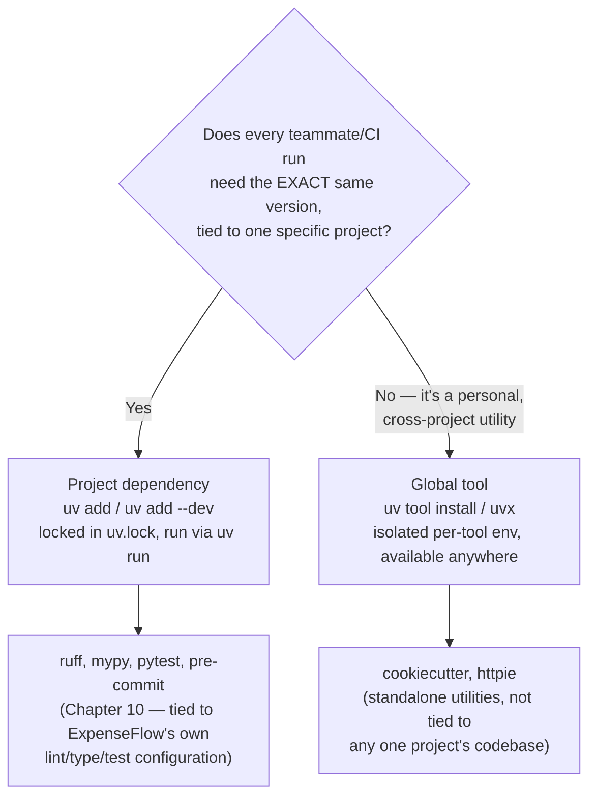
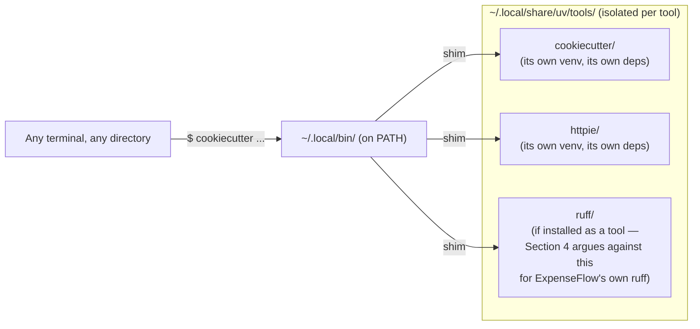
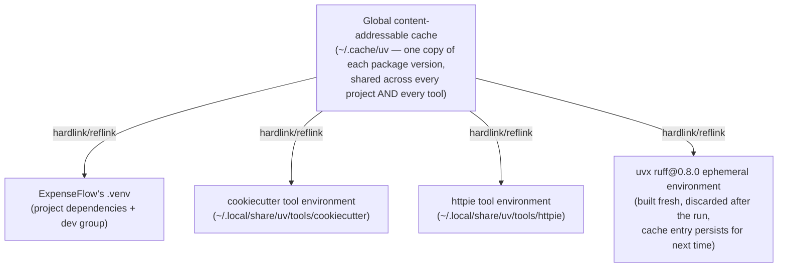

# Tool Management & `uvx`

[Chapter 10](./10-development-dependencies-and-tooling.md) settled `pytest`, `ruff`, `mypy`, and `pre-commit` into ExpenseFlow's `dev` dependency group — versioned in `pyproject.toml`, locked in `uv.lock`, run via `uv run`, identical on every teammate's machine and in CI. That chapter deliberately left one question hanging: what about software that has nothing to do with ExpenseFlow's dependency graph at all — a project scaffolding tool Marcus wants to generate a brand-new microservice skeleton, or a quick HTTP client Priya wants for poking at an endpoint from her terminal, unrelated to any Python project she happens to be sitting in at the time? This chapter is about that second category — **tools**, in uv's specific vocabulary — and about `uvx`, uv's answer to "run this one thing, right now, without installing anything into any project."

---

## Learning Objectives

By the end of this chapter, you will be able to:

- Explain the difference between a **project dependency** and a **global tool** in uv's model, precisely and in your own words.
- Install, list, upgrade, and remove a global CLI tool using `uv tool install`, `uv tool list`, `uv tool upgrade`, and `uv tool uninstall`.
- Run a tool ephemerally with `uvx` (`uv tool run`) without any persistent installation step at all.
- Pin a specific tool version for a one-off invocation, and use `uvx --with` to add extra packages into an ephemeral tool run.
- Correctly categorize `ruff`, `mypy`, `pytest`, `cookiecutter`, and `httpie` as project dev-dependencies or global tools for a real team, and justify each answer.
- Diagnose a version-mismatch bug caused by installing a linter as a global tool instead of a project dev-dependency.

---

## Prerequisites for This Chapter

This chapter builds on:

- [Chapter 7: Dependency Management](./07-dependency-management.md) and [Chapter 10: Development Dependencies & Tooling](./10-development-dependencies-and-tooling.md) — you should be comfortable with what a project dependency is, how `uv add --dev` works, and why ExpenseFlow's `ruff`/`mypy`/`pytest`/`pre-commit` are tracked that way.
- [Chapter 3: Architecture & Internals](./03-architecture-and-internals.md) — the global, content-addressable cache that makes both `uv add` and the tool mechanisms in this chapter fast, since both draw from the same shared cache.
- [Chapter 6: Virtual Environments](./06-virtual-environments.md) — the idea of an isolated Python environment, which this chapter extends to environments that exist *per tool* rather than per project.

---

## 1. Two Different Kinds of "Installed"

### 1.1 The question that motivates this whole chapter

Suppose Marcus wants to use [Cookiecutter](https://cookiecutter.readthedocs.io/) — a popular project-scaffolding tool — to generate the skeleton for a brand-new internal service unrelated to ExpenseFlow. Does he run `uv add cookiecutter` inside ExpenseFlow's `pyproject.toml`? That would be strange: Cookiecutter has nothing to do with what ExpenseFlow imports or runs, it would show up in every teammate's `uv sync`, and it would need to be re-added to every *other* project he ever wants to scaffold something in. Clearly `uv add` — which Chapter 7 taught you is for *this project's* dependencies — is the wrong tool for the job. But `pip install cookiecutter` into whatever Python happens to be active is exactly the un-isolated, "which environment is this even in" mess that Chapters 3 and 6 spent real effort steering you away from.

uv resolves this with a genuinely distinct third concept, alongside project dependencies and dev dependencies: the **tool**.

### 1.2 Project dependency vs. global tool, defined precisely

| Aspect | Project dependency (`uv add` / `uv add --dev`) | Global tool (`uv tool install` / `uvx`) |
|---|---|---|
| **Declared in** | `pyproject.toml` (`[project.dependencies]` or `[dependency-groups]`) | Nowhere in any project file — tracked in uv's own tool registry |
| **Locked in** | The project's `uv.lock` | Not locked at all — each tool has its own isolated environment, versioned independently |
| **Scope** | This one project only | The whole machine — available from any directory, any project, or none |
| **Invoked via** | `uv run <command>`, from inside the project | `uvx <command>` (ephemeral) or the installed tool's shim on `PATH` (persistent), from anywhere |
| **Shared across teammates?** | Yes — everyone who runs `uv sync` gets the exact same version | No — each person's global tool installs are theirs alone; nothing about them is committed to the repo |
| **Right for** | Anything the *project* needs at runtime or that the *team* needs to run identically against *this* codebase | Standalone utilities you personally use across many unrelated contexts |

The clean mental test: **if two different people need to get the exact same version of this tool by cloning the same repository and running one command, it's a project dependency. If it's a personal convenience you reach for regardless of which project (if any) you're sitting in, it's a global tool.**



---

## 2. `uv tool install`: Persistent Global Installation

### 2.1 Installing a tool

```bash
$ uv tool install cookiecutter
Resolved 12 packages in 340ms
Installed 12 packages in 88ms
Installed 1 executable: cookiecutter
```

This creates a dedicated, isolated virtual environment for `cookiecutter` and everything it depends on — entirely separate from ExpenseFlow's `.venv`, from any other project's `.venv`, and from any other tool's environment. uv places these tool environments under a managed directory (`~/.local/share/uv/tools` on Linux/macOS by default; use `uv tool dir` to see the actual path on your machine) and adds a small executable shim for `cookiecutter` to a directory on your `PATH` (`~/.local/bin` by default; `uv tool dir --bin` shows the exact location).

From this point forward, typing `cookiecutter` in *any* terminal, in *any* directory, runs this globally installed tool — no `uv run`, no active project, no `pyproject.toml` required anywhere nearby.



### 2.2 Listing, upgrading, and removing tools

```bash
$ uv tool list
cookiecutter v2.6.0
- cookiecutter

$ uv tool upgrade cookiecutter
Updated cookiecutter v2.6.0 -> v2.6.1

$ uv tool uninstall cookiecutter
Uninstalled 12 packages in 41ms
```

| Command | What it does |
|---|---|
| `uv tool install <package>` | Installs a tool into its own isolated environment, adds a shim on `PATH` |
| `uv tool install <package>==<version>` | Installs a specific pinned version of the tool |
| `uv tool list` | Lists every globally installed tool and the executables each one provides |
| `uv tool upgrade <package>` | Upgrades an installed tool to the latest compatible version |
| `uv tool upgrade --all` | Upgrades every installed tool at once |
| `uv tool uninstall <package>` | Removes the tool's environment and its `PATH` shim entirely |
| `uv tool dir` | Prints where tool environments are stored on this machine |

### 2.3 A tool with more than one executable, and `--from`

Some packages provide a CLI whose executable name differs from the package's PyPI name, or a package provides several commands at once. `uv tool install --from <package> <command>` lets you be explicit about which package provides which command when the two names diverge, and `uvx --from <package> <command>` does the same for ephemeral runs (Section 3).

### 2.4 Which Python does a tool actually run under?

A tool's isolated environment needs a Python interpreter just like any project's `.venv` does, and uv resolves it the same way it resolves an interpreter for a project (Chapter 4): by default, it uses the newest suitable Python it can find or install via its managed `python-build-standalone` distributions, entirely independent of whatever interpreter ExpenseFlow's own `.venv` happens to be pinned to. If Cookiecutter needs Python 3.12 or newer and your ExpenseFlow project is pinned to 3.13 (Chapter 4), those two facts never interact — the tool's environment and the project's environment don't share an interpreter, a dependency tree, or anything else.

You can be explicit about this when it matters:

```bash
# Force a tool's isolated environment onto a specific interpreter version:
$ uv tool install --python 3.12 cookiecutter

# Same idea for an ephemeral uvx run:
$ uvx --python 3.12 cookiecutter https://github.com/some-org/fastapi-service-template
```

This is rarely necessary for well-behaved, actively maintained tools, but it matters for the same reason interpreter pinning matters anywhere else in this course: some tools have not yet been tested against the newest Python release, and pinning avoids surprising failures without touching anything about how any of your actual projects are configured.

### 2.5 Reinstalling and upgrading in bulk

Two more commands round out the day-to-day maintenance of your personal tool collection:

```bash
# Reinstall a tool from scratch — useful if its environment gets into a bad state:
$ uv tool install --reinstall cookiecutter

# Upgrade every globally installed tool in one pass:
$ uv tool upgrade --all
Updated cookiecutter v2.6.0 -> v2.6.1
Updated httpie v3.2.2 -> v3.2.4
```

`uv tool upgrade --all` is convenient, but Section 4's Real-World Scenario is a direct warning about running it casually: if any of your global tools happen to *also* be something you occasionally use bare (outside `uv run`) against a real project, an unplanned bulk upgrade can silently change what that bare command reports, days or weeks before you notice.

### 2.6 "Command not found" after installing a tool

The most common first-time snag with `uv tool install` has nothing to do with uv's resolver — it's that the shim directory (`~/.local/bin` by default) simply isn't on the shell's `PATH` yet, especially on a freshly provisioned machine or a minimal container image. uv has a built-in fix:

```bash
$ uv tool update-shell
```

This detects your shell (bash, zsh, fish, etc.) and appends the necessary `PATH` update to the appropriate shell startup file, so a new terminal session picks up every tool you install from that point forward. If a newly installed tool's command still isn't found after this, the fastest diagnosis is simply `uv tool dir --bin` to print the shim directory uv is actually using, followed by checking whether that exact path appears in `echo $PATH`.

---

## 3. `uvx`: Zero-Install, Ephemeral Execution

### 3.1 What `uvx` actually is

`uvx` is not a separate binary bolted onto uv — it is a convenient alias for `uv tool run`. Where `uv tool install` creates a *persistent* isolated environment and a `PATH` shim you'll reuse indefinitely, `uvx` creates a **throwaway** isolated environment for exactly one invocation, backed by uv's global cache (Chapter 3) so repeated runs of the same tool are still fast, without ever registering anything permanent on your machine.

```bash
$ uvx cookiecutter https://github.com/some-org/fastapi-service-template
```

The very first time this runs, uv resolves and downloads `cookiecutter` into its cache exactly as it would for any dependency. It then executes the command in a throwaway environment built from that cache. Run the exact same `uvx cookiecutter ...` command again next month, and it reuses the cached package — no re-download, no lingering "did I remember to install this" state to manage, and nothing added to `uv tool list`.

### 3.2 `uv tool install` vs. `uvx`, side by side

| | `uv tool install <pkg>` | `uvx <pkg>` (`uv tool run`) |
|---|---|---|
| Leaves a persistent environment behind? | Yes | No — ephemeral, built fresh from cache each time (cache itself persists) |
| Adds a `PATH` shim? | Yes — `<command>` becomes directly runnable afterward | No — you invoke it as `uvx <command>` every time |
| Appears in `uv tool list`? | Yes | No |
| Best for | A tool you'll reach for repeatedly, want available by its own bare name | A tool you run rarely, or want to try/pin a specific version without commitment |
| Typical use | `cookiecutter` used every few weeks to scaffold new services | A one-off `httpie` request, or trying a brand-new `ruff` release before deciding to adopt it |

### 3.3 Version-pinned, ephemeral, one-off runs

`uvx` shines specifically for "just this once, this exact version, no side effects" situations:

```bash
# Run a specific ruff version once, to see what a newer release would flag,
# without touching ExpenseFlow's own pinned dev-dependency ruff at all:
$ uvx ruff@0.8.0 check .

# Run httpie for a single ad-hoc request against ExpenseFlow's local dev server:
$ uvx httpie GET http://localhost:8000/api/expenses

# Pull in an extra package just for this one tool invocation with --with:
$ uvx --with requests-toolbelt httpie GET http://localhost:8000/api/expenses
```

None of these commands touch ExpenseFlow's `pyproject.toml` or `uv.lock` in any way — they are entirely outside the project's dependency graph, exactly as Section 1 intended for genuinely standalone utilities.

### 3.4 Why tool environments never collide with each other or with your projects

It's worth connecting this back to Chapter 3's architecture, because the same underlying mechanism is what makes both `uv tool install` and `uvx` fast *and* safe. Every tool environment — persistent or ephemeral — is built from packages materialized out of uv's single, global, content-addressable cache (`uv cache dir` shows its location). When you `uv tool install cookiecutter`, uv doesn't re-download anything already cached from some unrelated project that happened to depend on the same package version; it hardlinks (or reflinks, depending on your filesystem) straight from the cache, the same way `uv sync` populates any project's `.venv`. The isolation between tool environments — and between tool environments and any project's `.venv` — is achieved by giving each one its own *environment*, not by giving each one its own *copy of every package's bytes on disk*. This is exactly the "shared cache, isolated environments" split Chapter 3 introduced for projects, applied here to tools:



Practically, this means installing a tenth global tool, or running a `uvx` command for the first time, costs you network time only for packages genuinely not already in your cache — which, for popular tools sharing common dependencies (`requests`, `click`, `jinja2`, and the like), is often close to nothing. It also means uninstalling a tool (`uv tool uninstall`) or letting an ephemeral `uvx` environment disappear after the command exits never touches the shared cache those environments borrowed from — other projects and tools that also reference those same cached packages are completely unaffected.

---

## 4. The Decision: Project Dependency or Global Tool?

### 4.1 Why this trips people up

The confusion this chapter exists to resolve is specific and common: `ruff`, `mypy`, and `pytest` *feel* like the same category of thing as `cookiecutter` and `httpie` — they're all "developer tools," all invoked from a terminal, all conceptually separate from what ships to production. It is entirely possible to `uv tool install ruff` and have it work — the command succeeds, `ruff` runs, you get lint output. The mistake is subtle exactly because it *appears* to work.

### 4.2 Why `ruff`/`mypy`/`pytest` belong in `dev`, not as global tools, for a real team

The test from Section 1.2 answers this cleanly: does every teammate and CI run need the *exact same version*, tied to *this specific codebase's* configuration? For `ruff`, `mypy`, and `pytest` against ExpenseFlow, the answer is unambiguously yes:

- ExpenseFlow's `[tool.ruff]`/`[tool.mypy]`/`[tool.pytest.ini_options]` configuration (Chapter 10, Section 3) is written against specific tool versions' behavior. A newer `ruff` might introduce new lint rules under the same `select` list; a newer `mypy` might tighten inference in a way that surfaces new type errors in old code. If Priya's machine has `ruff 0.8.0` installed globally while Marcus's has `ruff 0.7.4` globally, and CI pins yet a third version, **three different sets of violations can be reported for the identical code** — a bug class this course has already named directly in Chapter 8's "it worked on my machine" incident, now recurring at the tooling layer instead of the dependency layer.
- `uv add --dev` ties the version to `uv.lock`, which is committed to the repository (Chapter 8). Cloning the repo and running `uv sync` is the *entire* onboarding step for getting the identical tool version everyone else has — no separate "also remember to `uv tool install` these three things at this pinned version" instruction to keep in sync by hand.
- Chapter 10's `pre-commit` wiring (`language: system`, `entry: uv run ruff check`) *specifically depends* on `ruff`/`mypy` being reachable via `uv run` from inside the project. A globally installed `ruff` sitting outside the project entirely defeats that design — the hook would either fail to find it (if relying on `uv run`, which resolves within the project's own environment) or, worse, silently use whichever global copy happens to be on `PATH`, reintroducing the exact version-mismatch risk `uv run` exists to prevent.

### 4.3 Why `cookiecutter`/`httpie` belong as global tools, not project dependencies

The same test, applied the other way: does ExpenseFlow's codebase, configuration, or CI pipeline depend on a specific `cookiecutter` or `httpie` version at all? No — Cookiecutter is used *occasionally, by individuals, to generate scaffolding for entirely separate projects*; it has no relationship to ExpenseFlow's source, its `pyproject.toml`, or its test suite. Adding it as a dev dependency would mean every `uv sync` on ExpenseFlow installs a project-scaffolding tool that ExpenseFlow itself will never invoke, bloating the dev environment with something structurally unrelated to working on *this* codebase — a smaller-scale version of exactly the category error Chapter 10 warned against for runtime dependencies.

### 4.4 The decision table

| Tool | Used identically by the whole team against one codebase's config? | Category | Mechanism |
|---|---|---|---|
| `ruff` | Yes — ExpenseFlow's `[tool.ruff]` config, shared lint rules | Project dev-dependency | `uv add --dev ruff`, run via `uv run ruff check` |
| `mypy` | Yes — ExpenseFlow's `[tool.mypy]` config, shared type-checking baseline | Project dev-dependency | `uv add --dev mypy`, run via `uv run mypy` |
| `pytest` | Yes — runs ExpenseFlow's own test suite, needs to match CI exactly | Project dev-dependency | `uv add --dev pytest`, run via `uv run pytest` |
| `pre-commit` | Yes — the hook framework itself must match what CI/other devs expect | Project dev-dependency | `uv add --dev pre-commit`, run via `uv run pre-commit` |
| `cookiecutter` | No — a personal scaffolding utility, unrelated to any one project's code | Global tool | `uv tool install cookiecutter`, or `uvx cookiecutter` for occasional use |
| `httpie` | No — a general-purpose HTTP client used across many unrelated tasks | Global tool | `uv tool install httpie`, or `uvx httpie` for a one-off request |

The pattern generalizes well beyond this specific list: **anything whose correctness or configuration is coupled to one codebase belongs in that codebase's `dev` dependency group; anything that is a general-purpose personal utility, decoupled from any single project, belongs as a global tool.** When in doubt, ask Section 4.2's question directly — "if a new teammate cloned this repo today, would they need this exact tool version to get the same results as everyone else?"

### 4.5 Extending the pattern to other tools you'll encounter

The `ruff`/`mypy`/`pytest`/`cookiecutter`/`httpie` list is deliberately small enough to reason about directly, but the same test resolves plenty of other tools engineers ask about once they've internalized it:

| Tool | Typically | Reasoning |
|---|---|---|
| `black` / `isort` (if not using `ruff format`) | Project dev-dependency | Same argument as `ruff` — formatting output must be identical across every contributor and CI, or diffs churn on style alone |
| `pip-audit` / `safety` (dependency vulnerability scanners) | Usually project dev-dependency, sometimes CI-only tool | If run as part of the team's standard checks against this codebase's exact dependency set, it belongs with the rest of `dev`; if it's an occasional personal audit unrelated to any one project, it's a global tool |
| `twine` (package upload) | Global tool | Rarely tied to one project's day-to-day dev loop; typically invoked occasionally, by whoever is publishing a release (Chapter 16 covers `uv publish` as uv's own alternative) |
| `httpie` / `curlie` (HTTP clients) | Global tool | General-purpose utilities used across many unrelated tasks and projects |
| `cookiecutter` / `copier` (scaffolding) | Global tool | Generate new, unrelated projects; not tied to any one codebase's dependency graph |
| `pgcli` / `litecli` (database CLIs) | Global tool | Used across many databases and projects, never tied to one specific codebase's Python dependency graph |
| A project's own `alembic` | Project dependency (Chapter 7 — runtime, not dev) | Alembic's revision graph is tied to *this* database schema specifically; every teammate must run the exact same Alembic behavior against it |

The recurring signal is never "is this a CLI tool" — nearly everything discussed in this course is invoked from a CLI. It's whether the tool's *behavior*, *configuration*, or *output* is coupled to one specific codebase that every collaborator needs to agree on byte-for-byte.

---

## 5. Command Reference

| Command | Category | Purpose |
|---|---|---|
| `uv add --dev <pkg>` | Project dependency | Add a package to this project's `dev` group, locked in `uv.lock` |
| `uv run <tool>` | Project dependency | Run a project (dev-)dependency inside this project's environment |
| `uv tool install <pkg>` | Global tool | Persistently install a tool, isolated, available anywhere via a `PATH` shim |
| `uv tool install <pkg>==<ver>` | Global tool | Install a specific pinned version persistently |
| `uv tool list` | Global tool | List all persistently installed tools |
| `uv tool upgrade <pkg>` / `--all` | Global tool | Upgrade one or all installed tools |
| `uv tool uninstall <pkg>` | Global tool | Remove a tool's environment and its shim |
| `uv tool dir` | Global tool | Show where tool environments are stored |
| `uvx <pkg>` (`uv tool run <pkg>`) | Global tool (ephemeral) | Run a tool once, from cache, with no persistent installation |
| `uvx <pkg>@<version>` | Global tool (ephemeral) | Run a specific version once, without installing it persistently |
| `uvx --with <extra> <pkg>` | Global tool (ephemeral) | Run a tool with an additional package injected just for this run |

---

## Real-World Scenario

A few weeks after Chapter 10's pre-commit incident, Priya notices `ruff` has shipped a release with a rule she's excited about and, without thinking much of it, runs `uv tool install ruff` on her laptop so she can "just use the latest ruff" from any terminal. It works exactly as expected — `ruff` is now on her `PATH` globally, reporting the newest version.

A week later, Priya opens a PR that passes her local pre-commit hook cleanly. CI fails it immediately, flagging three lint violations her local run never mentioned. Marcus, reviewing the PR, is confused — the code looks fine to him too, locally.

The investigation is short once someone thinks to check tool versions rather than code: Priya's global `uv tool install ruff` had, some time after installation, been silently upgraded past the version pinned in ExpenseFlow's `uv.lock` (she'd run `uv tool upgrade --all` a few days earlier for an unrelated reason and forgotten about it). Because her pre-commit hook was correctly wired per Chapter 10's `language: system` / `uv run ruff check` pattern, it should have used the *project's* pinned `ruff` — and it did. But Priya, testing changes quickly outside the commit flow, had gotten in the habit of also running a bare `ruff check .` directly in her terminal — which, because her shell resolved the globally tool-installed `ruff` first on `PATH`, silently ran the newer global version instead of the project-pinned one, and that newer version simply hadn't yet flagged the three violations that the older, `uv.lock`-pinned `ruff` (and thus CI) correctly caught.

The fix is procedural, not technical: the team confirms there is no actual conflict in the tooling design — `uv run ruff check` was always going to be correct — and the mistake was a habit of typing a bare `ruff check` instead of `uv run ruff check`. They add a line to ExpenseFlow's contributing guide: **"always invoke project tooling as `uv run <tool>`, never as a bare command — even if you also happen to have that tool installed globally for other purposes."** Priya keeps her globally tool-installed `ruff` (she still likes previewing new releases before they land in `uv.lock`), but now treats it strictly as a separate, exploratory copy — never the one she trusts for an actual commit or PR.

---

## Best Practices

- Apply the Section 1.2 test — "does everyone need the exact same version tied to this codebase?" — every time you're unsure whether something is a project dependency or a global tool.
- Keep `ruff`, `mypy`, `pytest`, and `pre-commit` as project dev-dependencies for any real team codebase, run exclusively via `uv run`, never installed globally as the copy you rely on for actual commits.
- Reach for `uv tool install` for utilities you'll use repeatedly across many unrelated projects (`cookiecutter`, `httpie`, and similar), so they're available by their bare command name everywhere.
- Reach for `uvx` instead of `uv tool install` for anything you run rarely, want to try before committing to, or want to run at a specific one-off version without disturbing a persistent install.
- If you keep a global copy of a tool that's *also* a project dev-dependency (e.g., to preview a newer `ruff` release), be deliberate that it is a separate, exploratory tool — never let it become the copy you trust for actual project work.
- Periodically review `uv tool list` on your own machine — global tools are personal and easy to forget about, unlike project dependencies which are visible to the whole team in `pyproject.toml`.

---

## Common Mistakes

- **Installing `ruff`/`mypy`/`pytest` as global tools instead of project dev-dependencies**, causing a developer's laptop and CI to silently run different versions against the identical codebase (this chapter's Real-World Scenario).
- **Running a bare `<tool>` command out of habit instead of `uv run <tool>`**, which resolves whatever is first on `PATH` — potentially a global tool install — rather than the project-pinned version, even when the project dependency is correctly declared.
- **Adding a genuinely standalone utility like `cookiecutter` as a project dev-dependency**, bloating every teammate's `uv sync` with something unrelated to the codebase itself.
- **Confusing `uv tool install` and `uvx`** — reaching for a persistent install when a one-off `uvx` run would have been simpler and left nothing behind, or repeatedly typing `uvx <tool>` for something used daily when `uv tool install` would save the repetition.
- **Assuming `uv tool upgrade --all` is harmless** without considering that it can silently move a globally installed copy of a tool you also use for project work out of sync with what's pinned in that project's `uv.lock`.
- **Forgetting that global tool installs are per-machine, not per-team** — nothing about `uv tool install` is captured in `pyproject.toml` or `uv.lock`, so it can never be the mechanism for guaranteeing a teammate has the same version of anything.

---

## Summary

- A **project dependency** (`uv add`/`uv add --dev`) is versioned per-project, locked in `uv.lock`, shared identically across every teammate and CI run, and invoked via `uv run` (Section 1).
- A **global tool** (`uv tool install`) is installed once, in its own isolated environment, available anywhere on the machine via a `PATH` shim, and is a personal, per-machine concern (Section 2).
- `uvx` (`uv tool run`) runs a tool ephemerally from uv's cache, with no persistent installation or `PATH` shim left behind — ideal for one-off or version-pinned invocations (Section 3).
- `ruff`, `mypy`, `pytest`, and `pre-commit` belong as ExpenseFlow project dev-dependencies, because the whole team needs the identical version tied to this codebase's own configuration (Section 4.2).
- `cookiecutter` and `httpie` belong as global tools, because they are standalone utilities decoupled from any single project's codebase (Section 4.3).
- The decision test generalizes: tie a tool's version to a project via `uv add --dev` whenever team-wide/CI version consistency matters for that specific codebase; install it globally via `uv tool install`/`uvx` whenever it's a personal, cross-project utility (Section 4.4).

---

## Knowledge Check

1. In your own words, what is the precise difference between a project dependency and a uv "tool"?
2. What does `uvx` stand for as a command, and how does it differ in behavior from `uv tool install`?
3. Why does keeping `ruff` as an ExpenseFlow dev-dependency (rather than a global tool) matter specifically for the `pre-commit` wiring built in Chapter 10?
4. A teammate argues `pytest` should be a global tool "since it's just a testing utility, not something the app itself depends on." What's wrong with this reasoning?
5. When would you reach for `uv tool install cookiecutter` over `uvx cookiecutter`, and vice versa?
6. Explain, step by step, how Priya's Real-World Scenario bug occurred, even though her pre-commit hook was correctly wired to use `uv run ruff check`.
7. What does `uvx ruff@0.8.0 check .` let you do that `uv run ruff check .` (against ExpenseFlow's own pinned `ruff`) does not?

---

## Hands-On Exercise

**Goal:** Experience the project-dependency-vs-global-tool distinction directly, including the version-mismatch failure mode from this chapter's Real-World Scenario.

1. Confirm ExpenseFlow's pinned `ruff` version from Chapter 10: `uv run ruff --version`.
2. Install `ruff` as a global tool at a different (ideally older) version: `uv tool install ruff==<some-older-version>` — check [PyPI's ruff release history](https://pypi.org/project/ruff/#history) for a valid older version number.
3. Run `ruff --version` (bare, no `uv run`) and compare it to step 1's output — confirm your shell now resolves the globally tool-installed version, not the project-pinned one.
4. Deliberately write a small snippet of Python in ExpenseFlow that the *older* global `ruff` does not flag but the *project-pinned* (newer) `ruff` does (or vice versa — check each version's changelog for a rule that was added or changed between the two versions).
5. Run bare `ruff check .` and then `uv run ruff check .` against the same file and observe the differing results — this reproduces, in miniature, the exact confusion from this chapter's Real-World Scenario.
6. Clean up: `uv tool uninstall ruff`, and confirm `ruff --version` (bare) now fails with a "command not found" — proving nothing was left silently shadowing the project's own tooling.
7. Now practice the ephemeral path: run `uvx cookiecutter --help` (no persistent install), confirm it works, and confirm `uv tool list` does not include `cookiecutter` afterward.
8. Finally, install `cookiecutter` persistently with `uv tool install cookiecutter`, confirm it now appears in `uv tool list`, and remove it again with `uv tool uninstall cookiecutter`.

---

## Further Reading

- [uv Concepts — Tools](https://docs.astral.sh/uv/concepts/) — the official conceptual reference for `uv tool install`, `uv tool run`/`uvx`, and how tool environments are managed.
- [uv Reference — CLI (`uv tool`)](https://docs.astral.sh/uv/reference/) — the full command and flag reference for every `uv tool` subcommand.
- [uv Getting Started Guide](https://docs.astral.sh/uv/getting-started/) — includes a walkthrough of `uvx` for first-time users.
- [uv GitHub Repository](https://github.com/astral-sh/uv) — for tracking how tool-management behavior evolves across releases.
- [Python Packaging User Guide](https://packaging.python.org/) — background on how console-script entry points (what `uv tool install` shims onto `PATH`) work at the packaging level.

---

<div style="display:flex;justify-content:space-between;align-items:center;">
  <a href="./10-development-dependencies-and-tooling.md">← Previous: Development Dependencies & Tooling</a>
  <a href="./00-index.md">🏠 Index</a>
  <a href="./12-workspaces-and-monorepos.md">Next: Workspaces & Monorepos →</a>
</div>
