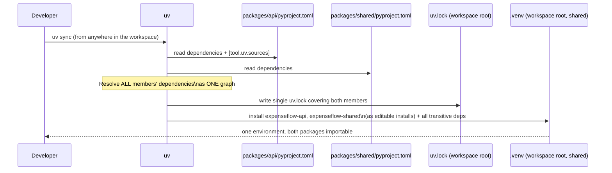
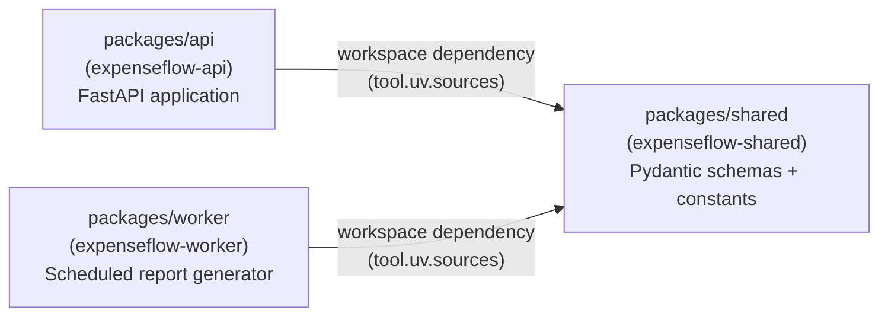

# Workspaces & Monorepos

[Chapter 11](./11-tool-management-uvx.md) drew a hard line between what belongs to one project and what belongs to your whole machine — `ruff`/`mypy`/`pytest` locked to ExpenseFlow specifically, `cookiecutter`/`httpie` available everywhere. This chapter asks a related but different question: what happens when *more than one deployable thing* needs to share *the same code*? ExpenseFlow's team is about to build a background-worker service — for generating recurring monthly expense reports — that needs the exact same Pydantic schemas ExpenseFlow's API already defines for an `Expense`. Copy-pasting that schema file into a second repository is the obvious shortcut and the obvious long-term liability: the two copies will drift the moment either one is edited without the other. This chapter covers uv's answer — the **workspace** — and walks through restructuring ExpenseFlow into `packages/api` and `packages/shared` to solve exactly this problem.

---

## Learning Objectives

By the end of this chapter, you will be able to:

- Define a uv workspace precisely: a root `pyproject.toml` with `[tool.uv.workspace]`, one or more member projects, and one shared `uv.lock`.
- Explain why a workspace is a different thing from simply having multiple unrelated Python projects checked into the same git repository.
- Restructure ExpenseFlow into `packages/api` and `packages/shared`, with `packages/api` depending on `packages/shared` as a workspace member, not a version-pinned external dependency.
- Read and write the `[tool.uv.sources]` entry that makes a path/workspace dependency work.
- Explain what `uv sync` does differently in a workspace versus a single project, and how a single lockfile covers every member at once.
- Decide, for a given situation, whether a uv workspace is worth its complexity or whether separate repositories/packages would serve better.

---

## Prerequisites for This Chapter

This chapter builds on:

- [Chapter 5: Project Creation & Structure](./05-project-creation-and-structure.md) — `uv init`, the `src/` layout, and the distinction between an application project (`--app`) and a library project (`--lib`/`--package`), which becomes directly relevant here since `packages/shared` *is* a library while `packages/api` is an application.
- [Chapter 7: Dependency Management](./07-dependency-management.md) and [Chapter 8: Lock Files & Reproducibility](./08-lock-files-and-reproducibility.md) — how `uv add`, `uv lock`, and `uv sync` behave for a single project; this chapter extends all three to a multi-member workspace.
- ExpenseFlow's current state: a single-project application with runtime dependencies from Chapter 7, a committed `uv.lock` from Chapter 8, and a `dev` group from Chapter 10.

---

## 1. The Problem a Workspace Solves

### 1.1 A second service enters the picture

ExpenseFlow's API has, since Chapter 7, defined a Pydantic model describing an expense — something like:

```python
# expenseflow/schemas.py (current, single-project layout)
from datetime import date
from pydantic import BaseModel


class ExpenseCreate(BaseModel):
    description: str
    amount_cents: int
    currency: str = "USD"
    incurred_on: date
    category_id: int


class ExpenseRead(ExpenseCreate):
    id: int
    user_id: int
```

The product team now wants a **background-worker service** — a separate deployable process, not part of the FastAPI app itself, running on a schedule to generate monthly expense reports and email them out. That worker needs to read the same `expenses` rows the API writes, and it needs to validate and serialize them using the *exact same* `ExpenseRead`/`ExpenseCreate` shapes the API uses — if the API adds a `tags: list[str]` field to `ExpenseRead` and the worker's copy doesn't know about it, the monthly report silently omits tags, or worse, the two schemas disagree about a field's type and one of the two services starts raising validation errors the other never sees.

### 1.2 The tempting shortcut, and why it fails

The fastest way to get the worker running today is to copy `schemas.py` into its own repository and move on. This works for approximately one sprint. The moment anyone edits the `ExpenseRead` model in either place, there are now two divergent definitions of what an "expense," as far as the codebase is concerned, actually looks like — and nothing in either project will warn you when they disagree. This is the exact same class of problem Chapter 8 solved for dependency versions (two developers' machines silently resolving different transitive versions) applied one layer up: two *services* silently agreeing to disagree about a shared data shape.

### 1.3 Two real solutions, and why this chapter picks one of them

There are two legitimate ways to share code between two deployable Python projects without copy-pasting it:

1. **Publish it as an independently versioned package** — give `expenseflow-shared` its own `pyproject.toml`, build it with `uv build`, publish it to an index, and have both the API and the worker depend on it with an ordinary version specifier, exactly like `fastapi` or `sqlalchemy`. This is real, valid, and exactly what Chapter 16 walks through later in this course.
2. **Use a uv workspace** — keep `expenseflow-shared` in the *same* repository as the API (and, later, the worker), with a path-based reference between them instead of a published version, resolved and locked together as one unit.

Option 2 is almost always the right starting point when the shared code and its consumers live in one team's control and one repository, changing together frequently — which describes ExpenseFlow's situation exactly. Publishing (option 1) makes the most sense once the shared package needs to be consumed *outside* this repository too, or needs an independent release cadence from the services that use it. Chapter 16 revisits this exact tradeoff when `expenseflow-shared` eventually does get published — for now, the workspace is the right, lower-ceremony tool for the job.

---

## 2. What a uv Workspace Actually Is

### 2.1 Definition

A **uv workspace** is a root `pyproject.toml`, marked with a `[tool.uv.workspace]` table, that declares one or more **member** projects living in subdirectories — each with its own, fully independent `pyproject.toml` — that are resolved, locked, and synced together as a single unit, sharing exactly one `uv.lock` file at the workspace root.

```toml
# pyproject.toml (workspace root)
[tool.uv.workspace]
members = ["packages/*"]
```

That is close to the entire mechanism. Every subdirectory under `packages/` that contains its own `pyproject.toml` becomes a workspace member automatically, matched by the glob. Each member is a completely normal uv project in its own right — it has its own `[project]` table, its own dependencies, its own name and version — but instead of each one having its own separate `uv.lock` and its own separate `.venv`, uv treats the whole workspace as one resolution problem and one environment.

### 2.2 The three things a workspace member gets and gives up

| | Standalone project | Workspace member |
|---|---|---|
| Has its own `pyproject.toml` | Yes | Yes |
| Has its own `[project.dependencies]` | Yes | Yes |
| Has its own `uv.lock` | Yes | **No** — shares the workspace root's single `uv.lock` |
| Has its own `.venv` | Yes | **No** — shares the workspace root's single `.venv` (by default) |
| Can be depended on by a sibling via a path, without publishing | No — would need a local `path =` pip-style dependency, hand-managed | **Yes** — this is a workspace's whole point (Section 4) |
| Can still be built/published independently later | N/A | Yes — being a workspace member doesn't prevent Chapter 16's publishing workflow |

### 2.3 A workspace, visually

```mermaid
flowchart TB
    subgraph Root["expenseflow/ (workspace root)"]
        RootToml["pyproject.toml\n[tool.uv.workspace]\nmembers = [\"packages/*\"]"]
        Lock["uv.lock\n(ONE lockfile, covers every member)"]
        Venv[".venv\n(ONE environment, shared by default)"]

        subgraph API["packages/api/"]
            ApiToml["pyproject.toml\nname = \"expenseflow-api\""]
            ApiSrc["src/app/\n(FastAPI app)"]
        end

        subgraph Shared["packages/shared/"]
            SharedToml["pyproject.toml\nname = \"expenseflow-shared\""]
            SharedSrc["src/expenseflow_shared/\n(Pydantic schemas, constants)"]
        end
    end

    RootToml -.declares members.-> API
    RootToml -.declares members.-> Shared
    ApiToml -->|"[tool.uv.sources]\nexpenseflow-shared = { workspace = true }"| SharedToml
    Lock -.one resolution for.-> API
    Lock -.one resolution for.-> Shared
```

---

## 3. Why This Differs from "Just Multiple Projects in One Repo"

### 3.1 The naive alternative

Nothing stops a team from putting two entirely unrelated Python projects — say, ExpenseFlow's API and a completely separate internal tool — in the same git repository, each with its own `pyproject.toml`, each in its own subdirectory, with no `[tool.uv.workspace]` anywhere. `uv sync` run from inside either subdirectory would treat that subdirectory as its own, fully independent project: its own resolution, its own `uv.lock`, its own `.venv`. Git happens to hold both directories, but uv sees two unrelated projects that happen to share a filesystem ancestor. This is a completely valid way to organize a repository, and it's exactly what you want when the two projects genuinely have nothing to do with each other.

### 3.2 What changes the moment one project needs to import code from the other

The moment `packages/api` needs to `import expenseflow_shared`, the naive multi-project-in-one-repo layout runs into a real problem: how does `packages/api`'s `uv.lock` reference `packages/shared`? Without workspace support, your only options are unappealing — a `path =` dependency that most tools support in some form but that isn't resolved *together* with the rest of the dependency graph, or, worse, manually adding `packages/shared` to `sys.path` and hoping imports resolve correctly outside of any dependency-management system at all. Neither gives you a single, coherent lockfile covering both projects, and neither gives you confidence that `packages/api`'s resolved dependencies and `packages/shared`'s resolved dependencies are even mutually compatible (imagine `packages/shared` depending on `pydantic>=2.9` while `packages/api`, resolved independently, ends up with `pydantic==2.5` — nothing would catch that disagreement until a runtime import error surfaced it).

### 3.3 What a workspace actually buys you

A `[tool.uv.workspace]` declaration converts "two projects that happen to share a git repo" into "one resolution domain with two independently-named, independently-versioned members":

- **One `uv.lock`, one resolution.** `packages/api`'s dependencies and `packages/shared`'s dependencies are resolved *together*, as one graph, so a version conflict between them (like the `pydantic` example above) is caught immediately by the resolver — precisely the correctness guarantee Chapter 3's resolver discussion promised, now extended across package boundaries within the same repo.
- **A path/workspace dependency that "just works" with local edits.** `packages/api` depends on `packages/shared` via a workspace source (Section 4), which means an edit to `packages/shared`'s code is picked up by `packages/api` immediately, with no publish step, no version bump, and no reinstall — exactly like editing a single project's own source, because that's effectively what a workspace member is.
- **One `uv sync` to bring the whole thing up to date.** Running `uv sync` from the workspace root (or from any member) installs and updates every member's dependencies at once, into one shared environment, in one operation (Section 5).

The distinction to hold onto: **multiple unrelated projects in one repo share a git history; workspace members share a dependency resolution.** You reach for a workspace specifically once code genuinely needs to cross that boundary — which is precisely ExpenseFlow's situation now that a worker service needs the API's schemas.

---

## 4. Restructuring ExpenseFlow into `packages/api` and `packages/shared`

### 4.1 The target layout

```
expenseflow/
├── pyproject.toml              # workspace root — [tool.uv.workspace] only
├── uv.lock                     # ONE lockfile for the whole workspace
├── .venv/                      # ONE shared environment
├── packages/
│   ├── api/
│   │   ├── pyproject.toml      # name = "expenseflow-api" (application)
│   │   ├── src/
│   │   │   └── app/
│   │   │       ├── __init__.py
│   │   │       ├── main.py     # FastAPI app entrypoint
│   │   │       ├── models.py   # SQLAlchemy 2.0 ORM models
│   │   │       └── routers/
│   │   └── tests/
│   └── shared/
│       ├── pyproject.toml      # name = "expenseflow-shared" (library)
│       ├── src/
│       │   └── expenseflow_shared/
│       │       ├── __init__.py
│       │       ├── schemas.py  # ExpenseCreate, ExpenseRead, etc.
│       │       └── constants.py
│       └── tests/
└── alembic/                    # migration environment stays associated with the API
```

Note the layout mirrors Chapter 5's distinction between project *types*: `packages/api` is an **application** (it's deployed and run, never imported by anything outside itself), while `packages/shared` is a **library** (it's imported by other Python code and never run directly) — exactly the `--app` vs. `--lib` distinction Chapter 5 introduced, now made concrete by having one real example of each in the same repository.

### 4.2 The workspace root's `pyproject.toml`

```toml
# expenseflow/pyproject.toml (workspace root)
[tool.uv.workspace]
members = ["packages/*"]

[tool.uv]
dev-dependencies = []  # any workspace-wide-only tooling could live here; see Section 4.5
```

A workspace root's own `pyproject.toml` does not need a `[project]` table at all if the root itself isn't a package — it can exist purely to declare the workspace and hold workspace-wide configuration. Some teams do give the root its own minimal `[project]` table (useful if you want a single `uv run` from the very top level to have an obvious "home" project); ExpenseFlow's team keeps the root workspace-only, since every real piece of code lives inside `packages/api` or `packages/shared`.

### 4.3 `packages/shared/pyproject.toml`

```toml
[project]
name = "expenseflow-shared"
version = "0.1.0"
requires-python = ">=3.13"
dependencies = [
    "pydantic>=2.9",
]

[build-system]
requires = ["hatchling"]
build-backend = "hatchling.build"
```

`packages/shared` is a genuine library: it declares only what it needs to define its Pydantic schemas and constants (just `pydantic` itself — no `fastapi`, no `sqlalchemy`, since the shared package should have no idea it's being consumed by a web API at all), and it carries its own `[build-system]` because a library needs to be buildable into a wheel — a requirement Chapter 16's publishing workflow will lean on directly.

```python
# packages/shared/src/expenseflow_shared/schemas.py
from datetime import date
from pydantic import BaseModel


class ExpenseCreate(BaseModel):
    description: str
    amount_cents: int
    currency: str = "USD"
    incurred_on: date
    category_id: int


class ExpenseRead(ExpenseCreate):
    id: int
    user_id: int
```

```python
# packages/shared/src/expenseflow_shared/constants.py
SUPPORTED_CURRENCIES = ("USD", "EUR", "GBP", "INR")
DEFAULT_CURRENCY = "USD"
```

### 4.4 `packages/api/pyproject.toml`

```toml
[project]
name = "expenseflow-api"
version = "0.1.0"
requires-python = ">=3.13"
dependencies = [
    "fastapi>=0.115",
    "uvicorn[standard]>=0.32",
    "sqlalchemy>=2.0",
    "alembic>=1.13",
    "asyncpg>=0.29",
    "pydantic-settings>=2.5",
    "expenseflow-shared",
]

[tool.uv.sources]
expenseflow-shared = { workspace = true }

[dependency-groups]
dev = [
    "mypy>=1.13",
    "pre-commit>=4.0",
    "pytest>=8.3",
    "ruff>=0.7",
]

[build-system]
requires = ["hatchling"]
build-backend = "hatchling.build"
```

Every runtime dependency ExpenseFlow already had since Chapter 7 is unchanged here — only `expenseflow-shared` is new, listed in `dependencies` exactly like any other package name, with no version specifier at all. The mechanism that turns that bare name into "use the local `packages/shared` directory, not PyPI" is the `[tool.uv.sources]` entry (Section 4.5). The `dev` group from Chapter 10 also moves here, into `packages/api`, since linting/type-checking/testing configuration is naturally scoped per-member (`packages/shared` can — and should — have its own `dev` group too, for its own test suite).

### 4.5 `[tool.uv.sources]`: the mechanism behind the path/workspace dependency

```toml
[tool.uv.sources]
expenseflow-shared = { workspace = true }
```

This single line is the entire trick. `[project.dependencies]` uses PEP 508 dependency specifiers (Chapter 2) — plain, portable strings like `"expenseflow-shared"` that any Python packaging tool can parse, with no uv-specific syntax at all. `[tool.uv.sources]` is uv's own extension mechanism that says, for this specific dependency name, *where* to actually resolve it from, instead of the default (an index like PyPI). `{ workspace = true }` tells uv: "resolve `expenseflow-shared` from whichever workspace member declares that name" — in this case, `packages/shared`. This keeps the dependency's *declaration* (`dependencies = [..., "expenseflow-shared"]`) fully standard and portable, while its *resolution source* is a uv-specific detail confined to one small table — the same "standards for the portable parts, a small tool-specific escape hatch for what genuinely needs one" pattern Chapter 2 previewed when introducing PEP 621.

Critically, this is **not a version pin**. `packages/api` does not declare "I need `expenseflow-shared>=0.1.0`" the way it declares `"pydantic-settings>=2.5"` — it declares "I need whatever `expenseflow-shared` is, resolved from this workspace, right now, on disk." Edit `packages/shared/src/expenseflow_shared/schemas.py`, and `packages/api` sees the change on its very next `uv run` or test execution, with no version bump, no rebuild, no republish — the same live-edit experience Chapter 6 established for a single project's own source tree, extended across the workspace boundary.

---

## 5. How `uv sync` Resolves an Entire Workspace at Once

### 5.1 One resolution, one lockfile

Running `uv lock` (or the `uv lock` step implicit in `uv sync`) from anywhere inside the workspace resolves **every member's dependencies together**, as a single graph, and writes the result to one `uv.lock` at the workspace root:

```bash
$ cd expenseflow
$ uv sync
Resolved 61 packages in 940ms
Prepared 8 packages in 1.1s
Installed 8 packages in 63ms
 + expenseflow-api==0.1.0 (from packages/api)
 + expenseflow-shared==0.1.0 (from packages/shared)
 + fastapi==0.115.4
 + pydantic==2.9.2
 ...
```

`fastapi`'s and `expenseflow-shared`'s (i.e., `pydantic`'s) transitive dependencies are resolved into one consistent set of versions — if `packages/shared` required `pydantic>=2.9` and `packages/api` (through some other dependency) required `pydantic<2.8`, the resolver would report a genuine conflict immediately, at `uv lock`/`uv sync` time, rather than at import time in whichever service happens to run first.



### 5.2 A shared environment, with per-member scoping when you need it

By default, `uv sync` from the workspace root brings the *entire* workspace's dependencies into one shared `.venv` — both `expenseflow-api`'s and `expenseflow-shared`'s dependencies, installed together, both packages themselves installed in editable mode so source edits take effect immediately. If you want to sync (or run commands against) a specific member only, `--package` scopes the operation:

```bash
# Sync only what packages/shared needs (useful in CI if you're testing
# the shared library in isolation, e.g. before it's ever imported by the API):
$ uv sync --package expenseflow-shared

# Run the API package's own test suite specifically:
$ uv run --package expenseflow-api pytest packages/api/tests
```

### 5.3 Adding the background-worker as a third member

The original motivation for this whole restructuring — a background-worker service that also needs `expenseflow-shared` — slots in exactly the same way `packages/api` did:

```
expenseflow/
├── pyproject.toml          # members = ["packages/*"] already matches this
├── packages/
│   ├── api/
│   ├── shared/
│   └── worker/
│       ├── pyproject.toml  # name = "expenseflow-worker"
│       └── src/expenseflow_worker/
```

```toml
# packages/worker/pyproject.toml
[project]
name = "expenseflow-worker"
version = "0.1.0"
requires-python = ">=3.13"
dependencies = [
    "sqlalchemy>=2.0",
    "asyncpg>=0.29",
    "apscheduler>=3.10",
    "expenseflow-shared",
]

[tool.uv.sources]
expenseflow-shared = { workspace = true }

[build-system]
requires = ["hatchling"]
build-backend = "hatchling.build"
```

Because `members = ["packages/*"]` is a glob, `packages/worker` is picked up automatically the moment it exists with its own `pyproject.toml` — no change needed to the workspace root at all. `uv sync` now resolves all three members (`expenseflow-api`, `expenseflow-shared`, `expenseflow-worker`) together, into the same shared lockfile and environment, and both the API and the worker import the identical `ExpenseRead`/`ExpenseCreate` classes from `expenseflow_shared.schemas` — the drift risk from Section 1.2 is closed by construction, not by discipline.



---

## 6. When Workspaces Are — and Aren't — Worth the Complexity

### 6.1 The case for a workspace

A workspace earns its complexity when all of the following are true, as they are for ExpenseFlow:

- **More than one deployable or importable unit exists**, or is clearly about to (the API, and now the worker).
- **They share real code that must stay in lockstep** — not superficially similar code, but the same data shapes, the same constants, the same validation logic, where drift between copies would be a correctness bug.
- **They're maintained by the same team, in the same repository, with a shared release cadence** — nobody is trying to version `expenseflow-shared` independently from the services consuming it, at least not yet.

### 6.2 The case against

A workspace is not the right tool, and adds friction for no benefit, when:

- **There's genuinely only one deployable unit.** A single FastAPI app with no sibling service has no workspace problem to solve — Chapter 5's plain single-project layout remains exactly correct, and introducing `[tool.uv.workspace]` here would be pure ceremony.
- **The "shared" code isn't actually shared, or shouldn't be.** Two services that happen to both touch expenses but model them differently for good domain reasons don't benefit from being forced to share one schema module — a workspace (or a shared package at all) would be solving a problem you don't have, at the cost of coupling two things that should be allowed to evolve independently.
- **The consuming projects are owned by different teams, or need independent release/versioning cadences.** A workspace ties every member to one shared `uv.lock`, resolved together — great for one team moving in lockstep, actively counterproductive if `packages/shared` needs its own release schedule, its own versioned changelog, or consumers entirely outside this repository. That situation calls for Chapter 16's publishing workflow instead: an independently versioned package, installed by ordinary version specifier, with no workspace coupling at all.
- **The team is small and the "shared" surface is tiny and stable.** If `expenseflow_shared` were, realistically, three constants that change once a year, the overhead of a workspace's extra directory structure and mental model may simply not be worth it compared to accepting a small amount of duplication, or a lightweight shared module imported via a simple relative import inside a still-single project.

### 6.3 The decision, as a single test

The practical question to ask, mirroring the test Chapter 11 used for tools-versus-dependencies: **do these pieces of code need to change together, be tested together, and be released together, by the same team, right now?** If yes, a workspace is the right amount of structure — more than a single project, less than fully independent, separately versioned packages. If the honest answer is "not really, they just happen to live near each other," you don't have a workspace problem; you either have one project that hasn't been split unnecessarily, or you have two projects that should be genuinely separate (different repos, or Chapter 16's independently published package), not glued together by a workspace that implies a tighter coupling than actually exists.

---

## Real-World Scenario

Three months after ExpenseFlow's API ships, the finance team requests automated monthly expense reports emailed to each user — exactly the trigger for the background-worker service this chapter has been building toward. Marcus starts on the worker in a brand-new, separate repository, the way he's always started new services, and gets as far as needing the `ExpenseRead` schema before stopping to ask Priya a question in their team channel: "do you mind if I just copy `schemas.py` over? It's like forty lines."

Priya, remembering an unrelated incident from a previous job where two services' copy-pasted schemas silently drifted for months before a report started showing wrong currency totals, pushes back — not because copying forty lines is hard, but because of what happens on line forty-one, whenever someone adds a new field to `ExpenseRead` six months from now and forgets the worker has its own stale copy. They spend twenty minutes restructuring ExpenseFlow into the `packages/api`/`packages/shared` layout from Section 4, moving the existing schemas verbatim into `packages/shared/src/expenseflow_shared/schemas.py`, and updating `packages/api`'s imports from `expenseflow.schemas` to `expenseflow_shared.schemas`. The whole migration is a `git mv`, a few import statement updates, one new `[tool.uv.sources]` entry, and a `uv sync` — no schema logic changes at all.

Marcus then builds `packages/worker` as a third member, imports `ExpenseRead` from `expenseflow_shared.schemas` directly, and writes his report-generation logic against the exact same validated shape the API already guarantees. Two weeks later, Priya adds a `tags: list[str]` field to `ExpenseRead` for an unrelated API feature. She doesn't message Marcus about it, doesn't file a ticket for the worker team (there is no separate worker team — it's the same three engineers), and doesn't need to: the next time anyone runs `uv sync` or the worker's test suite, `expenseflow_worker`'s code already sees the new field, because it was never a copy in the first place. The report generator picks up `tags` in its next scheduled run with zero additional coordination — precisely the failure mode Priya was worried about, closed by the workspace structure rather than by anyone remembering to keep two files in sync.

---

## Best Practices

- Reach for a workspace only once a second genuinely deployable or importable unit exists that needs to share real code with an existing one — don't pre-emptively split a single application into a workspace "just in case" (Section 6).
- Give each member the project *type* that matches its role — `packages/shared` as a library (no `fastapi`/`sqlalchemy` in its own dependencies), `packages/api` (and later `packages/worker`) as applications that depend on it (Section 4.1).
- Use `[tool.uv.sources] <name> = { workspace = true }` for any dependency between workspace members — never hand-roll a `path =` dependency or manipulate `sys.path` to make cross-member imports work (Section 4.5).
- Let `uv sync` from the workspace root resolve everything at once by default; use `--package` only when you specifically need to scope an operation to one member (Section 5.2).
- Keep each member's own `dev` dependency group (Chapter 10) scoped to that member — `packages/shared`'s own test suite doesn't need `fastapi` or `uvicorn` just because `packages/api` does.
- Revisit the workspace-vs-publish decision (Section 1.3, Section 6.2) the moment a shared package needs consumers outside the repository, or needs its own independent release cadence — that's Chapter 16's job, not a reason to keep stretching the workspace to fit.

---

## Common Mistakes

- **Copy-pasting shared code between services "just for now,"** creating exactly the silent-drift risk this chapter's Real-World Scenario was written to prevent — the fix is rarely harder than the workspace restructuring shown in Section 4.
- **Declaring a workspace member dependency with a version specifier** (e.g., `"expenseflow-shared>=0.1.0"`) instead of a bare name plus `[tool.uv.sources]` — this either fails to resolve (no such thing is published) or, if it happens to also exist on an index, silently resolves from the wrong place entirely.
- **Introducing a workspace for a single deployable application with no sibling that needs to share its code** — pure ceremony, per Section 6.2, that adds directory-structure overhead for no coupling benefit.
- **Forgetting that a workspace shares one `uv.lock`**, and being surprised when a dependency-version change in one member (say, bumping `pydantic` in `packages/shared`) triggers a re-resolution that also touches `packages/api`'s locked versions — this is the correct, intended behavior (Section 5.1), not a bug.
- **Treating workspace members as though they were independently versioned packages already** — e.g., writing a changelog entry for `expenseflow-shared` version bumps before it's actually been split out via Chapter 16's publishing workflow. Inside a workspace, version numbers on member `pyproject.toml` files are mostly nominal until publishing makes them real.
- **Using a workspace to glue together two projects that should have been fully separate repositories** — different teams, different release cadences, or consumers outside the repo are all signals that Chapter 16's independently published package is the right tool, not a workspace (Section 6.2).

---

## Summary

- ExpenseFlow's need for a background-worker service that shares Pydantic schemas with the API is a real instance of the problem uv workspaces solve: multiple deployable/importable units that must share code without drifting (Section 1).
- A uv workspace is a root `pyproject.toml` with `[tool.uv.workspace]` declaring member projects, all resolved together into one shared `uv.lock` (Section 2).
- This differs fundamentally from multiple unrelated projects merely checked into the same repository — a workspace shares a dependency *resolution*, not just a git history (Section 3).
- ExpenseFlow restructures into `packages/api` (application) and `packages/shared` (library), with `packages/api` depending on `packages/shared` via `[tool.uv.sources] expenseflow-shared = { workspace = true }` — a path reference, not a version pin (Section 4).
- `uv sync` resolves and installs every workspace member's dependencies together, as one graph, into one shared environment, with `--package` available to scope operations to a single member (Section 5).
- Workspaces are worth their complexity when multiple units share real code and a release cadence, under one team, right now; they are the wrong tool for a single application, superficially similar-but-independent code, or cross-team/cross-cadence sharing — which call for separate repos or Chapter 16's published-package route instead (Section 6).

---

## Knowledge Check

1. What exact table, and what key inside it, turns a plain `pyproject.toml` into a workspace root?
2. How many `uv.lock` files does a three-member workspace (`packages/api`, `packages/shared`, `packages/worker`) have, and what does that number imply about how a dependency conflict between two members would be caught?
3. What is the difference between declaring `expenseflow-shared` as `"expenseflow-shared>=0.1.0"` in `dependencies` versus declaring it as a bare `"expenseflow-shared"` plus a `[tool.uv.sources]` entry with `{ workspace = true }`?
4. Why is `packages/shared` structured as a library project rather than an application, and why does that distinction matter for what goes in its own `dependencies` list?
5. A teammate proposes turning ExpenseFlow's single-project layout into a workspace with one member, "to future-proof it in case we split things up later." What would you say to that proposal, and why?
6. If `packages/shared` starts needing its own independent release cadence and consumers outside this repository, what should the team do instead of continuing to stretch the workspace to fit?
7. What does `uv sync --package expenseflow-shared` do differently from a plain `uv sync` run at the workspace root?

---

## Hands-On Exercise

**Goal:** Restructure a local ExpenseFlow checkout into a `packages/api` + `packages/shared` workspace, and confirm a shared schema change propagates without any manual synchronization.

1. Starting from ExpenseFlow's single-project layout (Chapters 5–10), create `packages/api/` and `packages/shared/` directories, and move the existing application source into `packages/api/src/app/`.
2. Extract `ExpenseCreate`/`ExpenseRead` (and any shared constants) into `packages/shared/src/expenseflow_shared/schemas.py` and `constants.py`, per Section 4.3.
3. Write a root `pyproject.toml` containing only `[tool.uv.workspace]` with `members = ["packages/*"]`, per Section 4.2.
4. Write `packages/shared/pyproject.toml` (a library, `pydantic` as its only dependency) and `packages/api/pyproject.toml` (an application, with `expenseflow-shared` added to `dependencies` plus the matching `[tool.uv.sources]` entry), per Sections 4.3–4.5.
5. Update `packages/api`'s imports from wherever `schemas.py` used to live to `from expenseflow_shared.schemas import ExpenseCreate, ExpenseRead`.
6. Run `uv sync` from the workspace root and confirm both `expenseflow-api` and `expenseflow-shared` install successfully into one shared `.venv`, and that `uv.lock` now appears only at the workspace root.
7. Run `uv run --package expenseflow-api pytest` (or your equivalent test path) and confirm the API's existing tests still pass against the relocated schema.
8. Edit `packages/shared/src/expenseflow_shared/schemas.py` to add a new field to `ExpenseRead` (e.g., `tags: list[str] = []`), without touching `packages/api` at all, and confirm — via a quick `uv run python -c "..."` import check, or a test — that `packages/api` immediately sees the new field on its next run, with no reinstall or version bump.
9. Finally, scaffold an empty `packages/worker/pyproject.toml` (name `expenseflow-worker`, depending on `expenseflow-shared` the same way `packages/api` does) and confirm `uv sync` from the workspace root picks it up automatically as a third member without any change to the root `pyproject.toml`.

---

## Further Reading

- [uv Concepts — Workspaces](https://docs.astral.sh/uv/concepts/) — the official conceptual and configuration reference for `[tool.uv.workspace]`, members, and `[tool.uv.sources]`.
- [uv Concepts — Dependencies](https://docs.astral.sh/uv/concepts/) — covers `[tool.uv.sources]` in full, including workspace sources alongside path/git/index sources.
- [uv Guides](https://docs.astral.sh/uv/guides/) — includes a walkthrough of building and working with a multi-package workspace end to end.
- [PEP 621 – Storing project metadata in pyproject.toml](https://peps.python.org/pep-0621/) — the standard underlying every workspace member's own `[project]` table.
- [This repo's Alembic course](../../Databases/alembic-course/00-index.md) — for how ExpenseFlow's migration environment (kept alongside `packages/api` in this restructuring) continues to evolve independently of this tooling-layer change.

---

<div style="display:flex;justify-content:space-between;align-items:center;">
  <a href="./11-tool-management-uvx.md">← Previous: Tool Management & uvx</a>
  <a href="./00-index.md">🏠 Index</a>
  <a href="./13-fastapi-sqlalchemy-alembic-integration.md">Next: Integrating FastAPI, SQLAlchemy & Alembic →</a>
</div>
