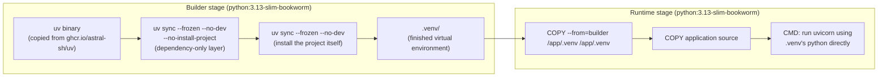
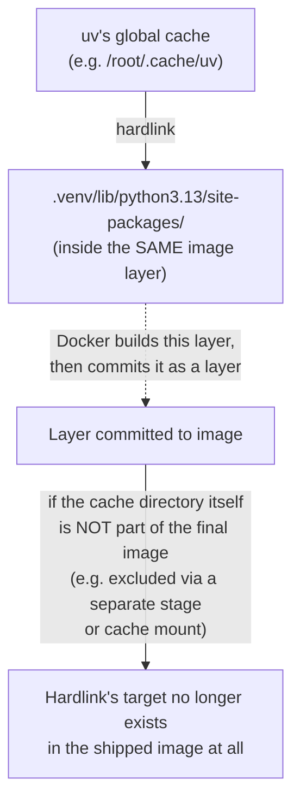
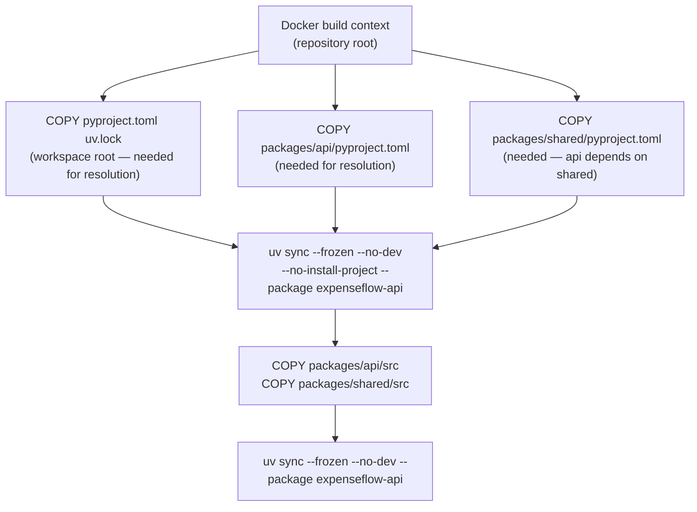

# Docker Integration

[Chapter 13](./13-fastapi-sqlalchemy-alembic-integration.md) tied FastAPI, SQLAlchemy, and Alembic together through `uv run`, and drew a firm line between what uv manages (the interpreter, dependencies, environment) and what the application itself manages (runtime configuration via `pydantic-settings`). That line matters even more once ExpenseFlow needs to run somewhere other than Priya's or Marcus's laptop — inside a container, on a machine that has never run `uv` before and never will again once the image is built. This chapter is the most consequential piece of production-integration material in the course, and it earns that weight honestly: nearly every real "our Docker build got slower/bigger after switching to uv" complaint traces back to a handful of specific, well-understood mistakes this chapter walks through one at a time, building up to a complete, annotated, production-grade Dockerfile for ExpenseFlow's `packages/api` member.

---

## Learning Objectives

By the end of this chapter, you will be able to:

- Explain why a naive, single-stage Dockerfile that installs uv via `pip` inside the image gets the entire point of uv backwards, and use the official `ghcr.io/astral-sh/uv` image pattern instead.
- Order a Dockerfile's `COPY` instructions so that dependency-installation layers cache correctly across builds, and application-source changes never invalidate them unnecessarily.
- Use `uv sync --frozen --no-dev --no-install-project` to build a dependency-only layer, and a final `uv sync --frozen --no-dev` to install the project itself, and explain precisely what each flag changes.
- Configure `UV_COMPILE_BYTECODE` and `UV_LINK_MODE=copy` correctly for a containerized build, and explain why uv's hardlink-based local-cache optimization does not — and cannot — survive a Docker `COPY` layer boundary.
- Build a multi-stage Dockerfile for ExpenseFlow's workspace (`packages/api` depending on `packages/shared`) that produces a lean runtime image containing no dev dependencies, no uv binary, and no build tooling.
- Compare image size and build time between a traditional pip+venv Dockerfile and a uv-based one, and explain where each difference actually comes from.

---

## Prerequisites for This Chapter

- The distinction between `uv.lock` (what's resolved) and `uv sync` (applying that resolution to an environment), and the difference between `--frozen` and `--locked` — [Chapter 8: Lock Files & Reproducibility](./08-lock-files-and-reproducibility.md).
- Dev dependencies as a distinct group from runtime dependencies, and why they should never ship to production — [Chapter 10: Development Dependencies & Tooling](./10-development-dependencies-and-tooling.md).
- ExpenseFlow's workspace layout (`packages/api` + `packages/shared`, one shared `uv.lock`) — [Chapter 12: Workspaces & Monorepos](./12-workspaces-and-monorepos.md).
- The full `packages/api/pyproject.toml` this chapter's Dockerfile installs, as assembled in [Chapter 13, Section 6](./13-fastapi-sqlalchemy-alembic-integration.md#6-the-full-expenseflow-pyprojecttoml-assembled).
- Basic Docker literacy — images, layers, the build cache, multi-stage builds — is assumed; this chapter explains uv-specific Docker behavior, not Docker itself from scratch.

---

## 1. Why Dockerizing a uv Project Is Different

### 1.1 The tempting, wrong instinct

The most common mistake teams make adopting uv in Docker is treating it like just another PyPI package, and reaching for the same instinct that installs any other tool:

```dockerfile
# Do not do this
FROM python:3.13-slim
RUN pip install uv
COPY . .
RUN uv sync
```

This runs, and produces a working image — which is precisely what makes it a trap rather than an obvious mistake. It also throws away nearly every benefit uv exists to provide inside a container: `pip install uv` re-introduces exactly the dependency (`pip` itself, plus everything pip needs) uv is supposed to replace, just to bootstrap uv in the first place; `COPY . .` before any dependency installation means every single source-code change invalidates the dependency-install layer, forcing a full re-resolution and re-install on every build; and a bare `uv sync` (no `--frozen`, no `--locked`) means the container's dependency versions are only as reproducible as whatever `uv.lock` happens to say *if* it's even present and untouched — exactly the "never bare `uv sync`" lesson from Chapter 8, now silently violated inside the one environment where reproducibility matters most.

### 1.2 The three things a correct Dockerfile needs to get right

Every section that follows in this chapter is really answering one of three questions, and it's worth naming them up front so the Dockerfile's structure feels inevitable rather than arbitrary by the time Section 10 assembles it:

1. **How does uv itself get into the image without needing pip, or any pre-existing Python packaging tool, at all?** (Section 2)
2. **How is the Dockerfile structured so that changing application source code doesn't force Docker to redo dependency resolution and installation on every single build?** (Sections 3–4)
3. **How does the final image end up lean — no dev dependencies, no build tooling, no uv binary if it isn't needed at runtime — without giving up any of the reproducibility uv's lockfile provides?** (Sections 6–8)

---

## 2. The Official uv Docker Image and the Multi-Stage Pattern

### 2.1 Getting `uv` itself into a build stage

Astral publishes uv as a set of prebuilt, statically-linked binaries in the `ghcr.io/astral-sh/uv` image — an image whose entire contents *are* the `uv` and `uvx` executables, nothing else. The recommended way to bring uv into any Dockerfile is a multi-stage `COPY --from`, pulling just those two binaries out of that image and into your own build stage:

```dockerfile
FROM python:3.13-slim-bookworm AS builder
COPY --from=ghcr.io/astral-sh/uv:latest /uv /uvx /bin/
```

This is the same principle Chapter 1 used to explain why uv's own installer is a standalone script rather than `pip install uv` — uv has to be obtainable *before* any Python packaging tooling exists, because uv's whole job is to be the thing that sets that tooling up. Pulling the binary out of a purpose-built, minimal image via `COPY --from` is the containerized equivalent of that same principle: no `pip`, no `pipx`, no dependency on anything already being installed in the base image at all.

Pinning `:latest` is convenient for following along with this chapter, but production Dockerfiles should pin an explicit uv version (e.g., `ghcr.io/astral-sh/uv:0.5.11`) for the same reason `uv.lock` pins exact dependency versions — an unannounced uv upgrade changing resolver or build behavior mid-project is exactly the kind of surprise a production pipeline should never be exposed to without an explicit, reviewed version bump.

### 2.2 Why multi-stage at all

A Docker multi-stage build lets you use one stage (`builder`) to do everything needed to *produce* a working virtual environment — installing uv, resolving and installing dependencies, compiling any native extensions — and then copy only the *result* (the finished `.venv` directory and application source) into a second, much smaller final stage that never sees uv, pip, compilers, or any of the build-time tooling at all:



The runtime stage never runs `uv sync`, never contains a compiler, and (as Section 8 covers) doesn't even need the `uv` binary present at all if it just invokes the `.venv`'s own interpreter directly — every byte of build-time tooling that produced the environment gets left behind in the `builder` stage, which the final image has no trace of.

---

## 3. Layer Ordering: Copying Lockfiles Before Source

### 3.1 The core caching principle

Docker caches each layer (each `RUN`/`COPY` instruction) and reuses a cached layer for a subsequent build as long as that instruction and everything before it are unchanged. The entire dependency-caching strategy in this chapter rests on one consequence of that rule: **if `pyproject.toml` and `uv.lock` are copied into the image, and dependencies are installed, *before* any application source code is copied, then editing application source code alone never invalidates the dependency-installation layer** — Docker sees the earlier `COPY` (lockfile + `pyproject.toml`) and `RUN` (`uv sync`) instructions as unchanged, reuses their cached layers instantly, and only re-runs the instructions that come after the changed file.

```dockerfile
# 1. Copy ONLY the files uv needs to resolve/install dependencies
COPY pyproject.toml uv.lock ./
COPY packages/api/pyproject.toml packages/api/pyproject.toml
COPY packages/shared/pyproject.toml packages/shared/pyproject.toml

# 2. Install dependencies — this layer is cached as long as none of the
#    files copied above have changed, regardless of source code churn
RUN uv sync --frozen --no-dev --no-install-project

# 3. ONLY NOW copy application source code
COPY packages/api/src packages/api/src
COPY packages/shared/src packages/shared/src

# 4. Install the project itself — cheap, since dependencies are already installed
RUN uv sync --frozen --no-dev
```

### 3.2 What gets invalidated when

| Change | Layer 2 (`--no-install-project` sync) re-runs? | Layer 4 (final sync) re-runs? |
|---|---|---|
| Edit `packages/api/src/app/routers/expenses.py` | No — cached | Yes — fast, since only local project code changed |
| Add a new dependency to `packages/api/pyproject.toml`, regenerate `uv.lock` | Yes — `uv.lock`'s hash changed | Yes |
| Edit `packages/api/tests/test_expenses.py` | No — tests aren't copied into the image at all | No — not part of the image |
| Bump `fastapi`'s version pin and re-lock | Yes | Yes |

This table is the entire justification for the four-step structure above: the expensive step — resolving and installing every third-party dependency, which for ExpenseFlow means `fastapi`, `sqlalchemy`, `asyncpg`, and everything they transitively pull in — only re-runs when the *dependency set itself* changes, which happens far less often than application source code does. A team that instead copies the whole repository before running `uv sync` pays that full dependency-install cost on every single build, every single time, regardless of how small the actual code change was.

---

## 4. The Dependency-Only Layer: `--no-install-project`

### 4.1 What `--no-install-project` actually skips

`uv sync --frozen --no-dev --no-install-project` installs every dependency listed in `uv.lock` — `fastapi`, `sqlalchemy`, `alembic`, `asyncpg`, `pydantic-settings`, and their full transitive closures for both workspace members — into `.venv`, but deliberately does **not** install `expenseflow-api` or `expenseflow-shared` themselves. This is exactly the split Section 3 relies on: at the point this command runs, only `pyproject.toml` files have been copied into the image (Section 3.1's step 1) — there is no `src/` directory present yet for uv to install even if it wanted to, so `--no-install-project` isn't an optimization uv is choosing on your behalf, it's a statement of fact about what's possible given what's been copied so far, made explicit so uv doesn't error out looking for source that genuinely isn't there yet.

### 4.2 `--frozen` and `--no-dev`, and why both are non-negotiable here

- **`--frozen`** tells uv to use `uv.lock` exactly as committed, performing no re-resolution at all — the Docker build environment has no business ever producing a different resolution than what was tested and committed, and `--frozen` is the strictest way to guarantee that (Chapter 8 covered `--frozen` vs. `--locked`; a Docker build should always use `--frozen`, since there is no interactive developer present to react to `--locked`'s "the lockfile would need to change" failure — the build should simply use exactly what's there or fail outright).
- **`--no-dev`** excludes the `[dependency-groups.dev]` group entirely — `pytest`, `ruff`, `mypy`, `pre-commit` — from what gets installed. This is the direct, concrete payoff of Chapter 10's insistence on keeping dev tooling in its own group: a production image built with `--no-dev` never contains a test runner, a linter, or a type checker at all, which matters for image size, for attack surface (fewer packages means fewer potential vulnerabilities to patch), and for simply not shipping tools that have no reason to exist in a running production container.

### 4.3 Targeting the right workspace member

Because ExpenseFlow is a uv workspace (Chapter 12) with two members sharing one lockfile, a Docker image built for the API specifically should scope the sync to what the API actually needs, using `--package`:

```dockerfile
RUN uv sync --frozen --no-dev --no-install-project --package expenseflow-api
```

`--package expenseflow-api` tells uv "resolve and install exactly what `expenseflow-api` needs" — which, because `expenseflow-api` depends on `expenseflow-shared` via the workspace source (Chapter 12), transitively includes `expenseflow-shared`'s own dependencies too, all still coming from the one shared `uv.lock`. Without `--package`, a plain `uv sync --frozen --no-dev --no-install-project` at the workspace root syncs *every* workspace member's dependencies — harmless for ExpenseFlow today (both members' dependency sets are small and overlapping), but worth scoping deliberately once a workspace grows to include members genuinely irrelevant to a given deployable image, such as a hypothetical `packages/worker` that pulls in heavy background-job dependencies the API image has no use for.

---

## 5. Environment Variables That Matter in Containers

### 5.1 `UV_COMPILE_BYTECODE`

By default, uv installs packages without pre-compiling their `.py` files to `.pyc` bytecode — for a local development environment, this is the right default, since compilation happens lazily and transparently the first time each module is actually imported, and repeated `uv sync` runs during active development shouldn't pay a compilation cost for code that might change again before it's ever executed. Inside a container image, that trade-off flips: the image is built once and then started many times (every container restart, every replica in a rolling deploy), so paying the bytecode-compilation cost once, at build time, and shipping the compiled `.pyc` files as part of the image is a straightforward win — every container start skips a compilation step it would otherwise redo on first import:

```dockerfile
ENV UV_COMPILE_BYTECODE=1
```

### 5.2 `UV_LINK_MODE=copy`, and why hardlinks don't survive `COPY`

Chapter 3 explained uv's local installation model in detail: uv's global cache is content-addressable, and installing a package into a project's `.venv` normally uses a **hardlink** (or a copy-on-write reflink, filesystem permitting) from that shared cache into the venv's `site-packages`, rather than copying the package's files fresh every time — this is a large part of why repeated `uv sync` operations across different projects on the same machine feel close to instantaneous.

Inside a Docker build, this optimization runs into a filesystem-boundary problem that has nothing to do with uv being wrong and everything to do with how Docker layers actually work:



A hardlink is two directory entries pointing at the same underlying inode *on the same filesystem*. Docker's layer model, and especially multi-stage builds where `.venv` gets copied via `COPY --from=builder` into an entirely separate final stage, breaks that assumption outright: `COPY --from=builder` copies file *contents*, not inode relationships, across what is effectively a filesystem boundary between stages — there is no shared underlying filesystem for a hardlink to still be valid across. If uv's cache directory isn't also present (and it deliberately shouldn't be, in the final image — Section 8 covers this explicitly), any hardlink pointing back at it would be broken.

The fix is to tell uv, for container builds specifically, to fall back to plain file copies instead of hardlinks when installing from the cache into `.venv`:

```dockerfile
ENV UV_LINK_MODE=copy
```

With `UV_LINK_MODE=copy` set, uv installs every package by copying its actual file contents into `.venv` rather than hardlinking, which costs slightly more time and disk I/O during the `builder` stage's `uv sync` (a real, if usually small, trade-off — Section 9's benchmark table accounts for it) but produces a `.venv` directory that is fully self-contained and correctly portable across the `COPY --from=builder` boundary into the runtime stage, with no dangling references back into a cache that image won't ever contain.

### 5.3 `UV_PROJECT_ENVIRONMENT`

One more environment variable worth setting explicitly in a Docker build, though for a different reason than the two above: `UV_PROJECT_ENVIRONMENT` tells uv exactly where to create the project's virtual environment, overriding the default (`.venv` relative to the project root). Setting it explicitly makes the Dockerfile's later `COPY --from=builder` step unambiguous about exactly which path it's copying, independent of uv's default-discovery behavior:

```dockerfile
ENV UV_PROJECT_ENVIRONMENT=/app/.venv
```

### 5.4 Summary table

| Variable | Value used | Why it matters specifically in a container |
|---|---|---|
| `UV_COMPILE_BYTECODE` | `1` | Pays bytecode-compilation cost once at build time instead of on every container start |
| `UV_LINK_MODE` | `copy` | Hardlinks from uv's cache don't survive a `COPY --from` stage boundary; copying produces a self-contained, portable `.venv` |
| `UV_PROJECT_ENVIRONMENT` | `/app/.venv` | Makes the venv's location explicit and unambiguous for the later `COPY --from=builder` step |

---

## 6. Installing the Project Itself: the Final `uv sync`

Once application source has been copied in (Section 3.1's step 3), a second `uv sync` call installs the actual project packages — `expenseflow-api` and, transitively, `expenseflow-shared` — into the already-populated `.venv`:

```dockerfile
COPY packages/api/src packages/api/src
COPY packages/shared/src packages/shared/src

RUN uv sync --frozen --no-dev --package expenseflow-api
```

Notice `--no-install-project` is gone from this second call — its entire purpose was to *defer* installing the project's own code until source was actually available; now that it is, this call installs it. Because every third-party dependency was already installed in Section 4's layer (and that layer is still cache-valid, assuming no dependency changed), this second `uv sync` is fast — it's only doing the comparatively cheap work of placing ExpenseFlow's own two small packages into the environment, typically as a straightforward, non-editable install appropriate for a production image (uv defaults to installing workspace/path dependencies in a way suited to the target — for a production build, you generally want the equivalent of a normal, non-editable install rather than the editable install a developer's local `.venv` would prefer, since there is no live source tree outside the container for an editable install to point back at).

---

## 7. Handling the Workspace in Docker

Building an image for a single workspace member (`packages/api`) while that member has a **path dependency** on another workspace member (`packages/shared`) means the Docker build context and `COPY` instructions must account for both members' files, even though only one of them ends up as the deployed service:



Two things fall out of this that are easy to get wrong the first time:

- **The Docker build context must be the workspace root**, not `packages/api/` — otherwise there's no way for the Dockerfile's `COPY` instructions to reach `packages/shared/` at all, and `uv sync` fails outright trying to resolve a workspace source it can't find on disk. This means `docker build` should be invoked from ExpenseFlow's repository root, with the Dockerfile itself living at `packages/api/Dockerfile` (or the root, referencing paths under `packages/`) and a build context path pointing at the root: `docker build -f packages/api/Dockerfile .`
- **`uv.lock` lives at the workspace root**, not inside `packages/api/` — Chapter 12 established that a workspace shares exactly one lockfile across all members, so the Dockerfile copies the root `uv.lock`, never a per-member one (there isn't one to copy).

---

## 8. The Runtime Stage: A Lean Final Image

### 8.1 What actually needs to ship

The final, runtime stage of the Dockerfile needs exactly three things from the `builder` stage: the finished `.venv` directory, the application's own source code, and nothing else — no uv binary (production doesn't run `uv sync` again), no build-essential/compiler toolchain (needed only for any dependency with native extensions during the `builder` stage's install), and no dev dependencies (already excluded by `--no-dev`):

```dockerfile
FROM python:3.13-slim-bookworm AS runtime

RUN groupadd --system app && useradd --system --gid app app

COPY --from=builder --chown=app:app /app/.venv /app/.venv
COPY --from=builder --chown=app:app /app/packages/api/src /app/packages/api/src
COPY --from=builder --chown=app:app /app/packages/shared/src /app/packages/shared/src

ENV PATH="/app/.venv/bin:$PATH"
WORKDIR /app/packages/api/src

USER app

CMD ["uvicorn", "app.main:app", "--host", "0.0.0.0", "--port", "8000"]
```

### 8.2 Invoking the venv directly instead of `uv run`

Notice `CMD` invokes `uvicorn` directly, relying on `PATH` pointing at `.venv/bin`, rather than `uv run uvicorn ...`. This is a deliberate choice, not an oversight: `uv run` earns its keep in development precisely because it re-verifies and re-syncs the environment against `uv.lock` before every invocation — exactly the safety net you want while a developer is actively editing dependencies. Inside a already-built, immutable production image, that verification step is pure overhead with nothing to actually verify — the environment was already synced once, correctly, at build time, and it isn't going to drift underneath a running container. Some teams keep `uv run` in the final `CMD` anyway, for command-line consistency with development, at the cost of also needing to `COPY --from=builder` the `uv` binary itself and the project's `pyproject.toml`/`uv.lock` into the runtime stage so `uv run` has something to verify against; ExpenseFlow's team chose the leaner option, since the two extra files and the uv binary itself, however small, are pure dead weight in a stage whose entire point is minimalism.

### 8.3 Running as a non-root user

The `groupadd`/`useradd`/`USER app` sequence is standard container-hardening practice, independent of uv specifically — running the application process as an unprivileged user limits the blast radius of a container-escape vulnerability. It's included here because `--chown=app:app` on each `COPY --from=builder` needs to run before `USER app` takes effect, and getting that ordering right (chown during copy, then switch user, then never switch back) is easy to get subtly wrong in a multi-stage build.

---

## 9. Image Size and Build Time: Before/After

The following table compares ExpenseFlow's API image built the traditional way (`pip install -r requirements.txt` into a virtualenv, single-stage, no layer-cache discipline) against the multi-stage uv Dockerfile this chapter builds. These are illustrative, representative figures based on typical reported experience with equivalent projects — a small FastAPI + SQLAlchemy + `asyncpg` dependency set — rather than a byte-exact benchmark of one specific machine; the *direction* and *rough magnitude* of each difference is what matters, not the precise numbers.

| Metric | pip + venv (single-stage, naive layering) | uv (multi-stage, Sections 2–8) |
|---|---|---|
| Cold build (empty cache, from scratch) | ~90–110s | ~35–50s |
| Warm rebuild, only application source changed | ~70–90s (dependency layer often invalidated by naive `COPY . .` ordering) | ~3–6s (dependency layer cache hit; only the final, cheap `uv sync` step re-runs) |
| Dependency resolution time alone | ~15–25s (pip's resolver, plus `requirements.txt` typically hand-maintained rather than lock-verified) | ~1–2s (uv's PubGrub-based resolver operating against a precomputed, hash-verified `uv.lock`) |
| Final image size | ~410–440 MB | ~300–330 MB |
| Reproducibility across builds | Only as strong as `requirements.txt` discipline — no hash pinning by default | Exact — `--frozen` guarantees byte-identical dependency versions every time |

The build-time difference is the more dramatic number in day-to-day terms — a team iterating on application code (not dependencies) rebuilds images constantly during development and in CI, and the difference between "3 seconds" and "80 seconds" per build compounds fast across a team pushing dozens of commits a day. The image-size difference comes from a combination of factors: uv's installs don't leave behind `pip`'s own cache or wheel-build artifacts inside the image (the multi-stage split discards the entire `builder` stage, `pip`/`setuptools`/`wheel` included), and `--no-dev` means `pytest`, `ruff`, `mypy`, and `pre-commit` — none of which have any business in a running container — are simply never installed into the shipped image at all.

---

## 10. The Complete Annotated Dockerfile

```dockerfile
# syntax=docker/dockerfile:1

# ---------------------------------------------------------------------------
# Stage 1: builder — everything needed to produce a finished virtual
# environment. Nothing in this stage ships in the final image.
# ---------------------------------------------------------------------------
FROM python:3.13-slim-bookworm AS builder

# Pull the uv/uvx binaries directly from Astral's published image — no pip,
# no pipx, no pre-existing Python packaging tool required to bootstrap uv.
# Pin an explicit version in production rather than :latest.
COPY --from=ghcr.io/astral-sh/uv:0.5.11 /uv /uvx /bin/

# Container-specific uv behavior (Section 5):
#   - compile .pyc bytecode once at build time, not on first import at runtime
#   - copy files from uv's cache instead of hardlinking — hardlinks don't
#     survive the COPY --from=builder boundary into the runtime stage
#   - make the venv's location explicit and unambiguous
ENV UV_COMPILE_BYTECODE=1 \
    UV_LINK_MODE=copy \
    UV_PROJECT_ENVIRONMENT=/app/.venv

WORKDIR /app

# --- Dependency-only layer (Sections 3-4) ---------------------------------
# Copy ONLY the files uv needs to resolve dependencies. Application source
# is intentionally NOT copied yet, so this layer's cache survives any later
# source-code change and is only invalidated when a dependency actually
# changes.
COPY pyproject.toml uv.lock ./
COPY packages/api/pyproject.toml packages/api/pyproject.toml
COPY packages/shared/pyproject.toml packages/shared/pyproject.toml

# --frozen:  use uv.lock exactly as committed, never re-resolve (Chapter 8)
# --no-dev:  exclude pytest/ruff/mypy/pre-commit — dev tooling never ships
# --no-install-project: install third-party deps only; there's no source
#   tree present yet for uv to install the local packages themselves
# --package expenseflow-api: scope to what the API member actually needs
#   (transitively includes expenseflow-shared, its workspace dependency)
RUN uv sync --frozen --no-dev --no-install-project --package expenseflow-api

# --- Install the project itself (Sections 6-7) -----------------------------
# NOW copy application source — this is the layer that changes on nearly
# every build, but everything above it stays cached.
COPY packages/api/src packages/api/src
COPY packages/shared/src packages/shared/src

RUN uv sync --frozen --no-dev --package expenseflow-api

# ---------------------------------------------------------------------------
# Stage 2: runtime — the image that actually ships. No uv binary, no
# compiler toolchain, no dev dependencies, no build-time cache directories.
# ---------------------------------------------------------------------------
FROM python:3.13-slim-bookworm AS runtime

# Non-root user (Section 8.3) — independent of uv, standard hardening.
RUN groupadd --system app && useradd --system --gid app app

# Copy only the finished venv and application source from the builder stage.
COPY --from=builder --chown=app:app /app/.venv /app/.venv
COPY --from=builder --chown=app:app /app/packages/api/src /app/packages/api/src
COPY --from=builder --chown=app:app /app/packages/shared/src /app/packages/shared/src

# Put the venv's interpreter and installed console scripts (uvicorn, etc.)
# first on PATH so CMD below resolves them without needing "uv run".
ENV PATH="/app/.venv/bin:$PATH"
WORKDIR /app/packages/api/src

USER app

EXPOSE 8000

# Invoke uvicorn directly via the venv — no "uv run" needed here (Section 8.2):
# the environment was already correctly synced at build time and won't drift
# inside an immutable, already-built image.
CMD ["uvicorn", "app.main:app", "--host", "0.0.0.0", "--port", "8000"]
```

Build it from the workspace root, so the build context includes both `packages/api` and `packages/shared` (Section 7):

```bash
docker build -f packages/api/Dockerfile -t expenseflow-api:latest .
```

---

## Real-World Scenario

Three weeks after ExpenseFlow's team first Dockerizes the API, Marcus notices CI build times have crept up again — a build that used to take under ten seconds for a pure application-code change is now taking almost a minute. He checks the Dockerfile first, expecting a caching regression, but the `COPY`/`RUN` ordering is untouched from Section 3's structure. The actual cause, once he diffs recent commits against the Dockerfile's `COPY` instructions, is more subtle: a teammate added a new file, `packages/api/src/app/version.py`, containing a single line — `__version__ = "0.4.2"` — that gets bumped by a release script on every deploy. Because that file lives inside `packages/api/src`, and every deploy bumps it, the `COPY packages/api/src packages/api/src` layer (and everything after it) invalidates on literally every single build, defeating the entire point of separating the dependency layer from the source layer for that specific file's churn — though critically, the *dependency* layer above it (Section 4) is still correctly cache-stable, since nothing about `pyproject.toml` or `uv.lock` changed.

Marcus's fix isn't a uv change at all — it's recognizing that the version bump was never the expensive part of the rebuild to begin with. The `uv sync --frozen --no-dev --package expenseflow-api` step that runs after the source `COPY` (Section 6) was already fast, precisely because it only ever needed to install ExpenseFlow's own two small packages, not re-resolve or reinstall third-party dependencies. The perceived slowdown was measurement error: Marcus had been benchmarking against a fully cold build from a shared runner that had recently evicted its Docker layer cache entirely, not against a genuinely warm one. Once he re-ran the same build twice in a row on a runner with a warm cache, the second run came back in under six seconds, matching Section 9's expectations exactly — a reminder that the caching discipline this chapter teaches only pays off when the *cache itself* persists between builds, a CI-specific concern [Chapter 15](./15-cicd-integration.md) addresses directly.

---

## Best Practices

- Bring `uv` into a Dockerfile via `COPY --from=ghcr.io/astral-sh/uv:<pinned-version>`, never via `pip install uv` inside the image — the latter reintroduces the exact dependency uv exists to replace.
- Always copy `pyproject.toml` and `uv.lock` before any application source, and run the dependency-only `uv sync --frozen --no-dev --no-install-project` in between, so source-code changes never invalidate the expensive dependency-install layer.
- Use `--frozen` (never a bare `uv sync`, and never `--locked` either, which is meant for interactive feedback a Docker build has no use for) in every containerized `uv sync` call.
- Always pass `--no-dev` when building a production image — `pytest`, `ruff`, `mypy`, and `pre-commit` have no business in a running container.
- Set `UV_LINK_MODE=copy` for any containerized build — hardlinks from uv's cache do not survive a `COPY --from` stage boundary, and relying on the default without understanding this leads to confusing, hard-to-diagnose failures.
- Set `UV_COMPILE_BYTECODE=1` in the builder stage so bytecode compilation happens once at build time instead of repeatedly at every container start.
- Scope `uv sync` to the specific workspace member being deployed with `--package`, once a workspace has members irrelevant to a given image.
- Invoke the venv's installed executables directly in the final `CMD` (`uvicorn ...` with `.venv/bin` on `PATH`) rather than `uv run`, once the image is built and immutable — there's nothing left for `uv run`'s verification step to usefully check.
- Run the final container process as a non-root user, and remember `--chown` on each `COPY --from=builder` must happen before `USER` takes effect.

---

## Common Mistakes

- Installing uv via `pip install uv` inside the image, defeating the entire "uv doesn't need pip to exist first" design principle and adding pip's own footprint to the build.
- Copying the entire repository (`COPY . .`) before running `uv sync`, so every source-code change forces a full dependency re-resolution and re-install on every single build.
- Forgetting `--no-dev` and shipping `pytest`, `ruff`, and `mypy` into a production image — larger image, larger attack surface, and tools with zero runtime purpose.
- Assuming uv's hardlink-based cache installs behave the same way across a `COPY --from=builder` stage boundary as they do on a single local filesystem, then being confused when a `.venv` copied into the runtime stage references files that no longer exist — the fix is `UV_LINK_MODE=copy`, set deliberately, not discovered by accident after a broken image ships.
- Running `uv sync` (bare, no `--frozen`) inside a Docker build, allowing the containerized image's dependency versions to silently differ from what was tested locally or in CI.
- Leaving the `uv` binary, `pyproject.toml`, and `uv.lock` in the final runtime stage "just in case," when the image never actually runs `uv sync`/`uv run` again — pure unused weight in the shipped image.
- Building from the wrong Docker context (e.g., `packages/api/` instead of the workspace root) for a workspace member with a path dependency on a sibling package, causing `uv sync` to fail because it can't find `packages/shared` on disk at all.

---

## Summary

- A correct uv Dockerfile pulls the `uv`/`uvx` binaries from `ghcr.io/astral-sh/uv` via `COPY --from`, never via `pip install uv` (Section 2).
- Copying `pyproject.toml`/`uv.lock` before application source, with a dependency-only `uv sync --frozen --no-dev --no-install-project` layer in between, is what makes source-code changes cheap to rebuild while dependency changes remain correctly cached (Sections 3-4).
- `UV_COMPILE_BYTECODE=1` and `UV_LINK_MODE=copy` are container-specific settings; the second exists specifically because hardlinks from uv's cache cannot survive a `COPY --from=builder` stage boundary the way they survive on a single local filesystem (Section 5).
- A final `uv sync --frozen --no-dev` (without `--no-install-project`) installs the project's own packages once source has been copied in (Section 6).
- Building an image for one workspace member with a path dependency on another requires the Docker build context to be the workspace root, and `--package` to scope the sync correctly (Section 7).
- The runtime stage should contain only the finished `.venv` and application source — no uv binary, no compiler, no dev dependencies — and can invoke the venv's executables directly rather than through `uv run` (Section 8).
- uv-based multi-stage Docker builds typically produce meaningfully smaller images and dramatically faster warm rebuilds than a naive pip+venv single-stage build, primarily due to correct layer caching and the exclusion of dev tooling (Section 9).

---

## Knowledge Check

1. Why does `COPY --from=ghcr.io/astral-sh/uv:latest /uv /uvx /bin/` matter more than it looks — what specific problem would `RUN pip install uv` reintroduce?
2. Explain, step by step, why copying `pyproject.toml` and `uv.lock` before application source code makes a Docker build cache correctly across source-only changes.
3. What does `--no-install-project` skip, and why is it necessary at the point in the Dockerfile where it's used (what hasn't been copied into the image yet)?
4. Why do hardlinks from uv's local cache not survive a `COPY --from=builder` instruction, and what environment variable addresses this, set to what value?
5. Why does the final `CMD` in Section 8 invoke `uvicorn` directly instead of `uv run uvicorn`, and what would be lost — or gained — by using `uv run` there instead?
6. A teammate's production image is unexpectedly large after a uv migration, and includes `pytest` and `mypy`. What single flag was almost certainly omitted from their `uv sync` call?
7. Why must the Docker build context be the workspace root, rather than `packages/api/`, for ExpenseFlow's API image?

---

## Hands-On Exercise

**Goal:** Build ExpenseFlow's API image from scratch, verify the layer-caching behavior directly, and reproduce the hardlink/`COPY` boundary issue deliberately to see why `UV_LINK_MODE=copy` matters.

1. Starting from a uv workspace matching Chapter 12's + Chapter 13's layout, write `packages/api/Dockerfile` following Section 10's complete annotated version.
2. Build the image from the workspace root: `docker build -f packages/api/Dockerfile -t expenseflow-api:dev .` — time the build.
3. Without changing anything, rebuild the exact same image and confirm via `docker build`'s output that every layer reports `CACHED`.
4. Edit a single line inside `packages/api/src/app/routers/expenses.py` (a comment is enough) and rebuild. Confirm the dependency-only `uv sync --no-install-project` layer is still `CACHED`, and only the layers after the `COPY packages/api/src ...` instruction re-run.
5. Now add a new dependency to `packages/api/pyproject.toml`, run `uv lock` locally to regenerate `uv.lock`, and rebuild the image. Confirm the dependency-only layer *does* re-run this time, as expected.
6. Deliberately comment out `ENV UV_LINK_MODE=copy` from the Dockerfile, rebuild from scratch, and inspect the resulting image's `.venv` for broken symlinks or missing files (e.g., `docker run --rm expenseflow-api:dev python -c "import fastapi"` and see whether it succeeds) — then restore the line and confirm the issue disappears.
7. Compare the final image size (`docker images expenseflow-api`) against a quick, naive single-stage `pip install -r requirements.txt` equivalent Dockerfile you write for the same dependency set, and record the size difference for yourself.

---

## Further Reading

- [uv Guides — Docker](https://docs.astral.sh/uv/guides/) — Astral's own official Docker integration guide, covering the exact `COPY --from` pattern and multi-stage recommendations this chapter builds on.
- [uv Reference — Environment Variables](https://docs.astral.sh/uv/reference/) — the full, authoritative list of `UV_*` environment variables, including `UV_COMPILE_BYTECODE`, `UV_LINK_MODE`, and `UV_PROJECT_ENVIRONMENT`.
- [uv Concepts — Cache](https://docs.astral.sh/uv/concepts/) — the underlying hardlink/reflink cache model referenced in Section 5.2.
- [uv GitHub Repository](https://github.com/astral-sh/uv) — source for the `ghcr.io/astral-sh/uv` published image and its version tags.
- [This repo's Alembic course](../../Databases/alembic-course/00-index.md) — for how ExpenseFlow's containerized image relates to running migrations as a release step rather than at container startup, a topic [Chapter 15](./15-cicd-integration.md) picks up directly.

---

<div style="display:flex;justify-content:space-between;align-items:center;">
  <a href="./13-fastapi-sqlalchemy-alembic-integration.md">← Previous: Integrating FastAPI, SQLAlchemy & Alembic</a>
  <a href="./00-index.md">🏠 Index</a>
  <a href="./15-cicd-integration.md">Next: CI/CD Integration →</a>
</div>
