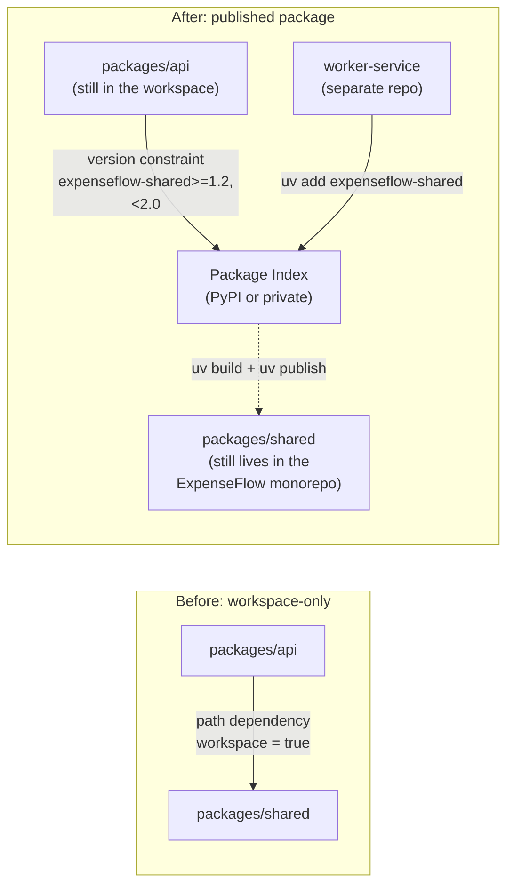

# Publishing Packages

[Chapter 15](./15-cicd-integration.md) wired ExpenseFlow's tests, linting, and migration-drift check into a GitHub Actions pipeline that runs on every pull request — the "does this change work" question is now automated. This chapter answers a different question: what happens when a piece of ExpenseFlow stops being "code that lives inside this one repository" and becomes "a package another team, another repository, or the public installs"? Back in [Chapter 12](./12-workspaces-and-monorepos.md), Priya and Marcus split ExpenseFlow into a `packages/api` and `packages/shared` workspace specifically so the background-worker service — a separate deployable, in a separate repository — could reuse `expenseflow-shared`'s Pydantic schemas and constants without copy-pasting them. A workspace path dependency solves that problem only as long as every consumer lives inside the same git repository and the same `uv.lock`. The moment the worker service moves to its own repository (or a second internal team wants to depend on `expenseflow-shared` without pulling in all of ExpenseFlow's API code), a path dependency stops being an option, and `expenseflow-shared` needs to become what it's conceptually already meant to be: an independently versioned, independently installable package. This chapter covers `uv build`, `uv publish`, trusted publishing, semantic versioning discipline, and the decision between a public and a private package index — using the extraction of `expenseflow-shared` as the worked example throughout.

---

## Learning Objectives

By the end of this chapter, you will be able to:

- Explain the difference between a source distribution (sdist) and a wheel, and produce both with `uv build`.
- Configure a `pyproject.toml`'s `[build-system]` section correctly for a library package, distinct from an application's.
- Choose and apply a semantic versioning scheme, and decide between a static `version` field and dynamic, VCS-derived versioning.
- Publish a package with `uv publish` using PyPI's trusted publishing (OIDC) flow, and explain why it's preferred over long-lived API tokens.
- Extract a workspace member into its own standalone, publishable package without breaking the workspace's remaining members.
- Decide, for a given internal package, whether a private index or public PyPI is the appropriate publishing target.

---

## Prerequisites for This Chapter

- **[Chapter 5: Project Creation & Structure](./05-project-creation-and-structure.md)** — `pyproject.toml` anatomy, and the application-vs-library project type distinction this chapter builds directly on.
- **[Chapter 7: Dependency Management](./07-dependency-management.md)** and **[Chapter 8: Lock Files & Reproducibility](./08-lock-files-and-reproducibility.md)** — version specifiers and what a lock file resolves, both relevant to how a published package's own dependency constraints are expressed.
- **[Chapter 12: Workspaces & Monorepos](./12-workspaces-and-monorepos.md)** — `expenseflow-shared`'s current existence as a workspace member with a path dependency from `packages/api`; this chapter's worked example assumes that starting point.
- **[Chapter 15: CI/CD Integration](./15-cicd-integration.md)** — the GitHub Actions workflow structure this chapter extends with a release job.

---

## 1. Why a Workspace Member Sometimes Needs to Leave the Workspace

A uv workspace ([Chapter 12](./12-workspaces-and-monorepos.md)) is the right tool exactly as long as every consumer of a shared member lives inside the same repository. `packages/api` depending on `packages/shared` via `{ workspace = true }` in `pyproject.toml` works because both are resolved together into one `uv.lock`, and `uv sync` at the workspace root keeps them in lockstep. That model breaks down the moment a consumer exists *outside* the workspace: ExpenseFlow's background-worker service, once it's promoted from "a script in the same repo" to its own deployable with its own repository and its own release cadence, can no longer reach into `packages/shared` via a relative path — there's no shared filesystem tree for a workspace member reference to resolve against, and no shared `uv.lock` to keep both consistent.

At that point, `expenseflow-shared` needs the two properties every independently consumable package needs:

- **Its own version number**, so a consumer can pin a compatible range (`expenseflow-shared>=1.2,<2.0`) instead of implicitly tracking whatever commit happens to be checked out.
- **Its own installable artifact** — a wheel (and an sdist as a source fallback) that `uv add expenseflow-shared` can resolve and install, the same way it resolves `fastapi` or `sqlalchemy` today.

This is a graduation, not a rewrite. `packages/shared` already has its own `pyproject.toml` from Chapter 12 (uv requires every workspace member to be a real, independent project on paper, even while it's resolved jointly). What changes is where that `pyproject.toml`'s output goes: instead of only ever being consumed via a workspace path reference, it's built into distributable artifacts and pushed to a package index.



Note the detail this diagram makes explicit: `packages/shared`'s *source* doesn't have to move out of the ExpenseFlow repository at all. Plenty of teams publish a package straight out of a subdirectory of a larger monorepo — what changes is the *release process* around it, not necessarily its location. ExpenseFlow keeps `packages/shared` exactly where it is; a new CI job builds and publishes it as its own artifact whenever its version is bumped.

---

## 2. Building Distributions with `uv build`

### 2.1 Two Artifact Types: sdist and Wheel

`uv build` produces two kinds of distribution artifacts from a single `pyproject.toml`, and understanding what each one is for avoids a category of confusion later:

| Artifact | File extension | Contents | Purpose |
|---|---|---|---|
| **Source distribution (sdist)** | `.tar.gz` | Source files, `pyproject.toml`, enough metadata to rebuild | The portable fallback — installable on platforms with no prebuilt wheel, and the thing a build backend actually builds *from* |
| **Wheel** | `.whl` | Pre-built, ready-to-install files (for a pure-Python package, just the Python source plus metadata) | What `uv add`/`pip install` actually installs in the overwhelming majority of cases — no build step needed at install time |

For a pure-Python library like `expenseflow-shared` (Pydantic schemas and constants, no compiled extensions), the wheel is effectively just the package's `.py` files plus a metadata directory — there's no compilation step, which is why pure-Python wheels are often called "universal" (one wheel works across platforms and Python versions, modulo the minimum version declared in `requires-python`).

### 2.2 Running `uv build`

```bash
cd packages/shared
uv build
```

```text
Building source distribution...
Building wheel from source distribution...
Successfully built dist/expenseflow_shared-1.0.0.tar.gz
Successfully built dist/expenseflow_shared-1.0.0-py3-none-any.whl
```

Both artifacts land in `dist/` by default. The `-py3-none-any` tag on the wheel reads as: built for Python 3 generally (`py3`), no specific ABI requirement (`none`), works on any platform (`any`) — exactly what you'd expect for a package with no compiled code.

### 2.3 The `[build-system]` Section

Every publishable package needs a `[build-system]` table telling any installer (uv, pip, or PyPI's own tooling) which build backend to invoke. `uv init --lib` (or converting an existing workspace member) scaffolds this correctly:

```toml
# packages/shared/pyproject.toml
[build-system]
requires = ["hatchling"]
build-backend = "hatchling.build"

[project]
name = "expenseflow-shared"
version = "1.0.0"
description = "Shared Pydantic schemas and constants for ExpenseFlow services"
readme = "README.md"
requires-python = ">=3.11"
license = { text = "MIT" }
authors = [
    { name = "ExpenseFlow Platform Team" }
]
dependencies = [
    "pydantic>=2.7,<3",
]

[tool.uv]
# still a workspace member locally, even though it's also published
```

Hatchling is uv's default build backend for `uv init --lib` and a reasonable default for a package with no compiled extensions; `setuptools` remains a valid, widely supported alternative if a team already standardizes on it elsewhere. The important structural point isn't which backend you pick — it's that this section exists at all and is standards-based (PEP 517/518), which is exactly why `uv build` works the same way regardless of backend: it reads `[build-system]`, invokes whatever's declared there, and produces the same two artifact types either way.

### 2.4 Verifying a Build Before Publishing

Before anything gets published, install the built wheel into a throwaway environment and confirm it actually works — this catches the class of bug where a file is missing from the package manifest (a common `MANIFEST.in`/`packaging` mistake, though `hatchling`'s default file discovery makes it less likely than with older tooling):

```bash
uv venv /tmp/verify-expenseflow-shared
uv pip install --python /tmp/verify-expenseflow-shared/bin/python \
    dist/expenseflow_shared-1.0.0-py3-none-any.whl
/tmp/verify-expenseflow-shared/bin/python -c "from expenseflow_shared.schemas import ExpenseCreate; print(ExpenseCreate)"
```

If this import fails on a fresh install from the built wheel but works fine from the workspace's editable install, that's a real signal — something the workspace's path-based resolution was silently papering over (a missing `__init__.py`, an implicit dependency on a sibling package that only worked because both were on the same `uv.lock`) is about to break for every real consumer.

---

## 3. Semantic Versioning Discipline

### 3.1 What SemVer Actually Commits You To

Semantic versioning (`MAJOR.MINOR.PATCH`) is a promise to consumers, not a cosmetic numbering scheme, and `expenseflow-shared` needs to honor it the moment a second team depends on it:

| Bump | When | Example |
|---|---|---|
| **PATCH** (`1.0.0` → `1.0.1`) | Bug fix, no API change | Fixing a validation regex in `ExpenseCreate` that was silently too permissive |
| **MINOR** (`1.0.1` → `1.1.0`) | Backward-compatible addition | Adding a new optional field to `ExpenseCreate` with a default value |
| **MAJOR** (`1.1.0` → `2.0.0`) | Breaking change | Renaming `ExpenseCreate.amount` to `ExpenseCreate.amount_cents`, or making a previously optional field required |

The discipline this buys the worker-service team is real: a `dependencies = ["expenseflow-shared>=1.2,<2.0"]` constraint in the worker's `pyproject.toml` means they can pull in bug fixes and new optional fields automatically via `uv lock --upgrade-package expenseflow-shared`, with a documented guarantee that nothing in that range breaks their existing code — and they know exactly when they need to pay attention (any `2.x` release) versus when an upgrade is safe to take without review.

### 3.2 What Breaks This Promise in Practice

The same rename mistake Alembic's autogenerate makes with columns has a direct analog here: a Pydantic model field rename that looks like a small, obviously-safe cleanup from inside the ExpenseFlow repo is a breaking change for every external consumer, because it changes the shape of every payload built with that model. Bumping only the patch version for a change like this — "it's just a rename, it's basically the same field" — is the single most common way a semver-versioned internal package quietly breaks a downstream team without anyone realizing a promise was broken. Field renames, removed fields, narrowed validation, and changed default values are all breaking changes regardless of how small the diff looks.

### 3.3 Static Version vs. Dynamic (VCS-Derived) Versioning

`pyproject.toml`'s `[project]` table supports two approaches to the `version` field:

**Static** — the version is a literal string you edit by hand for every release:

```toml
[project]
name = "expenseflow-shared"
version = "1.1.0"
```

This is simple and explicit, but it means bumping the version is a manual step someone has to remember, separate from tagging a release in git — a real source of "the git tag says v1.1.0 but the published package says 1.0.0 because someone forgot to bump `pyproject.toml`" mistakes.

**Dynamic** — the version is derived automatically from your version-control state (typically the latest git tag) at build time, using a plugin like `hatch-vcs`:

```toml
[project]
name = "expenseflow-shared"
dynamic = ["version"]

[build-system]
requires = ["hatchling", "hatch-vcs"]
build-backend = "hatchling.build"

[tool.hatch.version]
source = "vcs"
```

With this configuration, `uv build` derives the version from the current git tag (`v1.1.0` → package version `1.1.0`), and an untagged commit gets an automatically generated development version (something like `1.1.1.dev3+g1a2b3c4`). This ties the published version to the one source of truth a release process already needs to get right — the git tag — and removes an entire class of "forgot to bump the file" mistake, at the cost of a small amount of build-tooling indirection that a team needs to understand once. For a package with an infrequent, deliberate release cadence like `expenseflow-shared`, either approach is defensible; dynamic versioning earns its complexity once releases happen often enough that manual bumping becomes an actual source of errors.

---

## 4. Publishing with `uv publish`

### 4.1 Token-Based Publishing (the Older Model)

Historically, publishing to PyPI meant generating a long-lived API token in your PyPI account settings and passing it to the publish tool via an environment variable or config file:

```bash
export UV_PUBLISH_TOKEN="pypi-AgEIcHlwaS5vcmc...
uv publish
```

This works, but it means a secret capable of publishing new versions of your package under your name exists somewhere persistent — in a CI secret store, on a laptop, in a password manager — for as long as that token is valid, and if that secret ever leaks, an attacker can publish a malicious version of your package to every one of its consumers until someone notices and revokes it.

### 4.2 Trusted Publishing (OIDC) — the Modern Recommended Flow

PyPI's [trusted publishing](https://docs.pypi.org/trusted-publishers/) mechanism replaces the long-lived token with a short-lived credential negotiated at publish time via OpenID Connect (OIDC). Instead of storing a secret, you configure PyPI to trust a specific GitHub Actions workflow (identified by repository, workflow filename, and optionally environment) as a legitimate publisher for a specific project. When that exact workflow runs, GitHub's OIDC provider issues it a short-lived identity token, PyPI verifies that token against the trust relationship you configured, and issues a temporary publishing credential valid for that one run only.

```mermaid
sequenceDiagram
    participant GHA as GitHub Actions Workflow
    participant OIDC as GitHub OIDC Provider
    participant PyPI as PyPI

    Note over PyPI: Project owner pre-configures a trusted publisher:\nrepo=expenseflow/expenseflow-shared,\nworkflow=publish.yml, environment=release
    GHA->>OIDC: Request identity token for this workflow run
    OIDC-->>GHA: Short-lived signed OIDC token
    GHA->>PyPI: uv publish, presenting the OIDC token
    PyPI->>PyPI: Verify token matches a configured\ntrusted publisher for this project
    PyPI-->>GHA: Short-lived, single-use publishing credential
    GHA->>PyPI: Upload sdist + wheel using that credential
    PyPI-->>GHA: Publish succeeds; credential expires immediately after
```

Nothing here is a secret you have to store, rotate, or worry about leaking — the trust relationship lives in PyPI's project settings, tied to exactly which repository and workflow are allowed to publish, and the credential itself only ever exists for the duration of one workflow run. This is why trusted publishing is now the recommended default over token-based publishing for any project publishing from CI, which describes essentially every real team's release process.

### 4.3 Wiring Trusted Publishing Into ExpenseFlow's Release Workflow

Setting this up has two halves: a one-time configuration step on PyPI, and a workflow file in the repository.

**On PyPI** (one-time, per project): under the `expenseflow-shared` project's settings, add a trusted publisher specifying the GitHub repository (`expenseflow-team/expenseflow`), the workflow filename (`publish-shared.yml`), and — recommended — a GitHub Actions environment name (`release`) to scope which workflow runs are trusted.

**In the repository**, a dedicated release workflow, gated on a git tag push and requiring the `id-token: write` permission that makes OIDC token issuance possible:

```yaml
# .github/workflows/publish-shared.yml
name: Publish expenseflow-shared

on:
  push:
    tags:
      - "shared-v*"

jobs:
  publish:
    runs-on: ubuntu-latest
    environment: release
    permissions:
      id-token: write   # required for trusted publishing's OIDC handshake
      contents: read

    steps:
      - uses: actions/checkout@v4

      - name: Install uv
        uses: astral-sh/setup-uv@v3
        with:
          python-version: "3.13"

      - name: Run tests before publishing
        working-directory: packages/shared
        run: |
          uv sync --locked
          uv run pytest

      - name: Build distributions
        working-directory: packages/shared
        run: uv build

      - name: Publish to PyPI
        working-directory: packages/shared
        run: uv publish
        # No token needed — trusted publishing negotiates a short-lived
        # credential via OIDC using this workflow's identity
```

Two details matter here beyond the publish step itself. First, the release job re-runs the test suite (`uv sync --locked && uv run pytest`) rather than trusting whatever passed on a feature branch days earlier — a release gate should verify the exact commit being tagged, not assume CI history is still accurate. Second, gating on a tag push (`shared-v*`) rather than every push to `main` means publishing is a deliberate, named act — tagging `shared-v1.1.0` — not an automatic side effect of merging any change to `packages/shared`.

### 4.4 `uv publish`'s Actual Behavior

`uv publish` (invoked with no arguments, once trusted publishing or a token is configured) uploads every distribution file in `dist/` to the configured index, refusing to proceed if a file with that exact name and version already exists on the index — PyPI does not allow overwriting a previously published version, which is itself a useful safety property: once `expenseflow-shared==1.1.0` is published, it is published permanently, and a mistake in that release has to be fixed with a new version number, never by re-uploading over the old one.

---

## 5. Public PyPI vs. a Private Index

### 5.1 The Question ExpenseFlow's Team Actually Has to Answer

`expenseflow-shared` is not obviously a public-interest open-source library — it's internal business logic (expense-tracking Pydantic schemas, currency-handling constants specific to ExpenseFlow's domain) that happens to need distribution to more than one internal deployable. Publishing it to public PyPI is *possible* — nothing technically prevents it — but it's frequently the wrong choice for exactly this kind of package, for reasons worth naming explicitly rather than defaulting to "PyPI is where packages go."

| Consideration | Public PyPI | Private/internal index |
|---|---|---|
| Visibility | World-readable; anyone can `pip install expenseflow-shared` | Restricted to your organization/network |
| Name collision risk | Real — someone else may have already taken `expenseflow-shared`, or could squat a similar name later | None — you control the namespace entirely |
| Appropriate for | Genuinely reusable, general-purpose libraries you intend to support publicly | Internal business logic, proprietary schemas, anything with no public-interest audience |
| Credential model | Trusted publishing (Section 4.2) works cleanly | Depends on the index — often a token or internal auth scheme; some support OIDC too |
| Operational cost | None — PyPI is a shared public service | Someone runs and maintains the index (or pays for a hosted one) |

For ExpenseFlow specifically, `expenseflow-shared` is a strong candidate for a **private index** — it exposes internal domain modeling to the public internet for no benefit, and it carries the mild but real risk of a name collision or a confused external user filing an issue against a package that was never meant for them. A private, PyPI-compatible index (self-hosted options include `pypiserver` or a private registry from a package-index-as-a-service provider; many organizations already run one alongside their container registry) gets ExpenseFlow the same `uv build`/`uv publish`/`uv add` workflow with none of the public-exposure downside.

### 5.2 Configuring uv to Use a Private Index

Both publishing to and installing from a private index are configuration, not different commands — `uv build`, `uv publish`, and `uv add` all stay the same; only the index they target changes:

```toml
# packages/shared/pyproject.toml — declaring where this package publishes to
[[tool.uv.index]]
name = "expenseflow-internal"
url = "https://pypi.internal.expenseflow.example/simple"
publish-url = "https://pypi.internal.expenseflow.example/legacy/"
```

```bash
# Publishing explicitly to the named private index
uv publish --index expenseflow-internal

# A consumer (e.g. the worker-service repo) installing from it
uv add expenseflow-shared --index expenseflow-internal
```

Authentication against a private index is typically handled the same way as any other uv index credential — via environment variables (`UV_INDEX_EXPENSEFLOW_INTERNAL_USERNAME`/`_PASSWORD`) or a `.netrc` file — and, depending on the specific index product, some also support their own OIDC-based trusted publishing equivalent, in which case Section 4's setup applies with only the index URL changed.

### 5.3 A Middle Ground: Public PyPI With a Reserved, Scoped Name

Some teams split the difference by publishing genuinely reusable pieces (a currency-formatting helper with no ExpenseFlow-specific business logic, say) to public PyPI under a clearly scoped name, while keeping anything with real domain-specific logic on a private index. This isn't necessary for `expenseflow-shared` as it stands today — its schemas are ExpenseFlow-specific enough that there's no independent public audience for them — but it's a reasonable pattern to keep in mind if a piece of shared code later proves generic enough to be useful outside the project entirely.

---

## Real-World Scenario

**Setup:** ExpenseFlow's background-worker service — previously a script living inside the same repository — is being promoted to its own deployable, in its own repository, running on its own schedule (nightly currency-rate refreshes, recurring-expense processing). Marcus is assigned to make `expenseflow-shared` consumable from that new repository without duplicating its Pydantic schemas.

**Step 1 — confirming the extraction is warranted.** Marcus first checks whether this is genuinely a "leaves the workspace" situation or whether the worker service could simply become a third workspace member instead. It can't: the worker service's own repository, deploy pipeline, and release cadence are already established independently of ExpenseFlow's, and pulling it into the same workspace would mean a shared `uv.lock` across two repositories with no shared filesystem tree — exactly the scenario Section 1 describes as no longer a workspace-shaped problem.

**Step 2 — versioning decision.** Priya and Marcus agree on static versioning (Section 3.3) for now — `expenseflow-shared` releases are infrequent enough (a handful of times per quarter) that manually bumping `version` in `pyproject.toml` as part of the same PR that changes the schemas is a small, deliberate step, not a source of forgotten-bump errors. They note dynamic, VCS-derived versioning as a candidate to revisit if release frequency increases.

**Step 3 — private index decision.** Marcus checks Section 5's considerations against `expenseflow-shared`'s actual content: `ExpenseCreate`, `ExpenseRead`, currency-code constants, and a shared `Settings` base class — all clearly internal, ExpenseFlow-specific, with no public-interest audience. The team already runs a private package index alongside their container registry for another internal tool, so they add `expenseflow-shared` there rather than considering public PyPI at all.

**Step 4 — the release workflow.** Marcus adapts the trusted-publishing workflow from Section 4.3, pointed at the private index's OIDC-compatible trusted-publisher configuration (the private index product they use supports the same trust-relationship model PyPI does), gated on a `shared-v*` tag push, re-running `packages/shared`'s test suite before publishing.

**Step 5 — the first real release.** Marcus bumps `version = "1.0.0"` in `packages/shared/pyproject.toml`, tags `shared-v1.0.0`, and pushes the tag. The workflow runs, tests pass, `uv build` produces the sdist and wheel, and `uv publish` uploads both to the private index using the short-lived OIDC credential — no token ever touches a CI secret store.

**Step 6 — the worker service consumes it.** In the (separate) worker-service repository, Priya runs `uv add expenseflow-shared --index expenseflow-internal`, which resolves `expenseflow-shared==1.0.0` from the private index and adds it to the worker service's own `pyproject.toml`/`uv.lock` — completely independent of ExpenseFlow's workspace `uv.lock`, exactly as intended.

**Outcome:** `expenseflow-shared` now has an independent release cycle, a private and appropriately scoped distribution channel, and a versioning discipline that lets the worker-service team upgrade deliberately rather than tracking a moving target — while its source code never had to move out of the ExpenseFlow monorepo at all.

---

## Best Practices

- **Verify a built wheel by installing it into a clean environment before publishing** — a workspace's path-based resolution can hide packaging mistakes (missing files, implicit sibling-package assumptions) that only surface on a real, isolated install.
- **Treat any published version as immutable** — PyPI (and most private indexes) refuse to let you overwrite a version once published; a mistake gets fixed with a new version number, never a re-upload.
- **Prefer trusted publishing (OIDC) over long-lived API tokens** for any package published from CI — there's no secret to store, rotate, or leak.
- **Bump the version deliberately and correctly for the size of the change** — a field rename or removal is a MAJOR bump even when it looks like a small internal cleanup; get this wrong once and a downstream consumer's semver-based trust in your package is broken.
- **Gate publishing on a deliberate action (a version tag), not an automatic side effect of merging to `main`** — publishing should be a named, reviewable act.
- **Re-run the test suite in the release workflow itself**, rather than trusting that CI passed on some earlier commit — verify the exact commit being tagged and published.
- **Default internal, domain-specific packages to a private index rather than public PyPI** — there is usually no public-interest audience for them, and a private index avoids name-collision and unwanted-exposure risk entirely.

---

## Common Mistakes

- **Publishing a breaking change as a patch or minor version bump** — a renamed or removed field is a MAJOR change regardless of how small the diff looks from inside the repository that owns the package.
- **Forgetting to bump the version at all** with static versioning, publishing what is silently the same version number as the previous release (which most indexes will simply reject, at least catching the mistake before it does damage).
- **Storing a long-lived PyPI API token in CI secrets out of habit**, when trusted publishing is available and removes the need for a stored secret entirely.
- **Publishing an internal, domain-specific package to public PyPI by default**, without evaluating whether a private index is the better fit — exposing proprietary business logic and risking a name collision for no real benefit.
- **Skipping the "install the built wheel and verify it imports" check**, and discovering only after a real consumer's install fails that the package manifest was missing a file the workspace's editable install had been silently covering for.
- **Not re-running tests inside the release workflow**, assuming that if CI passed on the PR, the tagged commit is automatically safe to publish.

---

## Summary

- A workspace path dependency ([Chapter 12](./12-workspaces-and-monorepos.md)) only works within a single repository/lockfile; a consumer outside that boundary needs a genuinely independent, versioned package (Section 1).
- `uv build` produces an sdist and a wheel from a `[build-system]`-configured `pyproject.toml`; verify the wheel by installing it into a clean environment before publishing (Section 2).
- Semantic versioning is a promise to consumers — patch/minor/major bumps must reflect what actually changed, and a Pydantic field rename or removal is always a major change (Section 3).
- Static versioning is simple and explicit; dynamic, VCS-derived versioning (`hatch-vcs`) ties the published version to a git tag and removes a class of "forgot to bump" mistake (Section 3.3).
- `uv publish` with PyPI trusted publishing (OIDC) is the modern recommended flow over long-lived API tokens — no secret to store, rotate, or leak, and the trust relationship is scoped to a specific repository and workflow (Section 4).
- Whether to publish to public PyPI or a private/internal index is a real decision, not a default — internal, domain-specific packages like `expenseflow-shared` are usually better served by a private index (Section 5).
- The Real-World Scenario walked through extracting `expenseflow-shared` for a new, out-of-repo consumer end to end: versioning decision, private-index decision, trusted-publishing workflow, and the first real release.

---

## Knowledge Check

1. Why does `packages/api`'s workspace path dependency on `packages/shared` stop working once the worker service moves to its own repository? What specifically does a published package provide that a workspace path dependency cannot?
2. What is the difference between an sdist and a wheel, and why is verifying a built wheel in a clean environment a meaningful check beyond what a workspace's editable install already tells you?
3. A teammate renames `ExpenseCreate.amount` to `ExpenseCreate.amount_cents` and proposes bumping `expenseflow-shared` from `1.3.2` to `1.3.3`. What's wrong with that version bump, and what should it be instead?
4. Explain, in your own words, what a PyPI trusted publisher configuration actually trusts, and why that's a stronger security property than a stored API token.
5. Static versioning and dynamic (VCS-derived) versioning both have `uv build` derive a version string that ends up in the built artifact's metadata. What's the actual mechanical difference between the two, and what failure mode does dynamic versioning remove?
6. Give two concrete reasons `expenseflow-shared` is a better fit for a private index than public PyPI, specific to what that package actually contains.
7. Why does the worked example's release workflow re-run `packages/shared`'s test suite as part of the publish job, rather than relying on the tests that already passed when the corresponding pull request was merged?

---

## Hands-On Exercise

1. In a local clone of ExpenseFlow's workspace, convert `packages/shared` into a standalone, buildable project if it isn't already: confirm it has its own `pyproject.toml` with a `[build-system]` section (`hatchling` is a reasonable default) and a `version` field.
2. Run `uv build` from inside `packages/shared` and confirm both a `.tar.gz` and a `.whl` appear in `dist/`.
3. Create a throwaway virtual environment (`uv venv /tmp/verify-shared`) and install the built wheel into it directly with `uv pip install --python /tmp/verify-shared/bin/python dist/expenseflow_shared-*.whl`. Confirm you can import a schema from it in a Python one-liner.
4. Simulate a breaking change: rename a field on one of `expenseflow-shared`'s Pydantic models, and write down what version bump (major/minor/patch) that change actually requires, with a one-sentence justification.
5. Add a `[[tool.uv.index]]` block to `packages/shared/pyproject.toml` pointing at a placeholder private index URL (it doesn't need to be real for this exercise), and write the `uv publish --index <name>` command you'd run against it.
6. Sketch (in prose, no need to actually set it up) the one-time PyPI trusted-publisher configuration you'd need for a real release workflow: which repository, which workflow filename, and which environment name you'd register.
7. Write the GitHub Actions trigger condition (the `on:` block) you'd use to gate a real publish workflow on a version tag like `shared-v1.2.0`, rather than every push to `main`.

---

## Further Reading

- [uv Guides — Publishing a package](https://docs.astral.sh/uv/guides/) — the official walkthrough for `uv build`/`uv publish`.
- [uv Reference](https://docs.astral.sh/uv/reference/) — full CLI/configuration reference, including `[tool.uv.index]` and publish-related settings.
- [PyPI Trusted Publishers](https://docs.pypi.org/trusted-publishers/) — the authoritative reference on OIDC-based trusted publishing this chapter's Section 4 is built on.
- [PEP 621 — Storing project metadata in pyproject.toml](https://peps.python.org/pep-0621/) — the standard behind the `[project]` table's `version`/`dependencies` fields used throughout this chapter.
- [Python Packaging User Guide](https://packaging.python.org/) — background on build backends, sdists, wheels, and versioning conventions generally.

<div style="display:flex;justify-content:space-between;align-items:center;">
  <a href="./15-cicd-integration.md">← Previous: CI/CD Integration</a>
  <a href="./00-index.md">🏠 Index</a>
  <a href="./17-best-practices.md">Next: Best Practices →</a>
</div>
