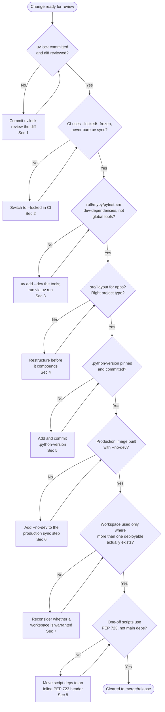

# Best Practices

[Chapter 16](./16-publishing-packages.md) closed out the production-integration arc: ExpenseFlow now has dependencies managed, a lockfile committed, a Docker image built, a CI/CD pipeline gating every change, and a path for `expenseflow-shared` to be published and consumed independently. Across those sixteen chapters you picked up a long list of individually sound recommendations — commit the lockfile, use `--locked` in CI, keep dev tools versioned per-project, pin the Python version — and each one made sense in the chapter that taught it, but none of them were ever gathered in one place. This chapter is that place. It's organized by theme rather than by chapter number, so it reads as a checklist you can actually run: before you open a pull request that touches `pyproject.toml`, before you write a new Dockerfile stage, before you hand a new engineer the repository and walk away. Chapter 18 is this chapter's mirror image — the same territory, described instead through the concrete failure modes you get when these practices are skipped under deadline pressure.

---

## Learning Objectives

By the end of this chapter, you will be able to:

- Recite a defensible, professional-grade checklist covering lockfile discipline, CI enforcement, dev-tooling reproducibility, project structure, Python version pinning, container hygiene, workspace scoping, and script isolation.
- Explain the reasoning behind each practice well enough to adapt it when your situation doesn't match the textbook case (a single-developer side project vs. a ten-engineer team behave differently in a few specific places).
- Run a structured review of a `pyproject.toml`/`uv.lock`/Dockerfile/CI workflow and identify the highest-severity gaps first.
- Recognize the small number of decisions that are effectively one-way doors once a team has scaled around them, and get them right early.
- Distinguish practices that are stylistic preference from the smaller set that are load-bearing for reproducibility, security, or production correctness.

---

## Prerequisites for This Chapter

This is a **synthesis** chapter. It assumes you've completed Chapters 1–16 and treats their content as settled ground — it distills what you've already learned into one operational reference, organized by theme:

- **[Chapter 4: Python Version Management](./04-python-version-management.md)** — `.python-version`, pinning, `uv python install`.
- **[Chapter 5: Project Creation & Structure](./05-project-creation-and-structure.md)** — `src/` layout, project types, `pyproject.toml` anatomy.
- **[Chapter 7: Dependency Management](./07-dependency-management.md)** and **[Chapter 8: Lock Files & Reproducibility](./08-lock-files-and-reproducibility.md)** — version specifiers, `uv.lock`, `--frozen`/`--locked`.
- **[Chapter 9: Running Code with `uv run`](./09-running-code-with-uv-run.md)** — PEP 723 inline scripts, `uv run --with`.
- **[Chapter 10: Development Dependencies & Tooling](./10-development-dependencies-and-tooling.md)** and **[Chapter 11: Tool Management & `uvx`](./11-tool-management-uvx.md)** — dev dependency groups vs. global `uv tool` installs.
- **[Chapter 12: Workspaces & Monorepos](./12-workspaces-and-monorepos.md)** — when a workspace earns its complexity.
- **[Chapter 14: Docker Integration](./14-docker-integration.md)** and **[Chapter 15: CI/CD Integration](./15-cicd-integration.md)** — multi-stage builds, layer caching, pipeline gates.
- **[Chapter 16: Publishing Packages](./16-publishing-packages.md)** — versioning and publishing discipline.

If any of these feel unfamiliar, a quick re-read before continuing will make this chapter considerably more useful — every practice below has a full chapter behind it if you need the complete explanation.

A handful of the decisions below are effectively **one-way doors** — cheap to get right at the start of a project, expensive to retrofit once a team, a CI pipeline, and a production deployment already depend on the wrong answer. Keep this short list in mind as you read the rest of the chapter; it's the fastest way to triage which section deserves the most attention in any given review:

| Decision | Reversible after the fact? | Where it's covered |
|---|---|---|
| Not committing `uv.lock` from day one | Recoverable, but every day without it is a day of unverified drift risk | Section 1 |
| Letting CI run bare `uv sync` | Recoverable, but a silent resolution difference may already have shipped | Section 2 |
| Installing `ruff`/`mypy`/`pytest` as global tools instead of dev dependencies | Recoverable, but every team member has to migrate individually | Section 3 |
| Choosing a flat layout over `src/` for an application | Painful, not impossible, to restructure once import paths are baked into tooling/CI | Section 4 |
| Adopting a workspace before you have more than one deployable unit | Recoverable, but the premature complexity has already been paid for | Section 7 |
| Shipping dev dependencies into a production image | Recoverable per-release, but each unnoticed release ships avoidable attack surface and bloat | Section 6 |

---

## 1. Lockfile Discipline

*(Builds on Chapter 8)*

- **Commit `uv.lock` to version control from the first commit, not after the project "matures."** `uv.lock` is what makes ExpenseFlow's dependency resolution reproducible across every developer's machine and every CI run — treating it as generated cruft to `.gitignore` (a common instinct carried over from language ecosystems without a strong lockfile culture) throws away the exact property a lockfile exists to provide.
- **Never hand-edit `uv.lock`.** It's a generated artifact reflecting a specific resolution; if you need a dependency to resolve differently, change the constraint in `pyproject.toml` and run `uv lock` (or let `uv add`/`uv sync` regenerate it) — editing the lockfile directly produces a file that no longer matches what the resolver would actually produce from your stated constraints, which is a subtler and harder-to-detect version of not having a lockfile at all.
- **Review lockfile diffs in pull requests, not just `pyproject.toml` diffs.** A one-line dependency version bump in `pyproject.toml` can cascade into dozens of changed transitive versions in `uv.lock` — worth a glance before approving, especially for anything security-sensitive.
- **Re-lock deliberately, in its own commit, when bumping a dependency** — `uv lock --upgrade-package <name>` targets a single package's resolution rather than silently re-resolving everything, keeping the diff reviewable and the change attributable to an actual decision.

```bash
# Deliberate, scoped upgrade — re-resolves only sqlalchemy and
# whatever it actually forces to change, not the entire lockfile
uv lock --upgrade-package sqlalchemy
git diff uv.lock   # review exactly what moved before committing
```

---

## 2. CI Enforcement Practices

*(Builds on Chapters 8 and 15)*

- **Use `uv sync --locked` (or `--frozen`, deliberately chosen) in every CI job — never a bare `uv sync`.** Chapter 8's "it worked on my machine" incident is the reason this matters: a bare `uv sync` is willing to silently re-resolve and produce a different set of versions than what's actually committed in `uv.lock`, which means CI can pass against dependencies no developer ever actually tested against.
- **Know the precise difference between `--locked` and `--frozen`, and choose deliberately.** `--locked` fails the command if `uv.lock` would need to change to satisfy `pyproject.toml` — the right default for CI, since a lockfile that's silently out of date is exactly the drift you want caught, loudly, before anything else runs. `--frozen` skips even checking whether the lockfile is up to date and installs exactly what's there — useful for a fast, read-only verification step (like a build cache warm-up) where you've already validated the lockfile elsewhere in the same pipeline.
- **Restore uv's cache between CI runs**, keyed on the lockfile's hash, so a cold CI runner isn't re-downloading and re-resolving the same dependency set on every single push — `astral-sh/setup-uv`'s built-in caching handles this correctly out of the box.
- **Fail the build on a lockfile that doesn't match `pyproject.toml`, and treat that failure as equally serious as a failing test** — it means someone edited a dependency constraint without regenerating the lockfile, which is precisely the condition `--locked` exists to catch.

```yaml
# .github/workflows/ci.yml excerpt — the CI-safe sync
- name: Install uv
  uses: astral-sh/setup-uv@v3

- name: Sync dependencies (fails loudly on lockfile drift)
  run: uv sync --locked   # never: uv sync

- name: Run checks
  run: |
    uv run ruff check
    uv run mypy
    uv run pytest
```

---

## 3. Dev-Tooling Reproducibility Practices

*(Builds on Chapters 10 and 11)*

- **Keep `ruff`, `mypy`, and `pytest` as versioned dev dependencies in `pyproject.toml`, never as global `uv tool install`s, for any project with more than one contributor.** This is the single most common point of confusion Chapter 11 named directly: a globally installed tool is whatever version happens to be on that machine, which means a developer's laptop and a CI runner can silently run different versions of the exact tools meant to guarantee consistency — the opposite of what those tools are for.
- **Add dev tools with `uv add --dev`, and run them exclusively through `uv run`**, so `uv run ruff check` always resolves to the exact pinned version in `uv.lock`, regardless of what (if anything) is installed globally on the machine running it.
- **Reserve `uv tool install`/`uvx` for genuinely global, cross-project utilities** — `cookiecutter`, `httpie`, a one-off script generator — things with no per-project version sensitivity, where running whatever the latest version happens to be is a feature, not a risk.
- **When in doubt about which category a tool belongs in, ask: "does it matter if two different people on this team run different versions of this against the same code?"** If yes (a linter, a type checker, a test runner — anything whose *output* is part of what CI gates on), it's a dev dependency. If no (a project scaffolder, a one-off HTTP client), a global tool is fine.

| Tool | Category | Why |
|---|---|---|
| `ruff` | Dev dependency | Linting/formatting output must be identical across every contributor and CI |
| `mypy` | Dev dependency | Type-checking results are part of what CI gates on |
| `pytest` | Dev dependency | Test collection/execution behavior must match exactly what CI runs |
| `pre-commit` | Dev dependency | Hooks should run the same versions locally that CI would separately enforce |
| `cookiecutter` | Global tool (`uv tool install`) | Project scaffolding — no shared-output correctness requirement across a team |
| `httpie` | Global tool (`uvx httpie ...`) | Ad-hoc manual HTTP exploration, not part of any automated check |

```bash
# Right: versioned, shared, identical everywhere uv run executes it
uv add --dev ruff mypy pytest pre-commit
uv run ruff check
uv run pytest

# Wrong for a team project: whatever version happens to be
# installed globally on this one machine
uv tool install ruff
ruff check   # not through uv run — not guaranteed to match CI's version
```

---

## 4. Project Structure Practices

*(Builds on Chapter 5)*

- **Use a `src/` layout for applications, not a flat layout**, exactly as `uv init` defaults to. The practical benefit isn't stylistic: a `src/` layout forces you to actually install the package (even in editable mode) to import it, which means your test suite exercises the installed package the same way a real consumer or a production container would — a flat layout makes it easy to accidentally test against the working directory's raw source in a way that hides packaging mistakes until they surface in production.
- **Keep application code and test code clearly separated** (`src/expenseflow/` and `tests/`, not tests interleaved into the package itself), so packaging tooling doesn't have to be taught to exclude test files from what actually ships.
- **Choose the project type deliberately at `uv init` time** — `--app` for ExpenseFlow's API service, `--lib` for `expenseflow-shared` — rather than accepting whichever default happens to apply and discovering later that the wrong type was scaffolded (Chapter 16's publishing workflow assumes a library-shaped `packages/shared`, not an application-shaped one).
- **Keep `pyproject.toml` as the single source of project metadata** — name, version, dependencies, tool configuration (`[tool.ruff]`, `[tool.mypy]`) all living in one standards-based file, rather than scattered across `setup.cfg`, `requirements.txt`, and tool-specific config files left over from a pre-uv toolchain.

---

## 5. Python Version Pinning Practices

*(Builds on Chapter 4)*

- **Pin the Python version with a `.python-version` file at the project root, committed to version control**, so `uv run`/`uv sync` deterministically pick the same interpreter (3.13, for ExpenseFlow) on every machine — a developer's laptop, a new hire's first day, and every CI runner — without anyone needing to remember to set it up manually.
- **Install pinned versions via `uv python install` rather than relying on whatever Python happens to already be on the machine** (a system Python, a stray pyenv install, a container base image's default) — uv's `python-build-standalone` interpreters are consistent regardless of the host OS's own Python situation.
- **Upgrade the pinned version deliberately, in its own commit or PR, tested against the full suite** — not as an incidental side effect of an unrelated change, and not silently different between local and CI because one side updated `.python-version` and the other didn't notice.
- **Match the pinned version in the Docker base image and the CI matrix's primary version**, so "which Python does ExpenseFlow actually run on" has exactly one answer across every environment, with CI's matrix (Chapter 15's 3.11/3.12/3.13 testing) existing to verify compatibility *range*, not to leave the "real" version ambiguous.

```bash
# .python-version, committed at the project root
3.13

# Every teammate and CI runner gets the exact same interpreter,
# installed automatically the first time it's needed:
uv python install   # reads .python-version, installs if not already present
uv run python --version   # Python 3.13.x, guaranteed
```

---

## 6. Container Hygiene: Separating Dev Tooling From What Ships

*(Builds on Chapter 14)*

- **Use `--no-dev` when syncing dependencies for a production image layer**, so `pytest`, `ruff`, `mypy`, and `pre-commit` never appear inside the artifact that actually runs in production — Chapter 14's whole multi-stage pattern exists to make this the natural default rather than something you have to remember on every build.
- **Keep the dependency-installation layer separate from and ordered before the application-source-copy layer**, so changing a line of application code doesn't invalidate the (expensive) dependency-resolution layer's cache — copy `pyproject.toml`/`uv.lock` first, run `uv sync --frozen --no-dev --no-install-project`, *then* copy source and run the final `uv sync --frozen --no-dev`.
- **Set `UV_LINK_MODE=copy` inside container builds**, since the hardlink-based install uv uses by default to make local installs near-instant depends on source and destination sharing a filesystem — a property that doesn't survive a Docker `COPY` between build stages, where copying is the correct (and only correct) behavior.
- **Treat a production image's dependency manifest as an audit surface** — if a security scanner or a `pip list`-equivalent inside the running container ever shows `pytest` or `ruff`, that's a signal the `--no-dev` step was missed somewhere in the build, not a harmless leftover.

```dockerfile
# Multi-stage pattern's key line, restated as a checklist item:
# --no-dev here is not optional for a production image
RUN uv sync --frozen --no-dev --no-install-project

# ...copy application source...

RUN uv sync --frozen --no-dev
```

---

## 7. Workspace Scoping Practices

*(Builds on Chapter 12)*

- **Reach for a uv workspace only once you actually have more than one deployable or independently importable unit** — ExpenseFlow stayed a single project through Chapters 1–11 precisely because there was nothing to share yet; the workspace split in Chapter 12 was justified specifically by the background-worker service needing `expenseflow-shared`'s schemas, not by an anticipated future need.
- **Resist splitting a workspace apart preemptively "in case we need it later."** A workspace adds real, permanent overhead — every member needs its own `pyproject.toml`, the team needs to understand path dependencies versus version constraints, and `uv sync` now resolves more surface area on every run — overhead that's easy to justify in hindsight and hard to justify in advance.
- **Use path dependencies (`{ workspace = true }`) between members that will always be resolved together, and a real published version constraint (Chapter 16) the moment a consumer exists outside the workspace** — the two mechanisms solve genuinely different problems, and reaching for the wrong one (a workspace member reference across repository boundaries, or a version pin between two things that always deploy together and should always be in lockstep) creates friction in both directions.
- **Revisit whether a workspace member still belongs in the workspace whenever its deployment story changes** — Chapter 16's extraction of `expenseflow-shared` for the worker service is exactly this: the moment a member needs an independent release cadence, it's a signal worth re-evaluating, not just a publishing detail.

---

## 8. Script Isolation Practices

*(Builds on Chapter 9)*

- **Use PEP 723 inline script metadata for genuinely standalone, one-off scripts** — ExpenseFlow's `backfill_currency.py` maintenance script needs `httpx` for exactly one script that has nothing to do with the main application's dependency set; declaring it inline keeps that dependency out of `pyproject.toml` entirely.
- **Don't add a script's one-off dependency to the main project just because it's convenient at the moment** — every dependency added to `pyproject.toml` is now something the whole team resolves, locks, and ships (or has to remember to keep out of production) forever, for the sake of a script that might run once.
- **Use `uv run --with <package> script.py` for a truly ad-hoc, exploratory one-off** where even a PEP 723 header feels like too much ceremony — reserve the inline-metadata block for scripts that are expected to be run again, by someone else, later.
- **Keep standalone scripts out of `src/expenseflow/`** — a `scripts/` directory (or similar) signals clearly that these files aren't part of the installable package and aren't expected to be imported by application code.

```python
# scripts/backfill_currency.py
# /// script
# dependencies = ["httpx"]
# ///

import httpx
# ...one-off maintenance logic, isolated from ExpenseFlow's main deps...
```

```bash
# Runs with its own declared dependency, resolved into an ephemeral
# environment — nothing added to pyproject.toml or uv.lock
uv run scripts/backfill_currency.py
```

---

## 9. Load-Bearing vs. Stylistic: Knowing Which Bullet Deserves the Fight

Not every practice in this chapter carries the same weight, and treating all of them as equally non-negotiable is its own mistake — it burns social capital on the wrong hills and makes the genuinely important ones easier to dismiss as "just another style preference." A useful filter: ask what actually breaks, and for whom, if a given practice is skipped.

**Load-bearing — skipping these produces a real, often silent, correctness or security problem:**

- Committing `uv.lock` and enforcing `--locked` in CI (Sections 1–2) — skip this and reproducibility itself is gone, not just tidiness.
- Keeping `ruff`/`mypy`/`pytest` as dev dependencies rather than global tools (Section 3) — skip this and "CI passed" stops reliably meaning "the code is actually clean" for every contributor.
- `--no-dev` on production images (Section 6) — skip this and you ship avoidable attack surface and bloat into every release, silently, until a security scan happens to notice.

**Important but negotiable — reasonable teams can land in different places depending on context:**

- `src/` layout (Section 4) — genuinely valuable for applications with a real test/package boundary to enforce, but a tiny single-file utility script gains little from the ceremony.
- Workspace scoping (Section 7) — the "wait until you actually need it" guidance is directional, not absolute; a team that already knows with certainty it's building three services from day one has a reasonable case for starting with a workspace immediately rather than migrating into one later.

**Genuinely stylistic — worth a team-wide default, but not worth relitigating per PR:**

- Whether a `Makefile`/`justfile` wraps the common `uv run` incantations, or the team just documents the raw commands.
- Static versus dynamic (VCS-derived) versioning for a package like `expenseflow-shared` ([Chapter 16](./16-publishing-packages.md), Section 3.3) — either is defensible; the mistake is only in inconsistency, not in which one a team picks.

The practical use of this section is triage: when a code review comment pushes back on a lockfile hygiene issue and a `src/`-layout preference in the same pull request, the first is worth holding the line on; the second is worth a quick note and moving on, unless the team has a standing convention that says otherwise.

This distinction also matters for how a team introduces this chapter to someone new. Leading with all eighteen-plus bullets as equally mandatory reads as bureaucracy; leading with "here are the three things that will actually break something if you skip them, and here's everything else that's a reasonable default" reads as a team that understands its own tooling rather than one following a checklist by rote. The former produces compliance without understanding; the latter produces engineers who can correctly extend the checklist themselves the first time they hit a situation it doesn't explicitly cover.

| Category | Examples | What happens if skipped |
|---|---|---|
| Load-bearing | Commit `uv.lock`; `--locked` in CI; dev deps not global tools; `--no-dev` in production | Silent correctness/security regression, often undetected until an incident |
| Important, context-dependent | `src/` layout; workspace timing | Real cost, but the size of the cost depends on project scale/shape |
| Stylistic | `Makefile` wrapper; static vs. dynamic versioning | No functional cost either way, as long as the team is internally consistent |

---

### Diagram: Pre-Merge / Pre-Release Review



### Quick Command Reference

| Command | What it enforces | Section |
|---|---|---|
| `uv lock --upgrade-package <name>` | Scoped, reviewable dependency upgrades | 1 |
| `uv sync --locked` | CI fails loudly on lockfile drift | 2 |
| `uv add --dev <tool>` | Tool versions pinned and shared across the team | 3 |
| `uv init --app` / `uv init --lib` | Correct project type at creation time | 4 |
| `uv python install` (reading `.python-version`) | Identical interpreter everywhere | 5 |
| `uv sync --frozen --no-dev` | Dev tooling excluded from production images | 6 |
| `uv sync` (workspace root) | Whole-workspace resolution, only where warranted | 7 |
| `uv run script.py` (PEP 723 header) | One-off script deps isolated from the main project | 8 |

---

## Real-World Scenario

**Setup:** Priya is onboarding a new engineer, Diego, onto ExpenseFlow and uses this chapter's checklist to review the repository's current state before handing it over — a good habit independent of onboarding, but a natural forcing function for it.

**Lockfile discipline.** `uv.lock` is committed and up to date; recent PRs show reviewable, scoped diffs from `uv lock --upgrade-package` calls rather than sweeping unexplained re-resolutions. Section 1 passes cleanly.

**CI enforcement.** The GitHub Actions workflow uses `uv sync --locked` — but Priya notices a second, newer workflow (added for a documentation-generation job) uses a bare `uv sync`. **This is Issue #1**: it happens not to have caused a problem yet only because that particular job doesn't depend on anything version-sensitive, but it's a latent instance of exactly the drift risk Section 2 warns about, and it's fixed in five minutes by adding `--locked`.

**Dev-tooling reproducibility.** `ruff`, `mypy`, and `pytest` are all dev dependencies, added via `uv add --dev` and run through `uv run` in both CI and the documented local dev loop. Section 3 passes.

**Project structure.** ExpenseFlow uses `src/expenseflow/`; `packages/shared` was correctly scaffolded as a library. Section 4 passes.

**Python version pinning.** `.python-version` is committed and pins 3.13, matching both the Dockerfile's base image and CI's primary matrix leg. Section 5 passes.

**Container hygiene.** The Dockerfile correctly uses `--no-dev` in its final `uv sync` — but Priya finds that `UV_LINK_MODE` was never explicitly set. **This is Issue #2**: the build still works (uv falls back to a safe copy behavior when hardlinking isn't possible across the layer boundary), but it's implicit rather than intentional, and a future change to the base image or build context could silently change that behavior without anyone noticing. She adds an explicit `ENV UV_LINK_MODE=copy` to make the intent unambiguous rather than relying on uv's fallback.

**Workspace scoping.** The `packages/api` + `packages/shared` split is well-justified — the worker service genuinely needed it. Section 7 passes.

**Script isolation.** `backfill_currency.py` correctly uses a PEP 723 header for `httpx`, kept out of the main project's dependencies. Section 8 passes.

**Outcome:** Two real issues found — a documentation job's bare `uv sync` and an implicit rather than explicit link-mode setting — both minor individually, both exactly the kind of small drift this chapter's checklist exists to catch before either compounds into something a new engineer inherits without context.

---

## Best Practices

The condensed top-10 cheat sheet — the fastest possible pass through this chapter:

1. **Commit `uv.lock` from day one**; never hand-edit it; review its diffs in PRs.
2. **Use `uv sync --locked` (or a deliberate `--frozen`) in every CI job — never a bare `uv sync`.**
3. **Keep `ruff`/`mypy`/`pytest` as versioned dev dependencies, run via `uv run`** — never global `uv tool` installs for anything CI also checks.
4. **Use `src/` layout for applications**; choose `--app`/`--lib` deliberately at `uv init` time.
5. **Pin the Python version with a committed `.python-version` file**, matched across local, CI, and Docker.
6. **Use `--no-dev` for every production image layer**, and make `UV_LINK_MODE=copy` explicit inside containers.
7. **Adopt a workspace only once more than one deployable/importable unit actually exists** — not preemptively.
8. **Use PEP 723 inline metadata for standalone one-off scripts**, keeping their dependencies out of the main project entirely.
9. **Re-lock and upgrade dependencies deliberately and scoped** (`uv lock --upgrade-package`), never as an unreviewed side effect.
10. **Treat this checklist as a recurring review**, not a one-time setup step — re-run it whenever a project's shape changes (a new deployable, a new consumer, a new CI job).

---

## Common Mistakes

This chapter's list has a mirror image — every practice above corresponds to a specific, recurring failure mode when it's skipped. **[Chapter 18: Common Mistakes & Pitfalls](./18-common-mistakes-and-pitfalls.md)** catalogs those failure modes in full, Symptom/Root Cause/Fix style, including the exact scenarios this chapter only gestures at: a bare `uv sync` in CI silently resolving something different than what a developer tested locally, dev tooling shipped into a production image, global tool installs causing a version mismatch between CI and a laptop, an uncommitted lockfile, a Docker build confused by a hardlink assumption that doesn't survive a `COPY` layer, and ad-hoc `uv pip install` calls drifting an environment away from what `pyproject.toml`/`uv.lock` actually describe. If any bullet above felt abstract, the next chapter makes it concrete.

---

## Summary

- **Lockfile discipline** (Section 1): commit `uv.lock`, never hand-edit it, review its diffs, re-lock scoped and deliberate.
- **CI enforcement** (Section 2): `--locked` (or a deliberate `--frozen`) always, never a bare `uv sync`; cache restored between runs.
- **Dev-tooling reproducibility** (Section 3): `ruff`/`mypy`/`pytest` as versioned dev dependencies run via `uv run`, not global tools — the single most common point of team/CI version mismatch.
- **Project structure** (Section 4): `src/` layout for applications, deliberate `--app`/`--lib` project types, `pyproject.toml` as the single metadata source.
- **Python version pinning** (Section 5): a committed `.python-version`, matched across local/CI/Docker, upgraded deliberately.
- **Container hygiene** (Section 6): `--no-dev` for production layers, dependency-then-source layer ordering, explicit `UV_LINK_MODE=copy`.
- **Workspace scoping** (Section 7): adopt only once more than one deployable/importable unit exists; path dependencies within a workspace, version constraints once a consumer sits outside it.
- **Script isolation** (Section 8): PEP 723 inline metadata for standalone one-off scripts, keeping their dependencies out of the main project.
- **Load-bearing vs. stylistic** (Section 9): lockfile/CI enforcement/dev-tooling/`--no-dev` are non-negotiable; layout, workspace timing, and versioning style are context-dependent or genuinely a matter of team preference — triage accordingly.
- The **Real-World Scenario** showed this checklist catching two real, minor-but-real issues during an onboarding review — an unguarded CI job and an implicit rather than explicit container link-mode setting.
- Chapter 18 is this chapter's mirror image: the same territory, described through concrete failure modes instead of positive practices.

---

## Knowledge Check

1. Why is hand-editing `uv.lock` directly considered worse practice than simply not having a lockfile at all, even though both leave you without a fully trustworthy resolution record?
2. Explain the practical difference between `uv sync --locked` and `uv sync --frozen`, and give a concrete CI scenario where each is the more appropriate choice.
3. A teammate argues that installing `ruff` via `uv tool install` is fine because "everyone just runs `uv tool upgrade` periodically to stay current." What's the flaw in that argument, specific to what a CI pipeline and a developer's laptop each actually resolve?
4. Why does a `src/` layout catch packaging mistakes that a flat layout can hide, and at what point in a project's lifecycle does that difference actually matter?
5. What two container-specific settings does Section 6 call out as needing to be explicit rather than assumed, and what does each one actually control?
6. A team wants to adopt a uv workspace "to be ready" for a service they're planning to build next quarter, even though only one deployable exists today. What does Section 7 recommend instead, and why?
7. Why does a one-off maintenance script's dependency belong in a PEP 723 inline header rather than in `pyproject.toml`, even if the dependency (like `httpx`) is one the main project might plausibly use someday too?
8. Section 9 distinguishes "load-bearing" practices from "stylistic" ones. Pick one practice from each category and explain, concretely, what actually breaks (or doesn't) if a team decides to ignore it.

---

## Hands-On Exercise

Audit a local checkout of ExpenseFlow (or your own uv-managed project) against this chapter's checklist, section by section.

1. Run `git log -p -- uv.lock` (or inspect it in your editor) and confirm the lockfile is tracked in version control, not `.gitignore`d. Check whether recent diffs look like scoped, reviewable upgrades or large, unexplained re-resolutions.
2. Inspect every CI workflow file that runs `uv sync`. Flag any that don't pass `--locked` or `--frozen`, and fix them.
3. Run `uv tree --dev` (or inspect `pyproject.toml` directly) and confirm `ruff`, `mypy`, and `pytest` all appear under dev dependencies, not installed only via `uv tool list` on your own machine.
4. Confirm the project uses a `src/` layout, and that its `pyproject.toml` declares the correct project type for what it actually is (application vs. library).
5. Confirm a `.python-version` file exists at the project root, is committed, and matches the version pinned in the Dockerfile's base image and the CI workflow's primary matrix leg.
6. Inspect the production Dockerfile: confirm the final dependency sync uses `--no-dev`, and confirm `UV_LINK_MODE` is set explicitly rather than left to uv's default fallback behavior.
7. If the project has more than one workspace member, write one sentence justifying each member's existence as its own deployable/importable unit — if you can't write that sentence for a given member, that's a signal worth raising with the team.
8. Using Section 9's three-way categorization (load-bearing / important-but-context-dependent / stylistic), sort every gap you found in steps 1–7 into one of the three buckets, and address the load-bearing ones first.

---

## Further Reading

- [uv Documentation](https://docs.astral.sh/uv/) — the umbrella reference for everything this chapter consolidates.
- [uv Concepts](https://docs.astral.sh/uv/concepts/) — the authoritative reference behind this chapter's lockfile, dependency, workspace, and tool-management sections.
- [uv Guides](https://docs.astral.sh/uv/guides/) — Docker and CI/CD worked examples underpinning Sections 2 and 6.
- [astral-sh/setup-uv GitHub Action](https://github.com/astral-sh/setup-uv) — the caching and `--locked` patterns referenced in Section 2.
- [PEP 723 — Inline script metadata](https://peps.python.org/pep-0723/) — the standard behind Section 8's script-isolation practice.

<div style="display:flex;justify-content:space-between;align-items:center;">
  <a href="./16-publishing-packages.md">← Previous: Publishing Packages</a>
  <a href="./00-index.md">🏠 Index</a>
  <a href="./18-common-mistakes-and-pitfalls.md">Next: Common Mistakes & Pitfalls →</a>
</div>
