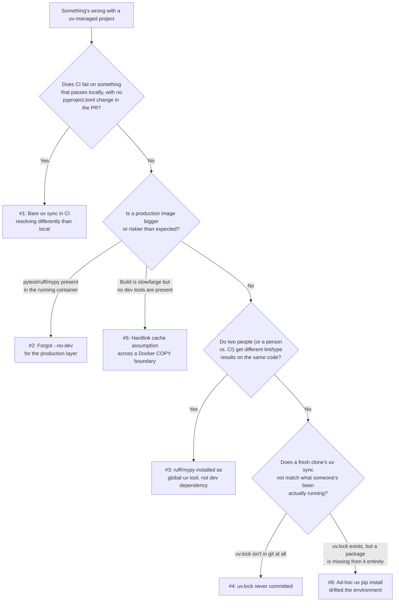

# Common Mistakes & Pitfalls

[Chapter 17](./17-best-practices.md) gave you a positive checklist — the things a well-run uv workflow does right, organized by theme. This chapter is the negative image of that checklist: a **failure mode catalog**. Every numbered section below documents one real, recurring mistake teams make with uv specifically — not typos, but structural misunderstandings that work fine on one machine and fail expensively somewhere else, usually the first time a change crosses a boundary (a teammate's laptop, a CI runner, a Docker build, a production deploy). Each mistake is told the way an incident report tells it: **Symptom** (what you'd actually observe — a confusing CI failure, a bloated image, a "works for me" argument), **Root Cause** (the misunderstanding that actually caused it), and **Fix** (the concrete change that prevents it, with before/after commands or code). Treat this chapter as a pre-mortem: if you recognize your own project in any section below, that's the chapter doing its job.

---

## Learning Objectives

By the end of this chapter, you will be able to:

- Recognize six common, production-grade uv mistakes from their symptoms alone, before digging into root cause.
- Explain *why* each mistake happens — usually a reasonable-sounding assumption that breaks down under a specific condition (a CI runner, a fresh clone, a Docker layer boundary).
- Apply the concrete fix for each mistake, including the exact uv commands or configuration changes involved.
- Distinguish mistakes that are recoverable after the fact (an uncommitted lockfile you can still commit today) from mistakes whose damage has already shipped (a production image that already contained `pytest` in a past release).
- Diagnose a real incident where two or more of these mistakes compound into one larger failure, and unwind them one at a time.
- Use this chapter's diagnostic tree to triage an unfamiliar uv-related incident against a known failure mode.

---

## Prerequisites for This Chapter

This chapter assumes you've worked through **Chapters 1–17** and treats their content as settled ground. In particular, it assumes fluency with:

- Lock files, `--locked`/`--frozen`, and what "resolution" actually means (**[Chapter 8: Lock Files & Reproducibility](./08-lock-files-and-reproducibility.md)**)
- Dev dependency groups versus global `uv tool` installs (**[Chapter 10](./10-development-dependencies-and-tooling.md)**, **[Chapter 11: Tool Management & `uvx`](./11-tool-management-uvx.md)**)
- The multi-stage Docker pattern, layer ordering, and uv's cache/link-mode behavior (**[Chapter 14: Docker Integration](./14-docker-integration.md)**)
- CI pipeline structure and what it should (and shouldn't) trust (**[Chapter 15: CI/CD Integration](./15-cicd-integration.md)**)
- The consolidated best-practices checklist (**[Chapter 17: Best Practices](./17-best-practices.md)**)

If any of those feel shaky, this chapter will still make sense at a narrative level, but the fixes will be more useful if you refresh the relevant chapter first — each section below links back to what it depends on.

A quick orientation before the detailed sections — which of these six mistakes are recoverable after the fact, and which have already done damage by the time they're noticed:

| # | Mistake | Recoverable after the fact? |
|---|---|---|
| 1 | Bare `uv sync` in CI resolving differently than local | Yes — switch to `--locked`; any already-shipped drift needs separate investigation |
| 2 | Missing `--no-dev` shipping dev tools into production | Only for future releases — a past image that already shipped is already out there |
| 3 | `ruff`/`mypy` as global `uv tool` installs, not dev dependencies | Yes — migrate to `uv add --dev`; requires every team member to update |
| 4 | `uv.lock` never committed at all | Yes, immediately — commit it; but every day without it was a day of unverified drift risk |
| 5 | Assuming hardlink cache behavior survives a Docker `COPY` boundary | Yes — set `UV_LINK_MODE=copy` explicitly; existing images should be rebuilt to verify size/time |
| 6 | Mixing ad-hoc `uv pip install` with `uv add`/`uv sync` | Yes, but requires reconciling the drifted environment against `pyproject.toml`/`uv.lock` by hand |

Mistakes #2 and #4 stand out for a reason: both involve something already having shipped or already having been absent for a period of time before anyone noticed, which is exactly why Sections 2 and 4 emphasize what to check retroactively, not just how to prevent recurrence.

---

## 1. Bare `uv sync` in CI Producing a Silently Different Resolution Than Local

**Symptom:** ExpenseFlow's test suite passes on Priya's laptop and fails in CI with an error that has nothing to do with the change in the pull request — a `TypeError` deep inside a dependency, or a subtly different behavior from a transitive package. Nobody changed `pyproject.toml` in this PR.

**Root Cause:** The CI workflow runs a bare `uv sync`, not `uv sync --locked` or `--frozen`. A bare `uv sync` is willing to re-resolve dependencies if it decides the current `uv.lock` doesn't perfectly satisfy `pyproject.toml`'s constraints under the resolver's current view of the package index — which can happen for reasons that have nothing to do with your code: a new compatible release of a transitive dependency was published since the lockfile was last regenerated, and an unpinned or loosely pinned constraint (`>=`, not `==`) lets the resolver pick it up. CI ends up testing against a dependency set that was never actually locked, committed, or verified by anyone — exactly the "it worked on my machine" scenario [Chapter 8](./08-lock-files-and-reproducibility.md) first introduced, except now it's CI itself that's silently drifted, not a second developer's machine.

**Fix:** Use `uv sync --locked` in every CI job. `--locked` fails the command outright if `uv.lock` would need to change to satisfy `pyproject.toml` — turning silent, invisible drift into an immediate, loud CI failure that tells you exactly what's wrong (the lockfile is out of date) instead of leaving you to debug a mysterious test failure with no connection to the actual cause.

```yaml
# Wrong: CI may resolve something no developer ever tested against
- run: uv sync

# Right: CI fails loudly and immediately if uv.lock doesn't already
# satisfy pyproject.toml — no silent re-resolution, ever
- run: uv sync --locked
```

If the failure genuinely is a legitimate new transitive version, the fix is still not to let CI silently absorb it — regenerate the lockfile deliberately and locally (`uv lock`), review the diff, and commit it as its own reviewable change, so the new version was actually chosen by someone rather than picked up as a side effect of a CI run.

---

## 2. Forgetting `--no-dev` and Shipping `pytest`/`ruff` Into Production

**Symptom:** A security scan of ExpenseFlow's production container image flags `pytest`, `ruff`, and several of their transitive dependencies as present in a runtime image that should only need `fastapi`, `sqlalchemy`, `asyncpg`, and their runtime dependencies. The image is also noticeably larger than the team's own before/after comparisons from [Chapter 14](./14-docker-integration.md) suggested it should be.

**Root Cause:** The Dockerfile's final dependency-sync step ran a plain `uv sync --frozen` instead of `uv sync --frozen --no-dev`. Without `--no-dev`, uv installs every dependency group declared in `pyproject.toml`, including the `dev` group holding `pytest`, `ruff`, `mypy`, and `pre-commit` — tools that have no reason to exist inside a running production container and that meaningfully increase both the image's size and its attack surface (every dev dependency is one more package with its own transitive dependencies and its own potential CVEs, now present in a production runtime for no functional benefit).

**Fix:** Always pass `--no-dev` to the `uv sync` call that builds the final production layer of the image. Confirm the fix by actually inspecting the built image's installed packages, not just by reading the Dockerfile — a stale build cache or a copy-pasted Dockerfile stage elsewhere in the same repo can reintroduce this mistake silently.

It's worth being precise about why `--no-dev` and `--frozen` are both needed together and aren't substitutes for each other: `--frozen` controls whether uv is allowed to re-resolve against `pyproject.toml` (Section 1's concern), while `--no-dev` controls which dependency *groups* get installed at all, independent of resolution behavior. A production sync missing `--no-dev` but correctly using `--frozen` still faithfully installs the exact locked versions — including the exact locked versions of `pytest` and `ruff`, which is precisely the bug this section describes. The two flags solve different problems and a correct production build needs both.

```dockerfile
# Wrong: installs the dev group too — pytest/ruff/mypy end up in production
RUN uv sync --frozen

# Right: production image gets only what the application actually needs at runtime
RUN uv sync --frozen --no-dev
```

```bash
# Verify after building — this should NOT list pytest, ruff, or mypy
docker run --rm expenseflow:latest uv pip list
```

This is worth checking any time a new Dockerfile stage is added or an existing one is copy-pasted for a new service (the worker service, say) — the mistake reproduces easily anywhere `uv sync` is called without deliberately confirming `--no-dev` is present.

---

## 3. Global `uv tool` Installs for `ruff`/`mypy` Causing Silent Version Drift

**Symptom:** A pull request passes `ruff check` on Marcus's machine with zero warnings, but fails in CI with several lint errors on lines Marcus never touched. Marcus insists the code is clean; CI insists otherwise, and both are technically telling the truth about what they ran.

**Root Cause:** Marcus installed `ruff` via `uv tool install ruff` months ago and has been running bare `ruff check` (not `uv run ruff check`) directly from his shell ever since — a genuinely global install, upgraded (or not) independently of ExpenseFlow's `pyproject.toml`. CI, meanwhile, runs `uv run ruff check`, which resolves to whatever version is pinned as a dev dependency in `uv.lock`. Ruff has shipped new lint rules and rule-default changes across minor versions before; if Marcus's global install is newer (or older) than the project's pinned dev-dependency version, the two are running genuinely different tools that happen to share a name — [Chapter 11](./11-tool-management-uvx.md)'s central distinction, ignored in practice.

**Fix:** Add `ruff` (and `mypy`, `pytest`) as project dev dependencies via `uv add --dev`, and standardize on running them exclusively through `uv run` — never a bare global-tool invocation for anything CI also checks. This guarantees Marcus, Priya, any new hire, and CI are all resolving the identical pinned version from the same `uv.lock`, every time.

```bash
# Wrong: Marcus's personal, independently-versioned global install
uv tool install ruff
ruff check   # whatever version happens to be installed globally, right now

# Right: the project's own pinned version, identical for every contributor and CI
uv add --dev ruff
uv run ruff check   # always resolves to uv.lock's pinned ruff version
```

A useful team-wide habit: alias or document `uv run ruff check`/`uv run mypy`/`uv run pytest` as the *only* sanctioned way to invoke these tools against the project, so nobody reaches for a global install out of habit without realizing it silently opts them out of the team's version guarantee.

---

## 4. Not Committing `uv.lock` At All

**Symptom:** A new engineer clones ExpenseFlow, runs `uv sync`, and gets a working environment — but three weeks later, a bug that "shouldn't be possible" turns out to be caused by a transitive dependency resolving to a materially different version than what everyone else on the team has, with no record anywhere of when or why the divergence happened.

**Root Cause:** `uv.lock` was never committed to version control — either `.gitignore`'d out of old habit (a reflex carried over from ecosystems without a strong committed-lockfile culture) or simply never added. Without a committed lockfile, every `uv sync` is implicitly a fresh resolution against whatever versions happen to be available on the package index *at that moment*, for every developer, on every machine, at whatever time they happen to run it. Two people running `uv sync` a week apart can get entirely different transitive dependency trees, and there is no artifact anywhere recording what either of them actually got.

**Fix:** Commit `uv.lock` immediately, and add it to the repository's tracked files if it isn't already. This is the single fastest fix in this entire chapter — one `git add uv.lock && git commit` — but it doesn't retroactively tell you what versions everyone has been running for however long the project went without it, which is why the real fix has two parts: commit it now, and separately verify (by comparing installed versions across the team, or simply having everyone re-`uv sync` against the newly committed lockfile) that everyone converges on the same, now-recorded resolution going forward.

```bash
# Check whether uv.lock is actually tracked
git check-ignore uv.lock   # if this prints "uv.lock", it's being ignored — fix .gitignore

git add uv.lock
git commit -m "Commit uv.lock for reproducible builds"
```

```gitignore
# .gitignore — uv.lock should NEVER appear in here
.venv/
__pycache__/
# uv.lock   <- if you see this line, delete it
```

---

## 5. Assuming Hardlink-Based Cache Installs Survive a Docker `COPY` Layer Boundary

**Symptom:** ExpenseFlow's Docker image builds correctly and the application runs fine, but the build is noticeably slower and the resulting image noticeably larger than the team expected based on uv's usual near-instant, cache-backed installs — the speed and size benefits that made local `uv sync` calls feel almost free don't seem to be showing up in the container build at all.

**Root Cause:** On a single filesystem, uv's default install strategy links a package's files from its global, content-addressable cache into a project's `.venv` using hardlinks (or copy-on-write reflinks where supported) — this is what makes installing an already-cached package into a new virtual environment nearly instant and nearly free of extra disk usage. That mechanism depends on the cache and the destination `.venv` living on the *same filesystem*. A Docker multi-stage build's `COPY --from=` instruction between stages does not preserve hardlinks the way a same-filesystem operation would — copying between build stages (or into the final image layer) is a genuine, full-content copy regardless of what linking strategy uv used to populate the source location. If uv's link mode isn't set explicitly, its automatic fallback behavior handles this safely, but leaving it implicit means nobody on the team actually decided how the container's install strategy behaves — and in less clear-cut configurations, this exact filesystem-boundary mismatch is a common source of confusing, hard-to-explain size or speed regressions specifically inside container builds, precisely because the same commands behave differently locally than inside a `COPY`-layered build.

**Fix:** Set `UV_LINK_MODE=copy` explicitly as an environment variable inside the Dockerfile, so the install strategy used during the container build is a deliberate decision rather than an implicit fallback nobody on the team consciously chose. This makes the container build's behavior predictable and documented, and removes any ambiguity the next time someone changes the base image or the build context and wonders why size/timing shifted.

```dockerfile
# Dockerfile — make the container's link strategy explicit
ENV UV_LINK_MODE=copy

COPY pyproject.toml uv.lock ./
RUN uv sync --frozen --no-dev --no-install-project

COPY src/ ./src/
RUN uv sync --frozen --no-dev
```

Pair this with the layer-ordering practice from [Chapter 14](./14-docker-integration.md) — copying `pyproject.toml`/`uv.lock` before application source — since an unexpectedly slow *rebuild* (as opposed to a slow first build) is usually that ordering being violated somewhere, a related but distinct mistake from the link-mode issue this section covers.

---

## 6. Mixing Ad-Hoc `uv pip install` With the Managed `uv add`/`uv sync` Workflow

**Symptom:** ExpenseFlow's local development environment works fine for Priya, but `uv sync` on a fresh clone doesn't produce an environment that matches what she's actually been running — a package she's clearly using in a recent feature (`httpx`, say) isn't in `pyproject.toml` or `uv.lock` at all, and nobody can explain how her environment got it.

**Root Cause:** At some point, instead of running `uv add httpx`, someone (possibly Priya herself, mid-debugging-session) ran `uv pip install httpx` directly — uv's lower-level, pip-compatible interface that installs a package into the current environment without touching `pyproject.toml` or `uv.lock` at all. This works in the moment (the package is genuinely importable afterward) but silently detaches the environment from the project's declared, managed dependency set — `uv sync` has no way to know `httpx` is supposed to be there, so a fresh `uv sync` on any other machine (or the same machine, if `.venv` is ever deleted and recreated) won't include it, and the project's own manifest is now lying about what the environment actually needs to run.

**Fix:** Use `uv add`/`uv remove` exclusively for anything that should persist as a real project dependency, reserving `uv pip install` for genuine, throwaway, "let me just check something" experimentation in a disposable environment that you don't expect `uv sync` to ever need to reproduce. If a `uv pip install`-based experiment turns out to be something the project actually needs, promote it properly with `uv add` immediately, not "later."

```bash
# Wrong: works right now, but pyproject.toml/uv.lock never find out
uv pip install httpx

# Right: the dependency becomes part of the project's managed,
# reproducible state — every teammate's uv sync will include it
uv add httpx
```

```bash
# Recovering from drift: compare what's actually installed against
# what the project declares, and reconcile by hand
uv pip list                    # what's really in the environment right now
cat pyproject.toml              # what the project claims it needs
# Anything present in the former but missing from the latter needs
# either `uv add`ing properly, or removing if it was genuinely throwaway
```

Once this kind of drift is suspected, the safest recovery is often to delete `.venv` entirely and run `uv sync` fresh — if the application still works afterward, nothing important was lost; if it doesn't, that failure is exactly the signal for which package needs to be properly `uv add`ed.

---

## Which Mistake Is It? A Diagnostic Decision Tree



### Which Process Control Would Have Caught It First

Every mistake in this chapter has a specific, mundane process control that catches it before it reaches production — none require exotic tooling, only the discipline to actually apply them every time:

| Mistake | Process control that catches it | Where it's automated |
|---|---|---|
| #1 — bare `uv sync` in CI | `--locked` flag on every CI sync | CI/CD pipeline, Chapter 15/17 Section 2 |
| #2 — missing `--no-dev` in production | Inspecting the built image's package list before shipping | Dockerfile review, Chapter 14/17 Section 6 |
| #3 — global tool installs, not dev deps | `uv add --dev` + `uv run` as the only sanctioned invocation | Code review norm + Chapter 11/17 Section 3 |
| #4 — uncommitted `uv.lock` | `.gitignore` review; confirming `uv.lock` is tracked | Repository hygiene check, Chapter 8/17 Section 1 |
| #5 — hardlink assumption across `COPY` | Explicit `UV_LINK_MODE=copy` in the Dockerfile | Dockerfile review, Chapter 14/17 Section 6 |
| #6 — ad-hoc `uv pip install` drift | Team convention: `uv add`/`uv remove` only, never bare `uv pip install` for anything persistent | Code review norm + onboarding documentation |

Notice that Mistakes #3 and #6 have no fully automated backstop — both depend on a team convention being consistently followed rather than a pipeline gate catching a violation, which is exactly why they're worth calling out explicitly in onboarding rather than assuming "the tooling will catch it."

---

## How These Mistakes Compound

None of the six mistakes above exist in isolation in a real incident — they tend to share a root enabling condition, which is exactly why a team that's fixed one in the past can still be surprised by a second. Recognizing the shared condition matters more than memorizing each mistake as a standalone item, because the fix for the shared condition prevents variants of all of them at once.

**Missing or weak CI enforcement is the condition that lets #1, #2, and #3 go unnoticed for the longest.** A CI pipeline that runs `uv sync --locked`, inspects the built production image's package list, and runs lint/type checks exclusively through `uv run` would catch all three of these the moment they're introduced — a bare `uv sync`, a missing `--no-dev`, and a stray global-tool habit are all, at bottom, gaps in what CI actually verifies rather than three unrelated problems. A team that treats "add one more CI check" as the fix for whichever single mistake just caused an incident, without asking what *category* of gap let it through, ends up patching the same underlying hole one symptom at a time.

**Copied, unreviewed patterns are the condition behind #2 and #5 specifically.** Both showed up in this chapter's worked incident from the same source: a Dockerfile stage adapted from an existing, working one, with a small but consequential detail silently dropped or left implicit in the process. Any time a Dockerfile, CI workflow, or `pyproject.toml` section is copy-pasted as a starting point for something new, that's precisely the moment to run this chapter's checklist deliberately rather than trusting that "it was already correct once" transfers automatically to the new copy.

**Stale or absent team documentation is the condition behind #3 and #6.** A convention that was true once ("we install ruff globally") and is no longer current, or a convention that was never written down at all ("obviously you should use `uv add`, not `uv pip install`"), leaves new team members with no way to discover the correct practice except by causing the failure it was meant to prevent. Both mistakes are cheap to prevent with documentation and expensive to diagnose without it — precisely because the symptom (a version mismatch, a drifted environment) looks like a mysterious bug rather than a process gap.

The practical takeaway: when you find one of these six mistakes in a real project, don't just fix the specific instance — ask which of the three enabling conditions above let it happen, and check whether that same condition is quietly enabling a second, not-yet-discovered mistake elsewhere in the same project.

A concrete way to apply this: after fixing any single instance of Mistake #2 (a missing `--no-dev`), don't just close the ticket — grep every Dockerfile and CI workflow in the repository for `uv sync` calls, and check each one against the checklist, since a copy-pasted pattern rarely exists in only one place by the time someone notices it. The same audit applies to Mistake #3: if one developer was found running a global `ruff` install, it's worth asking in a team channel whether anyone else is doing the same, rather than assuming the one report was the only instance.

```bash
# A five-second audit for latent Mistake #1/#2 instances across a repo,
# worth running any time one instance is found and fixed
grep -rn "uv sync" .github/workflows/ Dockerfile* 2>/dev/null
# Manually confirm every match includes --locked (CI) or --frozen --no-dev (production)
```

---

## Real-World Scenario

**Setup:** ExpenseFlow's platform team ships a routine Friday release: a small feature touching the expenses API, bundled with a Dockerfile change adding a new build stage for the background-worker service (copy-pasted from the API's existing Dockerfile as a starting point). Within an hour of deploy, two separate issues surface.

**Diagnosis — pulling the thread:**

The first report: a security scanning tool flags the newly built worker-service image as containing `pytest`, `ruff`, `mypy`, and their transitive dependencies — a runtime image that should only need `httpx` and `pydantic`. Investigating the copy-pasted Dockerfile stage, the on-call engineer finds it's exactly **Mistake #2** — whoever adapted the API's Dockerfile for the worker service copied the dependency-sync step but dropped the `--no-dev` flag while adjusting the surrounding lines, and nobody caught it in review because the rest of the Dockerfile looked correct.

The second report, arriving separately: a developer who joined the team two weeks ago says their local `ruff check` shows zero issues on a file that CI is failing with several lint errors. Investigating, it turns out the new developer followed an outdated onboarding note that said "install ruff with `uv tool install ruff`" — a leftover from before the team standardized on `uv add --dev`. This is **Mistake #3**: the new developer's global `ruff` install is a newer version than the one pinned in `uv.lock`, enforcing lint rules the project's actual pinned version doesn't yet apply.

**The fix, applied as two separate follow-up actions:**

1. For the missing `--no-dev`: the worker-service Dockerfile's sync step is corrected to `uv sync --frozen --no-dev`, the image is rebuilt, and `uv pip list` is run against the new image to confirm no dev-only packages remain before it's redeployed.
2. For the tooling mismatch: the new developer's global `ruff` install is uninstalled (`uv tool uninstall ruff`), replaced with the project's dev dependency (already present in `pyproject.toml` — they simply hadn't been using it), and the team's onboarding documentation is corrected to say `uv run ruff check`, not a global install, removing the outdated instruction that caused the confusion in the first place.

**Lesson:** Neither mistake was individually complex to explain, and neither required unusual conditions to trigger — a copy-pasted Dockerfile stage and a new developer following slightly stale onboarding notes. What made both worth a postmortem note is that they're exactly the kind of small, easy-to-miss drift this chapter's checklist exists to catch: a missing flag on an otherwise-correct command, and a convention that was documented once but not kept in sync with how the team actually works today.

---

## Best Practices

- **Make Chapter 17's checklist a gate, not a suggestion** — `--locked` in CI, `--no-dev` in production Dockerfiles, dev tools as project dependencies — especially on any new pipeline or Dockerfile stage, which is exactly where these mistakes tend to reappear even on a team that already knows better.
- **Treat any copy-pasted Dockerfile stage as a full re-review, not a trusted starting point** — Mistake #2's incident happened specifically because a working Dockerfile was adapted, not written fresh, and a flag was silently dropped in the process.
- **Keep onboarding documentation in sync with the team's actual current conventions**, and audit it whenever the team's own practices change — a stale instruction (Mistake #3) is exactly as damaging as no instruction at all, and more dangerous because it looks authoritative.
- **Verify `uv.lock` is tracked in version control on day one of any new project**, not as a later cleanup task (Mistake #4).
- **Make container link-mode and dependency-only layers explicit, never implicit**, so a build's behavior is a decision the team made, not a fallback nobody chose (Mistake #5).
- **Standardize on `uv add`/`uv remove` as the only sanctioned way to change a project's dependencies**, treating any `uv pip install` as disposable, throwaway experimentation that never persists past the current debugging session (Mistake #6).

---

## Common Mistakes

- **#1 — Bare `uv sync` in CI:** without `--locked`/`--frozen`, CI can silently re-resolve and test against dependencies no developer ever actually verified locally.
- **#2 — Forgetting `--no-dev` in a production image:** ships `pytest`/`ruff`/`mypy` and their transitive dependencies into a runtime that never needed them, inflating size and attack surface.
- **#3 — `ruff`/`mypy` as global `uv tool` installs instead of dev dependencies:** CI and a developer's laptop can silently run different tool versions, producing different lint/type results on identical code.
- **#4 — `uv.lock` never committed:** every `uv sync` becomes a fresh, unrecorded resolution, with no artifact anywhere capturing what any given machine actually installed.
- **#5 — Assuming hardlink cache behavior survives a Docker `COPY` boundary:** an unset link mode leaves the container build's install strategy as an implicit fallback instead of a deliberate, understood decision.
- **#6 — Mixing ad-hoc `uv pip install` with `uv add`/`uv sync`:** silently detaches the running environment from `pyproject.toml`/`uv.lock`, so a fresh `uv sync` elsewhere doesn't reproduce what one machine actually has.

---

## Summary

- This chapter is a failure-mode catalog: each numbered mistake follows the same shape — a reasonable-sounding shortcut, a symptom that surfaces later (often in a different environment than where the shortcut was taken), a root cause rooted in a real misunderstanding of how uv actually works, and a concrete fix.
- CI-trust mistakes (Section 1) come from letting CI's dependency resolution be more permissive than what was actually verified locally.
- Production-hygiene mistakes (Sections 2, 5) come from an incomplete or implicit understanding of what a container build actually ships and how its filesystem behavior differs from a local one.
- Team-consistency mistakes (Section 3) come from treating a project dependency and a global tool as interchangeable, when only one of them guarantees everyone runs the same version.
- Reproducibility-foundation mistakes (Section 4) come from never establishing the one artifact (`uv.lock`, committed) that makes any of the other guarantees in this course possible in the first place.
- Workflow-discipline mistakes (Section 6) come from reaching for a lower-level, unmanaged command out of momentary convenience, silently detaching the environment from the project's own declared state.
- These mistakes compound through three shared enabling conditions rather than occurring purely independently: weak CI enforcement (behind #1, #2, #3), copied/unreviewed patterns (behind #2, #5), and stale or absent team documentation (behind #3, #6) — fixing the enabling condition prevents more than just the one instance that surfaced.
- Real incidents are rarely one mistake in isolation — the Real-World Scenario showed a missing `--no-dev` flag and a stale onboarding instruction surfacing within the same release, both traceable to a working pattern being copied or documented once and never re-verified.
- The fastest way to avoid ending up in this chapter is to treat **[Chapter 17](./17-best-practices.md)**'s checklist as a pre-release gate, not a post-incident reading list.

---

## Knowledge Check

1. A CI job fails with a dependency-related error that has nothing to do with the current pull request's changes. What command should you check first in the CI workflow file, and what would you expect to find if this is Mistake #1?
2. Why does `--no-dev` matter specifically for a *production* image, when the same dev dependencies are perfectly appropriate (even necessary) in CI and local development?
3. Two engineers get different `ruff` results on the same file. One of them ran `uv tool install ruff` months ago; the other uses `uv run ruff check`. Explain exactly why they can disagree, and which of the two is actually running the project's intended version.
4. What specifically goes wrong, mechanically, when `uv.lock` is never committed to version control — not "reproducibility suffers" in the abstract, but what does a `uv sync` actually do differently on two different machines in that situation?
5. Why doesn't uv's hardlink-based install strategy work the same way across a Docker `COPY --from=` instruction as it does on a single local filesystem, and what environment variable makes the container's actual behavior explicit rather than an implicit fallback?
6. A developer runs `uv pip install requests` to quickly test something, and it turns out to become a permanent part of how a feature works. What's the correct next step, and what breaks later if that step is skipped?
7. Describe a realistic sequence of two compounding mistakes from this chapter that could surface within the same release, and explain why fixing them independently (without recognizing the shared root cause — a copied pattern or stale documentation never re-verified) might miss the real lesson.

---

## Hands-On Exercise

**Goal:** Reproduce Mistake #2 (forgetting `--no-dev`) locally, observe the consequence, then apply the correct fix.

1. Using a local ExpenseFlow-style project with `pytest`, `ruff`, and `mypy` as dev dependencies, write a minimal Dockerfile stage that (incorrectly) omits `--no-dev`:

```dockerfile
FROM python:3.13-slim
COPY --from=ghcr.io/astral-sh/uv:latest /uv /uvx /bin/
WORKDIR /app
COPY pyproject.toml uv.lock ./
RUN uv sync --frozen
COPY src/ ./src/
CMD ["uv", "run", "uvicorn", "app.main:app", "--host", "0.0.0.0"]
```

2. Build it and inspect what actually got installed:

```bash
docker build -t expenseflow-bad:latest .
docker run --rm expenseflow-bad:latest uv pip list
```

Confirm `pytest`, `ruff`, and `mypy` appear in the output — data you shouldn't want in a production image.

3. Fix the Dockerfile by adding `--no-dev`, rebuild, and confirm the difference:

```dockerfile
RUN uv sync --frozen --no-dev
```

```bash
docker build -t expenseflow-fixed:latest .
docker run --rm expenseflow-fixed:latest uv pip list
```

Confirm `pytest`/`ruff`/`mypy` no longer appear.

4. Compare `docker images` output for both tags — note the size difference, however small it is in this minimal example (it's typically much larger in a real project with heavier dev dependencies like `mypy`'s type stubs).
5. Now reproduce Mistake #1: change a CI workflow (or a local script simulating one) from `uv sync --locked` to a bare `uv sync`, and write one sentence explaining a realistic scenario under which this change could cause CI to pass against a dependency version nobody actually tested.
6. Check whether `uv.lock` is tracked in your own project's git repository (`git ls-files | grep uv.lock`). If it isn't, commit it now, following Section 4's fix.
7. Run the audit command from the "How These Mistakes Compound" section (`grep -rn "uv sync" .github/workflows/ Dockerfile*`) against your own project, and manually confirm every match includes the correct flag for its context (`--locked` in CI, `--frozen --no-dev` in a production image). Note any match that doesn't.
8. Write one sentence describing which of this chapter's six mistakes you consider the highest-risk for your own current project, and why — grounded in something specific about that project's actual setup, not a generic restatement of the chapter.

---

## Further Reading

- [uv Concepts — Projects and Locking](https://docs.astral.sh/uv/concepts/) — the authoritative reference behind Sections 1 and 4's lockfile behavior.
- [uv Guides — Docker](https://docs.astral.sh/uv/guides/) — the official multi-stage pattern and link-mode guidance behind Sections 2 and 5.
- [uv Reference](https://docs.astral.sh/uv/reference/) — full CLI/environment-variable reference, including `UV_LINK_MODE` and every flag discussed in this chapter.
- [astral-sh/setup-uv GitHub Action](https://github.com/astral-sh/setup-uv) — CI caching and sync patterns relevant to Section 1.
- [Python Packaging User Guide](https://packaging.python.org/) — background on the pip-compatible interface (`uv pip`) versus a managed project workflow, relevant to Section 6.

<div style="display:flex;justify-content:space-between;align-items:center;">
  <a href="./17-best-practices.md">← Previous: Best Practices</a>
  <a href="./00-index.md">🏠 Index</a>
  <a href="./19-capstone-projects.md">Next: Capstone Projects →</a>
</div>
