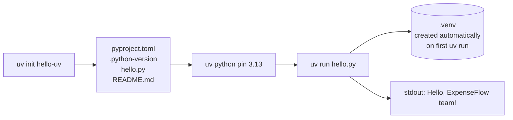
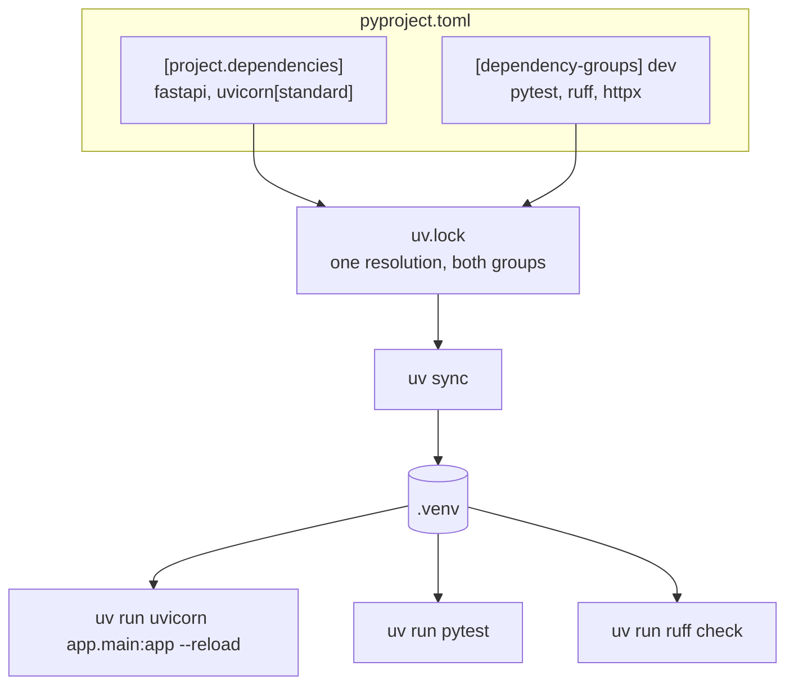
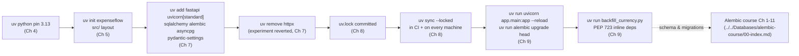
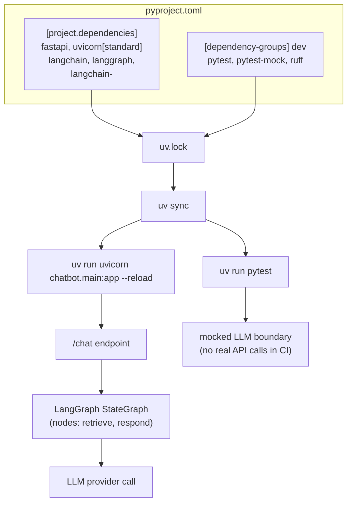
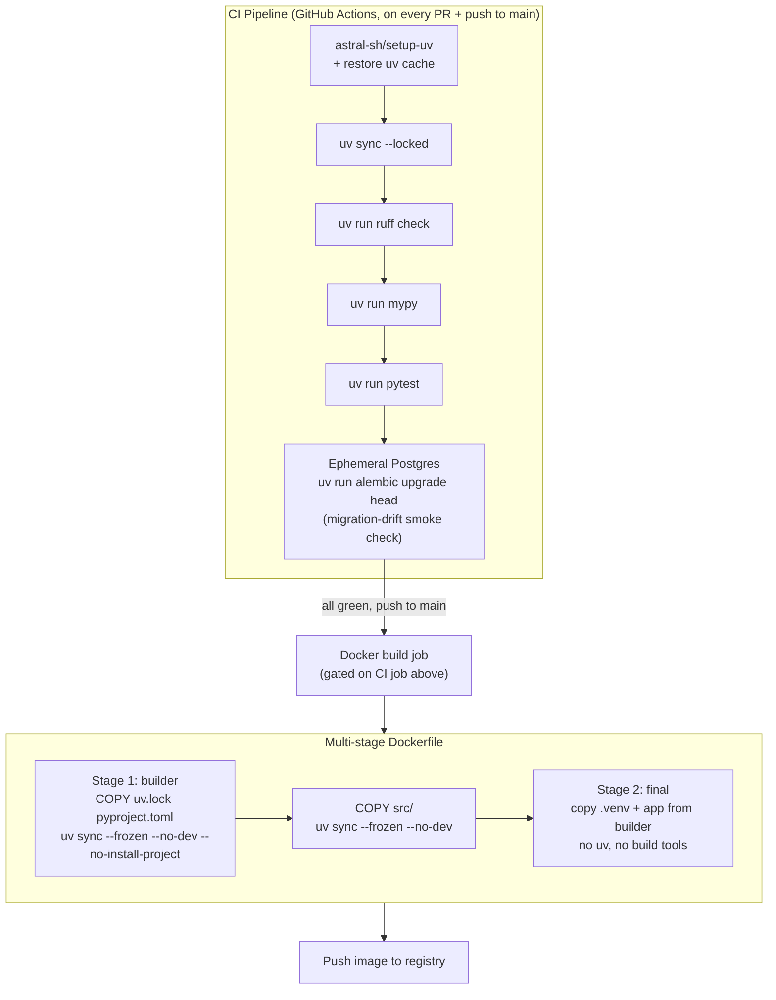
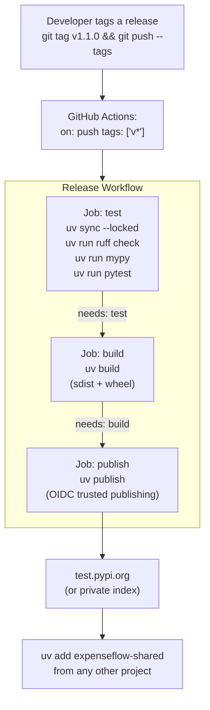

# Capstone Projects

Eighteen chapters have handed you every individual piece: what uv actually replaces and why it's architected around a real resolver and a global cache instead of pip+virtualenv's model (Ch 1–3), how to pin and manage Python versions without pyenv (Ch 4), how a project is created and structured (Ch 5–6), how dependencies are added, removed, and locked for reproducibility (Ch 7–8), how `uv run` executes code — including standalone PEP 723 scripts (Ch 9), how dev tooling and global tools are correctly separated (Ch 10–11), how workspaces structure a monorepo (Ch 12), how the whole stack wires into a real FastAPI + SQLAlchemy + Alembic application (Ch 13), how it's containerized and shipped through CI/CD (Ch 14–15), how packages get published (Ch 16), and the consolidated best practices and failure modes that wrap the whole course (Ch 17–[Common Mistakes & Pitfalls](./18-common-mistakes-and-pitfalls.md)). This chapter is where all of that stops being theory and becomes seven real, portfolio-worthy projects — from a single dependency-free script to a published, CI-gated internal package. Each project is a self-contained brief: requirements, architecture, folder structure, a phased implementation plan that points back to the exact chapter teaching each step, best practices to bake in from day one, and extensions to attempt once the core works. Build the seven projects in order — each one deliberately reuses the uv discipline built in the one before it, and Projects 3, 5, 6, and 7 together assemble, split, containerize, and finally publish pieces of the exact ExpenseFlow project this course has been building since Chapter 1.

---

## Learning Objectives

By the end of this chapter, you will be able to:

- Initialize a dependency-free uv project from nothing and run it with `uv run`, understanding every file `uv init` scaffolds
- Build a small FastAPI service with a correctly scoped runtime/dev dependency split, driven entirely through `uv run`
- Reconstruct ExpenseFlow's tooling layer end to end — Python pinning, project creation, dependency management, and lock-file discipline — exactly as this course built it
- Wire an AI framework (LangChain/LangGraph) into a uv-managed project and run both its dev server and its test suite through `uv run`
- Split a project into a uv workspace with a shared internal library consumed by more than one member
- Containerize and CI/CD-gate a uv-managed FastAPI application using the official Docker image pattern and a GitHub Actions pipeline
- Publish an internal package to a package index with `uv build`/`uv publish`, gated by a CI release workflow that refuses to publish if tests fail
- Recognize which mistakes from [Chapter 18](./18-common-mistakes-and-pitfalls.md) tend to resurface at each project tier, and design around them before they happen

## Prerequisites for This Chapter

This is the **synthesis chapter** of the course. It assumes you have completed Chapters 1 through 18 — no new uv theory is introduced here, only application. If an implementation step below references a mechanism you don't remember (the resolver, `uv.lock`, `--frozen` vs. `--locked`, PEP 723 scripts, workspaces, the Docker layer-caching pattern, trusted publishing), treat that as a signal to revisit the cited chapter, not to skip the step.

You will also need, practically:

- uv itself installed via the standalone installer, and a working understanding of `uv init`, `uv add`, `uv run` (Ch 1, Ch 5, Ch 9)
- For Project 3: a local PostgreSQL instance (Docker is fine) and comfort with this repo's sibling [Alembic course](../../Databases/alembic-course/00-index.md), since Project 3 explicitly reconstructs ExpenseFlow's schema/migration side from that course
- For Project 4: an API key for whichever LLM provider your LangChain/LangGraph graph targets (a mocked/offline test double is enough to complete the project without spending real API credits)
- For Project 6: Docker installed locally and a GitHub account (or equivalent CI system) for the workflow
- For Project 7: an account on PyPI's test index (`test.pypi.org`) or a private package index — no need to publish to real, public PyPI to complete this project
- Comfort reading Mermaid diagrams, since every project below is specified with one

Work through the seven projects **in order**. Each one deliberately reuses the project-scaffolding, dependency-management, and deployment instincts built in the one before it — jumping straight to Project 7 means re-learning fundamentals under the pressure of the hardest project in the course.

---

## Project 1 (Beginner): Hello World — Nothing But `uv init` and `uv run`

### Requirements

- The smallest possible uv project: one script, zero runtime dependencies
- A pinned Python version via `.python-version`, committed to version control
- Run entirely through `uv run` — no manual `source .venv/bin/activate`, ever
- A verified round trip: fresh clone → `uv run hello.py` works immediately, with no separate "install" step a teammate has to remember

### Architecture



The point of Project 1 is the smallest possible end-to-end loop: no dependencies to add, no lockfile changes to reason about, nothing to hide behind. If you can't explain every file this project produces, the rest of the capstones will feel like memorized commands instead of an understood model.

### Folder Structure

```text
hello-uv/
├── .python-version          # pins 3.13 for this project specifically (Ch 4)
├── pyproject.toml           # generated by `uv init`, minimal [project] table
├── hello.py                 # the one script
├── README.md                # scaffolded by `uv init`
└── .gitignore                # scaffolded by `uv init`, ignores .venv/
```

### Implementation Plan

1. **Run `uv init hello-uv`** and open every generated file before changing anything — `pyproject.toml`'s `[project]` table, the scaffolded `hello.py` (or replace its contents with your own), `.gitignore`, and `README.md` (Ch 5).
2. **Pin the Python version explicitly** with `uv python pin 3.13`, and confirm it wrote a `.python-version` file — this is the single line that guarantees every teammate and CI runner uses the same interpreter without installing pyenv (Ch 4).
3. **Write `hello.py`** to do something slightly more interesting than the scaffold — read a name from `sys.argv`, or print the interpreter version it's actually running under (`sys.version`), so the exercise proves which Python `uv run` picked, not just that a `print()` executed.
4. **Run `uv run hello.py`.** Watch uv create `.venv` automatically on first run if it doesn't exist yet — there is no separate `uv venv` step required for this project, since there's nothing to install into it (Ch 6, Ch 9).
5. **Delete `.venv` entirely and run `uv run hello.py` again**, confirming it recreates the environment and reruns without you doing anything else — this is the concrete proof that "did you forget to activate your venv" has stopped being a class of bug (Ch 6).
6. **Commit `pyproject.toml`, `.python-version`, `hello.py`, and `.gitignore`** — deliberately do *not* commit `.venv/` — and clone the repository into a fresh directory to confirm `uv run hello.py` works immediately with no manual setup step at all.

### Best Practices to Apply

- Pin the Python version with `uv python pin` even for a trivial project — the habit matters more than the project (Ch 4).
- Never manually activate `.venv` — use `uv run` for everything, from day one, so the instinct is already automatic by the time a project has real dependencies (Ch 6).
- Commit `.gitignore`'s exclusion of `.venv/` — a virtual environment is a disposable, regeneratable artifact, never something to check in.
- Keep `pyproject.toml` exactly as minimal as the project needs — resist adding sections "just in case" before there's a reason to (Ch 5).

### Extensions / Improvements to Try Next

- Convert `hello.py` into a PEP 723 inline script (add a `# /// script` block) and run it as a fully standalone file with `uv run hello.py`, even outside the project directory, foreshadowing Chapter 9's `backfill_currency.py` pattern.
- Add a single dependency (e.g., `rich` for colored output) via `uv add rich`, and observe `uv.lock` appear for the first time — this is the natural bridge into Project 2.
- Add a `[project.scripts]` entry point so `uv run hello` works without naming the file, previewing how ExpenseFlow's own CLI entry points will be defined later.
- Write a one-line `Makefile`/`justfile` target wrapping `uv run hello.py`, and discuss with a teammate whether it adds real value at this project's size (it usually doesn't yet — that judgment call itself is worth practicing).

---

## Project 2 (Beginner): A Small FastAPI API With Real Dev Tooling

### Requirements

- A FastAPI application with 2–3 runtime dependencies (`fastapi`, `uvicorn[standard]`, and optionally `httpx` for a test client) added via `uv add`
- Two or three endpoints: a `/health` check and a small `/items` CRUD-lite resource (in-memory storage is fine — this project is about the tooling, not persistence)
- `pytest` and `ruff` added correctly as **dev dependencies** (`uv add --dev`), never as global `uv tool install`s, so every teammate and CI run the exact same pinned versions (Ch 10, Ch 11)
- A working `uv run uvicorn app.main:app --reload` dev-server loop and a working `uv run pytest` test loop, both driven through `uv run`

### Architecture



### Folder Structure

```text
tiny-api/
├── app/
│   ├── __init__.py
│   └── main.py                  # FastAPI() app, /health and /items routes
├── tests/
│   ├── __init__.py
│   └── test_items.py            # uses FastAPI's TestClient / httpx
├── pyproject.toml                # [project.dependencies] + [dependency-groups] dev
├── uv.lock
├── .python-version
├── ruff.toml                     # or [tool.ruff] in pyproject.toml
└── README.md
```

### Implementation Plan

1. **Scaffold the project as an application, not a library** — `uv init --app tiny-api` — and pin its Python version to match ExpenseFlow's (`uv python pin 3.13`), even though this is a standalone practice project, so the habit stays consistent (Ch 4, Ch 5).
2. **Add runtime dependencies**: `uv add fastapi "uvicorn[standard]"`, and inspect `uv.lock` afterward — note every transitive dependency FastAPI itself pulls in that you never typed (Ch 7, Ch 8).
3. **Write `app/main.py`** with a `/health` endpoint returning `{"status": "ok"}` and a small in-memory `/items` resource supporting `GET`/`POST` — enough surface area to write a couple of meaningful tests against, not more.
4. **Add dev dependencies**: `uv add --dev pytest ruff httpx` — deliberately using `--dev`, not a plain `uv add`, so these never ship into a production artifact later (Ch 10, direct link forward to Ch 14).
5. **Write `tests/test_items.py`** using `httpx.Client` or FastAPI's `TestClient` against the app, covering the health check and at least one success and one failure case for `/items`.
6. **Run the full dev loop**: `uv run uvicorn app.main:app --reload` in one terminal, `uv run pytest` and `uv run ruff check` in another, confirming both draw from the exact same `.venv` `uv sync` produced (Ch 6, Ch 9, Ch 10).
7. **Run `uv sync --locked`** as a dry-run CI simulation, confirming the lockfile is fully up to date with `pyproject.toml` before you consider the project "done" (Ch 8).

### Best Practices to Apply

- Use `--dev` for `pytest`/`ruff`, never a project dependency add and never a global `uv tool install` — this is the decision this course's Chapter 11 spends a whole table resolving, and it matters from your very first real project (Ch 10, Ch 11).
- Run everything through `uv run` — the dev server, the linter, the test suite — so there is exactly one way anyone on the (even hypothetical) team runs this project (Ch 9).
- Commit `uv.lock` from the first commit onward, not "once dependencies stabilize" — there is no meaningful project state where an uncommitted lockfile is the right call (Ch 8).
- Keep the dependency count genuinely small (2–3 runtime, 2–3 dev) — this project's value is in getting the *shape* of dependency management right, not in building something feature-complete.

### Extensions / Improvements to Try Next

- Add `mypy` as a fourth dev dependency and wire a `uv run mypy app` step into the loop, matching ExpenseFlow's own tooling set (Ch 10).
- Add a `pre-commit` config whose hooks themselves invoke `uv run ruff check`/`uv run pytest`, so the checks run automatically before every commit (Ch 10).
- Convert `/items`' in-memory storage to a real SQLAlchemy + SQLite setup, as a stepping stone toward Project 3's full Postgres-backed ExpenseFlow.
- Containerize this tiny API with a minimal single-stage Dockerfile, before attempting Project 6's full multi-stage, CI-gated version.

---

## Project 3 (Intermediate): ExpenseFlow End-to-End — The Tooling Layer, Assembled

### Requirements

This project asks you to reconstruct, from a clean repository, **exactly the tooling journey this course narrated for ExpenseFlow across Chapters 1–9** — not a simplified stand-in, the actual sequence of uv operations a real team would run:

- **Phase 1 (Ch 1–4):** install uv via the standalone installer, pin Python 3.13 for the project with `uv python pin`
- **Phase 2 (Ch 5–6):** `uv init expenseflow`, inspect the generated `src/` layout and `pyproject.toml`, understand `.venv`'s automatic discovery
- **Phase 3 (Ch 7):** add ExpenseFlow's real runtime dependency set via `uv add` — `fastapi`, `uvicorn[standard]`, `sqlalchemy`, `alembic`, `asyncpg`, `pydantic-settings` — then simulate the team's real experience of removing an experimental dependency (`uv remove httpx` after trying it, then reaching for something else)
- **Phase 4 (Ch 8):** commit `uv.lock`, and deliberately reproduce the "it works on my machine" incident — resolve on one Python/uv version, then simulate a teammate on a different version running a bare `uv sync` and getting a different resolution, versus `uv sync --locked` catching it immediately
- **Phase 5 (Ch 9):** run the FastAPI dev server and `alembic upgrade head` through `uv run`, and write a standalone `backfill_currency.py` PEP 723 script needing `httpx` without touching the main project's dependencies
- **Schema/migration side:** this project deliberately does **not** re-teach SQLAlchemy models or Alembic migration mechanics — for the actual schema (the `users`/`expenses` tables, the revision history, `env.py` wiring), follow this repo's sibling [Alembic course](../../Databases/alembic-course/00-index.md) directly, starting from its own Chapter 1. This project's job is the tooling underneath that schema work, not a re-derivation of it.

### Architecture



### Folder Structure

```text
expenseflow/
├── src/
│   └── app/
│       ├── __init__.py
│       ├── main.py                    # FastAPI() app entrypoint
│       ├── core/
│       │   └── config.py              # pydantic-settings, reads DATABASE_URL
│       └── models/                    # SQLAlchemy 2.0 models — see Alembic course
├── alembic/
│   ├── env.py                         # see Alembic course Ch 4
│   └── versions/                      # see Alembic course Ch 5-11
├── scripts/
│   └── backfill_currency.py           # PEP 723 inline script, needs httpx only (Ch 9)
├── pyproject.toml                      # full dependency set from Ch 7
├── uv.lock
├── .python-version                     # 3.13
├── alembic.ini
├── docker-compose.yml                  # local Postgres for development
└── README.md
```

### Implementation Plan

1. **Install uv via the standalone installer** (not `pip install uv`), verify with `uv --version`, and pin the project's Python version with `uv python pin 3.13` before anything else exists (Ch 1, Ch 4).
2. **Run `uv init expenseflow`** and deliberately inspect the generated `src/app/` layout versus a flat layout, confirming you understand why uv defaults applications to `src/` (Ch 5).
3. **Add the full runtime dependency set in one sitting**: `uv add fastapi "uvicorn[standard]" sqlalchemy alembic asyncpg pydantic-settings`, then open `uv.lock` and find at least three transitive dependencies you didn't type yourself (Ch 7).
4. **Simulate the reverted experiment.** Add `httpx` temporarily (`uv add httpx`), imagine using it for an early outbound API call, then decide against it and run `uv remove httpx` — confirm `uv.lock` shrinks back down and no stray reference to `httpx` remains in `pyproject.toml` (Ch 7).
5. **Commit `uv.lock`**, then deliberately reproduce the "it worked on my machine" scenario: on a second local Python installation (or a Docker container running a slightly older uv/Python), run a bare `uv sync` and observe it resolve a *different* set of transitive versions than your first machine did; then run `uv sync --locked` instead and watch it fail loudly the moment the lockfile would need to change — this is the felt difference between the two commands, not just a definition (Ch 8).
6. **Bridge to the Alembic course.** Follow [`../../Databases/alembic-course/00-index.md`](../../Databases/alembic-course/00-index.md) from its own Chapter 1 to build the `users`/`expenses` models and the initial migration — do this work in the Alembic course's own terms, then come back here once you have a working `alembic upgrade head` locally.
7. **Run the day-to-day loop through `uv run`**: `uv run uvicorn app.main:app --reload` for the dev server, `uv run alembic upgrade head` to apply migrations — confirm both draw dependencies from the exact same `uv.lock`-resolved environment (Ch 9).
8. **Write `scripts/backfill_currency.py`** as a PEP 723 inline script with its own `# /// script` dependency block declaring `httpx`, and run it directly with `uv run scripts/backfill_currency.py` — confirm `uv.lock`/`pyproject.toml` are completely untouched by this, since the script's dependency lives entirely in its own inline metadata (Ch 9).

### Best Practices to Apply

- Install uv with the standalone installer, never `pip install uv` — uv needs to work before any Python/pip exists on a fresh machine or CI runner (Ch 1).
- Pin the Python version at project creation, not as an afterthought once something breaks on a teammate's machine (Ch 4).
- Use `uv sync --locked` (or `--frozen`) in any automated context, and reserve bare `uv sync` for genuinely exploratory local work where re-resolution is intended (Ch 8).
- Keep a standalone maintenance script's dependencies in its own PEP 723 block rather than adding them to the main project just because it's convenient in the moment (Ch 9).
- Never re-derive SQLAlchemy/Alembic mechanics inside a uv-focused project — cross-link to the Alembic course for that layer and keep this project's scope to tooling (this chapter's own discipline, applied to yourself).

### Extensions / Improvements to Try Next

- Follow the Alembic course through its Chapter 7–8 (autogenerate, hand-written revisions) to add `categories` and `tags`/`expense_tags` to this same project, keeping the uv side (dependency additions, lock discipline) consistent with what you practiced here.
- Add `uv add --dev pytest ruff mypy pre-commit` and build the one-command dev loop from Chapter 10 (`uv run ruff check && uv run mypy && uv run pytest`).
- Carry this exact project forward into Project 5 (workspace split) and Project 6 (Docker + CI/CD) below — both are designed to operate directly on the project this one produces.
- Try deliberately breaking `--locked`'s guarantee: hand-edit a version constraint in `pyproject.toml` without re-running `uv lock`, then run `uv sync --locked` and read the exact error it produces.

---

## Project 4 (Intermediate): AI Chatbot with LangChain/LangGraph, Driven by `uv run`

### Requirements

- A small chatbot service built on **LangChain** and **LangGraph**, added as runtime dependencies via `uv add langchain langgraph` (plus whichever model-provider integration package your graph targets)
- A minimal FastAPI wrapper exposing a `/chat` endpoint that invokes the LangGraph graph, so the project has both "a dev server" and "a library of graph logic" to reason about
- A **test suite** that mocks the LLM call boundary (so tests run offline, fast, and don't spend API credits) — added as a dev dependency, run via `uv run pytest`
- Both the dev server and the test suite driven entirely through `uv run` — this project's whole point is proving that uv's dependency model works identically for a fast-moving AI framework as it does for FastAPI/SQLAlchemy, with no special-casing

### Architecture



### Folder Structure

```text
expenseflow-chatbot/
├── src/
│   └── chatbot/
│       ├── __init__.py
│       ├── main.py                  # FastAPI() app, /chat endpoint
│       ├── graph.py                 # LangGraph StateGraph definition
│       └── llm.py                   # thin wrapper around the provider client
├── tests/
│   ├── conftest.py                   # fixture mocking the LLM boundary
│   └── test_graph.py
├── pyproject.toml
├── uv.lock
├── .python-version
├── .env.example                       # API key placeholder, never committed with a real key
└── README.md
```

### Implementation Plan

1. **Scaffold the project as an application** — `uv init --app expenseflow-chatbot` — and pin Python 3.13 to stay consistent with the rest of the course's ExpenseFlow ecosystem (Ch 4, Ch 5).
2. **Add the AI framework dependencies**: `uv add langchain langgraph langchain-<your-provider>` alongside `fastapi "uvicorn[standard]"` — inspect `uv.lock` afterward and note how much larger the transitive dependency tree is compared to Project 2's plain FastAPI app; this is a realistic, not contrived, example of why a correct resolver matters more, not less, as a dependency tree grows (Ch 7, Ch 8).
3. **Write `graph.py`** with a small `StateGraph` (even two nodes — a "retrieve context" node and a "generate response" node — is enough to demonstrate the pattern), and `llm.py` wrapping the actual model call behind a function that's easy to mock in tests.
4. **Wire `main.py`'s `/chat` endpoint** to invoke the compiled graph and return its final state's response text.
5. **Add dev dependencies for testing**: `uv add --dev pytest pytest-mock ruff`, and write `tests/test_graph.py` mocking `llm.py`'s call boundary so the test suite runs fully offline — no real API key or network call required to pass CI (Ch 10).
6. **Run the dev loop entirely through `uv run`**: `uv run uvicorn chatbot.main:app --reload` for manual testing against a real provider (using a real key from `.env`, never committed), and `uv run pytest` for the mocked, offline test suite — the same command shape as every other project in this chapter, regardless of how different the dependency tree underneath it is (Ch 9, Ch 10).
7. **Run `uv sync --locked`** as a final check, confirming the AI framework's fast-moving dependency set is exactly as locked and reproducible as ExpenseFlow's own dependency set was in Project 3 (Ch 8).

### Best Practices to Apply

- Treat LangChain/LangGraph and their provider-specific integration packages exactly like any other runtime dependency — added via `uv add`, resolved and locked in `uv.lock`, never installed ad hoc — since AI framework packages are, mechanically, ordinary PyPI packages (Ch 7).
- Mock the LLM call boundary in tests rather than hitting a real provider — this keeps `uv run pytest` fast, free, and deterministic, and is a testing-discipline concern layered on top of (not a special case of) uv's dependency management.
- Keep provider API keys in `.env`, read via `pydantic-settings` or plain `os.environ`, and never commit them — uv manages the dependency on the settings library, not the secret itself (a direct callback to Chapter 13's clarification of uv's scope).
- Pin the AI framework packages' versions deliberately once the project stabilizes — this ecosystem moves fast, and an unpinned `>=` constraint here is exactly the kind of under-constraint Chapter 7 warns causes real pain later.

### Extensions / Improvements to Try Next

- Add a second graph node calling a real external tool (a calculator function, a lookup against ExpenseFlow's own `/expenses` API from Project 3), and test it with the same mocking discipline.
- Add `uv run --with` to try a newer or alternative provider integration package for a one-off experiment without editing `pyproject.toml` at all (Ch 9).
- Extract `graph.py`'s reusable prompt-construction logic into a small internal library, foreshadowing Project 5's workspace pattern.
- Containerize this chatbot using the same multi-stage pattern from Project 6, and compare the resulting image size against ExpenseFlow's own — a heavier AI dependency tree is a realistic stress test of the Docker layer-caching discipline.

---

## Project 5 (Advanced): A uv Workspace Monorepo — `packages/api` + `packages/shared`

### Requirements

- Restructure ExpenseFlow (from Project 3) into a **uv workspace** with two members: `packages/api` (the FastAPI application) and `packages/shared` (a small internal library of Pydantic schemas and constants), mirroring [Chapter 12](./12-workspaces-and-monorepos.md) exactly
- `packages/api` depends on `packages/shared` via a **workspace member reference**, not a version-pinned PyPI dependency
- A single root `uv.lock` resolving both members together, and a single `uv sync` bringing up the whole workspace's environment at once
- A deliberate discussion, in your own words, of when this complexity is and isn't worth it versus simply splitting into separate repositories

### Architecture

```mermaid
flowchart TB
    subgraph ROOT["expenseflow-workspace/ (root pyproject.toml)"]
        WSCONFIG["[tool.uv.workspace]\nmembers = [\"packages/*\"]"]
    end
    subgraph API["packages/api"]
        APIPY["pyproject.toml\ndependencies = [\"expenseflow-shared\"]\n(workspace reference)"]
    end
    subgraph SHARED["packages/shared"]
        SHAREDPY["pyproject.toml\n--lib project\nPydantic schemas, constants"]
    end

    WSCONFIG -.discovers.-> API
    WSCONFIG -.discovers.-> SHARED
    APIPY -->|"workspace dependency,\nnot a version pin"| SHAREDPY
    API --> LOCK["one root uv.lock\nresolves both members together"]
    SHARED --> LOCK
    LOCK --> SYNC["uv sync\n(from repo root)"]
```

### Folder Structure

```text
expenseflow-workspace/
├── pyproject.toml                      # [tool.uv.workspace] members = ["packages/*"]
├── uv.lock                              # single lockfile for the whole workspace
├── .python-version
├── packages/
│   ├── shared/
│   │   ├── pyproject.toml               # --lib project, name = "expenseflow-shared"
│   │   └── src/
│   │       └── expenseflow_shared/
│   │           ├── __init__.py
│   │           ├── schemas.py           # Pydantic models shared by api + a future worker
│   │           └── constants.py
│   └── api/
│       ├── pyproject.toml               # --app project, depends on expenseflow-shared
│       └── src/
│           └── app/
│               ├── main.py
│               └── models/              # SQLAlchemy models (Project 3's schema)
└── README.md
```

### Implementation Plan

1. **Create the workspace root.** Starting from Project 3's `expenseflow` project, restructure it: create `packages/api/` and move the existing `src/app/` into it, then add a root `pyproject.toml` with `[tool.uv.workspace]` and `members = ["packages/*"]` (Ch 12).
2. **Scaffold `packages/shared` as a library**, not an application — `uv init --lib packages/shared` — and name it `expenseflow-shared`; this distinction matters because a library is meant to be imported by other packages, not run directly, unlike `packages/api` (Ch 5, Ch 12).
3. **Move ExpenseFlow's Pydantic request/response schemas and any shared constants** (currency codes, category defaults) out of `packages/api` and into `packages/shared/src/expenseflow_shared/`.
4. **Add the workspace dependency.** In `packages/api/pyproject.toml`, declare a dependency on `expenseflow-shared` — with `uv add expenseflow-shared --package packages/api` (or the workspace-source-based syntax) so uv records it as a workspace member reference rather than resolving it from PyPI (Ch 12).
5. **Run `uv sync` from the workspace root** and confirm it produces exactly one `uv.lock`, resolving both `packages/api` and `packages/shared`'s dependencies together in a single pass — inspect the lockfile and identify the section describing `expenseflow-shared` as a workspace source, not a registry package (Ch 12).
6. **Update imports in `packages/api`** to pull schemas/constants from `expenseflow_shared` instead of their old in-app location, and confirm `uv run uvicorn app.main:app --reload` (now run from `packages/api`, or via a root-level script) still works correctly.
7. **Deliberately discuss the trade-off.** Write a short note (a paragraph in the README is enough) on when this workspace structure earns its complexity — genuinely more than one deployable/importable unit sharing code — versus when a single project or fully separate repositories would have been simpler; this judgment call is exactly what Chapter 12 asks you to be able to make (Ch 12).

### Best Practices to Apply

- Reach for a workspace only once there are genuinely two or more importable/deployable units sharing code — don't split ExpenseFlow into a workspace just because it's now possible (Ch 12).
- Declare `packages/api`'s dependency on `expenseflow-shared` as a workspace reference, never a hand-pinned version — the whole point is that both members resolve and lock together, always in sync with each other (Ch 12).
- Keep `packages/shared` genuinely free of FastAPI/SQLAlchemy-specific code — a shared library used by more than one future service (an API and, eventually, a background worker) should not carry a dependency only one of its consumers needs.
- Run `uv sync` from the workspace root as the standard entry point for local development, so the whole workspace's environment stays consistent in one place.

### Extensions / Improvements to Try Next

- Add a third workspace member, `packages/worker`, a small background-worker skeleton that also imports from `expenseflow-shared`, proving the shared library serves more than one consumer for real (Ch 12).
- Run `uv run pytest` from the workspace root and confirm it can discover and run both `packages/api` and `packages/shared`'s test suites in one invocation.
- Carry this workspace structure forward into Project 7, where `packages/shared` is the exact package that gets extracted and published independently.
- Try deliberately introducing a version conflict between what `packages/api` and a new `packages/worker` each require of a shared third-party dependency, and observe how the single-resolution model surfaces it immediately rather than silently letting each member drift.

---

## Project 6 (Advanced): Fully Dockerized, CI/CD-Gated ExpenseFlow

### Requirements

This project combines [Chapter 14](./14-docker-integration.md) and [Chapter 15](./15-cicd-integration.md) into one operating pipeline for ExpenseFlow (Project 3's project, or Project 5's `packages/api` member):

- A **multi-stage Dockerfile** using the official `ghcr.io/astral-sh/uv` image pattern, with a dependency-only layer built via `uv sync --frozen --no-dev --no-install-project`, correct lockfile-before-source `COPY` ordering for cache hits, and a final `uv sync --frozen --no-dev` installing the project itself
- A **GitHub Actions CI workflow** using `astral-sh/setup-uv`, restoring uv's cache between runs, running `uv sync --locked`, `uv run ruff check`, `uv run mypy`, `uv run pytest`, and a migration-drift smoke check bridging to the Alembic course
- The Docker image build **gated on CI passing** — the image is only built and pushed if the lint/type-check/test/migration jobs all succeed first
- An image-size and build-time comparison between a naive (non-cached, non-`--no-dev`) build and the correctly layered, `--no-dev` production build

### Architecture



### Folder Structure

```text
expenseflow-dockerized/
├── src/app/                          # from Project 3 / Project 5's packages/api
├── alembic/                          # from the Alembic course
├── Dockerfile                        # multi-stage, uv-based build (Ch 14)
├── .dockerignore
├── docker-compose.yml                # local dev: app + Postgres
├── docker-compose.ci.yml             # ephemeral Postgres for CI's migration check
├── .github/
│   └── workflows/
│       └── ci.yml                    # lint, type-check, test, migration check, gated build
├── pyproject.toml
├── uv.lock
└── README.md
```

### Implementation Plan

1. **Write the multi-stage Dockerfile.** Stage 1 (`builder`): `COPY --from=ghcr.io/astral-sh/uv:latest /uv /uvx /bin/`, then `COPY pyproject.toml uv.lock ./` followed by `RUN uv sync --frozen --no-dev --no-install-project` — this produces a dependency-only layer that stays cached across builds as long as `pyproject.toml`/`uv.lock` don't change. Only *then* `COPY src/ ./src/` and run `uv sync --frozen --no-dev` to install the project itself into the same environment (Ch 14).
2. **Set `UV_COMPILE_BYTECODE=1` and `UV_LINK_MODE=copy`** as environment variables inside the Dockerfile, and explain in a comment why link mode matters here specifically: hardlinks from uv's cache don't survive across a `COPY` layer boundary the way they do on a single local filesystem, so `copy` mode is the correct choice inside a container build (Ch 3, Ch 14).
3. **Build a minimal final stage** copying only `.venv` and `src/` from the builder stage — no `uv` binary, no build tools, no dev dependencies — and set the container's entrypoint to `uvicorn app.main:app --host 0.0.0.0`.
4. **Measure image size and cold-build time** for this correctly layered build versus a naive single-stage `uv sync` (no `--frozen`, no `--no-dev`, no layer-ordering discipline), and record the before/after numbers in the README — this comparison is the concrete, felt proof that the layering discipline matters, not just a claim (Ch 14).
5. **Write the CI workflow.** Use `astral-sh/setup-uv` with cache restoration enabled, run `uv sync --locked` (never a bare `uv sync` in CI — Chapter 8's lesson applied), then `uv run ruff check`, `uv run mypy`, `uv run pytest` as separate steps so a failure clearly identifies which gate failed (Ch 15).
6. **Add the migration-drift smoke check.** Spin up an ephemeral Postgres service container in the workflow, run `uv run alembic upgrade head` against it fresh, and fail the build on any migration error — this bridges directly to the Alembic course's own CI chapter and Chapter 15's own migration-drift job (Ch 15).
7. **Gate the Docker build and push on every prior job succeeding** — express this as a `needs:` dependency in the workflow so the image build step literally cannot run unless lint, type-check, tests, and the migration check all passed first.
8. **Run the whole pipeline on a fresh PR** — open a small change, watch every gate execute in order, confirm the image only builds after the last test job goes green, and inspect the pushed image's size against your earlier before/after measurement.

### Best Practices to Apply

- Copy `pyproject.toml`/`uv.lock` before application source code in the Dockerfile, always — this is the entire reason the dependency layer stays cached across unrelated source-code changes (Ch 14).
- Use `--frozen --no-dev` for every production image build — `--frozen` guarantees the lockfile is used exactly as committed, `--no-dev` guarantees `pytest`/`ruff`/`mypy` never ship into the running container (Ch 14, direct link back to Ch 10).
- Use `uv sync --locked` in CI, never a bare `uv sync` — a CI run that silently re-resolves a different dependency set than what's committed defeats the entire purpose of the lockfile (Ch 8, Ch 15).
- Gate the Docker build on CI passing, not the other way around — an image should never be pushed before the code inside it has been proven to work (Ch 15).
- Set `UV_LINK_MODE=copy` explicitly inside any Dockerfile — relying on the default hardlink behavior across a `COPY` boundary produces confusing, inconsistent results (Ch 14).

### Extensions / Improvements to Try Next

- Add a matrix testing Python 3.11/3.12/3.13 using `uv python install` per matrix leg, confirming ExpenseFlow behaves identically across versions (Ch 15).
- Add a container image vulnerability scan (e.g., `trivy`) as a further gate before push, alongside the existing lint/type/test/migration gates.
- Push the built image to a registry tagged with the git SHA and, on tagged releases, also with a semantic version tag — a direct rehearsal for Project 7's release discipline.
- Add a staging deploy job, triggered only after the image is pushed, that runs `uv run alembic upgrade head` against staging as a single dedicated migration job — never as a side effect of the application container's own startup.

---

## Project 7 (Expert / Production-Grade Capstone): Publishing `expenseflow-shared` with a CI-Gated Release Workflow

### Requirements

This capstone combines [Chapter 16](./16-publishing-packages.md) and [Chapter 15](./15-cicd-integration.md):

- Extract `expenseflow-shared` (from Project 5's workspace) into its **own independently versioned, installable package** — no longer only a workspace member, but something `pip install expenseflow-shared` or `uv add expenseflow-shared` could resolve from an index
- Build it with **`uv build`** (producing both an sdist and a wheel) and publish it with **`uv publish`**, using **trusted publishing (OIDC)** as the modern, token-free flow, to `test.pypi.org` or a private index
- Semantic versioning discipline: a `[project.version]` bump for every release, following semver rules (patch/minor/major) based on the nature of the change
- A **CI release workflow**, triggered on a version tag, where the **publish step is a separate job that only runs if the test job succeeds first** — expressed as an explicit `needs:` gate, not a hope

### Architecture



### Folder Structure

```text
expenseflow-shared/
├── src/
│   └── expenseflow_shared/
│       ├── __init__.py
│       ├── schemas.py
│       ├── constants.py
│       └── py.typed                     # marks the package as typed
├── tests/
│   └── test_schemas.py
├── pyproject.toml                        # [project] name, version, [build-system]
├── uv.lock
├── .python-version
├── .github/
│   └── workflows/
│       └── release.yml                   # tag-triggered, test -> build -> publish
├── CHANGELOG.md
└── README.md
```

### Implementation Plan

1. **Extract `expenseflow-shared` from the workspace.** Copy `packages/shared/` (from Project 5) into its own standalone repository, with its own `pyproject.toml` — no longer a `[tool.uv.workspace]` member, but a genuinely independent package with its own `uv.lock` (Ch 12, Ch 16).
2. **Confirm the `pyproject.toml`'s `[build-system]` and `[project]` metadata are complete and correct** for a publishable package: `name`, `version`, `description`, `requires-python`, `dependencies`, and author/license metadata — this is the exact metadata `uv build` reads to produce a valid sdist and wheel (Ch 5, Ch 16).
3. **Run `uv build` locally first** and inspect the resulting `dist/expenseflow_shared-<version>-py3-none-any.whl` and the matching sdist — confirm both are present and that the wheel's contents (via `unzip -l` or an archive browser) contain exactly the package's source, nothing extraneous (Ch 16).
4. **Set up trusted publishing.** On `test.pypi.org` (or your private index's equivalent), configure a trusted publisher entry pointing at your GitHub repository and the specific workflow file that will run `uv publish` — this is the modern, token-free OIDC flow, replacing a long-lived API token stored as a repository secret (Ch 16).
5. **Write `release.yml`** with three distinct jobs: `test` (the same `uv sync --locked && uv run ruff check && uv run mypy && uv run pytest` sequence from Project 6, run here against this standalone package), `build` (`uv build`, uploading the resulting `dist/` as a workflow artifact), and `publish` (`uv publish`, using OIDC — no token secret needed) — with `build` declaring `needs: test` and `publish` declaring `needs: build`, so the publish step is mechanically incapable of running if the test job failed (Ch 15, Ch 16).
6. **Trigger the workflow on a version tag**, not on every push to `main` — configure `on: push: tags: ['v*']`, so a release is a deliberate, versioned action, never an accidental side effect of merging a PR.
7. **Cut the first real release.** Bump `[project.version]` to `0.1.0`, commit, tag `v0.1.0`, push the tag, and watch the workflow run end to end — confirm the package appears on `test.pypi.org` (or your private index) only after all three jobs report green.
8. **Deliberately break the test job** on a throwaway branch (introduce a failing assertion), tag a release from it, and confirm the `publish` job correctly never runs — this is the concrete proof that the gate works, not just a description of how it's supposed to.
9. **Consume the published package from a separate project**: `uv add expenseflow-shared` (pointed at your test index via `--index` if not using real PyPI) from a fresh scratch project, and confirm it resolves and imports correctly, exactly like any other third-party dependency would (Ch 7, Ch 16).

### Best Practices to Apply

- Use trusted publishing (OIDC) over a stored API token wherever the index supports it — there is no long-lived secret to leak, rotate, or scope incorrectly (Ch 16).
- Gate `publish` on `build`, and `build` on `test`, as explicit `needs:` dependencies in the workflow — never rely on job ordering alone, which does not enforce a dependency by itself (Ch 15, Ch 16).
- Trigger releases on version tags, not on every merge to `main` — a release should be a deliberate act with a deliberate version number attached, not an automatic consequence of routine development (Ch 16).
- Follow semantic versioning discipline strictly once the package has any external consumer at all: breaking changes bump the major version, additive-but-compatible changes bump minor, fixes bump patch (Ch 16).
- Include a `py.typed` marker file if the package ships type hints, so consumers' own type checkers pick up your package's types correctly.

### Extensions / Improvements to Try Next

- Automate `CHANGELOG.md` generation from conventional commit messages as part of the release workflow, so every tagged release has a human-readable summary attached automatically.
- Publish to a private, internal package index instead of public PyPI, and adjust `uv publish`'s `--index` configuration accordingly — this is frequently the more realistic choice for an internal library like `expenseflow-shared` that isn't meant for the wider public (Ch 16).
- Add a `dependabot`/`renovate`-style automated dependency-update PR workflow for `expenseflow-shared`'s own dependencies, and confirm the release gate correctly blocks a bad automated update from publishing.
- Re-integrate the now-independently-published `expenseflow-shared` back into `packages/api` from Project 5, this time as a genuine versioned PyPI/index dependency (`uv add expenseflow-shared>=0.1.0`) instead of a workspace path reference, and discuss which approach you'd actually recommend for a real two-service ExpenseFlow going forward.

---

## Real-World Scenario

Read the seven projects back to back and they trace the same arc a Python engineer walks as they grow into owning a team's tooling. Project 1 is the smallest possible fluency check: can you create a project, pin its Python version, and run something with `uv run` without ever typing `source .venv/bin/activate` — the muscle memory every later project assumes you already have. Project 2 is the first real assignment a junior engineer gets: a small service with actual dependencies, where the very first decision that matters — is `pytest` a project dependency or a global tool — has to be made correctly, not guessed at. Project 3 is the moment the engineer inherits ExpenseFlow itself, reconstructing the exact tooling journey Priya and Marcus's team walked from an empty directory to a locked, reproducible, `uv run`-driven application — and cross-linking to the Alembic course for the schema side is itself a lesson: knowing the boundary of what a tool is responsible for is as important as knowing the tool. Project 4 is what happens the first time that same engineer is asked to bolt an AI feature onto an existing product, and discovers, with some relief, that a fast-moving LangChain/LangGraph dependency tree is locked and resolved by uv exactly the same way FastAPI's was — no special ceremony required. Project 5 is the senior-level structural decision: the product has grown enough that a second service needs to share code with the first, and the engineer has to judge, not assume, that a workspace is actually worth its complexity here. Project 6 is the staff-level cross-team concern: leadership wants a container that's small, fast to build, and provably never contains `pytest`, wired to a CI pipeline that refuses to build an image out of code that hasn't been tested — turning "the Dockerfile works" into "the Dockerfile is correct by construction." Project 7 is the rare, highest-trust assignment: publishing a piece of internal infrastructure for other teams to depend on, where a broken release isn't a bug in one service, it's a bug in everyone's dependency tree at once — which is exactly why the publish step is the one most heavily gated of all seven projects. Very few engineers are handed Project 7 on day one, and the ones who succeed at it are almost always the ones who quietly built the muscle memory of Projects 1 through 6 first, even if nobody called them "capstones" at the time.

---

## Best Practices

- **Build incrementally, project by project.** The pin-and-run discipline from Project 1, the dev/runtime dependency split from Project 2, the lockfile discipline and PEP 723 fluency from Project 3, and the "AI dependencies are ordinary dependencies" instinct from Project 4 are exactly the building blocks Projects 5–7 assume you already have.
- **Commit `uv.lock` from the very first commit of every project**, not once dependencies "stabilize" — there is no project state in this chapter where an uncommitted lockfile is the right call.
- **Never let a production artifact (a Docker image, a published package) ship dev-only tooling.** `--no-dev` in Project 6's Dockerfile and the absence of `pytest`/`ruff` from `expenseflow-shared`'s runtime dependencies in Project 7 are the same discipline applied twice.
- **Treat CI validation as a design input from Project 3 onward, not a Project 6 or 7 afterthought.** `uv sync --locked` in CI costs almost nothing to add early; retrofitting it onto a project nobody has been protecting is a much bigger lift later.
- **Reuse rather than rewrite.** By Project 7 you should be extracting and republishing Project 5's `packages/shared`, not writing a new shared library from scratch — that reuse is itself evidence the earlier projects' lessons have become instinct.
- **Gate the risky, hard-to-reverse steps explicitly** — a Docker image push on CI passing (Project 6), a package publish on tests passing (Project 7) — with an actual `needs:` dependency in your workflow, never an assumption about ordering.
- **Document every non-default decision** — why a workspace was worth it here, why a dependency was added as `--dev` rather than runtime, why trusted publishing was chosen over a token — so a teammate or your future self can reconstruct the reasoning without re-deriving it.

---

## Common Mistakes

- **Reaching for a workspace (Project 5) before there are genuinely two importable/deployable units** — restructuring a single-service project into a workspace "because it's possible" adds real complexity for no real benefit.
- **Adding `pytest`/`ruff`/`mypy` as project dependencies or global `uv tool install`s instead of the `dev` dependency group** — repeated across Projects 2 through 7, this is the single most consequential decision this chapter keeps testing, because it determines whether CI and every teammate's laptop run the exact same tool versions.
- **Forgetting `--no-dev` when building the production Docker image (Project 6)** or when defining a publishable package's dependencies (Project 7) — shipping test/lint tooling into a container or a published package is a direct, avoidable bloat and, for a package, a confusing dependency surface for consumers.
- **Running a bare `uv sync` in any CI job across Projects 3, 6, or 7** instead of `--locked`/`--frozen` — silently re-resolving a different dependency set than what's committed defeats the exact guarantee the lockfile exists to provide.
- **Skipping the "does this gate actually work" verification** in Project 6 or Project 7 — never deliberately breaking a test on purpose to confirm the Docker build or the package publish correctly refuses to proceed, and only discovering the gate doesn't actually work the first time it matters.
- **Bloating the AI chatbot project's main dependency set (Project 4) with test-only mocking libraries** instead of keeping them in the `dev` group — the same mistake as Project 2, just easier to miss amid a larger, more exciting dependency tree.
- **Publishing a package (Project 7) with a stored long-lived API token** when trusted publishing (OIDC) was available and would have removed the secret-management burden entirely.

---

## Summary

- **Project 1** (Hello World) is a pure fluency check — one script, zero dependencies, a verified `uv init`/`uv run` round trip with no manual venv activation.
- **Project 2** (Small FastAPI API) introduces real dependency management with a correctly scoped runtime/dev split from the very first real project.
- **Project 3** (ExpenseFlow End-to-End) reconstructs this course's entire Chapters 1–9 tooling journey for the real running example, explicitly cross-linking to the Alembic course for the schema/migration side.
- **Project 4** (AI Chatbot) proves LangChain/LangGraph dependencies are managed identically to any other dependency, with `uv run` driving both the dev server and an offline, mocked test suite.
- **Project 5** (Workspace Monorepo) splits ExpenseFlow into `packages/api` + `packages/shared`, resolved and locked together as one workspace, mirroring Chapter 12.
- **Project 6** (Dockerized, CI/CD-Gated ExpenseFlow) combines Chapters 14–15 into one pipeline where a correctly layered, `--no-dev` production image only builds after every quality gate passes.
- **Project 7** (Publishing `expenseflow-shared`) combines Chapters 15–16 into a tag-triggered release workflow whose publish step is mechanically gated on tests passing first.
- Each project deliberately builds on the one before it: the pin-and-run instinct, the dependency-scoping discipline, and the CI-gating habits are meant to carry forward, so working through them in order is itself part of the curriculum.
- The recurring meta-lesson across all seven tiers is that **a committed lockfile, a correctly scoped dev dependency group, and an automated, verified gate are what separate "this should work for everyone" from "this is proven to work for everyone."**

---

## Knowledge Check

1. In Project 1, why does deleting `.venv` and re-running `uv run hello.py` prove something meaningful about uv's environment model, and what exactly does it prove?
2. In Project 2, what specifically goes wrong later — for a teammate, or for CI — if `pytest` and `ruff` are added as plain runtime dependencies instead of via `uv add --dev`?
3. In Project 3, walk through what `uv sync --locked` does differently from a bare `uv sync` in the "it worked on my machine" scenario, and why that difference is exactly what the sibling Alembic course's own CI-discipline chapter would also insist on for migrations.
4. In Project 5, what specific evidence would you look for in `uv.lock` to confirm that `packages/api`'s dependency on `expenseflow-shared` is a workspace reference and not an ordinary PyPI dependency?
5. In Project 6, name the two separate things that make the final Docker image both small and safe, and explain why `--no-dev` alone would not be sufficient without correct layer ordering as well.
6. In Project 7, explain exactly what would happen — mechanically, in the GitHub Actions workflow — if the `test` job failed, and why the `publish` job could not run regardless of what the `build` job's status was.
7. Across all seven projects, which single decision (dev dependency vs. runtime dependency vs. global tool) recurs the most often, and why does this chapter treat getting it right as more important than any individual command's syntax?

---

## Hands-On Exercise

Scaffold **Project 2 (A Small FastAPI API With Real Dev Tooling)** right now, end to end:

1. Run `uv init --app tiny-api`, then `uv python pin 3.13`.
2. Add runtime dependencies: `uv add fastapi "uvicorn[standard]"`.
3. Write `app/main.py` with a `/health` endpoint and a small in-memory `/items` resource supporting `GET` and `POST`.
4. Add dev dependencies: `uv add --dev pytest ruff httpx`.
5. Write `tests/test_items.py` covering the health check and at least one success and one failure case for `/items`.
6. Run the full loop: `uv run uvicorn app.main:app --reload` in one terminal; in another, `uv run ruff check` and `uv run pytest`.
7. Run `uv sync --locked` and confirm it reports no changes needed — your lockfile is fully in sync with `pyproject.toml`.
8. Commit `pyproject.toml`, `uv.lock`, `.python-version`, and your source/test files — deliberately excluding `.venv/` — and clone into a fresh directory to confirm the whole loop works immediately with no manual setup step.

Stop there for today — resist adding a database, a workspace split, or a Dockerfile until this small project's dependency scoping (runtime vs. dev) is completely automatic for you; that discipline is the foundation every later capstone in this chapter assumes you already have.

---

## Further Reading

- [uv Official Documentation](https://docs.astral.sh/uv/) — the reference you'll return to across every project in this chapter.
- [uv Getting Started Guide](https://docs.astral.sh/uv/getting-started/) — the canonical walkthrough behind Project 1 and Project 2's scaffolding steps.
- [uv Concepts](https://docs.astral.sh/uv/concepts/) — projects, dependencies, resolution, workspaces, tools, Python versions, and the cache, all referenced across Projects 1–7.
- [uv Guides (Docker, CI/CD, Scripts)](https://docs.astral.sh/uv/guides/) — the guides underlying Project 4's PEP 723 usage, Project 6's Dockerfile, and Project 6/7's CI workflows.
- [PyPI Trusted Publishers (OIDC publishing)](https://docs.pypi.org/trusted-publishers/) — the mechanism behind Project 7's token-free release workflow.
- [This repo's sibling Alembic course](../../Databases/alembic-course/00-index.md) — the schema/migration side Project 3 explicitly hands off to.

---

<div style="display:flex;justify-content:space-between;align-items:center;">
  <a href="./18-common-mistakes-and-pitfalls.md">← Previous: Common Mistakes & Pitfalls</a>
  <a href="./00-index.md">🏠 Index</a>
  <a href="./20-interview-preparation.md">Next: Interview Preparation →</a>
</div>
